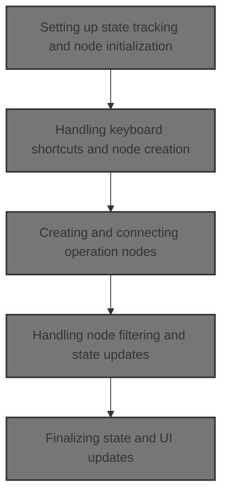

This document describes how users interact with the Explore page to visually build and modify trace data queries using nodes. User actions update the visual graph, with state changes tracked for <SwmToken path="ui/src/plugins/dev.perfetto.ExplorePage/explore_page.ts" pos="627:5:7" line-data="    // Handle undo/redo shortcuts">`undo/redo`</SwmToken>, enabling interactive exploration and filtering of trace data.



# Setting up state tracking and node initialization

```mermaid
%%{init: {"flowchart": {"defaultRenderer": "elk"}} }%%
flowchart TD
  node1{"Are SQL modules loaded?"}
  click node1 openCode "ui/src/plugins/dev.perfetto.ExplorePage/explore_page.ts:704:712"
  node1 -->|"No"| node2["Show loading message"]
  click node2 openCode "ui/src/plugins/dev.perfetto.ExplorePage/explore_page.ts:705:711"
  node1 -->|"Yes"| node3{"Is history manager initialized?"}
  click node3 openCode "ui/src/plugins/dev.perfetto.ExplorePage/explore_page.ts:715:719"
  node3 -->|"No"| node4["Initialize history manager and push initial state"]
  click node4 openCode "ui/src/plugins/dev.perfetto.ExplorePage/explore_page.ts:716:719"
  node3 -->|"Yes"| node5["Initialize node actions for all nodes"]
  click node5 openCode "ui/src/plugins/dev.perfetto.ExplorePage/explore_page.ts:744:747"
  node4 --> node5
  
  subgraph loop1["For each node in allNodes"]
    node5 --> node6["Initialize node actions"]
    click node6 openCode "ui/src/plugins/dev.perfetto.ExplorePage/explore_page.ts:746:747"
  end
  node5 --> node7["Render Explore Page UI and handle user actions"]
  click node7 openCode "ui/src/plugins/dev.perfetto.ExplorePage/explore_page.ts:749:833"
  node7 --> node8["Creating and connecting operation nodes"]
  
  node7 --> node9["Adding filters to nodes"]
  
classDef HeadingStyle fill:#777777,stroke:#333,stroke-width:2px;
click node8 goToHeading "Creating and connecting operation nodes"
node8:::HeadingStyle
click node9 goToHeading "Adding filters to nodes"
node9:::HeadingStyle

%% Swimm:
%% %%{init: {"flowchart": {"defaultRenderer": "elk"}} }%%
%% flowchart TD
%%   node1{"Are SQL modules loaded?"}
%%   click node1 openCode "<SwmPath>[ui/…/dev.perfetto.ExplorePage/explore_page.ts](ui/src/plugins/dev.perfetto.ExplorePage/explore_page.ts)</SwmPath>:704:712"
%%   node1 -->|"No"| node2["Show loading message"]
%%   click node2 openCode "<SwmPath>[ui/…/dev.perfetto.ExplorePage/explore_page.ts](ui/src/plugins/dev.perfetto.ExplorePage/explore_page.ts)</SwmPath>:705:711"
%%   node1 -->|"Yes"| node3{"Is history manager initialized?"}
%%   click node3 openCode "<SwmPath>[ui/…/dev.perfetto.ExplorePage/explore_page.ts](ui/src/plugins/dev.perfetto.ExplorePage/explore_page.ts)</SwmPath>:715:719"
%%   node3 -->|"No"| node4["Initialize history manager and push initial state"]
%%   click node4 openCode "<SwmPath>[ui/…/dev.perfetto.ExplorePage/explore_page.ts](ui/src/plugins/dev.perfetto.ExplorePage/explore_page.ts)</SwmPath>:716:719"
%%   node3 -->|"Yes"| node5["Initialize node actions for all nodes"]
%%   click node5 openCode "<SwmPath>[ui/…/dev.perfetto.ExplorePage/explore_page.ts](ui/src/plugins/dev.perfetto.ExplorePage/explore_page.ts)</SwmPath>:744:747"
%%   node4 --> node5
%%   
%%   subgraph loop1["For each node in <SwmToken path="ui/src/plugins/dev.perfetto.ExplorePage/explore_page.ts" pos="175:1:1" line-data="        allNodes: state.rootNodes,">`allNodes`</SwmToken>"]
%%     node5 --> node6["Initialize node actions"]
%%     click node6 openCode "<SwmPath>[ui/…/dev.perfetto.ExplorePage/explore_page.ts](ui/src/plugins/dev.perfetto.ExplorePage/explore_page.ts)</SwmPath>:746:747"
%%   end
%%   node5 --> node7["Render Explore Page UI and handle user actions"]
%%   click node7 openCode "<SwmPath>[ui/…/dev.perfetto.ExplorePage/explore_page.ts](ui/src/plugins/dev.perfetto.ExplorePage/explore_page.ts)</SwmPath>:749:833"
%%   node7 --> node8["Creating and connecting operation nodes"]
%%   
%%   node7 --> node9["Adding filters to nodes"]
%%   
%% classDef HeadingStyle fill:#777777,stroke:#333,stroke-width:2px;
%% click node8 goToHeading "Creating and connecting operation nodes"
%% node8:::HeadingStyle
%% click node9 goToHeading "Adding filters to nodes"
%% node9:::HeadingStyle
```



<SwmSnippet path="/ui/src/plugins/dev.perfetto.ExplorePage/explore_page.ts" line="699">

---

In <SwmToken path="ui/src/plugins/dev.perfetto.ExplorePage/explore_page.ts" pos="699:1:1" line-data="  view({attrs}: m.CVnode&lt;ExplorePageAttrs&gt;) {">`view`</SwmToken>, we set up the history manager if it doesn't exist, push the initial state for <SwmToken path="ui/src/plugins/dev.perfetto.ExplorePage/explore_page.ts" pos="627:5:7" line-data="    // Handle undo/redo shortcuts">`undo/redo`</SwmToken>, wrap the <SwmToken path="ui/src/plugins/dev.perfetto.ExplorePage/explore_page.ts" pos="721:5:5" line-data="    // Wrap onStateUpdate to track history">`onStateUpdate`</SwmToken> callback to intercept and record all state changes, and make sure every node has its actions initialized. This guarantees that state changes are tracked and nodes are ready for interaction, laying the groundwork for the rest of the page's logic.

```typescript
  view({attrs}: m.CVnode<ExplorePageAttrs>) {
    const {trace, state} = attrs;

    const sqlModules = attrs.sqlModulesPlugin.getSqlModules();

    if (!sqlModules) {
      return m(
        '.pf-explore-page',
        m(
          '.pf-explore-page__header',
          m('h1', 'Loading SQL Modules, please wait...'),
        ),
      );
    }

    // Initialize history manager if not already done
    if (!this.historyManager) {
      this.historyManager = new HistoryManager(trace, sqlModules);
      // Push initial state
      this.historyManager.pushState(state);
    }

    // Wrap onStateUpdate to track history
    const wrappedOnStateUpdate = (
      update:
        | ExplorePageState
        | ((currentState: ExplorePageState) => ExplorePageState),
    ) => {
      attrs.onStateUpdate((currentState) => {
        const newState =
          typeof update === 'function' ? update(currentState) : update;
        // Push state to history after update
        this.historyManager?.pushState(newState);
        return newState;
      });
    };

    // Create wrapped attrs to track history
    const wrappedAttrs = {
      ...attrs,
      onStateUpdate: wrappedOnStateUpdate,
    };

    // Ensure all nodes have actions initialized (e.g., nodes from imported state)
    // This is efficient - only processes nodes not yet initialized
    const allNodes = this.getAllNodes(state.rootNodes);
    for (const node of allNodes) {
      this.ensureNodeActions(wrappedAttrs, node);
    }
```

---

</SwmSnippet>

<SwmSnippet path="/ui/src/plugins/dev.perfetto.ExplorePage/explore_page.ts" line="749">

---

We hook up keyboard shortcuts and make sure the trace data service is ready when the component loads.

```typescript
    return m(
      '.pf-explore-page',
      {
        onkeydown: (e: KeyboardEvent) => this.handleKeyDown(e, wrappedAttrs),
        oncreate: (vnode) => {
```

---

</SwmSnippet>

## Handling keyboard shortcuts and node creation

```mermaid
%%{init: {"flowchart": {"defaultRenderer": "elk"}} }%%
flowchart TD
  node1["User presses a key"]
  click node1 openCode "ui/src/plugins/dev.perfetto.ExplorePage/explore_page.ts:614:615"
  node1 --> node2{"Is a node selected?"}
  click node2 openCode "ui/src/plugins/dev.perfetto.ExplorePage/explore_page.ts:616:617"
  node2 -->|"Yes"| nodeEnd["No action taken"]
  click nodeEnd openCode "ui/src/plugins/dev.perfetto.ExplorePage/explore_page.ts:617:618"
  node2 -->|"No"| node3{"Is target a text input or textarea?"}
  click node3 openCode "ui/src/plugins/dev.perfetto.ExplorePage/explore_page.ts:620:625"
  node3 -->|"Yes"| nodeEnd
  node3 -->|"No"| node4{"Is Ctrl/Cmd+Z or Ctrl/Cmd+Shift+Z pressed?"}
  click node4 openCode "ui/src/plugins/dev.perfetto.ExplorePage/explore_page.ts:628:640"
  node4 -->|"Ctrl/Cmd+Z"| node5["Trigger Undo"]
  click node5 openCode "ui/src/plugins/dev.perfetto.ExplorePage/explore_page.ts:635:636"
  node4 -->|"Ctrl/Cmd+Shift+Z"| node6["Trigger Redo"]
  click node6 openCode "ui/src/plugins/dev.perfetto.ExplorePage/explore_page.ts:631:631"
  node4 -->|"No"| node7{"Is Ctrl/Cmd+Y pressed?"}
  click node7 openCode "ui/src/plugins/dev.perfetto.ExplorePage/explore_page.ts:643:647"
  node7 -->|"Yes"| node6
  node7 -->|"No"| loop1
  subgraph loop1["For each source node type"]
    node8{"Does key match source node hotkey?"}
    click node8 openCode "ui/src/plugins/dev.perfetto.ExplorePage/explore_page.ts:650:655"
    node8 -->|"Yes"| node9["Add source node"]
    click node9 openCode "ui/src/plugins/dev.perfetto.ExplorePage/explore_page.ts:656:656"
    node8 -->|"No"| node10["Continue to next source node"]
    click node10 openCode "ui/src/plugins/dev.perfetto.ExplorePage/explore_page.ts:650:660"
  end
  node9 --> nodeEnd
  loop1 --> node11{"Is key 'i' or 'e'?"}
  click node11 openCode "ui/src/plugins/dev.perfetto.ExplorePage/explore_page.ts:663:670"
  node11 -->|"i"| node12["Import"]
  click node12 openCode "ui/src/plugins/dev.perfetto.ExplorePage/explore_page.ts:665:665"
  node11 -->|"e"| node13["Export"]
  click node13 openCode "ui/src/plugins/dev.perfetto.ExplorePage/explore_page.ts:668:668"
  node11 -->|"Other"| nodeEnd
classDef HeadingStyle fill:#777777,stroke:#333,stroke-width:2px;

%% Swimm:
%% %%{init: {"flowchart": {"defaultRenderer": "elk"}} }%%
%% flowchart TD
%%   node1["User presses a key"]
%%   click node1 openCode "<SwmPath>[ui/…/dev.perfetto.ExplorePage/explore_page.ts](ui/src/plugins/dev.perfetto.ExplorePage/explore_page.ts)</SwmPath>:614:615"
%%   node1 --> node2{"Is a node selected?"}
%%   click node2 openCode "<SwmPath>[ui/…/dev.perfetto.ExplorePage/explore_page.ts](ui/src/plugins/dev.perfetto.ExplorePage/explore_page.ts)</SwmPath>:616:617"
%%   node2 -->|"Yes"| nodeEnd["No action taken"]
%%   click nodeEnd openCode "<SwmPath>[ui/…/dev.perfetto.ExplorePage/explore_page.ts](ui/src/plugins/dev.perfetto.ExplorePage/explore_page.ts)</SwmPath>:617:618"
%%   node2 -->|"No"| node3{"Is target a text input or textarea?"}
%%   click node3 openCode "<SwmPath>[ui/…/dev.perfetto.ExplorePage/explore_page.ts](ui/src/plugins/dev.perfetto.ExplorePage/explore_page.ts)</SwmPath>:620:625"
%%   node3 -->|"Yes"| nodeEnd
%%   node3 -->|"No"| node4{"Is Ctrl/Cmd+Z or Ctrl/Cmd+Shift+Z pressed?"}
%%   click node4 openCode "<SwmPath>[ui/…/dev.perfetto.ExplorePage/explore_page.ts](ui/src/plugins/dev.perfetto.ExplorePage/explore_page.ts)</SwmPath>:628:640"
%%   node4 -->|"Ctrl/Cmd+Z"| node5["Trigger Undo"]
%%   click node5 openCode "<SwmPath>[ui/…/dev.perfetto.ExplorePage/explore_page.ts](ui/src/plugins/dev.perfetto.ExplorePage/explore_page.ts)</SwmPath>:635:636"
%%   node4 -->|"Ctrl/Cmd+Shift+Z"| node6["Trigger Redo"]
%%   click node6 openCode "<SwmPath>[ui/…/dev.perfetto.ExplorePage/explore_page.ts](ui/src/plugins/dev.perfetto.ExplorePage/explore_page.ts)</SwmPath>:631:631"
%%   node4 -->|"No"| node7{"Is Ctrl/Cmd+Y pressed?"}
%%   click node7 openCode "<SwmPath>[ui/…/dev.perfetto.ExplorePage/explore_page.ts](ui/src/plugins/dev.perfetto.ExplorePage/explore_page.ts)</SwmPath>:643:647"
%%   node7 -->|"Yes"| node6
%%   node7 -->|"No"| loop1
%%   subgraph loop1["For each source node type"]
%%     node8{"Does key match source node hotkey?"}
%%     click node8 openCode "<SwmPath>[ui/…/dev.perfetto.ExplorePage/explore_page.ts](ui/src/plugins/dev.perfetto.ExplorePage/explore_page.ts)</SwmPath>:650:655"
%%     node8 -->|"Yes"| node9["Add source node"]
%%     click node9 openCode "<SwmPath>[ui/…/dev.perfetto.ExplorePage/explore_page.ts](ui/src/plugins/dev.perfetto.ExplorePage/explore_page.ts)</SwmPath>:656:656"
%%     node8 -->|"No"| node10["Continue to next source node"]
%%     click node10 openCode "<SwmPath>[ui/…/dev.perfetto.ExplorePage/explore_page.ts](ui/src/plugins/dev.perfetto.ExplorePage/explore_page.ts)</SwmPath>:650:660"
%%   end
%%   node9 --> nodeEnd
%%   loop1 --> node11{"Is key 'i' or 'e'?"}
%%   click node11 openCode "<SwmPath>[ui/…/dev.perfetto.ExplorePage/explore_page.ts](ui/src/plugins/dev.perfetto.ExplorePage/explore_page.ts)</SwmPath>:663:670"
%%   node11 -->|"i"| node12["Import"]
%%   click node12 openCode "<SwmPath>[ui/…/dev.perfetto.ExplorePage/explore_page.ts](ui/src/plugins/dev.perfetto.ExplorePage/explore_page.ts)</SwmPath>:665:665"
%%   node11 -->|"e"| node13["Export"]
%%   click node13 openCode "<SwmPath>[ui/…/dev.perfetto.ExplorePage/explore_page.ts](ui/src/plugins/dev.perfetto.ExplorePage/explore_page.ts)</SwmPath>:668:668"
%%   node11 -->|"Other"| nodeEnd
%% classDef HeadingStyle fill:#777777,stroke:#333,stroke-width:2px;
```



<SwmSnippet path="/ui/src/plugins/dev.perfetto.ExplorePage/explore_page.ts" line="614">

---

In <SwmToken path="ui/src/plugins/dev.perfetto.ExplorePage/explore_page.ts" pos="614:3:3" line-data="  private handleKeyDown(event: KeyboardEvent, attrs: ExplorePageAttrs) {">`handleKeyDown`</SwmToken>, we skip shortcut handling if a node is selected or if the event comes from a text input. Then we process <SwmToken path="ui/src/plugins/dev.perfetto.ExplorePage/explore_page.ts" pos="627:5:7" line-data="    // Handle undo/redo shortcuts">`undo/redo`</SwmToken> shortcuts and source node creation hotkeys, making sure only relevant keyboard actions trigger changes.

```typescript
  private handleKeyDown(event: KeyboardEvent, attrs: ExplorePageAttrs) {
    const {state} = attrs;
    if (state.selectedNode) {
      return;
    }
    // Do not interfere with text inputs
    if (
      event.target instanceof HTMLInputElement ||
      event.target instanceof HTMLTextAreaElement
    ) {
      return;
    }

    // Handle undo/redo shortcuts
    if ((event.ctrlKey || event.metaKey) && event.key === 'z') {
      if (event.shiftKey) {
        // Ctrl+Shift+Z or Cmd+Shift+Z for Redo
        this.handleRedo(attrs);
        event.preventDefault();
        return;
      } else {
        // Ctrl+Z or Cmd+Z for Undo
        this.handleUndo(attrs);
        event.preventDefault();
        return;
      }
    }

    // Also support Ctrl+Y for Redo on Windows/Linux
    if ((event.ctrlKey || event.metaKey) && event.key === 'y') {
      this.handleRedo(attrs);
      event.preventDefault();
      return;
    }

    // Handle source node creation shortcuts
    for (const [id, descriptor] of nodeRegistry.list()) {
      if (
        descriptor.type === 'source' &&
        descriptor.hotkey &&
        event.key.toLowerCase() === descriptor.hotkey.toLowerCase()
      ) {
        this.handleAddSourceNode(attrs, id);
        event.preventDefault(); // Prevent default browser actions for this key
        return;
      }
    }
```

---

</SwmSnippet>

<SwmSnippet path="/ui/src/plugins/dev.perfetto.ExplorePage/explore_page.ts" line="662">

---

At the end of <SwmToken path="ui/src/plugins/dev.perfetto.ExplorePage/explore_page.ts" pos="614:3:3" line-data="  private handleKeyDown(event: KeyboardEvent, attrs: ExplorePageAttrs) {">`handleKeyDown`</SwmToken>, we handle <SwmPath>[src/…/stdlib/export/](src/trace_processor/perfetto_sql/stdlib/export/)</SwmPath> shortcuts, letting users trigger these actions with single key presses for efficiency.

```typescript
    // Handle other shortcuts
    switch (event.key) {
      case 'i':
        this.handleImport(attrs);
        break;
      case 'e':
        this.handleExport(attrs.state, attrs.trace);
        break;
    }
  }
```

---

</SwmSnippet>

## Passing interaction callbacks to the builder

```mermaid
%%{init: {"flowchart": {"defaultRenderer": "elk"}} }%%
flowchart TD
  node1{"Is materialization service initialized?"}
  click node1 openCode "ui/src/plugins/dev.perfetto.ExplorePage/explore_page.ts:755:759"
  node1 -->|"No"| node2["Initialize materialization service"]
  click node2 openCode "ui/src/plugins/dev.perfetto.ExplorePage/explore_page.ts:756:758"
  node1 -->|"Yes"| node3["Setup interactive UI"]
  click node3 openCode "ui/src/plugins/dev.perfetto.ExplorePage/explore_page.ts:764:801"
  node2 --> node3
  node3 --> node4{"User action?"}
  click node4 openCode "ui/src/plugins/dev.perfetto.ExplorePage/explore_page.ts:770:800"
  node4 -->|"Select node"| node5["Update selected node"]
  click node5 openCode "ui/src/plugins/dev.perfetto.ExplorePage/explore_page.ts:780:782"
  node4 -->|"Add node"| node6["Add new node to rootNodes"]
  click node6 openCode "ui/src/plugins/dev.perfetto.ExplorePage/explore_page.ts:773:778"
  node4 -->|"Duplicate node"| node7["Duplicate node in rootNodes"]
  click node7 openCode "ui/src/plugins/dev.perfetto.ExplorePage/explore_page.ts:801:801"
  node4 -->|"Clear all"| node8["Clear all nodes"]
  click node8 openCode "ui/src/plugins/dev.perfetto.ExplorePage/explore_page.ts:800:800"
  node4 -->|"Change layout"| node9["Update nodeLayouts"]
  click node9 openCode "ui/src/plugins/dev.perfetto.ExplorePage/explore_page.ts:784:793"
  node4 -->|"Toggle devMode"| node10["Update devMode"]
  click node10 openCode "ui/src/plugins/dev.perfetto.ExplorePage/explore_page.ts:771:772"

classDef HeadingStyle fill:#777777,stroke:#333,stroke-width:2px;

%% Swimm:
%% %%{init: {"flowchart": {"defaultRenderer": "elk"}} }%%
%% flowchart TD
%%   node1{"Is materialization service initialized?"}
%%   click node1 openCode "<SwmPath>[ui/…/dev.perfetto.ExplorePage/explore_page.ts](ui/src/plugins/dev.perfetto.ExplorePage/explore_page.ts)</SwmPath>:755:759"
%%   node1 -->|"No"| node2["Initialize materialization service"]
%%   click node2 openCode "<SwmPath>[ui/…/dev.perfetto.ExplorePage/explore_page.ts](ui/src/plugins/dev.perfetto.ExplorePage/explore_page.ts)</SwmPath>:756:758"
%%   node1 -->|"Yes"| node3["Setup interactive UI"]
%%   click node3 openCode "<SwmPath>[ui/…/dev.perfetto.ExplorePage/explore_page.ts](ui/src/plugins/dev.perfetto.ExplorePage/explore_page.ts)</SwmPath>:764:801"
%%   node2 --> node3
%%   node3 --> node4{"User action?"}
%%   click node4 openCode "<SwmPath>[ui/…/dev.perfetto.ExplorePage/explore_page.ts](ui/src/plugins/dev.perfetto.ExplorePage/explore_page.ts)</SwmPath>:770:800"
%%   node4 -->|"Select node"| node5["Update selected node"]
%%   click node5 openCode "<SwmPath>[ui/…/dev.perfetto.ExplorePage/explore_page.ts](ui/src/plugins/dev.perfetto.ExplorePage/explore_page.ts)</SwmPath>:780:782"
%%   node4 -->|"Add node"| node6["Add new node to <SwmToken path="ui/src/plugins/dev.perfetto.ExplorePage/explore_page.ts" pos="175:6:6" line-data="        allNodes: state.rootNodes,">`rootNodes`</SwmToken>"]
%%   click node6 openCode "<SwmPath>[ui/…/dev.perfetto.ExplorePage/explore_page.ts](ui/src/plugins/dev.perfetto.ExplorePage/explore_page.ts)</SwmPath>:773:778"
%%   node4 -->|"Duplicate node"| node7["Duplicate node in <SwmToken path="ui/src/plugins/dev.perfetto.ExplorePage/explore_page.ts" pos="175:6:6" line-data="        allNodes: state.rootNodes,">`rootNodes`</SwmToken>"]
%%   click node7 openCode "<SwmPath>[ui/…/dev.perfetto.ExplorePage/explore_page.ts](ui/src/plugins/dev.perfetto.ExplorePage/explore_page.ts)</SwmPath>:801:801"
%%   node4 -->|"Clear all"| node8["Clear all nodes"]
%%   click node8 openCode "<SwmPath>[ui/…/dev.perfetto.ExplorePage/explore_page.ts](ui/src/plugins/dev.perfetto.ExplorePage/explore_page.ts)</SwmPath>:800:800"
%%   node4 -->|"Change layout"| node9["Update <SwmToken path="ui/src/plugins/dev.perfetto.ExplorePage/explore_page.ts" pos="769:1:1" line-data="        nodeLayouts: state.nodeLayouts,">`nodeLayouts`</SwmToken>"]
%%   click node9 openCode "<SwmPath>[ui/…/dev.perfetto.ExplorePage/explore_page.ts](ui/src/plugins/dev.perfetto.ExplorePage/explore_page.ts)</SwmPath>:784:793"
%%   node4 -->|"Toggle <SwmToken path="ui/src/plugins/dev.perfetto.ExplorePage/explore_page.ts" pos="770:1:1" line-data="        devMode: state.devMode,">`devMode`</SwmToken>"| node10["Update <SwmToken path="ui/src/plugins/dev.perfetto.ExplorePage/explore_page.ts" pos="770:1:1" line-data="        devMode: state.devMode,">`devMode`</SwmToken>"]
%%   click node10 openCode "<SwmPath>[ui/…/dev.perfetto.ExplorePage/explore_page.ts](ui/src/plugins/dev.perfetto.ExplorePage/explore_page.ts)</SwmPath>:771:772"
%% 
%% classDef HeadingStyle fill:#777777,stroke:#333,stroke-width:2px;
```



<SwmSnippet path="/ui/src/plugins/dev.perfetto.ExplorePage/explore_page.ts" line="754">

---

Back in <SwmToken path="ui/src/plugins/dev.perfetto.ExplorePage/explore_page.ts" pos="699:1:1" line-data="  view({attrs}: m.CVnode&lt;ExplorePageAttrs&gt;) {">`view`</SwmToken>, after keyboard handling, we initialize the <SwmToken path="ui/src/plugins/dev.perfetto.ExplorePage/explore_page.ts" pos="755:6:6" line-data="          if (this.materializationService === undefined) {">`materializationService`</SwmToken> if needed and pass a bunch of callbacks to Builder, including <SwmToken path="ui/src/plugins/dev.perfetto.ExplorePage/explore_page.ts" pos="798:3:3" line-data="          this.handleAddOperationNode(wrappedAttrs, node, id);">`handleAddOperationNode`</SwmToken>. This lets Builder trigger node creation and other actions directly, keeping the UI logic centralized.

```typescript
          // Initialize materialization service
          if (this.materializationService === undefined) {
            this.materializationService = new MaterializationService(
              attrs.trace.engine,
            );
          }
          (vnode.dom as HTMLElement).focus();
        },
        tabindex: 0,
      },
      m(Builder, {
        trace,
        sqlModules,
        rootNodes: state.rootNodes,
        selectedNode: state.selectedNode,
        nodeLayouts: state.nodeLayouts,
        devMode: state.devMode,
        onDevModeChange: (enabled) =>
          this.handleDevModeChange(wrappedAttrs, enabled),
        onRootNodeCreated: (node) => {
          wrappedAttrs.onStateUpdate((currentState) => ({
            ...currentState,
            rootNodes: [...currentState.rootNodes, node],
            selectedNode: node,
          }));
        },
        onNodeSelected: (node) => {
          if (node) this.selectNode(wrappedAttrs, node);
        },
        onDeselect: () => this.deselectNode(wrappedAttrs),
        onNodeLayoutChange: (nodeId, layout) => {
          wrappedAttrs.onStateUpdate((currentState) => {
            const newNodeLayouts = new Map(currentState.nodeLayouts);
            newNodeLayouts.set(nodeId, layout);
            return {
              ...currentState,
              nodeLayouts: newNodeLayouts,
            };
          });
        },
        onAddSourceNode: (id) => {
          this.handleAddSourceNode(wrappedAttrs, id);
        },
        onAddOperationNode: (id, node) => {
          this.handleAddOperationNode(wrappedAttrs, node, id);
        },
        onClearAllNodes: () => this.handleClearAllNodes(wrappedAttrs),
        onDuplicateNode: () => {
```

---

</SwmSnippet>

## Creating and connecting operation nodes

```mermaid
%%{init: {"flowchart": {"defaultRenderer": "elk"}} }%%
flowchart TD
  node1["User requests to add operation node"] --> node2{"Is operation type valid?"}
  click node1 openCode "ui/src/plugins/dev.perfetto.ExplorePage/explore_page.ts:116:122"
  node2 -->|"No"| node9["Operation not possible"]
  click node2 openCode "ui/src/plugins/dev.perfetto.ExplorePage/explore_page.ts:122:123"
  click node9 openCode "ui/src/plugins/dev.perfetto.ExplorePage/explore_page.ts:224:225"
  node2 -->|"Yes"| node3{"Is node initialization successful?"}
  click node3 openCode "ui/src/plugins/dev.perfetto.ExplorePage/explore_page.ts:124:133"
  node3 -->|"No"| node9
  node3 -->|"Yes"| node12{"Are required modules available?"}
  click node12 openCode "ui/src/plugins/dev.perfetto.ExplorePage/explore_page.ts:135:137"
  node12 -->|"No"| node9
  node12 -->|"Yes"| node4{"Is node type 'multisource'?"}
  click node4 openCode "ui/src/plugins/dev.perfetto.ExplorePage/explore_page.ts:141:142"
  node4 -->|"Yes"| node5["Connect as new root node"]
  click node5 openCode "ui/src/plugins/dev.perfetto.ExplorePage/explore_page.ts:185:188"
  node5 --> node6["Update state and select new node"]
  click node6 openCode "ui/src/plugins/dev.perfetto.ExplorePage/explore_page.ts:189:193"
  node4 -->|"No"| node7["Insert node between target and children"]
  click node7 openCode "ui/src/plugins/dev.perfetto.ExplorePage/explore_page.ts:196:203"
  subgraph loop1["For each child node"]
    node7 --> node8["Reconnect child to new node"]
    click node8 openCode "ui/src/plugins/dev.perfetto.ExplorePage/explore_page.ts:206:212"
  end
  node8 --> node10["Update state and select new node"]
  click node10 openCode "ui/src/plugins/dev.perfetto.ExplorePage/explore_page.ts:215:218"
  node6 --> node11["Return new node"]
  node10 --> node11
  click node11 openCode "ui/src/plugins/dev.perfetto.ExplorePage/explore_page.ts:221:222"
classDef HeadingStyle fill:#777777,stroke:#333,stroke-width:2px;

%% Swimm:
%% %%{init: {"flowchart": {"defaultRenderer": "elk"}} }%%
%% flowchart TD
%%   node1["User requests to add operation node"] --> node2{"Is operation type valid?"}
%%   click node1 openCode "<SwmPath>[ui/…/dev.perfetto.ExplorePage/explore_page.ts](ui/src/plugins/dev.perfetto.ExplorePage/explore_page.ts)</SwmPath>:116:122"
%%   node2 -->|"No"| node9["Operation not possible"]
%%   click node2 openCode "<SwmPath>[ui/…/dev.perfetto.ExplorePage/explore_page.ts](ui/src/plugins/dev.perfetto.ExplorePage/explore_page.ts)</SwmPath>:122:123"
%%   click node9 openCode "<SwmPath>[ui/…/dev.perfetto.ExplorePage/explore_page.ts](ui/src/plugins/dev.perfetto.ExplorePage/explore_page.ts)</SwmPath>:224:225"
%%   node2 -->|"Yes"| node3{"Is node initialization successful?"}
%%   click node3 openCode "<SwmPath>[ui/…/dev.perfetto.ExplorePage/explore_page.ts](ui/src/plugins/dev.perfetto.ExplorePage/explore_page.ts)</SwmPath>:124:133"
%%   node3 -->|"No"| node9
%%   node3 -->|"Yes"| node12{"Are required modules available?"}
%%   click node12 openCode "<SwmPath>[ui/…/dev.perfetto.ExplorePage/explore_page.ts](ui/src/plugins/dev.perfetto.ExplorePage/explore_page.ts)</SwmPath>:135:137"
%%   node12 -->|"No"| node9
%%   node12 -->|"Yes"| node4{"Is node type 'multisource'?"}
%%   click node4 openCode "<SwmPath>[ui/…/dev.perfetto.ExplorePage/explore_page.ts](ui/src/plugins/dev.perfetto.ExplorePage/explore_page.ts)</SwmPath>:141:142"
%%   node4 -->|"Yes"| node5["Connect as new root node"]
%%   click node5 openCode "<SwmPath>[ui/…/dev.perfetto.ExplorePage/explore_page.ts](ui/src/plugins/dev.perfetto.ExplorePage/explore_page.ts)</SwmPath>:185:188"
%%   node5 --> node6["Update state and select new node"]
%%   click node6 openCode "<SwmPath>[ui/…/dev.perfetto.ExplorePage/explore_page.ts](ui/src/plugins/dev.perfetto.ExplorePage/explore_page.ts)</SwmPath>:189:193"
%%   node4 -->|"No"| node7["Insert node between target and children"]
%%   click node7 openCode "<SwmPath>[ui/…/dev.perfetto.ExplorePage/explore_page.ts](ui/src/plugins/dev.perfetto.ExplorePage/explore_page.ts)</SwmPath>:196:203"
%%   subgraph loop1["For each child node"]
%%     node7 --> node8["Reconnect child to new node"]
%%     click node8 openCode "<SwmPath>[ui/…/dev.perfetto.ExplorePage/explore_page.ts](ui/src/plugins/dev.perfetto.ExplorePage/explore_page.ts)</SwmPath>:206:212"
%%   end
%%   node8 --> node10["Update state and select new node"]
%%   click node10 openCode "<SwmPath>[ui/…/dev.perfetto.ExplorePage/explore_page.ts](ui/src/plugins/dev.perfetto.ExplorePage/explore_page.ts)</SwmPath>:215:218"
%%   node6 --> node11["Return new node"]
%%   node10 --> node11
%%   click node11 openCode "<SwmPath>[ui/…/dev.perfetto.ExplorePage/explore_page.ts](ui/src/plugins/dev.perfetto.ExplorePage/explore_page.ts)</SwmPath>:221:222"
%% classDef HeadingStyle fill:#777777,stroke:#333,stroke-width:2px;
```



<SwmSnippet path="/ui/src/plugins/dev.perfetto.ExplorePage/explore_page.ts" line="116">

---

In <SwmToken path="ui/src/plugins/dev.perfetto.ExplorePage/explore_page.ts" pos="116:3:3" line-data="  async handleAddOperationNode(">`handleAddOperationNode`</SwmToken>, we fetch the node descriptor, run any <SwmToken path="ui/src/plugins/dev.perfetto.ExplorePage/explore_page.ts" pos="125:6:6" line-data="      if (descriptor.preCreate) {">`preCreate`</SwmToken> logic, set up the node state and actions (using a wrapper for the node reference), and then create and connect the node. We handle multisource and modification nodes differently to keep the graph structure correct.

```typescript
  async handleAddOperationNode(
    attrs: ExplorePageAttrs,
    node: QueryNode,
    derivedNodeId: string,
  ): Promise<QueryNode | undefined> {
    const {state, onStateUpdate} = attrs;
    const descriptor = nodeRegistry.get(derivedNodeId);
    if (descriptor) {
      let initialState: Partial<QueryNodeState> | null = {};
      if (descriptor.preCreate) {
        const sqlModules = attrs.sqlModulesPlugin.getSqlModules();
        if (!sqlModules) return;
        initialState = await descriptor.preCreate({sqlModules});
      }

      if (initialState === null) {
        return;
      }

      const sqlModules = attrs.sqlModulesPlugin.getSqlModules();
      if (!sqlModules) return;

      // Use a wrapper object to hold the node reference (allows mutation without 'let')
      const nodeRef: {current?: QueryNode} = {};

      const isMultisource = descriptor.type === 'multisource';

      const nodeState: QueryNodeState = {
        ...initialState,
        // For modification nodes, set prevNode; multisource nodes will be connected via addConnection
        ...(isMultisource ? {} : {prevNode: node}),
        sqlModules,
        trace: attrs.trace,
        // Provide actions for nodes that need to interact with the graph
        // We use a closure pattern because the node doesn't exist yet
        actions: {
          onAddAndConnectTable: (tableName: string, portIndex: number) => {
            if (nodeRef.current !== undefined) {
              this.handleAddAndConnectTable(
                attrs,
                tableName,
                nodeRef.current,
                portIndex,
              );
            }
          },
          onInsertModifyColumnsNode: (portIndex: number) => {
            if (nodeRef.current !== undefined) {
              this.handleInsertModifyColumnsNode(
                attrs,
                nodeRef.current,
                portIndex,
              );
            }
          },
        },
      };

      const newNode = descriptor.factory(nodeState, {
        allNodes: state.rootNodes,
      });

      // Set the reference so the callback can use it
      nodeRef.current = newNode;

      // Mark this node as initialized
      this.initializedNodes.add(newNode.nodeId);

      if (isMultisource) {
        // For multisource nodes: just connect and add to root nodes
        // Don't insert in-between - the node combines multiple sources
        addConnection(node, newNode);

        onStateUpdate((currentState) => ({
          ...currentState,
          rootNodes: [...currentState.rootNodes, newNode],
          selectedNode: newNode,
        }));
      } else {
        // For modification nodes: insert between the target and its children
        // Store the existing next nodes
        const existingNextNodes = [...node.nextNodes];

        // Clear the node's next nodes (we'll reconnect through the new node)
        node.nextNodes = [];

        // Connect: node -> newNode
        addConnection(node, newNode);

        // Connect: newNode -> each existing next node
        for (const nextNode of existingNextNodes) {
          if (nextNode !== undefined) {
            // First remove the old connection from node to nextNode (if it still exists)
            removeConnection(node, nextNode);
            // Then add connection from newNode to nextNode
            addConnection(newNode, nextNode);
          }
        }
```

---

</SwmSnippet>

<SwmSnippet path="/ui/src/plugins/dev.perfetto.ExplorePage/explore_page.ts" line="215">

---

At the end of <SwmToken path="ui/src/plugins/dev.perfetto.ExplorePage/explore_page.ts" pos="116:3:3" line-data="  async handleAddOperationNode(">`handleAddOperationNode`</SwmToken>, we return the new node if creation succeeded, or undefined if it failed. This lets the caller know whether to proceed with further actions.

```typescript
        onStateUpdate((currentState) => ({
          ...currentState,
          selectedNode: newNode,
        }));
      }

      return newNode;
    }

    return undefined;
  }
```

---

</SwmSnippet>

## Handling node filtering and state updates

```mermaid
%%{init: {"flowchart": {"defaultRenderer": "elk"}} }%%
flowchart TD
  node1["User interacts with Explore page"]
  click node1 openCode "ui/src/plugins/dev.perfetto.ExplorePage/explore_page.ts:802:821"
  node1 --> node2{"Is a node selected?"}
  click node2 openCode "ui/src/plugins/dev.perfetto.ExplorePage/explore_page.ts:802:810"
  node2 -->|"Yes"| node3["Duplicate or Delete node"]
  click node3 openCode "ui/src/plugins/dev.perfetto.ExplorePage/explore_page.ts:803:809"
  node2 -->|"No"| node4["No action"]
  click node4 openCode "ui/src/plugins/dev.perfetto.ExplorePage/explore_page.ts:804:809"
  node1 --> node5["Remove connection"]
  click node5 openCode "ui/src/plugins/dev.perfetto.ExplorePage/explore_page.ts:811:813"
  node1 --> node6["Import nodes"]
  click node6 openCode "ui/src/plugins/dev.perfetto.ExplorePage/explore_page.ts:814:814"
  node1 --> node7["Import nodes with statement"]
  click node7 openCode "ui/src/plugins/dev.perfetto.ExplorePage/explore_page.ts:815:816"
  node1 --> node8["Export graph"]
  click node8 openCode "ui/src/plugins/dev.perfetto.ExplorePage/explore_page.ts:817:817"
  node1 --> node9["Add filter to node"]
  click node9 openCode "ui/src/plugins/dev.perfetto.ExplorePage/explore_page.ts:818:820"
  node1 --> node10["Change node state"]
  click node10 openCode "ui/src/plugins/dev.perfetto.ExplorePage/explore_page.ts:821:821"

classDef HeadingStyle fill:#777777,stroke:#333,stroke-width:2px;

%% Swimm:
%% %%{init: {"flowchart": {"defaultRenderer": "elk"}} }%%
%% flowchart TD
%%   node1["User interacts with Explore page"]
%%   click node1 openCode "<SwmPath>[ui/…/dev.perfetto.ExplorePage/explore_page.ts](ui/src/plugins/dev.perfetto.ExplorePage/explore_page.ts)</SwmPath>:802:821"
%%   node1 --> node2{"Is a node selected?"}
%%   click node2 openCode "<SwmPath>[ui/…/dev.perfetto.ExplorePage/explore_page.ts](ui/src/plugins/dev.perfetto.ExplorePage/explore_page.ts)</SwmPath>:802:810"
%%   node2 -->|"Yes"| node3["Duplicate or Delete node"]
%%   click node3 openCode "<SwmPath>[ui/…/dev.perfetto.ExplorePage/explore_page.ts](ui/src/plugins/dev.perfetto.ExplorePage/explore_page.ts)</SwmPath>:803:809"
%%   node2 -->|"No"| node4["No action"]
%%   click node4 openCode "<SwmPath>[ui/…/dev.perfetto.ExplorePage/explore_page.ts](ui/src/plugins/dev.perfetto.ExplorePage/explore_page.ts)</SwmPath>:804:809"
%%   node1 --> node5["Remove connection"]
%%   click node5 openCode "<SwmPath>[ui/…/dev.perfetto.ExplorePage/explore_page.ts](ui/src/plugins/dev.perfetto.ExplorePage/explore_page.ts)</SwmPath>:811:813"
%%   node1 --> node6["Import nodes"]
%%   click node6 openCode "<SwmPath>[ui/…/dev.perfetto.ExplorePage/explore_page.ts](ui/src/plugins/dev.perfetto.ExplorePage/explore_page.ts)</SwmPath>:814:814"
%%   node1 --> node7["Import nodes with statement"]
%%   click node7 openCode "<SwmPath>[ui/…/dev.perfetto.ExplorePage/explore_page.ts](ui/src/plugins/dev.perfetto.ExplorePage/explore_page.ts)</SwmPath>:815:816"
%%   node1 --> node8["Export graph"]
%%   click node8 openCode "<SwmPath>[ui/…/dev.perfetto.ExplorePage/explore_page.ts](ui/src/plugins/dev.perfetto.ExplorePage/explore_page.ts)</SwmPath>:817:817"
%%   node1 --> node9["Add filter to node"]
%%   click node9 openCode "<SwmPath>[ui/…/dev.perfetto.ExplorePage/explore_page.ts](ui/src/plugins/dev.perfetto.ExplorePage/explore_page.ts)</SwmPath>:818:820"
%%   node1 --> node10["Change node state"]
%%   click node10 openCode "<SwmPath>[ui/…/dev.perfetto.ExplorePage/explore_page.ts](ui/src/plugins/dev.perfetto.ExplorePage/explore_page.ts)</SwmPath>:821:821"
%% 
%% classDef HeadingStyle fill:#777777,stroke:#333,stroke-width:2px;
```



<SwmSnippet path="/ui/src/plugins/dev.perfetto.ExplorePage/explore_page.ts" line="802">

---

After returning from <SwmToken path="ui/src/plugins/dev.perfetto.ExplorePage/explore_page.ts" pos="116:3:3" line-data="  async handleAddOperationNode(">`handleAddOperationNode`</SwmToken> in <SwmToken path="ui/src/plugins/dev.perfetto.ExplorePage/explore_page.ts" pos="699:1:1" line-data="  view({attrs}: m.CVnode&lt;ExplorePageAttrs&gt;) {">`view`</SwmToken>, we wire up the filter add callback so Builder can trigger filtering on nodes right after they're created or selected.

```typescript
          if (state.selectedNode) {
            this.handleDuplicateNode(wrappedAttrs, state.selectedNode);
          }
        },
        onDeleteNode: () => {
          if (state.selectedNode) {
            this.handleDeleteNode(wrappedAttrs, state.selectedNode);
          }
        },
        onConnectionRemove: (fromNode, toNode) => {
          this.handleConnectionRemove(wrappedAttrs, fromNode, toNode);
        },
        onImport: () => this.handleImport(wrappedAttrs),
        onImportWithStatement: () =>
          this.handleImportWithStatement(wrappedAttrs),
        onExport: () => this.handleExport(state, trace),
        onFilterAdd: (node, filter) => {
          this.handleFilterAdd(wrappedAttrs, node, filter);
        },
        onNodeStateChange: () => {
```

---

</SwmSnippet>

## Adding filters to nodes

```mermaid
%%{init: {"flowchart": {"defaultRenderer": "elk"}} }%%
flowchart TD
    node1["User requests to add a filter"] --> node2{"Is source node a filter node?"}
    click node1 openCode "ui/src/plugins/dev.perfetto.ExplorePage/explore_page.ts:425:431"
    node2 -->|"Yes"| node3["Add filter to source node"]
    click node2 openCode "ui/src/plugins/dev.perfetto.ExplorePage/explore_page.ts:431:438"
    node3 --> node4["UI updates and selects source node"]
    click node3 openCode "ui/src/plugins/dev.perfetto.ExplorePage/explore_page.ts:432:437"
    click node4 openCode "ui/src/plugins/dev.perfetto.ExplorePage/explore_page.ts:436:437"
    node2 -->|"No"| node5{"Is source node's only child a filter node?"}
    click node5 openCode "ui/src/plugins/dev.perfetto.ExplorePage/explore_page.ts:441:444"
    node5 -->|"Yes"| node6["Add filter to child filter node"]
    click node6 openCode "ui/src/plugins/dev.perfetto.ExplorePage/explore_page.ts:445:449"
    node6 --> node7["UI updates and selects child node"]
    click node7 openCode "ui/src/plugins/dev.perfetto.ExplorePage/explore_page.ts:450:454"
    node5 -->|"No"| node8["Create new filter node via handleAddOperationNode"]
    click node8 openCode "ui/src/plugins/dev.perfetto.ExplorePage/explore_page.ts:458:463"
    node8 --> node9["UI updates and selects new node"]
    click node9 openCode "ui/src/plugins/dev.perfetto.ExplorePage/explore_page.ts:467:471"
classDef HeadingStyle fill:#777777,stroke:#333,stroke-width:2px;

%% Swimm:
%% %%{init: {"flowchart": {"defaultRenderer": "elk"}} }%%
%% flowchart TD
%%     node1["User requests to add a filter"] --> node2{"Is source node a filter node?"}
%%     click node1 openCode "<SwmPath>[ui/…/dev.perfetto.ExplorePage/explore_page.ts](ui/src/plugins/dev.perfetto.ExplorePage/explore_page.ts)</SwmPath>:425:431"
%%     node2 -->|"Yes"| node3["Add filter to source node"]
%%     click node2 openCode "<SwmPath>[ui/…/dev.perfetto.ExplorePage/explore_page.ts](ui/src/plugins/dev.perfetto.ExplorePage/explore_page.ts)</SwmPath>:431:438"
%%     node3 --> node4["UI updates and selects source node"]
%%     click node3 openCode "<SwmPath>[ui/…/dev.perfetto.ExplorePage/explore_page.ts](ui/src/plugins/dev.perfetto.ExplorePage/explore_page.ts)</SwmPath>:432:437"
%%     click node4 openCode "<SwmPath>[ui/…/dev.perfetto.ExplorePage/explore_page.ts](ui/src/plugins/dev.perfetto.ExplorePage/explore_page.ts)</SwmPath>:436:437"
%%     node2 -->|"No"| node5{"Is source node's only child a filter node?"}
%%     click node5 openCode "<SwmPath>[ui/…/dev.perfetto.ExplorePage/explore_page.ts](ui/src/plugins/dev.perfetto.ExplorePage/explore_page.ts)</SwmPath>:441:444"
%%     node5 -->|"Yes"| node6["Add filter to child filter node"]
%%     click node6 openCode "<SwmPath>[ui/…/dev.perfetto.ExplorePage/explore_page.ts](ui/src/plugins/dev.perfetto.ExplorePage/explore_page.ts)</SwmPath>:445:449"
%%     node6 --> node7["UI updates and selects child node"]
%%     click node7 openCode "<SwmPath>[ui/…/dev.perfetto.ExplorePage/explore_page.ts](ui/src/plugins/dev.perfetto.ExplorePage/explore_page.ts)</SwmPath>:450:454"
%%     node5 -->|"No"| node8["Create new filter node via <SwmToken path="ui/src/plugins/dev.perfetto.ExplorePage/explore_page.ts" pos="116:3:3" line-data="  async handleAddOperationNode(">`handleAddOperationNode`</SwmToken>"]
%%     click node8 openCode "<SwmPath>[ui/…/dev.perfetto.ExplorePage/explore_page.ts](ui/src/plugins/dev.perfetto.ExplorePage/explore_page.ts)</SwmPath>:458:463"
%%     node8 --> node9["UI updates and selects new node"]
%%     click node9 openCode "<SwmPath>[ui/…/dev.perfetto.ExplorePage/explore_page.ts](ui/src/plugins/dev.perfetto.ExplorePage/explore_page.ts)</SwmPath>:467:471"
%% classDef HeadingStyle fill:#777777,stroke:#333,stroke-width:2px;
```



<SwmSnippet path="/ui/src/plugins/dev.perfetto.ExplorePage/explore_page.ts" line="425">

---

In <SwmToken path="ui/src/plugins/dev.perfetto.ExplorePage/explore_page.ts" pos="425:3:3" line-data="  async handleFilterAdd(">`handleFilterAdd`</SwmToken>, we check if the node or its child is a <SwmToken path="ui/src/plugins/dev.perfetto.ExplorePage/explore_page.ts" pos="430:17:17" line-data="    // If the source node is already a FilterNode, just add the filter to it">`FilterNode`</SwmToken> and add the filter there if possible. If not, we call <SwmToken path="ui/src/plugins/dev.perfetto.ExplorePage/explore_page.ts" pos="459:11:11" line-data="    const newFilterNode = await this.handleAddOperationNode(">`handleAddOperationNode`</SwmToken> to insert a new <SwmToken path="ui/src/plugins/dev.perfetto.ExplorePage/explore_page.ts" pos="430:17:17" line-data="    // If the source node is already a FilterNode, just add the filter to it">`FilterNode`</SwmToken> after the source node, keeping the graph modular.

```typescript
  async handleFilterAdd(
    attrs: ExplorePageAttrs,
    sourceNode: QueryNode,
    filter: {column: string; op: string; value?: unknown},
  ) {
    // If the source node is already a FilterNode, just add the filter to it
    if (sourceNode.type === NodeType.kFilter) {
      sourceNode.state.filters = [
        ...(sourceNode.state.filters ?? []),
        filter as UIFilter,
      ];
      attrs.onStateUpdate((currentState) => ({...currentState}));
      return;
    }

    // If the source node has exactly one child and it's a FilterNode, add to that
    if (
      sourceNode.nextNodes.length === 1 &&
      sourceNode.nextNodes[0].type === NodeType.kFilter
    ) {
      const existingFilterNode = sourceNode.nextNodes[0];
      existingFilterNode.state.filters = [
        ...(existingFilterNode.state.filters ?? []),
        filter as UIFilter,
      ];
      attrs.onStateUpdate((currentState) => ({
        ...currentState,
        selectedNode: existingFilterNode,
      }));
      return;
    }

    // Otherwise, create a new FilterNode after the source node
    const filterNodeId = 'filter_node';
    const newFilterNode = await this.handleAddOperationNode(
      attrs,
      sourceNode,
      filterNodeId,
    );

```

---

</SwmSnippet>

<SwmSnippet path="/ui/src/plugins/dev.perfetto.ExplorePage/explore_page.ts" line="465">

---

After returning from <SwmToken path="ui/src/plugins/dev.perfetto.ExplorePage/explore_page.ts" pos="116:3:3" line-data="  async handleAddOperationNode(">`handleAddOperationNode`</SwmToken> in <SwmToken path="ui/src/plugins/dev.perfetto.ExplorePage/explore_page.ts" pos="425:3:3" line-data="  async handleFilterAdd(">`handleFilterAdd`</SwmToken>, we add the filter to the new node and update the state to select it, making sure the UI reflects the change.

```typescript
    // Add the filter to the newly created FilterNode
    if (newFilterNode) {
      newFilterNode.state.filters = [filter as UIFilter];
      attrs.onStateUpdate((currentState) => ({
        ...currentState,
        selectedNode: newFilterNode,
      }));
    }
  }
```

---

</SwmSnippet>

## Finalizing state and UI updates

```mermaid
%%{init: {"flowchart": {"defaultRenderer": "elk"}} }%%
flowchart TD
    node1["User changes grouping columns"] --> node2["Change recorded in history"]
    click node1 openCode "ui/src/plugins/dev.perfetto.ExplorePage/explore_page.ts:822:826"
    click node2 openCode "ui/src/plugins/dev.perfetto.ExplorePage/explore_page.ts:824:826"
    node2 --> node3{"Can undo?"}
    click node3 openCode "ui/src/plugins/dev.perfetto.ExplorePage/explore_page.ts:830:830"
    node3 -->|"Yes"| node4["User clicks undo"]
    click node4 openCode "ui/src/plugins/dev.perfetto.ExplorePage/explore_page.ts:828:828"
    node3 -->|"No"| node5["Undo not available"]
    click node5 openCode "ui/src/plugins/dev.perfetto.ExplorePage/explore_page.ts:830:830"
    node2 --> node6{"Can redo?"}
    click node6 openCode "ui/src/plugins/dev.perfetto.ExplorePage/explore_page.ts:831:831"
    node6 -->|"Yes"| node7["User clicks redo"]
    click node7 openCode "ui/src/plugins/dev.perfetto.ExplorePage/explore_page.ts:829:829"
    node6 -->|"No"| node8["Redo not available"]
    click node8 openCode "ui/src/plugins/dev.perfetto.ExplorePage/explore_page.ts:831:831"

classDef HeadingStyle fill:#777777,stroke:#333,stroke-width:2px;

%% Swimm:
%% %%{init: {"flowchart": {"defaultRenderer": "elk"}} }%%
%% flowchart TD
%%     node1["User changes grouping columns"] --> node2["Change recorded in history"]
%%     click node1 openCode "<SwmPath>[ui/…/dev.perfetto.ExplorePage/explore_page.ts](ui/src/plugins/dev.perfetto.ExplorePage/explore_page.ts)</SwmPath>:822:826"
%%     click node2 openCode "<SwmPath>[ui/…/dev.perfetto.ExplorePage/explore_page.ts](ui/src/plugins/dev.perfetto.ExplorePage/explore_page.ts)</SwmPath>:824:826"
%%     node2 --> node3{"Can undo?"}
%%     click node3 openCode "<SwmPath>[ui/…/dev.perfetto.ExplorePage/explore_page.ts](ui/src/plugins/dev.perfetto.ExplorePage/explore_page.ts)</SwmPath>:830:830"
%%     node3 -->|"Yes"| node4["User clicks undo"]
%%     click node4 openCode "<SwmPath>[ui/…/dev.perfetto.ExplorePage/explore_page.ts](ui/src/plugins/dev.perfetto.ExplorePage/explore_page.ts)</SwmPath>:828:828"
%%     node3 -->|"No"| node5["Undo not available"]
%%     click node5 openCode "<SwmPath>[ui/…/dev.perfetto.ExplorePage/explore_page.ts](ui/src/plugins/dev.perfetto.ExplorePage/explore_page.ts)</SwmPath>:830:830"
%%     node2 --> node6{"Can redo?"}
%%     click node6 openCode "<SwmPath>[ui/…/dev.perfetto.ExplorePage/explore_page.ts](ui/src/plugins/dev.perfetto.ExplorePage/explore_page.ts)</SwmPath>:831:831"
%%     node6 -->|"Yes"| node7["User clicks redo"]
%%     click node7 openCode "<SwmPath>[ui/…/dev.perfetto.ExplorePage/explore_page.ts](ui/src/plugins/dev.perfetto.ExplorePage/explore_page.ts)</SwmPath>:829:829"
%%     node6 -->|"No"| node8["Redo not available"]
%%     click node8 openCode "<SwmPath>[ui/…/dev.perfetto.ExplorePage/explore_page.ts](ui/src/plugins/dev.perfetto.ExplorePage/explore_page.ts)</SwmPath>:831:831"
%% 
%% classDef HeadingStyle fill:#777777,stroke:#333,stroke-width:2px;
```



<SwmSnippet path="/ui/src/plugins/dev.perfetto.ExplorePage/explore_page.ts" line="822">

---

After returning from <SwmToken path="ui/src/plugins/dev.perfetto.ExplorePage/explore_page.ts" pos="425:3:3" line-data="  async handleFilterAdd(">`handleFilterAdd`</SwmToken> in <SwmToken path="ui/src/plugins/dev.perfetto.ExplorePage/explore_page.ts" pos="699:1:1" line-data="  view({attrs}: m.CVnode&lt;ExplorePageAttrs&gt;) {">`view`</SwmToken>, we make sure granular node changes trigger state updates and history tracking, so Builder always reflects the latest state and user actions.

```typescript
          // Trigger a state update when node properties change (e.g., selecting group by columns)
          // This ensures these granular changes are captured in history
          wrappedAttrs.onStateUpdate((currentState) => {
            return {...currentState};
          });
        },
        onUndo: () => this.handleUndo(attrs),
        onRedo: () => this.handleRedo(attrs),
        canUndo: this.historyManager?.canUndo() ?? false,
        canRedo: this.historyManager?.canRedo() ?? false,
      }),
    );
  }
```

---

</SwmSnippet>

&nbsp;

*This is an auto-generated document by Swimm 🌊 and has not yet been verified by a human*

<SwmMeta version="3.0.0" repo-id="Z2l0aHViJTNBJTNBY3BsdXNwbHVzLXBlcmZldHRvJTNBJTNBcmljYXJkb2xvcGV6Zw==" repo-name="cplusplus-perfetto"><sup>Powered by [Swimm](https://app.swimm.io/)</sup></SwmMeta>
