This document describes how users can explore device energy usage through the Day Explorer feature by specifying a maximum results limit for grouping. The system prompts for input, validates it, and then visualizes energy usage and counters in a hierarchical structure for interactive analysis.

# Prompting for limits and starting usage track setup

```mermaid
%%{init: {"flowchart": {"defaultRenderer": "elk"}} }%%
flowchart TD
    node1["Prompt user for maximum results per group"]
    click node1 openCode "ui/src/plugins/com.android.DayExplorer/index.ts:295:297"
    node1 --> node2{"Is input a valid positive number?"}
    click node2 openCode "ui/src/plugins/com.android.DayExplorer/index.ts:299:302"
    node2 -->|"No"| node3["Alert user: Positive number required"]
    click node3 openCode "ui/src/plugins/com.android.DayExplorer/index.ts:300:301"
    node3 --> node6["End"]
    node2 -->|"Yes"| node4["Update Day Explorer device usage"]
    click node4 openCode "ui/src/plugins/com.android.DayExplorer/index.ts:303:303"
    node4 --> node5["Update Day Explorer counters with limit"]
    click node5 openCode "ui/src/plugins/com.android.DayExplorer/index.ts:304:309"

classDef HeadingStyle fill:#777777,stroke:#333,stroke-width:2px;

%% Swimm:
%% %%{init: {"flowchart": {"defaultRenderer": "elk"}} }%%
%% flowchart TD
%%     node1["Prompt user for maximum results per group"]
%%     click node1 openCode "<SwmPath>[ui/…/com.android.DayExplorer/index.ts](ui/src/plugins/com.android.DayExplorer/index.ts)</SwmPath>:295:297"
%%     node1 --> node2{"Is input a valid positive number?"}
%%     click node2 openCode "<SwmPath>[ui/…/com.android.DayExplorer/index.ts](ui/src/plugins/com.android.DayExplorer/index.ts)</SwmPath>:299:302"
%%     node2 -->|"No"| node3["Alert user: Positive number required"]
%%     click node3 openCode "<SwmPath>[ui/…/com.android.DayExplorer/index.ts](ui/src/plugins/com.android.DayExplorer/index.ts)</SwmPath>:300:301"
%%     node3 --> node6["End"]
%%     node2 -->|"Yes"| node4["Update Day Explorer device usage"]
%%     click node4 openCode "<SwmPath>[ui/…/com.android.DayExplorer/index.ts](ui/src/plugins/com.android.DayExplorer/index.ts)</SwmPath>:303:303"
%%     node4 --> node5["Update Day Explorer counters with limit"]
%%     click node5 openCode "<SwmPath>[ui/…/com.android.DayExplorer/index.ts](ui/src/plugins/com.android.DayExplorer/index.ts)</SwmPath>:304:309"
%% 
%% classDef HeadingStyle fill:#777777,stroke:#333,stroke-width:2px;
```



<SwmSnippet path="/ui/src/plugins/com.android.DayExplorer/index.ts" line="294">

---

In <SwmToken path="ui/src/plugins/com.android.DayExplorer/index.ts" pos="294:1:1" line-data="        callback: async () =&gt; {">`callback`</SwmToken>, we prompt the user for a max results limit, validate it, and then immediately call <SwmToken path="ui/src/plugins/com.android.DayExplorer/index.ts" pos="303:5:5" line-data="          await this.addDayExplorerUsage(ctx, support, &#39;Day Explorer&#39;);">`addDayExplorerUsage`</SwmToken> to set up the device usage track. This sets up the baseline usage data before we add more detailed counters.

```typescript
        callback: async () => {
          const limitStr = await ctx.omnibox.prompt(
            'Maximum results per group',
          );
          const limit = Number(limitStr);
          if (!isFinite(limit) || limit <= 0) {
            alert('Positive number required');
            return;
          }
          await this.addDayExplorerUsage(ctx, support, 'Day Explorer');
```

---

</SwmSnippet>

<SwmSnippet path="/ui/src/plugins/com.android.DayExplorer/index.ts" line="251">

---

AddDayExplorerUsage includes the required Perfetto module so we can query device usage data, then adds a slice track to the support plugin using a <SwmToken path="ui/src/plugins/com.android.DayExplorer/index.ts" pos="266:3:3" line-data="      new SourceDataset({">`SourceDataset`</SwmToken> built from that data. This sets up the usage visualization for the group.

```typescript
  async addDayExplorerUsage(
    ctx: Trace,
    support: SupportPlugin,
    groupName: string,
  ): Promise<void> {
    const e = ctx.engine;

    await e.query(
      `INCLUDE PERFETTO MODULE
          google3.wireless.android.telemetry.trace_extractor.modules.day_explorer.perfetto_ui_blames`,
    );

    await support.addSliceTrack(
      ctx,
      'Day Explorer Device Usage',
      new SourceDataset({
        src: `
          SELECT
            ts,
            dur,
            usage as name
          FROM day_explorer_device_usage
        `,
        schema: {
          ts: LONG,
          dur: LONG_NULL,
          name: STR,
        },
      }),
      groupName,
      false,
    );
  }
```

---

</SwmSnippet>

<SwmSnippet path="/ui/src/plugins/com.android.DayExplorer/index.ts" line="304">

---

Back in the callback, after setting up the usage track, we call <SwmToken path="ui/src/plugins/com.android.DayExplorer/index.ts" pos="304:5:5" line-data="          await this.addDayExplorerCounters(">`addDayExplorerCounters`</SwmToken> to add detailed counter tracks for the same group. This builds on the usage data we just set up.

```typescript
          await this.addDayExplorerCounters(
            ctx,
            support,
            'Day Explorer',
            limit,
          );
        },
```

---

</SwmSnippet>

# Setting up counter tracks and preparing for hierarchy

<SwmSnippet path="/ui/src/plugins/com.android.DayExplorer/index.ts" line="58">

---

AddDayExplorerCounters includes the Perfetto module for counter data, gets or creates the group for organizing tracks, and then kicks off the recursive hierarchy setup by calling <SwmToken path="ui/src/plugins/com.android.DayExplorer/index.ts" pos="70:5:5" line-data="    await this.addDayExplorerRecursive(ctx, group, limit, -1n);">`addDayExplorerRecursive`</SwmToken> with <SwmToken path="ui/src/plugins/com.android.DayExplorer/index.ts" pos="70:16:17" line-data="    await this.addDayExplorerRecursive(ctx, group, limit, -1n);">`-1n`</SwmToken> to start at the root.

```typescript
  async addDayExplorerCounters(
    ctx: Trace,
    support: SupportPlugin,
    groupName: string,
    limit: number,
  ): Promise<void> {
    await ctx.engine.query(
      `INCLUDE PERFETTO MODULE
          google3.wireless.android.telemetry.trace_extractor.modules.day_explorer.perfetto_ui_blames`,
    );

    const group = support.getOrCreateGroup(ctx, groupName);
    await this.addDayExplorerRecursive(ctx, group, limit, -1n);
  }
```

---

</SwmSnippet>

# Building the energy usage hierarchy

```mermaid
%%{init: {"flowchart": {"defaultRenderer": "elk"}} }%%
flowchart TD
  node1["Start building day explorer hierarchy"] --> node2{"Is this a root or child node?"}
  click node1 openCode "ui/src/plugins/com.android.DayExplorer/index.ts:73:111"
  node2 -->|"Root (parentId < 0)"| node3["Query for root tracks (no parent)"]
  node2 -->|"Child (parentId >= 0)"| node4["Query for child tracks of parent"]
  click node2 openCode "ui/src/plugins/com.android.DayExplorer/index.ts:82:83"
  node3 --> node5["Sort children by energy usage, limit to N"]
  node4 --> node5
  click node3 openCode "ui/src/plugins/com.android.DayExplorer/index.ts:80:86"
  click node4 openCode "ui/src/plugins/com.android.DayExplorer/index.ts:80:86"
  node5 --> node6{"Are there child tracks?"}
  click node5 openCode "ui/src/plugins/com.android.DayExplorer/index.ts:84:85"
  node6 -->|"Yes"| node7["Process each child track (see loop)"]
  node6 -->|"No"| node12["Finish for this node"]
  click node12 openCode "ui/src/plugins/com.android.DayExplorer/index.ts:111:111"
  subgraph loop1["For each child track of the current node (max N, sorted by energy)"]
    node7 --> node8["Create visual track for child (show energy)"]
    click node8 openCode "ui/src/plugins/com.android.DayExplorer/index.ts:102:107"
    node8 --> node9["Add child track to parent"]
    click node9 openCode "ui/src/plugins/com.android.DayExplorer/index.ts:108:108"
    node9 --> node10["Recursively build hierarchy for child"]
    click node10 openCode "ui/src/plugins/com.android.DayExplorer/index.ts:109:109"
  end
  node7 --> node12
classDef HeadingStyle fill:#777777,stroke:#333,stroke-width:2px;

%% Swimm:
%% %%{init: {"flowchart": {"defaultRenderer": "elk"}} }%%
%% flowchart TD
%%   node1["Start building day explorer hierarchy"] --> node2{"Is this a root or child node?"}
%%   click node1 openCode "<SwmPath>[ui/…/com.android.DayExplorer/index.ts](ui/src/plugins/com.android.DayExplorer/index.ts)</SwmPath>:73:111"
%%   node2 -->|"Root (<SwmToken path="ui/src/plugins/com.android.DayExplorer/index.ts" pos="77:1:1" line-data="    parentId: bigint,">`parentId`</SwmToken> < 0)"| node3["Query for root tracks (no parent)"]
%%   node2 -->|"Child (<SwmToken path="ui/src/plugins/com.android.DayExplorer/index.ts" pos="77:1:1" line-data="    parentId: bigint,">`parentId`</SwmToken> >= 0)"| node4["Query for child tracks of parent"]
%%   click node2 openCode "<SwmPath>[ui/…/com.android.DayExplorer/index.ts](ui/src/plugins/com.android.DayExplorer/index.ts)</SwmPath>:82:83"
%%   node3 --> node5["Sort children by energy usage, limit to N"]
%%   node4 --> node5
%%   click node3 openCode "<SwmPath>[ui/…/com.android.DayExplorer/index.ts](ui/src/plugins/com.android.DayExplorer/index.ts)</SwmPath>:80:86"
%%   click node4 openCode "<SwmPath>[ui/…/com.android.DayExplorer/index.ts](ui/src/plugins/com.android.DayExplorer/index.ts)</SwmPath>:80:86"
%%   node5 --> node6{"Are there child tracks?"}
%%   click node5 openCode "<SwmPath>[ui/…/com.android.DayExplorer/index.ts](ui/src/plugins/com.android.DayExplorer/index.ts)</SwmPath>:84:85"
%%   node6 -->|"Yes"| node7["Process each child track (see loop)"]
%%   node6 -->|"No"| node12["Finish for this node"]
%%   click node12 openCode "<SwmPath>[ui/…/com.android.DayExplorer/index.ts](ui/src/plugins/com.android.DayExplorer/index.ts)</SwmPath>:111:111"
%%   subgraph loop1["For each child track of the current node (max N, sorted by energy)"]
%%     node7 --> node8["Create visual track for child (show energy)"]
%%     click node8 openCode "<SwmPath>[ui/…/com.android.DayExplorer/index.ts](ui/src/plugins/com.android.DayExplorer/index.ts)</SwmPath>:102:107"
%%     node8 --> node9["Add child track to parent"]
%%     click node9 openCode "<SwmPath>[ui/…/com.android.DayExplorer/index.ts](ui/src/plugins/com.android.DayExplorer/index.ts)</SwmPath>:108:108"
%%     node9 --> node10["Recursively build hierarchy for child"]
%%     click node10 openCode "<SwmPath>[ui/…/com.android.DayExplorer/index.ts](ui/src/plugins/com.android.DayExplorer/index.ts)</SwmPath>:109:109"
%%   end
%%   node7 --> node12
%% classDef HeadingStyle fill:#777777,stroke:#333,stroke-width:2px;
```



<SwmSnippet path="/ui/src/plugins/com.android.DayExplorer/index.ts" line="73">

---

AddDayExplorerRecursive queries for children under the current <SwmToken path="ui/src/plugins/com.android.DayExplorer/index.ts" pos="77:1:1" line-data="    parentId: bigint,">`parentId`</SwmToken> (using < 0 for root), converts energy units, and for each child, creates a track and adds it to the parent. It then recurses to build out the hierarchy tree.

```typescript
  private async addDayExplorerRecursive(
    ctx: Trace,
    parent: TrackNode,
    limit: number,
    parentId: bigint,
  ): Promise<void> {
    const children = await ctx.engine.query(`
      SELECT track_id, display_name, cast(round(total_energy_uws / 3600000) as int) as energy_mwh
      FROM day_explorer_ui_hierarchy
      WHERE (${parentId} >= 0 AND parent_id = ${parentId})
         OR (${parentId} < 0 AND parent_id IS NULL)
      ORDER BY energy_mwh DESC
      LIMIT ${limit}
    `);

    const childIter = children.iter({
      track_id: LONG,
      display_name: STR,
      energy_mwh: LONG,
    });

    for (; childIter.valid(); childIter.next()) {
      const query = `
        SELECT ts, power_mw AS value
        FROM day_explorer_ui_hierarchy_per_ts
        WHERE track_id = ${childIter.track_id}
      `;
      const groupKey = `_day_explorer_ui_hierarchy_under_${parentId}`;
      const trackName = `${childIter.display_name} - ${childIter.energy_mwh}mWh`;
      const node = await this.createDayExplorerTrack(
        ctx,
        trackName,
        groupKey,
        query,
      );
      parent.addChildInOrder(node);
      await this.addDayExplorerRecursive(ctx, node, limit, childIter.track_id);
    }
  }
```

---

</SwmSnippet>

<SwmSnippet path="/ui/src/plugins/com.android.DayExplorer/index.ts" line="113">

---

CreateDayExplorerTrack generates a unique URI for the track, sets up the renderer with the SQL query and grouping, registers the track with the right tags, and returns a <SwmToken path="ui/src/plugins/com.android.DayExplorer/index.ts" pos="118:6:6" line-data="  ): Promise&lt;TrackNode&gt; {">`TrackNode`</SwmToken> for further use.

```typescript
  private async createDayExplorerTrack(
    ctx: Trace,
    name: string,
    groupKey: string,
    query: string,
  ): Promise<TrackNode> {
    const uri = `/day_explorer_${uuidv4()}`;
    const renderer = await createQueryCounterTrack({
      trace: ctx,
      uri,
      data: {
        sqlSource: query,
      },
      columns: {
        ts: 'ts',
        value: 'value',
      },
      options: {
        yRangeSharingKey: groupKey,
      },
    });

    ctx.tracks.registerTrack({
      uri,
      renderer,
      tags: {
        kinds: [DAY_EXPLORER_TRACK_KIND],
      },
    });

    return new TrackNode({
      name,
      uri,
    });
  }
```

---

</SwmSnippet>

&nbsp;

*This is an auto-generated document by Swimm 🌊 and has not yet been verified by a human*

<SwmMeta version="3.0.0" repo-id="Z2l0aHViJTNBJTNBY3BsdXNwbHVzLXBlcmZldHRvJTNBJTNBcmljYXJkb2xvcGV6Zw==" repo-name="cplusplus-perfetto"><sup>Powered by [Swimm](https://app.swimm.io/)</sup></SwmMeta>
