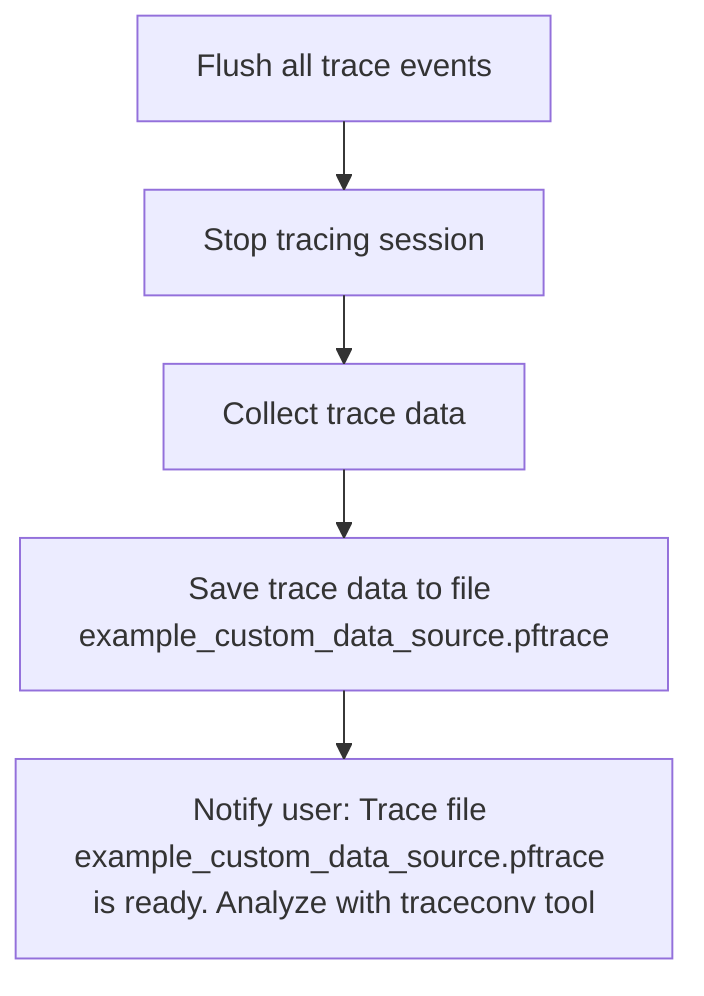

This document describes how trace data is finalized and saved after a tracing session. Ongoing trace data is captured, the session is stopped, and the trace is saved to a file. The user is then notified that the trace file is ready for analysis.

# Finalizing and Saving Trace Data



<SwmSnippet path="/examples/sdk/example_custom_data_source.cc" line="82">

---

<SwmToken path="examples/sdk/example_custom_data_source.cc" pos="82:2:2" line-data="void StopTracing(std::unique_ptr&lt;perfetto::TracingSession&gt; tracing_session) {">`StopTracing`</SwmToken> flushes all trace events, stops the session, reads the trace, and writes it to a fixed file. The flush step is Perfetto-specific and ensures nothing is left in buffers.

```c++
void StopTracing(std::unique_ptr<perfetto::TracingSession> tracing_session) {
  // Flush to make sure the last written event ends up in the trace.
  CustomDataSource::Trace(
      [](CustomDataSource::TraceContext ctx) { ctx.Flush(); });

  // Stop tracing and read the trace data.
  tracing_session->StopBlocking();
  std::vector<char> trace_data(tracing_session->ReadTraceBlocking());

  // Write the result into a file.
  // Note: To save memory with longer traces, you can tell Perfetto to write
  // directly into a file by passing a file descriptor into Setup() above.
  std::ofstream output;
  const char* filename = "example_custom_data_source.pftrace";
  output.open(filename, std::ios::out | std::ios::binary);
  output.write(&trace_data[0], static_cast<std::streamsize>(trace_data.size()));
  output.close();
  PERFETTO_LOG(
      "Trace written in %s file. To read this trace in "
      "text form, run `./tools/traceconv text %s`",
      filename, filename);
}
```

---

</SwmSnippet>

&nbsp;

*This is an auto-generated document by Swimm 🌊 and has not yet been verified by a human*

<SwmMeta version="3.0.0" repo-id="Z2l0aHViJTNBJTNBY3BsdXNwbHVzLXBlcmZldHRvJTNBJTNBcmljYXJkb2xvcGV6Zw==" repo-name="cplusplus-perfetto"><sup>Powered by [Swimm](https://app.swimm.io/)</sup></SwmMeta>
