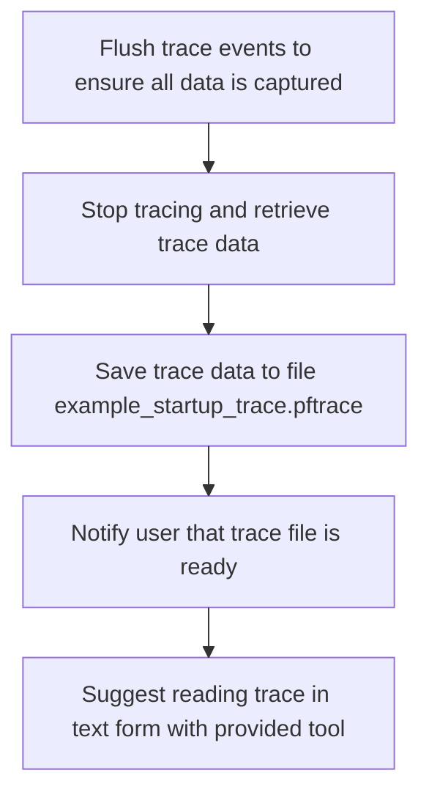

This document describes how trace data is finalized and saved at the end of a tracing session. All trace events are captured, the data is saved to a file, and the user is notified that the trace file is ready for analysis.

# Finalizing and Saving Trace Data



<SwmSnippet path="/examples/sdk/example_startup_trace.cc" line="84">

---

<SwmToken path="examples/sdk/example_startup_trace.cc" pos="84:2:2" line-data="void StopTracing(std::unique_ptr&lt;perfetto::TracingSession&gt; tracing_session) {">`StopTracing`</SwmToken> kicks off by flushing any buffered trace events using Perfetto's <SwmToken path="examples/sdk/example_startup_trace.cc" pos="86:1:1" line-data="  CustomDataSource::Trace(">`CustomDataSource`</SwmToken>::Trace and <SwmToken path="examples/sdk/example_startup_trace.cc" pos="87:13:17" line-data="      [](CustomDataSource::TraceContext ctx) { ctx.Flush(); });">`ctx.Flush()`</SwmToken>, making sure nothing is left behind. Then it stops the tracing session, grabs all the trace data, and writes it out to a file called <SwmToken path="examples/sdk/example_startup_trace.cc" pos="97:11:13" line-data="  const char* filename = &quot;example_startup_trace.pftrace&quot;;">`example_startup_trace.pftrace`</SwmToken>. The file name is just a constant here, so every run overwrites the previous trace unless you change it. This function does more than just 'stop'—it handles the full wrap-up and export of trace data.

```c++
void StopTracing(std::unique_ptr<perfetto::TracingSession> tracing_session) {
  // Flush to make sure the last written event ends up in the trace.
  CustomDataSource::Trace(
      [](CustomDataSource::TraceContext ctx) { ctx.Flush(); });

  // Stop tracing and read the trace data.
  tracing_session->StopBlocking();
  std::vector<char> trace_data(tracing_session->ReadTraceBlocking());

  // Write the result into a file.
  // Note: To save memory with longer traces, you can tell Perfetto to write
  // directly into a file by passing a file descriptor into Setup() above.
  std::ofstream output;
  const char* filename = "example_startup_trace.pftrace";
  output.open(filename, std::ios::out | std::ios::binary);
  output.write(trace_data.data(),
               static_cast<std::streamsize>(trace_data.size()));
  output.close();
  PERFETTO_LOG(
      "Trace written in %s file. To read this trace in "
      "text form, run `./tools/traceconv text %s`",
      filename, filename);
}
```

---

</SwmSnippet>

&nbsp;

*This is an auto-generated document by Swimm 🌊 and has not yet been verified by a human*

<SwmMeta version="3.0.0" repo-id="Z2l0aHViJTNBJTNBY3BsdXNwbHVzLXBlcmZldHRvJTNBJTNBcmljYXJkb2xvcGV6Zw==" repo-name="cplusplus-perfetto"><sup>Powered by [Swimm](https://app.swimm.io/)</sup></SwmMeta>
