This document describes how the system finalizes trace data after trace collection is complete. When the end of a trace file is reached, all trace input is processed, remaining data is flushed, and the system is prepared for analysis or querying. The process includes notifying relevant components, handling incomplete slices, and performing cleanup.

# Where is this flow used?

This flow is used multiple times in the codebase as represented in the following diagram:

(Note - these are only some of the entry points of this flow)

```mermaid
graph TD;
      6616ae71e71f6b29ae3ad92eca36894d852e81b0e06f16df7d8a51411496118a(src/trace_processor/trace_processor_shell.cc::LoadTrace) --> 8fa6579951d502de01b841d5d93b498234bf6fdd65ee84eeafdc1325351cc494(src/trace_processor/trace_processor_impl.cc::NotifyEndOfFile):::mainFlowStyle

8ddbcacdfcf6ec723945a932a3d7ba02d6d85320cfca73bd2fc8850094693e54(src/…/orchestrator/orchestrator_impl.cc::ExecuteQueryOnTrace) --> b4a218172a4b60c4e0bb057b0837b41848441351e91c39d91172a47a456a7d37(src/…/worker/worker_impl.cc::QueryTrace)

b4a218172a4b60c4e0bb057b0837b41848441351e91c39d91172a47a456a7d37(src/…/worker/worker_impl.cc::QueryTrace) --> d37d8a2e1ea288814c798db27fa9f9e048bf4aa1cda78e3560c83f234ddda79c(src/…/repository_policies/gcs_trace_processor_loader.cc::LoadTraceProcessor)

d37d8a2e1ea288814c798db27fa9f9e048bf4aa1cda78e3560c83f234ddda79c(src/…/repository_policies/gcs_trace_processor_loader.cc::LoadTraceProcessor) --> 8fa6579951d502de01b841d5d93b498234bf6fdd65ee84eeafdc1325351cc494(src/trace_processor/trace_processor_impl.cc::NotifyEndOfFile):::mainFlowStyle

163bf09ad615f5ec1ab531c9b8595b66fac092cf89dd4ae3523b4d5e742e1dad(src/trace_processor/minimal_shell.cc::main) --> 4f608fa49b6873719e34063ae4986bd998ba301fff2c1b40e8d54a571eb0011e(src/trace_processor/minimal_shell.cc::MinimalMain)

4f608fa49b6873719e34063ae4986bd998ba301fff2c1b40e8d54a571eb0011e(src/trace_processor/minimal_shell.cc::MinimalMain) --> 8fa6579951d502de01b841d5d93b498234bf6fdd65ee84eeafdc1325351cc494(src/trace_processor/trace_processor_impl.cc::NotifyEndOfFile):::mainFlowStyle

07c848d0002942bf5ec3ade6f8451236e5d4b2036510314be868fdfde43dc2bb(src/traceconv/trace_to_profile.cc::TraceToProfile) --> 8fa6579951d502de01b841d5d93b498234bf6fdd65ee84eeafdc1325351cc494(src/trace_processor/trace_processor_impl.cc::NotifyEndOfFile):::mainFlowStyle

35eabac2a3ca976a2b310c71aeaff4036ff0978f515330e7a600b60a018375a1(src/traceconv/symbolize_profile.cc::SymbolizeProfile) --> 8fa6579951d502de01b841d5d93b498234bf6fdd65ee84eeafdc1325351cc494(src/trace_processor/trace_processor_impl.cc::NotifyEndOfFile):::mainFlowStyle


classDef mainFlowStyle color:#000000,fill:#7CB9F4
classDef rootsStyle color:#000000,fill:#00FFF4
classDef Style1 color:#000000,fill:#00FFAA
classDef Style2 color:#000000,fill:#FFFF00
classDef Style3 color:#000000,fill:#AA7CB9

%% Swimm:
%% graph TD;
%%       6616ae71e71f6b29ae3ad92eca36894d852e81b0e06f16df7d8a51411496118a(<SwmPath>[src/trace_processor/trace_processor_shell.cc](src/trace_processor/trace_processor_shell.cc)</SwmPath>::LoadTrace) --> 8fa6579951d502de01b841d5d93b498234bf6fdd65ee84eeafdc1325351cc494(<SwmPath>[src/trace_processor/trace_processor_impl.cc](src/trace_processor/trace_processor_impl.cc)</SwmPath>::<SwmToken path="src/trace_processor/trace_processor_impl.cc" pos="627:6:6" line-data="base::Status TraceProcessorImpl::NotifyEndOfFile() {">`NotifyEndOfFile`</SwmToken>):::mainFlowStyle
%% 
%% 8ddbcacdfcf6ec723945a932a3d7ba02d6d85320cfca73bd2fc8850094693e54(<SwmPath>[src/…/orchestrator/orchestrator_impl.cc](src/bigtrace/orchestrator/orchestrator_impl.cc)</SwmPath>::ExecuteQueryOnTrace) --> b4a218172a4b60c4e0bb057b0837b41848441351e91c39d91172a47a456a7d37(<SwmPath>[src/…/worker/worker_impl.cc](src/bigtrace/worker/worker_impl.cc)</SwmPath>::QueryTrace)
%% 
%% b4a218172a4b60c4e0bb057b0837b41848441351e91c39d91172a47a456a7d37(<SwmPath>[src/…/worker/worker_impl.cc](src/bigtrace/worker/worker_impl.cc)</SwmPath>::QueryTrace) --> d37d8a2e1ea288814c798db27fa9f9e048bf4aa1cda78e3560c83f234ddda79c(<SwmPath>[src/…/repository_policies/gcs_trace_processor_loader.cc](src/bigtrace/worker/repository_policies/gcs_trace_processor_loader.cc)</SwmPath>::LoadTraceProcessor)
%% 
%% d37d8a2e1ea288814c798db27fa9f9e048bf4aa1cda78e3560c83f234ddda79c(<SwmPath>[src/…/repository_policies/gcs_trace_processor_loader.cc](src/bigtrace/worker/repository_policies/gcs_trace_processor_loader.cc)</SwmPath>::LoadTraceProcessor) --> 8fa6579951d502de01b841d5d93b498234bf6fdd65ee84eeafdc1325351cc494(<SwmPath>[src/trace_processor/trace_processor_impl.cc](src/trace_processor/trace_processor_impl.cc)</SwmPath>::<SwmToken path="src/trace_processor/trace_processor_impl.cc" pos="627:6:6" line-data="base::Status TraceProcessorImpl::NotifyEndOfFile() {">`NotifyEndOfFile`</SwmToken>):::mainFlowStyle
%% 
%% 163bf09ad615f5ec1ab531c9b8595b66fac092cf89dd4ae3523b4d5e742e1dad(<SwmPath>[src/trace_processor/minimal_shell.cc](src/trace_processor/minimal_shell.cc)</SwmPath>::main) --> 4f608fa49b6873719e34063ae4986bd998ba301fff2c1b40e8d54a571eb0011e(<SwmPath>[src/trace_processor/minimal_shell.cc](src/trace_processor/minimal_shell.cc)</SwmPath>::MinimalMain)
%% 
%% 4f608fa49b6873719e34063ae4986bd998ba301fff2c1b40e8d54a571eb0011e(<SwmPath>[src/trace_processor/minimal_shell.cc](src/trace_processor/minimal_shell.cc)</SwmPath>::MinimalMain) --> 8fa6579951d502de01b841d5d93b498234bf6fdd65ee84eeafdc1325351cc494(<SwmPath>[src/trace_processor/trace_processor_impl.cc](src/trace_processor/trace_processor_impl.cc)</SwmPath>::<SwmToken path="src/trace_processor/trace_processor_impl.cc" pos="627:6:6" line-data="base::Status TraceProcessorImpl::NotifyEndOfFile() {">`NotifyEndOfFile`</SwmToken>):::mainFlowStyle
%% 
%% 07c848d0002942bf5ec3ade6f8451236e5d4b2036510314be868fdfde43dc2bb(<SwmPath>[src/traceconv/trace_to_profile.cc](src/traceconv/trace_to_profile.cc)</SwmPath>::TraceToProfile) --> 8fa6579951d502de01b841d5d93b498234bf6fdd65ee84eeafdc1325351cc494(<SwmPath>[src/trace_processor/trace_processor_impl.cc](src/trace_processor/trace_processor_impl.cc)</SwmPath>::<SwmToken path="src/trace_processor/trace_processor_impl.cc" pos="627:6:6" line-data="base::Status TraceProcessorImpl::NotifyEndOfFile() {">`NotifyEndOfFile`</SwmToken>):::mainFlowStyle
%% 
%% 35eabac2a3ca976a2b310c71aeaff4036ff0978f515330e7a600b60a018375a1(<SwmPath>[src/traceconv/symbolize_profile.cc](src/traceconv/symbolize_profile.cc)</SwmPath>::SymbolizeProfile) --> 8fa6579951d502de01b841d5d93b498234bf6fdd65ee84eeafdc1325351cc494(<SwmPath>[src/trace_processor/trace_processor_impl.cc](src/trace_processor/trace_processor_impl.cc)</SwmPath>::<SwmToken path="src/trace_processor/trace_processor_impl.cc" pos="627:6:6" line-data="base::Status TraceProcessorImpl::NotifyEndOfFile() {">`NotifyEndOfFile`</SwmToken>):::mainFlowStyle
%% 
%% 
%% classDef mainFlowStyle color:#000000,fill:#7CB9F4
%% classDef rootsStyle color:#000000,fill:#00FFF4
%% classDef Style1 color:#000000,fill:#00FFAA
%% classDef Style2 color:#000000,fill:#FFFF00
%% classDef Style3 color:#000000,fill:#AA7CB9
```



# Finalizing Trace Input and State

<SwmSnippet path="/src/trace_processor/trace_processor_impl.cc" line="627">

---

In <SwmToken path="src/trace_processor/trace_processor_impl.cc" pos="627:6:6" line-data="base::Status TraceProcessorImpl::NotifyEndOfFile() {">`NotifyEndOfFile`</SwmToken>, we check if we've already finalized the trace to avoid double finalization, set a default trace name if needed, flush any remaining data, and finalize heap graph profiles. Next, we call <SwmToken path="src/trace_processor/trace_processor_impl.cc" pos="644:3:3" line-data="  RETURN_IF_ERROR(TraceProcessorStorageImpl::NotifyEndOfFile());">`TraceProcessorStorageImpl`</SwmToken>::<SwmToken path="src/trace_processor/trace_processor_impl.cc" pos="627:6:6" line-data="base::Status TraceProcessorImpl::NotifyEndOfFile() {">`NotifyEndOfFile`</SwmToken> to propagate the EOF notification and finalize storage-related state, which is needed before we can complete the rest of the cleanup.

```c++
base::Status TraceProcessorImpl::NotifyEndOfFile() {
  if (notify_eof_called_) {
    const char kMessage[] =
        "NotifyEndOfFile should only be called once. Try calling Flush instead "
        "if trying to commit the contents of the trace to tables.";
    PERFETTO_ELOG(kMessage);
    return base::ErrStatus(kMessage);
  }
  notify_eof_called_ = true;

  if (current_trace_name_.empty())
    current_trace_name_ = "Unnamed trace";

  // Last opportunity to flush all pending data.
  FlushInternal(false);

  HeapGraphTracker::Get(context())->FinalizeAllProfiles();
  RETURN_IF_ERROR(TraceProcessorStorageImpl::NotifyEndOfFile());
```

---

</SwmSnippet>

## Propagating EOF to Storage and Contexts


<SwmSnippet path="/src/trace_processor/trace_processor_storage_impl.cc" line="114">

---

In <SwmToken path="src/trace_processor/trace_processor_storage_impl.cc" pos="114:4:6" line-data="base::Status TraceProcessorStorageImpl::NotifyEndOfFile() {">`TraceProcessorStorageImpl::NotifyEndOfFile`</SwmToken>, we set the EOF flag, flush data, notify the parser, flush again, then iterate over trace and machine contexts to notify their analyzers about EOF. This makes sure all parts of the trace pipeline are aware that input is finished and can finalize their state.

```c++
base::Status TraceProcessorStorageImpl::NotifyEndOfFile() {
  if (!parser_) {
    return base::OkStatus();
  }
  if (unrecoverable_parse_error_) {
    return base::ErrStatus("Unrecoverable parsing error already occurred");
  }
  eof_ = true;
  Flush();
  RETURN_IF_ERROR(parser_->NotifyEndOfFile());
  // NotifyEndOfFile might have pushed packets to the sorter.
  Flush();

  auto& traces = context()->forked_context_state->trace_to_context;
  for (auto it = traces.GetIterator(); it; ++it) {
    if (it.value()->content_analyzer) {
      PacketAnalyzer::Get(it.value())->NotifyEndOfFile();
    }
  }
```

---

</SwmSnippet>

<SwmSnippet path="/src/trace_processor/trace_processor_storage_impl.cc" line="133">

---

We finish up by telling symbol trackers in each machine context that we're done.

```c++
  auto& machines = context()->forked_context_state->machine_to_context;
  for (auto it = machines.GetIterator(); it; ++it) {
    it.value()->symbol_tracker->NotifyEndOfFile();
  }
```

---

</SwmSnippet>

<SwmSnippet path="/src/trace_processor/trace_processor_storage_impl.cc" line="137">

---

Finally in storage's EOF handler, we loop through combined trace and machine contexts to flush pending events, flush pending slices, and notify process trackers. Next, we call into <SwmToken path="src/trace_processor/importers/common/slice_tracker.cc" pos="316:2:2" line-data="void SliceTracker::FlushPendingSlices() {">`SliceTracker`</SwmToken> to handle any incomplete slices, making sure all slice data is finalized.

```c++
  auto& all = context()->forked_context_state->trace_and_machine_to_context;
  for (auto it = all.GetIterator(); it; ++it) {
    it.value()->event_tracker->FlushPendingEvents();
    it.value()->slice_tracker->FlushPendingSlices();
    it.value()->process_tracker->NotifyEndOfFile();
  }
  return base::OkStatus();
}
```

---

</SwmSnippet>

## Finalizing Incomplete Slices

<SwmSnippet path="/src/trace_processor/importers/common/slice_tracker.cc" line="316">

---

In <SwmToken path="src/trace_processor/importers/common/slice_tracker.cc" pos="316:4:4" line-data="void SliceTracker::FlushPendingSlices() {">`FlushPendingSlices`</SwmToken>, we loop through all slice stacks and prep any arguments for translation, but we leave slices with <SwmToken path="src/trace_processor/importers/common/slice_tracker.cc" pos="318:26:26" line-data="  // written to the storage. We don&#39;t close any slices with kPendingDuration so">`kPendingDuration`</SwmToken> open so the UI can show them as incomplete.

```c++
void SliceTracker::FlushPendingSlices() {
  // Clear the remaining stack entries. This ensures that any pending args are
  // written to the storage. We don't close any slices with kPendingDuration so
  // that the UI can still distinguish such "incomplete" slices.
  //
  // TODO(eseckler): Reconsider whether we want to close pending slices by
  // setting their duration to |trace_end - event_start|. Might still want some
  // additional way of flagging these events as "incomplete" to the UI.

  // Make sure that args for all incomplete slice are translated.
  for (auto it = stacks_.GetIterator(); it; ++it) {
    auto& track_info = it.value();
    for (auto& slice_info : track_info.slice_stack) {
      MaybeAddTranslatableArgs(slice_info);
    }
  }
```

---

</SwmSnippet>

<SwmSnippet path="/src/trace_processor/importers/common/slice_tracker.cc" line="333">

---

After prepping arguments, we use <SwmToken path="src/trace_processor/importers/common/slice_tracker.cc" pos="335:1:1" line-data="    ArgsTracker args_tracker(context_);">`ArgsTracker`</SwmToken> and <SwmToken path="src/trace_processor/importers/common/slice_tracker.cc" pos="337:3:3" line-data="    context_-&gt;args_translation_table-&gt;TranslateArgs(">`args_translation_table`</SwmToken> to translate and flush all pending arguments for each slice. This makes sure everything is ready for storage before we clear the pending list.

```c++
  // Translate and flush all pending args.
  for (const auto& translatable_arg : translatable_args_) {
    ArgsTracker args_tracker(context_);
    auto bound_inserter = args_tracker.AddArgsTo(translatable_arg.slice_id);
    context_->args_translation_table->TranslateArgs(
        translatable_arg.compact_arg_set, bound_inserter);
  }
```

---

</SwmSnippet>

### Translating Slice Arguments


<SwmSnippet path="/src/trace_processor/importers/common/args_translation_table.cc" line="91">

---

In <SwmToken path="src/trace_processor/importers/common/args_translation_table.cc" pos="91:4:4" line-data="void ArgsTranslationTable::TranslateArgs(">`TranslateArgs`</SwmToken>, we loop through each argument, figure out its type, and either add it as-is or translate it to something more readable. Mojo method mapping IDs and relative PCs are handled at the end to emit extra location info.

```c++
void ArgsTranslationTable::TranslateArgs(
    const ArgsTracker::CompactArgSet& arg_set,
    ArgsTracker::BoundInserter& inserter) const {
  std::optional<uint64_t> mapping_id;
  std::optional<uint64_t> rel_pc;

  for (const auto& arg : arg_set) {
    const auto key_type =
        KeyIdAndTypeToEnum(arg.flat_key, arg.key, arg.value.type);
    if (!key_type.has_value()) {
      inserter.AddArg(arg.flat_key, arg.key, arg.value, arg.update_policy);
      continue;
    }

    switch (*key_type) {
      case KeyType::kChromeHistogramHash: {
        inserter.AddArg(interned_chrome_histogram_hash_key_, arg.value);
        const std::optional<base::StringView> translated_value =
            TranslateChromeHistogramHash(arg.value.uint_value);
        if (translated_value) {
          inserter.AddArg(
              interned_chrome_histogram_name_key_,
              Variadic::String(storage_->InternString(*translated_value)));
        }
        break;
      }
      case KeyType::kChromeUserEventHash: {
        inserter.AddArg(interned_chrome_user_event_hash_key_, arg.value);
        const std::optional<base::StringView> translated_value =
            TranslateChromeUserEventHash(arg.value.uint_value);
        if (translated_value) {
          inserter.AddArg(
              interned_chrome_user_event_action_key_,
              Variadic::String(storage_->InternString(*translated_value)));
        }
        break;
      }
      case KeyType::kChromePerformanceMarkMarkHash: {
        inserter.AddArg(interned_chrome_performance_mark_mark_hash_key_,
                        arg.value);
        const std::optional<base::StringView> translated_value =
            TranslateChromePerformanceMarkMarkHash(arg.value.uint_value);
        if (translated_value) {
          inserter.AddArg(
              interned_chrome_performance_mark_mark_key_,
              Variadic::String(storage_->InternString(*translated_value)));
        }
        break;
      }
      case KeyType::kChromePerformanceMarkSiteHash: {
        inserter.AddArg(interned_chrome_performance_mark_site_hash_key_,
                        arg.value);
        const std::optional<base::StringView> translated_value =
            TranslateChromePerformanceMarkSiteHash(arg.value.uint_value);
        if (translated_value) {
          inserter.AddArg(
              interned_chrome_performance_mark_site_key_,
              Variadic::String(storage_->InternString(*translated_value)));
        }
        break;
      }
      case KeyType::kClassName: {
        const std::optional<StringId> translated_class_name =
            TranslateClassName(arg.value.string_value);
        if (translated_class_name) {
          inserter.AddArg(arg.flat_key, arg.key,
                          Variadic::String(*translated_class_name));
        } else {
          inserter.AddArg(arg.flat_key, arg.key, arg.value);
        }
        break;
      }
      case KeyType::kChromeTriggerHash: {
        inserter.AddArg(interned_chrome_trigger_hash_key_, arg.value);
        const std::optional<base::StringView> translated_value =
            TranslateChromeStudyHash(arg.value.uint_value);
        if (translated_value) {
          inserter.AddArg(
              interned_chrome_trigger_name_key_,
              Variadic::String(storage_->InternString(*translated_value)));
        }
        break;
      }
      case KeyType::kMojoMethodMappingId: {
        mapping_id = arg.value.uint_value;
        break;
      }
      case KeyType::kMojoMethodRelPc: {
        rel_pc = arg.value.uint_value;
        break;
      }
    }
  }
```

---

</SwmSnippet>

<SwmSnippet path="/src/trace_processor/importers/common/args_translation_table.cc" line="184">

---

After translating all arguments, we emit Mojo method location info if mapping ID and relative PC were found. This wraps up the translation process for the slice.

```c++
  EmitMojoMethodLocation(mapping_id, rel_pc, inserter);
}
```

---

</SwmSnippet>

### Resetting Slice State

<SwmSnippet path="/src/trace_processor/importers/common/slice_tracker.cc" line="340">

---

After returning from <SwmToken path="src/trace_processor/importers/common/slice_tracker.cc" pos="337:5:5" line-data="    context_-&gt;args_translation_table-&gt;TranslateArgs(">`TranslateArgs`</SwmToken>, <SwmToken path="src/trace_processor/trace_processor_storage_impl.cc" pos="140:9:9" line-data="    it.value()-&gt;slice_tracker-&gt;FlushPendingSlices();">`FlushPendingSlices`</SwmToken> clears out all pending arguments and resets the slice stacks. This makes sure we're ready for the next trace without leftover state.

```c++
  translatable_args_.clear();

  stacks_.Clear();
}
```

---

</SwmSnippet>

## Completing Finalization and Cleanup


<SwmSnippet path="/src/trace_processor/trace_processor_impl.cc" line="645">

---

After returning from storage's EOF handler, <SwmToken path="src/trace_processor/trace_processor_impl.cc" pos="645:10:10" line-data="  DeobfuscationTracker::Get(context())-&gt;NotifyEndOfFile();">`NotifyEndOfFile`</SwmToken> rebuilds the bounds table to include any late-flushed data, destroys the context, shrinks tables, finalizes static tables, and preps SQLite objects for future queries. This wraps up all cleanup and finalization.

```c++
  DeobfuscationTracker::Get(context())->NotifyEndOfFile();

  // Rebuild the bounds table once everything has been completed: we do this
  // so that if any data was added to tables in
  // TraceProcessorStorageImpl::NotifyEndOfFile, this will be counted in
  // trace bounds: this is important for parsers like ninja which wait until
  // the end to flush all their data.
  //
  // Cache the bounds before finalization so we can reuse them in
  // RestoreInitialTables without iterating over finalized dataframes.
  cached_trace_bounds_ = GetTraceTimestampBoundsNs(*context()->storage);
  BuildBoundsTable(engine_->sqlite_engine()->db(), cached_trace_bounds_);

  TraceProcessorStorageImpl::DestroyContext();
  context()->storage->ShrinkToFitTables();

  engine_->FinalizeAndShareAllStaticTables();
  IncludeAfterEofPrelude(engine_.get());
  sqlite_objects_post_prelude_ = engine_->SqliteRegisteredObjectCount();

  return base::OkStatus();
}
```

---

</SwmSnippet>

&nbsp;

*This is an auto-generated document by Swimm 🌊 and has not yet been verified by a human*

<SwmMeta version="3.0.0" repo-id="Z2l0aHViJTNBJTNBY3BsdXNwbHVzLXBlcmZldHRvJTNBJTNBcmljYXJkb2xvcGV6Zw==" repo-name="cplusplus-perfetto"><sup>Powered by [Swimm](https://app.swimm.io/)</sup></SwmMeta>
