This document describes how performance profiling data is transformed into an interactive flamegraph visualization. Users can explore the visualization by hovering, clicking, and zooming on nodes to gain insights into performance bottlenecks.

# Rendering and Interacting with the Flamegraph Visualization

```mermaid
%%{init: {"flowchart": {"defaultRenderer": "elk"}} }%%
flowchart TD
  node1["Check if data has changed"]
  click node1 openCode "ui/src/widgets/flamegraph.ts:244:248"
  node1 -->|"Changed"| node1a["Reset zoomRegion, lastClickedNode, tooltipPos"]
  click node1a openCode "ui/src/widgets/flamegraph.ts:245:247"
  node1 --> node2{"Is data available?"}
  click node2 openCode "ui/src/widgets/flamegraph.ts:249:266"
  node2 -->|"No"| node3["Show loading/empty state"]
  click node3 openCode "ui/src/widgets/flamegraph.ts:250:266"
  node2 -->|"Yes"| node4["Render flamegraph visualization"]
  click node4 openCode "ui/src/widgets/flamegraph.ts:267:395"
  
  subgraph loop1["For each node in the flamegraph"]
    node4 --> node5{"User hovers, clicks, or double-clicks?"}
    click node5 openCode "ui/src/widgets/flamegraph.ts:295:357"
    node5 -->|"Yes"| node6["Update lastClickedNode, tooltipPos, or zoomRegion"]
    click node6 openCode "ui/src/widgets/flamegraph.ts:295:368"
    node6 --> node4
    node5 -->|"No"| node4
  end

classDef HeadingStyle fill:#777777,stroke:#333,stroke-width:2px;

%% Swimm:
%% %%{init: {"flowchart": {"defaultRenderer": "elk"}} }%%
%% flowchart TD
%%   node1["Check if data has changed"]
%%   click node1 openCode "<SwmPath>[ui/…/widgets/flamegraph.ts](ui/src/widgets/flamegraph.ts)</SwmPath>:244:248"
%%   node1 -->|"Changed"| node1a["Reset <SwmToken path="ui/src/widgets/flamegraph.ts" pos="245:3:3" line-data="      this.zoomRegion = undefined;">`zoomRegion`</SwmToken>, <SwmToken path="ui/src/widgets/flamegraph.ts" pos="246:3:3" line-data="      this.lastClickedNode = undefined;">`lastClickedNode`</SwmToken>, <SwmToken path="ui/src/widgets/flamegraph.ts" pos="247:3:3" line-data="      this.tooltipPos = undefined;">`tooltipPos`</SwmToken>"]
%%   click node1a openCode "<SwmPath>[ui/…/widgets/flamegraph.ts](ui/src/widgets/flamegraph.ts)</SwmPath>:245:247"
%%   node1 --> node2{"Is data available?"}
%%   click node2 openCode "<SwmPath>[ui/…/widgets/flamegraph.ts](ui/src/widgets/flamegraph.ts)</SwmPath>:249:266"
%%   node2 -->|"No"| node3["Show loading/empty state"]
%%   click node3 openCode "<SwmPath>[ui/…/widgets/flamegraph.ts](ui/src/widgets/flamegraph.ts)</SwmPath>:250:266"
%%   node2 -->|"Yes"| node4["Render flamegraph visualization"]
%%   click node4 openCode "<SwmPath>[ui/…/widgets/flamegraph.ts](ui/src/widgets/flamegraph.ts)</SwmPath>:267:395"
%%   
%%   subgraph loop1["For each node in the flamegraph"]
%%     node4 --> node5{"User hovers, clicks, or double-clicks?"}
%%     click node5 openCode "<SwmPath>[ui/…/widgets/flamegraph.ts](ui/src/widgets/flamegraph.ts)</SwmPath>:295:357"
%%     node5 -->|"Yes"| node6["Update <SwmToken path="ui/src/widgets/flamegraph.ts" pos="246:3:3" line-data="      this.lastClickedNode = undefined;">`lastClickedNode`</SwmToken>, <SwmToken path="ui/src/widgets/flamegraph.ts" pos="247:3:3" line-data="      this.tooltipPos = undefined;">`tooltipPos`</SwmToken>, or <SwmToken path="ui/src/widgets/flamegraph.ts" pos="245:3:3" line-data="      this.zoomRegion = undefined;">`zoomRegion`</SwmToken>"]
%%     click node6 openCode "<SwmPath>[ui/…/widgets/flamegraph.ts](ui/src/widgets/flamegraph.ts)</SwmPath>:295:368"
%%     node6 --> node4
%%     node5 -->|"No"| node4
%%   end
%% 
%% classDef HeadingStyle fill:#777777,stroke:#333,stroke-width:2px;
```



<SwmSnippet path="/ui/src/widgets/flamegraph.ts" line="242">

---

We set up the UI and canvas, and wire up <SwmToken path="ui/src/widgets/flamegraph.ts" pos="284:3:3" line-data="            this.drawCanvas(ctx, virtualCanvasSize, canvasRect);">`drawCanvas`</SwmToken> so the flamegraph gets drawn when the canvas needs updating.

```typescript
  view({attrs}: m.Vnode<FlamegraphAttrs, this>): void | m.Children {
    this.attrs = attrs;
    if (this.dataChangeMonitor.ifStateChanged()) {
      this.zoomRegion = undefined;
      this.lastClickedNode = undefined;
      this.tooltipPos = undefined;
    }
    if (attrs.data === undefined) {
      return m(
        '.pf-flamegraph',
        this.renderFilterBar(attrs),
        m(
          '.loading-container',
          m(
            EmptyState,
            {
              icon: 'bar_chart',
              title: 'Computing graph ...',
              className: 'flamegraph-loading',
            },
            m(Spinner, {easing: true}),
          ),
        ),
      );
    }
    const {minDepth, maxDepth} = attrs.data;
    const canvasHeight =
      Math.max(maxDepth - minDepth + PADDING_NODE_COUNT, PADDING_NODE_COUNT) *
      NODE_HEIGHT;
    const hoveredNode = this.renderNodes?.find((n) =>
      isIntersecting(this.hoveredX, this.hoveredY, n),
    );
    return m(
      '.pf-flamegraph',
      this.renderFilterBar(attrs),
      m(
        VirtualOverlayCanvas,
        {
          className: 'pf-virtual-canvas',
          overflowX: 'hidden',
          overflowY: 'auto',
          onCanvasRedraw: ({ctx, virtualCanvasSize, canvasRect}) => {
            this.drawCanvas(ctx, virtualCanvasSize, canvasRect);
          },
        },
        m(
          'div',
          {
            style: {
              height: `${canvasHeight}px`,
              cursor: hoveredNode === undefined ? 'default' : 'pointer',
            },
            onmousemove: ({offsetX, offsetY}: MouseEvent) => {
```

---

</SwmSnippet>

<SwmSnippet path="/ui/src/widgets/flamegraph.ts" line="434">

---

DrawCanvas handles both drawing the flamegraph and updating internal state like <SwmToken path="ui/src/widgets/flamegraph.ts" pos="444:3:3" line-data="        this.renderNodes = undefined;">`renderNodes`</SwmToken>, <SwmToken path="ui/src/widgets/flamegraph.ts" pos="445:3:3" line-data="        this.lastClickedNode = undefined;">`lastClickedNode`</SwmToken>, and <SwmToken path="ui/src/widgets/flamegraph.ts" pos="460:3:3" line-data="      this.tooltipPos = undefined;">`tooltipPos`</SwmToken>. It recomputes <SwmToken path="ui/src/widgets/flamegraph.ts" pos="444:3:3" line-data="        this.renderNodes = undefined;">`renderNodes`</SwmToken> if the state changed, using <SwmToken path="ui/src/widgets/flamegraph.ts" pos="447:7:7" line-data="        this.renderNodes = computeRenderNodes(">`computeRenderNodes`</SwmToken> with the current <SwmToken path="ui/src/widgets/flamegraph.ts" pos="449:3:3" line-data="          this.zoomRegion ?? {">`zoomRegion`</SwmToken> and canvas width. Then it loops through the nodes, drawing rectangles, hover effects, markers, and clipped text labels, using domain-specific utilities for color and formatting. Clicked nodes get a blue border, and layout is controlled by a bunch of constants.

```typescript
  private drawCanvas(
    ctx: CanvasRenderingContext2D,
    size: Size2D,
    rect: Rect2D,
  ) {
    this.canvasRect = rect;
    this.canvasWidth = size.width;

    if (this.renderNodesMonitor.ifStateChanged()) {
      if (this.attrs.data === undefined) {
        this.renderNodes = undefined;
        this.lastClickedNode = undefined;
      } else {
        this.renderNodes = computeRenderNodes(
          this.attrs.data,
          this.zoomRegion ?? {
            queryXStart: 0,
            queryXEnd: this.attrs.data.allRootsCumulativeValue,
            type: 'ROOT',
          },
          size.width,
        );
        this.lastClickedNode = this.renderNodes?.find((n) =>
          isIntersecting(this.lastClickedNode?.x, this.lastClickedNode?.y, n),
        );
      }
      this.tooltipPos = undefined;
    }
    if (this.attrs.data === undefined || this.renderNodes === undefined) {
      return;
    }

    const yStart = rect.top;
    const yEnd = rect.bottom;

    const {allRootsCumulativeValue, unfilteredCumulativeValue, nodes} =
      this.attrs.data;
    const unit = assertExists(this.selectedMetric).unit;

    ctx.font = LABEL_FONT_STYLE;
    ctx.textBaseline = 'middle';

    ctx.strokeStyle = 'white';
    ctx.lineWidth = 0.5;

    if (this.labelCharWidth === 0) {
      this.labelCharWidth = ctx.measureText('_').width;
    }

    for (let i = 0; i < this.renderNodes.length; i++) {
      const node = this.renderNodes[i];
      const {x, y, width: width, source, state} = node;
      if (y + NODE_HEIGHT <= yStart || y >= yEnd) {
        continue;
      }

      const hover = isIntersecting(this.hoveredX, this.hoveredY, node);
      let name: string;
      let colorScheme;
      if (source.kind === 'ROOT') {
        const val = displaySize(allRootsCumulativeValue, unit);
        const percent = displayPercentage(
          allRootsCumulativeValue,
          unfilteredCumulativeValue,
        );
        name = `root: ${val} (${percent})`;
        colorScheme = getFlamegraphColorScheme('root', state === 'PARTIAL');
      } else if (source.kind === 'MERGED') {
        name = '(merged)';
        colorScheme = getFlamegraphColorScheme(name, state === 'PARTIAL');
      } else {
        name = nodes[source.queryIdx].name;
        colorScheme = getFlamegraphColorScheme(name, state === 'PARTIAL');
      }
      const bgColor = hover ? colorScheme.variant : colorScheme.base;
      const textColor = hover ? colorScheme.textVariant : colorScheme.textBase;
      ctx.fillStyle = bgColor.cssString;
      ctx.fillRect(x, y, width - 1, NODE_HEIGHT - 1);

      // Render marker
      const MARKER_SIZE = 3;
      const MARKER_LEFT_MARGIN = 2;
      const MIN_WIDTH_FOR_MARKER = 15; // Don't show marker on very small nodes
      const hasMarker =
        source.kind === 'NODE' &&
        nodes[source.queryIdx].marker !== undefined &&
        width >= MIN_WIDTH_FOR_MARKER;
      if (hasMarker) {
        ctx.fillStyle = textColor.cssString;
        const markerX = x + MARKER_LEFT_MARGIN;
        const markerY = y + 2; // Position at top of node with small margin
        ctx.fillRect(markerX, markerY, MARKER_SIZE, MARKER_SIZE);
      }

      // Text positioning - no need to reserve space since marker is in top corner
      const widthNoPadding = width - LABEL_PADDING_PX * 2;
      if (widthNoPadding >= LABEL_MIN_WIDTH_FOR_TEXT_PX) {
        ctx.fillStyle = textColor.cssString;
        ctx.fillText(
          name.substring(0, widthNoPadding / this.labelCharWidth),
          x + LABEL_PADDING_PX,
          y + (NODE_HEIGHT - 1) / 2,
          widthNoPadding,
        );
      }
      if (this.lastClickedNode?.x === x && this.lastClickedNode?.y === y) {
        ctx.strokeStyle = 'blue';
        ctx.lineWidth = 2;
        ctx.beginPath();
        ctx.moveTo(x, y);
        ctx.lineTo(x + width, y);
        ctx.lineTo(x + width, y + NODE_HEIGHT - 1);
        ctx.lineTo(x, y + NODE_HEIGHT - 1);
        ctx.lineTo(x, y);
        ctx.stroke();
        ctx.strokeStyle = 'white';
        ctx.lineWidth = 0.5;
      }
    }
```

---

</SwmSnippet>

<SwmSnippet path="/ui/src/widgets/flamegraph.ts" line="295">

---

Back in Flamegraph.view after <SwmToken path="ui/src/widgets/flamegraph.ts" pos="284:3:3" line-data="            this.drawCanvas(ctx, virtualCanvasSize, canvasRect);">`drawCanvas`</SwmToken> runs, we handle mouse events on the canvas. We use the updated <SwmToken path="ui/src/widgets/flamegraph.ts" pos="300:9:9" line-data="              const renderNode = this.renderNodes?.find((n) =&gt;">`renderNodes`</SwmToken> to track hover and click positions, update tooltip state, and trigger zooming. The popup uses the latest <SwmToken path="ui/src/widgets/flamegraph.ts" pos="297:6:6" line-data="              if (this.tooltipPos?.state === &#39;CLICK&#39;) {">`tooltipPos`</SwmToken> to show node info. All these interactions depend on the state set by <SwmToken path="ui/src/widgets/flamegraph.ts" pos="284:3:3" line-data="            this.drawCanvas(ctx, virtualCanvasSize, canvasRect);">`drawCanvas`</SwmToken>.

```typescript
              this.hoveredX = offsetX;
              this.hoveredY = offsetY;
              if (this.tooltipPos?.state === 'CLICK') {
                return;
              }
              const renderNode = this.renderNodes?.find((n) =>
                isIntersecting(offsetX, offsetY, n),
              );
              if (renderNode === undefined) {
                this.tooltipPos = undefined;
                return;
              }
              if (
                isIntersecting(
                  this.tooltipPos?.x,
                  this.tooltipPos?.y,
                  renderNode,
                )
              ) {
                return;
              }
              this.tooltipPos = {
                x: offsetX,
                y: renderNode.y,
                source: renderNode.source,
                state: 'HOVER',
              };
            },
            onmouseout: () => {
              this.hoveredX = undefined;
              this.hoveredY = undefined;
              if (
                this.tooltipPos?.state === 'HOVER' ||
                this.tooltipPos?.state === 'DECLICK'
              ) {
                this.tooltipPos = undefined;
              }
            },
            onclick: ({offsetX, offsetY}: MouseEvent) => {
              const renderNode = this.renderNodes?.find((n) =>
                isIntersecting(offsetX, offsetY, n),
              );
              this.lastClickedNode = renderNode;
              if (renderNode === undefined) {
                this.tooltipPos = undefined;
              } else if (
                isIntersecting(
                  this.tooltipPos?.x,
                  this.tooltipPos?.y,
                  renderNode,
                )
              ) {
                this.tooltipPos!.state =
                  this.tooltipPos?.state === 'CLICK' ? 'DECLICK' : 'CLICK';
              } else {
                this.tooltipPos = {
                  x: offsetX,
                  y: renderNode.y,
                  source: renderNode.source,
                  state: 'CLICK',
                };
              }
            },
            ondblclick: ({offsetX, offsetY}: MouseEvent) => {
              const renderNode = this.renderNodes?.find((n) =>
                isIntersecting(offsetX, offsetY, n),
              );
              // TODO(lalitm): ignore merged nodes for now as we haven't quite
              // figured out the UX for this.
              if (renderNode?.source.kind === 'MERGED') {
                return;
              }
              this.zoomRegion = renderNode?.source;
            },
          },
          m(
            Popup,
            {
              trigger: m('.popup-anchor', {
                style: {
                  left: this.tooltipPos?.x + 'px',
                  top: this.tooltipPos?.y + 'px',
                },
              }),
              // We have a wide set of buttons that would overflow given the
              // normal width constraints of the popup.
              fitContent: true,
              position: PopupPosition.Right,
              isOpen:
                this.isPopupAnchorVisible() &&
                (this.tooltipPos?.state === 'HOVER' ||
                  this.tooltipPos?.state === 'CLICK'),
              className: 'pf-flamegraph-tooltip-popup',
              offset: NODE_HEIGHT,
            },
            this.renderTooltip(),
          ),
        ),
      ),
    );
  }
```

---

</SwmSnippet>

&nbsp;

*This is an auto-generated document by Swimm 🌊 and has not yet been verified by a human*

<SwmMeta version="3.0.0" repo-id="Z2l0aHViJTNBJTNBY3BsdXNwbHVzLXBlcmZldHRvJTNBJTNBcmljYXJkb2xvcGV6Zw==" repo-name="cplusplus-perfetto"><sup>Powered by [Swimm](https://app.swimm.io/)</sup></SwmMeta>
