This document describes how duration values are formatted for display in the trace analysis UI, based on user or trace format preferences. The flow receives a duration value and a format preference, determines the appropriate formatting strategy, and produces a concise, readable string for users.


# Where is this flow used?

This flow is used multiple times in the codebase as represented in the following diagram:

(Note - these are only some of the entry points of this flow)

```mermaid
graph TD;
      01a10f3518909909ba091bd669f4ec3e20f7d9f23cd309e48a5067c2f9a4fe30(ui/…/bigtrace/index.ts::TraceProcessorTrackPlugin.onTraceLoad) --> 5964eaa985ab47e2a5a4f7e775f65b463f3181d29d9db3c18458003129c5baae(ui/…/bigtrace/index.ts::TraceProcessorTrackPlugin.addSlices)

5964eaa985ab47e2a5a4f7e775f65b463f3181d29d9db3c18458003129c5baae(ui/…/bigtrace/index.ts::TraceProcessorTrackPlugin.addSlices) --> 4467c0b4c771342e6580f037f3df53e0dec8e8d07b6285ae007f9a5837c4db50(ui/…/dev.perfetto.TraceProcessorTrack/trace_processor_slice_track.ts::createTraceProcessorSliceTrack)

4467c0b4c771342e6580f037f3df53e0dec8e8d07b6285ae007f9a5837c4db50(ui/…/dev.perfetto.TraceProcessorTrack/trace_processor_slice_track.ts::createTraceProcessorSliceTrack) --> f961cb2599ec3a2fda124ccb64773254eeccbabdc5898d64764102d82716c9a3(ui/…/tracks/slice_track.ts::renderTooltip)

f961cb2599ec3a2fda124ccb64773254eeccbabdc5898d64764102d82716c9a3(ui/…/tracks/slice_track.ts::renderTooltip) --> 68db23f11d3562dd4a999ee7034729d22dd4814f3b2b2ef8ae854cf64a557f5e(ui/…/tracks/slice_track.ts::formatDurationForTooltip)

68db23f11d3562dd4a999ee7034729d22dd4814f3b2b2ef8ae854cf64a557f5e(ui/…/tracks/slice_track.ts::formatDurationForTooltip) --> 08b7883ae6cc541d2ecc18f5d85e42f99cd7f2c270091316dfae4cf2c6bfa4bc(ui/…/components/time_utils.ts::formatDuration):::mainFlowStyle

a9863466799f3b767b42c113c829fdff5b709cc99145f64b1e9edb7f1202c406(ui/…/bigtrace/index.ts::onTraceLoad) --> 14aa6d26f196fb6ec83b341f7574402cbec3941a8e68faad0834faa792bfde57(ui/…/bigtrace/index.ts::addGlobalAllocs)

14aa6d26f196fb6ec83b341f7574402cbec3941a8e68faad0834faa792bfde57(ui/…/bigtrace/index.ts::addGlobalAllocs) --> 4467c0b4c771342e6580f037f3df53e0dec8e8d07b6285ae007f9a5837c4db50(ui/…/dev.perfetto.TraceProcessorTrack/trace_processor_slice_track.ts::createTraceProcessorSliceTrack)

f86b71c537306e47d26af37bf83fc535bc9baf805ce2d3dad29216ca299de556(ui/…/bigtrace/index.ts::TrackEventPlugin.onTraceLoad) --> 4467c0b4c771342e6580f037f3df53e0dec8e8d07b6285ae007f9a5837c4db50(ui/…/dev.perfetto.TraceProcessorTrack/trace_processor_slice_track.ts::createTraceProcessorSliceTrack)

1e5850234de4d8dbff68ebf120fb66307069f2f5a7aa55a4c7a2034610a7e262(ui/…/bigtrace/index.ts::onTraceLoad) --> af34804b51f14826b06fff4e68ea116de1a5b1a7c053bedd51aafeb4b982c63b(ui/…/bigtrace/index.ts::addTracks)

af34804b51f14826b06fff4e68ea116de1a5b1a7c053bedd51aafeb4b982c63b(ui/…/bigtrace/index.ts::addTracks) --> 4467c0b4c771342e6580f037f3df53e0dec8e8d07b6285ae007f9a5837c4db50(ui/…/dev.perfetto.TraceProcessorTrack/trace_processor_slice_track.ts::createTraceProcessorSliceTrack)

cdd7f8b9acab83db605497815a25c0bd1d5a6883fdfbef49e9207c41e01401df(ui/…/timeline_page/time_selection_panel.ts::TimeSelectionPanel.renderCanvas) --> f1e4c49f467d59ba704526d74045a45779a25a37201e5fb211354abf09a2f2c3(ui/…/timeline_page/time_selection_panel.ts::TimeSelectionPanel.renderPanel)

f1e4c49f467d59ba704526d74045a45779a25a37201e5fb211354abf09a2f2c3(ui/…/timeline_page/time_selection_panel.ts::TimeSelectionPanel.renderPanel) --> b63a4d91478c5d4beb94a478564b61c5c56148bfa8d15904e6fe67a28e4709e1(ui/…/timeline_page/time_selection_panel.ts::TimeSelectionPanel.renderHover)

f1e4c49f467d59ba704526d74045a45779a25a37201e5fb211354abf09a2f2c3(ui/…/timeline_page/time_selection_panel.ts::TimeSelectionPanel.renderPanel) --> 497e351ca23c63c9686061c873a0343564ac3754e5ec9e9e0fb2ad3c11c5e717(ui/…/timeline_page/time_selection_panel.ts::TimeSelectionPanel.renderSpan)

b63a4d91478c5d4beb94a478564b61c5c56148bfa8d15904e6fe67a28e4709e1(ui/…/timeline_page/time_selection_panel.ts::TimeSelectionPanel.renderHover) --> 08b7883ae6cc541d2ecc18f5d85e42f99cd7f2c270091316dfae4cf2c6bfa4bc(ui/…/components/time_utils.ts::formatDuration):::mainFlowStyle

497e351ca23c63c9686061c873a0343564ac3754e5ec9e9e0fb2ad3c11c5e717(ui/…/timeline_page/time_selection_panel.ts::TimeSelectionPanel.renderSpan) --> 08b7883ae6cc541d2ecc18f5d85e42f99cd7f2c270091316dfae4cf2c6bfa4bc(ui/…/components/time_utils.ts::formatDuration):::mainFlowStyle


classDef mainFlowStyle color:#000000,fill:#7CB9F4
classDef rootsStyle color:#000000,fill:#00FFF4
classDef Style1 color:#000000,fill:#00FFAA
classDef Style2 color:#000000,fill:#FFFF00
classDef Style3 color:#000000,fill:#AA7CB9

%% Swimm:
%% graph TD;
%%       01a10f3518909909ba091bd669f4ec3e20f7d9f23cd309e48a5067c2f9a4fe30(<SwmPath>[ui/…/bigtrace/index.ts](ui/src/bigtrace/index.ts)</SwmPath>::TraceProcessorTrackPlugin.onTraceLoad) --> 5964eaa985ab47e2a5a4f7e775f65b463f3181d29d9db3c18458003129c5baae(<SwmPath>[ui/…/bigtrace/index.ts](ui/src/bigtrace/index.ts)</SwmPath>::TraceProcessorTrackPlugin.addSlices)
%% 
%% 5964eaa985ab47e2a5a4f7e775f65b463f3181d29d9db3c18458003129c5baae(<SwmPath>[ui/…/bigtrace/index.ts](ui/src/bigtrace/index.ts)</SwmPath>::TraceProcessorTrackPlugin.addSlices) --> 4467c0b4c771342e6580f037f3df53e0dec8e8d07b6285ae007f9a5837c4db50(<SwmPath>[ui/…/dev.perfetto.TraceProcessorTrack/trace_processor_slice_track.ts](ui/src/plugins/dev.perfetto.TraceProcessorTrack/trace_processor_slice_track.ts)</SwmPath>::createTraceProcessorSliceTrack)
%% 
%% 4467c0b4c771342e6580f037f3df53e0dec8e8d07b6285ae007f9a5837c4db50(<SwmPath>[ui/…/dev.perfetto.TraceProcessorTrack/trace_processor_slice_track.ts](ui/src/plugins/dev.perfetto.TraceProcessorTrack/trace_processor_slice_track.ts)</SwmPath>::createTraceProcessorSliceTrack) --> f961cb2599ec3a2fda124ccb64773254eeccbabdc5898d64764102d82716c9a3(<SwmPath>[ui/…/tracks/slice_track.ts](ui/src/components/tracks/slice_track.ts)</SwmPath>::renderTooltip)
%% 
%% f961cb2599ec3a2fda124ccb64773254eeccbabdc5898d64764102d82716c9a3(<SwmPath>[ui/…/tracks/slice_track.ts](ui/src/components/tracks/slice_track.ts)</SwmPath>::renderTooltip) --> 68db23f11d3562dd4a999ee7034729d22dd4814f3b2b2ef8ae854cf64a557f5e(<SwmPath>[ui/…/tracks/slice_track.ts](ui/src/components/tracks/slice_track.ts)</SwmPath>::formatDurationForTooltip)
%% 
%% 68db23f11d3562dd4a999ee7034729d22dd4814f3b2b2ef8ae854cf64a557f5e(<SwmPath>[ui/…/tracks/slice_track.ts](ui/src/components/tracks/slice_track.ts)</SwmPath>::formatDurationForTooltip) --> 08b7883ae6cc541d2ecc18f5d85e42f99cd7f2c270091316dfae4cf2c6bfa4bc(<SwmPath>[ui/…/components/time_utils.ts](ui/src/components/time_utils.ts)</SwmPath>::<SwmToken path="ui/src/components/time_utils.ts" pos="32:4:4" line-data="export function formatDuration(trace: Trace, dur: duration): string {">`formatDuration`</SwmToken>):::mainFlowStyle
%% 
%% a9863466799f3b767b42c113c829fdff5b709cc99145f64b1e9edb7f1202c406(<SwmPath>[ui/…/bigtrace/index.ts](ui/src/bigtrace/index.ts)</SwmPath>::onTraceLoad) --> 14aa6d26f196fb6ec83b341f7574402cbec3941a8e68faad0834faa792bfde57(<SwmPath>[ui/…/bigtrace/index.ts](ui/src/bigtrace/index.ts)</SwmPath>::addGlobalAllocs)
%% 
%% 14aa6d26f196fb6ec83b341f7574402cbec3941a8e68faad0834faa792bfde57(<SwmPath>[ui/…/bigtrace/index.ts](ui/src/bigtrace/index.ts)</SwmPath>::addGlobalAllocs) --> 4467c0b4c771342e6580f037f3df53e0dec8e8d07b6285ae007f9a5837c4db50(<SwmPath>[ui/…/dev.perfetto.TraceProcessorTrack/trace_processor_slice_track.ts](ui/src/plugins/dev.perfetto.TraceProcessorTrack/trace_processor_slice_track.ts)</SwmPath>::createTraceProcessorSliceTrack)
%% 
%% f86b71c537306e47d26af37bf83fc535bc9baf805ce2d3dad29216ca299de556(<SwmPath>[ui/…/bigtrace/index.ts](ui/src/bigtrace/index.ts)</SwmPath>::TrackEventPlugin.onTraceLoad) --> 4467c0b4c771342e6580f037f3df53e0dec8e8d07b6285ae007f9a5837c4db50(<SwmPath>[ui/…/dev.perfetto.TraceProcessorTrack/trace_processor_slice_track.ts](ui/src/plugins/dev.perfetto.TraceProcessorTrack/trace_processor_slice_track.ts)</SwmPath>::createTraceProcessorSliceTrack)
%% 
%% 1e5850234de4d8dbff68ebf120fb66307069f2f5a7aa55a4c7a2034610a7e262(<SwmPath>[ui/…/bigtrace/index.ts](ui/src/bigtrace/index.ts)</SwmPath>::onTraceLoad) --> af34804b51f14826b06fff4e68ea116de1a5b1a7c053bedd51aafeb4b982c63b(<SwmPath>[ui/…/bigtrace/index.ts](ui/src/bigtrace/index.ts)</SwmPath>::addTracks)
%% 
%% af34804b51f14826b06fff4e68ea116de1a5b1a7c053bedd51aafeb4b982c63b(<SwmPath>[ui/…/bigtrace/index.ts](ui/src/bigtrace/index.ts)</SwmPath>::addTracks) --> 4467c0b4c771342e6580f037f3df53e0dec8e8d07b6285ae007f9a5837c4db50(<SwmPath>[ui/…/dev.perfetto.TraceProcessorTrack/trace_processor_slice_track.ts](ui/src/plugins/dev.perfetto.TraceProcessorTrack/trace_processor_slice_track.ts)</SwmPath>::createTraceProcessorSliceTrack)
%% 
%% cdd7f8b9acab83db605497815a25c0bd1d5a6883fdfbef49e9207c41e01401df(<SwmPath>[ui/…/timeline_page/time_selection_panel.ts](ui/src/frontend/timeline_page/time_selection_panel.ts)</SwmPath>::TimeSelectionPanel.renderCanvas) --> f1e4c49f467d59ba704526d74045a45779a25a37201e5fb211354abf09a2f2c3(<SwmPath>[ui/…/timeline_page/time_selection_panel.ts](ui/src/frontend/timeline_page/time_selection_panel.ts)</SwmPath>::TimeSelectionPanel.renderPanel)
%% 
%% f1e4c49f467d59ba704526d74045a45779a25a37201e5fb211354abf09a2f2c3(<SwmPath>[ui/…/timeline_page/time_selection_panel.ts](ui/src/frontend/timeline_page/time_selection_panel.ts)</SwmPath>::TimeSelectionPanel.renderPanel) --> b63a4d91478c5d4beb94a478564b61c5c56148bfa8d15904e6fe67a28e4709e1(<SwmPath>[ui/…/timeline_page/time_selection_panel.ts](ui/src/frontend/timeline_page/time_selection_panel.ts)</SwmPath>::TimeSelectionPanel.renderHover)
%% 
%% f1e4c49f467d59ba704526d74045a45779a25a37201e5fb211354abf09a2f2c3(<SwmPath>[ui/…/timeline_page/time_selection_panel.ts](ui/src/frontend/timeline_page/time_selection_panel.ts)</SwmPath>::TimeSelectionPanel.renderPanel) --> 497e351ca23c63c9686061c873a0343564ac3754e5ec9e9e0fb2ad3c11c5e717(<SwmPath>[ui/…/timeline_page/time_selection_panel.ts](ui/src/frontend/timeline_page/time_selection_panel.ts)</SwmPath>::TimeSelectionPanel.renderSpan)
%% 
%% b63a4d91478c5d4beb94a478564b61c5c56148bfa8d15904e6fe67a28e4709e1(<SwmPath>[ui/…/timeline_page/time_selection_panel.ts](ui/src/frontend/timeline_page/time_selection_panel.ts)</SwmPath>::TimeSelectionPanel.renderHover) --> 08b7883ae6cc541d2ecc18f5d85e42f99cd7f2c270091316dfae4cf2c6bfa4bc(<SwmPath>[ui/…/components/time_utils.ts](ui/src/components/time_utils.ts)</SwmPath>::<SwmToken path="ui/src/components/time_utils.ts" pos="32:4:4" line-data="export function formatDuration(trace: Trace, dur: duration): string {">`formatDuration`</SwmToken>):::mainFlowStyle
%% 
%% 497e351ca23c63c9686061c873a0343564ac3754e5ec9e9e0fb2ad3c11c5e717(<SwmPath>[ui/…/timeline_page/time_selection_panel.ts](ui/src/frontend/timeline_page/time_selection_panel.ts)</SwmPath>::TimeSelectionPanel.renderSpan) --> 08b7883ae6cc541d2ecc18f5d85e42f99cd7f2c270091316dfae4cf2c6bfa4bc(<SwmPath>[ui/…/components/time_utils.ts](ui/src/components/time_utils.ts)</SwmPath>::<SwmToken path="ui/src/components/time_utils.ts" pos="32:4:4" line-data="export function formatDuration(trace: Trace, dur: duration): string {">`formatDuration`</SwmToken>):::mainFlowStyle
%% 
%% 
%% classDef mainFlowStyle color:#000000,fill:#7CB9F4
%% classDef rootsStyle color:#000000,fill:#00FFF4
%% classDef Style1 color:#000000,fill:#00FFAA
%% classDef Style2 color:#000000,fill:#FFFF00
%% classDef Style3 color:#000000,fill:#AA7CB9
```



# Choosing the Duration Formatting Strategy


<SwmSnippet path="/ui/src/components/time_utils.ts" line="32">

---

In <SwmToken path="ui/src/components/time_utils.ts" pos="32:4:4" line-data="export function formatDuration(trace: Trace, dur: duration): string {">`formatDuration`</SwmToken>, we pick the formatting logic based on the trace's timestamp format. For formats that need timezone or custom handling, we call <SwmToken path="ui/src/components/time_utils.ts" pos="39:3:3" line-data="      return renderFormattedDuration(trace, dur);">`renderFormattedDuration`</SwmToken> next, since it can handle those cases. Other formats just use direct conversion functions. This separation keeps the formatting logic modular.

```typescript
export function formatDuration(trace: Trace, dur: duration): string {
  const fmt = trace.timeline.timestampFormat;
  switch (fmt) {
    case TimestampFormat.UTC:
    case TimestampFormat.TraceTz:
    case TimestampFormat.Timecode:
    case TimestampFormat.CustomTimezone:
      return renderFormattedDuration(trace, dur);
    case TimestampFormat.TraceNs:
      return dur.toString();
    case TimestampFormat.TraceNsLocale:
      return dur.toLocaleString();
    case TimestampFormat.Seconds:
      return Duration.formatSeconds(dur);
    case TimestampFormat.Milliseconds:
      return Duration.formatMilliseconds(dur);
    case TimestampFormat.Microseconds:
      return Duration.formatMicroseconds(dur);
    default:
```

---

</SwmSnippet>

## Selecting the Precision for Duration Formatting

<SwmSnippet path="/ui/src/components/time_utils.ts" line="56">

---

<SwmToken path="ui/src/components/time_utils.ts" pos="56:2:2" line-data="function renderFormattedDuration(trace: Trace, dur: duration): string {">`renderFormattedDuration`</SwmToken> picks the formatting style based on <SwmToken path="ui/src/components/time_utils.ts" pos="57:11:11" line-data="  const fmt = trace.timeline.durationPrecision;">`durationPrecision`</SwmToken>. If it's <SwmToken path="ui/src/components/time_utils.ts" pos="59:5:5" line-data="    case DurationPrecision.HumanReadable:">`HumanReadable`</SwmToken>, we call <SwmToken path="ui/src/components/time_utils.ts" pos="60:3:5" line-data="      return Duration.humanise(dur);">`Duration.humanise`</SwmToken> for a simple string; if it's Full, we call <SwmToken path="ui/src/components/time_utils.ts" pos="62:3:5" line-data="      return Duration.format(dur);">`Duration.format`</SwmToken> for a detailed one. Next, we jump to <SwmPath>[ui/…/base/time.ts](ui/src/base/time.ts)</SwmPath> to actually format the value.

```typescript
function renderFormattedDuration(trace: Trace, dur: duration): string {
  const fmt = trace.timeline.durationPrecision;
  switch (fmt) {
    case DurationPrecision.HumanReadable:
      return Duration.humanise(dur);
    case DurationPrecision.Full:
      return Duration.format(dur);
    default:
      const x: never = fmt;
      throw new Error(`Invalid format ${x}`);
  }
}
```

---

</SwmSnippet>

## Formatting Duration for Human Readability


<SwmSnippet path="/ui/src/base/time.ts" line="281">

---

In <SwmToken path="ui/src/components/time_utils.ts" pos="60:3:5" line-data="      return Duration.humanise(dur);">`Duration.humanise`</SwmToken>, we pick the best unit for the duration by dividing by 1000 until it fits, so the output is readable. This sets up the value for formatting and display.

```typescript
  static humanise(dur: duration): string {
    if (dur < 1) return '0s';
    const units = ['ns', 'µs', 'ms', 's'];
    let n = Math.abs(Number(dur));
    let u = 0;
    while (n >= 1000 && u + 1 < units.length) {
      n /= 1000;
      ++u;
    }
```

---

</SwmSnippet>

<SwmSnippet path="/ui/src/base/time.ts" line="290">

---

Here we format the value with <SwmToken path="ui/src/base/time.ts" pos="290:5:5" line-data="    return `${toSignificantDigits(Math.sign(Number(dur)) * n, 4)}${units[u]}`;">`toSignificantDigits`</SwmToken> to keep the output precise but not overly verbose. Next, we call into <SwmPath>[ui/…/webusb/adb_key.ts](ui/src/plugins/dev.perfetto.RecordTraceV2/adb/webusb/adb_key.ts)</SwmPath> for cryptographic signing, which is needed for secure trace operations.

```typescript
    return `${toSignificantDigits(Math.sign(Number(dur)) * n, 4)}${units[u]}`;
```

---

</SwmSnippet>

<SwmSnippet path="/ui/src/plugins/dev.perfetto.RecordTraceV2/adb/webusb/adb_key.ts" line="94">

---

<SwmToken path="ui/src/plugins/dev.perfetto.RecordTraceV2/adb/webusb/adb_key.ts" pos="94:1:1" line-data="  sign(token: Uint8Array): Uint8Array {">`sign`</SwmToken> manually pads and signs the token for RSA PKCS#1 v1.5 compatibility.

```typescript
  sign(token: Uint8Array): Uint8Array {
    const rsaKey = new RSAKey();
    rsaKey.setPrivateEx(
      hexEncode(base64Decode(this.jwkPrivate.n)),
      hexEncode(base64Decode(this.jwkPrivate.e)),
      hexEncode(base64Decode(this.jwkPrivate.d)),
      hexEncode(base64Decode(this.jwkPrivate.p)),
      hexEncode(base64Decode(this.jwkPrivate.q)),
      hexEncode(base64Decode(this.jwkPrivate.dp)),
      hexEncode(base64Decode(this.jwkPrivate.dq)),
      hexEncode(base64Decode(this.jwkPrivate.qi)),
    );
    assertTrue(rsaKey.n.bitLength() === MODULUS_SIZE_BITS);

    // Message Layout (size equals that of the key modulus):
    // 00 01 FF FF FF FF ... FF [ASN.1 PREFIX] [TOKEN]
    const message = new Uint8Array(MODULUS_SIZE);

    // Initially fill the buffer with the padding
    message.fill(0xff);

    // add prefix
    message[0] = 0x00;
    message[1] = 0x01;

    // add the ASN.1 prefix
    message.set(
      SIGNING_ASN1_PREFIX,
      message.length - SIGNING_ASN1_PREFIX.length - token.length,
    );

    // then the actual token at the end
    message.set(token, message.length - token.length);

    const messageInteger = new BigInteger(Array.from(message));
    const signature = rsaKey.doPrivate(messageInteger);
    return new Uint8Array(bigIntToFixedByteArray(signature, MODULUS_SIZE));
  }
```

---

</SwmSnippet>

<SwmSnippet path="/ui/src/base/time.ts" line="290">

---

We just came back from signing in <SwmPath>[ui/…/webusb/adb_key.ts](ui/src/plugins/dev.perfetto.RecordTraceV2/adb/webusb/adb_key.ts)</SwmPath>. Now, in <SwmPath>[ui/…/base/time.ts](ui/src/base/time.ts)</SwmPath>, we combine the formatted value and unit for the final output. This wraps up the formatting before returning the string.

```typescript
    return `${toSignificantDigits(Math.sign(Number(dur)) * n, 4)}${units[u]}`;
  }
```

---

</SwmSnippet>

## Limiting the Number of Significant Digits


<SwmSnippet path="/ui/src/base/time.ts" line="200">

---

In <SwmToken path="ui/src/base/time.ts" pos="200:2:2" line-data="function toSignificantDigits(value: number, n: number): string {">`toSignificantDigits`</SwmToken>, we figure out how many digits to show after the decimal by looping up to n. This keeps the output precise but not excessive. Next, we go to <SwmPath>[ui/…/webusb/adb_key.ts](ui/src/plugins/dev.perfetto.RecordTraceV2/adb/webusb/adb_key.ts)</SwmPath> for cryptographic operations.

```typescript
function toSignificantDigits(value: number, n: number): string {
  const sign = Math.sign(value);
```

---

</SwmSnippet>

<SwmSnippet path="/ui/src/base/time.ts" line="202">

---

After returning from signing, in <SwmPath>[ui/…/base/time.ts](ui/src/base/time.ts)</SwmPath>, we finalize the formatted string by checking if the value is an integer. If so, we skip decimals; otherwise, we format with the calculated precision.

```typescript
  value = Math.abs(value);
  // For each of (1, 10, 100, ..., 10^n) we need to render an additional digit
  // after comma.
  let pow = 1;
  let digitsAfterComma = 0;
  for (let i = 0; i < n; i++, pow *= 10) {
    if (value < pow) {
      digitsAfterComma++;
    }
  }
```

---

</SwmSnippet>

<SwmSnippet path="/ui/src/base/time.ts" line="212">

---

We return a string with the correct sign and formatted number, either as an integer or with decimals, based on the input.

```typescript
  // Print precisely `digitsAfterComma` digits after comma, unless the number is an integer.
  const formatted =
    value === Math.round(value) ? value : value.toFixed(digitsAfterComma);
  return `${sign < 0 ? '-' : ''}${formatted}`;
}
```

---

</SwmSnippet>

## Handling Invalid Timestamp Formats

<SwmSnippet path="/ui/src/components/time_utils.ts" line="51">

---

After returning from <SwmToken path="ui/src/components/time_utils.ts" pos="39:3:3" line-data="      return renderFormattedDuration(trace, dur);">`renderFormattedDuration`</SwmToken>, in <SwmToken path="ui/src/components/time_utils.ts" pos="32:4:4" line-data="export function formatDuration(trace: Trace, dur: duration): string {">`formatDuration`</SwmToken>, we hit the default case. If the format is unknown, we throw an error to catch misconfigurations early.

```typescript
      const x: never = fmt;
      throw new Error(`Invalid format ${x}`);
  }
}
```

---

</SwmSnippet>

&nbsp;

*This is an auto-generated document by Swimm 🌊 and has not yet been verified by a human*

<SwmMeta version="3.0.0" repo-id="Z2l0aHViJTNBJTNBY3BsdXNwbHVzLXBlcmZldHRvJTNBJTNBcmljYXJkb2xvcGV6Zw==" repo-name="cplusplus-perfetto"><sup>Powered by [Swimm](https://app.swimm.io/)</sup></SwmMeta>
