This document describes how frames are retrieved or created using identifiers and metadata. The flow ensures efficient reuse or creation of frames, supporting accurate symbol resolution and stack profiling for trace analysis.

# Frame Lookup, Caching, and Insertion Logic

```mermaid
%%{init: {"flowchart": {"defaultRenderer": "elk"}} }%%
flowchart TD
  node1["Check if frame is cached by identifiers"] --> node2{"Is frame cached?"}
  click node1 openCode "src/trace_processor/importers/proto/stack_profile_sequence_state.cc:210:212"
  node2 -->|"Yes"| node3["Return cached frame"]
  click node2 openCode "src/trace_processor/importers/proto/stack_profile_sequence_state.cc:210:212"
  click node3 openCode "src/trace_processor/importers/proto/stack_profile_sequence_state.cc:211:212"
  node2 -->|"No"| node4["Decode frame data and extract metadata"]
  click node4 openCode "src/trace_processor/importers/proto/stack_profile_sequence_state.cc:213:243"
  node4 --> node5{"Is frame data valid?"}
  click node5 openCode "src/trace_processor/importers/proto/stack_profile_sequence_state.cc:216:219"
  node5 -->|"No"| node6["Return no frame"]
  click node6 openCode "src/trace_processor/importers/proto/stack_profile_sequence_state.cc:218:219"
  node5 -->|"Yes"| node7{"Is dummy frame (no mapping)?"}
  click node7 openCode "src/trace_processor/importers/proto/stack_profile_sequence_state.cc:248:259"
  node7 -->|"Yes"| node8["Create or retrieve dummy frame with metadata"]
  click node8 openCode "src/trace_processor/importers/proto/stack_profile_sequence_state.cc:255:256"
  node8 --> node9["Cache and return frame"]
  click node9 openCode "src/trace_processor/importers/proto/stack_profile_sequence_state.cc:257:258"
  node7 -->|"No"| node10{"Is mapping valid?"}
  click node10 openCode "src/trace_processor/importers/proto/stack_profile_sequence_state.cc:262:266"
  node10 -->|"No"| node6
  node10 -->|"Yes"| node11["Create or retrieve regular frame with metadata"]
  click node11 openCode "src/trace_processor/importers/proto/stack_profile_sequence_state.cc:270:271"
  node11 --> node9

classDef HeadingStyle fill:#777777,stroke:#333,stroke-width:2px;

%% Swimm:
%% %%{init: {"flowchart": {"defaultRenderer": "elk"}} }%%
%% flowchart TD
%%   node1["Check if frame is cached by identifiers"] --> node2{"Is frame cached?"}
%%   click node1 openCode "<SwmPath>[src/…/proto/stack_profile_sequence_state.cc](src/trace_processor/importers/proto/stack_profile_sequence_state.cc)</SwmPath>:210:212"
%%   node2 -->|"Yes"| node3["Return cached frame"]
%%   click node2 openCode "<SwmPath>[src/…/proto/stack_profile_sequence_state.cc](src/trace_processor/importers/proto/stack_profile_sequence_state.cc)</SwmPath>:210:212"
%%   click node3 openCode "<SwmPath>[src/…/proto/stack_profile_sequence_state.cc](src/trace_processor/importers/proto/stack_profile_sequence_state.cc)</SwmPath>:211:212"
%%   node2 -->|"No"| node4["Decode frame data and extract metadata"]
%%   click node4 openCode "<SwmPath>[src/…/proto/stack_profile_sequence_state.cc](src/trace_processor/importers/proto/stack_profile_sequence_state.cc)</SwmPath>:213:243"
%%   node4 --> node5{"Is frame data valid?"}
%%   click node5 openCode "<SwmPath>[src/…/proto/stack_profile_sequence_state.cc](src/trace_processor/importers/proto/stack_profile_sequence_state.cc)</SwmPath>:216:219"
%%   node5 -->|"No"| node6["Return no frame"]
%%   click node6 openCode "<SwmPath>[src/…/proto/stack_profile_sequence_state.cc](src/trace_processor/importers/proto/stack_profile_sequence_state.cc)</SwmPath>:218:219"
%%   node5 -->|"Yes"| node7{"Is dummy frame (no mapping)?"}
%%   click node7 openCode "<SwmPath>[src/…/proto/stack_profile_sequence_state.cc](src/trace_processor/importers/proto/stack_profile_sequence_state.cc)</SwmPath>:248:259"
%%   node7 -->|"Yes"| node8["Create or retrieve dummy frame with metadata"]
%%   click node8 openCode "<SwmPath>[src/…/proto/stack_profile_sequence_state.cc](src/trace_processor/importers/proto/stack_profile_sequence_state.cc)</SwmPath>:255:256"
%%   node8 --> node9["Cache and return frame"]
%%   click node9 openCode "<SwmPath>[src/…/proto/stack_profile_sequence_state.cc](src/trace_processor/importers/proto/stack_profile_sequence_state.cc)</SwmPath>:257:258"
%%   node7 -->|"No"| node10{"Is mapping valid?"}
%%   click node10 openCode "<SwmPath>[src/…/proto/stack_profile_sequence_state.cc](src/trace_processor/importers/proto/stack_profile_sequence_state.cc)</SwmPath>:262:266"
%%   node10 -->|"No"| node6
%%   node10 -->|"Yes"| node11["Create or retrieve regular frame with metadata"]
%%   click node11 openCode "<SwmPath>[src/…/proto/stack_profile_sequence_state.cc](src/trace_processor/importers/proto/stack_profile_sequence_state.cc)</SwmPath>:270:271"
%%   node11 --> node9
%% 
%% classDef HeadingStyle fill:#777777,stroke:#333,stroke-width:2px;
```



<SwmSnippet path="/src/trace_processor/importers/proto/stack_profile_sequence_state.cc" line="207">

---

In <SwmToken path="src/trace_processor/importers/proto/stack_profile_sequence_state.cc" pos="207:9:9" line-data="std::optional&lt;FrameId&gt; StackProfileSequenceState::FindOrInsertFrame(">`FindOrInsertFrame`</SwmToken>, we first check if the frame is already cached using (upid, iid) to avoid redundant work. If not cached, we decode the interned frame and extract its function name, source file, and line number. For frames with <SwmToken path="src/trace_processor/importers/proto/stack_profile_sequence_state.cc" pos="245:7:7" line-data="  // Check if mapping_id is 0, which means this is a &quot;dummy&quot; frame (no real">`mapping_id`</SwmToken> == 0, we use a dummy mapping to intern the frame, handling cases where there's no real mapping. For regular frames, we prepare to call <SwmToken path="src/trace_processor/importers/proto/stack_profile_sequence_state.cc" pos="262:1:1" line-data="  VirtualMemoryMapping* mapping =">`VirtualMemoryMapping`</SwmToken> to intern the frame with all relevant details. This step sets up the necessary context for frame insertion and caching, and determines whether we need to use the dummy mapping logic or proceed with a real mapping.

```c++
std::optional<FrameId> StackProfileSequenceState::FindOrInsertFrame(
    std::optional<UniquePid> upid,
    uint64_t iid) {
  if (FrameId* id = cached_frames_.Find({upid, iid}); id) {
    return *id;
  }
  auto* decoder =
      LookupInternedMessage<protos::pbzero::InternedData::kFramesFieldNumber,
                            protos::pbzero::Frame>(iid);
  if (!decoder) {
    context_->storage->IncrementStats(stats::stackprofile_invalid_frame_id);
    return std::nullopt;
  }

  base::StringView function_name;
  if (decoder->function_name_id() != 0) {
    std::optional<base::StringView> func =
        LookupInternedFunctionName(decoder->function_name_id());
    if (!func) {
      return std::nullopt;
    }
    function_name = *func;
  }

  // Extract source file and line number (used by both dummy and regular frames)
  std::optional<base::StringView> source_file;
  if (decoder->has_source_path_iid()) {
    source_file = LookupInternedSourcePath(decoder->source_path_iid());
    if (!source_file) {
      return std::nullopt;
    }
  }

  std::optional<uint32_t> line_number;
  if (decoder->has_line_number()) {
    line_number = decoder->line_number();
  }

  // Check if mapping_id is 0, which means this is a "dummy" frame (no real
  // mapping) In this case, we should use the dummy mapping API with source file
  // and line number
  if (decoder->mapping_id() == 0) {
    // Get or create the dummy mapping for interned frames with mapping_id = 0
    if (!dummy_mapping_for_interned_frames_) {
      dummy_mapping_for_interned_frames_ =
          &context_->mapping_tracker->CreateDummyMapping("");
    }

    FrameId frame_id = dummy_mapping_for_interned_frames_->InternDummyFrame(
        function_name, source_file, line_number);
    cached_frames_.Insert({upid, iid}, frame_id);
    return frame_id;
  }

  // Regular frame with a real mapping
  VirtualMemoryMapping* mapping =
      FindOrInsertMappingImpl(upid, decoder->mapping_id());
  if (!mapping) {
    return std::nullopt;
  }

  // InternFrame will create the symbol entry if source_file or line_number is
  // provided
  FrameId frame_id = mapping->InternFrame(decoder->rel_pc(), function_name,
                                          source_file, line_number);

```

---

</SwmSnippet>

<SwmSnippet path="/src/trace_processor/importers/common/virtual_memory_mapping.cc" line="83">

---

<SwmToken path="src/trace_processor/importers/common/virtual_memory_mapping.cc" pos="83:4:4" line-data="FrameId VirtualMemoryMapping::InternFrame(">`InternFrame`</SwmToken> decides whether to use <SwmToken path="src/trace_processor/importers/common/virtual_memory_mapping.cc" pos="89:1:1" line-data="      jit_cache_">`jit_cache_`</SwmToken> for JIT-compiled frames or the standard implementation for regular frames. After interning, it updates <SwmToken path="src/trace_processor/importers/common/virtual_memory_mapping.cc" pos="93:1:1" line-data="    frames_by_rel_pc_[rel_pc].push_back(frame_id);">`frames_by_rel_pc_`</SwmToken> only if the frame was newly inserted, keeping track of frames by their relative program counter for later lookups.

```c++
FrameId VirtualMemoryMapping::InternFrame(
    uint64_t rel_pc,
    base::StringView function_name,
    std::optional<base::StringView> source_file,
    std::optional<uint32_t> line_number) {
  auto [frame_id, was_inserted] =
      jit_cache_
          ? jit_cache_->InternFrame(this, rel_pc, function_name)
          : InternFrameImpl(rel_pc, function_name, source_file, line_number);
  if (was_inserted) {
    frames_by_rel_pc_[rel_pc].push_back(frame_id);
  }
  return frame_id;
}
```

---

</SwmSnippet>

<SwmSnippet path="/src/trace_processor/importers/proto/stack_profile_sequence_state.cc" line="273">

---

After getting the frame id from mapping, we cache it if it's not JIT, then return it.

```c++
  if (!mapping->is_jitted()) {
    cached_frames_.Insert({upid, iid}, frame_id);
  }

  return frame_id;
}
```

---

</SwmSnippet>

&nbsp;

*This is an auto-generated document by Swimm 🌊 and has not yet been verified by a human*

<SwmMeta version="3.0.0" repo-id="Z2l0aHViJTNBJTNBY3BsdXNwbHVzLXBlcmZldHRvJTNBJTNBcmljYXJkb2xvcGV6Zw==" repo-name="cplusplus-perfetto"><sup>Powered by [Swimm](https://app.swimm.io/)</sup></SwmMeta>
