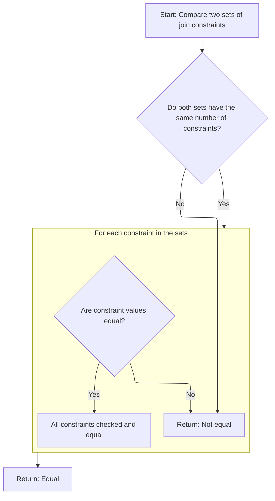
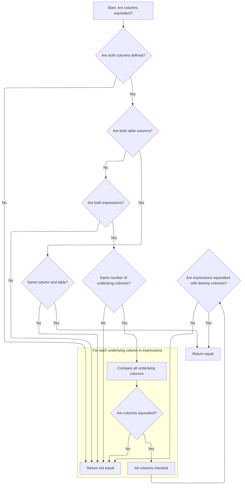
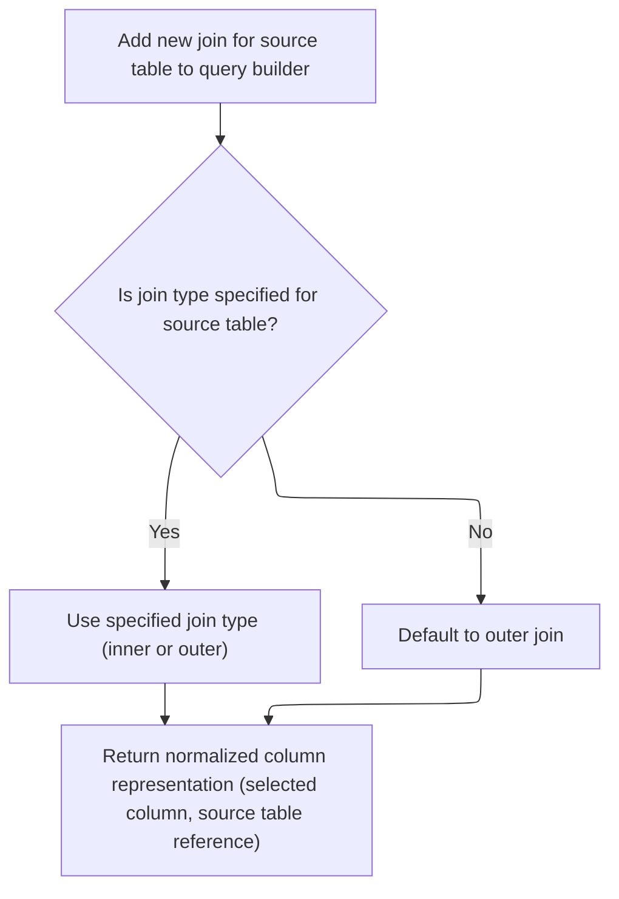

This document describes how user-specified parameters—such as table, columns, filters, groupings, and orderings—are transformed into a normalized SQL query string. This enables dynamic data retrieval for tables, charts, and pivot tables.

# Where is this flow used?

This flow is used multiple times in the codebase as represented in the following diagram:

(Note - these are only some of the entry points of this flow)

```mermaid
graph TD;
      47a009bb28468bd248715ec917e8837b1a126907e2ff752f89d3e6e278078226(ui/…/bigtrace/index.ts::main) --> 9da801899ca38d8b30d5a1c08b2d8a45ef97466770974636e7d91ac9692e14f5(ui/…/bigtrace/index.ts::onCssLoaded)

9da801899ca38d8b30d5a1c08b2d8a45ef97466770974636e7d91ac9692e14f5(ui/…/bigtrace/index.ts::onCssLoaded) --> bcb3136f8c2769ddb3b898d48c8c7e94c357af6001422c1b3572767cbfa166c3(ui/…/core/live_reload.ts::initLiveReload)

bcb3136f8c2769ddb3b898d48c8c7e94c357af6001422c1b3572767cbfa166c3(ui/…/core/live_reload.ts::initLiveReload) --> 86d0c8b5778e01e050e23992f843689565bb570b65407735d0ce0cef9a43c46b(ui/…/core/live_reload.ts::reloadDelayed)

86d0c8b5778e01e050e23992f843689565bb570b65407735d0ce0cef9a43c46b(ui/…/core/live_reload.ts::reloadDelayed) --> f2f068ebd03171b95f2c531fc11bf1f7e889f42e356dadf92589de980517039f(ui/…/charts/sql_bar_chart.ts::SqlBarChartState.reload)

f2f068ebd03171b95f2c531fc11bf1f7e889f42e356dadf92589de980517039f(ui/…/charts/sql_bar_chart.ts::SqlBarChartState.reload) --> 72f201132ba3d77d62183dd996db8bba1867a395de737639ef7b20aaa49aaba3(ui/…/table/query_builder.ts::buildSqlQuery):::mainFlowStyle

b4c2818110c9becae72a406b219827d5cd1cce3ffa6c181c814638285a7f3e94(ui/…/pivot_table/pivot_table.ts::PivotTable.view) --> 94383b6f3d149369ac3e68652c6b78881fab7cd0cb878c9e5e428dfa297dda6d(ui/…/pivot_table/pivot_table.ts::PivotTable.renderPivotColumnMenu)

b4c2818110c9becae72a406b219827d5cd1cce3ffa6c181c814638285a7f3e94(ui/…/pivot_table/pivot_table.ts::PivotTable.view) --> 33e09df866eda8c1fa72376dea2f27f5cf8aaf824f71ade9d230084d7c516375(ui/…/pivot_table/pivot_table.ts::PivotTable.renderAggregationColumnMenu)

b4c2818110c9becae72a406b219827d5cd1cce3ffa6c181c814638285a7f3e94(ui/…/pivot_table/pivot_table.ts::PivotTable.view) --> 03367d0796206e249841ba3507caf671eed1854aad798359cc2f9d36b910d9e2(ui/…/pivot_table/pivot_table_state.ts::PivotTableState.movePivot)

b4c2818110c9becae72a406b219827d5cd1cce3ffa6c181c814638285a7f3e94(ui/…/pivot_table/pivot_table.ts::PivotTable.view) --> 1900d3ef63d672527729ed5bde0b627f96e4beffdafccec8307b46a4521000fc(ui/…/pivot_table/pivot_table_state.ts::PivotTableState.moveAggregation)

94383b6f3d149369ac3e68652c6b78881fab7cd0cb878c9e5e428dfa297dda6d(ui/…/pivot_table/pivot_table.ts::PivotTable.renderPivotColumnMenu) --> 72f201132ba3d77d62183dd996db8bba1867a395de737639ef7b20aaa49aaba3(ui/…/table/query_builder.ts::buildSqlQuery):::mainFlowStyle

94383b6f3d149369ac3e68652c6b78881fab7cd0cb878c9e5e428dfa297dda6d(ui/…/pivot_table/pivot_table.ts::PivotTable.renderPivotColumnMenu) --> 35d22bc6dec4e7e5495efde010610713c92dd45d11853c843d39d2d313fad9a9(ui/…/pivot_table/pivot_table_state.ts::PivotTableState.addPivot)

94383b6f3d149369ac3e68652c6b78881fab7cd0cb878c9e5e428dfa297dda6d(ui/…/pivot_table/pivot_table.ts::PivotTable.renderPivotColumnMenu) --> de1c1d83d0316e0b523ae167aaf20e2dd75d9e52ce59d939a2fe78759b6c2884(ui/…/pivot_table/pivot_table_state.ts::PivotTableState.removePivot)

35d22bc6dec4e7e5495efde010610713c92dd45d11853c843d39d2d313fad9a9(ui/…/pivot_table/pivot_table_state.ts::PivotTableState.addPivot) --> bc63de45e9f34657637842cc5a890380c2fd4781bae253681f17b9004487227b(ui/…/pivot_table/pivot_table_state.ts::PivotTableState.reload)

bc63de45e9f34657637842cc5a890380c2fd4781bae253681f17b9004487227b(ui/…/pivot_table/pivot_table_state.ts::PivotTableState.reload) --> 845bca7a171bda74f3abfb8a0fd044fd77b40c7488cccfa3a850f09024c1d7cb(ui/…/pivot_table/pivot_table_state.ts::PivotTableState.buildQuery)

845bca7a171bda74f3abfb8a0fd044fd77b40c7488cccfa3a850f09024c1d7cb(ui/…/pivot_table/pivot_table_state.ts::PivotTableState.buildQuery) --> 72f201132ba3d77d62183dd996db8bba1867a395de737639ef7b20aaa49aaba3(ui/…/table/query_builder.ts::buildSqlQuery):::mainFlowStyle

de1c1d83d0316e0b523ae167aaf20e2dd75d9e52ce59d939a2fe78759b6c2884(ui/…/pivot_table/pivot_table_state.ts::PivotTableState.removePivot) --> bc63de45e9f34657637842cc5a890380c2fd4781bae253681f17b9004487227b(ui/…/pivot_table/pivot_table_state.ts::PivotTableState.reload)

33e09df866eda8c1fa72376dea2f27f5cf8aaf824f71ade9d230084d7c516375(ui/…/pivot_table/pivot_table.ts::PivotTable.renderAggregationColumnMenu) --> 72f201132ba3d77d62183dd996db8bba1867a395de737639ef7b20aaa49aaba3(ui/…/table/query_builder.ts::buildSqlQuery):::mainFlowStyle

33e09df866eda8c1fa72376dea2f27f5cf8aaf824f71ade9d230084d7c516375(ui/…/pivot_table/pivot_table.ts::PivotTable.renderAggregationColumnMenu) --> 869b30f09d58038cb5c9719cbf4a9ffa96eee13cb13229c3046183e8d7078794(ui/…/pivot_table/pivot_table_state.ts::PivotTableState.addAggregation)

33e09df866eda8c1fa72376dea2f27f5cf8aaf824f71ade9d230084d7c516375(ui/…/pivot_table/pivot_table.ts::PivotTable.renderAggregationColumnMenu) --> 9071e3a521fb8b4db4b6e92a5ddb65625e0483890d497be11d17e641a5f80b10(ui/…/pivot_table/pivot_table_state.ts::PivotTableState.removeAggregation)

33e09df866eda8c1fa72376dea2f27f5cf8aaf824f71ade9d230084d7c516375(ui/…/pivot_table/pivot_table.ts::PivotTable.renderAggregationColumnMenu) --> 98a63e5cc12e0b7151cd13fc0e96a9f70707f49157f880a305e0607b33b44946(ui/…/pivot_table/pivot_table_state.ts::PivotTableState.replaceAggregation)

869b30f09d58038cb5c9719cbf4a9ffa96eee13cb13229c3046183e8d7078794(ui/…/pivot_table/pivot_table_state.ts::PivotTableState.addAggregation) --> bc63de45e9f34657637842cc5a890380c2fd4781bae253681f17b9004487227b(ui/…/pivot_table/pivot_table_state.ts::PivotTableState.reload)

9071e3a521fb8b4db4b6e92a5ddb65625e0483890d497be11d17e641a5f80b10(ui/…/pivot_table/pivot_table_state.ts::PivotTableState.removeAggregation) --> bc63de45e9f34657637842cc5a890380c2fd4781bae253681f17b9004487227b(ui/…/pivot_table/pivot_table_state.ts::PivotTableState.reload)

98a63e5cc12e0b7151cd13fc0e96a9f70707f49157f880a305e0607b33b44946(ui/…/pivot_table/pivot_table_state.ts::PivotTableState.replaceAggregation) --> bc63de45e9f34657637842cc5a890380c2fd4781bae253681f17b9004487227b(ui/…/pivot_table/pivot_table_state.ts::PivotTableState.reload)

03367d0796206e249841ba3507caf671eed1854aad798359cc2f9d36b910d9e2(ui/…/pivot_table/pivot_table_state.ts::PivotTableState.movePivot) --> bc63de45e9f34657637842cc5a890380c2fd4781bae253681f17b9004487227b(ui/…/pivot_table/pivot_table_state.ts::PivotTableState.reload)

1900d3ef63d672527729ed5bde0b627f96e4beffdafccec8307b46a4521000fc(ui/…/pivot_table/pivot_table_state.ts::PivotTableState.moveAggregation) --> bc63de45e9f34657637842cc5a890380c2fd4781bae253681f17b9004487227b(ui/…/pivot_table/pivot_table_state.ts::PivotTableState.reload)

8a34b5d536a890f9a23aeec055956210e7222a96e85641ead723b412f294e85b(ui/…/bigtrace/index.ts::CoreCommands.onTraceLoad) --> f2f068ebd03171b95f2c531fc11bf1f7e889f42e356dadf92589de980517039f(ui/…/charts/sql_bar_chart.ts::SqlBarChartState.reload)

a62e7039418ed52d674a4a13ab8ab8beaffa425e8fddb62f9512eb005a75ebcf(ui/…/table/table.ts::SqlTable.view) --> d06afe098de392713aff96fcfcc4b1dedb85769010f6284d941cd2eb9abc3ae9(ui/…/table/state.ts::SqlTableState.sortBy)

a62e7039418ed52d674a4a13ab8ab8beaffa425e8fddb62f9512eb005a75ebcf(ui/…/table/table.ts::SqlTable.view) --> cd3e66fe4f8fcaae21e62fc95eee76833a41f78d9ae970d429099b66b11992bb(ui/…/menus/transform_column_menu.ts::renderTransformColumnMenu)

a62e7039418ed52d674a4a13ab8ab8beaffa425e8fddb62f9512eb005a75ebcf(ui/…/table/table.ts::SqlTable.view) --> c411d8bb9e5c087dac3eb68dc3b23848ba57ac5a4ff0c94f5c757edafb5a5cfe(ui/…/table/state.ts::SqlTableState.hideColumnAtIndex)

a62e7039418ed52d674a4a13ab8ab8beaffa425e8fddb62f9512eb005a75ebcf(ui/…/table/table.ts::SqlTable.view) --> c09cf45ec3340eea3b7e4730d987c3027978b330b8a8e83b99da04c1352c874e(ui/…/menus/cast_column_menu.ts::renderCastColumnMenu)

a62e7039418ed52d674a4a13ab8ab8beaffa425e8fddb62f9512eb005a75ebcf(ui/…/table/table.ts::SqlTable.view) --> 17eb4b63d3a1acf17b3b0a2a6dbdac1250fcbe88549cc6e5737c5902d387077e(ui/…/table/state.ts::SqlTableState.replaceColumnAtIndex)

a62e7039418ed52d674a4a13ab8ab8beaffa425e8fddb62f9512eb005a75ebcf(ui/…/table/table.ts::SqlTable.view) --> a7bd02ba4740c601509462203671d2ba19b0d19e03ff657829cd5812e5dbae75(ui/…/table/table.ts::renderCell)

d06afe098de392713aff96fcfcc4b1dedb85769010f6284d941cd2eb9abc3ae9(ui/…/table/state.ts::SqlTableState.sortBy) --> 727245f83ba1514a7e121094b4d3621e6b07ac4f5338876b90624eaf1cedb052(ui/…/table/state.ts::SqlTableState.reload)

727245f83ba1514a7e121094b4d3621e6b07ac4f5338876b90624eaf1cedb052(ui/…/table/state.ts::SqlTableState.reload) --> 56f006487a646365836c03f56acea755d806aad9e06550fcf4dfed34ae654ce1(ui/…/table/state.ts::SqlTableState.loadRowCount)

727245f83ba1514a7e121094b4d3621e6b07ac4f5338876b90624eaf1cedb052(ui/…/table/state.ts::SqlTableState.reload) --> fbb82716a858fc93fccf6f2e0754365b370e975bd11fc7e588012163b007e408(ui/…/table/state.ts::SqlTableState.buildRequest)

56f006487a646365836c03f56acea755d806aad9e06550fcf4dfed34ae654ce1(ui/…/table/state.ts::SqlTableState.loadRowCount) --> 7e47aec863b57a377348bbb48f2bb3b29efed494bf3dc3658a8414925dde88da(ui/…/table/state.ts::SqlTableState.getCountRowsSQLQuery)

7e47aec863b57a377348bbb48f2bb3b29efed494bf3dc3658a8414925dde88da(ui/…/table/state.ts::SqlTableState.getCountRowsSQLQuery) --> 4ff43900d2095e3a6057a3c57a8194130aa689ec94893a1fcd8bd372b125b40a(ui/…/table/state.ts::SqlTableState.getSqlQuery)

4ff43900d2095e3a6057a3c57a8194130aa689ec94893a1fcd8bd372b125b40a(ui/…/table/state.ts::SqlTableState.getSqlQuery) --> 72f201132ba3d77d62183dd996db8bba1867a395de737639ef7b20aaa49aaba3(ui/…/table/query_builder.ts::buildSqlQuery):::mainFlowStyle

fbb82716a858fc93fccf6f2e0754365b370e975bd11fc7e588012163b007e408(ui/…/table/state.ts::SqlTableState.buildRequest) --> c64bfd91c8a25ac8730402b5bc2a38dd703b5fe38cdb1156998d44f5657b4f9f(ui/…/table/state.ts::SqlTableState.buildSqlSelectStatement)

c64bfd91c8a25ac8730402b5bc2a38dd703b5fe38cdb1156998d44f5657b4f9f(ui/…/table/state.ts::SqlTableState.buildSqlSelectStatement) --> 4ff43900d2095e3a6057a3c57a8194130aa689ec94893a1fcd8bd372b125b40a(ui/…/table/state.ts::SqlTableState.getSqlQuery)

cd3e66fe4f8fcaae21e62fc95eee76833a41f78d9ae970d429099b66b11992bb(ui/…/menus/transform_column_menu.ts::renderTransformColumnMenu) --> 32bb645a4f2c747b222192678f43f21462633e315b4a011f170cc319391e2cb3(ui/…/table/state.ts::SqlTableState.addColumn)

32bb645a4f2c747b222192678f43f21462633e315b4a011f170cc319391e2cb3(ui/…/table/state.ts::SqlTableState.addColumn) --> 727245f83ba1514a7e121094b4d3621e6b07ac4f5338876b90624eaf1cedb052(ui/…/table/state.ts::SqlTableState.reload)

c411d8bb9e5c087dac3eb68dc3b23848ba57ac5a4ff0c94f5c757edafb5a5cfe(ui/…/table/state.ts::SqlTableState.hideColumnAtIndex) --> 727245f83ba1514a7e121094b4d3621e6b07ac4f5338876b90624eaf1cedb052(ui/…/table/state.ts::SqlTableState.reload)

c09cf45ec3340eea3b7e4730d987c3027978b330b8a8e83b99da04c1352c874e(ui/…/menus/cast_column_menu.ts::renderCastColumnMenu) --> 17eb4b63d3a1acf17b3b0a2a6dbdac1250fcbe88549cc6e5737c5902d387077e(ui/…/table/state.ts::SqlTableState.replaceColumnAtIndex)

17eb4b63d3a1acf17b3b0a2a6dbdac1250fcbe88549cc6e5737c5902d387077e(ui/…/table/state.ts::SqlTableState.replaceColumnAtIndex) --> 727245f83ba1514a7e121094b4d3621e6b07ac4f5338876b90624eaf1cedb052(ui/…/table/state.ts::SqlTableState.reload)

a7bd02ba4740c601509462203671d2ba19b0d19e03ff657829cd5812e5dbae75(ui/…/table/table.ts::renderCell) --> 0c7d951ffd941e3acd73de99af01d4727466403439fac813df561ef7bd3d65ce(ui/…/table/table.ts::getTableManager)

0c7d951ffd941e3acd73de99af01d4727466403439fac813df561ef7bd3d65ce(ui/…/table/table.ts::getTableManager) --> 72f201132ba3d77d62183dd996db8bba1867a395de737639ef7b20aaa49aaba3(ui/…/table/query_builder.ts::buildSqlQuery):::mainFlowStyle

eb5d254d0b3b6d589105fabfe146f62af2eb2196eb3792f07ec1afb8acd158b3(ui/…/widgets/grid.ts::Grid.view) --> 33390d7e2e27c87d753440c48148346dc285e22e598e12568f6f2d915aed1483(ui/…/widgets/grid.ts::Grid.renderHeaderCell)

33390d7e2e27c87d753440c48148346dc285e22e598e12568f6f2d915aed1483(ui/…/widgets/grid.ts::Grid.renderHeaderCell) --> 5ef8fcde48af4636257fcb985b7bd3591f9a6f37ffdac0bd02276ef8fb4d7676(ui/…/pivot_table/pivot_table.ts::onColumnReorder)

5ef8fcde48af4636257fcb985b7bd3591f9a6f37ffdac0bd02276ef8fb4d7676(ui/…/pivot_table/pivot_table.ts::onColumnReorder) --> 03367d0796206e249841ba3507caf671eed1854aad798359cc2f9d36b910d9e2(ui/…/pivot_table/pivot_table_state.ts::PivotTableState.movePivot)

5ef8fcde48af4636257fcb985b7bd3591f9a6f37ffdac0bd02276ef8fb4d7676(ui/…/pivot_table/pivot_table.ts::onColumnReorder) --> 1900d3ef63d672527729ed5bde0b627f96e4beffdafccec8307b46a4521000fc(ui/…/pivot_table/pivot_table_state.ts::PivotTableState.moveAggregation)


classDef mainFlowStyle color:#000000,fill:#7CB9F4
classDef rootsStyle color:#000000,fill:#00FFF4
classDef Style1 color:#000000,fill:#00FFAA
classDef Style2 color:#000000,fill:#FFFF00
classDef Style3 color:#000000,fill:#AA7CB9

%% Swimm:
%% graph TD;
%%       47a009bb28468bd248715ec917e8837b1a126907e2ff752f89d3e6e278078226(<SwmPath>[ui/…/bigtrace/index.ts](ui/src/bigtrace/index.ts)</SwmPath>::main) --> 9da801899ca38d8b30d5a1c08b2d8a45ef97466770974636e7d91ac9692e14f5(<SwmPath>[ui/…/bigtrace/index.ts](ui/src/bigtrace/index.ts)</SwmPath>::onCssLoaded)
%% 
%% 9da801899ca38d8b30d5a1c08b2d8a45ef97466770974636e7d91ac9692e14f5(<SwmPath>[ui/…/bigtrace/index.ts](ui/src/bigtrace/index.ts)</SwmPath>::onCssLoaded) --> bcb3136f8c2769ddb3b898d48c8c7e94c357af6001422c1b3572767cbfa166c3(<SwmPath>[ui/…/core/live_reload.ts](ui/src/core/live_reload.ts)</SwmPath>::initLiveReload)
%% 
%% bcb3136f8c2769ddb3b898d48c8c7e94c357af6001422c1b3572767cbfa166c3(<SwmPath>[ui/…/core/live_reload.ts](ui/src/core/live_reload.ts)</SwmPath>::initLiveReload) --> 86d0c8b5778e01e050e23992f843689565bb570b65407735d0ce0cef9a43c46b(<SwmPath>[ui/…/core/live_reload.ts](ui/src/core/live_reload.ts)</SwmPath>::reloadDelayed)
%% 
%% 86d0c8b5778e01e050e23992f843689565bb570b65407735d0ce0cef9a43c46b(<SwmPath>[ui/…/core/live_reload.ts](ui/src/core/live_reload.ts)</SwmPath>::reloadDelayed) --> f2f068ebd03171b95f2c531fc11bf1f7e889f42e356dadf92589de980517039f(<SwmPath>[ui/…/charts/sql_bar_chart.ts](ui/src/components/widgets/charts/sql_bar_chart.ts)</SwmPath>::SqlBarChartState.reload)
%% 
%% f2f068ebd03171b95f2c531fc11bf1f7e889f42e356dadf92589de980517039f(<SwmPath>[ui/…/charts/sql_bar_chart.ts](ui/src/components/widgets/charts/sql_bar_chart.ts)</SwmPath>::SqlBarChartState.reload) --> 72f201132ba3d77d62183dd996db8bba1867a395de737639ef7b20aaa49aaba3(<SwmPath>[ui/…/table/query_builder.ts](ui/src/components/widgets/sql/table/query_builder.ts)</SwmPath>::<SwmToken path="ui/src/components/widgets/sql/table/query_builder.ts" pos="189:4:4" line-data="export function buildSqlQuery(args: {">`buildSqlQuery`</SwmToken>):::mainFlowStyle
%% 
%% b4c2818110c9becae72a406b219827d5cd1cce3ffa6c181c814638285a7f3e94(<SwmPath>[ui/…/pivot_table/pivot_table.ts](ui/src/components/widgets/sql/pivot_table/pivot_table.ts)</SwmPath>::PivotTable.view) --> 94383b6f3d149369ac3e68652c6b78881fab7cd0cb878c9e5e428dfa297dda6d(<SwmPath>[ui/…/pivot_table/pivot_table.ts](ui/src/components/widgets/sql/pivot_table/pivot_table.ts)</SwmPath>::PivotTable.renderPivotColumnMenu)
%% 
%% b4c2818110c9becae72a406b219827d5cd1cce3ffa6c181c814638285a7f3e94(<SwmPath>[ui/…/pivot_table/pivot_table.ts](ui/src/components/widgets/sql/pivot_table/pivot_table.ts)</SwmPath>::PivotTable.view) --> 33e09df866eda8c1fa72376dea2f27f5cf8aaf824f71ade9d230084d7c516375(<SwmPath>[ui/…/pivot_table/pivot_table.ts](ui/src/components/widgets/sql/pivot_table/pivot_table.ts)</SwmPath>::PivotTable.renderAggregationColumnMenu)
%% 
%% b4c2818110c9becae72a406b219827d5cd1cce3ffa6c181c814638285a7f3e94(<SwmPath>[ui/…/pivot_table/pivot_table.ts](ui/src/components/widgets/sql/pivot_table/pivot_table.ts)</SwmPath>::PivotTable.view) --> 03367d0796206e249841ba3507caf671eed1854aad798359cc2f9d36b910d9e2(<SwmPath>[ui/…/pivot_table/pivot_table_state.ts](ui/src/components/widgets/sql/pivot_table/pivot_table_state.ts)</SwmPath>::PivotTableState.movePivot)
%% 
%% b4c2818110c9becae72a406b219827d5cd1cce3ffa6c181c814638285a7f3e94(<SwmPath>[ui/…/pivot_table/pivot_table.ts](ui/src/components/widgets/sql/pivot_table/pivot_table.ts)</SwmPath>::PivotTable.view) --> 1900d3ef63d672527729ed5bde0b627f96e4beffdafccec8307b46a4521000fc(<SwmPath>[ui/…/pivot_table/pivot_table_state.ts](ui/src/components/widgets/sql/pivot_table/pivot_table_state.ts)</SwmPath>::PivotTableState.moveAggregation)
%% 
%% 94383b6f3d149369ac3e68652c6b78881fab7cd0cb878c9e5e428dfa297dda6d(<SwmPath>[ui/…/pivot_table/pivot_table.ts](ui/src/components/widgets/sql/pivot_table/pivot_table.ts)</SwmPath>::PivotTable.renderPivotColumnMenu) --> 72f201132ba3d77d62183dd996db8bba1867a395de737639ef7b20aaa49aaba3(<SwmPath>[ui/…/table/query_builder.ts](ui/src/components/widgets/sql/table/query_builder.ts)</SwmPath>::<SwmToken path="ui/src/components/widgets/sql/table/query_builder.ts" pos="189:4:4" line-data="export function buildSqlQuery(args: {">`buildSqlQuery`</SwmToken>):::mainFlowStyle
%% 
%% 94383b6f3d149369ac3e68652c6b78881fab7cd0cb878c9e5e428dfa297dda6d(<SwmPath>[ui/…/pivot_table/pivot_table.ts](ui/src/components/widgets/sql/pivot_table/pivot_table.ts)</SwmPath>::PivotTable.renderPivotColumnMenu) --> 35d22bc6dec4e7e5495efde010610713c92dd45d11853c843d39d2d313fad9a9(<SwmPath>[ui/…/pivot_table/pivot_table_state.ts](ui/src/components/widgets/sql/pivot_table/pivot_table_state.ts)</SwmPath>::PivotTableState.addPivot)
%% 
%% 94383b6f3d149369ac3e68652c6b78881fab7cd0cb878c9e5e428dfa297dda6d(<SwmPath>[ui/…/pivot_table/pivot_table.ts](ui/src/components/widgets/sql/pivot_table/pivot_table.ts)</SwmPath>::PivotTable.renderPivotColumnMenu) --> de1c1d83d0316e0b523ae167aaf20e2dd75d9e52ce59d939a2fe78759b6c2884(<SwmPath>[ui/…/pivot_table/pivot_table_state.ts](ui/src/components/widgets/sql/pivot_table/pivot_table_state.ts)</SwmPath>::PivotTableState.removePivot)
%% 
%% 35d22bc6dec4e7e5495efde010610713c92dd45d11853c843d39d2d313fad9a9(<SwmPath>[ui/…/pivot_table/pivot_table_state.ts](ui/src/components/widgets/sql/pivot_table/pivot_table_state.ts)</SwmPath>::PivotTableState.addPivot) --> bc63de45e9f34657637842cc5a890380c2fd4781bae253681f17b9004487227b(<SwmPath>[ui/…/pivot_table/pivot_table_state.ts](ui/src/components/widgets/sql/pivot_table/pivot_table_state.ts)</SwmPath>::PivotTableState.reload)
%% 
%% bc63de45e9f34657637842cc5a890380c2fd4781bae253681f17b9004487227b(<SwmPath>[ui/…/pivot_table/pivot_table_state.ts](ui/src/components/widgets/sql/pivot_table/pivot_table_state.ts)</SwmPath>::PivotTableState.reload) --> 845bca7a171bda74f3abfb8a0fd044fd77b40c7488cccfa3a850f09024c1d7cb(<SwmPath>[ui/…/pivot_table/pivot_table_state.ts](ui/src/components/widgets/sql/pivot_table/pivot_table_state.ts)</SwmPath>::PivotTableState.buildQuery)
%% 
%% 845bca7a171bda74f3abfb8a0fd044fd77b40c7488cccfa3a850f09024c1d7cb(<SwmPath>[ui/…/pivot_table/pivot_table_state.ts](ui/src/components/widgets/sql/pivot_table/pivot_table_state.ts)</SwmPath>::PivotTableState.buildQuery) --> 72f201132ba3d77d62183dd996db8bba1867a395de737639ef7b20aaa49aaba3(<SwmPath>[ui/…/table/query_builder.ts](ui/src/components/widgets/sql/table/query_builder.ts)</SwmPath>::<SwmToken path="ui/src/components/widgets/sql/table/query_builder.ts" pos="189:4:4" line-data="export function buildSqlQuery(args: {">`buildSqlQuery`</SwmToken>):::mainFlowStyle
%% 
%% de1c1d83d0316e0b523ae167aaf20e2dd75d9e52ce59d939a2fe78759b6c2884(<SwmPath>[ui/…/pivot_table/pivot_table_state.ts](ui/src/components/widgets/sql/pivot_table/pivot_table_state.ts)</SwmPath>::PivotTableState.removePivot) --> bc63de45e9f34657637842cc5a890380c2fd4781bae253681f17b9004487227b(<SwmPath>[ui/…/pivot_table/pivot_table_state.ts](ui/src/components/widgets/sql/pivot_table/pivot_table_state.ts)</SwmPath>::PivotTableState.reload)
%% 
%% 33e09df866eda8c1fa72376dea2f27f5cf8aaf824f71ade9d230084d7c516375(<SwmPath>[ui/…/pivot_table/pivot_table.ts](ui/src/components/widgets/sql/pivot_table/pivot_table.ts)</SwmPath>::PivotTable.renderAggregationColumnMenu) --> 72f201132ba3d77d62183dd996db8bba1867a395de737639ef7b20aaa49aaba3(<SwmPath>[ui/…/table/query_builder.ts](ui/src/components/widgets/sql/table/query_builder.ts)</SwmPath>::<SwmToken path="ui/src/components/widgets/sql/table/query_builder.ts" pos="189:4:4" line-data="export function buildSqlQuery(args: {">`buildSqlQuery`</SwmToken>):::mainFlowStyle
%% 
%% 33e09df866eda8c1fa72376dea2f27f5cf8aaf824f71ade9d230084d7c516375(<SwmPath>[ui/…/pivot_table/pivot_table.ts](ui/src/components/widgets/sql/pivot_table/pivot_table.ts)</SwmPath>::PivotTable.renderAggregationColumnMenu) --> 869b30f09d58038cb5c9719cbf4a9ffa96eee13cb13229c3046183e8d7078794(<SwmPath>[ui/…/pivot_table/pivot_table_state.ts](ui/src/components/widgets/sql/pivot_table/pivot_table_state.ts)</SwmPath>::PivotTableState.addAggregation)
%% 
%% 33e09df866eda8c1fa72376dea2f27f5cf8aaf824f71ade9d230084d7c516375(<SwmPath>[ui/…/pivot_table/pivot_table.ts](ui/src/components/widgets/sql/pivot_table/pivot_table.ts)</SwmPath>::PivotTable.renderAggregationColumnMenu) --> 9071e3a521fb8b4db4b6e92a5ddb65625e0483890d497be11d17e641a5f80b10(<SwmPath>[ui/…/pivot_table/pivot_table_state.ts](ui/src/components/widgets/sql/pivot_table/pivot_table_state.ts)</SwmPath>::PivotTableState.removeAggregation)
%% 
%% 33e09df866eda8c1fa72376dea2f27f5cf8aaf824f71ade9d230084d7c516375(<SwmPath>[ui/…/pivot_table/pivot_table.ts](ui/src/components/widgets/sql/pivot_table/pivot_table.ts)</SwmPath>::PivotTable.renderAggregationColumnMenu) --> 98a63e5cc12e0b7151cd13fc0e96a9f70707f49157f880a305e0607b33b44946(<SwmPath>[ui/…/pivot_table/pivot_table_state.ts](ui/src/components/widgets/sql/pivot_table/pivot_table_state.ts)</SwmPath>::PivotTableState.replaceAggregation)
%% 
%% 869b30f09d58038cb5c9719cbf4a9ffa96eee13cb13229c3046183e8d7078794(<SwmPath>[ui/…/pivot_table/pivot_table_state.ts](ui/src/components/widgets/sql/pivot_table/pivot_table_state.ts)</SwmPath>::PivotTableState.addAggregation) --> bc63de45e9f34657637842cc5a890380c2fd4781bae253681f17b9004487227b(<SwmPath>[ui/…/pivot_table/pivot_table_state.ts](ui/src/components/widgets/sql/pivot_table/pivot_table_state.ts)</SwmPath>::PivotTableState.reload)
%% 
%% 9071e3a521fb8b4db4b6e92a5ddb65625e0483890d497be11d17e641a5f80b10(<SwmPath>[ui/…/pivot_table/pivot_table_state.ts](ui/src/components/widgets/sql/pivot_table/pivot_table_state.ts)</SwmPath>::PivotTableState.removeAggregation) --> bc63de45e9f34657637842cc5a890380c2fd4781bae253681f17b9004487227b(<SwmPath>[ui/…/pivot_table/pivot_table_state.ts](ui/src/components/widgets/sql/pivot_table/pivot_table_state.ts)</SwmPath>::PivotTableState.reload)
%% 
%% 98a63e5cc12e0b7151cd13fc0e96a9f70707f49157f880a305e0607b33b44946(<SwmPath>[ui/…/pivot_table/pivot_table_state.ts](ui/src/components/widgets/sql/pivot_table/pivot_table_state.ts)</SwmPath>::PivotTableState.replaceAggregation) --> bc63de45e9f34657637842cc5a890380c2fd4781bae253681f17b9004487227b(<SwmPath>[ui/…/pivot_table/pivot_table_state.ts](ui/src/components/widgets/sql/pivot_table/pivot_table_state.ts)</SwmPath>::PivotTableState.reload)
%% 
%% 03367d0796206e249841ba3507caf671eed1854aad798359cc2f9d36b910d9e2(<SwmPath>[ui/…/pivot_table/pivot_table_state.ts](ui/src/components/widgets/sql/pivot_table/pivot_table_state.ts)</SwmPath>::PivotTableState.movePivot) --> bc63de45e9f34657637842cc5a890380c2fd4781bae253681f17b9004487227b(<SwmPath>[ui/…/pivot_table/pivot_table_state.ts](ui/src/components/widgets/sql/pivot_table/pivot_table_state.ts)</SwmPath>::PivotTableState.reload)
%% 
%% 1900d3ef63d672527729ed5bde0b627f96e4beffdafccec8307b46a4521000fc(<SwmPath>[ui/…/pivot_table/pivot_table_state.ts](ui/src/components/widgets/sql/pivot_table/pivot_table_state.ts)</SwmPath>::PivotTableState.moveAggregation) --> bc63de45e9f34657637842cc5a890380c2fd4781bae253681f17b9004487227b(<SwmPath>[ui/…/pivot_table/pivot_table_state.ts](ui/src/components/widgets/sql/pivot_table/pivot_table_state.ts)</SwmPath>::PivotTableState.reload)
%% 
%% 8a34b5d536a890f9a23aeec055956210e7222a96e85641ead723b412f294e85b(<SwmPath>[ui/…/bigtrace/index.ts](ui/src/bigtrace/index.ts)</SwmPath>::CoreCommands.onTraceLoad) --> f2f068ebd03171b95f2c531fc11bf1f7e889f42e356dadf92589de980517039f(<SwmPath>[ui/…/charts/sql_bar_chart.ts](ui/src/components/widgets/charts/sql_bar_chart.ts)</SwmPath>::SqlBarChartState.reload)
%% 
%% a62e7039418ed52d674a4a13ab8ab8beaffa425e8fddb62f9512eb005a75ebcf(<SwmPath>[ui/…/table/table.ts](ui/src/components/widgets/sql/table/table.ts)</SwmPath>::SqlTable.view) --> d06afe098de392713aff96fcfcc4b1dedb85769010f6284d941cd2eb9abc3ae9(<SwmPath>[ui/…/table/state.ts](ui/src/components/widgets/sql/table/state.ts)</SwmPath>::SqlTableState.sortBy)
%% 
%% a62e7039418ed52d674a4a13ab8ab8beaffa425e8fddb62f9512eb005a75ebcf(<SwmPath>[ui/…/table/table.ts](ui/src/components/widgets/sql/table/table.ts)</SwmPath>::SqlTable.view) --> cd3e66fe4f8fcaae21e62fc95eee76833a41f78d9ae970d429099b66b11992bb(<SwmPath>[ui/…/menus/transform_column_menu.ts](ui/src/components/widgets/sql/table/menus/transform_column_menu.ts)</SwmPath>::renderTransformColumnMenu)
%% 
%% a62e7039418ed52d674a4a13ab8ab8beaffa425e8fddb62f9512eb005a75ebcf(<SwmPath>[ui/…/table/table.ts](ui/src/components/widgets/sql/table/table.ts)</SwmPath>::SqlTable.view) --> c411d8bb9e5c087dac3eb68dc3b23848ba57ac5a4ff0c94f5c757edafb5a5cfe(<SwmPath>[ui/…/table/state.ts](ui/src/components/widgets/sql/table/state.ts)</SwmPath>::SqlTableState.hideColumnAtIndex)
%% 
%% a62e7039418ed52d674a4a13ab8ab8beaffa425e8fddb62f9512eb005a75ebcf(<SwmPath>[ui/…/table/table.ts](ui/src/components/widgets/sql/table/table.ts)</SwmPath>::SqlTable.view) --> c09cf45ec3340eea3b7e4730d987c3027978b330b8a8e83b99da04c1352c874e(<SwmPath>[ui/…/menus/cast_column_menu.ts](ui/src/components/widgets/sql/table/menus/cast_column_menu.ts)</SwmPath>::renderCastColumnMenu)
%% 
%% a62e7039418ed52d674a4a13ab8ab8beaffa425e8fddb62f9512eb005a75ebcf(<SwmPath>[ui/…/table/table.ts](ui/src/components/widgets/sql/table/table.ts)</SwmPath>::SqlTable.view) --> 17eb4b63d3a1acf17b3b0a2a6dbdac1250fcbe88549cc6e5737c5902d387077e(<SwmPath>[ui/…/table/state.ts](ui/src/components/widgets/sql/table/state.ts)</SwmPath>::SqlTableState.replaceColumnAtIndex)
%% 
%% a62e7039418ed52d674a4a13ab8ab8beaffa425e8fddb62f9512eb005a75ebcf(<SwmPath>[ui/…/table/table.ts](ui/src/components/widgets/sql/table/table.ts)</SwmPath>::SqlTable.view) --> a7bd02ba4740c601509462203671d2ba19b0d19e03ff657829cd5812e5dbae75(<SwmPath>[ui/…/table/table.ts](ui/src/components/widgets/sql/table/table.ts)</SwmPath>::renderCell)
%% 
%% d06afe098de392713aff96fcfcc4b1dedb85769010f6284d941cd2eb9abc3ae9(<SwmPath>[ui/…/table/state.ts](ui/src/components/widgets/sql/table/state.ts)</SwmPath>::SqlTableState.sortBy) --> 727245f83ba1514a7e121094b4d3621e6b07ac4f5338876b90624eaf1cedb052(<SwmPath>[ui/…/table/state.ts](ui/src/components/widgets/sql/table/state.ts)</SwmPath>::SqlTableState.reload)
%% 
%% 727245f83ba1514a7e121094b4d3621e6b07ac4f5338876b90624eaf1cedb052(<SwmPath>[ui/…/table/state.ts](ui/src/components/widgets/sql/table/state.ts)</SwmPath>::SqlTableState.reload) --> 56f006487a646365836c03f56acea755d806aad9e06550fcf4dfed34ae654ce1(<SwmPath>[ui/…/table/state.ts](ui/src/components/widgets/sql/table/state.ts)</SwmPath>::SqlTableState.loadRowCount)
%% 
%% 727245f83ba1514a7e121094b4d3621e6b07ac4f5338876b90624eaf1cedb052(<SwmPath>[ui/…/table/state.ts](ui/src/components/widgets/sql/table/state.ts)</SwmPath>::SqlTableState.reload) --> fbb82716a858fc93fccf6f2e0754365b370e975bd11fc7e588012163b007e408(<SwmPath>[ui/…/table/state.ts](ui/src/components/widgets/sql/table/state.ts)</SwmPath>::SqlTableState.buildRequest)
%% 
%% 56f006487a646365836c03f56acea755d806aad9e06550fcf4dfed34ae654ce1(<SwmPath>[ui/…/table/state.ts](ui/src/components/widgets/sql/table/state.ts)</SwmPath>::SqlTableState.loadRowCount) --> 7e47aec863b57a377348bbb48f2bb3b29efed494bf3dc3658a8414925dde88da(<SwmPath>[ui/…/table/state.ts](ui/src/components/widgets/sql/table/state.ts)</SwmPath>::SqlTableState.getCountRowsSQLQuery)
%% 
%% 7e47aec863b57a377348bbb48f2bb3b29efed494bf3dc3658a8414925dde88da(<SwmPath>[ui/…/table/state.ts](ui/src/components/widgets/sql/table/state.ts)</SwmPath>::SqlTableState.getCountRowsSQLQuery) --> 4ff43900d2095e3a6057a3c57a8194130aa689ec94893a1fcd8bd372b125b40a(<SwmPath>[ui/…/table/state.ts](ui/src/components/widgets/sql/table/state.ts)</SwmPath>::SqlTableState.getSqlQuery)
%% 
%% 4ff43900d2095e3a6057a3c57a8194130aa689ec94893a1fcd8bd372b125b40a(<SwmPath>[ui/…/table/state.ts](ui/src/components/widgets/sql/table/state.ts)</SwmPath>::SqlTableState.getSqlQuery) --> 72f201132ba3d77d62183dd996db8bba1867a395de737639ef7b20aaa49aaba3(<SwmPath>[ui/…/table/query_builder.ts](ui/src/components/widgets/sql/table/query_builder.ts)</SwmPath>::<SwmToken path="ui/src/components/widgets/sql/table/query_builder.ts" pos="189:4:4" line-data="export function buildSqlQuery(args: {">`buildSqlQuery`</SwmToken>):::mainFlowStyle
%% 
%% fbb82716a858fc93fccf6f2e0754365b370e975bd11fc7e588012163b007e408(<SwmPath>[ui/…/table/state.ts](ui/src/components/widgets/sql/table/state.ts)</SwmPath>::SqlTableState.buildRequest) --> c64bfd91c8a25ac8730402b5bc2a38dd703b5fe38cdb1156998d44f5657b4f9f(<SwmPath>[ui/…/table/state.ts](ui/src/components/widgets/sql/table/state.ts)</SwmPath>::SqlTableState.buildSqlSelectStatement)
%% 
%% c64bfd91c8a25ac8730402b5bc2a38dd703b5fe38cdb1156998d44f5657b4f9f(<SwmPath>[ui/…/table/state.ts](ui/src/components/widgets/sql/table/state.ts)</SwmPath>::SqlTableState.buildSqlSelectStatement) --> 4ff43900d2095e3a6057a3c57a8194130aa689ec94893a1fcd8bd372b125b40a(<SwmPath>[ui/…/table/state.ts](ui/src/components/widgets/sql/table/state.ts)</SwmPath>::SqlTableState.getSqlQuery)
%% 
%% cd3e66fe4f8fcaae21e62fc95eee76833a41f78d9ae970d429099b66b11992bb(<SwmPath>[ui/…/menus/transform_column_menu.ts](ui/src/components/widgets/sql/table/menus/transform_column_menu.ts)</SwmPath>::renderTransformColumnMenu) --> 32bb645a4f2c747b222192678f43f21462633e315b4a011f170cc319391e2cb3(<SwmPath>[ui/…/table/state.ts](ui/src/components/widgets/sql/table/state.ts)</SwmPath>::SqlTableState.addColumn)
%% 
%% 32bb645a4f2c747b222192678f43f21462633e315b4a011f170cc319391e2cb3(<SwmPath>[ui/…/table/state.ts](ui/src/components/widgets/sql/table/state.ts)</SwmPath>::SqlTableState.addColumn) --> 727245f83ba1514a7e121094b4d3621e6b07ac4f5338876b90624eaf1cedb052(<SwmPath>[ui/…/table/state.ts](ui/src/components/widgets/sql/table/state.ts)</SwmPath>::SqlTableState.reload)
%% 
%% c411d8bb9e5c087dac3eb68dc3b23848ba57ac5a4ff0c94f5c757edafb5a5cfe(<SwmPath>[ui/…/table/state.ts](ui/src/components/widgets/sql/table/state.ts)</SwmPath>::SqlTableState.hideColumnAtIndex) --> 727245f83ba1514a7e121094b4d3621e6b07ac4f5338876b90624eaf1cedb052(<SwmPath>[ui/…/table/state.ts](ui/src/components/widgets/sql/table/state.ts)</SwmPath>::SqlTableState.reload)
%% 
%% c09cf45ec3340eea3b7e4730d987c3027978b330b8a8e83b99da04c1352c874e(<SwmPath>[ui/…/menus/cast_column_menu.ts](ui/src/components/widgets/sql/table/menus/cast_column_menu.ts)</SwmPath>::renderCastColumnMenu) --> 17eb4b63d3a1acf17b3b0a2a6dbdac1250fcbe88549cc6e5737c5902d387077e(<SwmPath>[ui/…/table/state.ts](ui/src/components/widgets/sql/table/state.ts)</SwmPath>::SqlTableState.replaceColumnAtIndex)
%% 
%% 17eb4b63d3a1acf17b3b0a2a6dbdac1250fcbe88549cc6e5737c5902d387077e(<SwmPath>[ui/…/table/state.ts](ui/src/components/widgets/sql/table/state.ts)</SwmPath>::SqlTableState.replaceColumnAtIndex) --> 727245f83ba1514a7e121094b4d3621e6b07ac4f5338876b90624eaf1cedb052(<SwmPath>[ui/…/table/state.ts](ui/src/components/widgets/sql/table/state.ts)</SwmPath>::SqlTableState.reload)
%% 
%% a7bd02ba4740c601509462203671d2ba19b0d19e03ff657829cd5812e5dbae75(<SwmPath>[ui/…/table/table.ts](ui/src/components/widgets/sql/table/table.ts)</SwmPath>::renderCell) --> 0c7d951ffd941e3acd73de99af01d4727466403439fac813df561ef7bd3d65ce(<SwmPath>[ui/…/table/table.ts](ui/src/components/widgets/sql/table/table.ts)</SwmPath>::getTableManager)
%% 
%% 0c7d951ffd941e3acd73de99af01d4727466403439fac813df561ef7bd3d65ce(<SwmPath>[ui/…/table/table.ts](ui/src/components/widgets/sql/table/table.ts)</SwmPath>::getTableManager) --> 72f201132ba3d77d62183dd996db8bba1867a395de737639ef7b20aaa49aaba3(<SwmPath>[ui/…/table/query_builder.ts](ui/src/components/widgets/sql/table/query_builder.ts)</SwmPath>::<SwmToken path="ui/src/components/widgets/sql/table/query_builder.ts" pos="189:4:4" line-data="export function buildSqlQuery(args: {">`buildSqlQuery`</SwmToken>):::mainFlowStyle
%% 
%% eb5d254d0b3b6d589105fabfe146f62af2eb2196eb3792f07ec1afb8acd158b3(<SwmPath>[ui/…/widgets/grid.ts](ui/src/widgets/grid.ts)</SwmPath>::Grid.view) --> 33390d7e2e27c87d753440c48148346dc285e22e598e12568f6f2d915aed1483(<SwmPath>[ui/…/widgets/grid.ts](ui/src/widgets/grid.ts)</SwmPath>::Grid.renderHeaderCell)
%% 
%% 33390d7e2e27c87d753440c48148346dc285e22e598e12568f6f2d915aed1483(<SwmPath>[ui/…/widgets/grid.ts](ui/src/widgets/grid.ts)</SwmPath>::Grid.renderHeaderCell) --> 5ef8fcde48af4636257fcb985b7bd3591f9a6f37ffdac0bd02276ef8fb4d7676(<SwmPath>[ui/…/pivot_table/pivot_table.ts](ui/src/components/widgets/sql/pivot_table/pivot_table.ts)</SwmPath>::onColumnReorder)
%% 
%% 5ef8fcde48af4636257fcb985b7bd3591f9a6f37ffdac0bd02276ef8fb4d7676(<SwmPath>[ui/…/pivot_table/pivot_table.ts](ui/src/components/widgets/sql/pivot_table/pivot_table.ts)</SwmPath>::onColumnReorder) --> 03367d0796206e249841ba3507caf671eed1854aad798359cc2f9d36b910d9e2(<SwmPath>[ui/…/pivot_table/pivot_table_state.ts](ui/src/components/widgets/sql/pivot_table/pivot_table_state.ts)</SwmPath>::PivotTableState.movePivot)
%% 
%% 5ef8fcde48af4636257fcb985b7bd3591f9a6f37ffdac0bd02276ef8fb4d7676(<SwmPath>[ui/…/pivot_table/pivot_table.ts](ui/src/components/widgets/sql/pivot_table/pivot_table.ts)</SwmPath>::onColumnReorder) --> 1900d3ef63d672527729ed5bde0b627f96e4beffdafccec8307b46a4521000fc(<SwmPath>[ui/…/pivot_table/pivot_table_state.ts](ui/src/components/widgets/sql/pivot_table/pivot_table_state.ts)</SwmPath>::PivotTableState.moveAggregation)
%% 
%% 
%% classDef mainFlowStyle color:#000000,fill:#7CB9F4
%% classDef rootsStyle color:#000000,fill:#00FFF4
%% classDef Style1 color:#000000,fill:#00FFAA
%% classDef Style2 color:#000000,fill:#FFFF00
%% classDef Style3 color:#000000,fill:#AA7CB9
```

# Preparing Query Arguments and Normalisation

<SwmSnippet path="/ui/src/components/widgets/sql/table/query_builder.ts" line="189">

---

In <SwmToken path="ui/src/components/widgets/sql/table/query_builder.ts" pos="189:4:4" line-data="export function buildSqlQuery(args: {">`buildSqlQuery`</SwmToken>, we normalise all inputs so that columns, filters, and groupings are in a consistent format for SQL generation. Next up is QueryBuilder.normalise to handle this.

```typescript
export function buildSqlQuery(args: {
  table: string;
  columns: {[key: string]: SqlColumn};
  prefix?: string;
  filters?: Filter[];
  // List of columns to group by. Should be a subset of the keys of the `columns` object.
  groupBy?: SqlColumn[];
  orderBy?: ColumnOrderClause[];
}): string {
  const builder = new QueryBuilder(args.table);

  const normalisedColumns = Object.fromEntries(
    Object.entries(args.columns).map(([key, value]) => [
      key,
      builder.normalise(value),
    ]),
  );
  const normalisedFilters = (args.filters || []).map((filter) => ({
    op: filter.op,
    columns: filter.columns.map((column) => builder.normalise(column)),
  }));
  const normalisedOrderBy = (args.orderBy || []).map((orderBy) => ({
    order: orderBy.direction,
    column: builder.normalise(orderBy.column),
  }));
  const normalisedGroupBy = (args.groupBy || []).map((column) =>
    builder.normalise(column),
  );

```

---

</SwmSnippet>

## Column and Join Constraint Handling

<SwmSnippet path="/ui/src/components/widgets/sql/table/query_builder.ts" line="102">

---

In <SwmToken path="ui/src/components/widgets/sql/table/query_builder.ts" pos="102:1:1" line-data="  normalise(column: SqlColumn): NormalisedSqlColumn {">`normalise`</SwmToken>, we handle three cases: strings (simple columns), <SwmToken path="ui/src/components/widgets/sql/table/query_builder.ts" pos="111:8:8" line-data="    if (column instanceof SqlExpression) {">`SqlExpression`</SwmToken> (expressions, recursively normalised), and join constraints (objects with source property). For join constraints, we normalise the <SwmToken path="ui/src/components/widgets/sql/table/query_builder.ts" pos="122:9:9" line-data="        Object.entries(column.source.joinOn).map(([key, value]) =&gt; [">`joinOn`</SwmToken> values and check if an equivalent join already exists in <SwmToken path="ui/src/components/widgets/sql/table/query_builder.ts" pos="129:17:19" line-data="    for (let i = 0; i &lt; this.tables.length; ++i) {">`this.tables`</SwmToken> using <SwmToken path="ui/src/components/widgets/sql/table/query_builder.ts" pos="134:1:1" line-data="        areJoinConstraintsEqual(table.joinOn, normalisedJoinOn)">`areJoinConstraintsEqual`</SwmToken>. This avoids duplicate joins. Next, we call <SwmToken path="ui/src/components/widgets/sql/table/query_builder.ts" pos="134:1:1" line-data="        areJoinConstraintsEqual(table.joinOn, normalisedJoinOn)">`areJoinConstraintsEqual`</SwmToken> to compare join constraints.

```typescript
  normalise(column: SqlColumn): NormalisedSqlColumn {
    // Simple columns do not require any normalisation.
    if (typeof column === 'string') {
      return {
        kind: 'table_column',
        column: column,
      };
    }
    // Expressions require normalisation of the underlying columns.
    if (column instanceof SqlExpression) {
      return {
        kind: 'expression',
        index: this.expressionIndex++,
        op: column.op,
        columns: column.columns.map((column) => this.normalise(column)),
      };
    }
    // Otherwise, normalise join constraints.
    const normalisedJoinOn: {[key: string]: NormalisedSqlColumn} =
      Object.fromEntries(
        Object.entries(column.source.joinOn).map(([key, value]) => [
          key,
          this.normalise(value),
        ]),
      );

    // Check if this join is already present.
    for (let i = 0; i < this.tables.length; ++i) {
      const table = this.tables[i];
      if (
        table.table === column.source.table &&
        table.innerJoin === (column.source.innerJoin ?? false) &&
        areJoinConstraintsEqual(table.joinOn, normalisedJoinOn)
      ) {
        return {
          kind: 'table_column',
          column: column.column,
          sourceTableId: i,
        };
      }
    }

```

---

</SwmSnippet>

### Comparing Join Constraints



<SwmSnippet path="/ui/src/components/widgets/sql/table/query_builder.ts" line="75">

---

<SwmToken path="ui/src/components/widgets/sql/table/query_builder.ts" pos="75:2:2" line-data="function areJoinConstraintsEqual(">`areJoinConstraintsEqual`</SwmToken> compares the keys and values of two join constraint objects. For each key, it checks if the corresponding normalised columns are equal using <SwmToken path="ui/src/components/widgets/sql/table/query_builder.ts" pos="86:5:5" line-data="    if (!normalisedSqlColumnsEqual(aValue, bValue)) return false;">`normalisedSqlColumnsEqual`</SwmToken>. Next, we call <SwmToken path="ui/src/components/widgets/sql/table/query_builder.ts" pos="86:5:5" line-data="    if (!normalisedSqlColumnsEqual(aValue, bValue)) return false;">`normalisedSqlColumnsEqual`</SwmToken> to verify column equivalence.

```typescript
function areJoinConstraintsEqual(
  a: {[key: string]: NormalisedSqlColumn},
  b: {[key: string]: NormalisedSqlColumn},
): boolean {
  if (Object.keys(a).length !== Object.keys(b).length) {
    return false;
  }

  for (const key of Object.keys(a)) {
    const aValue = a[key];
    const bValue = b[key];
    if (!normalisedSqlColumnsEqual(aValue, bValue)) return false;
  }
  return true;
}
```

---

</SwmSnippet>

### Checking Column and Expression Equivalence



<SwmSnippet path="/ui/src/components/widgets/sql/table/query_builder.ts" line="52">

---

In <SwmToken path="ui/src/components/widgets/sql/table/query_builder.ts" pos="52:2:2" line-data="function normalisedSqlColumnsEqual(">`normalisedSqlColumnsEqual`</SwmToken>, we compare columns by kind. For <SwmToken path="ui/src/components/widgets/sql/table/query_builder.ts" pos="58:11:11" line-data="  if (a.kind === &#39;table_column&#39;) {">`table_column`</SwmToken>, it's a direct property check. For 'expression', we first check column array lengths, then recursively compare each sub-column, and finally use dummy column names with the op function to verify the expressions are functionally identical.

```typescript
function normalisedSqlColumnsEqual(
  a: NormalisedSqlColumn | undefined,
  b: NormalisedSqlColumn | undefined,
): boolean {
  if (a === undefined) return false;
  if (b === undefined) return false;
  if (a.kind === 'table_column') {
    if (b.kind !== 'table_column') return false;
    return a.column === b.column && a.sourceTableId === b.sourceTableId;
  } else {
    if (b.kind !== 'expression') return false;
    // For expressions, first check that the underlying columns are equal.
    if (a.columns.length !== b.columns.length) return false;
    for (let i = 0; i < a.columns.length; ++i) {
      if (!normalisedSqlColumnsEqual(a.columns[i], b.columns[i])) return false;
    }
```

---

</SwmSnippet>

<SwmSnippet path="/ui/src/components/widgets/sql/table/query_builder.ts" line="68">

---

After recursively comparing columns and using dummy names with the op function, <SwmToken path="ui/src/components/widgets/sql/table/query_builder.ts" pos="52:2:2" line-data="function normalisedSqlColumnsEqual(">`normalisedSqlColumnsEqual`</SwmToken> returns true if both columns or expressions are equivalent, otherwise false. This result is used to decide join reuse and query structure.

```typescript
    // Subsitute the columns with dummy values to check if the expressions are equal.
    const cols = Array.from({length: a.columns.length}, (_, i) => `__$${i}`);
    return a.op(cols) === b.op(cols);
  }
}
```

---

</SwmSnippet>

### Adding New Joins if Needed



<SwmSnippet path="/ui/src/components/widgets/sql/table/query_builder.ts" line="144">

---

Back in QueryBuilder.normalise, if <SwmToken path="ui/src/components/widgets/sql/table/query_builder.ts" pos="75:2:2" line-data="function areJoinConstraintsEqual(">`areJoinConstraintsEqual`</SwmToken> didn't find a match, we add a new join to <SwmToken path="ui/src/components/widgets/sql/table/query_builder.ts" pos="145:1:3" line-data="    this.tables.push({">`this.tables`</SwmToken> and return a normalised column referencing it. This keeps joins unique and tracks which table each column comes from.

```typescript
    // Otherwise, add a new join.
    this.tables.push({
      table: column.source.table,
      joinOn: normalisedJoinOn,
      innerJoin: column.source.innerJoin ?? false,
    });
    return {
      kind: 'table_column',
      column: column.column,
      sourceTableId: this.tables.length - 1,
    };
  }
```

---

</SwmSnippet>

## Formatting Filters and Preparing Joins

```mermaid
%%{init: {"flowchart": {"defaultRenderer": "elk"}} }%%
flowchart TD
    node1["Start building SQL query"]
    click node1 openCode "ui/src/components/widgets/sql/table/query_builder.ts:218:257"
    subgraph loop1["For each selected column"]
      node1 --> node2["Add column to SELECT clause"]
      click node2 openCode "ui/src/components/widgets/sql/table/query_builder.ts:248:250"
    end
    subgraph loop2["For each table to join"]
      node2 --> node3["Add JOIN clause"]
      click node3 openCode "ui/src/components/widgets/sql/table/query_builder.ts:231:233"
    end
    node3 --> node4{"Are filters applied?"}
    click node4 openCode "ui/src/components/widgets/sql/table/query_builder.ts:227:230"
    subgraph loop3["For each filter"]
      node4 -->|"Yes"| node5["Add filter to WHERE clause"]
      click node5 openCode "ui/src/components/widgets/sql/table/query_builder.ts:227:230"
    end
    node4 -->|"No"| node6["Skip WHERE clause"]
    click node6 openCode "ui/src/components/widgets/sql/table/query_builder.ts:229:230"
    node5 --> node7{"Is grouping specified?"}
    node6 --> node7
    click node7 openCode "ui/src/components/widgets/sql/table/query_builder.ts:237:238"
    subgraph loop4["For each grouping"]
      node7 -->|"Yes"| node8["Add grouping to GROUP BY clause"]
      click node8 openCode "ui/src/components/widgets/sql/table/query_builder.ts:234:238"
    end
    node7 -->|"No"| node9["Skip GROUP BY clause"]
    click node9 openCode "ui/src/components/widgets/sql/table/query_builder.ts:238:239"
    node8 --> node10{"Are orderings specified?"}
    node9 --> node10
    click node10 openCode "ui/src/components/widgets/sql/table/query_builder.ts:242:243"
    subgraph loop5["For each ordering"]
      node10 -->|"Yes"| node11["Add ordering to ORDER BY clause"]
      click node11 openCode "ui/src/components/widgets/sql/table/query_builder.ts:239:243"
    end
    node10 -->|"No"| node12["Skip ORDER BY clause"]
    click node12 openCode "ui/src/components/widgets/sql/table/query_builder.ts:243:244"
    node11 --> node13["Combine all clauses into final SQL query"]
    node12 --> node13
    click node13 openCode "ui/src/components/widgets/sql/table/query_builder.ts:245:256"
    node13 --> node14["Return SQL query string"]
    click node14 openCode "ui/src/components/widgets/sql/table/query_builder.ts:257:257"

classDef HeadingStyle fill:#777777,stroke:#333,stroke-width:2px;

%% Swimm:
%% %%{init: {"flowchart": {"defaultRenderer": "elk"}} }%%
%% flowchart TD
%%     node1["Start building SQL query"]
%%     click node1 openCode "<SwmPath>[ui/…/table/query_builder.ts](ui/src/components/widgets/sql/table/query_builder.ts)</SwmPath>:218:257"
%%     subgraph loop1["For each selected column"]
%%       node1 --> node2["Add column to SELECT clause"]
%%       click node2 openCode "<SwmPath>[ui/…/table/query_builder.ts](ui/src/components/widgets/sql/table/query_builder.ts)</SwmPath>:248:250"
%%     end
%%     subgraph loop2["For each table to join"]
%%       node2 --> node3["Add JOIN clause"]
%%       click node3 openCode "<SwmPath>[ui/…/table/query_builder.ts](ui/src/components/widgets/sql/table/query_builder.ts)</SwmPath>:231:233"
%%     end
%%     node3 --> node4{"Are filters applied?"}
%%     click node4 openCode "<SwmPath>[ui/…/table/query_builder.ts](ui/src/components/widgets/sql/table/query_builder.ts)</SwmPath>:227:230"
%%     subgraph loop3["For each filter"]
%%       node4 -->|"Yes"| node5["Add filter to WHERE clause"]
%%       click node5 openCode "<SwmPath>[ui/…/table/query_builder.ts](ui/src/components/widgets/sql/table/query_builder.ts)</SwmPath>:227:230"
%%     end
%%     node4 -->|"No"| node6["Skip WHERE clause"]
%%     click node6 openCode "<SwmPath>[ui/…/table/query_builder.ts](ui/src/components/widgets/sql/table/query_builder.ts)</SwmPath>:229:230"
%%     node5 --> node7{"Is grouping specified?"}
%%     node6 --> node7
%%     click node7 openCode "<SwmPath>[ui/…/table/query_builder.ts](ui/src/components/widgets/sql/table/query_builder.ts)</SwmPath>:237:238"
%%     subgraph loop4["For each grouping"]
%%       node7 -->|"Yes"| node8["Add grouping to GROUP BY clause"]
%%       click node8 openCode "<SwmPath>[ui/…/table/query_builder.ts](ui/src/components/widgets/sql/table/query_builder.ts)</SwmPath>:234:238"
%%     end
%%     node7 -->|"No"| node9["Skip GROUP BY clause"]
%%     click node9 openCode "<SwmPath>[ui/…/table/query_builder.ts](ui/src/components/widgets/sql/table/query_builder.ts)</SwmPath>:238:239"
%%     node8 --> node10{"Are orderings specified?"}
%%     node9 --> node10
%%     click node10 openCode "<SwmPath>[ui/…/table/query_builder.ts](ui/src/components/widgets/sql/table/query_builder.ts)</SwmPath>:242:243"
%%     subgraph loop5["For each ordering"]
%%       node10 -->|"Yes"| node11["Add ordering to ORDER BY clause"]
%%       click node11 openCode "<SwmPath>[ui/…/table/query_builder.ts](ui/src/components/widgets/sql/table/query_builder.ts)</SwmPath>:239:243"
%%     end
%%     node10 -->|"No"| node12["Skip ORDER BY clause"]
%%     click node12 openCode "<SwmPath>[ui/…/table/query_builder.ts](ui/src/components/widgets/sql/table/query_builder.ts)</SwmPath>:243:244"
%%     node11 --> node13["Combine all clauses into final SQL query"]
%%     node12 --> node13
%%     click node13 openCode "<SwmPath>[ui/…/table/query_builder.ts](ui/src/components/widgets/sql/table/query_builder.ts)</SwmPath>:245:256"
%%     node13 --> node14["Return SQL query string"]
%%     click node14 openCode "<SwmPath>[ui/…/table/query_builder.ts](ui/src/components/widgets/sql/table/query_builder.ts)</SwmPath>:257:257"
%% 
%% classDef HeadingStyle fill:#777777,stroke:#333,stroke-width:2px;
```



<SwmSnippet path="/ui/src/components/widgets/sql/table/query_builder.ts" line="218">

---

After normalising everything in <SwmToken path="ui/src/components/widgets/sql/table/query_builder.ts" pos="189:4:4" line-data="export function buildSqlQuery(args: {">`buildSqlQuery`</SwmToken>, we format filters by printing references for each column using QueryBuilder.printReference. This step makes sure each filter uses the correct SQL column names and aliases, ready for the WHERE clause.

```typescript
  const formatFilter = (filter: {
    op: (cols: string[]) => string;
    columns: NormalisedSqlColumn[];
  }) => {
    return filter.op(
      filter.columns.map((column) => builder.printReference(column)),
    );
  };

```

---

</SwmSnippet>

<SwmSnippet path="/ui/src/components/widgets/sql/table/query_builder.ts" line="158">

---

<SwmToken path="ui/src/components/widgets/sql/table/query_builder.ts" pos="158:1:1" line-data="  printReference(column: NormalisedSqlColumn): string {">`printReference`</SwmToken> builds the SQL string for a column. For expressions, it recursively prints references for each sub-column and combines them using the operator. For regular columns, it adds table aliases based on <SwmToken path="ui/src/components/widgets/sql/table/query_builder.ts" pos="164:6:6" line-data="    if (column.sourceTableId === undefined) {">`sourceTableId`</SwmToken>, using regex to decide if an alias is needed. Join tables use <SwmToken path="ui/src/components/widgets/sql/table/query_builder.ts" pos="172:28:30" line-data="    // Dependent tables are 0-indexed, but we want to display them as 1-indexed to reserve 0 for the primary table.">`1-indexed`</SwmToken> aliases for clarity.

```typescript
  printReference(column: NormalisedSqlColumn): string {
    if (column.kind === 'expression') {
      return column.op(
        column.columns.map((column) => this.printReference(column)),
      );
    }
    if (column.sourceTableId === undefined) {
      if (!/^[A-Za-z0-9_]*$/.test(column.column)) {
        // If this is an expression, don't prefix it with the table name.
        return column.column;
      }
      return `${this.tableAlias}.${column.column}`;
    }
    const table = this.tables[column.sourceTableId];
    // Dependent tables are 0-indexed, but we want to display them as 1-indexed to reserve 0 for the primary table.
    return `${table.table}_${column.sourceTableId + 1}.${column.column}`;
  }
```

---

</SwmSnippet>

<SwmSnippet path="/ui/src/components/widgets/sql/table/query_builder.ts" line="227">

---

After printing references in <SwmToken path="ui/src/components/widgets/sql/table/query_builder.ts" pos="189:4:4" line-data="export function buildSqlQuery(args: {">`buildSqlQuery`</SwmToken>, we generate the join clauses by calling QueryBuilder.printJoin for each join in <SwmToken path="ui/src/components/widgets/sql/table/query_builder.ts" pos="231:7:9" line-data="  const joinClause = builder.tables">`builder.tables`</SwmToken>. This step creates the SQL JOIN statements with the right aliases and conditions, using the references we just printed.

```typescript
  const filterClause =
    normalisedFilters.length === 0
      ? ''
      : `WHERE\n ${normalisedFilters.map(formatFilter).join('\n  AND ')}`;
  const joinClause = builder.tables
    .map((_, index) => builder.printJoin(index))
    .join('\n');
```

---

</SwmSnippet>

<SwmSnippet path="/ui/src/components/widgets/sql/table/query_builder.ts" line="176">

---

<SwmToken path="ui/src/components/widgets/sql/table/query_builder.ts" pos="176:1:1" line-data="  printJoin(joinIndex: number): string {">`printJoin`</SwmToken> builds the SQL JOIN clause for a table. It creates an alias for the join table, then formats each join condition using <SwmToken path="ui/src/components/widgets/sql/table/query_builder.ts" pos="180:27:27" line-data="      ([key, value]) =&gt; `${alias}.${key} = ${this.printReference(value)}`,">`printReference`</SwmToken> to get the correct column references. The JOIN type (LEFT or INNER) is chosen based on the <SwmToken path="ui/src/components/widgets/sql/table/query_builder.ts" pos="183:7:7" line-data="    return `${join.innerJoin ? &#39;&#39; : &#39;LEFT &#39;}JOIN ${join.table} AS ${alias} ON ${clauses.join(&#39; AND &#39;)}`;">`innerJoin`</SwmToken> flag.

```typescript
  printJoin(joinIndex: number): string {
    const join = this.tables[joinIndex];
    const alias = `${join.table}_${joinIndex + 1}`;
    const clauses = Object.entries(join.joinOn).map(
      ([key, value]) => `${alias}.${key} = ${this.printReference(value)}`,
    );
    // Join IDs are 0-indexed, but we want to display them as 1-indexed to reserve 0 for the primary table.
    return `${join.innerJoin ? '' : 'LEFT '}JOIN ${join.table} AS ${alias} ON ${clauses.join(' AND ')}`;
  }
```

---

</SwmSnippet>

<SwmSnippet path="/ui/src/components/widgets/sql/table/query_builder.ts" line="234">

---

After <SwmToken path="ui/src/components/widgets/sql/table/query_builder.ts" pos="176:1:1" line-data="  printJoin(joinIndex: number): string {">`printJoin`</SwmToken>, we print references for all output columns so the final SQL is correct and ready to use.

```typescript
  const groupBys = normalisedGroupBy.map((column) =>
    builder.printReference(column),
  );
  const groupByClause =
    args.groupBy === undefined ? '' : `GROUP BY\n  ${groupBys.join(', ')}`;
  const orderBys = normalisedOrderBy.map(
    (orderBy) => `${builder.printReference(orderBy.column)} ${orderBy.order}`,
  );
  const orderByClause =
    normalisedOrderBy.length === 0 ? '' : `ORDER BY\n  ${orderBys.join(',  ')}`;

  return `
    ${args.prefix === undefined ? '' : args.prefix}
    SELECT
      ${Object.entries(normalisedColumns)
        .map(([key, value]) => `${builder.printReference(value)} AS ${key}`)
        .join(',\n  ')}
    FROM ${args.table} AS ${builder.tableAlias}
    ${joinClause}
    ${filterClause}
    ${groupByClause}
    ${orderByClause}
  `;
}
```

---

</SwmSnippet>

&nbsp;

*This is an auto-generated document by Swimm 🌊 and has not yet been verified by a human*

<SwmMeta version="3.0.0" repo-id="Z2l0aHViJTNBJTNBY3BsdXNwbHVzLXBlcmZldHRvJTNBJTNBcmljYXJkb2xvcGV6Zw==" repo-name="cplusplus-perfetto"><sup>Powered by [Swimm](https://app.swimm.io/)</sup></SwmMeta>
