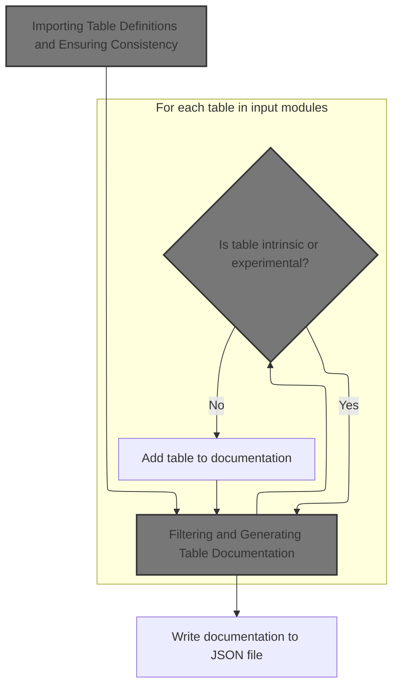
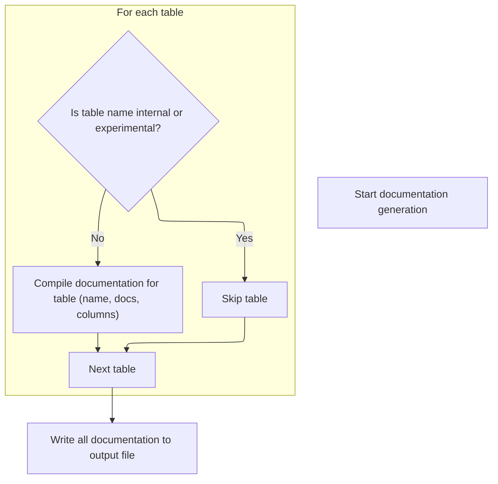

This document describes how maintainers and developers can generate up-to-date documentation for selected tables. By providing module file paths and an output file path, the flow imports table definitions, filters out internal and experimental tables, and writes the resulting documentation to a JSON file.

# Parsing Inputs and Preparing Module List



<SwmSnippet path="/tools/gen_tp_table_docs.py" line="94">

---

We parse arguments and convert file paths to module names so we can import and process table definitions for documentation.

```python
def main():
  parser = argparse.ArgumentParser()
  parser.add_argument('--out', required=True)
  parser.add_argument('inputs', nargs='*')
  parser.add_argument('--relative-input-dir')
  args = parser.parse_args()

  def get_relin_path(in_path: str):
    if not args.relative_input_dir:
      return in_path
    return os.path.relpath(in_path, args.relative_input_dir)

  modules = [
      os.path.splitext(get_relin_path(i).replace('/', '.'))[0]
      for i in args.inputs
  ]
  table_docs = []
  for parsed in util.parse_tables_from_modules(modules):
```

---

</SwmSnippet>

## Importing Table Definitions and Ensuring Consistency

```mermaid
%%{init: {"flowchart": {"defaultRenderer": "elk"}} }%%
flowchart TD
    node1["Start: Receive modules"] --> node2["Collect tables from modules"]
    click node1 openCode "python/generators/trace_processor_table/util.py:250:255"
    subgraph loop1["For each module"]
      node2 --> node3["Extract tables from module"]
      click node3 openCode "python/generators/trace_processor_table/util.py:255:261"
    end
    node3 --> node4["Sort tables by dependencies"]
    click node4 openCode "python/generators/trace_processor_table/util.py:266:267"
    subgraph loop2["For each table"]
      node4 --> node5{"Does table have a parent?"}
      click node5 openCode "python/generators/trace_processor_table/util.py:271:277"
      node5 -->|"Yes"| node6["Include parent columns"]
      click node6 openCode "python/generators/trace_processor_table/util.py:273:276"
      node5 -->|"No"| node7{"Add implicit or legacy columns?"}
      click node7 openCode "python/generators/trace_processor_table/util.py:278:279"
      node7 -->|"Yes"| node8["Add implicit/legacy columns"]
      click node8 openCode "python/generators/trace_processor_table/util.py:279:280"
      node7 -->|"No"| node9["Proceed to table columns"]
      node6 --> node10["Add table columns"]
      click node10 openCode "python/generators/trace_processor_table/util.py:281:283"
      node8 --> node10
      node9 --> node10
      node10 --> node11["Create parsed table"]
      click node11 openCode "python/generators/trace_processor_table/util.py:284:284"
    end
    subgraph loop3["For each sorted table"]
      node11 --> node12{"Is table from input modules?"}
      click node12 openCode "python/generators/trace_processor_table/util.py:291:291"
      node12 -->|"Yes"| node13["Include in output"]
      click node13 openCode "python/generators/trace_processor_table/util.py:288:292"
      node12 -->|"No"| node14["Skip table"]
    end
    node13 --> node15["Return parsed tables"]
    click node15 openCode "python/generators/trace_processor_table/util.py:288:292"

classDef HeadingStyle fill:#777777,stroke:#333,stroke-width:2px;

%% Swimm:
%% %%{init: {"flowchart": {"defaultRenderer": "elk"}} }%%
%% flowchart TD
%%     node1["Start: Receive modules"] --> node2["Collect tables from modules"]
%%     click node1 openCode "<SwmPath>[python/…/trace_processor_table/util.py](python/generators/trace_processor_table/util.py)</SwmPath>:250:255"
%%     subgraph loop1["For each module"]
%%       node2 --> node3["Extract tables from module"]
%%       click node3 openCode "<SwmPath>[python/…/trace_processor_table/util.py](python/generators/trace_processor_table/util.py)</SwmPath>:255:261"
%%     end
%%     node3 --> node4["Sort tables by dependencies"]
%%     click node4 openCode "<SwmPath>[python/…/trace_processor_table/util.py](python/generators/trace_processor_table/util.py)</SwmPath>:266:267"
%%     subgraph loop2["For each table"]
%%       node4 --> node5{"Does table have a parent?"}
%%       click node5 openCode "<SwmPath>[python/…/trace_processor_table/util.py](python/generators/trace_processor_table/util.py)</SwmPath>:271:277"
%%       node5 -->|"Yes"| node6["Include parent columns"]
%%       click node6 openCode "<SwmPath>[python/…/trace_processor_table/util.py](python/generators/trace_processor_table/util.py)</SwmPath>:273:276"
%%       node5 -->|"No"| node7{"Add implicit or legacy columns?"}
%%       click node7 openCode "<SwmPath>[python/…/trace_processor_table/util.py](python/generators/trace_processor_table/util.py)</SwmPath>:278:279"
%%       node7 -->|"Yes"| node8["Add implicit/legacy columns"]
%%       click node8 openCode "<SwmPath>[python/…/trace_processor_table/util.py](python/generators/trace_processor_table/util.py)</SwmPath>:279:280"
%%       node7 -->|"No"| node9["Proceed to table columns"]
%%       node6 --> node10["Add table columns"]
%%       click node10 openCode "<SwmPath>[python/…/trace_processor_table/util.py](python/generators/trace_processor_table/util.py)</SwmPath>:281:283"
%%       node8 --> node10
%%       node9 --> node10
%%       node10 --> node11["Create parsed table"]
%%       click node11 openCode "<SwmPath>[python/…/trace_processor_table/util.py](python/generators/trace_processor_table/util.py)</SwmPath>:284:284"
%%     end
%%     subgraph loop3["For each sorted table"]
%%       node11 --> node12{"Is table from input modules?"}
%%       click node12 openCode "<SwmPath>[python/…/trace_processor_table/util.py](python/generators/trace_processor_table/util.py)</SwmPath>:291:291"
%%       node12 -->|"Yes"| node13["Include in output"]
%%       click node13 openCode "<SwmPath>[python/…/trace_processor_table/util.py](python/generators/trace_processor_table/util.py)</SwmPath>:288:292"
%%       node12 -->|"No"| node14["Skip table"]
%%     end
%%     node13 --> node15["Return parsed tables"]
%%     click node15 openCode "<SwmPath>[python/…/trace_processor_table/util.py](python/generators/trace_processor_table/util.py)</SwmPath>:288:292"
%% 
%% classDef HeadingStyle fill:#777777,stroke:#333,stroke-width:2px;
```



<SwmSnippet path="/python/generators/trace_processor_table/util.py" line="250">

---

In <SwmToken path="python/generators/trace_processor_table/util.py" pos="250:2:2" line-data="def parse_tables_from_modules(modules: List[str]) -&gt; List[ParsedTable]:">`parse_tables_from_modules`</SwmToken>, we import each module using its name and grab the <SwmToken path="python/generators/trace_processor_table/util.py" pos="257:16:16" line-data="    run_tables: List[Table] = imported.__dict__[&#39;ALL_TABLES&#39;]">`ALL_TABLES`</SwmToken> list, which is a repository convention for table definitions. As we collect tables, we check for duplicate class_names and assert they are identical, so we don't end up with conflicting definitions.

```python
def parse_tables_from_modules(modules: List[str]) -> List[ParsedTable]:
  """Creates a list of tables with the associated paths."""

  # Create a mapping from the table to a "parsed" version of the table.
  tables: Dict[str, Table] = {}
  for module in modules:
    imported = importlib.import_module(module)
    run_tables: List[Table] = imported.__dict__['ALL_TABLES']
    for table in run_tables:
      existing_table = tables.get(table.class_name)
      assert not existing_table or existing_table == table
      tables[table.class_name] = table
```

---

</SwmSnippet>

<SwmSnippet path="/python/generators/trace_processor_table/util.py" line="261">

---

After collecting tables, we sort them topologically to make sure dependencies (like parent tables) are handled before their children. Then, for each table, we build up the column list by inheriting columns from parents or adding implicit columns for roots, and attach documentation for each column.

```python
      tables[table.class_name] = table

  # Sort all the tables: note that this list may include tables which are not
  # in |tables| dictionary due to dependencies on tables which live in a file
  # not covered by |input_paths|.
  sorted_tables = _topological_sort_table_and_deps(list(tables.values()))

  parsed_tables: Dict[str, ParsedTable] = {}
  for table in sorted_tables:
    parsed_columns: List[ParsedColumn] = []
    if table.parent:
      parsed_parent = parsed_tables[table.parent.class_name]
      parsed_columns += [
          dataclasses.replace(c, is_ancestor=True)
          for c in parsed_parent.columns
      ]
    else:
      if table.add_implicit_column or table.use_legacy_table_backend:
        parsed_columns += _create_implicit_columns_for_root(table)

    for c in table.columns:
      doc = table.tabledoc.columns.get(c.name) if table.tabledoc else None
      parsed_columns.append(ParsedColumn(c, _to_column_doc(doc)))
    parsed_tables[table.class_name] = ParsedTable(table, parsed_columns)
```

---

</SwmSnippet>

<SwmSnippet path="/python/generators/trace_processor_table/util.py" line="284">

---

After building <SwmToken path="python/generators/trace_processor_table/util.py" pos="284:10:10" line-data="    parsed_tables[table.class_name] = ParsedTable(table, parsed_columns)">`ParsedTable`</SwmToken> objects with all columns and docs, we filter the result to only include tables that were actually requested, skipping any that came in just as dependencies.

```python
    parsed_tables[table.class_name] = ParsedTable(table, parsed_columns)

  # Only return tables which come directly from |input_paths|. This stops us
  # generating tables which were not requested.
  return [
      parsed_tables[p.class_name]
      for p in sorted_tables
      if p.class_name in tables
  ]
```

---

</SwmSnippet>

## Filtering and Generating Table Documentation



<SwmSnippet path="/tools/gen_tp_table_docs.py" line="112">

---

Back in <SwmToken path="tools/gen_tp_table_docs.py" pos="94:2:2" line-data="def main():">`main`</SwmToken>, after getting parsed tables from util, we filter out internal and experimental tables by name, then build up the JSON docs for each remaining table, skipping ancestor columns and including all relevant metadata. Finally, we write the docs to the output file.

```python
    table = parsed.table

    # If there is no non-intrinsic alias for the table, don't
    # include the table in the docs.
    name = util.public_sql_name(table)
    if name.startswith('__intrinsic_') or name.startswith('experimental_'):
      continue

    doc = table.tabledoc
    assert doc
    cols = (
        gen_json_for_column(parsed, c)
        for c in parsed.columns
        if not c.is_ancestor)
    table_docs.append({
        'name': name,
        'cppClassName': table.class_name,
        'defMacro': table.class_name,
        'comment': '\n'.join(l.strip() for l in doc.doc.splitlines()),
        'parent': None,
        'parentDefName': table.parent.class_name if table.parent else '',
        'tablegroup': doc.group,
        'cols': [c for c in cols if c]
    })

  with open(args.out, 'w') as out:
    json.dump(table_docs, out, indent=2)
    out.write('\n')
```

---

</SwmSnippet>

&nbsp;

*This is an auto-generated document by Swimm 🌊 and has not yet been verified by a human*

<SwmMeta version="3.0.0" repo-id="Z2l0aHViJTNBJTNBY3BsdXNwbHVzLXBlcmZldHRvJTNBJTNBcmljYXJkb2xvcGV6Zw==" repo-name="cplusplus-perfetto"><sup>Powered by [Swimm](https://app.swimm.io/)</sup></SwmMeta>
