This document describes how the grid component is initialized and prepared for user interaction. The grid receives configuration and data, sizes columns to fit content, and enables features like virtual scrolling and column auto-sizing. The result is an interactive grid ready for use.

```mermaid
flowchart TD
  node1["Setting Up Grid DOM and Sizing Columns
(Setting Up Grid DOM and Sizing Columns)"]:::HeadingStyle
  click node1 goToHeading "Setting Up Grid DOM and Sizing Columns"
  node1 --> node2{"Are there rows to display?
(Setting Up Grid DOM and Sizing Columns)"}:::HeadingStyle
  click node2 goToHeading "Setting Up Grid DOM and Sizing Columns"
  node2 -->|"Yes"| node3{"Are there new columns to size?
(Setting Up Grid DOM and Sizing Columns)"}:::HeadingStyle
  click node3 goToHeading "Setting Up Grid DOM and Sizing Columns"
  node3 -->|"Yes"| node4["Size columns and prepare features
(Setting Up Grid DOM and Sizing Columns)"]:::HeadingStyle
  click node4 goToHeading "Setting Up Grid DOM and Sizing Columns"
  node3 -->|"No"| node4
  node2 -->|"No"| node4
  node4 --> node5{"Is virtualization enabled?
(Setting Up Grid DOM and Sizing Columns)"}:::HeadingStyle
  click node5 goToHeading "Setting Up Grid DOM and Sizing Columns"
  node5 -->|"Yes"| node6["Enable virtual scrolling
(Setting Up Grid DOM and Sizing Columns)"]:::HeadingStyle
  click node6 goToHeading "Setting Up Grid DOM and Sizing Columns"
  node5 -->|"No"| node7{"Is onReady callback provided?
(Setting Up Grid DOM and Sizing Columns)"}:::HeadingStyle
  click node7 goToHeading "Setting Up Grid DOM and Sizing Columns"
  node6 --> node7
  node7 -->|"Yes"| node8["Expose column auto-sizing APIs
(Setting Up Grid DOM and Sizing Columns)"]:::HeadingStyle
  click node8 goToHeading "Setting Up Grid DOM and Sizing Columns"
  node7 -->|"No"| node9["Grid ready for interaction
(Setting Up Grid DOM and Sizing Columns)"]:::HeadingStyle
  click node9 goToHeading "Setting Up Grid DOM and Sizing Columns"
  node8 --> node9
classDef HeadingStyle fill:#777777,stroke:#333,stroke-width:2px;

%% Swimm:
%% flowchart TD
%%   node1["Setting Up Grid DOM and Sizing Columns
%% (Setting Up Grid DOM and Sizing Columns)"]:::HeadingStyle
%%   click node1 goToHeading "Setting Up Grid DOM and Sizing Columns"
%%   node1 --> node2{"Are there rows to display?
%% (Setting Up Grid DOM and Sizing Columns)"}:::HeadingStyle
%%   click node2 goToHeading "Setting Up Grid DOM and Sizing Columns"
%%   node2 -->|"Yes"| node3{"Are there new columns to size?
%% (Setting Up Grid DOM and Sizing Columns)"}:::HeadingStyle
%%   click node3 goToHeading "Setting Up Grid DOM and Sizing Columns"
%%   node3 -->|"Yes"| node4["Size columns and prepare features
%% (Setting Up Grid DOM and Sizing Columns)"]:::HeadingStyle
%%   click node4 goToHeading "Setting Up Grid DOM and Sizing Columns"
%%   node3 -->|"No"| node4
%%   node2 -->|"No"| node4
%%   node4 --> node5{"Is virtualization enabled?
%% (Setting Up Grid DOM and Sizing Columns)"}:::HeadingStyle
%%   click node5 goToHeading "Setting Up Grid DOM and Sizing Columns"
%%   node5 -->|"Yes"| node6["Enable virtual scrolling
%% (Setting Up Grid DOM and Sizing Columns)"]:::HeadingStyle
%%   click node6 goToHeading "Setting Up Grid DOM and Sizing Columns"
%%   node5 -->|"No"| node7{"Is <SwmToken path="ui/src/widgets/grid.ts" pos="632:5:5" line-data="    // Call onReady callback with imperative API">`onReady`</SwmToken> callback provided?
%% (Setting Up Grid DOM and Sizing Columns)"}:::HeadingStyle
%%   click node7 goToHeading "Setting Up Grid DOM and Sizing Columns"
%%   node6 --> node7
%%   node7 -->|"Yes"| node8["Expose column auto-sizing APIs
%% (Setting Up Grid DOM and Sizing Columns)"]:::HeadingStyle
%%   click node8 goToHeading "Setting Up Grid DOM and Sizing Columns"
%%   node7 -->|"No"| node9["Grid ready for interaction
%% (Setting Up Grid DOM and Sizing Columns)"]:::HeadingStyle
%%   click node9 goToHeading "Setting Up Grid DOM and Sizing Columns"
%%   node8 --> node9
%% classDef HeadingStyle fill:#777777,stroke:#333,stroke-width:2px;
```



# Setting Up Grid DOM and Sizing Columns

```mermaid
%%{init: {"flowchart": {"defaultRenderer": "elk"}} }%%
flowchart TD
  node1["Initialize grid: extract rows, set up copy handler"] --> node2{"Are there rows to display?"}
  click node1 openCode "ui/src/widgets/grid.ts:556:565"
  node2 -->|"Yes"| node3{"Are there new columns to size?"}
  click node2 openCode "ui/src/widgets/grid.ts:566:590"
  node2 -->|"No"| node5{"Is virtualization enabled?"}
  node3 -->|"Yes"| subgraph loop1["For each new column"]
    node4["Prepare sizing info and measure/apply width"]
    click node4 openCode "ui/src/widgets/grid.ts:573:588"
  end
  loop1 --> node5{"Is virtualization enabled?"}
  node3 -->|"No"| node5
  node5{"Is virtualization enabled?"} -->|"Yes"| node6["Set up virtual scrolling"]
  click node5 openCode "ui/src/widgets/grid.ts:593:631"
  node5 -->|"No"| node7{"Is onReady callback provided?"}
  node6 --> node7{"Is onReady callback provided?"}
  click node6 openCode "ui/src/widgets/grid.ts:607:630"
  node7{"Is onReady callback provided?"} -->|"Yes"| node8["Expose imperative API for column auto-sizing"]
  click node7 openCode "ui/src/widgets/grid.ts:633:662"
  node7 -->|"No"| node9["Grid initialization complete"]
  click node8 openCode "ui/src/widgets/grid.ts:634:661"
  click node9 openCode "ui/src/widgets/grid.ts:663:663"
classDef HeadingStyle fill:#777777,stroke:#333,stroke-width:2px;

%% Swimm:
%% %%{init: {"flowchart": {"defaultRenderer": "elk"}} }%%
%% flowchart TD
%%   node1["Initialize grid: extract rows, set up copy handler"] --> node2{"Are there rows to display?"}
%%   click node1 openCode "<SwmPath>[ui/…/widgets/grid.ts](ui/src/widgets/grid.ts)</SwmPath>:556:565"
%%   node2 -->|"Yes"| node3{"Are there new columns to size?"}
%%   click node2 openCode "<SwmPath>[ui/…/widgets/grid.ts](ui/src/widgets/grid.ts)</SwmPath>:566:590"
%%   node2 -->|"No"| node5{"Is virtualization enabled?"}
%%   node3 -->|"Yes"| subgraph loop1["For each new column"]
%%     node4["Prepare sizing info and measure/apply width"]
%%     click node4 openCode "<SwmPath>[ui/…/widgets/grid.ts](ui/src/widgets/grid.ts)</SwmPath>:573:588"
%%   end
%%   loop1 --> node5{"Is virtualization enabled?"}
%%   node3 -->|"No"| node5
%%   node5{"Is virtualization enabled?"} -->|"Yes"| node6["Set up virtual scrolling"]
%%   click node5 openCode "<SwmPath>[ui/…/widgets/grid.ts](ui/src/widgets/grid.ts)</SwmPath>:593:631"
%%   node5 -->|"No"| node7{"Is <SwmToken path="ui/src/widgets/grid.ts" pos="632:5:5" line-data="    // Call onReady callback with imperative API">`onReady`</SwmToken> callback provided?"}
%%   node6 --> node7{"Is <SwmToken path="ui/src/widgets/grid.ts" pos="632:5:5" line-data="    // Call onReady callback with imperative API">`onReady`</SwmToken> callback provided?"}
%%   click node6 openCode "<SwmPath>[ui/…/widgets/grid.ts](ui/src/widgets/grid.ts)</SwmPath>:607:630"
%%   node7{"Is <SwmToken path="ui/src/widgets/grid.ts" pos="632:5:5" line-data="    // Call onReady callback with imperative API">`onReady`</SwmToken> callback provided?"} -->|"Yes"| node8["Expose imperative API for column auto-sizing"]
%%   click node7 openCode "<SwmPath>[ui/…/widgets/grid.ts](ui/src/widgets/grid.ts)</SwmPath>:633:662"
%%   node7 -->|"No"| node9["Grid initialization complete"]
%%   click node8 openCode "<SwmPath>[ui/…/widgets/grid.ts](ui/src/widgets/grid.ts)</SwmPath>:634:661"
%%   click node9 openCode "<SwmPath>[ui/…/widgets/grid.ts](ui/src/widgets/grid.ts)</SwmPath>:663:663"
%% classDef HeadingStyle fill:#777777,stroke:#333,stroke-width:2px;
```

<SwmSnippet path="/ui/src/widgets/grid.ts" line="556">

---

In <SwmToken path="ui/src/widgets/grid.ts" pos="556:1:1" line-data="  oncreate(vnode: m.VnodeDOM&lt;GridAttrs, this&gt;) {">`oncreate`</SwmToken>, we prep the grid and call <SwmToken path="ui/src/widgets/grid.ts" pos="573:3:3" line-data="        this.measureAndApplyWidths(">`measureAndApplyWidths`</SwmToken> for any columns that need sizing, so the grid layout matches the data before moving on.

```typescript
  oncreate(vnode: m.VnodeDOM<GridAttrs, this>) {
    const {virtualization, columns, rowData} = vnode.attrs;

    // Extract rows from rowData
    const rows = isPartialRowData(rowData) ? rowData.data : rowData;

    // Add copy event handler for spreadsheet-friendly formatting
    const gridDom = vnode.dom as HTMLElement;
    gridDom.addEventListener('copy', this.boundHandleCopy);

    if (rows.length > 0) {
      // Check if there are new columns that need sizing
      const newColumns = columns.filter(
        (column) => !this.sizedColumns.has(column.key),
      );

      if (newColumns.length > 0) {
        this.measureAndApplyWidths(
          vnode.dom as HTMLElement,
          newColumns.map((col) => {
            const {
              key,
              minWidth = COL_WIDTH_MIN_PX,
              maxInitialWidthPx = COL_WIDTH_INITIAL_MAX_PX,
            } = col;

            return {
              key,
              minWidth,
              maxWidth: maxInitialWidthPx,
            };
          }),
        );
      }
    }

    // Only set up virtual scrolling if virtualization is enabled
    if (virtualization === undefined) {
      return;
    }

    const rowHeight = virtualization.rowHeightPx;
    const onLoadData = isPartialRowData(rowData)
      ? rowData.onLoadData
      : undefined;

    const scrollContainer: HTMLElement = (vnode.dom as HTMLElement)!;
    const slider: HTMLElement = (vnode.dom as HTMLElement).querySelector(
      '[ref="slider"]',
    )!;

    new VirtualScrollHelper(slider, scrollContainer, [
      {
        overdrawPx: 500,
        tolerancePx: 250,
        callback: (rect) => {
          const rowStart = Math.floor(rect.top / rowHeight);
          const rowCount = Math.ceil(rect.height / rowHeight);
          this.renderBounds = {rowStart, rowEnd: rowStart + rowCount};
          m.redraw();
        },
      },
      {
        overdrawPx: 2000,
        tolerancePx: 1000,
        callback: (rect) => {
          const rowStart = Math.floor(rect.top / rowHeight);
          const rowEnd = Math.ceil(rect.bottom / rowHeight);
          if (onLoadData !== undefined) {
            onLoadData(rowStart, rowEnd - rowStart);
          }
          m.redraw();
        },
      },
    ]);

    // Call onReady callback with imperative API
    if (vnode.attrs.onReady) {
      vnode.attrs.onReady({
        autoFitColumn: (columnKey: string) => {
          const gridDom = vnode.dom as HTMLElement;
          const column = columns.find((c) => c.key === columnKey);
          if (!column) return;

          this.measureAndApplyWidths(gridDom, [
            {
              key: column.key,
              minWidth: column.minWidth ?? COL_WIDTH_MIN_PX,
              maxWidth: Infinity,
            },
          ]);
          m.redraw();
        },
        autoFitAllColumns: () => {
          const gridDom = vnode.dom as HTMLElement;
          this.measureAndApplyWidths(
            gridDom,
            columns.map((column) => ({
              key: column.key,
              minWidth: column.minWidth ?? COL_WIDTH_MIN_PX,
              maxWidth: Infinity,
            })),
          );
```

---

</SwmSnippet>

<SwmSnippet path="/ui/src/widgets/grid.ts" line="703">

---

<SwmToken path="ui/src/widgets/grid.ts" pos="703:3:3" line-data="  private measureAndApplyWidths(">`measureAndApplyWidths`</SwmToken> clones the grid DOM, hides non-measure elements, and measures each column's cell widths using <SwmToken path="ui/src/widgets/grid.ts" pos="745:5:5" line-data="        return c.scrollWidth;">`scrollWidth`</SwmToken>. It calculates the max width plus padding, clamps it, and sets the result as a CSS variable on the original grid. This avoids layout issues and keeps sizing isolated from the live grid.

```typescript
  private measureAndApplyWidths(
    gridDom: HTMLElement,
    columns: ReadonlyArray<{
      readonly key: string;
      readonly minWidth: number;
      readonly maxWidth: number;
    }>,
  ): void {
    const gridClone = gridDom.cloneNode(true) as HTMLElement;
    gridDom.appendChild(gridClone);

    // Hide any elements that are not part of the measurement - these are
    // elements with class .pf-grid--no-measure
    const noMeasureElements = gridClone.querySelectorAll(
      '.pf-grid--no-measure',
    );
    noMeasureElements.forEach((el) => {
      (el as HTMLElement).style.display = 'none';
    });

    // Now read the actual widths (this will cause a reflow)
    // Find all the cells in this column (header + data rows)
    const allCells = gridClone.querySelectorAll(`.pf-grid__cell-container`);

    // Only continue if we have more cells than just the header
    if (allCells.length <= columns.length) {
      gridClone.remove();
      return;
    }

    columns.forEach((column) => {
      const columnId = this.getColumnId(column.key);

      // Clear the existing width to allow natural sizing
      gridClone.style.setProperty(`--pf-grid-col-${columnId}`, 'fit-content');

      // Find all the cells in this column
      const cellsInThisColumn = Array.from(allCells).filter(
        (cell) => (cell as HTMLElement).dataset['columnId'] === `${columnId}`,
      );

      const widths = cellsInThisColumn.map((c) => {
        return c.scrollWidth;
      });
      const maxCellWidth = Math.max(...widths);
      const unboundedWidth = maxCellWidth + CELL_PADDING_PX;
      const width = Math.min(
        column.maxWidth,
        Math.max(column.minWidth, unboundedWidth),
      );

      gridDom.style.setProperty(`--pf-grid-col-${columnId}`, `${width}px`);

      // Store the width
      this.sizedColumns.add(column.key);
    });

    gridClone.remove();
  }
```

---

</SwmSnippet>

<SwmSnippet path="/ui/src/widgets/grid.ts" line="659">

---

After sizing columns in <SwmToken path="ui/src/widgets/grid.ts" pos="556:1:1" line-data="  oncreate(vnode: m.VnodeDOM&lt;GridAttrs, this&gt;) {">`oncreate`</SwmToken>, we redraw the grid and provide APIs for consumers to <SwmToken path="ui/src/widgets/grid.ts" pos="244:20:22" line-data="   * @param columnKey The key of the column to auto-fit">`auto-fit`</SwmToken> columns as needed.

```typescript
          m.redraw();
        },
      });
    }
  }
```

---

</SwmSnippet>

&nbsp;

*This is an auto-generated document by Swimm 🌊 and has not yet been verified by a human*

<SwmMeta version="3.0.0" repo-id="Z2l0aHViJTNBJTNBY3BsdXNwbHVzLXBlcmZldHRvJTNBJTNBcmljYXJkb2xvcGV6Zw==" repo-name="cplusplus-perfetto"><sup>Powered by [Swimm](https://app.swimm.io/)</sup></SwmMeta>
