This document describes how tracks that do not belong to main categories or are not marked as important are grouped into a dedicated section for easier access and organization. Copies of these tracks are added to the new group, making it easier for users to find and review miscellaneous tracks during trace analysis.

# Where is this flow used?

This flow is used multiple times in the codebase as represented in the following diagram:

```mermaid
graph TD;
      b0b67ae6b6f3f71d3fd990a9bbde2c4f1a3793d26dffc3048828bd0e0050979a(ui/…/com.android.LargeScreensPerf/index.ts::onTraceLoad) --> 52bd654a6ed7b230a89b480cb23f02b564f233d7caf3968399843f08fd7b2394(ui/…/com.android.LargeScreensPerf/index.ts::addUnfoldMiscSection):::mainFlowStyle

860a05040adafffac1f14045f42666b5d1391f101cd7003fc6523cf1dc78d56e(ui/…/com.android.LargeScreensPerf/index.ts::callback) --> 52bd654a6ed7b230a89b480cb23f02b564f233d7caf3968399843f08fd7b2394(ui/…/com.android.LargeScreensPerf/index.ts::addUnfoldMiscSection):::mainFlowStyle


classDef mainFlowStyle color:#000000,fill:#7CB9F4
classDef rootsStyle color:#000000,fill:#00FFF4
classDef Style1 color:#000000,fill:#00FFAA
classDef Style2 color:#000000,fill:#FFFF00
classDef Style3 color:#000000,fill:#AA7CB9

%% Swimm:
%% graph TD;
%%       b0b67ae6b6f3f71d3fd990a9bbde2c4f1a3793d26dffc3048828bd0e0050979a(<SwmPath>[ui/…/com.android.LargeScreensPerf/index.ts](ui/src/plugins/com.android.LargeScreensPerf/index.ts)</SwmPath>::<SwmToken path="ui/src/plugins/com.android.LargeScreensPerf/index.ts" pos="29:3:3" line-data="  async onTraceLoad(ctx: Trace): Promise&lt;void&gt; {">`onTraceLoad`</SwmToken>) --> 52bd654a6ed7b230a89b480cb23f02b564f233d7caf3968399843f08fd7b2394(<SwmPath>[ui/…/com.android.LargeScreensPerf/index.ts](ui/src/plugins/com.android.LargeScreensPerf/index.ts)</SwmPath>::<SwmToken path="ui/src/plugins/com.android.LargeScreensPerf/index.ts" pos="67:3:3" line-data="  private addUnfoldMiscSection(ctx: Trace) {">`addUnfoldMiscSection`</SwmToken>):::mainFlowStyle
%% 
%% 860a05040adafffac1f14045f42666b5d1391f101cd7003fc6523cf1dc78d56e(<SwmPath>[ui/…/com.android.LargeScreensPerf/index.ts](ui/src/plugins/com.android.LargeScreensPerf/index.ts)</SwmPath>::callback) --> 52bd654a6ed7b230a89b480cb23f02b564f233d7caf3968399843f08fd7b2394(<SwmPath>[ui/…/com.android.LargeScreensPerf/index.ts](ui/src/plugins/com.android.LargeScreensPerf/index.ts)</SwmPath>::<SwmToken path="ui/src/plugins/com.android.LargeScreensPerf/index.ts" pos="67:3:3" line-data="  private addUnfoldMiscSection(ctx: Trace) {">`addUnfoldMiscSection`</SwmToken>):::mainFlowStyle
%% 
%% 
%% classDef mainFlowStyle color:#000000,fill:#7CB9F4
%% classDef rootsStyle color:#000000,fill:#00FFF4
%% classDef Style1 color:#000000,fill:#00FFAA
%% classDef Style2 color:#000000,fill:#FFFF00
%% classDef Style3 color:#000000,fill:#AA7CB9
```



# Grouping and Inserting Miscellaneous Tracks

<SwmSnippet path="/ui/src/plugins/com.android.LargeScreensPerf/index.ts" line="67">

---

In <SwmToken path="ui/src/plugins/com.android.LargeScreensPerf/index.ts" pos="67:3:3" line-data="  private addUnfoldMiscSection(ctx: Trace) {">`addUnfoldMiscSection`</SwmToken>, we start by creating a new <SwmToken path="ui/src/plugins/com.android.LargeScreensPerf/index.ts" pos="69:9:9" line-data="    const group = new TrackNode({name: &#39;Unfold misc&#39;});">`TrackNode`</SwmToken> group called 'Unfold misc' and immediately add it as the first child of the current workspace. This sets up a dedicated section for tracks that are neither pinned nor fit other categories. We need to call workspace's <SwmToken path="ui/src/plugins/com.android.LargeScreensPerf/index.ts" pos="70:5:5" line-data="    ctx.currentWorkspace.addChildFirst(group);">`addChildFirst`</SwmToken> next to actually insert this group at the top of the workspace's children, prepping it for the tracks we'll add later.

```typescript
  private addUnfoldMiscSection(ctx: Trace) {
    // section for tracks that don't fit neatly in other sections and are not so important to be pinned
    const group = new TrackNode({name: 'Unfold misc'});
    ctx.currentWorkspace.addChildFirst(group);
```

---

</SwmSnippet>

<SwmSnippet path="/ui/src/public/workspace.ts" line="358">

---

AddChildFirst validates the child and inserts it at the start of the workspace's children.

```typescript
  addChildFirst(child: TrackNode): Result {
    const result = this.adopt(child);
    if (!result.ok) return result;
    this._children.unshift(child);
    return result;
  }
```

---

</SwmSnippet>

<SwmSnippet path="/ui/src/plugins/com.android.LargeScreensPerf/index.ts" line="71">

---

Back in <SwmToken path="ui/src/plugins/com.android.LargeScreensPerf/index.ts" pos="67:3:3" line-data="  private addUnfoldMiscSection(ctx: Trace) {">`addUnfoldMiscSection`</SwmToken>, after inserting the group, we filter tracks in the workspace by name to find those relevant to 'Unfold misc', clone them, and add each clone as the last child of the group. We call <SwmToken path="ui/src/plugins/com.android.LargeScreensPerf/index.ts" pos="78:12:12" line-data="      .forEach((track) =&gt; group.addChildLast(track));">`addChildLast`</SwmToken> from <SwmPath>[ui/…/public/workspace.ts](ui/src/public/workspace.ts)</SwmPath> for each clone to make sure they're appended in order, keeping the originals untouched.

```typescript
    ctx.currentWorkspace.flatTracks
      .filter(
        (t) =>
          t.name.startsWith('waitForAllWindowsDrawn') ||
          t.name == 'Waiting for KeyguardDrawnCallback#onDrawn',
      )
      .map((t) => t.clone())
      .forEach((track) => group.addChildLast(track));
  }
```

---

</SwmSnippet>

<SwmSnippet path="/ui/src/public/workspace.ts" line="346">

---

AddChildLast checks the child and adds it to the end of the group's children.

```typescript
  addChildLast(child: TrackNode): Result {
    const result = this.adopt(child);
    if (!result.ok) return result;
    this._children.push(child);
    return result;
  }
```

---

</SwmSnippet>

&nbsp;

*This is an auto-generated document by Swimm 🌊 and has not yet been verified by a human*

<SwmMeta version="3.0.0" repo-id="Z2l0aHViJTNBJTNBY3BsdXNwbHVzLXBlcmZldHRvJTNBJTNBcmljYXJkb2xvcGV6Zw==" repo-name="cplusplus-perfetto"><sup>Powered by [Swimm](https://app.swimm.io/)</sup></SwmMeta>
