This document describes how unfold animation tracks are automatically grouped into a new section at the top of the workspace. Tracks related to unfold animation are identified by their names and collected together, making it easier to review and manage these events in the trace analysis interface.

# Where is this flow used?

This flow is used multiple times in the codebase as represented in the following diagram:

```mermaid
graph TD;
      b0b67ae6b6f3f71d3fd990a9bbde2c4f1a3793d26dffc3048828bd0e0050979a(ui/…/com.android.LargeScreensPerf/index.ts::onTraceLoad) --> dd6982f3667bc2d7fb096aea80de24a9b690bd260deda4eca0f50a69f1cab278(ui/…/com.android.LargeScreensPerf/index.ts::addUnfoldAnimationSection):::mainFlowStyle

860a05040adafffac1f14045f42666b5d1391f101cd7003fc6523cf1dc78d56e(ui/…/com.android.LargeScreensPerf/index.ts::callback) --> dd6982f3667bc2d7fb096aea80de24a9b690bd260deda4eca0f50a69f1cab278(ui/…/com.android.LargeScreensPerf/index.ts::addUnfoldAnimationSection):::mainFlowStyle


classDef mainFlowStyle color:#000000,fill:#7CB9F4
classDef rootsStyle color:#000000,fill:#00FFF4
classDef Style1 color:#000000,fill:#00FFAA
classDef Style2 color:#000000,fill:#FFFF00
classDef Style3 color:#000000,fill:#AA7CB9

%% Swimm:
%% graph TD;
%%       b0b67ae6b6f3f71d3fd990a9bbde2c4f1a3793d26dffc3048828bd0e0050979a(<SwmPath>[ui/…/com.android.LargeScreensPerf/index.ts](ui/src/plugins/com.android.LargeScreensPerf/index.ts)</SwmPath>::<SwmToken path="ui/src/plugins/com.android.LargeScreensPerf/index.ts" pos="29:3:3" line-data="  async onTraceLoad(ctx: Trace): Promise&lt;void&gt; {">`onTraceLoad`</SwmToken>) --> dd6982f3667bc2d7fb096aea80de24a9b690bd260deda4eca0f50a69f1cab278(<SwmPath>[ui/…/com.android.LargeScreensPerf/index.ts](ui/src/plugins/com.android.LargeScreensPerf/index.ts)</SwmPath>::<SwmToken path="ui/src/plugins/com.android.LargeScreensPerf/index.ts" pos="81:3:3" line-data="  private addUnfoldAnimationSection(ctx: Trace) {">`addUnfoldAnimationSection`</SwmToken>):::mainFlowStyle
%% 
%% 860a05040adafffac1f14045f42666b5d1391f101cd7003fc6523cf1dc78d56e(<SwmPath>[ui/…/com.android.LargeScreensPerf/index.ts](ui/src/plugins/com.android.LargeScreensPerf/index.ts)</SwmPath>::callback) --> dd6982f3667bc2d7fb096aea80de24a9b690bd260deda4eca0f50a69f1cab278(<SwmPath>[ui/…/com.android.LargeScreensPerf/index.ts](ui/src/plugins/com.android.LargeScreensPerf/index.ts)</SwmPath>::<SwmToken path="ui/src/plugins/com.android.LargeScreensPerf/index.ts" pos="81:3:3" line-data="  private addUnfoldAnimationSection(ctx: Trace) {">`addUnfoldAnimationSection`</SwmToken>):::mainFlowStyle
%% 
%% 
%% classDef mainFlowStyle color:#000000,fill:#7CB9F4
%% classDef rootsStyle color:#000000,fill:#00FFF4
%% classDef Style1 color:#000000,fill:#00FFAA
%% classDef Style2 color:#000000,fill:#FFFF00
%% classDef Style3 color:#000000,fill:#AA7CB9
```



# Grouping Unfold Animation Tracks


<SwmSnippet path="/ui/src/plugins/com.android.LargeScreensPerf/index.ts" line="81">

---

In <SwmToken path="ui/src/plugins/com.android.LargeScreensPerf/index.ts" pos="81:3:3" line-data="  private addUnfoldAnimationSection(ctx: Trace) {">`addUnfoldAnimationSection`</SwmToken>, we start by creating a new <SwmToken path="ui/src/plugins/com.android.LargeScreensPerf/index.ts" pos="82:9:9" line-data="    const group = new TrackNode({name: &#39;Unfold animation&#39;});">`TrackNode`</SwmToken> labeled 'Unfold animation' and immediately add it as the first child of the current workspace. This sets up a dedicated group node at the top of the workspace for all unfold animation tracks. We need to call into the workspace logic next to actually insert this node in the correct position before we can group tracks under it.

```typescript
  private addUnfoldAnimationSection(ctx: Trace) {
    const group = new TrackNode({name: 'Unfold animation'});
    ctx.currentWorkspace.addChildFirst(group);
```

---

</SwmSnippet>

<SwmSnippet path="/ui/src/public/workspace.ts" line="358">

---

Adopt links the child, then unshift puts it at the front of the children list to keep order.

```typescript
  addChildFirst(child: TrackNode): Result {
    const result = this.adopt(child);
    if (!result.ok) return result;
    this._children.unshift(child);
    return result;
  }
```

---

</SwmSnippet>

<SwmSnippet path="/ui/src/plugins/com.android.LargeScreensPerf/index.ts" line="84">

---

Back in <SwmToken path="ui/src/plugins/com.android.LargeScreensPerf/index.ts" pos="81:3:3" line-data="  private addUnfoldAnimationSection(ctx: Trace) {">`addUnfoldAnimationSection`</SwmToken>, after inserting the group node, we filter the workspace's <SwmToken path="ui/src/plugins/com.android.LargeScreensPerf/index.ts" pos="84:5:5" line-data="    ctx.currentWorkspace.flatTracks">`flatTracks`</SwmToken> for names matching unfold animation patterns, clone each match, and add the clones as children to the group. This organizes all relevant unfold animation tracks under one parent. We call into the workspace logic again to attach each cloned track as a child of the group node.

```typescript
    ctx.currentWorkspace.flatTracks
      .filter(
        (t) =>
          t.name == 'FoldUpdate' ||
          t.name.includes('UnfoldTransition') ||
          t.name.includes('UnfoldLightRevealOverlayAnimation') ||
          t.name.endsWith('UNFOLD_ANIM>'),
      )
      .map((t) => t.clone())
      .forEach((track) => group.addChildLast(track));
  }
```

---

</SwmSnippet>

<SwmSnippet path="/ui/src/public/workspace.ts" line="346">

---

<SwmToken path="ui/src/public/workspace.ts" pos="346:1:1" line-data="  addChildLast(child: TrackNode): Result {">`addChildLast`</SwmToken> links the child node to its parent using adopt, and then appends it to the end of the children array. This is how each cloned unfold animation track gets added to the group node in the right order.

```typescript
  addChildLast(child: TrackNode): Result {
    const result = this.adopt(child);
    if (!result.ok) return result;
    this._children.push(child);
    return result;
  }
```

---

</SwmSnippet>

&nbsp;

*This is an auto-generated document by Swimm 🌊 and has not yet been verified by a human*

<SwmMeta version="3.0.0" repo-id="Z2l0aHViJTNBJTNBY3BsdXNwbHVzLXBlcmZldHRvJTNBJTNBcmljYXJkb2xvcGV6Zw==" repo-name="cplusplus-perfetto"><sup>Powered by [Swimm](https://app.swimm.io/)</sup></SwmMeta>
