This document describes how users can add or edit columns in the query builder. When a user clicks to add or edit a column, the system checks the column type and displays the appropriate modal—Switch, If, or Expression—allowing the user to provide or update column details. Changes are saved only if confirmed by the user.

# Handling Column Modal Selection

```mermaid
%%{init: {"flowchart": {"defaultRenderer": "elk"}} }%%
flowchart TD
  node1["User clicks to add or edit a column"] --> node2{"Column type?"}
  click node1 openCode "ui/src/plugins/dev.perfetto.ExplorePage/query_builder/nodes/add_columns_node.ts:948:956"
  node2 -->|"switch"| node3["Show Switch Modal"]
  click node2 openCode "ui/src/plugins/dev.perfetto.ExplorePage/query_builder/nodes/add_columns_node.ts:949:955"
  node2 -->|"if"| node4["Show If Modal"]
  click node3 openCode "ui/src/plugins/dev.perfetto.ExplorePage/query_builder/nodes/add_columns_node.ts:708:765"
  node2 -->|"other"| node5["Show Expression Modal"]
  click node4 openCode "ui/src/plugins/dev.perfetto.ExplorePage/query_builder/nodes/add_columns_node.ts:951:953"
  click node5 openCode "ui/src/plugins/dev.perfetto.ExplorePage/query_builder/nodes/add_columns_node.ts:659:706"
classDef HeadingStyle fill:#777777,stroke:#333,stroke-width:2px;

%% Swimm:
%% %%{init: {"flowchart": {"defaultRenderer": "elk"}} }%%
%% flowchart TD
%%   node1["User clicks to add or edit a column"] --> node2{"Column type?"}
%%   click node1 openCode "<SwmPath>[ui/…/nodes/add_columns_node.ts](ui/src/plugins/dev.perfetto.ExplorePage/query_builder/nodes/add_columns_node.ts)</SwmPath>:948:956"
%%   node2 -->|"switch"| node3["Show Switch Modal"]
%%   click node2 openCode "<SwmPath>[ui/…/nodes/add_columns_node.ts](ui/src/plugins/dev.perfetto.ExplorePage/query_builder/nodes/add_columns_node.ts)</SwmPath>:949:955"
%%   node2 -->|"if"| node4["Show If Modal"]
%%   click node3 openCode "<SwmPath>[ui/…/nodes/add_columns_node.ts](ui/src/plugins/dev.perfetto.ExplorePage/query_builder/nodes/add_columns_node.ts)</SwmPath>:708:765"
%%   node2 -->|"other"| node5["Show Expression Modal"]
%%   click node4 openCode "<SwmPath>[ui/…/nodes/add_columns_node.ts](ui/src/plugins/dev.perfetto.ExplorePage/query_builder/nodes/add_columns_node.ts)</SwmPath>:951:953"
%%   click node5 openCode "<SwmPath>[ui/…/nodes/add_columns_node.ts](ui/src/plugins/dev.perfetto.ExplorePage/query_builder/nodes/add_columns_node.ts)</SwmPath>:659:706"
%% classDef HeadingStyle fill:#777777,stroke:#333,stroke-width:2px;
```



<SwmSnippet path="/ui/src/plugins/dev.perfetto.ExplorePage/query_builder/nodes/add_columns_node.ts" line="948">

---

In <SwmToken path="ui/src/plugins/dev.perfetto.ExplorePage/query_builder/nodes/add_columns_node.ts" pos="948:1:1" line-data="            onclick: () =&gt; {">`onclick`</SwmToken>, we check the column type and call <SwmToken path="ui/src/plugins/dev.perfetto.ExplorePage/query_builder/nodes/add_columns_node.ts" pos="950:3:3" line-data="                this.showSwitchModal(index);">`showSwitchModal`</SwmToken> if it's 'switch', so the user gets the right modal for that column type.

```typescript
            onclick: () => {
              if (col.type === 'switch') {
                this.showSwitchModal(index);
```

---

</SwmSnippet>

<SwmSnippet path="/ui/src/plugins/dev.perfetto.ExplorePage/query_builder/nodes/add_columns_node.ts" line="708">

---

<SwmToken path="ui/src/plugins/dev.perfetto.ExplorePage/query_builder/nodes/add_columns_node.ts" pos="708:3:3" line-data="  private showSwitchModal(columnIndex?: number) {">`showSwitchModal`</SwmToken> handles both adding and editing switch columns. It creates a temp copy of the column if editing, or a new one if adding. The modal lets the user edit this temp column, and only updates the real state if Save/Add is clicked. Cancel just closes the modal. There's no check for <SwmToken path="ui/src/plugins/dev.perfetto.ExplorePage/query_builder/nodes/add_columns_node.ts" pos="708:5:5" line-data="  private showSwitchModal(columnIndex?: number) {">`columnIndex`</SwmToken> validity, so passing a bad index could break things.

```typescript
  private showSwitchModal(columnIndex?: number) {
    const modalKey = 'add-switch-modal';
    const isEditing = columnIndex !== undefined;

    // Create a temporary copy to work with in the modal
    let tempColumn: NewColumn;
    if (isEditing && this.state.computedColumns?.[columnIndex]) {
      tempColumn = {
        ...this.state.computedColumns[columnIndex],
        cases: this.state.computedColumns[columnIndex].cases?.map((c) => ({
          ...c,
        })),
      };
    } else {
      tempColumn = {
        type: 'switch' as const,
        expression: '',
        name: '',
        cases: [],
      };
    }

    showModal({
      title: isEditing ? 'Edit Switch Column' : 'Add Switch Column',
      key: modalKey,
      content: () => {
        return this.renderComputedColumn(tempColumn);
      },
      buttons: [
        {
          text: 'Cancel',
          action: () => {
            // Do nothing - changes are not applied
          },
        },
        {
          text: isEditing ? 'Save' : 'Add',
          primary: true,
          action: () => {
            // Apply the temporary changes to the actual state
            if (isEditing && columnIndex !== undefined) {
              const newComputedColumns = [
                ...(this.state.computedColumns ?? []),
              ];
              newComputedColumns[columnIndex] = tempColumn;
              this.state.computedColumns = newComputedColumns;
            } else {
              this.state.computedColumns = [
                ...(this.state.computedColumns ?? []),
                tempColumn,
              ];
            }
            this.state.onchange?.();
          },
        },
      ],
    });
  }
```

---

</SwmSnippet>

<SwmSnippet path="/ui/src/plugins/dev.perfetto.ExplorePage/query_builder/nodes/add_columns_node.ts" line="951">

---

Back in <SwmToken path="ui/src/plugins/dev.perfetto.ExplorePage/query_builder/nodes/add_columns_node.ts" pos="948:1:1" line-data="            onclick: () =&gt; {">`onclick`</SwmToken>, after handling 'switch' and 'if' types, we call <SwmToken path="ui/src/plugins/dev.perfetto.ExplorePage/query_builder/nodes/add_columns_node.ts" pos="954:3:3" line-data="                this.showExpressionModal(index);">`showExpressionModal`</SwmToken> for any other column type. This makes sure users get the right modal for editing or adding columns that aren't handled by the other cases.

```typescript
              } else if (col.type === 'if') {
                this.showIfModal(index);
              } else {
                this.showExpressionModal(index);
              }
            },
```

---

</SwmSnippet>

<SwmSnippet path="/ui/src/plugins/dev.perfetto.ExplorePage/query_builder/nodes/add_columns_node.ts" line="659">

---

<SwmToken path="ui/src/plugins/dev.perfetto.ExplorePage/query_builder/nodes/add_columns_node.ts" pos="659:3:3" line-data="  private showExpressionModal(columnIndex?: number) {">`showExpressionModal`</SwmToken> pops up a modal for editing or adding expression columns. It uses a temp copy for editing, or a blank one for adding. Like <SwmToken path="ui/src/plugins/dev.perfetto.ExplorePage/query_builder/nodes/add_columns_node.ts" pos="708:3:3" line-data="  private showSwitchModal(columnIndex?: number) {">`showSwitchModal`</SwmToken>, it assumes <SwmToken path="ui/src/plugins/dev.perfetto.ExplorePage/query_builder/nodes/add_columns_node.ts" pos="659:5:5" line-data="  private showExpressionModal(columnIndex?: number) {">`columnIndex`</SwmToken> is valid and doesn't check, so passing a bad index could break things.

```typescript
  private showExpressionModal(columnIndex?: number) {
    const modalKey = 'add-expression-modal';
    const isEditing = columnIndex !== undefined;

    // Create a temporary copy to work with in the modal
    let tempColumn: NewColumn;
    if (isEditing && this.state.computedColumns?.[columnIndex]) {
      tempColumn = {...this.state.computedColumns[columnIndex]};
    } else {
      tempColumn = {expression: '', name: ''};
    }

    showModal({
      title: isEditing ? 'Edit Expression Column' : 'Add Expression Column',
      key: modalKey,
      content: () => {
        return this.renderComputedColumn(tempColumn);
      },
      buttons: [
        {
          text: 'Cancel',
          action: () => {
            // Do nothing - changes are not applied
          },
        },
        {
          text: isEditing ? 'Save' : 'Add',
          primary: true,
          action: () => {
            // Apply the temporary changes to the actual state
            if (isEditing && columnIndex !== undefined) {
              const newComputedColumns = [
                ...(this.state.computedColumns ?? []),
              ];
              newComputedColumns[columnIndex] = tempColumn;
              this.state.computedColumns = newComputedColumns;
            } else {
              this.state.computedColumns = [
                ...(this.state.computedColumns ?? []),
                tempColumn,
              ];
            }
            this.state.onchange?.();
          },
        },
      ],
    });
  }
```

---

</SwmSnippet>

&nbsp;

*This is an auto-generated document by Swimm 🌊 and has not yet been verified by a human*

<SwmMeta version="3.0.0" repo-id="Z2l0aHViJTNBJTNBY3BsdXNwbHVzLXBlcmZldHRvJTNBJTNBcmljYXJkb2xvcGV6Zw==" repo-name="cplusplus-perfetto"><sup>Powered by [Swimm](https://app.swimm.io/)</sup></SwmMeta>
