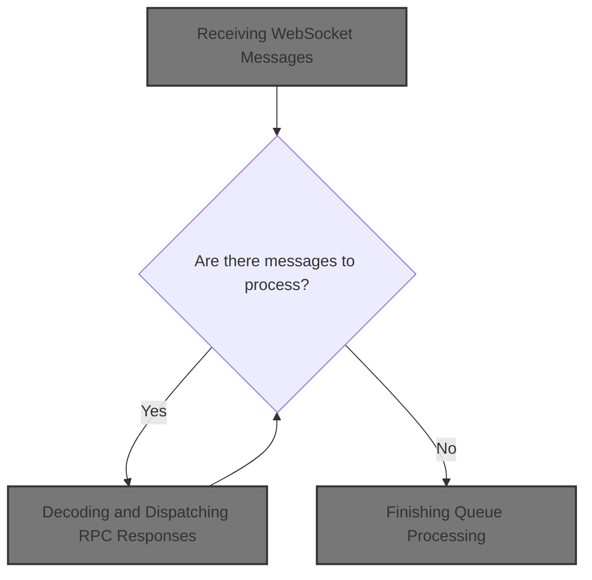

This document outlines the flow for handling incoming <SwmToken path="ui/src/trace_processor/http_rpc_engine.ts" pos="32:6:6" line-data="  private websocket?: WebSocket;">`WebSocket`</SwmToken> messages with trace processor responses. Messages are received, queued, and processed to decode trace data for interactive analysis and visualization.



# Receiving <SwmToken path="ui/src/trace_processor/http_rpc_engine.ts" pos="32:6:6" line-data="  private websocket?: WebSocket;">`WebSocket`</SwmToken> Messages

<SwmSnippet path="/ui/src/trace_processor/http_rpc_engine.ts" line="52">

---

<SwmToken path="ui/src/trace_processor/http_rpc_engine.ts" pos="52:5:5" line-data="      this.websocket.onmessage = (e) =&gt; this.onWebsocketMessage(e);">`onmessage`</SwmToken> just forwards <SwmToken path="ui/src/trace_processor/http_rpc_engine.ts" pos="32:6:6" line-data="  private websocket?: WebSocket;">`WebSocket`</SwmToken> messages to <SwmToken path="ui/src/trace_processor/http_rpc_engine.ts" pos="52:17:17" line-data="      this.websocket.onmessage = (e) =&gt; this.onWebsocketMessage(e);">`onWebsocketMessage`</SwmToken> to start processing.

```typescript
      this.websocket.onmessage = (e) => this.onWebsocketMessage(e);
```

---

</SwmSnippet>

# Queueing Incoming Data

<SwmSnippet path="/ui/src/trace_processor/http_rpc_engine.ts" line="90">

---

<SwmToken path="ui/src/trace_processor/http_rpc_engine.ts" pos="90:3:3" line-data="  private onWebsocketMessage(e: MessageEvent) {">`onWebsocketMessage`</SwmToken> queues the message and kicks off processing with <SwmToken path="ui/src/trace_processor/http_rpc_engine.ts" pos="93:3:3" line-data="    this.processQueue();">`processQueue`</SwmToken>.

```typescript
  private onWebsocketMessage(e: MessageEvent) {
    const blob = assertExists(e.data as Blob);
    this.queue.push(blob);
    this.processQueue();
  }
```

---

</SwmSnippet>

# Processing the Message Queue

<SwmSnippet path="/ui/src/trace_processor/http_rpc_engine.ts" line="96">

---

<SwmToken path="ui/src/trace_processor/http_rpc_engine.ts" pos="96:5:5" line-data="  private async processQueue() {">`processQueue`</SwmToken> drains the queue, passing each message to <SwmToken path="ui/src/trace_processor/http_rpc_engine.ts" pos="103:3:3" line-data="        super.onRpcResponseBytes(new Uint8Array(buf));">`onRpcResponseBytes`</SwmToken> for decoding and handling.

```typescript
  private async processQueue() {
    if (this.isProcessingQueue) return;
    this.isProcessingQueue = true;
    while (this.queue.length > 0) {
      try {
        const blob = assertExists(this.queue.shift());
        const buf = await blob.arrayBuffer();
        super.onRpcResponseBytes(new Uint8Array(buf));
      } catch (e) {
        reportError(e);
      }
    }
```

---

</SwmSnippet>

## Decoding and Dispatching RPC Responses

```mermaid
%%{init: {"flowchart": {"defaultRenderer": "elk"}} }%%
flowchart TD
  node1["Receive new RPC response data"]
  click node1 openCode "ui/src/trace_processor/engine.ts:173:178"
  node1 --> node2["Accumulate data in buffer"]
  click node2 openCode "ui/src/trace_processor/engine.ts:178:178"
  node2 --> node3{"Is there a complete message in the buffer?"}
  click node3 openCode "ui/src/trace_processor/engine.ts:179:181"
  
  subgraph loop1["While there is a complete message"]
    node3 -->|"Yes"| node4["Extract and process message"]
    click node4 openCode "ui/src/trace_processor/engine.ts:180:182"
    node4 --> node3
  end
  node3 -->|"No"| node5["Finish"]
  click node5 openCode "ui/src/trace_processor/engine.ts:183:184"

classDef HeadingStyle fill:#777777,stroke:#333,stroke-width:2px;

%% Swimm:
%% %%{init: {"flowchart": {"defaultRenderer": "elk"}} }%%
%% flowchart TD
%%   node1["Receive new RPC response data"]
%%   click node1 openCode "<SwmPath>[ui/…/trace_processor/engine.ts](ui/src/trace_processor/engine.ts)</SwmPath>:173:178"
%%   node1 --> node2["Accumulate data in buffer"]
%%   click node2 openCode "<SwmPath>[ui/…/trace_processor/engine.ts](ui/src/trace_processor/engine.ts)</SwmPath>:178:178"
%%   node2 --> node3{"Is there a complete message in the buffer?"}
%%   click node3 openCode "<SwmPath>[ui/…/trace_processor/engine.ts](ui/src/trace_processor/engine.ts)</SwmPath>:179:181"
%%   
%%   subgraph loop1["While there is a complete message"]
%%     node3 -->|"Yes"| node4["Extract and process message"]
%%     click node4 openCode "<SwmPath>[ui/…/trace_processor/engine.ts](ui/src/trace_processor/engine.ts)</SwmPath>:180:182"
%%     node4 --> node3
%%   end
%%   node3 -->|"No"| node5["Finish"]
%%   click node5 openCode "<SwmPath>[ui/…/trace_processor/engine.ts](ui/src/trace_processor/engine.ts)</SwmPath>:183:184"
%% 
%% classDef HeadingStyle fill:#777777,stroke:#333,stroke-width:2px;
```



<SwmSnippet path="/ui/src/trace_processor/engine.ts" line="173">

---

<SwmToken path="ui/src/trace_processor/engine.ts" pos="173:1:1" line-data="  onRpcResponseBytes(dataWillBeRetained: Uint8Array) {">`onRpcResponseBytes`</SwmToken> buffers incoming data and processes each complete message as it becomes available, optimizing for memory and performance.

```typescript
  onRpcResponseBytes(dataWillBeRetained: Uint8Array) {
    // Note: when hitting the fastpath inside ProtoRingBuffer, the |data| buffer
    // is returned back by readMessage() (% subarray()-ing it) and held onto by
    // other classes (e.g., QueryResult). For both fetch() and Wasm we are fine
    // because every response creates a new buffer.
    this.rxBuf.append(dataWillBeRetained);
    for (;;) {
      const msg = this.rxBuf.readMessage();
      if (msg === undefined) break;
      this.onRpcResponseMessage(msg);
    }
  }
```

---

</SwmSnippet>

<SwmSnippet path="/ui/src/trace_processor/engine.ts" line="189">

---

<SwmToken path="ui/src/trace_processor/engine.ts" pos="189:3:3" line-data="  private onRpcResponseMessage(rpcMsgEncoded: Uint8Array) {">`onRpcResponseMessage`</SwmToken> decodes responses, efficiently handles streaming data by overriding decode, and manages async state for each response type.

```typescript
  private onRpcResponseMessage(rpcMsgEncoded: Uint8Array) {
    // Here we override the protobufjs-generated code to skip the parsing of the
    // new streaming QueryResult and instead passing it through like a buffer.
    // This is the overall problem: All trace processor responses are wrapped
    // into a TraceProcessorRpc proto message. In all cases %
    // TPM_QUERY_STREAMING, we want protobufjs to decode the proto bytes and
    // give us a structured object. In the case of TPM_QUERY_STREAMING, instead,
    // we want to deal with the proto parsing ourselves using the new
    // QueryResult.appendResultBatch() method, because that handled streaming
    // results more efficiently and skips several copies.
    // By overriding the decode method below, we achieve two things:
    // 1. We avoid protobufjs decoding the TraceProcessorRpc.query_result field.
    // 2. We stash (a view of) the original buffer into the |rawQueryResult| so
    //    the `case TPM_QUERY_STREAMING` below can take it.
    protos.QueryResult.decode = (reader: protobuf.Reader, length: number) => {
      const res = protos.QueryResult.create() as {} as QueryResultBypass;
      res.rawQueryResult = reader.buf.subarray(reader.pos, reader.pos + length);
      // All this works only if protobufjs returns the original ArrayBuffer
      // from |rpcMsgEncoded|. It should be always the case given the
      // current implementation. This check mainly guards against future
      // behavioral changes of protobufjs. We don't want to accidentally
      // hold onto some internal protobufjs buffer. We are fine holding
      // onto |rpcMsgEncoded| because those come from ProtoRingBuffer which
      // is buffer-retention-friendly.
      assertTrue(res.rawQueryResult.buffer === rpcMsgEncoded.buffer);
      reader.pos += length;
      return res as {} as protos.QueryResult;
    };

    const rpc = protos.TraceProcessorRpc.decode(rpcMsgEncoded);

    if (rpc.fatalError !== undefined && rpc.fatalError.length > 0) {
      this.fail(`${rpc.fatalError}`);
    }

    // Allow restarting sequences from zero (when reloading the browser).
    if (rpc.seq !== this.rxSeqId + 1 && this.rxSeqId !== 0 && rpc.seq !== 0) {
      // "(ERR:rpc_seq)" is intercepted by error_dialog.ts to show a more
      // graceful and actionable error.
      this.fail(
        `RPC sequence id mismatch ` +
          `cur=${rpc.seq} last=${this.rxSeqId} (ERR:rpc_seq)`,
      );
    }

    this.rxSeqId = rpc.seq;

    let isFinalResponse = true;

    switch (rpc.response) {
      case TPM.TPM_APPEND_TRACE_DATA: {
        const appendResult = assertExists(rpc.appendResult);
        const pendingPromise = assertExists(this.pendingParses.shift());
        if (exists(appendResult.error) && appendResult.error.length > 0) {
          pendingPromise.reject(appendResult.error);
        } else {
          pendingPromise.resolve();
        }
        break;
      }
      case TPM.TPM_FINALIZE_TRACE_DATA: {
        const finalizeResult = assertExists(rpc.finalizeDataResult);
        const pendingPromise = assertExists(this.pendingEOFs.shift());
        if (exists(finalizeResult.error) && finalizeResult.error.length > 0) {
          pendingPromise.reject(finalizeResult.error);
        } else {
          pendingPromise.resolve();
        }
        break;
      }
      case TPM.TPM_RESET_TRACE_PROCESSOR:
        assertExists(this.pendingResetTraceProcessors.shift()).resolve();
        break;
      case TPM.TPM_RESTORE_INITIAL_TABLES:
        assertExists(this.pendingRestoreTables.shift()).resolve();
        break;
      case TPM.TPM_QUERY_STREAMING:
        const qRes = assertExists(rpc.queryResult) as {} as QueryResultBypass;
        const pendingQuery = assertExists(this.pendingQueries[0]);
        pendingQuery.appendResultBatch(qRes.rawQueryResult);
        if (pendingQuery.isComplete()) {
          this.pendingQueries.shift();
        } else {
          isFinalResponse = false;
        }
        break;
      case TPM.TPM_COMPUTE_METRIC:
        const metricRes = assertExists(
          rpc.metricResult,
        ) as protos.ComputeMetricResult;
        const pendingComputeMetric = assertExists(
          this.pendingComputeMetrics.shift(),
        );
        if (exists(metricRes.error) && metricRes.error.length > 0) {
          const error = new QueryError(
            `ComputeMetric() error: ${metricRes.error}`,
            {
              query: 'COMPUTE_METRIC',
            },
          );
          pendingComputeMetric.reject(error);
        } else {
          const result =
            metricRes.metricsAsPrototext ??
            metricRes.metricsAsJson ??
            metricRes.metrics ??
            '';
          pendingComputeMetric.resolve(result);
        }
        break;
      case TPM.TPM_DISABLE_AND_READ_METATRACE:
        const metatraceRes = assertExists(
          rpc.metatrace,
        ) as protos.DisableAndReadMetatraceResult;
        assertExists(this.pendingReadMetatrace).resolve(metatraceRes);
        this.pendingReadMetatrace = undefined;
        break;
      case TPM.TPM_REGISTER_SQL_PACKAGE:
        const registerResult = assertExists(rpc.registerSqlPackageResult);
        const res = assertExists(this.pendingRegisterSqlPackage);
        if (exists(registerResult.error) && registerResult.error.length > 0) {
          res.reject(registerResult.error);
        } else {
          res.resolve();
        }
        break;
      case TPM.TPM_SUMMARIZE_TRACE:
        const summaryRes = assertExists(
          rpc.traceSummaryResult,
        ) as protos.TraceSummaryResult;
        assertExists(this.pendingTraceSummary).resolve(summaryRes);
        this.pendingTraceSummary = undefined;
        break;
      case TPM.TPM_ANALYZE_STRUCTURED_QUERY:
        const analyzeRes = assertExists(
          rpc.analyzeStructuredQueryResult,
        ) as {} as protos.AnalyzeStructuredQueryResult;
        const x = assertExists(this.pendingAnalyzeStructuredQueries);
        x.resolve(analyzeRes);
        this.pendingAnalyzeStructuredQueries = undefined;
        break;
      case TPM.TPM_ENABLE_METATRACE:
        // We don't have any pending promises for this request so just
        // return.
        break;
      default:
        console.log(
          'Unexpected TraceProcessor response received: ',
          rpc.response,
        );
        break;
    } // switch(rpc.response);

    if (isFinalResponse) {
      --this._numRequestsPending;
    }

    this.onResponseReceived?.();
  }
```

---

</SwmSnippet>

## Finishing Queue Processing

<SwmSnippet path="/ui/src/trace_processor/http_rpc_engine.ts" line="108">

---

After returning from <SwmToken path="ui/src/trace_processor/http_rpc_engine.ts" pos="103:3:3" line-data="        super.onRpcResponseBytes(new Uint8Array(buf));">`onRpcResponseBytes`</SwmToken>, <SwmToken path="ui/src/trace_processor/http_rpc_engine.ts" pos="93:3:3" line-data="    this.processQueue();">`processQueue`</SwmToken> resets its flag so it can run again if needed.

```typescript
    this.isProcessingQueue = false;
  }
```

---

</SwmSnippet>

&nbsp;

*This is an auto-generated document by Swimm 🌊 and has not yet been verified by a human*

<SwmMeta version="3.0.0" repo-id="Z2l0aHViJTNBJTNBY3BsdXNwbHVzLXBlcmZldHRvJTNBJTNBcmljYXJkb2xvcGV6Zw==" repo-name="cplusplus-perfetto"><sup>Powered by [Swimm](https://app.swimm.io/)</sup></SwmMeta>
