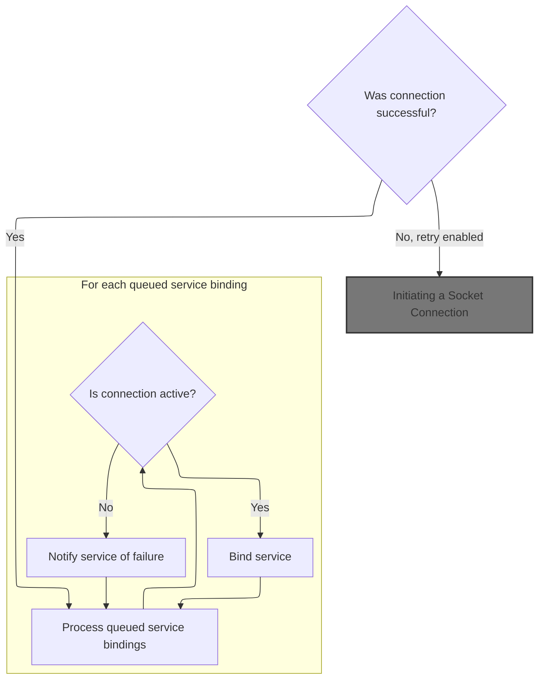
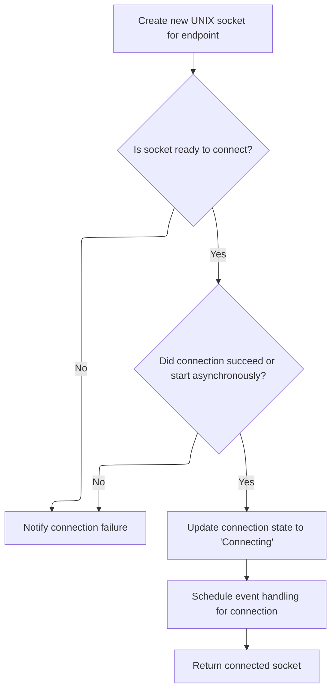
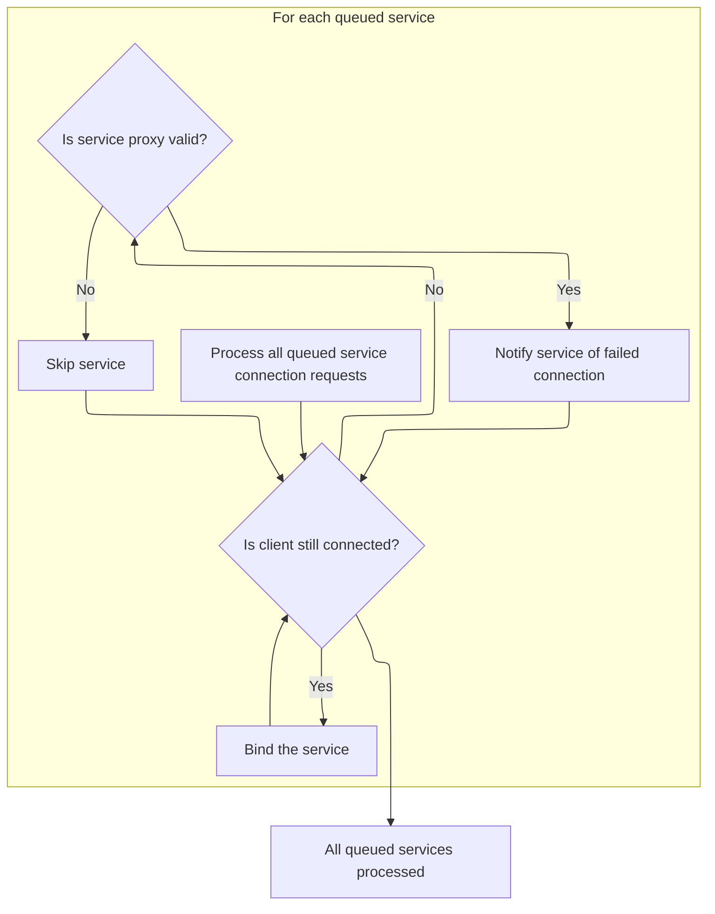

When a disconnect event occurs, all service proxies are notified, queued service bindings are informed of the failure, and the system resets its internal state to prepare for future connections.

# Notifying Service Proxies and Cleaning Up Bindings

<SwmSnippet path="/src/ipc/client_impl.cc" line="186">

---

In <SwmToken path="src/ipc/client_impl.cc" pos="186:4:4" line-data="void ClientImpl::OnDisconnect(base::UnixSocket*) {">`OnDisconnect`</SwmToken>, we start by looping through all service bindings and posting asynchronous tasks to notify each service proxy about the disconnect event. The <SwmToken path="src/ipc/client_impl.cc" pos="186:8:8" line-data="void ClientImpl::OnDisconnect(base::UnixSocket*) {">`UnixSocket`</SwmToken> pointer isn't used here; the focus is on informing proxies and not on socket-level cleanup. This keeps the disconnect handling abstracted and <SwmToken path="src/base/unix_socket.cc" pos="1043:13:15" line-data="  // Even if the socket is non-blocking, connecting to a UNIX socket can be">`non-blocking`</SwmToken>.

```c++
void ClientImpl::OnDisconnect(base::UnixSocket*) {
  for (const auto& it : service_bindings_) {
    base::WeakPtr<ServiceProxy> service_proxy = it.second;
    task_runner_->PostTask([service_proxy] {
      if (service_proxy)
        service_proxy->OnDisconnect();
    });
  }
```

---

</SwmSnippet>

<SwmSnippet path="/src/ipc/client_impl.cc" line="194">

---

Next we loop through queued requests and post tasks to notify service proxies about failed connection attempts, but only for requests that are binding services. This is done by calling <SwmToken path="src/ipc/client_impl.cc" pos="202:3:3" line-data="        service_proxy-&gt;OnConnect(false);">`OnConnect`</SwmToken>(false) asynchronously for those proxies.

```c++
  for (const auto& it : queued_requests_) {
    const QueuedRequest& queued_request = it.second;
    if (queued_request.type != Frame::kMsgBindServiceFieldNumber) {
      continue;
    }
    base::WeakPtr<ServiceProxy> service_proxy = queued_request.service_proxy;
    task_runner_->PostTask([service_proxy] {
      if (service_proxy)
        service_proxy->OnConnect(false);
    });
  }
```

---

</SwmSnippet>

## Handling Connection Attempts and Scheduling Retries



<SwmSnippet path="/src/ipc/client_impl.cc" line="154">

---

In <SwmToken path="src/ipc/client_impl.cc" pos="154:4:4" line-data="void ClientImpl::OnConnect(base::UnixSocket*, bool connected) {">`OnConnect`</SwmToken>, if the connection fails and retries are enabled, we bump up the backoff interval and schedule a delayed retry using <SwmToken path="src/ipc/client_impl.cc" pos="165:10:10" line-data="            static_cast&lt;ClientImpl&amp;&gt;(*weak_this).TryConnect();">`TryConnect`</SwmToken>. We use a weak pointer to make sure we don't access a deleted object if the client is destroyed before the retry.

```c++
void ClientImpl::OnConnect(base::UnixSocket*, bool connected) {
  if (!connected && socket_retry_) {
    socket_backoff_ms_ =
        (socket_backoff_ms_ < 10000) ? socket_backoff_ms_ + 1000 : 30000;
    PERFETTO_DLOG(
        "Connection to traced's UNIX socket failed, retrying in %u seconds",
        socket_backoff_ms_ / 1000);
    auto weak_this = weak_ptr_factory_.GetWeakPtr();
    task_runner_->PostDelayedTask(
        [weak_this] {
          if (weak_this)
            static_cast<ClientImpl&>(*weak_this).TryConnect();
        },
        socket_backoff_ms_);
    return;
  }

```

---

</SwmSnippet>

### Initiating a Socket Connection

<SwmSnippet path="/src/ipc/client_impl.cc" line="76">

---

<SwmToken path="src/ipc/client_impl.cc" pos="76:4:4" line-data="void ClientImpl::TryConnect() {">`TryConnect`</SwmToken> kicks off the socket connection using the internally stored <SwmToken path="src/ipc/client_impl.cc" pos="77:3:3" line-data="  PERFETTO_DCHECK(socket_name_);">`socket_name_`</SwmToken>. It assumes <SwmToken path="src/ipc/client_impl.cc" pos="77:3:3" line-data="  PERFETTO_DCHECK(socket_name_);">`socket_name_`</SwmToken> is valid and hands off to <SwmToken path="src/ipc/client_impl.cc" pos="78:7:7" line-data="  sock_ = base::UnixSocket::Connect(">`UnixSocket`</SwmToken>::Connect to actually initiate the connection.

```c++
void ClientImpl::TryConnect() {
  PERFETTO_DCHECK(socket_name_);
  sock_ = base::UnixSocket::Connect(
      socket_name_, this, task_runner_, base::GetSockFamily(socket_name_),
      base::SockType::kStream, base::SockPeerCredMode::kIgnore);
}
```

---

</SwmSnippet>

### Creating and Connecting the Unix Socket



<SwmSnippet path="/src/base/unix_socket.cc" line="921">

---

<SwmToken path="src/base/unix_socket.cc" pos="921:9:9" line-data="std::unique_ptr&lt;UnixSocket&gt; UnixSocket::Connect(">`Connect`</SwmToken> allocates a new <SwmToken path="src/base/unix_socket.cc" pos="921:4:4" line-data="std::unique_ptr&lt;UnixSocket&gt; UnixSocket::Connect(">`UnixSocket`</SwmToken> object and immediately calls <SwmToken path="src/base/unix_socket.cc" pos="930:3:3" line-data="  sock-&gt;DoConnect(socket_name);">`DoConnect`</SwmToken> to start the connection process. The event listener and task runner are passed in for async event handling.

```c++
std::unique_ptr<UnixSocket> UnixSocket::Connect(
    const std::string& socket_name,
    EventListener* event_listener,
    TaskRunner* task_runner,
    SockFamily sock_family,
    SockType sock_type,
    SockPeerCredMode peer_cred_mode) {
  std::unique_ptr<UnixSocket> sock(new UnixSocket(
      event_listener, task_runner, sock_family, sock_type, peer_cred_mode));
  sock->DoConnect(socket_name);
  return sock;
}
```

---

</SwmSnippet>

<SwmSnippet path="/src/base/unix_socket.cc" line="1029">

---

<SwmToken path="src/base/unix_socket.cc" pos="1029:4:4" line-data="void UnixSocket::DoConnect(const std::string&amp; socket_name) {">`DoConnect`</SwmToken> tries to connect the socket and always posts a task to handle connection completion via <SwmToken path="src/base/unix_socket.cc" pos="1048:7:7" line-data="  // Posting the OnEvent() below emulates a wakeup of the FD watch. OnEvent(),">`OnEvent`</SwmToken>, whether the connection is immediate or async. This keeps connection handling consistent and avoids OS-specific behavior. Weak pointers are used for safety in async callbacks.

```c++
void UnixSocket::DoConnect(const std::string& socket_name) {
  PERFETTO_DCHECK(state_ == State::kDisconnected);

  // This is the only thing that can gracefully fail in the ctor.
  if (!sock_raw_)
    return NotifyConnectionState(false);

  if (!sock_raw_.Connect(socket_name))
    return NotifyConnectionState(false);

  // At this point either connect() succeeded or started asynchronously
  // (errno = EINPROGRESS).
  state_ = State::kConnecting;

  // Even if the socket is non-blocking, connecting to a UNIX socket can be
  // acknowledged straight away rather than returning EINPROGRESS.
  // The decision here is to deal with the two cases uniformly, at the cost of
  // delaying the straight-away-connect() case by one task, to avoid depending
  // on implementation details of UNIX socket on the various OSes.
  // Posting the OnEvent() below emulates a wakeup of the FD watch. OnEvent(),
  // which knows how to deal with spurious wakeups, will poll the SO_ERROR and
  // evolve, if necessary, the state into either kConnected or kDisconnected.
  WeakPtr<UnixSocket> weak_ptr = weak_ptr_factory_.GetWeakPtr();
  task_runner_->PostTask([weak_ptr] {
    if (weak_ptr)
      weak_ptr->OnEvent();
  });
}
```

---

</SwmSnippet>

### Processing Queued Service Bindings After Connection



<SwmSnippet path="/src/ipc/client_impl.cc" line="171">

---

Back in <SwmToken path="src/ipc/client_impl.cc" pos="173:3:3" line-data="  // OnConnect below might delete |this|, so move everything on the stack first.">`OnConnect`</SwmToken> after <SwmToken path="src/ipc/client_impl.cc" pos="76:4:4" line-data="void ClientImpl::TryConnect() {">`TryConnect`</SwmToken>, we move queued service bindings to a local variable and clear the queue. If the connection succeeded, we bind each service proxy; if not, we notify them of failure. This handles all pending bindings safely.

```c++
  // Drain the BindService() calls that were queued before establishing the
  // connection with the host. Note that if we got disconnected, the call to
  // OnConnect below might delete |this|, so move everything on the stack first.
  auto queued_bindings = std::move(queued_bindings_);
  queued_bindings_.clear();
  for (base::WeakPtr<ServiceProxy>& service_proxy : queued_bindings) {
    if (connected) {
      BindService(service_proxy);
    } else if (service_proxy) {
      service_proxy->OnConnect(false /* success */);
    }
  }
```

---

</SwmSnippet>

<SwmSnippet path="/src/ipc/client_impl.cc" line="183">

---

<SwmToken path="src/ipc/client_impl.cc" pos="154:4:4" line-data="void ClientImpl::OnConnect(base::UnixSocket*, bool connected) {">`OnConnect`</SwmToken> returns after draining bindings, with a warning not to touch |this|.

```c++
  // Don't access |this| below here.
}
```

---

</SwmSnippet>

## Final Cleanup After Disconnection

<SwmSnippet path="/src/ipc/client_impl.cc" line="205">

---

After returning from <SwmToken path="src/ipc/client_impl.cc" pos="154:4:4" line-data="void ClientImpl::OnConnect(base::UnixSocket*, bool connected) {">`OnConnect`</SwmToken>, <SwmToken path="src/ipc/client_impl.cc" pos="186:4:4" line-data="void ClientImpl::OnDisconnect(base::UnixSocket*) {">`OnDisconnect`</SwmToken> clears out all service and queued bindings to reset internal state. The <SwmToken path="src/ipc/client_impl.cc" pos="78:7:7" line-data="  sock_ = base::UnixSocket::Connect(">`UnixSocket`</SwmToken> pointer isn't used; cleanup is done at a higher level.

```c++
  service_bindings_.clear();
  queued_bindings_.clear();
}
```

---

</SwmSnippet>

&nbsp;

*This is an auto-generated document by Swimm 🌊 and has not yet been verified by a human*

<SwmMeta version="3.0.0" repo-id="Z2l0aHViJTNBJTNBY3BsdXNwbHVzLXBlcmZldHRvJTNBJTNBcmljYXJkb2xvcGV6Zw==" repo-name="cplusplus-perfetto"><sup>Powered by [Swimm](https://app.swimm.io/)</sup></SwmMeta>
