This document describes how, upon loading a camera trace, the workspace is set up to highlight important tracks for analysis. Users can also pin additional tracks to tailor the workspace to their needs.

# Registering Camera Commands

<SwmSnippet path="/ui/src/plugins/com.google.android.GoogleCamera/index.ts" line="21">

---

In <SwmToken path="ui/src/plugins/com.google.android.GoogleCamera/index.ts" pos="21:3:3" line-data="  async onTraceLoad(ctx: Trace): Promise&lt;void&gt; {">`onTraceLoad`</SwmToken>, we register a command to set up the camera view by pinning startup tracks, prepping the workspace for user actions.

```typescript
  async onTraceLoad(ctx: Trace): Promise<void> {
    ctx.commands.registerCommand({
      id: 'com.google.android.LoadGoogleCameraStartupView',
      name: 'Load google camera startup view',
      callback: () => {
        this.loadGCAStartupView(ctx);
      },
    });

```

---

</SwmSnippet>

## Pinning Startup and Main Thread Tracks

```mermaid
%%{init: {"flowchart": {"defaultRenderer": "elk"}} }%%
flowchart TD
    node1["Start: Prepare camera trace view"]
    click node1 openCode "ui/src/plugins/com.google.android.GoogleCamera/index.ts:46:49"
    subgraph loop1["For each track in the workspace"]
      node2{"Is track main thread or startup-related?"}
      click node2 openCode "ui/src/plugins/com.google.android.GoogleCamera/index.ts:51:59"
      node2 -->|"Yes"| node3["Pin track"]
      click node3 openCode "ui/src/plugins/com.google.android.GoogleCamera/index.ts:55:56"
      node2 -->|"No"| node4["Skip track"]
      click node4 openCode "ui/src/plugins/com.google.android.GoogleCamera/index.ts:54:54"
    end
    loop1 --> node5["User sees important tracks highlighted"]
    click node5 openCode "ui/src/plugins/com.google.android.GoogleCamera/index.ts:46:49"

classDef HeadingStyle fill:#777777,stroke:#333,stroke-width:2px;

%% Swimm:
%% %%{init: {"flowchart": {"defaultRenderer": "elk"}} }%%
%% flowchart TD
%%     node1["Start: Prepare camera trace view"]
%%     click node1 openCode "<SwmPath>[ui/…/com.google.android.GoogleCamera/index.ts](ui/src/plugins/com.google.android.GoogleCamera/index.ts)</SwmPath>:46:49"
%%     subgraph loop1["For each track in the workspace"]
%%       node2{"Is track main thread or startup-related?"}
%%       click node2 openCode "<SwmPath>[ui/…/com.google.android.GoogleCamera/index.ts](ui/src/plugins/com.google.android.GoogleCamera/index.ts)</SwmPath>:51:59"
%%       node2 -->|"Yes"| node3["Pin track"]
%%       click node3 openCode "<SwmPath>[ui/…/com.google.android.GoogleCamera/index.ts](ui/src/plugins/com.google.android.GoogleCamera/index.ts)</SwmPath>:55:56"
%%       node2 -->|"No"| node4["Skip track"]
%%       click node4 openCode "<SwmPath>[ui/…/com.google.android.GoogleCamera/index.ts](ui/src/plugins/com.google.android.GoogleCamera/index.ts)</SwmPath>:54:54"
%%     end
%%     loop1 --> node5["User sees important tracks highlighted"]
%%     click node5 openCode "<SwmPath>[ui/…/com.google.android.GoogleCamera/index.ts](ui/src/plugins/com.google.android.GoogleCamera/index.ts)</SwmPath>:46:49"
%% 
%% classDef HeadingStyle fill:#777777,stroke:#333,stroke-width:2px;
```



<SwmSnippet path="/ui/src/plugins/com.google.android.GoogleCamera/index.ts" line="46">

---

<SwmToken path="ui/src/plugins/com.google.android.GoogleCamera/index.ts" pos="46:3:3" line-data="  private loadGCAStartupView(ctx: Trace) {">`loadGCAStartupView`</SwmToken> pins the main thread and startup tracks so they're always visible for camera trace analysis.

```typescript
  private loadGCAStartupView(ctx: Trace) {
    this.pinTracks(ctx, cameraConstants.MAIN_THREAD_TRACK);
    this.pinTracks(ctx, cameraConstants.STARTUP_RELATED_TRACKS);
  }
```

---

</SwmSnippet>

<SwmSnippet path="/ui/src/plugins/com.google.android.GoogleCamera/index.ts" line="51">

---

<SwmToken path="ui/src/plugins/com.google.android.GoogleCamera/index.ts" pos="51:3:3" line-data="  private pinTracks(ctx: Trace, trackNames: ReadonlyArray&lt;string&gt;) {">`pinTracks`</SwmToken> loops through all tracks in the workspace and pins any whose name matches any pattern in <SwmToken path="ui/src/plugins/com.google.android.GoogleCamera/index.ts" pos="51:11:11" line-data="  private pinTracks(ctx: Trace, trackNames: ReadonlyArray&lt;string&gt;) {">`trackNames`</SwmToken>. This makes sure only relevant tracks are highlighted for analysis, and the use of match allows for flexible pattern matching.

```typescript
  private pinTracks(ctx: Trace, trackNames: ReadonlyArray<string>) {
    ctx.currentWorkspace.flatTracks.forEach((track) => {
      trackNames.forEach((trackName) => {
        if (track.name.match(trackName)) {
          track.pin();
        }
      });
    });
  }
```

---

</SwmSnippet>

## Registering User Track Pinning Command

```mermaid
%%{init: {"flowchart": {"defaultRenderer": "elk"}} }%%
flowchart TD
    node1["User is offered to pin camera tracks"] --> node2["Prompt for track names"]
    click node1 openCode "ui/src/plugins/com.google.android.GoogleCamera/index.ts:30:44"
    click node2 openCode "ui/src/plugins/com.google.android.GoogleCamera/index.ts:34:36"
    node2 --> node3{"Did user provide track names?"}
    click node3 openCode "ui/src/plugins/com.google.android.GoogleCamera/index.ts:37:37"
    node3 -->|"Yes"| node4["Transform input into cleaned track name list"]
    click node4 openCode "ui/src/plugins/com.google.android.GoogleCamera/index.ts:38:40"
    node3 -->|"No"| node5["Use empty track name list"]
    click node5 openCode "ui/src/plugins/com.google.android.GoogleCamera/index.ts:37:37"
    subgraph loop1["For each track name in the list"]
        node4 --> node6["Trim whitespace from track name"]
        click node6 openCode "ui/src/plugins/com.google.android.GoogleCamera/index.ts:40:40"
    end
    node4 --> node7["Pin specified tracks"]
    node5 --> node7
    click node7 openCode "ui/src/plugins/com.google.android.GoogleCamera/index.ts:41:41"
    node7 --> node8["Tracks are pinned"]
    click node8 openCode "ui/src/plugins/com.google.android.GoogleCamera/index.ts:41:41"

classDef HeadingStyle fill:#777777,stroke:#333,stroke-width:2px;

%% Swimm:
%% %%{init: {"flowchart": {"defaultRenderer": "elk"}} }%%
%% flowchart TD
%%     node1["User is offered to pin camera tracks"] --> node2["Prompt for track names"]
%%     click node1 openCode "<SwmPath>[ui/…/com.google.android.GoogleCamera/index.ts](ui/src/plugins/com.google.android.GoogleCamera/index.ts)</SwmPath>:30:44"
%%     click node2 openCode "<SwmPath>[ui/…/com.google.android.GoogleCamera/index.ts](ui/src/plugins/com.google.android.GoogleCamera/index.ts)</SwmPath>:34:36"
%%     node2 --> node3{"Did user provide track names?"}
%%     click node3 openCode "<SwmPath>[ui/…/com.google.android.GoogleCamera/index.ts](ui/src/plugins/com.google.android.GoogleCamera/index.ts)</SwmPath>:37:37"
%%     node3 -->|"Yes"| node4["Transform input into cleaned track name list"]
%%     click node4 openCode "<SwmPath>[ui/…/com.google.android.GoogleCamera/index.ts](ui/src/plugins/com.google.android.GoogleCamera/index.ts)</SwmPath>:38:40"
%%     node3 -->|"No"| node5["Use empty track name list"]
%%     click node5 openCode "<SwmPath>[ui/…/com.google.android.GoogleCamera/index.ts](ui/src/plugins/com.google.android.GoogleCamera/index.ts)</SwmPath>:37:37"
%%     subgraph loop1["For each track name in the list"]
%%         node4 --> node6["Trim whitespace from track name"]
%%         click node6 openCode "<SwmPath>[ui/…/com.google.android.GoogleCamera/index.ts](ui/src/plugins/com.google.android.GoogleCamera/index.ts)</SwmPath>:40:40"
%%     end
%%     node4 --> node7["Pin specified tracks"]
%%     node5 --> node7
%%     click node7 openCode "<SwmPath>[ui/…/com.google.android.GoogleCamera/index.ts](ui/src/plugins/com.google.android.GoogleCamera/index.ts)</SwmPath>:41:41"
%%     node7 --> node8["Tracks are pinned"]
%%     click node8 openCode "<SwmPath>[ui/…/com.google.android.GoogleCamera/index.ts](ui/src/plugins/com.google.android.GoogleCamera/index.ts)</SwmPath>:41:41"
%% 
%% classDef HeadingStyle fill:#777777,stroke:#333,stroke-width:2px;
```



<SwmSnippet path="/ui/src/plugins/com.google.android.GoogleCamera/index.ts" line="30">

---

Back in <SwmToken path="ui/src/plugins/com.google.android.GoogleCamera/index.ts" pos="21:3:3" line-data="  async onTraceLoad(ctx: Trace): Promise&lt;void&gt; {">`onTraceLoad`</SwmToken>, after setting up the startup view, we register a second command that prompts the user for track names, processes the input, and pins those tracks. This lets users highlight tracks relevant to their own analysis, extending the default setup.

```typescript
    ctx.commands.registerCommand({
      id: 'com.google.android.PinCameraRelatedTracks',
      name: 'Pin camera related tracks',
      callback: async () => {
        const promptResult = await ctx.omnibox.prompt(
          'List of additional track names that you would like to pin separated by commas',
        );
        const rawTrackNames = promptResult ?? '';
        const trackNameList = rawTrackNames
          .split(',')
          .map((item) => item.trim());
        this.pinTracks(ctx, trackNameList);
      },
    });
  }
```

---

</SwmSnippet>

&nbsp;

*This is an auto-generated document by Swimm 🌊 and has not yet been verified by a human*

<SwmMeta version="3.0.0" repo-id="Z2l0aHViJTNBJTNBY3BsdXNwbHVzLXBlcmZldHRvJTNBJTNBcmljYXJkb2xvcGV6Zw==" repo-name="cplusplus-perfetto"><sup>Powered by [Swimm](https://app.swimm.io/)</sup></SwmMeta>
