This document describes how SQL tokens are analyzed to correctly identify the 'OVER' keyword in valid contexts and normalize other tokens for consistent parsing. The flow receives a stream of SQL tokens as input and outputs a normalized token stream, ensuring that only valid uses of 'OVER' are treated as special keywords.

# Analyzing Token Context for OVER Keyword

```mermaid
%%{init: {"flowchart": {"defaultRenderer": "elk"}} }%%
flowchart TD
  node1["Check if previous SQL token ends a group"]
  click node1 openCode "src/trace_processor/perfetto_sql/tokenizer/tokenize_internal.c:733:733"
  node1 --> node2{"Previous token is a right parenthesis?"}
  click node2 openCode "src/trace_processor/perfetto_sql/tokenizer/tokenize_internal.c:733:733"
  node2 -->|"Yes"| node3{"Next token is a left parenthesis or identifier?"}
  click node3 openCode "src/trace_processor/perfetto_sql/tokenizer/tokenize_internal.c:734:735"
  node3 -->|"Yes"| node4["Recognize 'OVER' as a special SQL keyword"]
  click node4 openCode "src/trace_processor/perfetto_sql/tokenizer/tokenize_internal.c:736:736"
  node3 -->|"No"| node5["Treat as a regular SQL identifier"]
  click node5 openCode "src/trace_processor/perfetto_sql/tokenizer/tokenize_internal.c:738:738"
  node2 -->|"No"| node5
classDef HeadingStyle fill:#777777,stroke:#333,stroke-width:2px;

%% Swimm:
%% %%{init: {"flowchart": {"defaultRenderer": "elk"}} }%%
%% flowchart TD
%%   node1["Check if previous SQL token ends a group"]
%%   click node1 openCode "<SwmPath>[src/…/tokenizer/tokenize_internal.c](src/trace_processor/perfetto_sql/tokenizer/tokenize_internal.c)</SwmPath>:733:733"
%%   node1 --> node2{"Previous token is a right parenthesis?"}
%%   click node2 openCode "<SwmPath>[src/…/tokenizer/tokenize_internal.c](src/trace_processor/perfetto_sql/tokenizer/tokenize_internal.c)</SwmPath>:733:733"
%%   node2 -->|"Yes"| node3{"Next token is a left parenthesis or identifier?"}
%%   click node3 openCode "<SwmPath>[src/…/tokenizer/tokenize_internal.c](src/trace_processor/perfetto_sql/tokenizer/tokenize_internal.c)</SwmPath>:734:735"
%%   node3 -->|"Yes"| node4["Recognize 'OVER' as a special SQL keyword"]
%%   click node4 openCode "<SwmPath>[src/…/tokenizer/tokenize_internal.c](src/trace_processor/perfetto_sql/tokenizer/tokenize_internal.c)</SwmPath>:736:736"
%%   node3 -->|"No"| node5["Treat as a regular SQL identifier"]
%%   click node5 openCode "<SwmPath>[src/…/tokenizer/tokenize_internal.c](src/trace_processor/perfetto_sql/tokenizer/tokenize_internal.c)</SwmPath>:738:738"
%%   node2 -->|"No"| node5
%% classDef HeadingStyle fill:#777777,stroke:#333,stroke-width:2px;
```



<SwmSnippet path="/src/trace_processor/perfetto_sql/tokenizer/tokenize_internal.c" line="731">

---

<SwmToken path="src/trace_processor/perfetto_sql/tokenizer/tokenize_internal.c" pos="731:2:2" line-data="int sqliteTokenizeInternalAnalyzeOverKeyword(const unsigned char* z,">`sqliteTokenizeInternalAnalyzeOverKeyword`</SwmToken> starts the flow by checking if the last token was a right parenthesis (<SwmToken path="src/trace_processor/perfetto_sql/tokenizer/tokenize_internal.c" pos="733:8:8" line-data="  if (lastToken == TK_RP) {">`TK_RP`</SwmToken>). If so, it calls <SwmToken path="src/trace_processor/perfetto_sql/tokenizer/tokenize_internal.c" pos="734:7:7" line-data="    int t = getToken(&amp;z);">`getToken`</SwmToken> to inspect the next token, determining if it's an opening parenthesis or identifier, which would signal the presence of the 'OVER' keyword. This step is necessary to correctly identify 'OVER' only in valid SQL contexts.

```c
int sqliteTokenizeInternalAnalyzeOverKeyword(const unsigned char* z,
                                             int lastToken) {
  if (lastToken == TK_RP) {
    int t = getToken(&z);
    if (t == TK_LP || t == TK_ID)
      return TK_OVER;
  }
  return TK_ID;
}
```

---

</SwmSnippet>

# Extracting and Normalizing the Next Token

```mermaid
%%{init: {"flowchart": {"defaultRenderer": "elk"}} }%%
flowchart TD
  subgraph loop1["Skip spaces and comments"]
    node1["Read next token"]
    click node1 openCode "src/trace_processor/perfetto_sql/tokenizer/tokenize_internal.c:681:681"
    node2{"Is token space or comment?"}
    click node2 openCode "src/trace_processor/perfetto_sql/tokenizer/tokenize_internal.c:682:682"
    node1 --> node2
    node2 -->|"Yes"| node1
  end
  node2 -->|"No"| node3{"Is token an identifier, string, join keyword, window, over, or fallback to identifier?"}
  click node3 openCode "src/trace_processor/perfetto_sql/tokenizer/tokenize_internal.c:683:684"
  node3 -->|"Yes"| node4["Normalize to identifier"]
  click node4 openCode "src/trace_processor/perfetto_sql/tokenizer/tokenize_internal.c:685:685"
  node3 -->|"No"| node5["Return token"]
  click node5 openCode "src/trace_processor/perfetto_sql/tokenizer/tokenize_internal.c:688:688"
  node4 --> node5
classDef HeadingStyle fill:#777777,stroke:#333,stroke-width:2px;

%% Swimm:
%% %%{init: {"flowchart": {"defaultRenderer": "elk"}} }%%
%% flowchart TD
%%   subgraph loop1["Skip spaces and comments"]
%%     node1["Read next token"]
%%     click node1 openCode "<SwmPath>[src/…/tokenizer/tokenize_internal.c](src/trace_processor/perfetto_sql/tokenizer/tokenize_internal.c)</SwmPath>:681:681"
%%     node2{"Is token space or comment?"}
%%     click node2 openCode "<SwmPath>[src/…/tokenizer/tokenize_internal.c](src/trace_processor/perfetto_sql/tokenizer/tokenize_internal.c)</SwmPath>:682:682"
%%     node1 --> node2
%%     node2 -->|"Yes"| node1
%%   end
%%   node2 -->|"No"| node3{"Is token an identifier, string, join keyword, window, over, or fallback to identifier?"}
%%   click node3 openCode "<SwmPath>[src/…/tokenizer/tokenize_internal.c](src/trace_processor/perfetto_sql/tokenizer/tokenize_internal.c)</SwmPath>:683:684"
%%   node3 -->|"Yes"| node4["Normalize to identifier"]
%%   click node4 openCode "<SwmPath>[src/…/tokenizer/tokenize_internal.c](src/trace_processor/perfetto_sql/tokenizer/tokenize_internal.c)</SwmPath>:685:685"
%%   node3 -->|"No"| node5["Return token"]
%%   click node5 openCode "<SwmPath>[src/…/tokenizer/tokenize_internal.c](src/trace_processor/perfetto_sql/tokenizer/tokenize_internal.c)</SwmPath>:688:688"
%%   node4 --> node5
%% classDef HeadingStyle fill:#777777,stroke:#333,stroke-width:2px;
```



<SwmSnippet path="/src/trace_processor/perfetto_sql/tokenizer/tokenize_internal.c" line="677">

---

In <SwmToken path="src/trace_processor/perfetto_sql/tokenizer/tokenize_internal.c" pos="677:4:4" line-data="static int getToken(const unsigned char** pz) {">`getToken`</SwmToken>, we loop through the input, skipping over spaces and comments using <SwmToken path="src/trace_processor/perfetto_sql/tokenizer/tokenize_internal.c" pos="681:5:5" line-data="    z += sqlite3GetToken(z, &amp;t);">`sqlite3GetToken`</SwmToken>, so we only return tokens that matter for parsing. This keeps the token stream clean and relevant for further analysis.

```c
static int getToken(const unsigned char** pz) {
  const unsigned char* z = *pz;
  int t; /* Token type to return */
  do {
    z += sqlite3GetToken(z, &t);
  } while (t == TK_SPACE || t == TK_COMMENT);
```

---

</SwmSnippet>

<SwmSnippet path="/src/trace_processor/perfetto_sql/tokenizer/tokenize_internal.c" line="683">

---

After extracting the token, we check if it's an identifier, string, or certain keywords, and normalize it to <SwmToken path="src/trace_processor/perfetto_sql/tokenizer/tokenize_internal.c" pos="683:8:8" line-data="  if (t == TK_ID || t == TK_STRING || t == TK_JOIN_KW || t == TK_WINDOW ||">`TK_ID`</SwmToken>. This makes downstream parsing simpler since these cases are handled the same way.

```c
  if (t == TK_ID || t == TK_STRING || t == TK_JOIN_KW || t == TK_WINDOW ||
      t == TK_OVER || sqlite3ParserFallback(t) == TK_ID) {
    t = TK_ID;
  }
  *pz = z;
  return t;
}
```

---

</SwmSnippet>

&nbsp;

*This is an auto-generated document by Swimm 🌊 and has not yet been verified by a human*

<SwmMeta version="3.0.0" repo-id="Z2l0aHViJTNBJTNBY3BsdXNwbHVzLXBlcmZldHRvJTNBJTNBcmljYXJkb2xvcGV6Zw==" repo-name="cplusplus-perfetto"><sup>Powered by [Swimm](https://app.swimm.io/)</sup></SwmMeta>
