This document describes how users can import a graph using a SQL WITH statement. Users provide SQL input, which is parsed and validated, then transformed into a visual graph for further exploration and modification.

# Where is this flow used?

This flow is used multiple times in the codebase as represented in the following diagram:

```mermaid
graph TD;
      8f1719026d188d8a5a20eca06455d112a4d8ab6618a9b7b98abe7b6b7adaf1df(ui/…/dev.perfetto.ExplorePage/explore_page.ts::ExplorePage.view) --> 51121c4b360204632dd047a5ca973c2ebdac88eecfa9899053cb983ff5980cce(ui/…/dev.perfetto.ExplorePage/explore_page.ts::ExplorePage.handleImportWithStatement)

fee947f620e5599fa4004f8ba8c6b244d5cd0da6654ff50b702948e0477c1206(ui/…/dev.perfetto.ExplorePage/explore_page.ts::onImportWithStatement) --> 51121c4b360204632dd047a5ca973c2ebdac88eecfa9899053cb983ff5980cce(ui/…/dev.perfetto.ExplorePage/explore_page.ts::ExplorePage.handleImportWithStatement)


classDef mainFlowStyle color:#000000,fill:#7CB9F4
classDef rootsStyle color:#000000,fill:#00FFF4
classDef Style1 color:#000000,fill:#00FFAA
classDef Style2 color:#000000,fill:#FFFF00
classDef Style3 color:#000000,fill:#AA7CB9

%% Swimm:
%% graph TD;
%%       8f1719026d188d8a5a20eca06455d112a4d8ab6618a9b7b98abe7b6b7adaf1df(<SwmPath>[ui/…/dev.perfetto.ExplorePage/explore_page.ts](ui/src/plugins/dev.perfetto.ExplorePage/explore_page.ts)</SwmPath>::ExplorePage.view) --> 51121c4b360204632dd047a5ca973c2ebdac88eecfa9899053cb983ff5980cce(<SwmPath>[ui/…/dev.perfetto.ExplorePage/explore_page.ts](ui/src/plugins/dev.perfetto.ExplorePage/explore_page.ts)</SwmPath>::ExplorePage.handleImportWithStatement)
%% 
%% fee947f620e5599fa4004f8ba8c6b244d5cd0da6654ff50b702948e0477c1206(<SwmPath>[ui/…/dev.perfetto.ExplorePage/explore_page.ts](ui/src/plugins/dev.perfetto.ExplorePage/explore_page.ts)</SwmPath>::<SwmToken path="ui/src/plugins/dev.perfetto.ExplorePage/explore_page.ts" pos="815:1:1" line-data="        onImportWithStatement: () =&gt;">`onImportWithStatement`</SwmToken>) --> 51121c4b360204632dd047a5ca973c2ebdac88eecfa9899053cb983ff5980cce(<SwmPath>[ui/…/dev.perfetto.ExplorePage/explore_page.ts](ui/src/plugins/dev.perfetto.ExplorePage/explore_page.ts)</SwmPath>::ExplorePage.handleImportWithStatement)
%% 
%% 
%% classDef mainFlowStyle color:#000000,fill:#7CB9F4
%% classDef rootsStyle color:#000000,fill:#00FFF4
%% classDef Style1 color:#000000,fill:#00FFAA
%% classDef Style2 color:#000000,fill:#FFFF00
%% classDef Style3 color:#000000,fill:#AA7CB9
```



# Triggering the Import Modal

<SwmSnippet path="/ui/src/plugins/dev.perfetto.ExplorePage/explore_page.ts" line="673">

---

<SwmToken path="ui/src/plugins/dev.perfetto.ExplorePage/explore_page.ts" pos="673:3:3" line-data="  private handleImportWithStatement(attrs: ExplorePageAttrs) {">`handleImportWithStatement`</SwmToken> kicks off the import flow by checking for available SQL modules and, if present, launches the modal for importing via a WITH statement. This sets up the UI and hands off control to the modal logic in <SwmPath>[ui/…/dev.perfetto.ExplorePage/sql_json_handler.ts](ui/src/plugins/dev.perfetto.ExplorePage/sql_json_handler.ts)</SwmPath>, which actually collects the SQL input.

```typescript
  private handleImportWithStatement(attrs: ExplorePageAttrs) {
    const {trace, sqlModulesPlugin, onStateUpdate} = attrs;
    const sqlModules = sqlModulesPlugin.getSqlModules();
    if (!sqlModules) return;

    showImportWithStatementModal(trace, sqlModules, onStateUpdate);
  }
```

---

</SwmSnippet>

# Collecting SQL Input from the User

<SwmSnippet path="/ui/src/plugins/dev.perfetto.ExplorePage/sql_json_handler.ts" line="30">

---

In <SwmToken path="ui/src/plugins/dev.perfetto.ExplorePage/sql_json_handler.ts" pos="30:4:4" line-data="export function showImportWithStatementModal(">`showImportWithStatementModal`</SwmToken>, we display a modal for the user to paste or edit a SQL WITH statement. When 'Import' is clicked, we parse the SQL and convert it to a graph JSON, then call <SwmToken path="ui/src/plugins/dev.perfetto.ExplorePage/sql_json_handler.ts" pos="59:7:7" line-data="          const newState = deserializeState(json, trace, sqlModules);">`deserializeState`</SwmToken> in <SwmPath>[ui/…/dev.perfetto.ExplorePage/json_handler.ts](ui/src/plugins/dev.perfetto.ExplorePage/json_handler.ts)</SwmPath> to turn that JSON into usable state for the page.

```typescript
export function showImportWithStatementModal(
  trace: Trace,
  sqlModules: SqlModules,
  onStateUpdate: (state: ExplorePageState) => void,
) {
  let sqlText = '';
  showModal({
    title: 'Import from WITH statement',
    content: m(
      'div',
      {
        style: {
          'border-top': '1px solid var(--pf-color-border)',
          'min-height': '10rem',
          'overflow': 'hidden auto',
        },
      },
      m(Editor, {
        text: sqlText,
        onUpdate: (text: string) => {
          sqlText = text;
        },
      }),
    ),
    buttons: [
      {
        text: 'Import',
        action: () => {
          const json = createGraphFromSql(sqlText);
          const newState = deserializeState(json, trace, sqlModules);
```

---

</SwmSnippet>

## Parsing and Validating the Imported Graph


<SwmSnippet path="/ui/src/plugins/dev.perfetto.ExplorePage/json_handler.ts" line="255">

---

In <SwmToken path="ui/src/plugins/dev.perfetto.ExplorePage/json_handler.ts" pos="255:4:4" line-data="export function deserializeState(">`deserializeState`</SwmToken>, we start by parsing and validating the imported JSON to make sure it matches the expected graph format. Then, we create all node instances in a first pass, without linking them yet. This sets up the groundwork for connecting nodes in the next step.

```typescript
export function deserializeState(
  json: string,
  trace: Trace,
  sqlModules: SqlModules,
): ExplorePageState {
  const serializedGraph: SerializedGraph = JSON.parse(json);

  // Basic validation to ensure the file is a Perfetto graph export.
  if (
    serializedGraph == null ||
    typeof serializedGraph !== 'object' ||
    !Array.isArray(serializedGraph.nodes) ||
    !Array.isArray(serializedGraph.rootNodeIds)
  ) {
    throw new Error(
      'Invalid file format. The selected file is not a valid Perfetto graph.',
    );
  }

  // Validate nodeLayouts if present
  if (
    serializedGraph.nodeLayouts != null &&
    typeof serializedGraph.nodeLayouts !== 'object'
  ) {
    throw new Error(
      'Invalid file format. nodeLayouts must be an object if provided.',
    );
  }

  const nodes = new Map<string, QueryNode>();
  // First pass: create all node instances
  for (const serializedNode of serializedGraph.nodes) {
    const node = createNodeInstance(serializedNode, trace, sqlModules);
    // Overwrite the newly generated nodeId with the one from the file
    // to allow re-linking nodes correctly.
    (node as {nodeId: string}).nodeId = serializedNode.nodeId;
    nodes.set(serializedNode.nodeId, node);
  }
```

---

</SwmSnippet>

<SwmSnippet path="/ui/src/plugins/dev.perfetto.ExplorePage/json_handler.ts" line="294">

---

Next we connect the nodes by setting up <SwmToken path="ui/src/plugins/dev.perfetto.ExplorePage/json_handler.ts" pos="302:3:3" line-data="    node.nextNodes = serializedNode.nextNodes.map((id) =&gt; {">`nextNodes`</SwmToken>, <SwmToken path="ui/src/plugins/dev.perfetto.ExplorePage/json_handler.ts" pos="312:3:3" line-data="      serializedNode.prevNode === undefined &amp;&amp;">`prevNode`</SwmToken>(s), and <SwmToken path="ui/src/plugins/dev.perfetto.ExplorePage/json_handler.ts" pos="350:5:5" line-data="    // Restore inputNodes for ModificationNode with additional input ports">`inputNodes`</SwmToken>. If older graphs are missing <SwmToken path="ui/src/plugins/dev.perfetto.ExplorePage/json_handler.ts" pos="312:3:3" line-data="      serializedNode.prevNode === undefined &amp;&amp;">`prevNode`</SwmToken>(s), we infer them from <SwmToken path="ui/src/plugins/dev.perfetto.ExplorePage/json_handler.ts" pos="302:3:3" line-data="    node.nextNodes = serializedNode.nextNodes.map((id) =&gt; {">`nextNodes`</SwmToken> for compatibility. For some node types, we restore extra internal state using their custom deserialization logic.

```typescript
  // Second pass: connect nodes
  for (const serializedNode of serializedGraph.nodes) {
    const node = nodes.get(serializedNode.nodeId);
    if (!node) {
      throw new Error(
        `Graph is corrupted. Node with ID "${serializedNode.nodeId}" was serialized but not instantiated.`,
      );
    }
    node.nextNodes = serializedNode.nextNodes.map((id) => {
      const nextNode = nodes.get(id);
      if (nextNode == null) {
        throw new Error(`Graph is corrupted. Node "${id}" not found.`);
      }
      return nextNode;
    });

    // Backwards compatibility: if prevNodes is not in the JSON, infer it.
    if (
      serializedNode.prevNode === undefined &&
      serializedNode.prevNodes === undefined
    ) {
      for (const nextNode of node.nextNodes) {
        if ('prevNode' in nextNode) {
          (nextNode as {prevNode: QueryNode}).prevNode = node;
        } else if ('prevNodes' in nextNode) {
          nextNode.prevNodes.push(node);
        }
      }
    }

    if (serializedNode.prevNode) {
      if ('prevNode' in node) {
        const prevNode = nodes.get(serializedNode.prevNode);
        if (prevNode) {
          (node as {prevNode: QueryNode}).prevNode = prevNode;
        }
      }
    }

    if (serializedNode.prevNodes) {
      if ('prevNodes' in node) {
        for (const id of serializedNode.prevNodes) {
          const prevNode = nodes.get(id);
          if (prevNode) {
            node.prevNodes.push(prevNode);
          }
        }
      } else if ('prevNode' in node && serializedNode.prevNodes.length > 0) {
        // Backwards compatibility
        const prevNode = nodes.get(serializedNode.prevNodes[0]);
        if (prevNode) {
          (node as {prevNode: QueryNode}).prevNode = prevNode;
        }
      }
    }

    // Restore inputNodes for ModificationNode with additional input ports
    if (serializedNode.inputNodes && 'inputNodes' in node) {
      if (!node.inputNodes) {
        node.inputNodes = [];
      }
      // Restore each inputNode connection
      for (let i = 0; i < serializedNode.inputNodes.length; i++) {
        const inputNodeId = serializedNode.inputNodes[i];
        if (inputNodeId !== undefined) {
          const inputNode = nodes.get(inputNodeId);
          if (inputNode) {
            node.inputNodes[i] = inputNode;
          }
        } else {
          node.inputNodes[i] = undefined;
        }
      }
    }

    if (serializedNode.type === NodeType.kIntervalIntersect) {
      const intervalNode = node as IntervalIntersectNode;
      if (intervalNode.prevNodes.length > 0) {
        const deserializedState = IntervalIntersectNode.deserializeState(
          nodes,
          serializedNode.state as IntervalIntersectSerializedState,
          intervalNode.prevNodes[0],
        );
        intervalNode.prevNodes.length = 0;
        intervalNode.prevNodes.push(...deserializedState.prevNodes);
      }
    }
    if (serializedNode.type === NodeType.kMerge) {
      const mergeNode = node as MergeNode;
      if (mergeNode.prevNodes.length > 0) {
        const deserializedState = MergeNode.deserializeState(
          nodes,
          serializedNode.state as MergeSerializedState,
        );
        mergeNode.prevNodes.length = 0;
        mergeNode.prevNodes.push(...deserializedState.prevNodes);
      }
    }
    if (serializedNode.type === NodeType.kUnion) {
      const unionNode = node as UnionNode;
      if (unionNode.prevNodes.length > 0) {
        const deserializedState = UnionNode.deserializeState(
          nodes,
          serializedNode.state as UnionSerializedState,
          unionNode.prevNodes[0],
        );
        unionNode.prevNodes.length = 0;
        unionNode.prevNodes.push(...deserializedState.prevNodes);
      }
    }
  }
```

---

</SwmSnippet>

<SwmSnippet path="/ui/src/plugins/dev.perfetto.ExplorePage/json_handler.ts" line="406">

---

This finalizes columns for certain node types after all linking is done.

```typescript
  // Third pass: resolve columns
  for (const node of nodes.values()) {
    if (node.type === NodeType.kAggregation) {
      (node as AggregationNode).resolveColumns();
    }
    if (node.type === NodeType.kModifyColumns) {
      (node as ModifyColumnsNode).resolveColumns();
    }
  }
```

---

</SwmSnippet>

<SwmSnippet path="/ui/src/plugins/dev.perfetto.ExplorePage/json_handler.ts" line="416">

---

Finally we build and return the <SwmToken path="ui/src/plugins/dev.perfetto.ExplorePage/sql_json_handler.ts" pos="33:8:8" line-data="  onStateUpdate: (state: ExplorePageState) =&gt; void,">`ExplorePageState`</SwmToken> object, which includes the root nodes, selected node, and node layouts for rendering the graph.

```typescript
  const rootNodes = serializedGraph.rootNodeIds.map((id) => {
    const rootNode = nodes.get(id)!;
    if (rootNode == null) {
      throw new Error(`Graph is corrupted. Root node "${id}" not found.`);
    }
    return rootNode;
  });
  const selectedNode = serializedGraph.selectedNodeId
    ? nodes.get(serializedGraph.selectedNodeId)
    : undefined;

  // Use provided nodeLayouts if present, otherwise use empty map (will trigger auto-layout)
  const nodeLayouts =
    serializedGraph.nodeLayouts != null
      ? new Map(Object.entries(serializedGraph.nodeLayouts))
      : new Map<string, {x: number; y: number}>();

  return {
    rootNodes,
    selectedNode,
    nodeLayouts,
  };
}
```

---

</SwmSnippet>

## Updating UI State and Closing the Modal

<SwmSnippet path="/ui/src/plugins/dev.perfetto.ExplorePage/sql_json_handler.ts" line="60">

---

Back in <SwmToken path="ui/src/plugins/dev.perfetto.ExplorePage/explore_page.ts" pos="678:1:1" line-data="    showImportWithStatementModal(trace, sqlModules, onStateUpdate);">`showImportWithStatementModal`</SwmToken>, we take the new state returned from <SwmPath>[ui/…/dev.perfetto.ExplorePage/json_handler.ts](ui/src/plugins/dev.perfetto.ExplorePage/json_handler.ts)</SwmPath> and update the UI, then close the modal so the user can interact with the imported graph.

```typescript
          onStateUpdate(newState);
          closeModal();
        },
      },
      {
        text: 'Cancel',
        action: () => {
          closeModal();
        },
      },
    ],
  });
}
```

---

</SwmSnippet>

&nbsp;

*This is an auto-generated document by Swimm 🌊 and has not yet been verified by a human*

<SwmMeta version="3.0.0" repo-id="Z2l0aHViJTNBJTNBY3BsdXNwbHVzLXBlcmZldHRvJTNBJTNBcmljYXJkb2xvcGV6Zw==" repo-name="cplusplus-perfetto"><sup>Powered by [Swimm](https://app.swimm.io/)</sup></SwmMeta>
