This document describes how users can import a saved graph state by selecting a file. The system reads and parses the file, reconstructs the graph, and updates the application page to reflect the imported state.

# Handling File Input Changes

```mermaid
%%{init: {"flowchart": {"defaultRenderer": "elk"}} }%%
flowchart TD
    node1["User selects a file"]
    click node1 openCode "ui/src/plugins/dev.perfetto.ExplorePage/explore_page.ts:597:598"
    node1 --> node2{"Was a file selected?"}
    click node2 openCode "ui/src/plugins/dev.perfetto.ExplorePage/explore_page.ts:599:599"
    node2 -->|"Yes"| node3["Import state from the first file"]
    click node3 openCode "ui/src/plugins/dev.perfetto.ExplorePage/explore_page.ts:600:606"
    node3 -->|"Callback"| node4["Update page with imported state"]
    click node4 openCode "ui/src/plugins/dev.perfetto.ExplorePage/explore_page.ts:606:607"
    node2 -->|"No"| node5["No action"]
    click node5 openCode "ui/src/plugins/dev.perfetto.ExplorePage/explore_page.ts:610:610"

classDef HeadingStyle fill:#777777,stroke:#333,stroke-width:2px;

%% Swimm:
%% %%{init: {"flowchart": {"defaultRenderer": "elk"}} }%%
%% flowchart TD
%%     node1["User selects a file"]
%%     click node1 openCode "<SwmPath>[ui/…/dev.perfetto.ExplorePage/explore_page.ts](ui/src/plugins/dev.perfetto.ExplorePage/explore_page.ts)</SwmPath>:597:598"
%%     node1 --> node2{"Was a file selected?"}
%%     click node2 openCode "<SwmPath>[ui/…/dev.perfetto.ExplorePage/explore_page.ts](ui/src/plugins/dev.perfetto.ExplorePage/explore_page.ts)</SwmPath>:599:599"
%%     node2 -->|"Yes"| node3["Import state from the first file"]
%%     click node3 openCode "<SwmPath>[ui/…/dev.perfetto.ExplorePage/explore_page.ts](ui/src/plugins/dev.perfetto.ExplorePage/explore_page.ts)</SwmPath>:600:606"
%%     node3 -->|"Callback"| node4["Update page with imported state"]
%%     click node4 openCode "<SwmPath>[ui/…/dev.perfetto.ExplorePage/explore_page.ts](ui/src/plugins/dev.perfetto.ExplorePage/explore_page.ts)</SwmPath>:606:607"
%%     node2 -->|"No"| node5["No action"]
%%     click node5 openCode "<SwmPath>[ui/…/dev.perfetto.ExplorePage/explore_page.ts](ui/src/plugins/dev.perfetto.ExplorePage/explore_page.ts)</SwmPath>:610:610"
%% 
%% classDef HeadingStyle fill:#777777,stroke:#333,stroke-width:2px;
```



<SwmSnippet path="/ui/src/plugins/dev.perfetto.ExplorePage/explore_page.ts" line="597">

---

<SwmToken path="ui/src/plugins/dev.perfetto.ExplorePage/explore_page.ts" pos="597:3:3" line-data="    input.onchange = (event) =&gt; {">`onchange`</SwmToken> reacts to file selection and passes the file to the JSON handler to start the import process.

```typescript
    input.onchange = (event) => {
      const files = (event.target as HTMLInputElement).files;
      if (files && files.length > 0) {
        const file = files[0];
        importStateFromJson(
          file,
          trace,
          sqlModules,
          (newState: ExplorePageState) => {
            onStateUpdate(newState);
          },
        );
      }
    };
```

---

</SwmSnippet>

# Reading and Parsing the File

<SwmSnippet path="/ui/src/plugins/dev.perfetto.ExplorePage/json_handler.ts" line="440">

---

In <SwmToken path="ui/src/plugins/dev.perfetto.ExplorePage/json_handler.ts" pos="440:4:4" line-data="export function importStateFromJson(">`importStateFromJson`</SwmToken>, we set up a <SwmToken path="ui/src/plugins/dev.perfetto.ExplorePage/json_handler.ts" pos="446:9:9" line-data="  const reader = new FileReader();">`FileReader`</SwmToken> to read the file as text. Once the file is loaded, we pass its contents to <SwmToken path="ui/src/plugins/dev.perfetto.ExplorePage/json_handler.ts" pos="452:7:7" line-data="    const newState = deserializeState(json, trace, sqlModules);">`deserializeState`</SwmToken> to turn the JSON into a usable graph. This step is needed because the file's contents aren't available until the read completes.

```typescript
export function importStateFromJson(
  file: File,
  trace: Trace,
  sqlModules: SqlModules,
  onStateLoaded: (state: ExplorePageState) => void,
): void {
  const reader = new FileReader();
  reader.onload = (event) => {
    const json = event.target?.result as string;
    if (!json) {
      throw new Error('The selected file is empty or could not be read.');
    }
    const newState = deserializeState(json, trace, sqlModules);
    onStateLoaded(newState);
  };
```

---

</SwmSnippet>

## Deserializing the Graph Structure

```mermaid
%%{init: {"flowchart": {"defaultRenderer": "elk"}} }%%
flowchart TD
    node1["Start: Load saved graph file"]
    click node1 openCode "ui/src/plugins/dev.perfetto.ExplorePage/json_handler.ts:255:260"
    node1 --> node2{"Is file a valid Perfetto graph export?"}
    click node2 openCode "ui/src/plugins/dev.perfetto.ExplorePage/json_handler.ts:263:272"
    node2 -->|"No"| node3["Show error: Invalid file format"]
    click node3 openCode "ui/src/plugins/dev.perfetto.ExplorePage/json_handler.ts:269:271"
    node2 -->|"Yes"| node4{"Is nodeLayouts valid if present?"}
    click node4 openCode "ui/src/plugins/dev.perfetto.ExplorePage/json_handler.ts:275:282"
    node4 -->|"No"| node5["Show error: Invalid nodeLayouts"]
    click node5 openCode "ui/src/plugins/dev.perfetto.ExplorePage/json_handler.ts:279:281"
    node4 -->|"Yes"| node6["Restore graph nodes"]
    click node6 openCode "ui/src/plugins/dev.perfetto.ExplorePage/json_handler.ts:284:292"

    subgraph loop1["For each node in saved data"]
      node6 --> node7["Create node instance"]
      click node7 openCode "ui/src/plugins/dev.perfetto.ExplorePage/json_handler.ts:286:292"
    end

    subgraph loop2["For each node in saved data"]
      node7 --> node8["Restore connections and special state"]
      click node8 openCode "ui/src/plugins/dev.perfetto.ExplorePage/json_handler.ts:294:404"
    end

    subgraph loop3["For each node in graph"]
      node8 --> node9["Resolve columns if needed"]
      click node9 openCode "ui/src/plugins/dev.perfetto.ExplorePage/json_handler.ts:407:414"
    end

    node9 --> node10["Restore root nodes, selected node, and layout"]
    click node10 openCode "ui/src/plugins/dev.perfetto.ExplorePage/json_handler.ts:416:432"
    node10 --> node11["Return reconstructed graph state"]
    click node11 openCode "ui/src/plugins/dev.perfetto.ExplorePage/json_handler.ts:433:438"

classDef HeadingStyle fill:#777777,stroke:#333,stroke-width:2px;

%% Swimm:
%% %%{init: {"flowchart": {"defaultRenderer": "elk"}} }%%
%% flowchart TD
%%     node1["Start: Load saved graph file"]
%%     click node1 openCode "<SwmPath>[ui/…/dev.perfetto.ExplorePage/json_handler.ts](ui/src/plugins/dev.perfetto.ExplorePage/json_handler.ts)</SwmPath>:255:260"
%%     node1 --> node2{"Is file a valid Perfetto graph export?"}
%%     click node2 openCode "<SwmPath>[ui/…/dev.perfetto.ExplorePage/json_handler.ts](ui/src/plugins/dev.perfetto.ExplorePage/json_handler.ts)</SwmPath>:263:272"
%%     node2 -->|"No"| node3["Show error: Invalid file format"]
%%     click node3 openCode "<SwmPath>[ui/…/dev.perfetto.ExplorePage/json_handler.ts](ui/src/plugins/dev.perfetto.ExplorePage/json_handler.ts)</SwmPath>:269:271"
%%     node2 -->|"Yes"| node4{"Is <SwmToken path="ui/src/plugins/dev.perfetto.ExplorePage/json_handler.ts" pos="274:5:5" line-data="  // Validate nodeLayouts if present">`nodeLayouts`</SwmToken> valid if present?"}
%%     click node4 openCode "<SwmPath>[ui/…/dev.perfetto.ExplorePage/json_handler.ts](ui/src/plugins/dev.perfetto.ExplorePage/json_handler.ts)</SwmPath>:275:282"
%%     node4 -->|"No"| node5["Show error: Invalid <SwmToken path="ui/src/plugins/dev.perfetto.ExplorePage/json_handler.ts" pos="274:5:5" line-data="  // Validate nodeLayouts if present">`nodeLayouts`</SwmToken>"]
%%     click node5 openCode "<SwmPath>[ui/…/dev.perfetto.ExplorePage/json_handler.ts](ui/src/plugins/dev.perfetto.ExplorePage/json_handler.ts)</SwmPath>:279:281"
%%     node4 -->|"Yes"| node6["Restore graph nodes"]
%%     click node6 openCode "<SwmPath>[ui/…/dev.perfetto.ExplorePage/json_handler.ts](ui/src/plugins/dev.perfetto.ExplorePage/json_handler.ts)</SwmPath>:284:292"
%% 
%%     subgraph loop1["For each node in saved data"]
%%       node6 --> node7["Create node instance"]
%%       click node7 openCode "<SwmPath>[ui/…/dev.perfetto.ExplorePage/json_handler.ts](ui/src/plugins/dev.perfetto.ExplorePage/json_handler.ts)</SwmPath>:286:292"
%%     end
%% 
%%     subgraph loop2["For each node in saved data"]
%%       node7 --> node8["Restore connections and special state"]
%%       click node8 openCode "<SwmPath>[ui/…/dev.perfetto.ExplorePage/json_handler.ts](ui/src/plugins/dev.perfetto.ExplorePage/json_handler.ts)</SwmPath>:294:404"
%%     end
%% 
%%     subgraph loop3["For each node in graph"]
%%       node8 --> node9["Resolve columns if needed"]
%%       click node9 openCode "<SwmPath>[ui/…/dev.perfetto.ExplorePage/json_handler.ts](ui/src/plugins/dev.perfetto.ExplorePage/json_handler.ts)</SwmPath>:407:414"
%%     end
%% 
%%     node9 --> node10["Restore root nodes, selected node, and layout"]
%%     click node10 openCode "<SwmPath>[ui/…/dev.perfetto.ExplorePage/json_handler.ts](ui/src/plugins/dev.perfetto.ExplorePage/json_handler.ts)</SwmPath>:416:432"
%%     node10 --> node11["Return reconstructed graph state"]
%%     click node11 openCode "<SwmPath>[ui/…/dev.perfetto.ExplorePage/json_handler.ts](ui/src/plugins/dev.perfetto.ExplorePage/json_handler.ts)</SwmPath>:433:438"
%% 
%% classDef HeadingStyle fill:#777777,stroke:#333,stroke-width:2px;
```



<SwmSnippet path="/ui/src/plugins/dev.perfetto.ExplorePage/json_handler.ts" line="255">

---

In <SwmToken path="ui/src/plugins/dev.perfetto.ExplorePage/json_handler.ts" pos="255:4:4" line-data="export function deserializeState(">`deserializeState`</SwmToken>, we parse the JSON and validate the structure. The first pass creates all node instances and stores them by ID, making sure every node is available for linking in the next steps.

```typescript
export function deserializeState(
  json: string,
  trace: Trace,
  sqlModules: SqlModules,
): ExplorePageState {
  const serializedGraph: SerializedGraph = JSON.parse(json);

  // Basic validation to ensure the file is a Perfetto graph export.
  if (
    serializedGraph == null ||
    typeof serializedGraph !== 'object' ||
    !Array.isArray(serializedGraph.nodes) ||
    !Array.isArray(serializedGraph.rootNodeIds)
  ) {
    throw new Error(
      'Invalid file format. The selected file is not a valid Perfetto graph.',
    );
  }

  // Validate nodeLayouts if present
  if (
    serializedGraph.nodeLayouts != null &&
    typeof serializedGraph.nodeLayouts !== 'object'
  ) {
    throw new Error(
      'Invalid file format. nodeLayouts must be an object if provided.',
    );
  }

  const nodes = new Map<string, QueryNode>();
  // First pass: create all node instances
  for (const serializedNode of serializedGraph.nodes) {
    const node = createNodeInstance(serializedNode, trace, sqlModules);
    // Overwrite the newly generated nodeId with the one from the file
    // to allow re-linking nodes correctly.
    (node as {nodeId: string}).nodeId = serializedNode.nodeId;
    nodes.set(serializedNode.nodeId, node);
  }
```

---

</SwmSnippet>

<SwmSnippet path="/ui/src/plugins/dev.perfetto.ExplorePage/json_handler.ts" line="294">

---

Next, we link up all the nodes by setting <SwmToken path="ui/src/plugins/dev.perfetto.ExplorePage/json_handler.ts" pos="302:3:3" line-data="    node.nextNodes = serializedNode.nextNodes.map((id) =&gt; {">`nextNodes`</SwmToken>, <SwmToken path="ui/src/plugins/dev.perfetto.ExplorePage/json_handler.ts" pos="310:10:10" line-data="    // Backwards compatibility: if prevNodes is not in the JSON, infer it.">`prevNodes`</SwmToken>, and <SwmToken path="ui/src/plugins/dev.perfetto.ExplorePage/json_handler.ts" pos="350:5:5" line-data="    // Restore inputNodes for ModificationNode with additional input ports">`inputNodes`</SwmToken>. There's logic for backward compatibility with older formats, and special handling for nodes that need more than just linking (like Merge or IntervalIntersect nodes).

```typescript
  // Second pass: connect nodes
  for (const serializedNode of serializedGraph.nodes) {
    const node = nodes.get(serializedNode.nodeId);
    if (!node) {
      throw new Error(
        `Graph is corrupted. Node with ID "${serializedNode.nodeId}" was serialized but not instantiated.`,
      );
    }
    node.nextNodes = serializedNode.nextNodes.map((id) => {
      const nextNode = nodes.get(id);
      if (nextNode == null) {
        throw new Error(`Graph is corrupted. Node "${id}" not found.`);
      }
      return nextNode;
    });

    // Backwards compatibility: if prevNodes is not in the JSON, infer it.
    if (
      serializedNode.prevNode === undefined &&
      serializedNode.prevNodes === undefined
    ) {
      for (const nextNode of node.nextNodes) {
        if ('prevNode' in nextNode) {
          (nextNode as {prevNode: QueryNode}).prevNode = node;
        } else if ('prevNodes' in nextNode) {
          nextNode.prevNodes.push(node);
        }
      }
    }

    if (serializedNode.prevNode) {
      if ('prevNode' in node) {
        const prevNode = nodes.get(serializedNode.prevNode);
        if (prevNode) {
          (node as {prevNode: QueryNode}).prevNode = prevNode;
        }
      }
    }

    if (serializedNode.prevNodes) {
      if ('prevNodes' in node) {
        for (const id of serializedNode.prevNodes) {
          const prevNode = nodes.get(id);
          if (prevNode) {
            node.prevNodes.push(prevNode);
          }
        }
      } else if ('prevNode' in node && serializedNode.prevNodes.length > 0) {
        // Backwards compatibility
        const prevNode = nodes.get(serializedNode.prevNodes[0]);
        if (prevNode) {
          (node as {prevNode: QueryNode}).prevNode = prevNode;
        }
      }
    }

    // Restore inputNodes for ModificationNode with additional input ports
    if (serializedNode.inputNodes && 'inputNodes' in node) {
      if (!node.inputNodes) {
        node.inputNodes = [];
      }
      // Restore each inputNode connection
      for (let i = 0; i < serializedNode.inputNodes.length; i++) {
        const inputNodeId = serializedNode.inputNodes[i];
        if (inputNodeId !== undefined) {
          const inputNode = nodes.get(inputNodeId);
          if (inputNode) {
            node.inputNodes[i] = inputNode;
          }
        } else {
          node.inputNodes[i] = undefined;
        }
      }
    }

    if (serializedNode.type === NodeType.kIntervalIntersect) {
      const intervalNode = node as IntervalIntersectNode;
      if (intervalNode.prevNodes.length > 0) {
        const deserializedState = IntervalIntersectNode.deserializeState(
          nodes,
          serializedNode.state as IntervalIntersectSerializedState,
          intervalNode.prevNodes[0],
        );
        intervalNode.prevNodes.length = 0;
        intervalNode.prevNodes.push(...deserializedState.prevNodes);
      }
    }
    if (serializedNode.type === NodeType.kMerge) {
      const mergeNode = node as MergeNode;
      if (mergeNode.prevNodes.length > 0) {
        const deserializedState = MergeNode.deserializeState(
          nodes,
          serializedNode.state as MergeSerializedState,
        );
        mergeNode.prevNodes.length = 0;
        mergeNode.prevNodes.push(...deserializedState.prevNodes);
      }
    }
    if (serializedNode.type === NodeType.kUnion) {
      const unionNode = node as UnionNode;
      if (unionNode.prevNodes.length > 0) {
        const deserializedState = UnionNode.deserializeState(
          nodes,
          serializedNode.state as UnionSerializedState,
          unionNode.prevNodes[0],
        );
        unionNode.prevNodes.length = 0;
        unionNode.prevNodes.push(...deserializedState.prevNodes);
      }
    }
  }
```

---

</SwmSnippet>

<SwmSnippet path="/ui/src/plugins/dev.perfetto.ExplorePage/json_handler.ts" line="406">

---

This step finalizes column info for nodes that need it.

```typescript
  // Third pass: resolve columns
  for (const node of nodes.values()) {
    if (node.type === NodeType.kAggregation) {
      (node as AggregationNode).resolveColumns();
    }
    if (node.type === NodeType.kModifyColumns) {
      (node as ModifyColumnsNode).resolveColumns();
    }
  }
```

---

</SwmSnippet>

<SwmSnippet path="/ui/src/plugins/dev.perfetto.ExplorePage/json_handler.ts" line="416">

---

Finally, we build and return the <SwmToken path="ui/src/plugins/dev.perfetto.ExplorePage/explore_page.ts" pos="605:5:5" line-data="          (newState: ExplorePageState) =&gt; {">`ExplorePageState`</SwmToken> with the root nodes, selected node, and layout info, so the UI can render the restored graph.

```typescript
  const rootNodes = serializedGraph.rootNodeIds.map((id) => {
    const rootNode = nodes.get(id)!;
    if (rootNode == null) {
      throw new Error(`Graph is corrupted. Root node "${id}" not found.`);
    }
    return rootNode;
  });
  const selectedNode = serializedGraph.selectedNodeId
    ? nodes.get(serializedGraph.selectedNodeId)
    : undefined;

  // Use provided nodeLayouts if present, otherwise use empty map (will trigger auto-layout)
  const nodeLayouts =
    serializedGraph.nodeLayouts != null
      ? new Map(Object.entries(serializedGraph.nodeLayouts))
      : new Map<string, {x: number; y: number}>();

  return {
    rootNodes,
    selectedNode,
    nodeLayouts,
  };
}
```

---

</SwmSnippet>

## Triggering the File Read

<SwmSnippet path="/ui/src/plugins/dev.perfetto.ExplorePage/json_handler.ts" line="455">

---

Now that we've set up the onload handler and called <SwmToken path="ui/src/plugins/dev.perfetto.ExplorePage/json_handler.ts" pos="255:4:4" line-data="export function deserializeState(">`deserializeState`</SwmToken>, we trigger the actual file read. Once the file is read, the handler runs and the graph state is restored.

```typescript
  reader.readAsText(file);
}
```

---

</SwmSnippet>

&nbsp;

*This is an auto-generated document by Swimm 🌊 and has not yet been verified by a human*

<SwmMeta version="3.0.0" repo-id="Z2l0aHViJTNBJTNBY3BsdXNwbHVzLXBlcmZldHRvJTNBJTNBcmljYXJkb2xvcGV6Zw==" repo-name="cplusplus-perfetto"><sup>Powered by [Swimm](https://app.swimm.io/)</sup></SwmMeta>
