This document describes the flow for importing a previously exported graph file, allowing users to restore their workspace and continue working from where they left off. The process starts when the user triggers the import action, selects a file, and the system reconstructs the graph structure, including nodes, connections, and layouts, before loading the restored state into the application.

# Triggering the import handler

<SwmSnippet path="/ui/src/plugins/dev.perfetto.ExplorePage/explore_page.ts" line="814">

---

<SwmToken path="ui/src/plugins/dev.perfetto.ExplorePage/explore_page.ts" pos="814:1:1" line-data="        onImport: () =&gt; this.handleImport(wrappedAttrs),">`onImport`</SwmToken> kicks off the import flow by passing <SwmToken path="ui/src/plugins/dev.perfetto.ExplorePage/explore_page.ts" pos="814:13:13" line-data="        onImport: () =&gt; this.handleImport(wrappedAttrs),">`wrappedAttrs`</SwmToken> to ExplorePage.handleImport. This sets up the context and hands over control to the main import logic, which is implemented in <SwmToken path="ui/src/plugins/dev.perfetto.ExplorePage/explore_page.ts" pos="814:11:11" line-data="        onImport: () =&gt; this.handleImport(wrappedAttrs),">`handleImport`</SwmToken>.

```typescript
        onImport: () => this.handleImport(wrappedAttrs),
```

---

</SwmSnippet>

# Setting up file input and import callback

<SwmSnippet path="/ui/src/plugins/dev.perfetto.ExplorePage/explore_page.ts" line="589">

---

In <SwmToken path="ui/src/plugins/dev.perfetto.ExplorePage/explore_page.ts" pos="589:1:1" line-data="  handleImport(attrs: ExplorePageAttrs) {">`handleImport`</SwmToken>, we set up a file input and attach a change handler. When a file is selected, we call <SwmToken path="ui/src/plugins/dev.perfetto.ExplorePage/explore_page.ts" pos="601:1:1" line-data="        importStateFromJson(">`importStateFromJson`</SwmToken> to process the file and update the state. This hands off the actual file parsing and state restoration to the next function.

```typescript
  handleImport(attrs: ExplorePageAttrs) {
    const {trace, sqlModulesPlugin, onStateUpdate} = attrs;
    const sqlModules = sqlModulesPlugin.getSqlModules();
    if (!sqlModules) return;

    const input = document.createElement('input');
    input.type = 'file';
    input.accept = '.json';
    input.onchange = (event) => {
      const files = (event.target as HTMLInputElement).files;
      if (files && files.length > 0) {
        const file = files[0];
        importStateFromJson(
          file,
          trace,
          sqlModules,
          (newState: ExplorePageState) => {
            onStateUpdate(newState);
          },
        );
      }
    };
```

---

</SwmSnippet>

## Reading and parsing the imported file

<SwmSnippet path="/ui/src/plugins/dev.perfetto.ExplorePage/json_handler.ts" line="440">

---

In <SwmToken path="ui/src/plugins/dev.perfetto.ExplorePage/json_handler.ts" pos="440:4:4" line-data="export function importStateFromJson(">`importStateFromJson`</SwmToken>, we use <SwmToken path="ui/src/plugins/dev.perfetto.ExplorePage/json_handler.ts" pos="446:9:9" line-data="  const reader = new FileReader();">`FileReader`</SwmToken> to read the file contents and then call <SwmToken path="ui/src/plugins/dev.perfetto.ExplorePage/json_handler.ts" pos="452:7:7" line-data="    const newState = deserializeState(json, trace, sqlModules);">`deserializeState`</SwmToken> to rebuild the state from the JSON. This moves the flow into the deserialization logic.

```typescript
export function importStateFromJson(
  file: File,
  trace: Trace,
  sqlModules: SqlModules,
  onStateLoaded: (state: ExplorePageState) => void,
): void {
  const reader = new FileReader();
  reader.onload = (event) => {
    const json = event.target?.result as string;
    if (!json) {
      throw new Error('The selected file is empty or could not be read.');
    }
    const newState = deserializeState(json, trace, sqlModules);
    onStateLoaded(newState);
  };
```

---

</SwmSnippet>

### Deserializing the graph structure

```mermaid
%%{init: {"flowchart": {"defaultRenderer": "elk"}} }%%
flowchart TD
  node1{"Is file a valid Perfetto graph export?"}
  click node1 openCode "ui/src/plugins/dev.perfetto.ExplorePage/json_handler.ts:263:272"
  node1 -->|"Yes"| node2["Parse graph and validate node layouts"]
  click node2 openCode "ui/src/plugins/dev.perfetto.ExplorePage/json_handler.ts:260:282"
  node1 -->|"No"| node7["Show error: Invalid file format"]
  click node7 openCode "ui/src/plugins/dev.perfetto.ExplorePage/json_handler.ts:269:271"
  node2 --> node3["Restore rootNodes, selectedNode, nodeLayouts"]
  click node3 openCode "ui/src/plugins/dev.perfetto.ExplorePage/json_handler.ts:416:432"
  node3 --> node4["Create node instances"]
  click node4 openCode "ui/src/plugins/dev.perfetto.ExplorePage/json_handler.ts:284:292"

  subgraph loop1["For each node in the graph"]
    node5["Restore node connections"]
    click node5 openCode "ui/src/plugins/dev.perfetto.ExplorePage/json_handler.ts:294:404"
    node6["Restore special node type state"]
    click node6 openCode "ui/src/plugins/dev.perfetto.ExplorePage/json_handler.ts:369:403"
    node5 --> node6
  end
  node4 --> loop1
  loop1 --> node8["Resolve columns for aggregation/modify nodes"]
  click node8 openCode "ui/src/plugins/dev.perfetto.ExplorePage/json_handler.ts:406:414"
  node8 --> node9["Return reconstructed graph state"]
  click node9 openCode "ui/src/plugins/dev.perfetto.ExplorePage/json_handler.ts:433:438"

classDef HeadingStyle fill:#777777,stroke:#333,stroke-width:2px;

%% Swimm:
%% %%{init: {"flowchart": {"defaultRenderer": "elk"}} }%%
%% flowchart TD
%%   node1{"Is file a valid Perfetto graph export?"}
%%   click node1 openCode "<SwmPath>[ui/…/dev.perfetto.ExplorePage/json_handler.ts](ui/src/plugins/dev.perfetto.ExplorePage/json_handler.ts)</SwmPath>:263:272"
%%   node1 -->|"Yes"| node2["Parse graph and validate node layouts"]
%%   click node2 openCode "<SwmPath>[ui/…/dev.perfetto.ExplorePage/json_handler.ts](ui/src/plugins/dev.perfetto.ExplorePage/json_handler.ts)</SwmPath>:260:282"
%%   node1 -->|"No"| node7["Show error: Invalid file format"]
%%   click node7 openCode "<SwmPath>[ui/…/dev.perfetto.ExplorePage/json_handler.ts](ui/src/plugins/dev.perfetto.ExplorePage/json_handler.ts)</SwmPath>:269:271"
%%   node2 --> node3["Restore <SwmToken path="ui/src/plugins/dev.perfetto.ExplorePage/json_handler.ts" pos="416:3:3" line-data="  const rootNodes = serializedGraph.rootNodeIds.map((id) =&gt; {">`rootNodes`</SwmToken>, <SwmToken path="ui/src/plugins/dev.perfetto.ExplorePage/json_handler.ts" pos="423:3:3" line-data="  const selectedNode = serializedGraph.selectedNodeId">`selectedNode`</SwmToken>, <SwmToken path="ui/src/plugins/dev.perfetto.ExplorePage/json_handler.ts" pos="274:5:5" line-data="  // Validate nodeLayouts if present">`nodeLayouts`</SwmToken>"]
%%   click node3 openCode "<SwmPath>[ui/…/dev.perfetto.ExplorePage/json_handler.ts](ui/src/plugins/dev.perfetto.ExplorePage/json_handler.ts)</SwmPath>:416:432"
%%   node3 --> node4["Create node instances"]
%%   click node4 openCode "<SwmPath>[ui/…/dev.perfetto.ExplorePage/json_handler.ts](ui/src/plugins/dev.perfetto.ExplorePage/json_handler.ts)</SwmPath>:284:292"
%% 
%%   subgraph loop1["For each node in the graph"]
%%     node5["Restore node connections"]
%%     click node5 openCode "<SwmPath>[ui/…/dev.perfetto.ExplorePage/json_handler.ts](ui/src/plugins/dev.perfetto.ExplorePage/json_handler.ts)</SwmPath>:294:404"
%%     node6["Restore special node type state"]
%%     click node6 openCode "<SwmPath>[ui/…/dev.perfetto.ExplorePage/json_handler.ts](ui/src/plugins/dev.perfetto.ExplorePage/json_handler.ts)</SwmPath>:369:403"
%%     node5 --> node6
%%   end
%%   node4 --> loop1
%%   loop1 --> node8["Resolve columns for aggregation/modify nodes"]
%%   click node8 openCode "<SwmPath>[ui/…/dev.perfetto.ExplorePage/json_handler.ts](ui/src/plugins/dev.perfetto.ExplorePage/json_handler.ts)</SwmPath>:406:414"
%%   node8 --> node9["Return reconstructed graph state"]
%%   click node9 openCode "<SwmPath>[ui/…/dev.perfetto.ExplorePage/json_handler.ts](ui/src/plugins/dev.perfetto.ExplorePage/json_handler.ts)</SwmPath>:433:438"
%% 
%% classDef HeadingStyle fill:#777777,stroke:#333,stroke-width:2px;
```



<SwmSnippet path="/ui/src/plugins/dev.perfetto.ExplorePage/json_handler.ts" line="255">

---

In <SwmToken path="ui/src/plugins/dev.perfetto.ExplorePage/json_handler.ts" pos="255:4:4" line-data="export function deserializeState(">`deserializeState`</SwmToken>, we start by parsing the JSON and validating its structure. Then, we create node instances for each serialized node (first pass), prepping for the linking and restoration steps that follow.

```typescript
export function deserializeState(
  json: string,
  trace: Trace,
  sqlModules: SqlModules,
): ExplorePageState {
  const serializedGraph: SerializedGraph = JSON.parse(json);

  // Basic validation to ensure the file is a Perfetto graph export.
  if (
    serializedGraph == null ||
    typeof serializedGraph !== 'object' ||
    !Array.isArray(serializedGraph.nodes) ||
    !Array.isArray(serializedGraph.rootNodeIds)
  ) {
    throw new Error(
      'Invalid file format. The selected file is not a valid Perfetto graph.',
    );
  }

  // Validate nodeLayouts if present
  if (
    serializedGraph.nodeLayouts != null &&
    typeof serializedGraph.nodeLayouts !== 'object'
  ) {
    throw new Error(
      'Invalid file format. nodeLayouts must be an object if provided.',
    );
  }

  const nodes = new Map<string, QueryNode>();
  // First pass: create all node instances
  for (const serializedNode of serializedGraph.nodes) {
    const node = createNodeInstance(serializedNode, trace, sqlModules);
    // Overwrite the newly generated nodeId with the one from the file
    // to allow re-linking nodes correctly.
    (node as {nodeId: string}).nodeId = serializedNode.nodeId;
    nodes.set(serializedNode.nodeId, node);
  }
```

---

</SwmSnippet>

<SwmSnippet path="/ui/src/plugins/dev.perfetto.ExplorePage/json_handler.ts" line="294">

---

Next in <SwmToken path="ui/src/plugins/dev.perfetto.ExplorePage/json_handler.ts" pos="372:9:9" line-data="        const deserializedState = IntervalIntersectNode.deserializeState(">`deserializeState`</SwmToken>, we link nodes by setting <SwmToken path="ui/src/plugins/dev.perfetto.ExplorePage/json_handler.ts" pos="302:3:3" line-data="    node.nextNodes = serializedNode.nextNodes.map((id) =&gt; {">`nextNodes`</SwmToken>, <SwmToken path="ui/src/plugins/dev.perfetto.ExplorePage/json_handler.ts" pos="310:10:10" line-data="    // Backwards compatibility: if prevNodes is not in the JSON, infer it.">`prevNodes`</SwmToken>, and <SwmToken path="ui/src/plugins/dev.perfetto.ExplorePage/json_handler.ts" pos="350:5:5" line-data="    // Restore inputNodes for ModificationNode with additional input ports">`inputNodes`</SwmToken>. This step also handles backward compatibility for older formats and restores connections for nodes with multiple input ports. Custom deserialization is applied for special node types to restore their internal state.

```typescript
  // Second pass: connect nodes
  for (const serializedNode of serializedGraph.nodes) {
    const node = nodes.get(serializedNode.nodeId);
    if (!node) {
      throw new Error(
        `Graph is corrupted. Node with ID "${serializedNode.nodeId}" was serialized but not instantiated.`,
      );
    }
    node.nextNodes = serializedNode.nextNodes.map((id) => {
      const nextNode = nodes.get(id);
      if (nextNode == null) {
        throw new Error(`Graph is corrupted. Node "${id}" not found.`);
      }
      return nextNode;
    });

    // Backwards compatibility: if prevNodes is not in the JSON, infer it.
    if (
      serializedNode.prevNode === undefined &&
      serializedNode.prevNodes === undefined
    ) {
      for (const nextNode of node.nextNodes) {
        if ('prevNode' in nextNode) {
          (nextNode as {prevNode: QueryNode}).prevNode = node;
        } else if ('prevNodes' in nextNode) {
          nextNode.prevNodes.push(node);
        }
      }
    }

    if (serializedNode.prevNode) {
      if ('prevNode' in node) {
        const prevNode = nodes.get(serializedNode.prevNode);
        if (prevNode) {
          (node as {prevNode: QueryNode}).prevNode = prevNode;
        }
      }
    }

    if (serializedNode.prevNodes) {
      if ('prevNodes' in node) {
        for (const id of serializedNode.prevNodes) {
          const prevNode = nodes.get(id);
          if (prevNode) {
            node.prevNodes.push(prevNode);
          }
        }
      } else if ('prevNode' in node && serializedNode.prevNodes.length > 0) {
        // Backwards compatibility
        const prevNode = nodes.get(serializedNode.prevNodes[0]);
        if (prevNode) {
          (node as {prevNode: QueryNode}).prevNode = prevNode;
        }
      }
    }

    // Restore inputNodes for ModificationNode with additional input ports
    if (serializedNode.inputNodes && 'inputNodes' in node) {
      if (!node.inputNodes) {
        node.inputNodes = [];
      }
      // Restore each inputNode connection
      for (let i = 0; i < serializedNode.inputNodes.length; i++) {
        const inputNodeId = serializedNode.inputNodes[i];
        if (inputNodeId !== undefined) {
          const inputNode = nodes.get(inputNodeId);
          if (inputNode) {
            node.inputNodes[i] = inputNode;
          }
        } else {
          node.inputNodes[i] = undefined;
        }
      }
    }

    if (serializedNode.type === NodeType.kIntervalIntersect) {
      const intervalNode = node as IntervalIntersectNode;
      if (intervalNode.prevNodes.length > 0) {
        const deserializedState = IntervalIntersectNode.deserializeState(
          nodes,
          serializedNode.state as IntervalIntersectSerializedState,
          intervalNode.prevNodes[0],
        );
        intervalNode.prevNodes.length = 0;
        intervalNode.prevNodes.push(...deserializedState.prevNodes);
      }
    }
    if (serializedNode.type === NodeType.kMerge) {
      const mergeNode = node as MergeNode;
      if (mergeNode.prevNodes.length > 0) {
        const deserializedState = MergeNode.deserializeState(
          nodes,
          serializedNode.state as MergeSerializedState,
        );
        mergeNode.prevNodes.length = 0;
        mergeNode.prevNodes.push(...deserializedState.prevNodes);
      }
    }
    if (serializedNode.type === NodeType.kUnion) {
      const unionNode = node as UnionNode;
      if (unionNode.prevNodes.length > 0) {
        const deserializedState = UnionNode.deserializeState(
          nodes,
          serializedNode.state as UnionSerializedState,
          unionNode.prevNodes[0],
        );
        unionNode.prevNodes.length = 0;
        unionNode.prevNodes.push(...deserializedState.prevNodes);
      }
    }
  }
```

---

</SwmSnippet>

<SwmSnippet path="/ui/src/plugins/dev.perfetto.ExplorePage/json_handler.ts" line="406">

---

Here we resolve columns for aggregation and modification nodes after all connections are set up.

```typescript
  // Third pass: resolve columns
  for (const node of nodes.values()) {
    if (node.type === NodeType.kAggregation) {
      (node as AggregationNode).resolveColumns();
    }
    if (node.type === NodeType.kModifyColumns) {
      (node as ModifyColumnsNode).resolveColumns();
    }
  }
```

---

</SwmSnippet>

<SwmSnippet path="/ui/src/plugins/dev.perfetto.ExplorePage/json_handler.ts" line="416">

---

Finally in <SwmToken path="ui/src/plugins/dev.perfetto.ExplorePage/json_handler.ts" pos="255:4:4" line-data="export function deserializeState(">`deserializeState`</SwmToken>, we extract <SwmToken path="ui/src/plugins/dev.perfetto.ExplorePage/json_handler.ts" pos="416:3:3" line-data="  const rootNodes = serializedGraph.rootNodeIds.map((id) =&gt; {">`rootNodes`</SwmToken> and <SwmToken path="ui/src/plugins/dev.perfetto.ExplorePage/json_handler.ts" pos="423:3:3" line-data="  const selectedNode = serializedGraph.selectedNodeId">`selectedNode`</SwmToken> from the node map, set up <SwmToken path="ui/src/plugins/dev.perfetto.ExplorePage/json_handler.ts" pos="427:7:7" line-data="  // Use provided nodeLayouts if present, otherwise use empty map (will trigger auto-layout)">`nodeLayouts`</SwmToken>, and return the reconstructed <SwmToken path="ui/src/plugins/dev.perfetto.ExplorePage/explore_page.ts" pos="605:5:5" line-data="          (newState: ExplorePageState) =&gt; {">`ExplorePageState`</SwmToken> for use by the rest of the flow.

```typescript
  const rootNodes = serializedGraph.rootNodeIds.map((id) => {
    const rootNode = nodes.get(id)!;
    if (rootNode == null) {
      throw new Error(`Graph is corrupted. Root node "${id}" not found.`);
    }
    return rootNode;
  });
  const selectedNode = serializedGraph.selectedNodeId
    ? nodes.get(serializedGraph.selectedNodeId)
    : undefined;

  // Use provided nodeLayouts if present, otherwise use empty map (will trigger auto-layout)
  const nodeLayouts =
    serializedGraph.nodeLayouts != null
      ? new Map(Object.entries(serializedGraph.nodeLayouts))
      : new Map<string, {x: number; y: number}>();

  return {
    rootNodes,
    selectedNode,
    nodeLayouts,
  };
}
```

---

</SwmSnippet>

### Loading the file contents

<SwmSnippet path="/ui/src/plugins/dev.perfetto.ExplorePage/json_handler.ts" line="455">

---

After returning from <SwmToken path="ui/src/plugins/dev.perfetto.ExplorePage/json_handler.ts" pos="255:4:4" line-data="export function deserializeState(">`deserializeState`</SwmToken>, we finish up file reading and hand control back to the caller.

```typescript
  reader.readAsText(file);
}
```

---

</SwmSnippet>

## Triggering the file selection dialog

<SwmSnippet path="/ui/src/plugins/dev.perfetto.ExplorePage/explore_page.ts" line="611">

---

We just returned from <SwmPath>[ui/…/dev.perfetto.ExplorePage/json_handler.ts](ui/src/plugins/dev.perfetto.ExplorePage/json_handler.ts)</SwmPath>, so here in ExplorePage.handleImport we trigger the file dialog and let the user pick a file, which starts the import flow.

```typescript
    input.click();
  }
```

---

</SwmSnippet>

&nbsp;

*This is an auto-generated document by Swimm 🌊 and has not yet been verified by a human*

<SwmMeta version="3.0.0" repo-id="Z2l0aHViJTNBJTNBY3BsdXNwbHVzLXBlcmZldHRvJTNBJTNBcmljYXJkb2xvcGV6Zw==" repo-name="cplusplus-perfetto"><sup>Powered by [Swimm](https://app.swimm.io/)</sup></SwmMeta>
