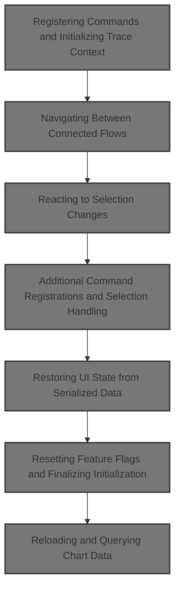
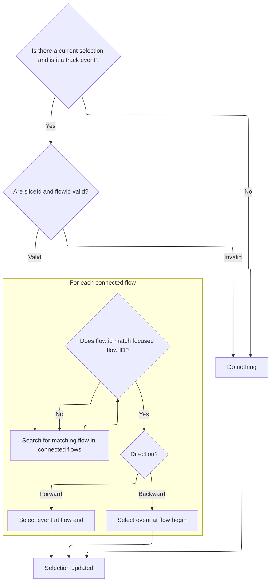
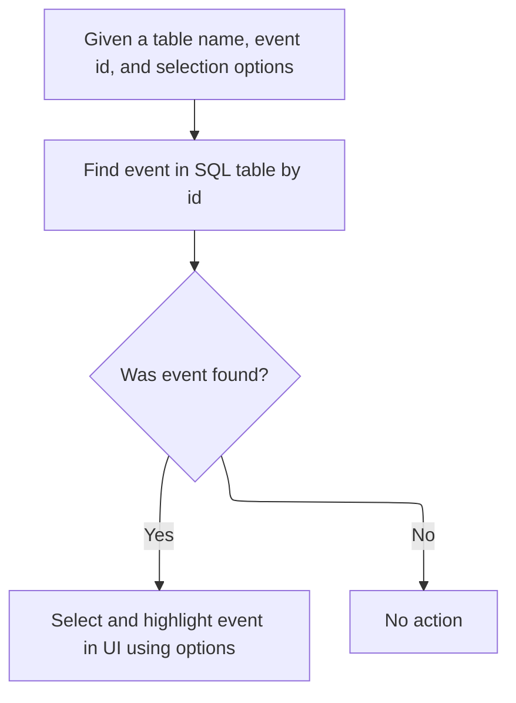
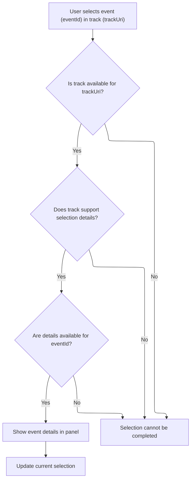
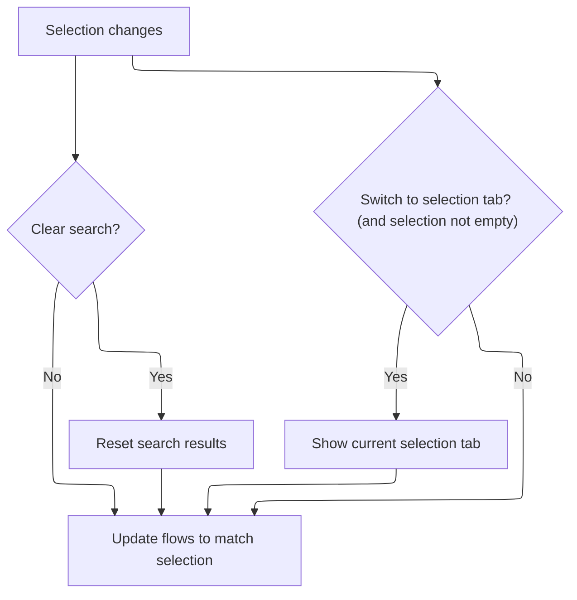
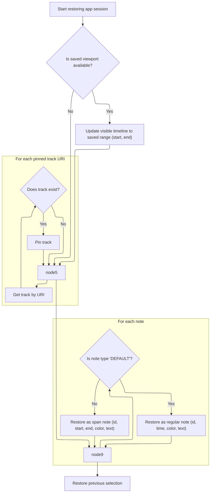
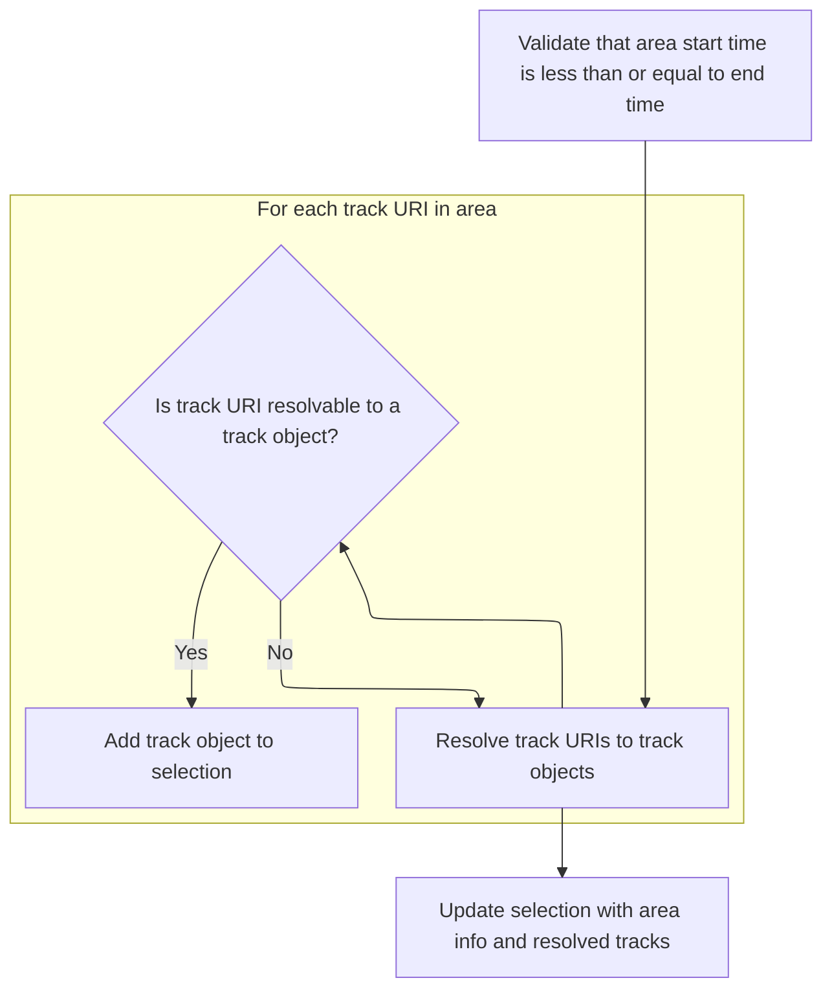
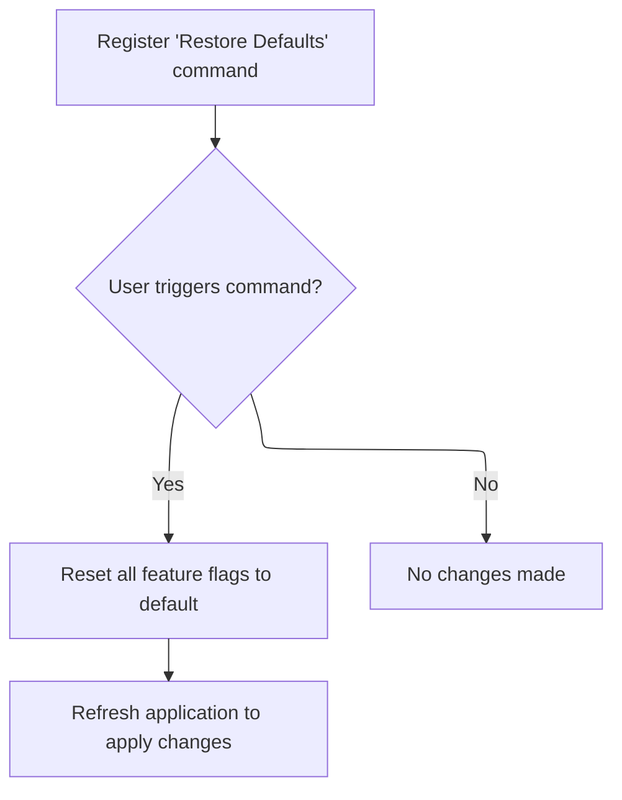
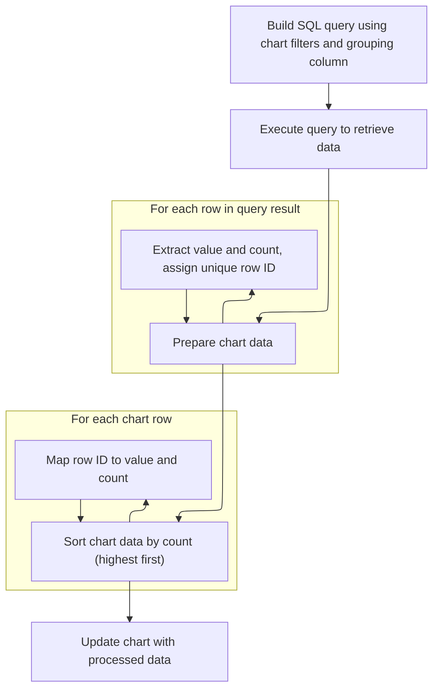

This document describes how the trace UI is set up for interactive analysis when a trace file is loaded. The flow prepares the UI by registering commands, enabling navigation between flows, managing selection, and restoring the user's workspace and previous selections. This allows users to efficiently explore and analyze trace data.



# Registering Commands and Initializing Trace Context

<SwmSnippet path="/ui/src/core_plugins/dev.perfetto.CoreCommands/index.ts" line="234">

---

In <SwmToken path="ui/src/core_plugins/dev.perfetto.CoreCommands/index.ts" pos="234:3:3" line-data="  async onTraceLoad(ctx: TraceImpl): Promise&lt;void&gt; {">`onTraceLoad`</SwmToken>, we set up the trace context by registering macros and a large set of commands for user actions. This prepares the UI to handle trace interactions. Next, we need to call <SwmPath>[ui/…/core/flow_manager.ts](ui/src/core/flow_manager.ts)</SwmPath> to handle flow-related commands, like moving between flows, which depend on the selection and trace context established here.

```typescript
  async onTraceLoad(ctx: TraceImpl): Promise<void> {
    const app = AppImpl.instance;

    // Rgister macros from settings first.
    registerMacros(ctx, assertExists(CoreCommands.macrosSetting).get());

    // Register the macros from extras at onTraceReady (the latest time
    // possible).
    ctx.onTraceReady.addListener(async (_) => {
      // Await the promise: we've tried to be async as long as possible but
      // now we need the extras to be loaded.
      await app.extraLoadingPromise;
      registerMacros(
        ctx,
        app.extraMacros.reduce((acc, macro) => ({...acc, ...macro}), {}),
      );
    });

    ctx.commands.registerCommand({
      id: 'dev.perfetto.RunQueryAllProcesses',
      name: 'Run query: All processes',
      callback: () => {
        addQueryResultsTab(ctx, {
          query: ALL_PROCESSES_QUERY,
          title: 'All Processes',
        });
      },
    });

    ctx.commands.registerCommand({
      id: 'dev.perfetto.RunQueryCpuTimeByProcess',
      name: 'Run query: CPU time by process',
      callback: () => {
        addQueryResultsTab(ctx, {
          query: CPU_TIME_FOR_PROCESSES,
          title: 'CPU time by process',
        });
      },
    });

    ctx.commands.registerCommand({
      id: 'dev.perfetto.RunQueryCyclesByStateByCpu',
      name: 'Run query: cycles by p-state by CPU',
      callback: () => {
        addQueryResultsTab(ctx, {
          query: CYCLES_PER_P_STATE_PER_CPU,
          title: 'Cycles by p-state by CPU',
        });
      },
    });

    ctx.commands.registerCommand({
      id: 'dev.perfetto.RunQueryCyclesByCpuByProcess',
      name: 'Run query: CPU Time by CPU by process',
      callback: () => {
        addQueryResultsTab(ctx, {
          query: CPU_TIME_BY_CPU_BY_PROCESS,
          title: 'CPU time by CPU by process',
        });
      },
    });

    ctx.commands.registerCommand({
      id: 'dev.perfetto.RunQueryHeapGraphBytesPerType',
      name: 'Run query: heap graph bytes per type',
      callback: () => {
        addQueryResultsTab(ctx, {
          query: HEAP_GRAPH_BYTES_PER_TYPE,
          title: 'Heap graph bytes per type',
        });
      },
    });

    ctx.commands.registerCommand({
      id: 'dev.perfetto.DebugSqlPerformance',
      name: 'Debug SQL performance',
      callback: () => {
        addQueryResultsTab(ctx, {
          query: SQL_STATS,
          title: 'Recent SQL queries',
        });
      },
    });

    ctx.commands.registerCommand({
      id: 'dev.perfetto.UnpinAllTracks',
      name: 'Unpin all pinned tracks',
      callback: () => {
        const workspace = ctx.currentWorkspace;
        workspace.pinnedTracks.forEach((t) => workspace.unpinTrack(t));
      },
    });

    ctx.commands.registerCommand({
      id: 'dev.perfetto.ExpandAllGroups',
      name: 'Expand all track groups',
      callback: () => {
        ctx.currentWorkspace.flatTracks.forEach((track) => track.expand());
      },
    });

    ctx.commands.registerCommand({
      id: 'dev.perfetto.CollapseAllGroups',
      name: 'Collapse all track groups',
      callback: () => {
        ctx.currentWorkspace.flatTracks.forEach((track) => track.collapse());
      },
    });

    ctx.commands.registerCommand({
      id: 'dev.perfetto.PanToTimestamp',
      name: 'Pan to timestamp',
      callback: (tsRaw: unknown) => {
        const ts = getOrPromptForTimestamp(tsRaw);
        if (ts !== undefined) {
          ctx.timeline.panToTimestamp(ts);
        }
      },
    });

    ctx.commands.registerCommand({
      id: 'dev.perfetto.MarkTimestamp',
      name: 'Mark timestamp',
      callback: (tsRaw: unknown) => {
        const ts = getOrPromptForTimestamp(tsRaw);
        if (ts !== undefined) {
          ctx.notes.addNote({
            timestamp: ts,
          });
        }
      },
    });

    ctx.commands.registerCommand({
      id: 'dev.perfetto.ShowCurrentSelectionTab',
      name: 'Show current selection tab',
      callback: () => {
        ctx.tabs.showTab('current_selection');
      },
    });

    ctx.commands.registerCommand({
      id: 'dev.perfetto.CreateWorkspace',
      name: 'Create new empty workspace',
      callback: async (rawName: unknown) => {
        const workspaces = ctx.workspaces;
        if (workspaces === undefined) return; // No trace loaded.
        const name =
          typeof rawName === 'string'
            ? rawName
            : await ctx.omnibox.prompt('Give it a name...');
        if (name === undefined || name === '') return;
        workspaces.createEmptyWorkspace(name);
      },
    });

    ctx.commands.registerCommand({
      id: 'dev.perfetto.CreateWorkspaceAndSwitch',
      name: 'Create new empty workspace and switch to it',
      callback: async (rawName: unknown) => {
        const workspaces = ctx.workspaces;
        if (workspaces === undefined) return; // No trace loaded.
        const name =
          typeof rawName === 'string'
            ? rawName
            : await ctx.omnibox.prompt('Give it a name...');
        if (name === undefined || name === '') return;
        workspaces.switchWorkspace(workspaces.createEmptyWorkspace(name));
      },
    });

    ctx.commands.registerCommand({
      id: 'dev.perfetto.SwitchWorkspace',
      name: 'Switch to workspace',
      callback: async (rawName: unknown) => {
        const workspaces = ctx.workspaces;
        if (workspaces === undefined) return; // No trace loaded.
        const workspace =
          workspaces.all.find((x) => x.title === rawName) ??
          (await ctx.omnibox.prompt('Choose a workspace...', {
            values: workspaces.all,
            getName: (ws) => ws.title,
          }));
        if (workspace) {
          workspaces.switchWorkspace(workspace);
        }
      },
    });

    ctx.commands.registerCommand({
      id: 'dev.perfetto.SetTimestampFormat',
      name: 'Set timestamp and duration format',
      callback: async () => {
        const TF = TimestampFormat;
        const timeZone = formatTimezone(ctx.traceInfo.tzOffMin);
        const result = await ctx.omnibox.prompt('Select format...', {
          values: [
            {format: TF.Timecode, name: 'Timecode'},
            {format: TF.UTC, name: 'Realtime (UTC)'},

            {format: TF.TraceTz, name: `Realtime (Trace TZ - ${timeZone})`},
            {format: TF.Seconds, name: 'Seconds'},
            {format: TF.Milliseconds, name: 'Milliseconds'},
            {format: TF.Microseconds, name: 'Microseconds'},
            {format: TF.TraceNs, name: 'Trace nanoseconds'},
            {
              format: TF.TraceNsLocale,
              name: 'Trace nanoseconds (with locale-specific formatting)',
            },
            {format: TF.CustomTimezone, name: 'Custom Timezone'},
          ],
          getName: (x) => x.name,
        });
        if (!result) return;

        if (result.format === TF.CustomTimezone) {
          const result = await ctx.omnibox.prompt('Select format...', {
            values: Object.entries(timezoneOffsetMap),
            getName: ([key]) => key,
          });

          if (!result) return;
          ctx.timeline.timezoneOverride.set(result[0]);
        }

        ctx.timeline.timestampFormat = result.format;
      },
    });

    ctx.commands.registerCommand({
      id: 'dev.perfetto.SetDurationPrecision',
      name: 'Set duration precision',
      callback: async () => {
        const DF = DurationPrecision;
        const result = await ctx.omnibox.prompt(
          'Select duration precision mode...',
          {
            values: [
              {format: DF.Full, name: 'Full'},
              {format: DF.HumanReadable, name: 'Human readable'},
            ],
            getName: (x) => x.name,
          },
        );
        result && (ctx.timeline.durationPrecision = result.format);
      },
    });

    ctx.commands.registerCommand({
      id: 'dev.perfetto.TogglePerformanceMetrics',
      name: 'Toggle performance metrics',
      callback: () => (ctx.perfDebugging.enabled = !ctx.perfDebugging.enabled),
    });

    ctx.commands.registerCommand({
      id: 'dev.perfetto.ShareTrace',
      name: 'Share trace',
      callback: () => shareTrace(ctx),
    });
    ctx.commands.registerCommand({
      id: 'dev.perfetto.SearchNext',
      name: 'Go to next search result',
      callback: () => {
        ctx.search.stepForward();
      },
      defaultHotkey: 'Enter',
    });

    ctx.commands.registerCommand({
      id: 'dev.perfetto.SearchPrev',
      name: 'Go to previous search result',
      callback: () => {
        ctx.search.stepBackwards();
      },
      defaultHotkey: 'Shift+Enter',
    });

    ctx.commands.registerCommand({
      id: 'dev.perfetto.SwitchToQueryMode',
      name: 'Switch to query mode',
      callback: () => ctx.omnibox.setMode(OmniboxMode.Query),
    });

    ctx.commands.registerCommand({
      id: 'dev.perfetto.RunQuery',
      name: 'Runs an SQL query',
      callback: async (rawSql: unknown) => {
        const query =
          typeof rawSql === 'string'
            ? rawSql
            : await ctx.omnibox.prompt('Enter SQL...');
        if (!query) {
          return;
        }
        await ctx.engine.query(query);
      },
    });

    ctx.commands.registerCommand({
      id: 'dev.perfetto.RunQueryAndShowTab',
      name: 'Runs an SQL query and opens results in a tab',
      callback: async (rawSql: unknown) => {
        const query =
          typeof rawSql === 'string'
            ? rawSql
            : await ctx.omnibox.prompt('Enter SQL...');
        if (!query) {
          return;
        }
        addQueryResultsTab(ctx, {
          query,
          title: 'Command Query',
        });
      },
    });

    ctx.commands.registerCommand({
      id: 'dev.perfetto.SwitchToSearchMode',
      name: 'Switch to search mode',
      callback: () => ctx.omnibox.setMode(OmniboxMode.Search),
      defaultHotkey: '/',
    });
    ctx.commands.registerCommand({
      id: 'dev.perfetto.CopyTimeWindow',
      name: `Copy selected time window to clipboard`,
      callback: async () => {
        const window = await getTimeSpanOfSelectionOrVisibleWindow(ctx);
        const query = `ts >= ${window.start} and ts < ${window.end}`;
        copyToClipboard(query);
      },
    });

    ctx.commands.registerCommand({
      id: 'dev.perfetto.FocusSelection',
      name: 'Focus current selection',
      callback: () => ctx.selection.scrollToSelection(),
      defaultHotkey: 'F',
    });

    ctx.commands.registerCommand({
      id: 'dev.perfetto.Deselect',
      name: 'Deselect',
      callback: () => {
        ctx.selection.clearSelection();
      },
      defaultHotkey: 'Escape',
    });

    ctx.commands.registerCommand({
      id: 'dev.perfetto.NextFlow',
      name: 'Next flow',
      callback: () => ctx.flows.focusOtherFlow('Forward'),
      defaultHotkey: 'Mod+]',
    });

    ctx.commands.registerCommand({
      id: 'dev.perfetto.PrevFlow',
      name: 'Prev flow',
      callback: () => ctx.flows.focusOtherFlow('Backward'),
      defaultHotkey: 'Mod+[',
    });

    ctx.commands.registerCommand({
      id: 'dev.perfetto.MoveNextFlow',
      name: 'Move next flow',
      callback: () => ctx.flows.moveByFocusedFlow('Forward'),
      defaultHotkey: ']',
    });

    ctx.commands.registerCommand({
      id: 'dev.perfetto.MovePrevFlow',
      name: 'Move prev flow',
      callback: () => ctx.flows.moveByFocusedFlow('Backward'),
      defaultHotkey: '[',
    });

```

---

</SwmSnippet>

## Navigating Between Connected Flows



<SwmSnippet path="/ui/src/core/flow_manager.ts" line="513">

---

<SwmToken path="ui/src/core/flow_manager.ts" pos="513:1:1" line-data="  moveByFocusedFlow(direction: FlowDirection): void {">`moveByFocusedFlow`</SwmToken> figures out which flow is currently focused and, if the selection is a track event, finds the corresponding slice to select. We call <SwmPath>[ui/…/core/selection_manager.ts](ui/src/core/selection_manager.ts)</SwmPath> next to actually update the selection and trigger UI changes based on the new event.

```typescript
  moveByFocusedFlow(direction: FlowDirection): void {
    const currentSelection = this._curSelection;
    if (!currentSelection || currentSelection.kind !== 'track_event') {
      return;
    }

    const sliceId = currentSelection.eventId;
    const flowId =
      direction === 'Backward'
        ? this._focusedFlowIdLeft
        : this._focusedFlowIdRight;

    if (sliceId === -1 || flowId === -1) {
      return;
    }

    // Find flow that is in focus and select corresponding slice
    for (const flow of this._connectedFlows) {
      if (flow.id === flowId) {
        const flowPoint = direction === 'Backward' ? flow.begin : flow.end;
        this.selectionMgr.selectSqlEvent('slice', flowPoint.sliceId, {
          scrollToSelection: true,
        });
      }
    }
  }
```

---

</SwmSnippet>

## Selecting Events by SQL Table and ID



<SwmSnippet path="/ui/src/core/selection_manager.ts" line="327">

---

<SwmToken path="ui/src/core/selection_manager.ts" pos="327:3:3" line-data="  async selectSqlEvent(sqlTableName: string, id: number, opts?: SelectionOpts) {">`selectSqlEvent`</SwmToken> resolves the event from the SQL table and ID, then passes it to <SwmToken path="ui/src/core/selection_manager.ts" pos="329:7:7" line-data="    event &amp;&amp; this.selectTrackEvent(event.trackUri, event.eventId, opts);">`selectTrackEvent`</SwmToken> to update the selection. We need to call <SwmToken path="ui/src/core/selection_manager.ts" pos="329:7:7" line-data="    event &amp;&amp; this.selectTrackEvent(event.trackUri, event.eventId, opts);">`selectTrackEvent`</SwmToken> next to actually reflect the change in the UI.

```typescript
  async selectSqlEvent(sqlTableName: string, id: number, opts?: SelectionOpts) {
    const event = await this.resolveSqlEvent(sqlTableName, id);
    event && this.selectTrackEvent(event.trackUri, event.eventId, opts);
  }
```

---

</SwmSnippet>

## Selecting Track Events

<SwmSnippet path="/ui/src/core/selection_manager.ts" line="75">

---

<SwmToken path="ui/src/core/selection_manager.ts" pos="75:3:3" line-data="  async selectTrackEvent(">`selectTrackEvent`</SwmToken> just forwards the selection request to <SwmToken path="ui/src/core/selection_manager.ts" pos="80:3:3" line-data="    this.selectTrackEventInternal(trackUri, eventId, opts);">`selectTrackEventInternal`</SwmToken>, which does the actual work. We call <SwmToken path="ui/src/core/selection_manager.ts" pos="80:3:3" line-data="    this.selectTrackEventInternal(trackUri, eventId, opts);">`selectTrackEventInternal`</SwmToken> next to handle the details of updating selection state and UI.

```typescript
  async selectTrackEvent(
    trackUri: string,
    eventId: number,
    opts?: SelectionOpts,
  ) {
    this.selectTrackEventInternal(trackUri, eventId, opts);
  }
```

---

</SwmSnippet>

## Resolving and Applying Track Event Selection



<SwmSnippet path="/ui/src/core/selection_manager.ts" line="417">

---

<SwmToken path="ui/src/core/selection_manager.ts" pos="417:5:5" line-data="  private async selectTrackEventInternal(">`selectTrackEventInternal`</SwmToken> resolves the track and renderer, gets the event details, creates a details panel, and then calls <SwmToken path="ui/src/core/selection_manager.ts" pos="451:3:3" line-data="    this.setSelection(selection, opts);">`setSelection`</SwmToken> to update the selection. We call <SwmToken path="ui/src/core/selection_manager.ts" pos="451:3:3" line-data="    this.setSelection(selection, opts);">`setSelection`</SwmToken> next to finalize the selection and trigger downstream updates.

```typescript
  private async selectTrackEventInternal(
    trackUri: string,
    eventId: number,
    opts?: SelectionOpts,
    serializedDetailsPanel?: unknown,
  ) {
    const track = this.trackManager.getTrack(trackUri);
    if (!track) {
      throw new Error(
        `Unable to resolve selection details: Track ${trackUri} not found`,
      );
    }

    const trackRenderer = track.renderer;
    if (!trackRenderer.getSelectionDetails) {
      throw new Error(
        `Unable to resolve selection details: Track ${trackUri} does not support selection details`,
      );
    }

    const details = await trackRenderer.getSelectionDetails(eventId);
    if (!exists(details)) {
      throw new Error(
        `Unable to resolve selection details: Track ${trackUri} returned no details for event ${eventId}`,
      );
    }

    const selection: TrackEventSelection = {
      ...details,
      kind: 'track_event',
      trackUri,
      eventId,
    };
    this.createTrackEventDetailsPanel(selection, serializedDetailsPanel);
    this.setSelection(selection, opts);
  }
```

---

</SwmSnippet>

## Updating Selection State

<SwmSnippet path="/ui/src/core/selection_manager.ts" line="332">

---

In <SwmToken path="ui/src/core/selection_manager.ts" pos="332:3:3" line-data="  private setSelection(selection: Selection, opts?: SelectionOpts) {">`setSelection`</SwmToken>, we update the internal selection and notify listeners via <SwmToken path="ui/src/core/selection_manager.ts" pos="334:3:3" line-data="    this.onSelectionChange(selection, opts ?? {});">`onSelectionChange`</SwmToken>. Next, we call <SwmPath>[ui/…/core/trace_impl.ts](ui/src/core/trace_impl.ts)</SwmPath> to handle UI updates and flow logic based on the new selection.

```typescript
  private setSelection(selection: Selection, opts?: SelectionOpts) {
    this._selection = selection;
    this.onSelectionChange(selection, opts ?? {});

```

---

</SwmSnippet>

### Reacting to Selection Changes



<SwmSnippet path="/ui/src/core/trace_impl.ts" line="176">

---

<SwmToken path="ui/src/core/trace_impl.ts" pos="176:3:3" line-data="  private onSelectionChange(selection: Selection, opts: SelectionOpts) {">`onSelectionChange`</SwmToken> resets search, switches tabs if needed, and updates flows based on the selection. We call <SwmPath>[ui/…/core/flow_manager.ts](ui/src/core/flow_manager.ts)</SwmPath> next to update flow state and connected flows according to the new selection.

```typescript
  private onSelectionChange(selection: Selection, opts: SelectionOpts) {
    const {clearSearch = true, switchToCurrentSelectionTab = true} = opts;
    if (clearSearch) {
      this.search.reset();
    }
    if (switchToCurrentSelectionTab && selection.kind !== 'empty') {
      this.tabs.showCurrentSelectionTab();
    }

    this.flows.updateFlows(selection);
  }
```

---

</SwmSnippet>

<SwmSnippet path="/ui/src/core/flow_manager.ts" line="453">

---

<SwmToken path="ui/src/core/flow_manager.ts" pos="453:1:1" line-data="  updateFlows(selection: Selection) {">`updateFlows`</SwmToken> sets up flow state based on selection kind. If it's a track event and the renderer is for 'slice', it calls <SwmToken path="ui/src/core/flow_manager.ts" pos="468:3:3" line-data="      this.sliceSelected(selection.eventId);">`sliceSelected`</SwmToken>; otherwise, it clears connected flows. For area selections, it calls <SwmToken path="ui/src/core/flow_manager.ts" pos="474:3:3" line-data="      this.areaSelected(selection);">`areaSelected`</SwmToken>. This branching keeps flow state in sync with selection type.

```typescript
  updateFlows(selection: Selection) {
    this.initialize();
    this._curSelection = selection;

    if (selection.kind === 'empty') {
      this.setConnectedFlows([]);
      this.setSelectedFlows([]);
      return;
    }

    if (
      selection.kind === 'track_event' &&
      this.trackMgr.getTrack(selection.trackUri)?.renderer.rootTableName ===
        'slice'
    ) {
      this.sliceSelected(selection.eventId);
    } else {
      this.setConnectedFlows([]);
    }

    if (selection.kind === 'area') {
      this.areaSelected(selection);
    } else {
      this.setConnectedFlows([]);
    }
  }
```

---

</SwmSnippet>

### Finalizing Selection and Scrolling

<SwmSnippet path="/ui/src/core/selection_manager.ts" line="336">

---

We just returned from <SwmToken path="ui/src/core/selection_manager.ts" pos="334:3:3" line-data="    this.onSelectionChange(selection, opts ?? {});">`onSelectionChange`</SwmToken> in <SwmPath>[ui/…/core/trace_impl.ts](ui/src/core/trace_impl.ts)</SwmPath>. Back in <SwmToken path="ui/src/core/selection_manager.ts" pos="112:3:3" line-data="    this.setSelection(">`setSelection`</SwmToken> (<SwmPath>[ui/…/core/selection_manager.ts](ui/src/core/selection_manager.ts)</SwmPath>), if <SwmToken path="ui/src/core/selection_manager.ts" pos="336:6:6" line-data="    if (opts?.scrollToSelection) {">`scrollToSelection`</SwmToken> is set, we scroll the UI to the selected item, finalizing the selection update.

```typescript
    if (opts?.scrollToSelection) {
      this.scrollToSelection();
    }
  }
```

---

</SwmSnippet>

## Additional Command Registrations and Selection Handling

```mermaid
%%{init: {"flowchart": {"defaultRenderer": "elk"}} }%%
flowchart TD
    node1["Register commands for trace interaction"]
    click node1 openCode "ui/src/core_plugins/dev.perfetto.CoreCommands/index.ts:610:802"

    %% Select event by table name and ID
    node1 --> node2{"User selects event by table name and ID?"}
    click node2 openCode "ui/src/core_plugins/dev.perfetto.CoreCommands/index.ts:612:628"
    node2 -->|"Yes"| node3["Prompt for table name and ID"]
    click node3 openCode "ui/src/core_plugins/dev.perfetto.CoreCommands/index.ts:616:620"
    node3 --> node4["Select event"]
    click node4 openCode "ui/src/core_plugins/dev.perfetto.CoreCommands/index.ts:625:627"
    node2 -->|"No"| node5

    %% Select all tracks
    node1 --> node6{"User selects all tracks?"}
    click node6 openCode "ui/src/core_plugins/dev.perfetto.CoreCommands/index.ts:631:674"
    node6 -->|"Yes"| node7{"Is selection area and covers whole trace?"}
    click node7 openCode "ui/src/core_plugins/dev.perfetto.CoreCommands/index.ts:644:651"
    node7 -->|"No"| node8["Expand selection to whole trace"]
    click node8 openCode "ui/src/core_plugins/dev.perfetto.CoreCommands/index.ts:654:655"
    node7 -->|"Yes"| node9["Select all tracks"]
    click node9 openCode "ui/src/core_plugins/dev.perfetto.CoreCommands/index.ts:658:660"
    node6 -->|"No"| node5

    %% Copy pinned tracks
    node1 --> node10{"User copies pinned tracks to workspace?"}
    click node10 openCode "ui/src/core_plugins/dev.perfetto.CoreCommands/index.ts:702:720"
    node10 -->|"Yes"| node11{"Are there pinned tracks?"}
    click node11 openCode "ui/src/core_plugins/dev.perfetto.CoreCommands/index.ts:707:709"
    node11 -->|"Yes"| subgraph loop1["For each pinned track"]
        node12["Clone and add to workspace"]
        click node12 openCode "ui/src/core_plugins/dev.perfetto.CoreCommands/index.ts:715:717"
    end
    node11 -->|"No"| node13["Alert: No pinned tracks"]
    click node13 openCode "ui/src/core_plugins/dev.perfetto.CoreCommands/index.ts:708:709"
    node10 -->|"No"| node5

    %% Copy filtered tracks
    node1 --> node14{"User copies filtered tracks to workspace?"}
    click node14 openCode "ui/src/core_plugins/dev.perfetto.CoreCommands/index.ts:723:746"
    node14 -->|"Yes"| node15{"Are there filtered tracks?"}
    click node15 openCode "ui/src/core_plugins/dev.perfetto.CoreCommands/index.ts:733:735"
    node15 -->|"Yes"| subgraph loop2["For each filtered track"]
        node16["Clone and add to workspace"]
        click node16 openCode "ui/src/core_plugins/dev.perfetto.CoreCommands/index.ts:742:743"
    end
    node15 -->|"No"| node17["Alert: No filtered tracks"]
    click node17 openCode "ui/src/core_plugins/dev.perfetto.CoreCommands/index.ts:734:735"
    node14 -->|"No"| node5

    %% Copy selected tracks
    node1 --> node18{"User copies selected tracks to workspace?"}
    click node18 openCode "ui/src/core_plugins/dev.perfetto.CoreCommands/index.ts:749:770"
    node18 -->|"Yes"| node19{"Are there selected tracks?"}
    click node19 openCode "ui/src/core_plugins/dev.perfetto.CoreCommands/index.ts:755:757"
    node19 -->|"Yes"| subgraph loop3["For each selected track"]
        node20["Clone and add to workspace"]
        click node20 openCode "ui/src/core_plugins/dev.perfetto.CoreCommands/index.ts:766:767"
    end
    node19 -->|"No"| node21["Alert: No selected tracks"]
    click node21 openCode "ui/src/core_plugins/dev.perfetto.CoreCommands/index.ts:756:757"
    node18 -->|"No"| node5

    %% Save UI state
    node1 --> node22{"User saves UI state?"}
    click node22 openCode "ui/src/core_plugins/dev.perfetto.CoreCommands/index.ts:773:780"
    node22 -->|"Yes"| node23["Save UI state"]
    click node23 openCode "ui/src/core_plugins/dev.perfetto.CoreCommands/index.ts:777:780"
    node22 -->|"No"| node5

    %% Load UI state
    node1 --> node24{"User loads UI state?"}
    click node24 openCode "ui/src/core_plugins/dev.perfetto.CoreCommands/index.ts:783:801"
    node24 -->|"Yes"| node25{"Is there a saved state?"}
    click node25 openCode "ui/src/core_plugins/dev.perfetto.CoreCommands/index.ts:788:793"
    node25 -->|"Yes"| node26["Load UI state"]
    click node26 openCode "ui/src/core_plugins/dev.perfetto.CoreCommands/index.ts:795:800"
    node25 -->|"No"| node27["Alert: Nothing saved"]
    click node27 openCode "ui/src/core_plugins/dev.perfetto.CoreCommands/index.ts:789:793"
    node24 -->|"No"| node5

classDef HeadingStyle fill:#777777,stroke:#333,stroke-width:2px;

%% Swimm:
%% %%{init: {"flowchart": {"defaultRenderer": "elk"}} }%%
%% flowchart TD
%%     node1["Register commands for trace interaction"]
%%     click node1 openCode "<SwmPath>[ui/…/dev.perfetto.CoreCommands/index.ts](ui/src/core_plugins/dev.perfetto.CoreCommands/index.ts)</SwmPath>:610:802"
%% 
%%     %% Select event by table name and ID
%%     node1 --> node2{"User selects event by table name and ID?"}
%%     click node2 openCode "<SwmPath>[ui/…/dev.perfetto.CoreCommands/index.ts](ui/src/core_plugins/dev.perfetto.CoreCommands/index.ts)</SwmPath>:612:628"
%%     node2 -->|"Yes"| node3["Prompt for table name and ID"]
%%     click node3 openCode "<SwmPath>[ui/…/dev.perfetto.CoreCommands/index.ts](ui/src/core_plugins/dev.perfetto.CoreCommands/index.ts)</SwmPath>:616:620"
%%     node3 --> node4["Select event"]
%%     click node4 openCode "<SwmPath>[ui/…/dev.perfetto.CoreCommands/index.ts](ui/src/core_plugins/dev.perfetto.CoreCommands/index.ts)</SwmPath>:625:627"
%%     node2 -->|"No"| node5
%% 
%%     %% Select all tracks
%%     node1 --> node6{"User selects all tracks?"}
%%     click node6 openCode "<SwmPath>[ui/…/dev.perfetto.CoreCommands/index.ts](ui/src/core_plugins/dev.perfetto.CoreCommands/index.ts)</SwmPath>:631:674"
%%     node6 -->|"Yes"| node7{"Is selection area and covers whole trace?"}
%%     click node7 openCode "<SwmPath>[ui/…/dev.perfetto.CoreCommands/index.ts](ui/src/core_plugins/dev.perfetto.CoreCommands/index.ts)</SwmPath>:644:651"
%%     node7 -->|"No"| node8["Expand selection to whole trace"]
%%     click node8 openCode "<SwmPath>[ui/…/dev.perfetto.CoreCommands/index.ts](ui/src/core_plugins/dev.perfetto.CoreCommands/index.ts)</SwmPath>:654:655"
%%     node7 -->|"Yes"| node9["Select all tracks"]
%%     click node9 openCode "<SwmPath>[ui/…/dev.perfetto.CoreCommands/index.ts](ui/src/core_plugins/dev.perfetto.CoreCommands/index.ts)</SwmPath>:658:660"
%%     node6 -->|"No"| node5
%% 
%%     %% Copy pinned tracks
%%     node1 --> node10{"User copies pinned tracks to workspace?"}
%%     click node10 openCode "<SwmPath>[ui/…/dev.perfetto.CoreCommands/index.ts](ui/src/core_plugins/dev.perfetto.CoreCommands/index.ts)</SwmPath>:702:720"
%%     node10 -->|"Yes"| node11{"Are there pinned tracks?"}
%%     click node11 openCode "<SwmPath>[ui/…/dev.perfetto.CoreCommands/index.ts](ui/src/core_plugins/dev.perfetto.CoreCommands/index.ts)</SwmPath>:707:709"
%%     node11 -->|"Yes"| subgraph loop1["For each pinned track"]
%%         node12["Clone and add to workspace"]
%%         click node12 openCode "<SwmPath>[ui/…/dev.perfetto.CoreCommands/index.ts](ui/src/core_plugins/dev.perfetto.CoreCommands/index.ts)</SwmPath>:715:717"
%%     end
%%     node11 -->|"No"| node13["Alert: No pinned tracks"]
%%     click node13 openCode "<SwmPath>[ui/…/dev.perfetto.CoreCommands/index.ts](ui/src/core_plugins/dev.perfetto.CoreCommands/index.ts)</SwmPath>:708:709"
%%     node10 -->|"No"| node5
%% 
%%     %% Copy filtered tracks
%%     node1 --> node14{"User copies filtered tracks to workspace?"}
%%     click node14 openCode "<SwmPath>[ui/…/dev.perfetto.CoreCommands/index.ts](ui/src/core_plugins/dev.perfetto.CoreCommands/index.ts)</SwmPath>:723:746"
%%     node14 -->|"Yes"| node15{"Are there filtered tracks?"}
%%     click node15 openCode "<SwmPath>[ui/…/dev.perfetto.CoreCommands/index.ts](ui/src/core_plugins/dev.perfetto.CoreCommands/index.ts)</SwmPath>:733:735"
%%     node15 -->|"Yes"| subgraph loop2["For each filtered track"]
%%         node16["Clone and add to workspace"]
%%         click node16 openCode "<SwmPath>[ui/…/dev.perfetto.CoreCommands/index.ts](ui/src/core_plugins/dev.perfetto.CoreCommands/index.ts)</SwmPath>:742:743"
%%     end
%%     node15 -->|"No"| node17["Alert: No filtered tracks"]
%%     click node17 openCode "<SwmPath>[ui/…/dev.perfetto.CoreCommands/index.ts](ui/src/core_plugins/dev.perfetto.CoreCommands/index.ts)</SwmPath>:734:735"
%%     node14 -->|"No"| node5
%% 
%%     %% Copy selected tracks
%%     node1 --> node18{"User copies selected tracks to workspace?"}
%%     click node18 openCode "<SwmPath>[ui/…/dev.perfetto.CoreCommands/index.ts](ui/src/core_plugins/dev.perfetto.CoreCommands/index.ts)</SwmPath>:749:770"
%%     node18 -->|"Yes"| node19{"Are there selected tracks?"}
%%     click node19 openCode "<SwmPath>[ui/…/dev.perfetto.CoreCommands/index.ts](ui/src/core_plugins/dev.perfetto.CoreCommands/index.ts)</SwmPath>:755:757"
%%     node19 -->|"Yes"| subgraph loop3["For each selected track"]
%%         node20["Clone and add to workspace"]
%%         click node20 openCode "<SwmPath>[ui/…/dev.perfetto.CoreCommands/index.ts](ui/src/core_plugins/dev.perfetto.CoreCommands/index.ts)</SwmPath>:766:767"
%%     end
%%     node19 -->|"No"| node21["Alert: No selected tracks"]
%%     click node21 openCode "<SwmPath>[ui/…/dev.perfetto.CoreCommands/index.ts](ui/src/core_plugins/dev.perfetto.CoreCommands/index.ts)</SwmPath>:756:757"
%%     node18 -->|"No"| node5
%% 
%%     %% Save UI state
%%     node1 --> node22{"User saves UI state?"}
%%     click node22 openCode "<SwmPath>[ui/…/dev.perfetto.CoreCommands/index.ts](ui/src/core_plugins/dev.perfetto.CoreCommands/index.ts)</SwmPath>:773:780"
%%     node22 -->|"Yes"| node23["Save UI state"]
%%     click node23 openCode "<SwmPath>[ui/…/dev.perfetto.CoreCommands/index.ts](ui/src/core_plugins/dev.perfetto.CoreCommands/index.ts)</SwmPath>:777:780"
%%     node22 -->|"No"| node5
%% 
%%     %% Load UI state
%%     node1 --> node24{"User loads UI state?"}
%%     click node24 openCode "<SwmPath>[ui/…/dev.perfetto.CoreCommands/index.ts](ui/src/core_plugins/dev.perfetto.CoreCommands/index.ts)</SwmPath>:783:801"
%%     node24 -->|"Yes"| node25{"Is there a saved state?"}
%%     click node25 openCode "<SwmPath>[ui/…/dev.perfetto.CoreCommands/index.ts](ui/src/core_plugins/dev.perfetto.CoreCommands/index.ts)</SwmPath>:788:793"
%%     node25 -->|"Yes"| node26["Load UI state"]
%%     click node26 openCode "<SwmPath>[ui/…/dev.perfetto.CoreCommands/index.ts](ui/src/core_plugins/dev.perfetto.CoreCommands/index.ts)</SwmPath>:795:800"
%%     node25 -->|"No"| node27["Alert: Nothing saved"]
%%     click node27 openCode "<SwmPath>[ui/…/dev.perfetto.CoreCommands/index.ts](ui/src/core_plugins/dev.perfetto.CoreCommands/index.ts)</SwmPath>:789:793"
%%     node24 -->|"No"| node5
%% 
%% classDef HeadingStyle fill:#777777,stroke:#333,stroke-width:2px;
```

<SwmSnippet path="/ui/src/core_plugins/dev.perfetto.CoreCommands/index.ts" line="610">

---

After returning from <SwmPath>[ui/…/core/flow_manager.ts](ui/src/core/flow_manager.ts)</SwmPath>, <SwmToken path="ui/src/core_plugins/dev.perfetto.CoreCommands/index.ts" pos="234:3:3" line-data="  async onTraceLoad(ctx: TraceImpl): Promise&lt;void&gt; {">`onTraceLoad`</SwmToken> continues by registering commands for direct event selection and area selection. This extends the UI's capabilities for more advanced selection and manipulation.

```typescript
    // Provides a test bed for resolving events using a SQL table name and ID
    // which is used in deep-linking, amongst other places.
    ctx.commands.registerCommand({
      id: 'dev.perfetto.SelectEventByTableNameAndId',
      name: 'Select event by table name and ID',
      callback: async () => {
        const rootTableName = await ctx.omnibox.prompt('Enter table name');
        if (rootTableName === undefined) return;

        const id = await ctx.omnibox.prompt('Enter ID');
        if (id === undefined) return;

        const num = Number(id);
        if (!isFinite(num)) return; // Rules out NaN or +-Infinity

        ctx.selection.selectSqlEvent(rootTableName, num, {
          scrollToSelection: true,
        });
      },
    });

    ctx.commands.registerCommand({
      id: 'dev.perfetto.SelectAll',
      name: 'Select all',
      callback: () => {
        // This is a dual state command:
        // - If one ore more tracks are already area selected, expand the time
        //   range to include the entire trace, but keep the selection on just
        //   these tracks.
        // - If nothing is selected, or all selected tracks are entirely
        //   selected, then select the entire trace. This allows double tapping
        //   Ctrl+A to select the entire track, then select the entire trace.
        let tracksToSelect: ReadonlyArray<string>;
        const selection = ctx.selection.selection;
        if (selection.kind === 'area') {
          // Something is already selected, let's see if it covers the entire
          // span of the trace or not
          const coversEntireTimeRange =
            ctx.traceInfo.start === selection.start &&
            ctx.traceInfo.end === selection.end;
          if (!coversEntireTimeRange) {
            // If the current selection is an area which does not cover the
            // entire time range, preserve the list of selected tracks and
            // expand the time range.
            tracksToSelect = selection.trackUris;
          } else {
            // If the entire time range is already covered, update the selection
            // to cover all tracks.
            tracksToSelect = ctx.currentWorkspace.flatTracks
              .map((t) => t.uri)
              .filter((uri) => uri !== undefined);
          }
        } else {
          // If the current selection is not an area, select all.
          tracksToSelect = ctx.currentWorkspace.flatTracks
            .map((t) => t.uri)
            .filter((uri) => uri !== undefined);
        }
        const {start, end} = ctx.traceInfo;
        ctx.selection.selectArea({
          start,
          end,
          trackUris: tracksToSelect,
        });
      },
      defaultHotkey: 'Mod+A',
    });

    ctx.commands.registerCommand({
      id: 'dev.perfetto.ConvertSelectionToArea',
      name: 'Convert selection to area selection',
      callback: () => {
        const selection = ctx.selection.selection;
        const range = ctx.selection.getTimeSpanOfSelection();
        if (selection.kind === 'track_event' && range) {
          ctx.selection.selectArea({
            start: range.start,
            end: range.end,
            trackUris: [selection.trackUri],
          });
        }
      },
      defaultHotkey: 'R',
    });

    ctx.commands.registerCommand({
      id: 'dev.perfetto.ToggleDrawer',
      name: 'Toggle drawer',
      defaultHotkey: 'Q',
      callback: () => ctx.tabs.toggleTabPanelVisibility(),
    });

    ctx.commands.registerCommand({
      id: 'dev.perfetto.CopyPinnedToWorkspace',
      name: 'Copy pinned tracks to workspace',
      callback: async () => {
        const pinnedTracks = ctx.currentWorkspace.pinnedTracks;
        if (!pinnedTracks.length) {
          window.alert('No pinned tracks to copy');
          return;
        }

        const ws = await this.selectWorkspace(ctx, 'Pinned tracks');
        if (!ws) return;

        for (const pinnedTrack of pinnedTracks) {
          const clone = pinnedTrack.clone();
          ws.addChildLast(clone);
        }
```

---

</SwmSnippet>

<SwmSnippet path="/ui/src/core_plugins/dev.perfetto.CoreCommands/index.ts" line="719">

---

After copying pinned tracks to a workspace, we switch to that workspace so the user sees the result right away. This follows the previous selection logic and leads into handling filtered tracks next.

```typescript
        ctx.workspaces.switchWorkspace(ws);
      },
    });

    ctx.commands.registerCommand({
      id: 'dev.perfetto.CopyFilteredToWorkspace',
      name: 'Copy filtered tracks to workspace',
      callback: async () => {
        // Copies all filtered tracks as a flat list to a new workspace. This
        // means parents are not included.
        const tracks = ctx.currentWorkspace.flatTracks.filter((track) =>
          trackMatchesFilter(ctx, track),
        );

        if (!tracks.length) {
          window.alert('No filtered tracks to copy');
          return;
        }

        const ws = await this.selectWorkspace(ctx, 'Filtered tracks');
        if (!ws) return;

        for (const track of tracks) {
          const clone = track.clone();
          ws.addChildLast(clone);
        }
```

---

</SwmSnippet>

<SwmSnippet path="/ui/src/core_plugins/dev.perfetto.CoreCommands/index.ts" line="745">

---

Here we copy filtered tracks to a new workspace and switch to it, just like with pinned tracks. This keeps the workflow consistent and leads into copying selected tracks next.

```typescript
        ctx.workspaces.switchWorkspace(ws);
      },
    });

    ctx.commands.registerCommand({
      id: 'dev.perfetto.CopySelectedTracksToWorkspace',
      name: 'Copy selected tracks to workspace',
      callback: async () => {
        const selection = ctx.selection.selection;

        if (selection.kind !== 'area' || selection.trackUris.length === 0) {
          window.alert('No selected tracks to copy');
          return;
        }

        const workspace = await this.selectWorkspace(ctx);
        if (!workspace) return;

        for (const uri of selection.trackUris) {
          const node = ctx.currentWorkspace.getTrackByUri(uri);
          if (!node) continue;
          const newNode = node.clone();
          workspace.addChildLast(newNode);
        }
```

---

</SwmSnippet>

<SwmSnippet path="/ui/src/core_plugins/dev.perfetto.CoreCommands/index.ts" line="769">

---

This section handles saving and loading UI state to <SwmToken path="ui/src/core_plugins/dev.perfetto.CoreCommands/index.ts" pos="775:13:13" line-data="      name: &#39;Quicksave UI state to localStorage&#39;,">`localStorage`</SwmToken>. Next, we call <SwmPath>[ui/…/core/state_serialization.ts](ui/src/core/state_serialization.ts)</SwmPath> to actually serialize and deserialize the app state, restoring workspaces, selections, and more.

```typescript
        ctx.workspaces.switchWorkspace(workspace);
      },
    });

    ctx.commands.registerCommand({
      id: 'dev.perfetto.Quicksave',
      name: 'Quicksave UI state to localStorage',
      callback: () => {
        const state = serializeAppState(ctx);
        const json = JsonSerialize(state);
        localStorage.setItem(QUICKSAVE_LOCALSTORAGE_KEY, json);
      },
    });

    ctx.commands.registerCommand({
      id: 'dev.perfetto.Quickload',
      name: 'Quickload UI state from the localStorage',
      callback: () => {
        const json = localStorage.getItem(QUICKSAVE_LOCALSTORAGE_KEY);
        if (json === null) {
          showModal({
            title: 'Nothing saved in the quicksave slot',
            buttons: [{text: 'Dismiss'}],
          });
          return;
        }
        const parsed = JSON.parse(json);
        const state = parseAppState(parsed);
        if (state.ok) {
          deserializeAppStatePhase1(state.value, ctx);
          deserializeAppStatePhase2(state.value, ctx);
        }
      },
    });

```

---

</SwmSnippet>

## Restoring UI State from Serialized Data



<SwmSnippet path="/ui/src/core/state_serialization.ts" line="167">

---

In <SwmToken path="ui/src/core/state_serialization.ts" pos="167:4:4" line-data="export function deserializeAppStatePhase2(">`deserializeAppStatePhase2`</SwmToken>, we restore the viewport and pinned tracks so the UI matches the user's previous session. This sets up the main workspace before restoring notes and selection.

```typescript
export function deserializeAppStatePhase2(
  appState: SerializedAppState,
  trace: TraceImpl,
): void {
  if (appState.viewport !== undefined) {
    trace.timeline.updateVisibleTime(
      new TimeSpan(appState.viewport.start, appState.viewport.end),
    );
  }

  // Restore the pinned tracks for the default workspace, if they exist.
  for (const uri of appState.pinnedTracks) {
    const track = trace.defaultWorkspace.getTrackByUri(uri);
    if (track) {
      track.pin();
    }
  }
```

---

</SwmSnippet>

<SwmSnippet path="/ui/src/core/state_serialization.ts" line="185">

---

After restoring viewport and pinned tracks, we loop through notes and add them back to the trace, handling both default and span notes. Next, we restore the selection.

```typescript
  // Restore notes.
  for (const note of appState.notes) {
    const commonArgs = {
      id: note.id,
      timestamp: note.start,
      color: note.color,
      text: note.text,
    };
    if (note.noteType === 'DEFAULT') {
      trace.notes.addNote({...commonArgs});
    } else if (note.noteType === 'SPAN') {
      trace.notes.addSpanNote({
        ...commonArgs,
        start: commonArgs.timestamp,
        end: note.end,
      });
    }
  }
```

---

</SwmSnippet>

<SwmSnippet path="/ui/src/core/state_serialization.ts" line="204">

---

After restoring viewport, tracks, and notes, we finish up by restoring the selection. We call <SwmPath>[ui/…/core/selection_manager.ts](ui/src/core/selection_manager.ts)</SwmPath> next to actually apply the selection to the UI.

```typescript
  // Restore the selection
  trace.selection.deserialize(appState.selection[0]);
}
```

---

</SwmSnippet>

## Deserializing Selection Data

<SwmSnippet path="/ui/src/core/selection_manager.ts" line="122">

---

<SwmToken path="ui/src/core/selection_manager.ts" pos="122:1:1" line-data="  deserialize(serialized: SerializedSelection | undefined) {">`deserialize`</SwmToken> checks if there's selection data and, if so, passes it to <SwmToken path="ui/src/core/selection_manager.ts" pos="126:3:3" line-data="    this.deserializeInternal(serialized);">`deserializeInternal`</SwmToken> for actual restoration. We call <SwmToken path="ui/src/core/selection_manager.ts" pos="126:3:3" line-data="    this.deserializeInternal(serialized);">`deserializeInternal`</SwmToken> next to handle the details.

```typescript
  deserialize(serialized: SerializedSelection | undefined) {
    if (serialized === undefined) {
      return;
    }
    this.deserializeInternal(serialized);
  }
```

---

</SwmSnippet>

## Restoring Selection Based on Type

<SwmSnippet path="/ui/src/core/selection_manager.ts" line="129">

---

In <SwmToken path="ui/src/core/selection_manager.ts" pos="129:5:5" line-data="  private async deserializeInternal(serialized: SerializedSelection) {">`deserializeInternal`</SwmToken>, we switch on the kind of selection and call either <SwmToken path="ui/src/core/selection_manager.ts" pos="133:5:5" line-data="          await this.selectTrackEventInternal(">`selectTrackEventInternal`</SwmToken> or <SwmToken path="ui/src/core_plugins/dev.perfetto.CoreCommands/index.ts" pos="669:5:5" line-data="        ctx.selection.selectArea({">`selectArea`</SwmToken> to restore the selection. Next, we call the appropriate method to update the selection state.

```typescript
  private async deserializeInternal(serialized: SerializedSelection) {
    try {
      switch (serialized.kind) {
        case 'TRACK_EVENT':
          await this.selectTrackEventInternal(
            serialized.trackKey,
            parseInt(serialized.eventId),
            undefined,
            serialized.detailsPanel,
          );
          break;
```

---

</SwmSnippet>

<SwmSnippet path="/ui/src/core/selection_manager.ts" line="140">

---

After restoring selection in <SwmPath>[ui/…/core/selection_manager.ts](ui/src/core/selection_manager.ts)</SwmPath>, if anything fails, we show a modal about version skew. This helps users understand why restoration might not work and lets them continue.

```typescript
        case 'AREA':
          this.selectArea({
            start: serialized.start,
            end: serialized.end,
            trackUris: serialized.trackUris,
          });
      }
```

---

</SwmSnippet>

### Selecting Areas and Resolving Tracks



<SwmSnippet path="/ui/src/core/selection_manager.ts" line="97">

---

In <SwmToken path="ui/src/core/selection_manager.ts" pos="97:1:1" line-data="  selectArea(area: Area, opts?: SelectionOpts): void {">`selectArea`</SwmToken>, we resolve all track URIs to descriptors and build the selection object with them. This makes it easier for other parts of the code to use the selection without extra lookups.

```typescript
  selectArea(area: Area, opts?: SelectionOpts): void {
    const {start, end} = area;
    assertTrue(start <= end);

    // In the case of area selection, the caller provides a list of trackUris.
    // However, all the consumers want to access the resolved Tracks. Rather
    // than delegating this to the various consumers, we resolve them now once
    // and for all and place them in the selection object.
    const tracks = [];
    for (const uri of area.trackUris) {
      const trackDescr = this.trackManager.getTrack(uri);
      if (trackDescr === undefined) continue;
      tracks.push(trackDescr);
    }
```

---

</SwmSnippet>

<SwmSnippet path="/ui/src/core/selection_manager.ts" line="112">

---

After resolving tracks in <SwmToken path="ui/src/core_plugins/dev.perfetto.CoreCommands/index.ts" pos="669:5:5" line-data="        ctx.selection.selectArea({">`selectArea`</SwmToken>, we call <SwmToken path="ui/src/core/selection_manager.ts" pos="112:3:3" line-data="    this.setSelection(">`setSelection`</SwmToken> to update the selection state and notify listeners. This keeps everything in sync and ready for downstream consumers.

```typescript
    this.setSelection(
      {
        ...area,
        kind: 'area',
        tracks,
      },
      opts,
    );
  }
```

---

</SwmSnippet>

### Error Handling During Selection Restoration

<SwmSnippet path="/ui/src/core/selection_manager.ts" line="147">

---

If deserialization fails in <SwmPath>[ui/…/core/selection_manager.ts](ui/src/core/selection_manager.ts)</SwmPath>, we show a modal about version skew so users know why restoration didn't work and can continue without crashing.

```typescript
    } catch (ex) {
      showModal({
        title: 'Failed to restore the selected event',
        content: m(
          'div',
          m(
            'p',
            `Due to a version skew between the version of the UI the trace was
             shared with and the version of the UI you are using, we were
             unable to restore the selected event.`,
          ),
          m(
            'p',
            `These backwards incompatible changes are very rare but is in some
             cases unavoidable. We apologise for the inconvenience.`,
          ),
        ),
        buttons: [
          {
            text: 'Continue',
            primary: true,
          },
        ],
      });
    }
  }
```

---

</SwmSnippet>

## Resetting Feature Flags and Finalizing Initialization



<SwmSnippet path="/ui/src/core_plugins/dev.perfetto.CoreCommands/index.ts" line="804">

---

After finishing state restoration in <SwmPath>[ui/…/core/state_serialization.ts](ui/src/core/state_serialization.ts)</SwmPath>, <SwmToken path="ui/src/core_plugins/dev.perfetto.CoreCommands/index.ts" pos="234:3:3" line-data="  async onTraceLoad(ctx: TraceImpl): Promise&lt;void&gt; {">`onTraceLoad`</SwmToken> adds a command to reset feature flags and reload the page. Next, we call <SwmPath>[ui/…/charts/sql_bar_chart.ts](ui/src/components/widgets/charts/sql_bar_chart.ts)</SwmPath> to handle chart updates that might depend on the restored state.

```typescript
    ctx.commands.registerCommand({
      id: `dev.perfetto.RestoreDefaults`,
      name: 'Reset all flags back to default values',
      callback: () => {
        featureFlags.resetAll();
        window.location.reload();
      },
    });
  }
```

---

</SwmSnippet>

# Reloading and Querying Chart Data



<SwmSnippet path="/ui/src/components/widgets/charts/sql_bar_chart.ts" line="66">

---

<SwmToken path="ui/src/components/widgets/charts/sql_bar_chart.ts" pos="66:3:3" line-data="  private reload() {">`reload`</SwmToken> schedules the chart update, runs the query, and processes a limited number of rows for display.

```typescript
  private reload() {
    this.limiter.schedule(async () => {
      this.data = undefined;

      const query = buildSqlQuery({
        table: this.args.sqlSource,
        filters: this.args.filters.get(),
        columns: {
          value: this.args.column,
          count: new SqlExpression(() => 'count()', []),
        },
        groupBy: [this.args.column],
      });

      const result = await this.args.trace.engine.query(query);

      const rawData = [];
      for (let it = result.iter({count: NUM}); it.valid(); it.next()) {
        rawData.push({
          value: it.get('value'),
          count: it.count,
          // Add a unique row id to identify the row in the chart.
          rowId: `${rawData.length}`,
        });
      }
```

---

</SwmSnippet>

<SwmSnippet path="/ui/src/components/widgets/charts/sql_bar_chart.ts" line="91">

---

Here we sort the raw data by count in descending order so the chart shows the most frequent items first. Then we build a Map from <SwmToken path="ui/src/components/widgets/charts/sql_bar_chart.ts" pos="98:7:7" line-data="        rowIdToValue.set(d.rowId, {value: d.value, count: d.count});">`rowId`</SwmToken> to value and count for fast lookups during rendering. This sets up the data structure used in the next step, where we assign it to the chart's state.

```typescript
      // Sort by count in descending order. We want to sort the data ourselves
      // instead of relying on vega-lite to be able to show only top N rows (coming in the near future).
      rawData.sort((a, b) => b.count - a.count);

      // Map rowIds back to value and count.
      const rowIdToValue = new Map<string, {value: SqlValue; count: number}>();
      for (const d of rawData) {
        rowIdToValue.set(d.rowId, {value: d.value, count: d.count});
      }
```

---

</SwmSnippet>

<SwmSnippet path="/ui/src/components/widgets/charts/sql_bar_chart.ts" line="101">

---

Here we assign the sorted raw data and the rowId-to-value map to the chart's state object. This happens inside the scheduled reload operation, so only one reload runs at a time. This makes sure the chart always uses the latest processed data for rendering.

```typescript
      this.data = {
        raw: rawData,
        rowIdToValue,
      };
    });
  }
```

---

</SwmSnippet>

&nbsp;

*This is an auto-generated document by Swimm 🌊 and has not yet been verified by a human*

<SwmMeta version="3.0.0" repo-id="Z2l0aHViJTNBJTNBY3BsdXNwbHVzLXBlcmZldHRvJTNBJTNBcmljYXJkb2xvcGV6Zw==" repo-name="cplusplus-perfetto"><sup>Powered by [Swimm](https://app.swimm.io/)</sup></SwmMeta>
