This document describes the flow for initializing the recording page. When the page is loaded, it sets up the recording manager and prepares the page for recording or viewing shared traces.

# Initializing the Recording Page

<SwmSnippet path="/ui/src/plugins/dev.perfetto.RecordTraceV2/pages/record_page.ts" line="57">

---

In `RecordPageV2.constructor`, we kick off the flow by grabbing a <SwmToken path="ui/src/plugins/dev.perfetto.RecordTraceV2/index.ts" pos="75:14:14" line-data="  private static getRecordingManager(app: App): RecordingManager {">`RecordingManager`</SwmToken> instance from attrs. This sets up the main recording logic for the page. Next, we need to call into the plugin index to actually get or create the <SwmToken path="ui/src/plugins/dev.perfetto.RecordTraceV2/index.ts" pos="75:14:14" line-data="  private static getRecordingManager(app: App): RecordingManager {">`RecordingManager`</SwmToken>, which wires up all the providers and UI sections needed for recording.

```typescript
  constructor({attrs}: m.CVnode<RecordPageAttrs>) {
    this.recMgr = attrs.getRecordingManager();
```

---

</SwmSnippet>

## Setting Up the Recording Manager

```mermaid
%%{init: {"flowchart": {"defaultRenderer": "elk"}} }%%
flowchart TD
  node1{"Does a recording manager already exist?"}
  click node1 openCode "ui/src/plugins/dev.perfetto.RecordTraceV2/index.ts:76:77"
  node1 -->|"Yes"| node2["Return the existing recording manager"]
  click node2 openCode "ui/src/plugins/dev.perfetto.RecordTraceV2/index.ts:107:108"
  node1 -->|"No"| node3["Create a new recording manager"]
  click node3 openCode "ui/src/plugins/dev.perfetto.RecordTraceV2/index.ts:77:78"
  node3 --> node4["Register all required providers and configuration pages"]
  click node4 openCode "ui/src/plugins/dev.perfetto.RecordTraceV2/index.ts:79:101"
  node4 --> node5["Restore previous plugin state"]
  click node5 openCode "ui/src/plugins/dev.perfetto.RecordTraceV2/index.ts:102:102"
  node5 -->|"Manager ready"| node2
classDef HeadingStyle fill:#777777,stroke:#333,stroke-width:2px;

%% Swimm:
%% %%{init: {"flowchart": {"defaultRenderer": "elk"}} }%%
%% flowchart TD
%%   node1{"Does a recording manager already exist?"}
%%   click node1 openCode "<SwmPath>[ui/…/dev.perfetto.RecordTraceV2/index.ts](ui/src/plugins/dev.perfetto.RecordTraceV2/index.ts)</SwmPath>:76:77"
%%   node1 -->|"Yes"| node2["Return the existing recording manager"]
%%   click node2 openCode "<SwmPath>[ui/…/dev.perfetto.RecordTraceV2/index.ts](ui/src/plugins/dev.perfetto.RecordTraceV2/index.ts)</SwmPath>:107:108"
%%   node1 -->|"No"| node3["Create a new recording manager"]
%%   click node3 openCode "<SwmPath>[ui/…/dev.perfetto.RecordTraceV2/index.ts](ui/src/plugins/dev.perfetto.RecordTraceV2/index.ts)</SwmPath>:77:78"
%%   node3 --> node4["Register all required providers and configuration pages"]
%%   click node4 openCode "<SwmPath>[ui/…/dev.perfetto.RecordTraceV2/index.ts](ui/src/plugins/dev.perfetto.RecordTraceV2/index.ts)</SwmPath>:79:101"
%%   node4 --> node5["Restore previous plugin state"]
%%   click node5 openCode "<SwmPath>[ui/…/dev.perfetto.RecordTraceV2/index.ts](ui/src/plugins/dev.perfetto.RecordTraceV2/index.ts)</SwmPath>:102:102"
%%   node5 -->|"Manager ready"| node2
%% classDef HeadingStyle fill:#777777,stroke:#333,stroke-width:2px;
```



<SwmSnippet path="/ui/src/plugins/dev.perfetto.RecordTraceV2/index.ts" line="56">

---

<SwmToken path="ui/src/plugins/dev.perfetto.RecordTraceV2/index.ts" pos="56:1:1" line-data="          getRecordingManager: () =&gt; this.getRecordingManager(app),">`getRecordingManager`</SwmToken> in the plugin index is where we either fetch or create the singleton <SwmToken path="ui/src/plugins/dev.perfetto.RecordTraceV2/index.ts" pos="75:14:14" line-data="  private static getRecordingManager(app: App): RecordingManager {">`RecordingManager`</SwmToken>. This is necessary because all recording logic and UI depend on having a single, shared manager instance. The call from the page constructor triggers this setup.

```typescript
          getRecordingManager: () => this.getRecordingManager(app),
```

---

</SwmSnippet>

<SwmSnippet path="/ui/src/plugins/dev.perfetto.RecordTraceV2/index.ts" line="75">

---

<SwmToken path="ui/src/plugins/dev.perfetto.RecordTraceV2/index.ts" pos="75:5:5" line-data="  private static getRecordingManager(app: App): RecordingManager {">`getRecordingManager`</SwmToken> sets up the singleton <SwmToken path="ui/src/plugins/dev.perfetto.RecordTraceV2/index.ts" pos="75:14:14" line-data="  private static getRecordingManager(app: App): RecordingManager {">`RecordingManager`</SwmToken> if it doesn't exist. It registers all the target providers for different tracing sources, wires up the recording UI sections, restores any saved plugin state, and exposes the manager globally for debugging. This is the main setup for all recording features.

```typescript
  private static getRecordingManager(app: App): RecordingManager {
    if (this.recordingMgr === undefined) {
      const recMgr = new RecordingManager(app);
      this.recordingMgr = recMgr;
      recMgr.registerProvider(new AdbWebusbTargetProvider());
      recMgr.registerProvider(new AdbWebsocketTargetProvider());
      recMgr.registerProvider(new WebDeviceProxyTargetProvider());

      const chromeProvider = new ChromeExtensionTargetProvider();
      recMgr.registerProvider(chromeProvider);
      recMgr.registerProvider(new TracedWebsocketTargetProvider());
      recMgr.registerPage(
        targetSelectionPage(recMgr),
        bufferConfigPage(recMgr),
        instructionsPage(recMgr),

        chromeRecordSection(() => chromeProvider.getChromeCategories()),
        cpuRecordSection(),
        gpuRecordSection(),
        powerRecordSection(),
        memoryRecordSection(),
        androidRecordSection(),
        perfettoSDKRecordSection(),
        stackSamplingRecordSection(),
        networkRecordSection(),
        advancedRecordSection(),
      );
      recMgr.restorePluginStateFromLocalstorage();
    }

    // For devtools debugging purposes.
    (window as {} as {recordingMgr: unknown}).recordingMgr = this.recordingMgr;
    return this.recordingMgr;
  }
```

---

</SwmSnippet>

## Handling Shared Recordings

<SwmSnippet path="/ui/src/plugins/dev.perfetto.RecordTraceV2/pages/record_page.ts" line="59">

---

Back in RecordPageV2.constructor, after getting the <SwmToken path="ui/src/plugins/dev.perfetto.RecordTraceV2/index.ts" pos="75:14:14" line-data="  private static getRecordingManager(app: App): RecordingManager {">`RecordingManager`</SwmToken> from the plugin index, we check if the subpage indicates a shared recording. If so, we load the shared trace data, letting users view or interact with shared traces right away.

```typescript
    if (attrs.subpage && attrs.subpage.startsWith('/' + SHARE_SUBPAGE)) {
      this.loadShared(attrs.subpage.substring(SHARE_SUBPAGE.length + 2));
    }
  }
```

---

</SwmSnippet>

&nbsp;

*This is an auto-generated document by Swimm 🌊 and has not yet been verified by a human*

<SwmMeta version="3.0.0" repo-id="Z2l0aHViJTNBJTNBY3BsdXNwbHVzLXBlcmZldHRvJTNBJTNBcmljYXJkb2xvcGV6Zw==" repo-name="cplusplus-perfetto"><sup>Powered by [Swimm](https://app.swimm.io/)</sup></SwmMeta>
