This document describes how interactive timeline controls are set up and how timeline track renderers are managed when the timeline page is created or updated. Keyboard navigation is initialized for user interaction, and only active timeline tracks are rendered to maintain an efficient timeline view.

# Initializing timeline controls and managing track renderer lifecycle

```mermaid
%%{init: {"flowchart": {"defaultRenderer": "elk"}} }%%
flowchart TD
  node1["Set up keyboard navigation for timeline"] --> node2{"Is timeline navigation possible?"}
  click node1 openCode "ui/src/frontend/timeline_page/timeline_page.ts:128:132"
  node2 -->|"Yes"| node3["Enable pan and zoom actions for user"]
  click node2 openCode "ui/src/frontend/timeline_page/timeline_page.ts:135:152"
  node2 -->|"No"| node4["Skip navigation actions"]
  click node4 openCode "ui/src/frontend/timeline_page/timeline_page.ts:135:136"
  node3 --> node5["Flush and update timeline tracks"]
  node4 --> node5
  node5["Timeline tracks are updated"]
  click node5 openCode "ui/src/frontend/timeline_page/timeline_page.ts:158:167"
classDef HeadingStyle fill:#777777,stroke:#333,stroke-width:2px;

%% Swimm:
%% %%{init: {"flowchart": {"defaultRenderer": "elk"}} }%%
%% flowchart TD
%%   node1["Set up keyboard navigation for timeline"] --> node2{"Is timeline navigation possible?"}
%%   click node1 openCode "<SwmPath>[ui/…/timeline_page/timeline_page.ts](ui/src/frontend/timeline_page/timeline_page.ts)</SwmPath>:128:132"
%%   node2 -->|"Yes"| node3["Enable pan and zoom actions for user"]
%%   click node2 openCode "<SwmPath>[ui/…/timeline_page/timeline_page.ts](ui/src/frontend/timeline_page/timeline_page.ts)</SwmPath>:135:152"
%%   node2 -->|"No"| node4["Skip navigation actions"]
%%   click node4 openCode "<SwmPath>[ui/…/timeline_page/timeline_page.ts](ui/src/frontend/timeline_page/timeline_page.ts)</SwmPath>:135:136"
%%   node3 --> node5["Flush and update timeline tracks"]
%%   node4 --> node5
%%   node5["Timeline tracks are updated"]
%%   click node5 openCode "<SwmPath>[ui/…/timeline_page/timeline_page.ts](ui/src/frontend/timeline_page/timeline_page.ts)</SwmPath>:158:167"
%% classDef HeadingStyle fill:#777777,stroke:#333,stroke-width:2px;
```



<SwmSnippet path="/ui/src/frontend/timeline_page/timeline_page.ts" line="128">

---

Oncreate wires up keyboard controls for timeline navigation and then triggers onupdate to clean up any leftover track renderers before anything else happens.

```typescript
  oncreate(vnode: m.VnodeDOM<TimelinePageAttrs>) {
    const {attrs, dom} = vnode;

    // Handles WASD keybindings to pan & zoom
    const panZoomHandler = new KeyboardNavigationHandler({
      element: toHTMLElement(dom),
      onPanned: (pannedPx: number) => {
        if (!this.timelineBounds) return;
        const timeline = attrs.trace.timeline;
        const timescale = new TimeScale(
          timeline.visibleWindow,
          this.timelineBounds,
        );
        const tDelta = timescale.pxToDuration(pannedPx);
        timeline.panVisibleWindow(tDelta);
        raf.scheduleCanvasRedraw();
      },
      onZoomed: (zoomedPositionPx: number, zoomRatio: number) => {
        if (!this.timelineBounds) return;
        const timeline = attrs.trace.timeline;
        const zoomPx = zoomedPositionPx - this.timelineBounds.left;
        const centerPoint = zoomPx / this.timelineBounds.width;
        timeline.zoomVisibleWindow(1 - zoomRatio, centerPoint);
        raf.scheduleCanvasRedraw();
      },
    });
    this.trash.use(panZoomHandler);
    this.onupdate(vnode);
  }
```

---

</SwmSnippet>

<SwmSnippet path="/ui/src/frontend/timeline_page/timeline_page.ts" line="158">

---

Onupdate runs after all child views, cleaning up any track renderers that weren't marked as used during rendering.

```typescript
  onupdate({attrs}: m.VnodeDOM<TimelinePageAttrs>) {
    // TODO(stevegolton): It's assumed that the TrackStacks will call into
    // trace.tracks.getTrackRenderer() in their view() functions which will mark
    // track renderers as used. We call flushOldTracks() here as it's guaranteed
    // to be called after view() on all child elements, and is only called once
    // per render cycle. However, this approach involves a bit too much magic.
    // The TODO is to sort this out and make it so the track flushing is
    // consolidated into one place.
    attrs.trace.tracks.flushOldTracks();
  }
```

---

</SwmSnippet>

&nbsp;

*This is an auto-generated document by Swimm 🌊 and has not yet been verified by a human*

<SwmMeta version="3.0.0" repo-id="Z2l0aHViJTNBJTNBY3BsdXNwbHVzLXBlcmZldHRvJTNBJTNBcmljYXJkb2xvcGV6Zw==" repo-name="cplusplus-perfetto"><sup>Powered by [Swimm](https://app.swimm.io/)</sup></SwmMeta>
