This document describes how users can insert a <SwmToken path="ui/src/plugins/dev.perfetto.ExplorePage/explore_page.ts" pos="306:7:7" line-data="    // Get the ModifyColumns descriptor">`ModifyColumns`</SwmToken> node into their visual query graph. When a user initiates this action, the system updates the graph so the new node is placed between the original input and the target node, and the UI is updated to reflect this change.

# Where is this flow used?

This flow is used multiple times in the codebase as represented in the following diagram:

(Note - these are only some of the entry points of this flow)

```mermaid
graph TD;
      8f1719026d188d8a5a20eca06455d112a4d8ab6618a9b7b98abe7b6b7adaf1df(ui/…/dev.perfetto.ExplorePage/explore_page.ts::ExplorePage.view) --> d220e52f001fcf9ec76443b9c5969003249d45a8059e4eb7566f4143c1fffcea(ui/…/dev.perfetto.ExplorePage/explore_page.ts::ExplorePage.handleFilterAdd)

8f1719026d188d8a5a20eca06455d112a4d8ab6618a9b7b98abe7b6b7adaf1df(ui/…/dev.perfetto.ExplorePage/explore_page.ts::ExplorePage.view) --> e10bfb787dfc9bda0ca7ff136da84581303499daf7fdf840be7088f3bedcd15a(ui/…/dev.perfetto.ExplorePage/explore_page.ts::ExplorePage.handleAddOperationNode)

8f1719026d188d8a5a20eca06455d112a4d8ab6618a9b7b98abe7b6b7adaf1df(ui/…/dev.perfetto.ExplorePage/explore_page.ts::ExplorePage.view) --> 412b8fd9a7c90eb43acdf6222c75aa91ee01e876cc8a46ad3ef47f87472ab07f(ui/…/dev.perfetto.ExplorePage/explore_page.ts::ExplorePage.ensureNodeActions)

d220e52f001fcf9ec76443b9c5969003249d45a8059e4eb7566f4143c1fffcea(ui/…/dev.perfetto.ExplorePage/explore_page.ts::ExplorePage.handleFilterAdd) --> e10bfb787dfc9bda0ca7ff136da84581303499daf7fdf840be7088f3bedcd15a(ui/…/dev.perfetto.ExplorePage/explore_page.ts::ExplorePage.handleAddOperationNode)

e10bfb787dfc9bda0ca7ff136da84581303499daf7fdf840be7088f3bedcd15a(ui/…/dev.perfetto.ExplorePage/explore_page.ts::ExplorePage.handleAddOperationNode) --> 6d00c535bef78f7956b3a5b6465b24e0d1432bd0f8959a76422c4a91fadcc56c(ui/…/dev.perfetto.ExplorePage/explore_page.ts::ExplorePage.handleInsertModifyColumnsNode)

412b8fd9a7c90eb43acdf6222c75aa91ee01e876cc8a46ad3ef47f87472ab07f(ui/…/dev.perfetto.ExplorePage/explore_page.ts::ExplorePage.ensureNodeActions) --> 78ca6f451d9cf395a5d43c7d75e7a92a7f94038cbb00ae97ac303a11f98d5360(ui/…/dev.perfetto.ExplorePage/explore_page.ts::ExplorePage.createNodeActions)

78ca6f451d9cf395a5d43c7d75e7a92a7f94038cbb00ae97ac303a11f98d5360(ui/…/dev.perfetto.ExplorePage/explore_page.ts::ExplorePage.createNodeActions) --> 6d00c535bef78f7956b3a5b6465b24e0d1432bd0f8959a76422c4a91fadcc56c(ui/…/dev.perfetto.ExplorePage/explore_page.ts::ExplorePage.handleInsertModifyColumnsNode)

b509ccb45cc8e03f65f3168ab47121baa9de9ad7412e3aa7a1083bfd1c46be2f(ui/…/query_builder/builder.ts::Builder.view) --> 092c70573b8f2c648a7533e7a919d2cab065e2830addfa75ae6d635c9a9b7a63(ui/…/query_builder/builder.ts::onFilterAdd)

b509ccb45cc8e03f65f3168ab47121baa9de9ad7412e3aa7a1083bfd1c46be2f(ui/…/query_builder/builder.ts::Builder.view) --> 35a4483f90178ed4d74a45eb63ab62b65b7763a7704d1a721a3616eb9b6c45fd(ui/…/nodes/interval_intersect_node.ts::IntervalIntersectNode.nodeSpecificModify)

092c70573b8f2c648a7533e7a919d2cab065e2830addfa75ae6d635c9a9b7a63(ui/…/query_builder/builder.ts::onFilterAdd) --> 9293a901ea07afdff5fb1b1ff8fca8aee60a38890b153d4a8005a3a20575f953(ui/…/dev.perfetto.ExplorePage/explore_page.ts::onFilterAdd)

9293a901ea07afdff5fb1b1ff8fca8aee60a38890b153d4a8005a3a20575f953(ui/…/dev.perfetto.ExplorePage/explore_page.ts::onFilterAdd) --> d220e52f001fcf9ec76443b9c5969003249d45a8059e4eb7566f4143c1fffcea(ui/…/dev.perfetto.ExplorePage/explore_page.ts::ExplorePage.handleFilterAdd)

35a4483f90178ed4d74a45eb63ab62b65b7763a7704d1a721a3616eb9b6c45fd(ui/…/nodes/interval_intersect_node.ts::IntervalIntersectNode.nodeSpecificModify) --> 255da0e558efc5e1dfabfc0ea27d4491d1c96d51fff9fb97ab410e169758a511(ui/…/dev.perfetto.ExplorePage/explore_page.ts::onInsertModifyColumnsNode)

255da0e558efc5e1dfabfc0ea27d4491d1c96d51fff9fb97ab410e169758a511(ui/…/dev.perfetto.ExplorePage/explore_page.ts::onInsertModifyColumnsNode) --> 6d00c535bef78f7956b3a5b6465b24e0d1432bd0f8959a76422c4a91fadcc56c(ui/…/dev.perfetto.ExplorePage/explore_page.ts::ExplorePage.handleInsertModifyColumnsNode)

3a56a00908da944cd130db84f174dc56f722b317349226d05773e25033c8e79f(ui/…/query_builder/node_explorer.ts::NodeExplorer.view) --> a3129cf5d5d21850b424c3e3707ebd18bd72f8f6157d138506b4d021ac5f3e10(ui/…/query_builder/node_explorer.ts::NodeExplorer.renderContent)

a3129cf5d5d21850b424c3e3707ebd18bd72f8f6157d138506b4d021ac5f3e10(ui/…/query_builder/node_explorer.ts::NodeExplorer.renderContent) --> 35a4483f90178ed4d74a45eb63ab62b65b7763a7704d1a721a3616eb9b6c45fd(ui/…/nodes/interval_intersect_node.ts::IntervalIntersectNode.nodeSpecificModify)

7c50e38edbd39d74957f153ac1a8c771c42b7cc88d77a7109e2b97cccfa328cb(ui/…/dev.perfetto.ExplorePage/explore_page.ts::onAddOperationNode) --> e10bfb787dfc9bda0ca7ff136da84581303499daf7fdf840be7088f3bedcd15a(ui/…/dev.perfetto.ExplorePage/explore_page.ts::ExplorePage.handleAddOperationNode)

89aa3ca3c884ed73a8b4ee020c151c68fa91313f37df61a060aa56ebd4ced895(ui/…/nodes/interval_intersect_node.ts::onclick) --> 255da0e558efc5e1dfabfc0ea27d4491d1c96d51fff9fb97ab410e169758a511(ui/…/dev.perfetto.ExplorePage/explore_page.ts::onInsertModifyColumnsNode)


classDef mainFlowStyle color:#000000,fill:#7CB9F4
classDef rootsStyle color:#000000,fill:#00FFF4
classDef Style1 color:#000000,fill:#00FFAA
classDef Style2 color:#000000,fill:#FFFF00
classDef Style3 color:#000000,fill:#AA7CB9

%% Swimm:
%% graph TD;
%%       8f1719026d188d8a5a20eca06455d112a4d8ab6618a9b7b98abe7b6b7adaf1df(<SwmPath>[ui/…/dev.perfetto.ExplorePage/explore_page.ts](ui/src/plugins/dev.perfetto.ExplorePage/explore_page.ts)</SwmPath>::ExplorePage.view) --> d220e52f001fcf9ec76443b9c5969003249d45a8059e4eb7566f4143c1fffcea(<SwmPath>[ui/…/dev.perfetto.ExplorePage/explore_page.ts](ui/src/plugins/dev.perfetto.ExplorePage/explore_page.ts)</SwmPath>::ExplorePage.handleFilterAdd)
%% 
%% 8f1719026d188d8a5a20eca06455d112a4d8ab6618a9b7b98abe7b6b7adaf1df(<SwmPath>[ui/…/dev.perfetto.ExplorePage/explore_page.ts](ui/src/plugins/dev.perfetto.ExplorePage/explore_page.ts)</SwmPath>::ExplorePage.view) --> e10bfb787dfc9bda0ca7ff136da84581303499daf7fdf840be7088f3bedcd15a(<SwmPath>[ui/…/dev.perfetto.ExplorePage/explore_page.ts](ui/src/plugins/dev.perfetto.ExplorePage/explore_page.ts)</SwmPath>::ExplorePage.handleAddOperationNode)
%% 
%% 8f1719026d188d8a5a20eca06455d112a4d8ab6618a9b7b98abe7b6b7adaf1df(<SwmPath>[ui/…/dev.perfetto.ExplorePage/explore_page.ts](ui/src/plugins/dev.perfetto.ExplorePage/explore_page.ts)</SwmPath>::ExplorePage.view) --> 412b8fd9a7c90eb43acdf6222c75aa91ee01e876cc8a46ad3ef47f87472ab07f(<SwmPath>[ui/…/dev.perfetto.ExplorePage/explore_page.ts](ui/src/plugins/dev.perfetto.ExplorePage/explore_page.ts)</SwmPath>::ExplorePage.ensureNodeActions)
%% 
%% d220e52f001fcf9ec76443b9c5969003249d45a8059e4eb7566f4143c1fffcea(<SwmPath>[ui/…/dev.perfetto.ExplorePage/explore_page.ts](ui/src/plugins/dev.perfetto.ExplorePage/explore_page.ts)</SwmPath>::ExplorePage.handleFilterAdd) --> e10bfb787dfc9bda0ca7ff136da84581303499daf7fdf840be7088f3bedcd15a(<SwmPath>[ui/…/dev.perfetto.ExplorePage/explore_page.ts](ui/src/plugins/dev.perfetto.ExplorePage/explore_page.ts)</SwmPath>::ExplorePage.handleAddOperationNode)
%% 
%% e10bfb787dfc9bda0ca7ff136da84581303499daf7fdf840be7088f3bedcd15a(<SwmPath>[ui/…/dev.perfetto.ExplorePage/explore_page.ts](ui/src/plugins/dev.perfetto.ExplorePage/explore_page.ts)</SwmPath>::ExplorePage.handleAddOperationNode) --> 6d00c535bef78f7956b3a5b6465b24e0d1432bd0f8959a76422c4a91fadcc56c(<SwmPath>[ui/…/dev.perfetto.ExplorePage/explore_page.ts](ui/src/plugins/dev.perfetto.ExplorePage/explore_page.ts)</SwmPath>::ExplorePage.handleInsertModifyColumnsNode)
%% 
%% 412b8fd9a7c90eb43acdf6222c75aa91ee01e876cc8a46ad3ef47f87472ab07f(<SwmPath>[ui/…/dev.perfetto.ExplorePage/explore_page.ts](ui/src/plugins/dev.perfetto.ExplorePage/explore_page.ts)</SwmPath>::ExplorePage.ensureNodeActions) --> 78ca6f451d9cf395a5d43c7d75e7a92a7f94038cbb00ae97ac303a11f98d5360(<SwmPath>[ui/…/dev.perfetto.ExplorePage/explore_page.ts](ui/src/plugins/dev.perfetto.ExplorePage/explore_page.ts)</SwmPath>::ExplorePage.createNodeActions)
%% 
%% 78ca6f451d9cf395a5d43c7d75e7a92a7f94038cbb00ae97ac303a11f98d5360(<SwmPath>[ui/…/dev.perfetto.ExplorePage/explore_page.ts](ui/src/plugins/dev.perfetto.ExplorePage/explore_page.ts)</SwmPath>::ExplorePage.createNodeActions) --> 6d00c535bef78f7956b3a5b6465b24e0d1432bd0f8959a76422c4a91fadcc56c(<SwmPath>[ui/…/dev.perfetto.ExplorePage/explore_page.ts](ui/src/plugins/dev.perfetto.ExplorePage/explore_page.ts)</SwmPath>::ExplorePage.handleInsertModifyColumnsNode)
%% 
%% b509ccb45cc8e03f65f3168ab47121baa9de9ad7412e3aa7a1083bfd1c46be2f(<SwmPath>[ui/…/query_builder/builder.ts](ui/src/plugins/dev.perfetto.ExplorePage/query_builder/builder.ts)</SwmPath>::Builder.view) --> 092c70573b8f2c648a7533e7a919d2cab065e2830addfa75ae6d635c9a9b7a63(<SwmPath>[ui/…/query_builder/builder.ts](ui/src/plugins/dev.perfetto.ExplorePage/query_builder/builder.ts)</SwmPath>::<SwmToken path="ui/src/plugins/dev.perfetto.ExplorePage/explore_page.ts" pos="818:1:1" line-data="        onFilterAdd: (node, filter) =&gt; {">`onFilterAdd`</SwmToken>)
%% 
%% b509ccb45cc8e03f65f3168ab47121baa9de9ad7412e3aa7a1083bfd1c46be2f(<SwmPath>[ui/…/query_builder/builder.ts](ui/src/plugins/dev.perfetto.ExplorePage/query_builder/builder.ts)</SwmPath>::Builder.view) --> 35a4483f90178ed4d74a45eb63ab62b65b7763a7704d1a721a3616eb9b6c45fd(<SwmPath>[ui/…/nodes/interval_intersect_node.ts](ui/src/plugins/dev.perfetto.ExplorePage/query_builder/nodes/interval_intersect_node.ts)</SwmPath>::IntervalIntersectNode.nodeSpecificModify)
%% 
%% 092c70573b8f2c648a7533e7a919d2cab065e2830addfa75ae6d635c9a9b7a63(<SwmPath>[ui/…/query_builder/builder.ts](ui/src/plugins/dev.perfetto.ExplorePage/query_builder/builder.ts)</SwmPath>::<SwmToken path="ui/src/plugins/dev.perfetto.ExplorePage/explore_page.ts" pos="818:1:1" line-data="        onFilterAdd: (node, filter) =&gt; {">`onFilterAdd`</SwmToken>) --> 9293a901ea07afdff5fb1b1ff8fca8aee60a38890b153d4a8005a3a20575f953(<SwmPath>[ui/…/dev.perfetto.ExplorePage/explore_page.ts](ui/src/plugins/dev.perfetto.ExplorePage/explore_page.ts)</SwmPath>::<SwmToken path="ui/src/plugins/dev.perfetto.ExplorePage/explore_page.ts" pos="818:1:1" line-data="        onFilterAdd: (node, filter) =&gt; {">`onFilterAdd`</SwmToken>)
%% 
%% 9293a901ea07afdff5fb1b1ff8fca8aee60a38890b153d4a8005a3a20575f953(<SwmPath>[ui/…/dev.perfetto.ExplorePage/explore_page.ts](ui/src/plugins/dev.perfetto.ExplorePage/explore_page.ts)</SwmPath>::<SwmToken path="ui/src/plugins/dev.perfetto.ExplorePage/explore_page.ts" pos="818:1:1" line-data="        onFilterAdd: (node, filter) =&gt; {">`onFilterAdd`</SwmToken>) --> d220e52f001fcf9ec76443b9c5969003249d45a8059e4eb7566f4143c1fffcea(<SwmPath>[ui/…/dev.perfetto.ExplorePage/explore_page.ts](ui/src/plugins/dev.perfetto.ExplorePage/explore_page.ts)</SwmPath>::ExplorePage.handleFilterAdd)
%% 
%% 35a4483f90178ed4d74a45eb63ab62b65b7763a7704d1a721a3616eb9b6c45fd(<SwmPath>[ui/…/nodes/interval_intersect_node.ts](ui/src/plugins/dev.perfetto.ExplorePage/query_builder/nodes/interval_intersect_node.ts)</SwmPath>::IntervalIntersectNode.nodeSpecificModify) --> 255da0e558efc5e1dfabfc0ea27d4491d1c96d51fff9fb97ab410e169758a511(<SwmPath>[ui/…/dev.perfetto.ExplorePage/explore_page.ts](ui/src/plugins/dev.perfetto.ExplorePage/explore_page.ts)</SwmPath>::<SwmToken path="ui/src/plugins/dev.perfetto.ExplorePage/explore_page.ts" pos="84:1:1" line-data="      onInsertModifyColumnsNode: (portIndex: number) =&gt; {">`onInsertModifyColumnsNode`</SwmToken>)
%% 
%% 255da0e558efc5e1dfabfc0ea27d4491d1c96d51fff9fb97ab410e169758a511(<SwmPath>[ui/…/dev.perfetto.ExplorePage/explore_page.ts](ui/src/plugins/dev.perfetto.ExplorePage/explore_page.ts)</SwmPath>::<SwmToken path="ui/src/plugins/dev.perfetto.ExplorePage/explore_page.ts" pos="84:1:1" line-data="      onInsertModifyColumnsNode: (portIndex: number) =&gt; {">`onInsertModifyColumnsNode`</SwmToken>) --> 6d00c535bef78f7956b3a5b6465b24e0d1432bd0f8959a76422c4a91fadcc56c(<SwmPath>[ui/…/dev.perfetto.ExplorePage/explore_page.ts](ui/src/plugins/dev.perfetto.ExplorePage/explore_page.ts)</SwmPath>::ExplorePage.handleInsertModifyColumnsNode)
%% 
%% 3a56a00908da944cd130db84f174dc56f722b317349226d05773e25033c8e79f(<SwmPath>[ui/…/query_builder/node_explorer.ts](ui/src/plugins/dev.perfetto.ExplorePage/query_builder/node_explorer.ts)</SwmPath>::NodeExplorer.view) --> a3129cf5d5d21850b424c3e3707ebd18bd72f8f6157d138506b4d021ac5f3e10(<SwmPath>[ui/…/query_builder/node_explorer.ts](ui/src/plugins/dev.perfetto.ExplorePage/query_builder/node_explorer.ts)</SwmPath>::NodeExplorer.renderContent)
%% 
%% a3129cf5d5d21850b424c3e3707ebd18bd72f8f6157d138506b4d021ac5f3e10(<SwmPath>[ui/…/query_builder/node_explorer.ts](ui/src/plugins/dev.perfetto.ExplorePage/query_builder/node_explorer.ts)</SwmPath>::NodeExplorer.renderContent) --> 35a4483f90178ed4d74a45eb63ab62b65b7763a7704d1a721a3616eb9b6c45fd(<SwmPath>[ui/…/nodes/interval_intersect_node.ts](ui/src/plugins/dev.perfetto.ExplorePage/query_builder/nodes/interval_intersect_node.ts)</SwmPath>::IntervalIntersectNode.nodeSpecificModify)
%% 
%% 7c50e38edbd39d74957f153ac1a8c771c42b7cc88d77a7109e2b97cccfa328cb(<SwmPath>[ui/…/dev.perfetto.ExplorePage/explore_page.ts](ui/src/plugins/dev.perfetto.ExplorePage/explore_page.ts)</SwmPath>::<SwmToken path="ui/src/plugins/dev.perfetto.ExplorePage/explore_page.ts" pos="797:1:1" line-data="        onAddOperationNode: (id, node) =&gt; {">`onAddOperationNode`</SwmToken>) --> e10bfb787dfc9bda0ca7ff136da84581303499daf7fdf840be7088f3bedcd15a(<SwmPath>[ui/…/dev.perfetto.ExplorePage/explore_page.ts](ui/src/plugins/dev.perfetto.ExplorePage/explore_page.ts)</SwmPath>::ExplorePage.handleAddOperationNode)
%% 
%% 89aa3ca3c884ed73a8b4ee020c151c68fa91313f37df61a060aa56ebd4ced895(<SwmPath>[ui/…/nodes/interval_intersect_node.ts](ui/src/plugins/dev.perfetto.ExplorePage/query_builder/nodes/interval_intersect_node.ts)</SwmPath>::onclick) --> 255da0e558efc5e1dfabfc0ea27d4491d1c96d51fff9fb97ab410e169758a511(<SwmPath>[ui/…/dev.perfetto.ExplorePage/explore_page.ts](ui/src/plugins/dev.perfetto.ExplorePage/explore_page.ts)</SwmPath>::<SwmToken path="ui/src/plugins/dev.perfetto.ExplorePage/explore_page.ts" pos="84:1:1" line-data="      onInsertModifyColumnsNode: (portIndex: number) =&gt; {">`onInsertModifyColumnsNode`</SwmToken>)
%% 
%% 
%% classDef mainFlowStyle color:#000000,fill:#7CB9F4
%% classDef rootsStyle color:#000000,fill:#00FFF4
%% classDef Style1 color:#000000,fill:#00FFAA
%% classDef Style2 color:#000000,fill:#FFFF00
%% classDef Style3 color:#000000,fill:#AA7CB9
```



# Inserting and Wiring a <SwmToken path="ui/src/plugins/dev.perfetto.ExplorePage/explore_page.ts" pos="306:7:7" line-data="    // Get the ModifyColumns descriptor">`ModifyColumns`</SwmToken> Node

<SwmSnippet path="/ui/src/plugins/dev.perfetto.ExplorePage/explore_page.ts" line="298">

---

In <SwmToken path="ui/src/plugins/dev.perfetto.ExplorePage/explore_page.ts" pos="298:5:5" line-data="  private async handleInsertModifyColumnsNode(">`handleInsertModifyColumnsNode`</SwmToken>, we start by grabbing the SQL modules and the descriptor for the <SwmToken path="ui/src/plugins/dev.perfetto.ExplorePage/explore_page.ts" pos="306:7:7" line-data="    // Get the ModifyColumns descriptor">`ModifyColumns`</SwmToken> node. The function then figures out which node is currently connected to the target at the specified port, handling both <SwmToken path="ui/src/plugins/dev.perfetto.ExplorePage/explore_page.ts" pos="312:5:5" line-data="    if (&#39;inputNodes&#39; in targetNode &amp;&amp; targetNode.inputNodes) {">`inputNodes`</SwmToken> and <SwmToken path="ui/src/plugins/dev.perfetto.ExplorePage/explore_page.ts" pos="315:2:2" line-data="      &#39;prevNodes&#39; in targetNode &amp;&amp;">`prevNodes`</SwmToken> to cover different node types. This is necessary because the graph can have nodes with different input conventions. Once the input node is found, we need to create a new <SwmToken path="ui/src/plugins/dev.perfetto.ExplorePage/explore_page.ts" pos="306:7:7" line-data="    // Get the ModifyColumns descriptor">`ModifyColumns`</SwmToken> node using the factory, so we call into the <SwmPath>[ui/…/query_builder/core_nodes.ts](ui/src/plugins/dev.perfetto.ExplorePage/query_builder/core_nodes.ts)</SwmPath> logic next to actually instantiate the node with the right context and state.

```typescript
  private async handleInsertModifyColumnsNode(
    attrs: ExplorePageAttrs,
    targetNode: QueryNode,
    portIndex: number,
  ) {
    const sqlModules = attrs.sqlModulesPlugin.getSqlModules();
    if (!sqlModules) return;

    // Get the ModifyColumns descriptor
    const descriptor = nodeRegistry.get('modify_columns');
    if (!descriptor) return;

    // Get the current input node at the specified port
    let inputNode: QueryNode | undefined;
    if ('inputNodes' in targetNode && targetNode.inputNodes) {
      inputNode = targetNode.inputNodes[portIndex];
    } else if (
      'prevNodes' in targetNode &&
      Array.isArray(targetNode.prevNodes)
    ) {
      inputNode = targetNode.prevNodes[portIndex];
    }

    if (!inputNode) {
      console.warn(`No input node found at port ${portIndex}`);
      return;
    }

    // Create the ModifyColumns node with the input node as prevNode
    const newNode = descriptor.factory(
      {
        prevNode: inputNode,
        sqlModules,
        trace: attrs.trace,
      },
      {allNodes: attrs.state.rootNodes},
    );

```

---

</SwmSnippet>

<SwmSnippet path="/ui/src/plugins/dev.perfetto.ExplorePage/query_builder/core_nodes.ts" line="124">

---

<SwmToken path="ui/src/plugins/dev.perfetto.ExplorePage/query_builder/core_nodes.ts" pos="124:1:1" line-data="    factory: (state, context) =&gt; {">`factory`</SwmToken> checks for a required context and throws if it's missing, then builds a full state object for the node, making sure <SwmToken path="ui/src/plugins/dev.perfetto.ExplorePage/query_builder/core_nodes.ts" pos="132:1:1" line-data="        prevNodes: state.prevNodes ?? [],">`prevNodes`</SwmToken> is always an array. It returns a new <SwmToken path="ui/src/plugins/dev.perfetto.ExplorePage/query_builder/core_nodes.ts" pos="127:10:10" line-data="          &#39;NodeFactoryContext is required for IntervalIntersectNode&#39;,">`IntervalIntersectNode`</SwmToken> instance with this state, so the node is always initialized with the expected structure.

```typescript
    factory: (state, context) => {
      if (!context) {
        throw new Error(
          'NodeFactoryContext is required for IntervalIntersectNode',
        );
      }
      const fullState: IntervalIntersectNodeState = {
        ...state,
        prevNodes: state.prevNodes ?? [],
      };
      return new IntervalIntersectNode(fullState);
    },
```

---

</SwmSnippet>

<SwmSnippet path="/ui/src/plugins/dev.perfetto.ExplorePage/explore_page.ts" line="336">

---

Back in <SwmToken path="ui/src/plugins/dev.perfetto.ExplorePage/explore_page.ts" pos="298:5:5" line-data="  private async handleInsertModifyColumnsNode(">`handleInsertModifyColumnsNode`</SwmToken>, after getting the new node from the factory, we remove the old connection between the input node and the target node. This clears the way to insert the new node in the graph. Next, we call into <SwmPath>[ui/…/dev.perfetto.ExplorePage/query_node.ts](ui/src/plugins/dev.perfetto.ExplorePage/query_node.ts)</SwmPath> to handle the actual removal of the connection in the graph structure.

```typescript
    // Remove the old connection from inputNode to targetNode
    removeConnection(inputNode, targetNode);

```

---

</SwmSnippet>

<SwmSnippet path="/ui/src/plugins/dev.perfetto.ExplorePage/query_node.ts" line="388">

---

<SwmToken path="ui/src/plugins/dev.perfetto.ExplorePage/query_node.ts" pos="388:4:4" line-data="export function removeConnection(fromNode: QueryNode, toNode: QueryNode): void {">`removeConnection`</SwmToken> updates both forward and backward links between nodes. It checks the node type to decide whether to clear a single prevNode/inputNodes (<SwmToken path="ui/src/plugins/dev.perfetto.ExplorePage/query_node.ts" pos="397:3:3" line-data="    // ModificationNode">`ModificationNode`</SwmToken>) or splice from <SwmToken path="ui/src/plugins/dev.perfetto.ExplorePage/query_node.ts" pos="413:9:9" line-data="  } else if (&#39;prevNodes&#39; in toNode &amp;&amp; Array.isArray(toNode.prevNodes)) {">`prevNodes`</SwmToken> (<SwmToken path="ui/src/plugins/dev.perfetto.ExplorePage/query_node.ts" pos="414:3:3" line-data="    // MultiSourceNode - multiple inputs">`MultiSourceNode`</SwmToken>), and calls <SwmToken path="ui/src/plugins/dev.perfetto.ExplorePage/query_node.ts" pos="410:3:3" line-data="        modNode.onPrevNodesUpdated?.();">`onPrevNodesUpdated`</SwmToken> if present to keep the node's state in sync.

```typescript
export function removeConnection(fromNode: QueryNode, toNode: QueryNode): void {
  // Remove forward link (fromNode -> toNode)
  const nextIndex = fromNode.nextNodes.indexOf(toNode);
  if (nextIndex !== -1) {
    fromNode.nextNodes.splice(nextIndex, 1);
  }

  // Remove backward link based on node type
  if ('prevNode' in toNode && singleNodeOperation(toNode.type)) {
    // ModificationNode
    const modNode = toNode as ModificationNode;

    // Check if it's in prevNode
    if (modNode.prevNode === fromNode) {
      modNode.prevNode = undefined;
    }

    // Also check if it's in inputNodes
    if ('inputNodes' in modNode && modNode.inputNodes) {
      const inputIndex = modNode.inputNodes.indexOf(fromNode);
      if (inputIndex !== -1) {
        modNode.inputNodes[inputIndex] = undefined;
        modNode.onPrevNodesUpdated?.();
      }
    }
  } else if ('prevNodes' in toNode && Array.isArray(toNode.prevNodes)) {
    // MultiSourceNode - multiple inputs
    const multiSourceNode = toNode as MultiSourceNode;
    const prevIndex = multiSourceNode.prevNodes.indexOf(fromNode);
    if (prevIndex !== -1) {
      // Remove from array, compacting it (no undefined holes)
      multiSourceNode.prevNodes.splice(prevIndex, 1);
      multiSourceNode.onPrevNodesUpdated?.();
    }
  }
}
```

---

</SwmSnippet>

<SwmSnippet path="/ui/src/plugins/dev.perfetto.ExplorePage/explore_page.ts" line="339">

---

Back in <SwmToken path="ui/src/plugins/dev.perfetto.ExplorePage/explore_page.ts" pos="298:5:5" line-data="  private async handleInsertModifyColumnsNode(">`handleInsertModifyColumnsNode`</SwmToken>, after removing the old connection, we add two new connections: <SwmToken path="ui/src/plugins/dev.perfetto.ExplorePage/explore_page.ts" pos="339:9:9" line-data="    // Add connection from inputNode to ModifyColumns node">`inputNode`</SwmToken> to the new <SwmToken path="ui/src/plugins/dev.perfetto.ExplorePage/explore_page.ts" pos="339:13:13" line-data="    // Add connection from inputNode to ModifyColumns node">`ModifyColumns`</SwmToken> node, and then from the new node to the target node at the same port. This rewires the graph so the new node sits between the original input and target. We call <SwmToken path="ui/src/plugins/dev.perfetto.ExplorePage/explore_page.ts" pos="340:1:1" line-data="    addConnection(inputNode, newNode);">`addConnection`</SwmToken> in <SwmPath>[ui/…/dev.perfetto.ExplorePage/query_node.ts](ui/src/plugins/dev.perfetto.ExplorePage/query_node.ts)</SwmPath> for both steps.

```typescript
    // Add connection from inputNode to ModifyColumns node
    addConnection(inputNode, newNode);

    // Add connection from ModifyColumns node to targetNode at the same port
    addConnection(newNode, targetNode, portIndex);

```

---

</SwmSnippet>

## Connecting Nodes in the Graph

```mermaid
%%{init: {"flowchart": {"defaultRenderer": "elk"}} }%%
flowchart TD
  node1["Start: Connect two nodes"] --> node2["Add forward link (fromNode → toNode)"]
  click node1 openCode "ui/src/plugins/dev.perfetto.ExplorePage/query_node.ts:333:338"
  click node2 openCode "ui/src/plugins/dev.perfetto.ExplorePage/query_node.ts:338:341"
  node2 --> node3{"Type of toNode?"}
  click node3 openCode "ui/src/plugins/dev.perfetto.ExplorePage/query_node.ts:343:366"
  node3 -->|ModificationNode| node4{"Is portIndex specified?"}
  node4 -->|"Yes"| loop1
  node4 -->|"No"| node8["Set prevNode to fromNode"]
  click node8 openCode "ui/src/plugins/dev.perfetto.ExplorePage/query_node.ts:362:364"
  subgraph loop1["Expand inputNodes array if needed"]
    node5["Expand inputNodes array to fit portIndex"]
    click node5 openCode "ui/src/plugins/dev.perfetto.ExplorePage/query_node.ts:356:358"
    node5 --> node6[Set inputNodes[portIndex] to fromNode]
    click node6 openCode "ui/src/plugins/dev.perfetto.ExplorePage/query_node.ts:359:359"
  end
  loop1 --> node7["Update node state"]
  click node7 openCode "ui/src/plugins/dev.perfetto.ExplorePage/query_node.ts:360:360"
  node8 --> node7
  node3 -->|MultiSourceNode| node9{"Is portIndex valid?"}
  node9 -->|"Yes"| node10[Replace prevNodes[portIndex] with fromNode]
  click node10 openCode "ui/src/plugins/dev.perfetto.ExplorePage/query_node.ts:374:375"
  node9 -->|"No"| node11["Append fromNode to prevNodes"]
  click node11 openCode "ui/src/plugins/dev.perfetto.ExplorePage/query_node.ts:378:379"
  node10 --> node12["Update node state"]
  node11 --> node12
  click node12 openCode "ui/src/plugins/dev.perfetto.ExplorePage/query_node.ts:380:380"

classDef HeadingStyle fill:#777777,stroke:#333,stroke-width:2px;

%% Swimm:
%% %%{init: {"flowchart": {"defaultRenderer": "elk"}} }%%
%% flowchart TD
%%   node1["Start: Connect two nodes"] --> node2["Add forward link (<SwmToken path="ui/src/plugins/dev.perfetto.ExplorePage/query_node.ts" pos="334:1:1" line-data="  fromNode: QueryNode,">`fromNode`</SwmToken> → <SwmToken path="ui/src/plugins/dev.perfetto.ExplorePage/query_node.ts" pos="335:1:1" line-data="  toNode: QueryNode,">`toNode`</SwmToken>)"]
%%   click node1 openCode "<SwmPath>[ui/…/dev.perfetto.ExplorePage/query_node.ts](ui/src/plugins/dev.perfetto.ExplorePage/query_node.ts)</SwmPath>:333:338"
%%   click node2 openCode "<SwmPath>[ui/…/dev.perfetto.ExplorePage/query_node.ts](ui/src/plugins/dev.perfetto.ExplorePage/query_node.ts)</SwmPath>:338:341"
%%   node2 --> node3{"Type of <SwmToken path="ui/src/plugins/dev.perfetto.ExplorePage/query_node.ts" pos="335:1:1" line-data="  toNode: QueryNode,">`toNode`</SwmToken>?"}
%%   click node3 openCode "<SwmPath>[ui/…/dev.perfetto.ExplorePage/query_node.ts](ui/src/plugins/dev.perfetto.ExplorePage/query_node.ts)</SwmPath>:343:366"
%%   node3 -->|<SwmToken path="ui/src/plugins/dev.perfetto.ExplorePage/query_node.ts" pos="345:3:3" line-data="    // ModificationNode">`ModificationNode`</SwmToken>| node4{"Is <SwmToken path="ui/src/plugins/dev.perfetto.ExplorePage/explore_page.ts" pos="301:1:1" line-data="    portIndex: number,">`portIndex`</SwmToken> specified?"}
%%   node4 -->|"Yes"| loop1
%%   node4 -->|"No"| node8["Set <SwmToken path="ui/src/plugins/dev.perfetto.ExplorePage/explore_page.ts" pos="326:21:21" line-data="    // Create the ModifyColumns node with the input node as prevNode">`prevNode`</SwmToken> to <SwmToken path="ui/src/plugins/dev.perfetto.ExplorePage/query_node.ts" pos="334:1:1" line-data="  fromNode: QueryNode,">`fromNode`</SwmToken>"]
%%   click node8 openCode "<SwmPath>[ui/…/dev.perfetto.ExplorePage/query_node.ts](ui/src/plugins/dev.perfetto.ExplorePage/query_node.ts)</SwmPath>:362:364"
%%   subgraph loop1["Expand <SwmToken path="ui/src/plugins/dev.perfetto.ExplorePage/explore_page.ts" pos="312:5:5" line-data="    if (&#39;inputNodes&#39; in targetNode &amp;&amp; targetNode.inputNodes) {">`inputNodes`</SwmToken> array if needed"]
%%     node5["Expand <SwmToken path="ui/src/plugins/dev.perfetto.ExplorePage/explore_page.ts" pos="312:5:5" line-data="    if (&#39;inputNodes&#39; in targetNode &amp;&amp; targetNode.inputNodes) {">`inputNodes`</SwmToken> array to fit <SwmToken path="ui/src/plugins/dev.perfetto.ExplorePage/explore_page.ts" pos="301:1:1" line-data="    portIndex: number,">`portIndex`</SwmToken>"]
%%     click node5 openCode "<SwmPath>[ui/…/dev.perfetto.ExplorePage/query_node.ts](ui/src/plugins/dev.perfetto.ExplorePage/query_node.ts)</SwmPath>:356:358"
%%     node5 --> node6[Set <SwmToken path="ui/src/plugins/dev.perfetto.ExplorePage/explore_page.ts" pos="312:5:5" line-data="    if (&#39;inputNodes&#39; in targetNode &amp;&amp; targetNode.inputNodes) {">`inputNodes`</SwmToken>[<SwmToken path="ui/src/plugins/dev.perfetto.ExplorePage/explore_page.ts" pos="301:1:1" line-data="    portIndex: number,">`portIndex`</SwmToken>] to <SwmToken path="ui/src/plugins/dev.perfetto.ExplorePage/query_node.ts" pos="334:1:1" line-data="  fromNode: QueryNode,">`fromNode`</SwmToken>]
%%     click node6 openCode "<SwmPath>[ui/…/dev.perfetto.ExplorePage/query_node.ts](ui/src/plugins/dev.perfetto.ExplorePage/query_node.ts)</SwmPath>:359:359"
%%   end
%%   loop1 --> node7["Update node state"]
%%   click node7 openCode "<SwmPath>[ui/…/dev.perfetto.ExplorePage/query_node.ts](ui/src/plugins/dev.perfetto.ExplorePage/query_node.ts)</SwmPath>:360:360"
%%   node8 --> node7
%%   node3 -->|<SwmToken path="ui/src/plugins/dev.perfetto.ExplorePage/query_node.ts" pos="367:3:3" line-data="    // MultiSourceNode - multiple inputs">`MultiSourceNode`</SwmToken>| node9{"Is <SwmToken path="ui/src/plugins/dev.perfetto.ExplorePage/explore_page.ts" pos="301:1:1" line-data="    portIndex: number,">`portIndex`</SwmToken> valid?"}
%%   node9 -->|"Yes"| node10[Replace <SwmToken path="ui/src/plugins/dev.perfetto.ExplorePage/explore_page.ts" pos="315:2:2" line-data="      &#39;prevNodes&#39; in targetNode &amp;&amp;">`prevNodes`</SwmToken>[<SwmToken path="ui/src/plugins/dev.perfetto.ExplorePage/explore_page.ts" pos="301:1:1" line-data="    portIndex: number,">`portIndex`</SwmToken>] with <SwmToken path="ui/src/plugins/dev.perfetto.ExplorePage/query_node.ts" pos="334:1:1" line-data="  fromNode: QueryNode,">`fromNode`</SwmToken>]
%%   click node10 openCode "<SwmPath>[ui/…/dev.perfetto.ExplorePage/query_node.ts](ui/src/plugins/dev.perfetto.ExplorePage/query_node.ts)</SwmPath>:374:375"
%%   node9 -->|"No"| node11["Append <SwmToken path="ui/src/plugins/dev.perfetto.ExplorePage/query_node.ts" pos="334:1:1" line-data="  fromNode: QueryNode,">`fromNode`</SwmToken> to <SwmToken path="ui/src/plugins/dev.perfetto.ExplorePage/explore_page.ts" pos="315:2:2" line-data="      &#39;prevNodes&#39; in targetNode &amp;&amp;">`prevNodes`</SwmToken>"]
%%   click node11 openCode "<SwmPath>[ui/…/dev.perfetto.ExplorePage/query_node.ts](ui/src/plugins/dev.perfetto.ExplorePage/query_node.ts)</SwmPath>:378:379"
%%   node10 --> node12["Update node state"]
%%   node11 --> node12
%%   click node12 openCode "<SwmPath>[ui/…/dev.perfetto.ExplorePage/query_node.ts](ui/src/plugins/dev.perfetto.ExplorePage/query_node.ts)</SwmPath>:380:380"
%% 
%% classDef HeadingStyle fill:#777777,stroke:#333,stroke-width:2px;
```

<SwmSnippet path="/ui/src/plugins/dev.perfetto.ExplorePage/query_node.ts" line="333">

---

In <SwmToken path="ui/src/plugins/dev.perfetto.ExplorePage/query_node.ts" pos="333:4:4" line-data="export function addConnection(">`addConnection`</SwmToken>, we update both forward and backward links between nodes. The function checks node type to decide whether to update a single prevNode/inputNodes (<SwmToken path="ui/src/plugins/dev.perfetto.ExplorePage/query_node.ts" pos="345:3:3" line-data="    // ModificationNode">`ModificationNode`</SwmToken>) or <SwmToken path="ui/src/plugins/dev.perfetto.ExplorePage/explore_page.ts" pos="315:2:2" line-data="      &#39;prevNodes&#39; in targetNode &amp;&amp;">`prevNodes`</SwmToken> (<SwmToken path="ui/src/plugins/dev.perfetto.ExplorePage/query_node.ts" pos="367:3:3" line-data="    // MultiSourceNode - multiple inputs">`MultiSourceNode`</SwmToken>), and calls <SwmToken path="ui/src/plugins/dev.perfetto.ExplorePage/query_node.ts" pos="360:3:3" line-data="      modNode.onPrevNodesUpdated?.();">`onPrevNodesUpdated`</SwmToken> if present to keep the node's state in sync.

```typescript
export function addConnection(
  fromNode: QueryNode,
  toNode: QueryNode,
  portIndex?: number,
): void {
  // Update forward link (fromNode -> toNode)
  if (!fromNode.nextNodes.includes(toNode)) {
    fromNode.nextNodes.push(toNode);
  }

  // Update backward link based on node type
  if ('prevNode' in toNode && singleNodeOperation(toNode.type)) {
    // ModificationNode
    const modNode = toNode as ModificationNode;

    // If portIndex is specified and node supports inputNodes
    if (portIndex !== undefined && 'inputNodes' in modNode) {
      // portIndex maps directly to inputNodes array
      // portIndex=0 → inputNodes[0], portIndex=1 → inputNodes[1], etc.
      if (!modNode.inputNodes) {
        modNode.inputNodes = [];
      }
      // Expand array if needed
      while (modNode.inputNodes.length <= portIndex) {
        modNode.inputNodes.push(undefined);
      }
```

---

</SwmSnippet>

<SwmSnippet path="/ui/src/plugins/dev.perfetto.ExplorePage/query_node.ts" line="359">

---

After updating the connections, the function either replaces or appends the input in the right array, depending on <SwmToken path="ui/src/plugins/dev.perfetto.ExplorePage/query_node.ts" pos="359:5:5" line-data="      modNode.inputNodes[portIndex] = fromNode;">`portIndex`</SwmToken> and node type, and calls <SwmToken path="ui/src/plugins/dev.perfetto.ExplorePage/query_node.ts" pos="360:3:3" line-data="      modNode.onPrevNodesUpdated?.();">`onPrevNodesUpdated`</SwmToken> if present. This keeps the graph structure valid regardless of <SwmToken path="ui/src/plugins/dev.perfetto.ExplorePage/query_node.ts" pos="359:5:5" line-data="      modNode.inputNodes[portIndex] = fromNode;">`portIndex`</SwmToken>.

```typescript
      modNode.inputNodes[portIndex] = fromNode;
      modNode.onPrevNodesUpdated?.();
    } else {
      // Otherwise connect to prevNode (default single input from above)
      modNode.prevNode = fromNode;
      modNode.onPrevNodesUpdated?.();
    }
  } else if ('prevNodes' in toNode && Array.isArray(toNode.prevNodes)) {
    // MultiSourceNode - multiple inputs
    const multiSourceNode = toNode as MultiSourceNode;

    if (
      portIndex !== undefined &&
      portIndex < multiSourceNode.prevNodes.length
    ) {
      // Replace existing connection at this port
      multiSourceNode.prevNodes[portIndex] = fromNode;
    } else {
      // Append to end (ignore portIndex if out of bounds)
      multiSourceNode.prevNodes.push(fromNode);
    }
    multiSourceNode.onPrevNodesUpdated?.();
  }
}
```

---

</SwmSnippet>

## Finalizing Node Insertion and State Update

<SwmSnippet path="/ui/src/plugins/dev.perfetto.ExplorePage/explore_page.ts" line="345">

---

After wiring up the new node in <SwmToken path="ui/src/plugins/dev.perfetto.ExplorePage/explore_page.ts" pos="298:5:5" line-data="  private async handleInsertModifyColumnsNode(">`handleInsertModifyColumnsNode`</SwmToken>, we update the state to include the new node in <SwmToken path="ui/src/plugins/dev.perfetto.ExplorePage/explore_page.ts" pos="348:1:1" line-data="      rootNodes: [...currentState.rootNodes, newNode],">`rootNodes`</SwmToken> and set it as the selected node. This makes sure the graph and UI reflect the new structure and the user can interact with the new node right away.

```typescript
    // Add the new node to root nodes (so it appears in the graph)
    attrs.onStateUpdate((currentState) => ({
      ...currentState,
      rootNodes: [...currentState.rootNodes, newNode],
      selectedNode: newNode,
    }));
  }
```

---

</SwmSnippet>

&nbsp;

*This is an auto-generated document by Swimm 🌊 and has not yet been verified by a human*

<SwmMeta version="3.0.0" repo-id="Z2l0aHViJTNBJTNBY3BsdXNwbHVzLXBlcmZldHRvJTNBJTNBcmljYXJkb2xvcGV6Zw==" repo-name="cplusplus-perfetto"><sup>Powered by [Swimm](https://app.swimm.io/)</sup></SwmMeta>
