This document describes how argument values from multiple events are grouped, sorted, and inserted into a structured dataframe for trace analysis. Arguments are efficiently organized and stored, with handling for columns that support null values. After insertion, the temporary argument storage is cleared.

# Grouping and Sorting Arguments for Dataframe Insertion

```mermaid
%%{init: {"flowchart": {"defaultRenderer": "elk"}} }%%
flowchart TD
  node1["Are there arguments to process?"]
  click node1 openCode "src/trace_processor/importers/common/args_tracker.cc:65:66"
  node1 -->|"No"| node4["Finalizing Argument Processing"]
  
  node1 -->|"Yes"| node2["Group and sort arguments"]
  click node2 openCode "src/trace_processor/importers/common/args_tracker.cc:87:127"
  subgraph loop1["For each group of arguments"]
    node2 --> node3{"What is the nullability type?"}
    click node3 openCode "src/trace_processor/importers/common/args_tracker.cc:147:165"
    node3 -->|"NonNull/DenseNull/SparseNull"| node5["Delegating Cell Updates to Dataframe Column"]
    
    node5 --> node4
  end
classDef HeadingStyle fill:#777777,stroke:#333,stroke-width:2px;
click node4 goToHeading "Finalizing Argument Processing"
node4:::HeadingStyle
click node5 goToHeading "Delegating Cell Updates to Dataframe Column"
node5:::HeadingStyle

%% Swimm:
%% %%{init: {"flowchart": {"defaultRenderer": "elk"}} }%%
%% flowchart TD
%%   node1["Are there arguments to process?"]
%%   click node1 openCode "<SwmPath>[src/…/common/args_tracker.cc](src/trace_processor/importers/common/args_tracker.cc)</SwmPath>:65:66"
%%   node1 -->|"No"| node4["Finalizing Argument Processing"]
%%   
%%   node1 -->|"Yes"| node2["Group and sort arguments"]
%%   click node2 openCode "<SwmPath>[src/…/common/args_tracker.cc](src/trace_processor/importers/common/args_tracker.cc)</SwmPath>:87:127"
%%   subgraph loop1["For each group of arguments"]
%%     node2 --> node3{"What is the nullability type?"}
%%     click node3 openCode "<SwmPath>[src/…/common/args_tracker.cc](src/trace_processor/importers/common/args_tracker.cc)</SwmPath>:147:165"
%%     node3 -->|"NonNull/DenseNull/SparseNull"| node5["Delegating Cell Updates to Dataframe Column"]
%%     
%%     node5 --> node4
%%   end
%% classDef HeadingStyle fill:#777777,stroke:#333,stroke-width:2px;
%% click node4 goToHeading "Finalizing Argument Processing"
%% node4:::HeadingStyle
%% click node5 goToHeading "Delegating Cell Updates to Dataframe Column"
%% node5:::HeadingStyle
```



<SwmSnippet path="/src/trace_processor/importers/common/args_tracker.cc" line="62">

---

In <SwmToken path="src/trace_processor/importers/common/args_tracker.cc" pos="62:4:4" line-data="void ArgsTracker::Flush() {">`Flush`</SwmToken>, we kick off by grouping all argument values by their key and computing the smallest index for each key. This sets up the sorting logic so that arguments from different events with the same key and arg set can be joined together later. The code is prepping the entries vector for a multi-criteria sort.

```c++
void ArgsTracker::Flush() {
  using Arg = GlobalArgsTracker::Arg;

  if (args_.empty())
    return;

  // We need to ensure that the args with the same arg set (arg_set_id + row)
  // and key are grouped together. This is important for joining the args from
  // different events (e.g. trace event begin and trace event end might both
  // have arguments).
  //
  // To achieve that (and do it quickly) we do two steps:
  // - First, group all of the values within the same key together and compute
  // the smallest index for each key.
  // - Then we sort the args by column, row, smallest_index_for_key (to group
  // keys) and index (to preserve the original ordering).

  struct Entry {
    size_t index;
    StringId key;
    size_t smallest_index_for_key = 0;

    Entry(size_t i, StringId k) : index(i), key(k) {}
  };

  base::SmallVector<Entry, 16> entries;
  for (const auto& arg : args_) {
    entries.emplace_back(entries.size(), arg.key);
  }
```

---

</SwmSnippet>

<SwmSnippet path="/src/trace_processor/importers/common/args_tracker.cc" line="92">

---

We sort by key and index, then tag each entry with the smallest index for its key to help with the next grouping.

```c++
  // Step 1: Compute the `smallest_index_for_key`.
  std::sort(entries.begin(), entries.end(), [](const Entry& a, const Entry& b) {
    return std::tie(a.key, a.index) < std::tie(b.key, b.index);
  });

  // As the data is sorted by (`key`, `index`) now, then the objects with the
  // same key will be contiguous and within this block it will be sorted by
  // index. That means that `smallest_index_for_key` for the entire block should
  // be the value of the first index in the block.
  entries[0].smallest_index_for_key = entries[0].index;
  for (size_t i = 1; i < entries.size(); ++i) {
    entries[i].smallest_index_for_key =
        entries[i].key == entries[i - 1].key
            ? entries[i - 1].smallest_index_for_key
            : entries[i].index;
  }
```

---

</SwmSnippet>

<SwmSnippet path="/src/trace_processor/importers/common/args_tracker.cc" line="109">

---

Next we sort the entries by arg set, <SwmToken path="src/trace_processor/importers/common/args_tracker.cc" pos="111:4:4" line-data="  // (smallest_index_for_key) and then preserving the original order within">`smallest_index_for_key`</SwmToken>, and original index. This groups arguments for joining and preserves their order. Then we permute the args vector to match this sorted order.

```c++
  // Step 2: sort in the desired order: grouping by arg set first (column, row),
  // then ensuring that the args with the same key are grouped together
  // (smallest_index_for_key) and then preserving the original order within
  // these group (index).
  std::sort(entries.begin(), entries.end(),
            [&](const Entry& a, const Entry& b) {
              const Arg& first_arg = args_[a.index];
              const Arg& second_arg = args_[b.index];
              return std::tie(first_arg.ptr, first_arg.col, first_arg.row,
                              a.smallest_index_for_key, a.index) <
                     std::tie(second_arg.ptr, second_arg.col, second_arg.row,
                              b.smallest_index_for_key, b.index);
            });

  // Apply permutation of entries[].index to args.
  base::SmallVector<Arg, 16> sorted_args;
  for (auto& entry : entries) {
    sorted_args.emplace_back(args_[entry.index]);
  }
```

---

</SwmSnippet>

<SwmSnippet path="/src/trace_processor/importers/common/args_tracker.cc" line="129">

---

Here we loop over the sorted arguments, group them by arg set, and insert ArgSetIds into the dataframe. The insertion logic depends on the column's nullability type, which is why we need to call into the dataframe code next.

```c++
  // Insert args.
  for (uint32_t i = 0; i < args_.size();) {
    const GlobalArgsTracker::Arg& arg = sorted_args[i];
    void* ptr = arg.ptr;
    uint32_t col = arg.col;
    uint32_t row = arg.row;

    uint32_t next_rid_idx = i + 1;
    while (next_rid_idx < sorted_args.size() &&
           ptr == sorted_args[next_rid_idx].ptr &&
           col == sorted_args[next_rid_idx].col &&
           row == sorted_args[next_rid_idx].row) {
      next_rid_idx++;
    }

    ArgSetId set_id = context_->global_args_tracker->AddArgSet(
        sorted_args.data(), i, next_rid_idx);
    auto* df = static_cast<dataframe::Dataframe*>(ptr);
    auto n = df->GetNullabilityLegacy(col);
    if (n.Is<dataframe::NonNull>()) {
      df->SetCellUncheckedLegacy<dataframe::Uint32, dataframe::NonNull>(
          arg.col, row, set_id);
    } else if (n.Is<dataframe::DenseNull>()) {
      df->SetCellUncheckedLegacy<dataframe::Uint32, dataframe::DenseNull>(
          arg.col, row, std::make_optional(set_id));
    } else if (n.Is<dataframe::SparseNullWithPopcountAlways>()) {
      df->SetCellUncheckedLegacy<dataframe::Uint32,
                                 dataframe::SparseNullWithPopcountAlways>(
          arg.col, row, std::make_optional(set_id));
    } else if (n.Is<dataframe::SparseNullWithPopcountUntilFinalization>()) {
      df->SetCellUncheckedLegacy<
          dataframe::Uint32,
          dataframe::SparseNullWithPopcountUntilFinalization>(
          arg.col, row, std::make_optional(set_id));
    } else {
      PERFETTO_FATAL("Unsupported nullability type for args.");
    }

    i = next_rid_idx;
  }
```

---

</SwmSnippet>

## Delegating Cell Updates to Dataframe Column

<SwmSnippet path="/src/trace_processor/dataframe/dataframe.h" line="282">

---

<SwmToken path="src/trace_processor/dataframe/dataframe.h" pos="282:3:3" line-data="  void SetCellUncheckedLegacy(uint32_t col, uint32_t row, M value) {">`SetCellUncheckedLegacy`</SwmToken> delegates the actual cell update to an internal function, assuming the column index is valid. This is where the nullability-specific logic gets triggered.

```c
  void SetCellUncheckedLegacy(uint32_t col, uint32_t row, M value) {
    SetCellUncheckedInternal<T, N, M>(row, *column_ptrs_[col], value);
  }
```

---

</SwmSnippet>

## Handling Nullability and Storage in Dataframe Column

```mermaid
%%{init: {"flowchart": {"defaultRenderer": "elk"}} }%%
flowchart TD
  node1["Increment mutation count"] --> node2{"Column nullability type?"}
  click node1 openCode "src/trace_processor/dataframe/dataframe.h:458:458"
  node2 -->|NonNull| node3["Store value in cell"]
  click node2 openCode "src/trace_processor/dataframe/dataframe.h:462:510"
  click node3 openCode "src/trace_processor/dataframe/dataframe.h:463:463"
  node2 -->|DenseNull| node4{"Does value have a value?"}
  click node4 openCode "src/trace_processor/dataframe/dataframe.h:465:470"
  node4 -->|"Yes"| node5["Mark cell as not null and store value"]
  click node5 openCode "src/trace_processor/dataframe/dataframe.h:466:467"
  node4 -->|"No"| node6["Mark cell as null"]
  click node6 openCode "src/trace_processor/dataframe/dataframe.h:469:470"
  node2 -->|"SparseNullWithPopcount"| node7{"Does value have a value?"}
  click node7 openCode "src/trace_processor/dataframe/dataframe.h:479:501"
  node7 -->|"Yes"| node8{"Is cell already set?"}
  click node8 openCode "src/trace_processor/dataframe/dataframe.h:480:490"
  node8 -->|"No"| node9["Insert value"]
  click node9 openCode "src/trace_processor/dataframe/dataframe.h:481:489"
  subgraph loop1["Update prefix popcount for affected words"]
    node9 --> node10["Increment popcount for each word after current"]
    click node10 openCode "src/trace_processor/dataframe/dataframe.h:485:487"
  end
  node8 -->|"Yes"| node11["Overwrite value"]
  click node11 openCode "src/trace_processor/dataframe/dataframe.h:489:490"
  node7 -->|"No"| node12{"Is cell already set?"}
  click node12 openCode "src/trace_processor/dataframe/dataframe.h:492:501"
  node12 -->|"Yes"| node13["Remove value"]
  click node13 openCode "src/trace_processor/dataframe/dataframe.h:493:499"
  subgraph loop2["Update prefix popcount for affected words"]
    node13 --> node14["Decrement popcount for each word after current"]
    click node14 openCode "src/trace_processor/dataframe/dataframe.h:497:499"
  end
  node12 -->|"No"| node15["Mark cell as null"]
  click node15 openCode "src/trace_processor/dataframe/dataframe.h:501:501"
  node2 -->|"SparseNull or Other"| node16["Operation not supported"]
  click node16 openCode "src/trace_processor/dataframe/dataframe.h:504:510"
classDef HeadingStyle fill:#777777,stroke:#333,stroke-width:2px;

%% Swimm:
%% %%{init: {"flowchart": {"defaultRenderer": "elk"}} }%%
%% flowchart TD
%%   node1["Increment mutation count"] --> node2{"Column nullability type?"}
%%   click node1 openCode "<SwmPath>[src/…/dataframe/dataframe.h](src/trace_processor/dataframe/dataframe.h)</SwmPath>:458:458"
%%   node2 -->|<SwmToken path="src/trace_processor/importers/common/args_tracker.cc" pos="148:10:10" line-data="    if (n.Is&lt;dataframe::NonNull&gt;()) {">`NonNull`</SwmToken>| node3["Store value in cell"]
%%   click node2 openCode "<SwmPath>[src/…/dataframe/dataframe.h](src/trace_processor/dataframe/dataframe.h)</SwmPath>:462:510"
%%   click node3 openCode "<SwmPath>[src/…/dataframe/dataframe.h](src/trace_processor/dataframe/dataframe.h)</SwmPath>:463:463"
%%   node2 -->|<SwmToken path="src/trace_processor/importers/common/args_tracker.cc" pos="151:14:14" line-data="    } else if (n.Is&lt;dataframe::DenseNull&gt;()) {">`DenseNull`</SwmToken>| node4{"Does value have a value?"}
%%   click node4 openCode "<SwmPath>[src/…/dataframe/dataframe.h](src/trace_processor/dataframe/dataframe.h)</SwmPath>:465:470"
%%   node4 -->|"Yes"| node5["Mark cell as not null and store value"]
%%   click node5 openCode "<SwmPath>[src/…/dataframe/dataframe.h](src/trace_processor/dataframe/dataframe.h)</SwmPath>:466:467"
%%   node4 -->|"No"| node6["Mark cell as null"]
%%   click node6 openCode "<SwmPath>[src/…/dataframe/dataframe.h](src/trace_processor/dataframe/dataframe.h)</SwmPath>:469:470"
%%   node2 -->|"SparseNullWithPopcount"| node7{"Does value have a value?"}
%%   click node7 openCode "<SwmPath>[src/…/dataframe/dataframe.h](src/trace_processor/dataframe/dataframe.h)</SwmPath>:479:501"
%%   node7 -->|"Yes"| node8{"Is cell already set?"}
%%   click node8 openCode "<SwmPath>[src/…/dataframe/dataframe.h](src/trace_processor/dataframe/dataframe.h)</SwmPath>:480:490"
%%   node8 -->|"No"| node9["Insert value"]
%%   click node9 openCode "<SwmPath>[src/…/dataframe/dataframe.h](src/trace_processor/dataframe/dataframe.h)</SwmPath>:481:489"
%%   subgraph loop1["Update prefix popcount for affected words"]
%%     node9 --> node10["Increment popcount for each word after current"]
%%     click node10 openCode "<SwmPath>[src/…/dataframe/dataframe.h](src/trace_processor/dataframe/dataframe.h)</SwmPath>:485:487"
%%   end
%%   node8 -->|"Yes"| node11["Overwrite value"]
%%   click node11 openCode "<SwmPath>[src/…/dataframe/dataframe.h](src/trace_processor/dataframe/dataframe.h)</SwmPath>:489:490"
%%   node7 -->|"No"| node12{"Is cell already set?"}
%%   click node12 openCode "<SwmPath>[src/…/dataframe/dataframe.h](src/trace_processor/dataframe/dataframe.h)</SwmPath>:492:501"
%%   node12 -->|"Yes"| node13["Remove value"]
%%   click node13 openCode "<SwmPath>[src/…/dataframe/dataframe.h](src/trace_processor/dataframe/dataframe.h)</SwmPath>:493:499"
%%   subgraph loop2["Update prefix popcount for affected words"]
%%     node13 --> node14["Decrement popcount for each word after current"]
%%     click node14 openCode "<SwmPath>[src/…/dataframe/dataframe.h](src/trace_processor/dataframe/dataframe.h)</SwmPath>:497:499"
%%   end
%%   node12 -->|"No"| node15["Mark cell as null"]
%%   click node15 openCode "<SwmPath>[src/…/dataframe/dataframe.h](src/trace_processor/dataframe/dataframe.h)</SwmPath>:501:501"
%%   node2 -->|"<SwmToken path="src/trace_processor/dataframe/dataframe.h" pos="503:17:17" line-data="    } else if constexpr (std::is_same_v&lt;N, SparseNull&gt;) {">`SparseNull`</SwmToken> or Other"| node16["Operation not supported"]
%%   click node16 openCode "<SwmPath>[src/…/dataframe/dataframe.h](src/trace_processor/dataframe/dataframe.h)</SwmPath>:504:510"
%% classDef HeadingStyle fill:#777777,stroke:#333,stroke-width:2px;
```



<SwmSnippet path="/src/trace_processor/dataframe/dataframe.h" line="451">

---

In <SwmToken path="src/trace_processor/dataframe/dataframe.h" pos="451:5:5" line-data="  PERFETTO_ALWAYS_INLINE void SetCellUncheckedInternal(uint32_t row,">`SetCellUncheckedInternal`</SwmToken>, we handle cell updates based on the column's nullability type. For <SwmToken path="src/trace_processor/dataframe/dataframe.h" pos="462:13:13" line-data="    if constexpr (std::is_same_v&lt;N, NonNull&gt;) {">`NonNull`</SwmToken>, it's a direct write; for <SwmToken path="src/trace_processor/dataframe/dataframe.h" pos="464:17:17" line-data="    } else if constexpr (std::is_same_v&lt;N, DenseNull&gt;) {">`DenseNull`</SwmToken>, we use a bit vector; for sparse types, we manage a compact storage array and popcount logic. Mutation count is incremented to signal changes.

```c
  PERFETTO_ALWAYS_INLINE void SetCellUncheckedInternal(uint32_t row,
                                                       impl::Column& col,
                                                       const M& value) {
    PERFETTO_DCHECK(!finalized_);

    // Make sure to increment the mutation count. This is important to let
    // others know that the column has been modified.
    ++col.mutations;

    auto& storage = col.storage.unchecked_get<T>();
    auto& nulls = col.null_storage.unchecked_get<N>();
    if constexpr (std::is_same_v<N, NonNull>) {
      storage[row] = value;
    } else if constexpr (std::is_same_v<N, DenseNull>) {
      if (value.has_value()) {
        nulls.bit_vector.set(row);
        storage[row] = *value;
      } else {
        nulls.bit_vector.clear(row);
      }
    } else if constexpr (std::is_same_v<N, SparseNullWithPopcountAlways> ||
                         std::is_same_v<
                             N, SparseNullWithPopcountUntilFinalization>) {
      const auto& popcount = nulls.prefix_popcount_for_cell_get;
      uint32_t word = row / 64;
      auto storage_idx = static_cast<uint32_t>(
          popcount[word] + nulls.bit_vector.count_set_bits_until_in_word(row));
      const impl::BitVector& bit_vector = nulls.bit_vector;
      if (value.has_value()) {
        if (!bit_vector.is_set(row)) {
          storage.push_back({});
          memmove(storage.data() + storage_idx + 1,
                  storage.data() + storage_idx,
                  (storage.size() - storage_idx - 1) * sizeof(*storage.data()));
          for (uint32_t i = word + 1; i < popcount.size(); ++i) {
            nulls.prefix_popcount_for_cell_get[i]++;
          }
```

---

</SwmSnippet>

<SwmSnippet path="/src/trace_processor/dataframe/dataframe.h" line="489">

---

Here we handle the actual insertion or removal of values for sparse null types. If a value is set, we insert and shift elements, updating popcounts. If cleared, we remove and shift down, again updating popcounts.

```c
        storage[storage_idx] = *value;
        nulls.bit_vector.set(row);
      } else {
        if (bit_vector.is_set(row)) {
          memmove(storage.data() + storage_idx,
                  storage.data() + storage_idx + 1,
                  (storage.size() - storage_idx - 1) * sizeof(*storage.data()));
          storage.pop_back();
          for (uint32_t i = word + 1; i < popcount.size(); ++i) {
            nulls.prefix_popcount_for_cell_get[i]--;
          }
```

---

</SwmSnippet>

<SwmSnippet path="/src/trace_processor/dataframe/dataframe.h" line="501">

---

Finally, this section handles unsupported null storage types with static assertions or fatal errors, making sure only valid types are used for cell updates.

```c
        nulls.bit_vector.clear(row);
      }
    } else if constexpr (std::is_same_v<N, SparseNull>) {
      static_assert(!std::is_same_v<N, N>,
                    "Trying to set a column with sparse nulls. This is not "
                    "supported, please use use another storage type.");
    } else {
      static_assert(std::is_same_v<N, NonNull>,
                    "Unsupported null storage type");
    }
  }
```

---

</SwmSnippet>

## Finalizing Argument Processing

<SwmSnippet path="/src/trace_processor/importers/common/args_tracker.cc" line="169">

---

After cell updates, we clear out the arguments to finish up the flow.

```c++
  args_.clear();
}
```

---

</SwmSnippet>

&nbsp;

*This is an auto-generated document by Swimm 🌊 and has not yet been verified by a human*

<SwmMeta version="3.0.0" repo-id="Z2l0aHViJTNBJTNBY3BsdXNwbHVzLXBlcmZldHRvJTNBJTNBcmljYXJkb2xvcGV6Zw==" repo-name="cplusplus-perfetto"><sup>Powered by [Swimm](https://app.swimm.io/)</sup></SwmMeta>
