This document describes how Wattson-related tracks and aggregation tabs are dynamically added to the workspace UI when a trace is loaded. Depending on the supported Wattson features in the trace, the system enhances the workspace with relevant tracks and aggregation tabs for user analysis.

# Checking Wattson Feature Support and Initializing Marker Tracks

<SwmSnippet path="/ui/src/plugins/org.kernel.Wattson/index.ts" line="51">

---

In <SwmToken path="ui/src/plugins/org.kernel.Wattson/index.ts" pos="51:3:3" line-data="  async onTraceLoad(ctx: Trace): Promise&lt;void&gt; {">`onTraceLoad`</SwmToken>, we start by checking if the trace engine supports Wattson markers, CPU, and GPU features asynchronously. If none are supported, we bail out early. If at least one is supported, we create a summary node for Wattson and add it to the workspace. Next, if marker support is detected, we call <SwmToken path="ui/src/plugins/org.kernel.Wattson/index.ts" pos="65:3:3" line-data="      await addWattsonMarkersElements(ctx, group);">`addWattsonMarkersElements`</SwmToken> to set up marker-specific tracks and UI elements.

```typescript
  async onTraceLoad(ctx: Trace): Promise<void> {
    const markersSupported = await hasWattsonMarkersSupport(ctx.engine);
    const cpuSupported = await hasWattsonCpuSupport(ctx.engine);
    const gpuSupported = await hasWattsonGpuSupport(ctx.engine);
    const missingEvents = await hasWattsonSufficientCPUConfigs(ctx.engine);
    const realCpuIdleCounters = await hasCpuIdleCounters(ctx.engine);

    // Short circuit if Wattson is not supported for this Perfetto trace
    if (!(markersSupported || cpuSupported || gpuSupported)) return;

    const group = new TrackNode({name: 'Wattson', isSummary: true});
    ctx.defaultWorkspace.addChildInOrder(group);

    if (markersSupported) {
      await addWattsonMarkersElements(ctx, group);
    }
```

---

</SwmSnippet>

<SwmSnippet path="/ui/src/plugins/org.kernel.Wattson/index.ts" line="214">

---

<SwmToken path="ui/src/plugins/org.kernel.Wattson/index.ts" pos="214:4:4" line-data="async function addWattsonMarkersElements(ctx: Trace, group: TrackNode) {">`addWattsonMarkersElements`</SwmToken> creates a materialized <SwmToken path="ui/src/plugins/org.kernel.Wattson/index.ts" pos="216:9:9" line-data="  const track = await SliceTrack.createMaterialized({">`SliceTrack`</SwmToken> for Wattson markers using a fixed URI and a defined schema, registers it in the trace context, and adds a corresponding node to the group for UI representation.

```typescript
async function addWattsonMarkersElements(ctx: Trace, group: TrackNode) {
  const uri = `/wattson/markers_window`;
  const track = await SliceTrack.createMaterialized({
    trace: ctx,
    uri,
    dataset: new SourceDataset({
      schema: {
        ts: LONG,
        dur: LONG_NULL,
        name: STR,
      },
      src: '_wattson_markers_window',
    }),
    // Use default details panel
  });
  ctx.tracks.registerTrack({
    uri,
    tags: {
      kinds: [SLICE_TRACK_KIND],
    },
    renderer: track,
  });
  group.addChildInOrder(new TrackNode({uri, name: 'Wattson markers window'}));
}
```

---

</SwmSnippet>

<SwmSnippet path="/ui/src/plugins/org.kernel.Wattson/index.ts" line="67">

---

Back in <SwmToken path="ui/src/plugins/org.kernel.Wattson/index.ts" pos="51:3:3" line-data="  async onTraceLoad(ctx: Trace): Promise&lt;void&gt; {">`onTraceLoad`</SwmToken>, after setting up marker tracks, we check for CPU support and, if present, call <SwmToken path="ui/src/plugins/org.kernel.Wattson/index.ts" pos="68:3:3" line-data="      await addWattsonCpuElements(">`addWattsonCpuElements`</SwmToken> to add CPU-specific tracks and UI elements to the group.

```typescript
    if (cpuSupported) {
      await addWattsonCpuElements(
        ctx,
        group,
        missingEvents,
        realCpuIdleCounters,
      );
    }
```

---

</SwmSnippet>

## Setting Up CPU Estimate Tracks and Aggregation Tabs

```mermaid
%%{init: {"flowchart": {"defaultRenderer": "elk"}} }%%
flowchart TD
  node1["Prepare CPU warnings and estimate label (depends on idle counters)"]
  click node1 openCode "ui/src/plugins/org.kernel.Wattson/index.ts:283:286"
  
  subgraph loop1["For each CPU in the trace"]
    node2["Register CPU subsystem estimate track and add UI element"]
    click node2 openCode "ui/src/plugins/org.kernel.Wattson/index.ts:289:312"
  end
  node1 --> loop1
  loop1 --> node3["Register DSU/SCU estimate track and UI element"]
  click node3 openCode "ui/src/plugins/org.kernel.Wattson/index.ts:314:328"
  node3 --> node4["Register aggregation tabs: estimate, thread, process"]
  click node4 openCode "ui/src/plugins/org.kernel.Wattson/index.ts:333:341"
  node4 --> node5{"Is process metadata present?"}
  click node5 openCode "ui/src/plugins/org.kernel.Wattson/index.ts:343:347"
  node5 -->|"Yes"| node6["Register package-level aggregation tab"]
  click node6 openCode "ui/src/plugins/org.kernel.Wattson/index.ts:344:346"
  node5 -->|"No"| node7["Function complete"]
  click node7 openCode "ui/src/plugins/org.kernel.Wattson/index.ts:347:348"

classDef HeadingStyle fill:#777777,stroke:#333,stroke-width:2px;

%% Swimm:
%% %%{init: {"flowchart": {"defaultRenderer": "elk"}} }%%
%% flowchart TD
%%   node1["Prepare CPU warnings and estimate label (depends on idle counters)"]
%%   click node1 openCode "<SwmPath>[ui/…/org.kernel.Wattson/index.ts](ui/src/plugins/org.kernel.Wattson/index.ts)</SwmPath>:283:286"
%%   
%%   subgraph loop1["For each CPU in the trace"]
%%     node2["Register CPU subsystem estimate track and add UI element"]
%%     click node2 openCode "<SwmPath>[ui/…/org.kernel.Wattson/index.ts](ui/src/plugins/org.kernel.Wattson/index.ts)</SwmPath>:289:312"
%%   end
%%   node1 --> loop1
%%   loop1 --> node3["Register <SwmToken path="ui/src/plugins/org.kernel.Wattson/index.ts" pos="328:17:19" line-data="  group.addChildInOrder(new TrackNode({uri, name: `DSU/SCU${estimateSuffix}`}));">`DSU/SCU`</SwmToken> estimate track and UI element"]
%%   click node3 openCode "<SwmPath>[ui/…/org.kernel.Wattson/index.ts](ui/src/plugins/org.kernel.Wattson/index.ts)</SwmPath>:314:328"
%%   node3 --> node4["Register aggregation tabs: estimate, thread, process"]
%%   click node4 openCode "<SwmPath>[ui/…/org.kernel.Wattson/index.ts](ui/src/plugins/org.kernel.Wattson/index.ts)</SwmPath>:333:341"
%%   node4 --> node5{"Is process metadata present?"}
%%   click node5 openCode "<SwmPath>[ui/…/org.kernel.Wattson/index.ts](ui/src/plugins/org.kernel.Wattson/index.ts)</SwmPath>:343:347"
%%   node5 -->|"Yes"| node6["Register package-level aggregation tab"]
%%   click node6 openCode "<SwmPath>[ui/…/org.kernel.Wattson/index.ts](ui/src/plugins/org.kernel.Wattson/index.ts)</SwmPath>:344:346"
%%   node5 -->|"No"| node7["Function complete"]
%%   click node7 openCode "<SwmPath>[ui/…/org.kernel.Wattson/index.ts](ui/src/plugins/org.kernel.Wattson/index.ts)</SwmPath>:347:348"
%% 
%% classDef HeadingStyle fill:#777777,stroke:#333,stroke-width:2px;
```



<SwmSnippet path="/ui/src/plugins/org.kernel.Wattson/index.ts" line="277">

---

In <SwmToken path="ui/src/plugins/org.kernel.Wattson/index.ts" pos="277:4:4" line-data="async function addWattsonCpuElements(">`addWattsonCpuElements`</SwmToken>, we generate warnings about missing events and idle counters, then register CPU estimate tracks for each CPU and a <SwmToken path="ui/src/plugins/org.kernel.Wattson/index.ts" pos="328:17:19" line-data="  group.addChildInOrder(new TrackNode({uri, name: `DSU/SCU${estimateSuffix}`}));">`DSU/SCU`</SwmToken> track, tagging them and adding nodes to the group. The track names reflect whether the estimate is crude or not.

```typescript
async function addWattsonCpuElements(
  ctx: Trace,
  group: TrackNode,
  missingEvents: string[],
  hasCpuIdleCounters: boolean,
) {
  const warningDesc = createCpuWarnings(missingEvents, hasCpuIdleCounters);

  // CPUs estimate as part of CPU subsystem
  const estimateSuffix = `${hasCpuIdleCounters ? '' : ' crude'} estimate`;
  const schedPlugin = ctx.plugins.getPlugin(SchedPlugin);
  const schedCpus = schedPlugin.schedCpus;
  for (const cpu of schedCpus) {
    const queryKey = `cpu${cpu.ucpu}_mw`;
    const uri = `/wattson/cpu_subsystem_estimate_cpu${cpu.ucpu}`;
    ctx.tracks.registerTrack({
      uri,
      description: () => warningDesc,
      renderer: new WattsonSubsystemEstimateTrack(
        ctx,
        uri,
        queryKey,
        `CpuSubsystem`,
      ),
      tags: {
        kinds: [CPUSS_ESTIMATE_TRACK_KIND],
        wattson: `CPU${cpu.ucpu}`,
      },
    });
    group.addChildInOrder(
      new TrackNode({
        uri,
        name: `Cpu${cpu.toString()}${estimateSuffix}`,
      }),
    );
  }
```

---

</SwmSnippet>

<SwmSnippet path="/ui/src/plugins/org.kernel.Wattson/index.ts" line="314">

---

After adding CPU and <SwmToken path="ui/src/plugins/org.kernel.Wattson/index.ts" pos="328:17:19" line-data="  group.addChildInOrder(new TrackNode({uri, name: `DSU/SCU${estimateSuffix}`}));">`DSU/SCU`</SwmToken> tracks, we register several selection aggregators as tabs, making sure to do it in a specific order so dependencies between aggregators are respected. The package aggregator is only added if process metadata is available.

```typescript
  const uri = `/wattson/cpu_subsystem_estimate_dsu_scu`;
  ctx.tracks.registerTrack({
    uri,
    renderer: new WattsonSubsystemEstimateTrack(
      ctx,
      uri,
      `dsu_scu_mw`,
      `CpuSubsystem`,
    ),
    tags: {
      kinds: [CPUSS_ESTIMATE_TRACK_KIND],
      wattson: 'Dsu_Scu',
    },
  });
  group.addChildInOrder(new TrackNode({uri, name: `DSU/SCU${estimateSuffix}`}));

  // Register selection aggregators.
  // NOTE: the registration order matters because the laste two aggregators
  // depend on views created by the first two.
  ctx.selection.registerAreaSelectionTab(
    createAggregationTab(ctx, new WattsonEstimateSelectionAggregator()),
  );
  ctx.selection.registerAreaSelectionTab(
    createAggregationTab(ctx, new WattsonThreadSelectionAggregator()),
  );
  ctx.selection.registerAreaSelectionTab(
    createAggregationTab(ctx, new WattsonProcessSelectionAggregator()),
  );

  if (await isProcessMetadataPresent(ctx.engine)) {
    ctx.selection.registerAreaSelectionTab(
      createAggregationTab(ctx, new WattsonPackageSelectionAggregator()),
    );
  }
}
```

---

</SwmSnippet>

<SwmSnippet path="/ui/src/components/aggregation_adapter.ts" line="224">

---

<SwmToken path="ui/src/components/aggregation_adapter.ts" pos="224:4:4" line-data="export function createAggregationTab(">`createAggregationTab`</SwmToken> uses <SwmToken path="ui/src/components/aggregation_adapter.ts" pos="229:9:9" line-data="  const limiter = new AsyncLimiter();">`AsyncLimiter`</SwmToken> to schedule data prep when the selection changes, probes the aggregator for support, and updates the tab UI to show loading, data, or hide itself depending on the state. The export button appears when data is ready.

```typescript
export function createAggregationTab(
  trace: Trace,
  aggregator: Aggregator,
  priority: number = 0,
): AreaSelectionTab {
  const limiter = new AsyncLimiter();
  let currentSelection: AreaSelection | undefined;
  let aggregation: Aggregation | undefined;
  let data: AggregationData | undefined;
  let dataSource: SQLDataSource | undefined;
  let dataGridApi: DataGridApi | undefined;

  return {
    id: aggregator.id,
    name: aggregator.getTabName(),
    priority,
    render(selection: AreaSelection) {
      if (
        currentSelection === undefined ||
        !areaSelectionsEqual(selection, currentSelection)
      ) {
        // Every time the selection changes, probe the aggregator to see if it
        // supports this selection.
        currentSelection = selection;
        aggregation = aggregator.probe(selection);

        // Kick off a new load of the data
        limiter.schedule(async () => {
          // Clear previous data to prevent queries against a stale or partially
          // updated table/view while `prepareData` is running.
          dataSource = undefined;
          data = undefined;
          if (aggregation) {
            data = await aggregation?.prepareData(trace.engine);
            dataSource = new SQLDataSource(trace.engine, data.tableName);
          }
        });
      }

      if (!aggregation) {
        // Hides the tab
        return undefined;
      }

      if (!dataSource) {
        return {
          isLoading: true,
          content: m(
            EmptyState,
            {
              icon: 'mediation',
              title: 'Computing aggregation ...',
              className: 'pf-aggregation-loading',
            },
            m(Spinner, {easing: true}),
          ),
        };
      }

      const PanelComponent = aggregator.Panel ?? AggregationPanel;

      return {
        isLoading: false,
        content: m(PanelComponent, {
          key: aggregator.id,
          dataSource,
          columns: aggregator.getColumnDefinitions(),
          sorting: aggregator.getDefaultSorting(),
          barChartData: data?.barChartData,
          onReady: (api: DataGridApi) => {
            dataGridApi = api;
          },
        }),
        buttons: dataGridApi && m(DataGridExportButton, {api: dataGridApi}),
      };
    },
  };
}
```

---

</SwmSnippet>

## Adding GPU Tracks if Supported

<SwmSnippet path="/ui/src/plugins/org.kernel.Wattson/index.ts" line="75">

---

Back in <SwmToken path="ui/src/plugins/org.kernel.Wattson/index.ts" pos="51:3:3" line-data="  async onTraceLoad(ctx: Trace): Promise&lt;void&gt; {">`onTraceLoad`</SwmToken>, after finishing CPU track setup, we check for GPU support and, if present, add GPU-specific tracks to the group, rounding out the Wattson feature integration.

```typescript
    if (gpuSupported) {
      await addWattsonGpuElements(ctx, group);
    }
  }
```

---

</SwmSnippet>

&nbsp;

*This is an auto-generated document by Swimm 🌊 and has not yet been verified by a human*

<SwmMeta version="3.0.0" repo-id="Z2l0aHViJTNBJTNBY3BsdXNwbHVzLXBlcmZldHRvJTNBJTNBcmljYXJkb2xvcGV6Zw==" repo-name="cplusplus-perfetto"><sup>Powered by [Swimm](https://app.swimm.io/)</sup></SwmMeta>
