This document describes how users can interact with arguments associated with trace slices by searching for slices with matching argument values or visualizing those values as tracks on the timeline. The flow receives a set of arguments and trace data, then presents interactive options in the UI, allowing users to explore and analyze trace data more effectively.

# Where is this flow used?

This flow is used multiple times in the codebase as represented in the following diagram:

```mermaid
graph TD;
      f7a4d2c1c3e1dfd024a32bb9ae10ee11915ba290e775efc0e51845a0ba415ebb(ui/…/details/thread_slice_details_tab.ts::ThreadSliceDetailsPanel.renderRhs) --> 06296113c97232812c0630a7d3504cf2f1cc3d4831e2e284f164c3d550c775b4(ui/…/details/slice_args.ts::renderSliceArguments):::mainFlowStyle

2fe230bfb1ca986d04b5929824600e28719c1f13007276eb86deb01b20eb7115(ui/…/details/thread_slice_details_tab.ts::ThreadSliceDetailsPanel.render) --> f7a4d2c1c3e1dfd024a32bb9ae10ee11915ba290e775efc0e51845a0ba415ebb(ui/…/details/thread_slice_details_tab.ts::ThreadSliceDetailsPanel.renderRhs)

3d60a59ae63619c6a763915c7dc8ad6d4e223928deec795d22af1d71cefb370e(ui/…/tracks/debug_slice_track_details_panel.ts::DebugSliceTrackDetailsPanel.renderSliceInfo) --> 06296113c97232812c0630a7d3504cf2f1cc3d4831e2e284f164c3d550c775b4(ui/…/details/slice_args.ts::renderSliceArguments):::mainFlowStyle

17b2385e46e6093efd5536a4ac9119709460870e965b5c5f7f8e2f8c71bfc55c(ui/…/tracks/debug_slice_track_details_panel.ts::DebugSliceTrackDetailsPanel.renderDetailsSection) --> 3d60a59ae63619c6a763915c7dc8ad6d4e223928deec795d22af1d71cefb370e(ui/…/tracks/debug_slice_track_details_panel.ts::DebugSliceTrackDetailsPanel.renderSliceInfo)

7527bbfda2c970c374e258fa86af5c08927f24d8daa58d0aa0166b2156f3a326(ui/…/tracks/debug_slice_track_details_panel.ts::DebugSliceTrackDetailsPanel.render) --> 17b2385e46e6093efd5536a4ac9119709460870e965b5c5f7f8e2f8c71bfc55c(ui/…/tracks/debug_slice_track_details_panel.ts::DebugSliceTrackDetailsPanel.renderDetailsSection)

fb289fdb19c21ecf77105fe1c0ebf5d6c1aaabdf99f3828bb0ed5eaa5be734f8(ui/…/details/details.ts::renderValue) --> 06296113c97232812c0630a7d3504cf2f1cc3d4831e2e284f164c3d550c775b4(ui/…/details/slice_args.ts::renderSliceArguments):::mainFlowStyle

fb289fdb19c21ecf77105fe1c0ebf5d6c1aaabdf99f3828bb0ed5eaa5be734f8(ui/…/details/details.ts::renderValue) --> 16e7b36a0dcd494bd411e4fd114e7f13e9e2561c4701ccaaeebe3da3798c899d(ui/…/details/details.ts::Details.render)

fb289fdb19c21ecf77105fe1c0ebf5d6c1aaabdf99f3828bb0ed5eaa5be734f8(ui/…/details/details.ts::renderValue) --> fb289fdb19c21ecf77105fe1c0ebf5d6c1aaabdf99f3828bb0ed5eaa5be734f8(ui/…/details/details.ts::renderValue)

16e7b36a0dcd494bd411e4fd114e7f13e9e2561c4701ccaaeebe3da3798c899d(ui/…/details/details.ts::Details.render) --> fb289fdb19c21ecf77105fe1c0ebf5d6c1aaabdf99f3828bb0ed5eaa5be734f8(ui/…/details/details.ts::renderValue)

abe400341dade878b33044fb773f2038c588fbeebad97cca83ce0d1327c64bbf(ui/…/org.chromium.ChromeScrollJank/event_latency_details_panel.ts::EventLatencySliceDetailsPanel.render) --> 06296113c97232812c0630a7d3504cf2f1cc3d4831e2e284f164c3d550c775b4(ui/…/details/slice_args.ts::renderSliceArguments):::mainFlowStyle


classDef mainFlowStyle color:#000000,fill:#7CB9F4
classDef rootsStyle color:#000000,fill:#00FFF4
classDef Style1 color:#000000,fill:#00FFAA
classDef Style2 color:#000000,fill:#FFFF00
classDef Style3 color:#000000,fill:#AA7CB9

%% Swimm:
%% graph TD;
%%       f7a4d2c1c3e1dfd024a32bb9ae10ee11915ba290e775efc0e51845a0ba415ebb(<SwmPath>[ui/…/details/thread_slice_details_tab.ts](ui/src/components/details/thread_slice_details_tab.ts)</SwmPath>::ThreadSliceDetailsPanel.renderRhs) --> 06296113c97232812c0630a7d3504cf2f1cc3d4831e2e284f164c3d550c775b4(<SwmPath>[ui/…/details/slice_args.ts](ui/src/components/details/slice_args.ts)</SwmPath>::<SwmToken path="ui/src/components/details/slice_args.ts" pos="26:4:4" line-data="export function renderSliceArguments(">`renderSliceArguments`</SwmToken>):::mainFlowStyle
%% 
%% 2fe230bfb1ca986d04b5929824600e28719c1f13007276eb86deb01b20eb7115(<SwmPath>[ui/…/details/thread_slice_details_tab.ts](ui/src/components/details/thread_slice_details_tab.ts)</SwmPath>::ThreadSliceDetailsPanel.render) --> f7a4d2c1c3e1dfd024a32bb9ae10ee11915ba290e775efc0e51845a0ba415ebb(<SwmPath>[ui/…/details/thread_slice_details_tab.ts](ui/src/components/details/thread_slice_details_tab.ts)</SwmPath>::ThreadSliceDetailsPanel.renderRhs)
%% 
%% 3d60a59ae63619c6a763915c7dc8ad6d4e223928deec795d22af1d71cefb370e(<SwmPath>[ui/…/tracks/debug_slice_track_details_panel.ts](ui/src/components/tracks/debug_slice_track_details_panel.ts)</SwmPath>::DebugSliceTrackDetailsPanel.renderSliceInfo) --> 06296113c97232812c0630a7d3504cf2f1cc3d4831e2e284f164c3d550c775b4(<SwmPath>[ui/…/details/slice_args.ts](ui/src/components/details/slice_args.ts)</SwmPath>::<SwmToken path="ui/src/components/details/slice_args.ts" pos="26:4:4" line-data="export function renderSliceArguments(">`renderSliceArguments`</SwmToken>):::mainFlowStyle
%% 
%% 17b2385e46e6093efd5536a4ac9119709460870e965b5c5f7f8e2f8c71bfc55c(<SwmPath>[ui/…/tracks/debug_slice_track_details_panel.ts](ui/src/components/tracks/debug_slice_track_details_panel.ts)</SwmPath>::DebugSliceTrackDetailsPanel.renderDetailsSection) --> 3d60a59ae63619c6a763915c7dc8ad6d4e223928deec795d22af1d71cefb370e(<SwmPath>[ui/…/tracks/debug_slice_track_details_panel.ts](ui/src/components/tracks/debug_slice_track_details_panel.ts)</SwmPath>::DebugSliceTrackDetailsPanel.renderSliceInfo)
%% 
%% 7527bbfda2c970c374e258fa86af5c08927f24d8daa58d0aa0166b2156f3a326(<SwmPath>[ui/…/tracks/debug_slice_track_details_panel.ts](ui/src/components/tracks/debug_slice_track_details_panel.ts)</SwmPath>::DebugSliceTrackDetailsPanel.render) --> 17b2385e46e6093efd5536a4ac9119709460870e965b5c5f7f8e2f8c71bfc55c(<SwmPath>[ui/…/tracks/debug_slice_track_details_panel.ts](ui/src/components/tracks/debug_slice_track_details_panel.ts)</SwmPath>::DebugSliceTrackDetailsPanel.renderDetailsSection)
%% 
%% fb289fdb19c21ecf77105fe1c0ebf5d6c1aaabdf99f3828bb0ed5eaa5be734f8(<SwmPath>[ui/…/details/details.ts](ui/src/components/widgets/sql/details/details.ts)</SwmPath>::renderValue) --> 06296113c97232812c0630a7d3504cf2f1cc3d4831e2e284f164c3d550c775b4(<SwmPath>[ui/…/details/slice_args.ts](ui/src/components/details/slice_args.ts)</SwmPath>::<SwmToken path="ui/src/components/details/slice_args.ts" pos="26:4:4" line-data="export function renderSliceArguments(">`renderSliceArguments`</SwmToken>):::mainFlowStyle
%% 
%% fb289fdb19c21ecf77105fe1c0ebf5d6c1aaabdf99f3828bb0ed5eaa5be734f8(<SwmPath>[ui/…/details/details.ts](ui/src/components/widgets/sql/details/details.ts)</SwmPath>::renderValue) --> 16e7b36a0dcd494bd411e4fd114e7f13e9e2561c4701ccaaeebe3da3798c899d(<SwmPath>[ui/…/details/details.ts](ui/src/components/widgets/sql/details/details.ts)</SwmPath>::Details.render)
%% 
%% fb289fdb19c21ecf77105fe1c0ebf5d6c1aaabdf99f3828bb0ed5eaa5be734f8(<SwmPath>[ui/…/details/details.ts](ui/src/components/widgets/sql/details/details.ts)</SwmPath>::renderValue) --> fb289fdb19c21ecf77105fe1c0ebf5d6c1aaabdf99f3828bb0ed5eaa5be734f8(<SwmPath>[ui/…/details/details.ts](ui/src/components/widgets/sql/details/details.ts)</SwmPath>::renderValue)
%% 
%% 16e7b36a0dcd494bd411e4fd114e7f13e9e2561c4701ccaaeebe3da3798c899d(<SwmPath>[ui/…/details/details.ts](ui/src/components/widgets/sql/details/details.ts)</SwmPath>::Details.render) --> fb289fdb19c21ecf77105fe1c0ebf5d6c1aaabdf99f3828bb0ed5eaa5be734f8(<SwmPath>[ui/…/details/details.ts](ui/src/components/widgets/sql/details/details.ts)</SwmPath>::renderValue)
%% 
%% abe400341dade878b33044fb773f2038c588fbeebad97cca83ce0d1327c64bbf(<SwmPath>[ui/…/org.chromium.ChromeScrollJank/event_latency_details_panel.ts](ui/src/plugins/org.chromium.ChromeScrollJank/event_latency_details_panel.ts)</SwmPath>::EventLatencySliceDetailsPanel.render) --> 06296113c97232812c0630a7d3504cf2f1cc3d4831e2e284f164c3d550c775b4(<SwmPath>[ui/…/details/slice_args.ts](ui/src/components/details/slice_args.ts)</SwmPath>::<SwmToken path="ui/src/components/details/slice_args.ts" pos="26:4:4" line-data="export function renderSliceArguments(">`renderSliceArguments`</SwmToken>):::mainFlowStyle
%% 
%% 
%% classDef mainFlowStyle color:#000000,fill:#7CB9F4
%% classDef rootsStyle color:#000000,fill:#00FFF4
%% classDef Style1 color:#000000,fill:#00FFAA
%% classDef Style2 color:#000000,fill:#FFFF00
%% classDef Style3 color:#000000,fill:#AA7CB9
```



# Rendering argument-based UI actions and visual tracks

<SwmSnippet path="/ui/src/components/details/slice_args.ts" line="26">

---

RenderSliceArguments kicks off the UI flow by rendering menu actions for each argument in a slice. It uses <SwmToken path="ui/src/components/details/slice_args.ts" pos="30:3:3" line-data="  return renderArguments(trace, args, (arg) =&gt; {">`renderArguments`</SwmToken> with a callback to generate two menu items per argument: one to open a SQL table filtered by the argument value, and another to trigger visual track creation for that argument. Calling <SwmToken path="ui/src/components/details/slice_args.ts" pos="62:3:3" line-data="          extensions.addVisualizedArgTracks(trace, arg.flatKey);">`addVisualizedArgTracks`</SwmToken> next is what actually adds those visual tracks to the UI, letting users see argument values mapped onto the trace timeline.

```typescript
export function renderSliceArguments(
  trace: Trace,
  args: ReadonlyArray<Arg>,
): m.Children {
  return renderArguments(trace, args, (arg) => {
    return [
      m(MenuItem, {
        label: 'Find slices with same arg value',
        icon: 'search',
        onclick: () => {
          extensions.addLegacySqlTableTab(trace, {
            table: assertExists(getSqlTableDescription(trace, 'slice')),
            filters: [
              {
                op: (cols) => `${cols[0]} = ${sqliteString(arg.displayValue)}`,
                columns: [
                  {
                    column: 'display_value',
                    source: {
                      table: 'args',
                      joinOn: {
                        arg_set_id: 'arg_set_id',
                        key: sqliteString(arg.flatKey),
                      },
                    },
                  },
                ],
              },
            ],
          });
        },
      }),
      m(MenuItem, {
        label: 'Visualize argument values',
        icon: 'query_stats',
        onclick: () => {
          extensions.addVisualizedArgTracks(trace, arg.flatKey);
        },
      }),
    ];
  });
}
```

---

</SwmSnippet>

<SwmSnippet path="/ui/src/components/tracks/visualized_args_tracks.ts" line="24">

---

AddVisualizedArgTracks handles the creation and insertion of visual tracks for argument values. It sanitizes the argument name for SQL safety, runs a query to build a helper table with slices and a depth metric, then registers new tracks for each <SwmToken path="ui/src/components/tracks/visualized_args_tracks.ts" pos="55:5:5" line-data="          track_id as trackId,">`trackId`</SwmToken> found. Each track gets a custom renderer and is inserted before its related thread slice track in the UI, keeping argument tracks grouped logically. The <SwmToken path="ui/src/components/tracks/visualized_args_tracks.ts" pos="77:1:1" line-data="        onClose: () =&gt; {">`onClose`</SwmToken> callback removes these tracks if needed.

```typescript
export async function addVisualizedArgTracks(trace: Trace, argName: string) {
  const escapedArgName = argName.replace(/[^a-zA-Z]/g, '_');
  const tableName = `__arg_visualisation_helper_${escapedArgName}_slice`;

  const result = await trace.engine.query(`
        drop table if exists ${tableName};

        create table ${tableName} as
        with slice_with_arg as (
          select
            slice.id,
            slice.track_id,
            slice.ts,
            slice.dur,
            slice.thread_dur,
            NULL as cat,
            args.display_value as name
          from slice
          join args using (arg_set_id)
          where args.key='${argName}'
        )
        select
          *,
          (select count()
           from ancestor_slice(s1.id) s2
           join slice_with_arg s3 on s2.id=s3.id
          ) as depth
        from slice_with_arg s1
        order by id;

        select
          track_id as trackId,
          max(depth) as maxDepth
        from ${tableName}
        group by track_id;
    `);

  const addedTracks: TrackNode[] = [];
  const it = result.iter({trackId: NUM, maxDepth: NUM});
  for (; it.valid(); it.next()) {
    const trackId = it.trackId;
    const maxDepth = it.maxDepth;

    const uri = `${VISUALIZED_ARGS_SLICE_TRACK_URI_PREFIX}#${uuidv4()}`;
    trace.tracks.registerTrack({
      uri,
      chips: ['arg'],
      renderer: await createVisualizedArgsTrack({
        trace,
        uri,
        trackId,
        maxDepth,
        argName,
        onClose: () => {
          // Remove all added for this argument
          addedTracks.forEach((t) => t.parent?.removeChild(t));
        },
      }),
    });

    // Find the thread slice track that corresponds with this trackID and insert
    // this track before it.
    const threadSliceTrack = trace.currentWorkspace.flatTracks.find(
      (trackNode) => {
        if (!trackNode.uri) return false;
        const track = trace.tracks.getTrack(trackNode.uri);
        return (
          track &&
          track.tags?.kinds?.includes(SLICE_TRACK_KIND) &&
          track.tags?.trackIds?.includes(trackId)
        );
      },
    );

    const parentGroup = threadSliceTrack?.parent;
    if (parentGroup) {
      const newTrack = new TrackNode({uri, name: argName});
      parentGroup.addChildBefore(newTrack, threadSliceTrack);
      addedTracks.push(newTrack);
    }
  }
```

---

</SwmSnippet>

&nbsp;

*This is an auto-generated document by Swimm 🌊 and has not yet been verified by a human*

<SwmMeta version="3.0.0" repo-id="Z2l0aHViJTNBJTNBY3BsdXNwbHVzLXBlcmZldHRvJTNBJTNBcmljYXJkb2xvcGV6Zw==" repo-name="cplusplus-perfetto"><sup>Powered by [Swimm](https://app.swimm.io/)</sup></SwmMeta>
