This document describes how tabular data is displayed and managed in the interactive data grid. Users can sort, filter, reorder columns, and view summary aggregates. The grid receives configuration and data, processes user actions to update the displayed rows, and renders an interactive UI with menus and controls.

# Managing grid state and preparing data source

<SwmSnippet path="/ui/src/components/widgets/data_grid/data_grid.ts" line="360">

---

In <SwmToken path="ui/src/components/widgets/data_grid/data_grid.ts" pos="360:1:1" line-data="  view({attrs}: m.Vnode&lt;DataGridAttrs&gt;) {">`view`</SwmToken>, we set up the grid's state for sorting, filtering, and column order, supporting both controlled (external) and uncontrolled (internal) modes. If new columns show up, we add them to the internal order and tracking. Next, we call the data source logic to get the actual rows, since the grid itself doesn't handle filtering/sorting of the data array directly.

```typescript
  view({attrs}: m.Vnode<DataGridAttrs>) {
    const {
      columns,
      data,
      sorting = this.sorting,
      onSort = sorting === this.sorting ? (x) => (this.sorting = x) : noOp,
      filters = this.filters,
      onFilterAdd = filters === this.filters
        ? (filter) => {
            this.filters = [...this.filters, filter];
          }
        : noOp,
      onFilterRemove = filters === this.filters
        ? (index) => {
            const newFilters = this.filters.filter((_, i) => i !== index);
            this.filters = newFilters;
          }
        : noOp,
      columnOrder = this.columnOrder,
      onColumnOrderChanged = columnOrder === this.columnOrder
        ? (x) => (this.columnOrder = x)
        : noOp,
      columnReordering = onColumnOrderChanged !== noOp,
      cellRenderer = renderCell,
      showFiltersInToolbar = true,
      fillHeight = false,
      showResetButton = false,
      toolbarItemsLeft,
      toolbarItemsRight,
      className,
      showExportButtons = false,
      valueFormatter,
      onReady,
    } = attrs;

    // In uncontrolled mode, sync columnOrder with truly new columns
    // (not hidden columns)
    if (columnOrder === this.columnOrder) {
      const newColumns = columns
        .map((c) => c.name)
        .filter((name) => !this.seenColumns.has(name));

      if (newColumns.length > 0) {
        // Add newly seen columns to tracking and order
        newColumns.forEach((name) => this.seenColumns.add(name));
        this.columnOrder = [...this.columnOrder, ...newColumns];
      }
    }

    // Reorder columns based on columnOrder array
    const orderedColumns = this.getOrderedColumns(columns, columnOrder);

    // Initialize the datasource if required
    let dataSource: DataGridDataSource;
    if (Array.isArray(data)) {
      // If raw data supplied - just create a new in memory data source every
      // render cycle.
      dataSource = new InMemoryDataSource(data);
    } else {
      dataSource = data as DataGridDataSource;
    }

    // Update datasource with current state (sorting, filtering, pagination)
    // This is called every view cycle to catch changes
    dataSource.notifyUpdate({
      columns: orderedColumns.map((c) => c.name),
      sorting,
      filters,
      pagination: {
        offset: this.paginationOffset,
        limit: this.paginationLimit,
      },
      aggregates: columns
        .filter((c) => c.aggregation)
        .map((c) => ({col: c.name, func: c.aggregation!})),
    });

```

---

</SwmSnippet>

## Filtering and sorting data in memory

```mermaid
%%{init: {"flowchart": {"defaultRenderer": "elk"}} }%%
flowchart TD
  node1{"Have sorting, filters, or aggregates changed?"}
  click node1 openCode "ui/src/components/widgets/data_grid/in_memory_data_source.ts:58:62"
  node1 -->|"Yes"| node2["Update view: apply new filters and sorting"]
  click node2 openCode "ui/src/components/widgets/data_grid/in_memory_data_source.ts:63:71"
  node2 --> node3["Store updated data for display"]
  click node3 openCode "ui/src/components/widgets/data_grid/in_memory_data_source.ts:74:74"
  node3 --> node4{"Are summary calculations requested?"}
  click node4 openCode "ui/src/components/widgets/data_grid/in_memory_data_source.ts:76:76"
  node4 -->|"Yes"| node5["Calculate and show summaries"]
  click node5 openCode "ui/src/components/widgets/data_grid/in_memory_data_source.ts:77:77"
  node4 -->|"No"| node6["Update complete"]
  click node6 openCode "ui/src/components/widgets/data_grid/in_memory_data_source.ts:79:79"
  node1 -->|"No"| node6
classDef HeadingStyle fill:#777777,stroke:#333,stroke-width:2px;

%% Swimm:
%% %%{init: {"flowchart": {"defaultRenderer": "elk"}} }%%
%% flowchart TD
%%   node1{"Have sorting, filters, or aggregates changed?"}
%%   click node1 openCode "<SwmPath>[ui/…/data_grid/in_memory_data_source.ts](ui/src/components/widgets/data_grid/in_memory_data_source.ts)</SwmPath>:58:62"
%%   node1 -->|"Yes"| node2["Update view: apply new filters and sorting"]
%%   click node2 openCode "<SwmPath>[ui/…/data_grid/in_memory_data_source.ts](ui/src/components/widgets/data_grid/in_memory_data_source.ts)</SwmPath>:63:71"
%%   node2 --> node3["Store updated data for display"]
%%   click node3 openCode "<SwmPath>[ui/…/data_grid/in_memory_data_source.ts](ui/src/components/widgets/data_grid/in_memory_data_source.ts)</SwmPath>:74:74"
%%   node3 --> node4{"Are summary calculations requested?"}
%%   click node4 openCode "<SwmPath>[ui/…/data_grid/in_memory_data_source.ts](ui/src/components/widgets/data_grid/in_memory_data_source.ts)</SwmPath>:76:76"
%%   node4 -->|"Yes"| node5["Calculate and show summaries"]
%%   click node5 openCode "<SwmPath>[ui/…/data_grid/in_memory_data_source.ts](ui/src/components/widgets/data_grid/in_memory_data_source.ts)</SwmPath>:77:77"
%%   node4 -->|"No"| node6["Update complete"]
%%   click node6 openCode "<SwmPath>[ui/…/data_grid/in_memory_data_source.ts](ui/src/components/widgets/data_grid/in_memory_data_source.ts)</SwmPath>:79:79"
%%   node1 -->|"No"| node6
%% classDef HeadingStyle fill:#777777,stroke:#333,stroke-width:2px;
```



<SwmSnippet path="/ui/src/components/widgets/data_grid/in_memory_data_source.ts" line="53">

---

In <SwmToken path="ui/src/components/widgets/data_grid/in_memory_data_source.ts" pos="53:1:1" line-data="  notifyUpdate({">`notifyUpdate`</SwmToken>, we check if sorting, filters, or aggregates changed. If so, we re-filter and sort the data, then update the internal state. This keeps the grid's data in sync with user actions and prepares the processed rows for display.

```typescript
  notifyUpdate({
    sorting = {direction: 'UNSORTED'},
    filters = [],
    aggregates,
  }: DataGridModel): void {
    if (
      !this.isSortByEqual(sorting, this.oldSorting) ||
      !this.areFiltersEqual(filters, this.oldFilters) ||
      !areAggregateArraysEqual(aggregates, this.aggregates)
    ) {
      this.oldSorting = sorting;
      this.oldFilters = filters;
      this.aggregates = aggregates;

      // Apply filters
      let result = this.applyFilters(this.data, filters);

      // Apply sorting
      result = this.applySorting(result, sorting);

```

---

</SwmSnippet>

<SwmSnippet path="/ui/src/components/widgets/data_grid/in_memory_data_source.ts" line="228">

---

<SwmToken path="ui/src/components/widgets/data_grid/in_memory_data_source.ts" pos="228:3:3" line-data="  private applySorting(">`applySorting`</SwmToken> sorts the data by the requested column and direction, handling nulls, numbers, bigints, strings, and <SwmToken path="ui/src/components/widgets/data_grid/in_memory_data_source.ts" pos="265:11:11" line-data="        // Compare by length for Uint8Arrays">`Uint8Arrays`</SwmToken> differently. If the direction is 'UNSORTED', it just returns the data as-is. Otherwise, it clones and sorts the array using type-specific rules.

```typescript
  private applySorting(
    data: ReadonlyArray<RowDef>,
    sortBy: Sorting,
  ): ReadonlyArray<RowDef> {
    if (sortBy.direction === 'UNSORTED') {
      return data;
    }

    const sortColumn = (sortBy as SortByColumn).column;
    const sortDirection = (sortBy as SortByColumn).direction;

    return [...data].sort((a, b) => {
      const valueA = a[sortColumn];
      const valueB = b[sortColumn];

      // Handle null values - they come first in ascending, last in descending
      if (valueA === null && valueB === null) return 0;
      if (valueA === null) return sortDirection === 'ASC' ? -1 : 1;
      if (valueB === null) return sortDirection === 'ASC' ? 1 : -1;

      if (typeof valueA === 'number' && typeof valueB === 'number') {
        return sortDirection === 'ASC' ? valueA - valueB : valueB - valueA;
      }

      if (typeof valueA === 'bigint' && typeof valueB === 'bigint') {
        return sortDirection === 'ASC'
          ? Number(valueA - valueB)
          : Number(valueB - valueA);
      }

      if (typeof valueA === 'string' && typeof valueB === 'string') {
        return sortDirection === 'ASC'
          ? valueA.localeCompare(valueB)
          : valueB.localeCompare(valueA);
      }

      if (valueA instanceof Uint8Array && valueB instanceof Uint8Array) {
        // Compare by length for Uint8Arrays
        return sortDirection === 'ASC'
          ? valueA.length - valueB.length
          : valueB.length - valueA.length;
      }

      // Default comparison using string conversion
      const strA = String(valueA);
      const strB = String(valueB);
      return sortDirection === 'ASC'
        ? strA.localeCompare(strB)
        : strB.localeCompare(strA);
    });
  }
```

---

</SwmSnippet>

<SwmSnippet path="/ui/src/components/widgets/data_grid/in_memory_data_source.ts" line="73">

---

After returning from <SwmToken path="ui/src/components/widgets/data_grid/in_memory_data_source.ts" pos="71:7:7" line-data="      result = this.applySorting(result, sorting);">`applySorting`</SwmToken> in <SwmToken path="ui/src/components/widgets/data_grid/data_grid.ts" pos="424:3:3" line-data="    dataSource.notifyUpdate({">`notifyUpdate`</SwmToken>, we store the filtered and sorted data in <SwmToken path="ui/src/components/widgets/data_grid/in_memory_data_source.ts" pos="74:3:3" line-data="      this.filteredSortedData = result;">`filteredSortedData`</SwmToken>, and calculate aggregates if requested. This makes the processed data available for the grid to use.

```typescript
      // Store the filtered and sorted data
      this.filteredSortedData = result;

      if (aggregates) {
        this.aggregateResults = this.calcAggregates(result, aggregates);
      }
    }
  }
```

---

</SwmSnippet>

## Rendering grid UI and building menus

```mermaid
%%{init: {"flowchart": {"defaultRenderer": "elk"}} }%%
flowchart TD
  node1["Initialize grid state"] --> node2{"Are sorting or filtering controls enabled?"}
  click node1 openCode "ui/src/components/widgets/data_grid/data_grid.ts:437:443"
  node2 -->|"Yes"| node3["Enable src/protozero/filtering controls"]
  node2 -->|"No"| node4["Proceed without src/protozero/filtering"]
  click node2 openCode "ui/src/components/widgets/data_grid/data_grid.ts:445:449"
  node3 --> node5
  node4 --> node5
  subgraph loop1["For each column"]
    node5 --> node6{"Column features"}
    click node5 openCode "ui/src/components/widgets/data_grid/data_grid.ts:452:641"
    node6 -->|"Sorting"| node7["Add sorting menu"]
    click node7 openCode "ui/src/components/widgets/data_grid/data_grid.ts:464:479"
    node7 --> node11
    node6 -->|"Filtering"| node8["Add filtering menu"]
    click node8 openCode "ui/src/components/widgets/data_grid/data_grid.ts:486:501"
    node8 --> node11
    node6 -->|"Aggregation"| node9["Add aggregation summary"]
    click node9 openCode "ui/src/components/widgets/data_grid/data_grid.ts:597:611"
    node9 --> node11
    node6 -->|"Visibility"| node10["Add visibility controls"]
    click node10 openCode "ui/src/components/widgets/data_grid/data_grid.ts:510:595"
    node10 --> node11
  end
  node5 --> node11["Build visible rows"]
  click node11 openCode "ui/src/components/widgets/data_grid/data_grid.ts:643:841"
  subgraph loop2["For each row"]
    node11 --> node12{"Cell value type?"}
    node12 -->|"Null"| node13["Add null filter options"]
    click node13 openCode "ui/src/components/widgets/data_grid/data_grid.ts:785:806"
    node13 --> node16["Render cell"]
    node12 -->|"Numeric"| node14["Add numeric filter options"]
    click node14 openCode "ui/src/components/widgets/data_grid/data_grid.ts:740:783"
    node14 --> node16
    node12 -->|"String"| node15["Add string filter options"]
    click node15 openCode "ui/src/components/widgets/data_grid/data_grid.ts:695:737"
    node15 --> node16
    node12 -->|"Other"| node16["Render cell"]
    click node16 openCode "ui/src/components/widgets/data_grid/data_grid.ts:820:835"
  end
  node11 --> node17["Render toolbar, loading indicator, and table"]
  click node17 openCode "ui/src/components/widgets/data_grid/data_grid.ts:843:899"
classDef HeadingStyle fill:#777777,stroke:#333,stroke-width:2px;

%% Swimm:
%% %%{init: {"flowchart": {"defaultRenderer": "elk"}} }%%
%% flowchart TD
%%   node1["Initialize grid state"] --> node2{"Are sorting or filtering controls enabled?"}
%%   click node1 openCode "<SwmPath>[ui/…/data_grid/data_grid.ts](ui/src/components/widgets/data_grid/data_grid.ts)</SwmPath>:437:443"
%%   node2 -->|"Yes"| node3["Enable <SwmPath>[src/protozero/filtering/](src/protozero/filtering/)</SwmPath> controls"]
%%   node2 -->|"No"| node4["Proceed without <SwmPath>[src/protozero/filtering/](src/protozero/filtering/)</SwmPath>"]
%%   click node2 openCode "<SwmPath>[ui/…/data_grid/data_grid.ts](ui/src/components/widgets/data_grid/data_grid.ts)</SwmPath>:445:449"
%%   node3 --> node5
%%   node4 --> node5
%%   subgraph loop1["For each column"]
%%     node5 --> node6{"Column features"}
%%     click node5 openCode "<SwmPath>[ui/…/data_grid/data_grid.ts](ui/src/components/widgets/data_grid/data_grid.ts)</SwmPath>:452:641"
%%     node6 -->|"Sorting"| node7["Add sorting menu"]
%%     click node7 openCode "<SwmPath>[ui/…/data_grid/data_grid.ts](ui/src/components/widgets/data_grid/data_grid.ts)</SwmPath>:464:479"
%%     node7 --> node11
%%     node6 -->|"Filtering"| node8["Add filtering menu"]
%%     click node8 openCode "<SwmPath>[ui/…/data_grid/data_grid.ts](ui/src/components/widgets/data_grid/data_grid.ts)</SwmPath>:486:501"
%%     node8 --> node11
%%     node6 -->|"Aggregation"| node9["Add aggregation summary"]
%%     click node9 openCode "<SwmPath>[ui/…/data_grid/data_grid.ts](ui/src/components/widgets/data_grid/data_grid.ts)</SwmPath>:597:611"
%%     node9 --> node11
%%     node6 -->|"Visibility"| node10["Add visibility controls"]
%%     click node10 openCode "<SwmPath>[ui/…/data_grid/data_grid.ts](ui/src/components/widgets/data_grid/data_grid.ts)</SwmPath>:510:595"
%%     node10 --> node11
%%   end
%%   node5 --> node11["Build visible rows"]
%%   click node11 openCode "<SwmPath>[ui/…/data_grid/data_grid.ts](ui/src/components/widgets/data_grid/data_grid.ts)</SwmPath>:643:841"
%%   subgraph loop2["For each row"]
%%     node11 --> node12{"Cell value type?"}
%%     node12 -->|"Null"| node13["Add null filter options"]
%%     click node13 openCode "<SwmPath>[ui/…/data_grid/data_grid.ts](ui/src/components/widgets/data_grid/data_grid.ts)</SwmPath>:785:806"
%%     node13 --> node16["Render cell"]
%%     node12 -->|"Numeric"| node14["Add numeric filter options"]
%%     click node14 openCode "<SwmPath>[ui/…/data_grid/data_grid.ts](ui/src/components/widgets/data_grid/data_grid.ts)</SwmPath>:740:783"
%%     node14 --> node16
%%     node12 -->|"String"| node15["Add string filter options"]
%%     click node15 openCode "<SwmPath>[ui/…/data_grid/data_grid.ts](ui/src/components/widgets/data_grid/data_grid.ts)</SwmPath>:695:737"
%%     node15 --> node16
%%     node12 -->|"Other"| node16["Render cell"]
%%     click node16 openCode "<SwmPath>[ui/…/data_grid/data_grid.ts](ui/src/components/widgets/data_grid/data_grid.ts)</SwmPath>:820:835"
%%   end
%%   node11 --> node17["Render toolbar, loading indicator, and table"]
%%   click node17 openCode "<SwmPath>[ui/…/data_grid/data_grid.ts](ui/src/components/widgets/data_grid/data_grid.ts)</SwmPath>:843:899"
%% classDef HeadingStyle fill:#777777,stroke:#333,stroke-width:2px;
```



<SwmSnippet path="/ui/src/components/widgets/data_grid/data_grid.ts" line="437">

---

Back in `DataGrid.view` after getting processed data from the data source, we build out the grid UI. We dynamically create menus for columns and cells (sorting, filtering, aggregation, visibility), expose the grid API for external use, and only render the rows needed for the current page based on pagination and data source offsets.

```typescript
    // Store current state for API access
    this.currentDataSource = dataSource;
    this.currentColumns = orderedColumns;
    this.currentValueFormatter = valueFormatter;

    // Create and expose DataGrid API if needed
    onReady?.(this.dataGridApi);

    const sortControls = onSort !== noOp;
    const filtersUncontrolled = filters === this.filters;
    const filterControls = Boolean(
      filtersUncontrolled || onFilterAdd !== noOp || onFilterRemove !== noOp,
    );

    // Build VirtualGrid columns with all DataGrid features
    const virtualGridColumns = orderedColumns.map((column) => {
      const sort = (() => {
        if (sorting.direction === 'UNSORTED') {
          return undefined;
        } else if (sorting.column === column.name) {
          return sorting.direction;
        } else {
          return undefined;
        }
      })();

      const menuItems: m.Children = [];
      sortControls && menuItems.push(m(MenuTitle, {label: 'Sorting'}));
      sortControls &&
        menuItems.push(
          ...renderSortMenuItems(sort, (direction) => {
            if (direction) {
              onSort({
                column: column.name,
                direction: direction,
              });
            } else {
              onSort({
                direction: 'UNSORTED',
              });
            }
          }),
        );

      if (filterControls && sortControls && menuItems.length > 0) {
        menuItems.push(m(MenuDivider));
        menuItems.push(m(MenuTitle, {label: 'Filters'}));
      }

      if (filterControls) {
        menuItems.push(
          m(MenuItem, {
            label: 'Filter out nulls',
            onclick: () => {
              onFilterAdd({column: column.name, op: 'is not null'});
            },
          }),
          m(MenuItem, {
            label: 'Only show nulls',
            onclick: () => {
              onFilterAdd({column: column.name, op: 'is null'});
            },
          }),
        );
      }

      if (Boolean(column.headerMenuItems)) {
        if (menuItems.length > 0) {
          menuItems.push(m(MenuDivider));
        }
        menuItems.push(column.headerMenuItems);
      }

      // Add column visibility options if column reordering is enabled
      if (columnReordering) {
        if (menuItems.length > 0) {
          menuItems.push(m(MenuDivider));
          menuItems.push(m(MenuTitle, {label: 'Column'}));
        }

        if (this.gridApi) {
          const gridApi = this.gridApi;
          menuItems.push(
            m(MenuItem, {
              label: 'Fit to content',
              icon: 'fit_width',
              onclick: () => gridApi.autoFitColumn(column.name),
            }),
          );
        }

        // Hide current column (only if more than 1 visible)
        if (orderedColumns.length > 1) {
          menuItems.push(
            m(MenuItem, {
              label: 'Hide',
              icon: Icons.Hide,
              onclick: () => {
                const newOrder = columnOrder.filter(
                  (name) => name !== column.name,
                );
                onColumnOrderChanged(newOrder);
              },
            }),
          );
        }

        const allColumnsShowing = columns.every((col) =>
          columnOrder.includes(col.name),
        );

        // Show/hide columns submenu
        menuItems.push(
          m(
            MenuItem,
            {
              label: 'Manage columns',
              icon: 'view_column',
            },
            [
              // Show all
              m(MenuItem, {
                label: 'Show all',
                icon: allColumnsShowing ? Icons.Checkbox : Icons.BlankCheckbox,
                closePopupOnClick: false,
                onclick: () => {
                  const newOrder = columns.map((c) => c.name);
                  onColumnOrderChanged(newOrder);
                },
              }),
              m(MenuDivider),
              // Individual columns
              columns.map((col) => {
                const isVisible = columnOrder.includes(col.name);
                return m(MenuItem, {
                  label: col.name,
                  closePopupOnClick: false,
                  icon: isVisible ? Icons.Checkbox : Icons.BlankCheckbox,
                  onclick: () => {
                    if (isVisible) {
                      // Hide: remove from order (but keep at least 1 column)
                      if (columnOrder.length > 1) {
                        const newOrder = columnOrder.filter(
                          (name) => name !== col.name,
                        );
                        onColumnOrderChanged(newOrder);
                      }
                    } else {
                      // Show: add to end of order
                      const newOrder = [...columnOrder, col.name];
                      onColumnOrderChanged(newOrder);
                    }
                  },
                });
              }),
            ],
          ),
        );
      }

      // Build aggregation sub-content if needed
      const subContent =
        column.aggregation && dataSource.rows?.aggregates
          ? m(
              AggregationCell,
              {
                symbol: aggregationFunIcon(column.aggregation),
              },
              cellRenderer(
                dataSource.rows.aggregates[column.name],
                column.name,
                dataSource.rows.aggregates,
              ),
            )
          : undefined;

      const gridColumn: GridColumn = {
        key: column.name,
        header: m(
          GridHeaderCell,
          {
            sort,
            hintSortDirection:
              sorting.direction === 'UNSORTED' ? undefined : sorting.direction,
            onSort: sortControls
              ? (direction) => {
                  onSort({
                    column: column.name,
                    direction,
                  });
                }
              : undefined,
            menuItems: menuItems.length > 0 ? menuItems : undefined,
            subContent,
            label: column.name,
          },
          column.title ?? column.name,
        ),
        reorderable: columnReordering
          ? {handle: 'datagrid-columns'}
          : undefined,
      };

      return gridColumn;
    });

    const rows = dataSource.rows;
    const virtualGridRows = (() => {
      if (!rows) return [];

      // Find the intersection of rows between what we have and what is required
      // and only render those.

      const start = Math.max(rows.rowOffset, this.paginationOffset);

      const rowIndices = Array.from(
        {length: this.paginationLimit},
        (_, i) => i + start,
      );

      // Convert RowDef data to vnode rows for VirtualGrid
      return rowIndices
        .map((index) => {
          const row = rows.rows[index - rows.rowOffset];
          if (row === undefined) return undefined;
          const cellRow: m.Children[] = [];

          orderedColumns.forEach((column) => {
            const value = row[column.name];
            const menuItems: m.Children = [];

            // Build filter menu items if filtering is enabled
            if (filterControls) {
              if (value !== null) {
                menuItems.push(
                  m(MenuItem, {
                    label: 'Filter equal to this',
                    onclick: () => {
                      onFilterAdd({
                        column: column.name,
                        op: '=',
                        value: value,
                      });
                    },
                  }),
                  m(MenuItem, {
                    label: 'Filter not equal to this',
                    onclick: () => {
                      onFilterAdd({
                        column: column.name,
                        op: '!=',
                        value: value,
                      });
                    },
                  }),
                );
              }

              // Add glob filter option for string columns with text selection
              if (typeof value === 'string') {
                const selectedText = window.getSelection()?.toString().trim();
                if (selectedText && selectedText.length > 0) {
                  menuItems.push(
                    m(
                      MenuItem,
                      {
                        label: 'Filter glob',
                      },
                      m(MenuItem, {
                        label: `"${selectedText}*"`,
                        onclick: () => {
                          onFilterAdd({
                            column: column.name,
                            op: 'glob',
                            value: `${selectedText}*`,
                          });
                        },
                      }),
                      m(MenuItem, {
                        label: `"*${selectedText}"`,
                        onclick: () => {
                          onFilterAdd({
                            column: column.name,
                            op: 'glob',
                            value: `*${selectedText}`,
                          });
                        },
                      }),
                      m(MenuItem, {
                        label: `"*${selectedText}*"`,
                        onclick: () => {
                          onFilterAdd({
                            column: column.name,
                            op: 'glob',
                            value: `*${selectedText}*`,
                          });
                        },
                      }),
                    ),
                  );
                }
              }

              if (isNumeric(value)) {
                menuItems.push(
                  m(MenuItem, {
                    label: 'Filter greater than this',
                    onclick: () => {
                      onFilterAdd({
                        column: column.name,
                        op: '>',
                        value: value,
                      });
                    },
                  }),
                  m(MenuItem, {
                    label: 'Filter greater than or equal to this',
                    onclick: () => {
                      onFilterAdd({
                        column: column.name,
                        op: '>=',
                        value: value,
                      });
                    },
                  }),
                  m(MenuItem, {
                    label: 'Filter less than this',
                    onclick: () => {
                      onFilterAdd({
                        column: column.name,
                        op: '<',
                        value: value,
                      });
                    },
                  }),
                  m(MenuItem, {
                    label: 'Filter less than or equal to this',
                    onclick: () => {
                      onFilterAdd({
                        column: column.name,
                        op: '<=',
                        value: value,
                      });
                    },
                  }),
                );
              }

              if (value === null) {
                menuItems.push(
                  m(MenuItem, {
                    label: 'Filter out nulls',
                    onclick: () => {
                      onFilterAdd({
                        column: column.name,
                        op: 'is not null',
                      });
                    },
                  }),
                  m(MenuItem, {
                    label: 'Only show nulls',
                    onclick: () => {
                      onFilterAdd({
                        column: column.name,
                        op: 'is null',
                      });
                    },
                  }),
                );
              }
            }

            // Add custom cell menu items if provided
            if (column.cellMenuItems !== undefined) {
              const extraItems = column.cellMenuItems(value, row);
              if (extraItems !== undefined) {
                if (menuItems.length > 0) {
                  menuItems.push(m(MenuDivider));
                }
                menuItems.push(extraItems);
              }
            }

            // Build cell - use GridDataCell when we have menus or special rendering
            cellRow.push(
              m(
                GridCell,
                {
                  align: isNumeric(value)
                    ? 'right'
                    : value === null
                      ? 'center'
                      : 'left',
                  nullish: value === null,
                  menuItems: menuItems.length > 0 ? menuItems : undefined,
                },
                cellRenderer(value, column.name, row),
              ),
            );
          });

          return cellRow;
        })
        .filter(exists);
    })();

    return m(
      '.pf-data-grid',
      {
        className: classNames(
          fillHeight && 'pf-data-grid--fill-height',
          className,
        ),
      },
      this.renderTableToolbar(
        filters,
        sorting,
        onSort,
        onFilterRemove,
        showFiltersInToolbar,
        showResetButton,
        toolbarItemsLeft,
        toolbarItemsRight,
        showExportButtons,
      ),
      m(LinearProgress, {
        className: 'pf-data-grid__loading',
        state: dataSource.isLoading ? 'indeterminate' : 'none',
      }),
      m(Grid, {
        className: 'pf-data-grid__table',
        columns: virtualGridColumns,
        rowData: {
          data: virtualGridRows,
          total: rows?.totalRows ?? 0,
          offset: Math.max(rows?.rowOffset ?? 0, this.paginationOffset),
          onLoadData: (offset, limit) => {
            // Store pagination state and trigger redraw
            this.paginationOffset = offset;
            this.paginationLimit = limit;
            m.redraw();
          },
        },
        virtualization: {
          rowHeightPx: 25,
        },
        fillHeight: true,
        onColumnReorder: columnReordering
          ? (from, to, position) => {
              const newOrder = this.reorderColumns(
                columnOrder,
                from,
                to,
                position,
              );
              onColumnOrderChanged(newOrder);
            }
          : undefined,
        onReady: (api) => {
          this.gridApi = api;
        },
      }),
    );
  }
```

---

</SwmSnippet>

&nbsp;

*This is an auto-generated document by Swimm 🌊 and has not yet been verified by a human*

<SwmMeta version="3.0.0" repo-id="Z2l0aHViJTNBJTNBY3BsdXNwbHVzLXBlcmZldHRvJTNBJTNBcmljYXJkb2xvcGV6Zw==" repo-name="cplusplus-perfetto"><sup>Powered by [Swimm](https://app.swimm.io/)</sup></SwmMeta>
