This document describes how the grid view is rendered and made interactive for users. The grid receives columns, row data, and optional virtualization settings as input, and outputs an interactive grid interface. Users can reorder columns by dragging headers and adjust column widths by resizing.

# Rendering the grid structure

```mermaid
%%{init: {"flowchart": {"defaultRenderer": "elk"}} }%%
flowchart TD
    node1["Start grid rendering"] --> node2{"Is rowData PartialRowData and virtualization not enabled?"}
    click node1 openCode "ui/src/widgets/grid.ts:443:444"
    node2 -->|"Yes (PartialRowData, virtualization missing)"| node3["Show error: virtualization required"]
    click node2 openCode "ui/src/widgets/grid.ts:453:457"
    click node3 openCode "ui/src/widgets/grid.ts:454:456"
    node2 -->|"No"| node4["Render grid header row"]
    click node4 openCode "ui/src/widgets/grid.ts:479:488"
    subgraph loop1["For each column in grid"]
      node4 --> node9["Render header cell"]
      click node9 openCode "ui/src/widgets/grid.ts:485:487"
      node9 --> node4
    end
    node4 --> node6{"Is virtualization enabled?"}
    click node6 openCode "ui/src/widgets/grid.ts:490:499"
    node6 -->|"Enabled"| node7["Render virtualized grid body"]
    click node7 openCode "ui/src/widgets/grid.ts:491:498"
    node6 -->|"Disabled"| node8["Render standard grid body"]
    click node8 openCode "ui/src/widgets/grid.ts:499:500"

classDef HeadingStyle fill:#777777,stroke:#333,stroke-width:2px;

%% Swimm:
%% %%{init: {"flowchart": {"defaultRenderer": "elk"}} }%%
%% flowchart TD
%%     node1["Start grid rendering"] --> node2{"Is <SwmToken path="ui/src/widgets/grid.ts" pos="446:1:1" line-data="      rowData,">`rowData`</SwmToken> <SwmToken path="ui/src/widgets/grid.ts" pos="452:6:6" line-data="    // Validate: PartialRowData requires virtualization">`PartialRowData`</SwmToken> and virtualization not enabled?"}
%%     click node1 openCode "<SwmPath>[ui/…/widgets/grid.ts](ui/src/widgets/grid.ts)</SwmPath>:443:444"
%%     node2 -->|"Yes (<SwmToken path="ui/src/widgets/grid.ts" pos="452:6:6" line-data="    // Validate: PartialRowData requires virtualization">`PartialRowData`</SwmToken>, virtualization missing)"| node3["Show error: virtualization required"]
%%     click node2 openCode "<SwmPath>[ui/…/widgets/grid.ts](ui/src/widgets/grid.ts)</SwmPath>:453:457"
%%     click node3 openCode "<SwmPath>[ui/…/widgets/grid.ts](ui/src/widgets/grid.ts)</SwmPath>:454:456"
%%     node2 -->|"No"| node4["Render grid header row"]
%%     click node4 openCode "<SwmPath>[ui/…/widgets/grid.ts](ui/src/widgets/grid.ts)</SwmPath>:479:488"
%%     subgraph loop1["For each column in grid"]
%%       node4 --> node9["Render header cell"]
%%       click node9 openCode "<SwmPath>[ui/…/widgets/grid.ts](ui/src/widgets/grid.ts)</SwmPath>:485:487"
%%       node9 --> node4
%%     end
%%     node4 --> node6{"Is virtualization enabled?"}
%%     click node6 openCode "<SwmPath>[ui/…/widgets/grid.ts](ui/src/widgets/grid.ts)</SwmPath>:490:499"
%%     node6 -->|"Enabled"| node7["Render virtualized grid body"]
%%     click node7 openCode "<SwmPath>[ui/…/widgets/grid.ts](ui/src/widgets/grid.ts)</SwmPath>:491:498"
%%     node6 -->|"Disabled"| node8["Render standard grid body"]
%%     click node8 openCode "<SwmPath>[ui/…/widgets/grid.ts](ui/src/widgets/grid.ts)</SwmPath>:499:500"
%% 
%% classDef HeadingStyle fill:#777777,stroke:#333,stroke-width:2px;
```



<SwmSnippet path="/ui/src/widgets/grid.ts" line="443">

---

Grid.view kicks off the grid rendering by unpacking attributes and checking if <SwmToken path="ui/src/widgets/grid.ts" pos="446:1:1" line-data="      rowData,">`rowData`</SwmToken> is partial, which means it expects 'data', 'total', and 'offset' properties. If so, it extracts those for virtualization. It then sets up the grid container and immediately calls <SwmToken path="ui/src/widgets/grid.ts" pos="486:5:5" line-data="            return this.renderHeaderCell(column, attrs.onColumnReorder);">`renderHeaderCell`</SwmToken> for each column to build the header row. This call is needed because each header cell may have interactive features like resizing or reordering, so we need to set those up before rendering the body.

```typescript
  view({attrs}: m.Vnode<GridAttrs>) {
    const {
      columns,
      rowData,
      virtualization,
      fillHeight = false,
      className,
    } = attrs;

    // Validate: PartialRowData requires virtualization
    if (isPartialRowData(rowData) && virtualization === undefined) {
      throw new Error(
        'Grid: virtualization is required when using PartialRowData',
      );
    }

    // Extract row information
    const rows = isPartialRowData(rowData) ? rowData.data : rowData;
    const totalRows = isPartialRowData(rowData)
      ? rowData.total
      : rowData.length;
    const rowOffset = isPartialRowData(rowData) ? rowData.offset : 0;

    // Virtualization settings
    const isVirtualized = virtualization !== undefined;
    const rowHeight = virtualization?.rowHeightPx ?? DEFAULT_ROW_HEIGHT;

    // Render the grid structure inline
    return m(
      '.pf-grid',
      {
        className: classNames(fillHeight && 'pf-grid--fill-height', className),
        ref: 'scroll-container',
        role: 'table',
      },
      m(
        '.pf-grid__header',
        m(
          '.pf-grid__row',
          {
            role: 'row',
          },
          columns.map((column) => {
            return this.renderHeaderCell(column, attrs.onColumnReorder);
          }),
        ),
      ),
      isVirtualized
        ? this.renderVirtualizedGridBody(
            totalRows,
            rowHeight,
            columns,
            rows,
            rowOffset,
            attrs,
          )
        : this.renderGridBody(columns, rows, attrs),
    );
  }
```

---

</SwmSnippet>

# Handling column header interactions

```mermaid
%%{init: {"flowchart": {"defaultRenderer": "elk"}} }%%
flowchart TD
  node1["Render header cell with column label and controls"] --> node2{"Is column reorderable?"}
  click node1 openCode "ui/src/widgets/grid.ts:874:1047"
  node2 -->|"Yes"| node3["Enable drag-and-drop for reordering (visual feedback with dragOverState)"]
  click node2 openCode "ui/src/widgets/grid.ts:969:1042"
  node2 -->|"No"| node4["Render without drag-and-drop"]
  click node3 openCode "ui/src/widgets/grid.ts:969:1042"
  click node4 openCode "ui/src/widgets/grid.ts:874:1047"
  node3 --> node5{"Is user resizing column?"}
  node4 --> node5
  node5 -->|"Yes"| node6["Allow column width adjustment (minWidth enforced)"]
  click node5 openCode "ui/src/widgets/grid.ts:884:951"
  click node6 openCode "ui/src/widgets/grid.ts:884:951"
  node5 -->|"No"| node7["Display header cell normally"]
  click node7 openCode "ui/src/widgets/grid.ts:874:1047"
  node6 --> node7
classDef HeadingStyle fill:#777777,stroke:#333,stroke-width:2px;

%% Swimm:
%% %%{init: {"flowchart": {"defaultRenderer": "elk"}} }%%
%% flowchart TD
%%   node1["Render header cell with column label and controls"] --> node2{"Is column reorderable?"}
%%   click node1 openCode "<SwmPath>[ui/…/widgets/grid.ts](ui/src/widgets/grid.ts)</SwmPath>:874:1047"
%%   node2 -->|"Yes"| node3["Enable drag-and-drop for reordering (visual feedback with <SwmToken path="ui/src/widgets/grid.ts" pos="954:3:3" line-data="    const dragOverState = this.columnDragState.get(column.key) ?? {">`dragOverState`</SwmToken>)"]
%%   click node2 openCode "<SwmPath>[ui/…/widgets/grid.ts](ui/src/widgets/grid.ts)</SwmPath>:969:1042"
%%   node2 -->|"No"| node4["Render without drag-and-drop"]
%%   click node3 openCode "<SwmPath>[ui/…/widgets/grid.ts](ui/src/widgets/grid.ts)</SwmPath>:969:1042"
%%   click node4 openCode "<SwmPath>[ui/…/widgets/grid.ts](ui/src/widgets/grid.ts)</SwmPath>:874:1047"
%%   node3 --> node5{"Is user resizing column?"}
%%   node4 --> node5
%%   node5 -->|"Yes"| node6["Allow column width adjustment (<SwmToken path="ui/src/widgets/grid.ts" pos="907:3:3" line-data="            const minWidth = column.minWidth ?? COL_WIDTH_MIN_PX;">`minWidth`</SwmToken> enforced)"]
%%   click node5 openCode "<SwmPath>[ui/…/widgets/grid.ts](ui/src/widgets/grid.ts)</SwmPath>:884:951"
%%   click node6 openCode "<SwmPath>[ui/…/widgets/grid.ts](ui/src/widgets/grid.ts)</SwmPath>:884:951"
%%   node5 -->|"No"| node7["Display header cell normally"]
%%   click node7 openCode "<SwmPath>[ui/…/widgets/grid.ts](ui/src/widgets/grid.ts)</SwmPath>:874:1047"
%%   node6 --> node7
%% classDef HeadingStyle fill:#777777,stroke:#333,stroke-width:2px;
```



<SwmSnippet path="/ui/src/widgets/grid.ts" line="874">

---

Grid.renderHeaderCell sets up each header cell with drag-and-drop for reordering, a resize handle for interactive width changes, and <SwmToken path="ui/src/widgets/grid.ts" pos="945:25:27" line-data="              // No max - columns can grow as wide as needed on double-click">`double-click`</SwmToken> for auto-resizing. It tracks drag state for styling and uses CSS variables for dynamic widths. When a column is dropped, it calls <SwmToken path="ui/src/widgets/grid.ts" pos="876:1:1" line-data="    onColumnReorder?: (">`onColumnReorder`</SwmToken> with the relevant keys and position, which hands off control to the next layer (like the pivot table logic) to actually update the order.

```typescript
  private renderHeaderCell(
    column: GridColumn,
    onColumnReorder?: (
      from: string | number | undefined,
      to: string | number | undefined,
      position: ReorderPosition,
    ) => void,
  ): m.Children {
    const columnId = this.getColumnId(column.key);

    const renderResizeHandle = () => {
      return m('.pf-grid__resize-handle', {
        onpointerdown: (e: MouseEvent) => {
          e.preventDefault();
          e.stopPropagation();

          // Find the nearest header cell to get the starting width
          const headerCell = (e.currentTarget as HTMLElement).closest(
            '.pf-grid__cell-container',
          );

          if (!headerCell) return;

          const startX = e.clientX;
          const startWidth = headerCell.scrollWidth;

          const gridDom = (e.currentTarget as HTMLElement).closest(
            '.pf-grid',
          ) as HTMLElement | null;
          if (gridDom === null) return;

          const handlePointerMove = (e: MouseEvent) => {
            const delta = e.clientX - startX;
            const minWidth = column.minWidth ?? COL_WIDTH_MIN_PX;
            const newWidth = Math.max(minWidth, startWidth + delta);

            // Set the css variable for the column being resized
            gridDom.style.setProperty(
              `--pf-grid-col-${columnId}`,
              `${newWidth}px`,
            );
          };

          const handlePointerUp = () => {
            document.removeEventListener('pointermove', handlePointerMove);
            document.removeEventListener('pointerup', handlePointerUp);
          };

          document.addEventListener('pointermove', handlePointerMove);
          document.addEventListener('pointerup', handlePointerUp);
        },
        oncontextmenu: (e: MouseEvent) => {
          // Prevent right click, as this can interfere with mouse/pointer
          // events
          e.preventDefault();
        },
        ondblclick: (e: MouseEvent) => {
          e.preventDefault();
          e.stopPropagation();

          // Auto-resize this column by measuring actual DOM
          const target = e.currentTarget as HTMLElement;
          const headerCell = target.parentElement as HTMLElement;
          const gridDom = headerCell.closest('.pf-grid') as HTMLElement | null;

          if (gridDom === null) return;

          this.measureAndApplyWidths(gridDom, [
            {
              key: column.key,
              minWidth: column.minWidth ?? COL_WIDTH_MIN_PX,
              // No max - columns can grow as wide as needed on double-click
              maxWidth: Infinity,
            },
          ]);
        },
      });
    };

    const reorderHandle = column.reorderable?.handle;
    const dragOverState = this.columnDragState.get(column.key) ?? {
      count: 0,
      position: 'after' as ReorderPosition,
    };

    return m(
      '.pf-grid__cell-container',
      {
        'role': 'columnheader',
        'ariaLabel': column.key,
        'data-column-id': columnId,
        'key': column.key,
        'style': {
          width: `var(--pf-grid-col-${columnId})`,
        },
        'draggable': column.reorderable !== undefined,
        'className': classNames(
          column.thickRightBorder &&
            'pf-grid__cell-container--border-right-thick',
          dragOverState.count > 0 && 'pf-grid__cell-container--drag-over',
          dragOverState.count > 0 &&
            `pf-grid__cell-container--drag-over-${dragOverState.position}`,
        ),
        'ondragstart': (e: MithrilEvent<DragEvent>) => {
          if (!reorderHandle) return;
          e.redraw = false;
          e.dataTransfer!.setData(
            reorderHandle,
            JSON.stringify({key: column.key}),
          );
        },
        'ondragenter': (e: MithrilEvent<DragEvent>) => {
          if (reorderHandle && e.dataTransfer!.types.includes(reorderHandle)) {
            const state = this.columnDragState.get(column.key) ?? {
              count: 0,
              position: 'after' as ReorderPosition,
            };
            this.columnDragState.set(column.key, {
              ...state,
              count: state.count + 1,
            });
          }
        },
        'ondragleave': (e: MithrilEvent<DragEvent>) => {
          if (reorderHandle && e.dataTransfer!.types.includes(reorderHandle)) {
            const state = this.columnDragState.get(column.key);
            if (state) {
              this.columnDragState.set(column.key, {
                ...state,
                count: state.count - 1,
              });
            }
          }
        },
        'ondragover': (e: MithrilEvent<DragEvent>) => {
          e.preventDefault();
          if (reorderHandle && e.dataTransfer!.types.includes(reorderHandle)) {
            e.dataTransfer!.dropEffect = 'move';
            const target = e.currentTarget as HTMLElement;
            const rect = target.getBoundingClientRect();
            const position: ReorderPosition =
              e.clientX < rect.left + rect.width / 2 ? 'before' : 'after';
            const state = this.columnDragState.get(column.key) ?? {
              count: 0,
              position: 'after' as ReorderPosition,
            };
            if (state.position !== position) {
              this.columnDragState.set(column.key, {...state, position});
            }
          } else {
            e.dataTransfer!.dropEffect = 'none';
          }
        },
        'ondrop': (e: MithrilEvent<DragEvent>) => {
          this.columnDragState.set(column.key, {count: 0, position: 'after'});
          if (reorderHandle && onColumnReorder) {
            const data = e.dataTransfer!.getData(reorderHandle);
            if (data) {
              e.preventDefault();
              const {key: from} = JSON.parse(data);
              const to = column.key;
              const target = e.currentTarget as HTMLElement;
              const rect = target.getBoundingClientRect();
              const position =
                e.clientX < rect.left + rect.width / 2 ? 'before' : 'after';
              onColumnReorder(from, to, position);
            }
          }
        },
      },
      column.header ?? column.key,
      renderResizeHandle(),
    );
  }
```

---

</SwmSnippet>

<SwmSnippet path="/ui/src/components/widgets/sql/pivot_table/pivot_table.ts" line="214">

---

OnColumnReorder in <SwmPath>[ui/…/pivot_table/pivot_table.ts](ui/src/components/widgets/sql/pivot_table/pivot_table.ts)</SwmPath> figures out if the columns are pivots or aggregations by checking their string prefixes, finds their indices in the right array, adjusts the target index if needed, and calls the state method to move them. This keeps the reordering logic clean and type-aware.

```typescript
        onColumnReorder: (from, to, position) => {
          if (typeof from === 'string' && typeof to === 'string') {
            // Handle pivot column reordering
            if (from.startsWith('pivot-') && to.startsWith('pivot-')) {
              const fromIndex = pivots.findIndex(
                (p) => `pivot-${pivotId(p)}` === from,
              );
              let toIndex = pivots.findIndex(
                (p) => `pivot-${pivotId(p)}` === to,
              );
              if (position === 'after') {
                toIndex++;
              }
              state.movePivot(fromIndex, toIndex);
            }
            // Handle aggregation column reordering
            else if (from.startsWith('agg-') && to.startsWith('agg-')) {
              const fromIndex = aggregations.findIndex(
                (a) => `agg-${aggregationId(a)}` === from,
              );
              let toIndex = aggregations.findIndex(
                (a) => `agg-${aggregationId(a)}` === to,
              );
              if (position === 'after') {
                toIndex++;
              }
              state.moveAggregation(fromIndex, toIndex);
            }
          }
        },
```

---

</SwmSnippet>

&nbsp;

*This is an auto-generated document by Swimm 🌊 and has not yet been verified by a human*

<SwmMeta version="3.0.0" repo-id="Z2l0aHViJTNBJTNBY3BsdXNwbHVzLXBlcmZldHRvJTNBJTNBcmljYXJkb2xvcGV6Zw==" repo-name="cplusplus-perfetto"><sup>Powered by [Swimm](https://app.swimm.io/)</sup></SwmMeta>
