This document describes how the minimap in the timeline UI provides a visual overview of trace data and enables users to adjust the visible time window. The flow receives timeline trace data and user interactions as input, and outputs an updated, interactive minimap visualization.


# Where is this flow used?

This flow is used multiple times in the codebase as represented in the following diagram:

```mermaid
graph TD;
      00631c1d5ef6ccdfaf2f6f8a30a1a50bdb249a60eaaffbe84df6b0b4ba1d6216(ui/…/timeline_page/minimap.ts::Minimap.view) --> 5477acff53e290ef77cd9ba5e3307d242cf67b7a5fa16d68ea467404efd019c3(ui/…/timeline_page/minimap.ts::Minimap.renderCanvas)

7a2a1bd42db6fbe1d32baa245d34318d4b1ffc6f9de8e2059ed2358d64ca35b0(ui/…/timeline_page/minimap.ts::onCanvasRedraw) --> 5477acff53e290ef77cd9ba5e3307d242cf67b7a5fa16d68ea467404efd019c3(ui/…/timeline_page/minimap.ts::Minimap.renderCanvas)


classDef mainFlowStyle color:#000000,fill:#7CB9F4
classDef rootsStyle color:#000000,fill:#00FFF4
classDef Style1 color:#000000,fill:#00FFAA
classDef Style2 color:#000000,fill:#FFFF00
classDef Style3 color:#000000,fill:#AA7CB9

%% Swimm:
%% graph TD;
%%       00631c1d5ef6ccdfaf2f6f8a30a1a50bdb249a60eaaffbe84df6b0b4ba1d6216(<SwmPath>[ui/…/timeline_page/minimap.ts](ui/src/frontend/timeline_page/minimap.ts)</SwmPath>::Minimap.view) --> 5477acff53e290ef77cd9ba5e3307d242cf67b7a5fa16d68ea467404efd019c3(<SwmPath>[ui/…/timeline_page/minimap.ts](ui/src/frontend/timeline_page/minimap.ts)</SwmPath>::Minimap.renderCanvas)
%% 
%% 7a2a1bd42db6fbe1d32baa245d34318d4b1ffc6f9de8e2059ed2358d64ca35b0(<SwmPath>[ui/…/timeline_page/minimap.ts](ui/src/frontend/timeline_page/minimap.ts)</SwmPath>::<SwmToken path="ui/src/frontend/timeline_page/minimap.ts" pos="60:1:1" line-data="        onCanvasRedraw: ({ctx, virtualCanvasSize}) =&gt; {">`onCanvasRedraw`</SwmToken>) --> 5477acff53e290ef77cd9ba5e3307d242cf67b7a5fa16d68ea467404efd019c3(<SwmPath>[ui/…/timeline_page/minimap.ts](ui/src/frontend/timeline_page/minimap.ts)</SwmPath>::Minimap.renderCanvas)
%% 
%% 
%% classDef mainFlowStyle color:#000000,fill:#7CB9F4
%% classDef rootsStyle color:#000000,fill:#00FFF4
%% classDef Style1 color:#000000,fill:#00FFAA
%% classDef Style2 color:#000000,fill:#FFFF00
%% classDef Style3 color:#000000,fill:#AA7CB9
```



# Rendering the minimap and time axis


<SwmSnippet path="/ui/src/frontend/timeline_page/minimap.ts" line="77">

---

In <SwmToken path="ui/src/frontend/timeline_page/minimap.ts" pos="77:3:3" line-data="  private renderCanvas(">`renderCanvas`</SwmToken> we kick off by setting up the time and pixel bounds, then generate ticks for the time axis. We draw the timeline header and time labels, using different tick types to mark major, medium, and minor intervals. This sets up the visual structure for the minimap before rendering any data.

```typescript
  private renderCanvas(
    trace: TraceImpl,
    ctx: CanvasRenderingContext2D,
    size: Size2D,
  ) {
    if (size.width <= 0) return;

    const traceTime = trace.traceInfo;
    const pxBounds = {left: 0, right: size.width};
    const hpTraceTime = HighPrecisionTimeSpan.fromTime(
      traceTime.start,
      traceTime.end,
    );
    const timescale = new TimeScale(hpTraceTime, pxBounds);

    const headerHeight = 20;
    const tracksHeight = size.height - headerHeight;
    const traceContext = new TimeSpan(
      trace.traceInfo.start,
      trace.traceInfo.end,
    );

    if (size.width > 0 && traceContext.duration > 0n) {
      const maxMajorTicks = getMaxMajorTicks(size.width);
      const offset = trace.timeline.getTimeAxisOrigin();
      const tickGen = generateTicks(traceContext, maxMajorTicks, offset);

      // Draw time labels
      ctx.font = `10px ${FONT_COMPACT}`;
      for (const {type, time} of tickGen) {
        ctx.fillStyle = COLOR_BORDER;
        const xPos = Math.floor(timescale.timeToPx(time));
        if (xPos <= 0) continue;
        if (xPos > size.width) break;
        if (type === TickType.MAJOR) {
          ctx.fillRect(xPos - 1, 0, 1, headerHeight - 5);
          const domainTime = trace.timeline.toDomainTime(time);
          renderTimestamp(
            trace,
            ctx,
            domainTime,
            xPos + 5,
            18,
            MIN_PX_PER_STEP,
          );
        } else if (type == TickType.MEDIUM) {
          ctx.fillRect(xPos - 1, 0, 1, 8);
        } else if (type == TickType.MINOR) {
          ctx.fillRect(xPos - 1, 0, 1, 5);
        }
      }
```

---

</SwmSnippet>

<SwmSnippet path="/ui/src/frontend/timeline_page/minimap.ts" line="130">

---

Next we grab the minimap data rows and render each cell as a colored rectangle, mapping CPU load to color and position. This overlays the actual trace data onto the minimap, right below the time axis.

```typescript
    // Render the minimap data
    const rows = trace.minimap.getLoad();
    if (rows) {
      const numTracks = rows.length;
      const trackHeight = (tracksHeight - 1) / numTracks;
      let y = 0;
      for (const row of rows) {
        for (const cell of row) {
          const x = Math.floor(timescale.timeToPx(cell.ts));
          const width = Math.ceil(timescale.durationToPx(cell.dur));
          const yOff = Math.floor(headerHeight + y * trackHeight);
          const color = colorForCpu(y).setHSL({s: 50}).setAlpha(cell.load);
          ctx.fillStyle = color.cssString;
          ctx.clearRect(x, yOff, width, Math.ceil(trackHeight));
          ctx.fillRect(x, yOff, width, Math.ceil(trackHeight));
        }
        y++;
      }
```

---

</SwmSnippet>

<SwmSnippet path="/ui/src/frontend/timeline_page/minimap.ts" line="150">

---

Here we draw overlays for <SwmToken path="ui/src/frontend/timeline_page/minimap.ts" pos="154:17:19" line-data="    // Draw semi-opaque rects that occlude the non-visible time range.">`non-visible`</SwmToken> time, add border lines, and set up draggable handles and brushes. These interactive regions let users change the visible time window, which means we need to update the timeline state next.

```typescript
    // Draw bottom border.
    // ctx.fillStyle = '#dadada';
    ctx.fillRect(0, size.height - 1, size.width, 1);

    // Draw semi-opaque rects that occlude the non-visible time range.
    const {left, right} = timescale.hpTimeSpanToPxSpan(
      trace.timeline.visibleWindow,
    );

    const vizStartPx = Math.floor(left);
    const vizEndPx = Math.ceil(right);

    ctx.globalAlpha = 0.5;
    ctx.fillStyle = COLOR_NEUTRAL;
    ctx.fillRect(0, headerHeight, vizStartPx, tracksHeight);
    ctx.fillRect(vizEndPx, headerHeight, size.width - vizEndPx, tracksHeight);
    ctx.globalAlpha = 1.0;

    // Draw brushes.
    ctx.fillStyle = COLOR_BORDER;
    ctx.fillRect(vizStartPx - 1, headerHeight, 1, tracksHeight);
    ctx.fillRect(vizEndPx, headerHeight, 1, tracksHeight);

    const hbarWidth = HANDLE_SIZE_PX;
    const hbarHeight = tracksHeight * 0.4;
    // Draw handlebar
    ctx.fillRect(
      vizStartPx - Math.floor(hbarWidth / 2) - 1,
      headerHeight,
      hbarWidth,
      hbarHeight,
    );
    ctx.fillRect(
      vizEndPx - Math.floor(hbarWidth / 2),
      headerHeight,
      hbarWidth,
      hbarHeight,
    );

    assertExists(this.interactions).update([
      {
        id: 'left-handle',
        area: Rect2D.fromPointAndSize({
          x: vizStartPx - Math.floor(hbarWidth / 2) - 1,
          y: 0,
          width: hbarWidth,
          height: size.height,
        }),
        cursor: 'col-resize',
        drag: {
          cursorWhileDragging: 'col-resize',
          onDrag: (event) => {
            const delta = timescale.pxToDuration(event.deltaSinceLastEvent.x);
            trace.timeline.moveStart(delta);
          },
        },
      },
      {
        id: 'right-handle',
        area: Rect2D.fromPointAndSize({
          x: vizEndPx - Math.floor(hbarWidth / 2) - 1,
          y: 0,
          width: hbarWidth,
          height: size.height,
        }),
        cursor: 'col-resize',
        drag: {
          cursorWhileDragging: 'col-resize',
          onDrag: (event) => {
```

---

</SwmSnippet>

## Adjusting the start of the visible time window

<SwmSnippet path="/ui/src/core/timeline.ts" line="143">

---

<SwmToken path="ui/src/core/timeline.ts" pos="143:1:1" line-data="  moveStart(delta: number) {">`moveStart`</SwmToken> shifts the visible window's start by delta and updates the window, making sure it stays within allowed bounds by calling <SwmToken path="ui/src/core/timeline.ts" pos="144:3:3" line-data="    this.updateVisibleTimeHP(">`updateVisibleTimeHP`</SwmToken> next.

```typescript
  moveStart(delta: number) {
    this.updateVisibleTimeHP(
      new HighPrecisionTimeSpan(
        this._visibleWindow.start.addNumber(delta),
        this.visibleWindow.duration - delta,
      ),
    );
  }
```

---

</SwmSnippet>

## Clamping and fitting the visible window

<SwmSnippet path="/ui/src/core/timeline.ts" line="162">

---

In <SwmToken path="ui/src/core/timeline.ts" pos="162:1:1" line-data="  updateVisibleTimeHP(ts: HighPrecisionTimeSpan) {">`updateVisibleTimeHP`</SwmToken> we clamp the duration and fit the window within the trace bounds using <SwmToken path="ui/src/core/timeline.ts" pos="165:2:2" line-data="      .fitWithin(this.traceInfo.start, this.traceInfo.end);">`fitWithin`</SwmToken>. This makes sure the visible window is always valid, so we call into <SwmPath>[ui/…/base/high_precision_time_span.ts](ui/src/base/high_precision_time_span.ts)</SwmPath> next.

```typescript
  updateVisibleTimeHP(ts: HighPrecisionTimeSpan) {
    this._visibleWindow = ts
      .clampDuration(MIN_DURATION)
      .fitWithin(this.traceInfo.start, this.traceInfo.end);

```

---

</SwmSnippet>

### Fitting the time span within bounds


<SwmSnippet path="/ui/src/base/high_precision_time_span.ts" line="161">

---

We clip the time span to fit inside the given bounds, creating a new span if needed.

```typescript
  fitWithin(start: time, end: time): HighPrecisionTimeSpan {
    if (this.duration > Number(end - start)) {
      // Current span is greater than the limits
      return HighPrecisionTimeSpan.fromTime(start, end);
    }
    if (this.start.integral < start) {
      // Current span starts before limits
      return new HighPrecisionTimeSpan(
        new HighPrecisionTime(start),
        this.duration,
      );
    }
```

---

</SwmSnippet>

<SwmSnippet path="/ui/src/base/high_precision_time_span.ts" line="52">

---

<SwmToken path="ui/src/base/high_precision_time_span.ts" pos="52:3:3" line-data="  static fromTime(start: time, end: time): HighPrecisionTimeSpan {">`fromTime`</SwmToken> builds a new time span from start and end, assuming end is not before start. This is used when we need to clip a span to fit exactly within bounds.

```typescript
  static fromTime(start: time, end: time): HighPrecisionTimeSpan {
    return new HighPrecisionTimeSpan(
      new HighPrecisionTime(start),
      Number(end - start),
    );
  }
```

---

</SwmSnippet>

<SwmSnippet path="/ui/src/base/high_precision_time_span.ts" line="173">

---

After returning from <SwmToken path="ui/src/core/timeline.ts" pos="113:2:2" line-data="      .fitWithin(this.traceInfo.start, this.traceInfo.end);">`fitWithin`</SwmToken>, we check if the span ends after the allowed limit using gt. If so, we shift the start so the duration fits up to the end. Otherwise, we just return the span as-is. Next, we need gt from <SwmPath>[ui/…/base/high_precision_time.ts](ui/src/base/high_precision_time.ts)</SwmPath> to do the comparison.

```typescript
    if (this.end.gt(end)) {
      // Current span ends after limits
      return new HighPrecisionTimeSpan(
        new HighPrecisionTime(end).subNumber(this.duration),
        this.duration,
      );
    }
    return this;
  }
```

---

</SwmSnippet>

<SwmSnippet path="/ui/src/base/high_precision_time.ts" line="197">

---

<SwmToken path="ui/src/base/high_precision_time.ts" pos="197:1:1" line-data="  gt(t: time): boolean {">`gt`</SwmToken> compares integral parts first, then checks fractional differences using EPSILON to avoid floating-point issues. This lets us reliably tell if a time is past the boundary when adjusting spans.

```typescript
  gt(t: time): boolean {
    return (
      this.integral > t ||
      (this.integral === t && Math.abs(this.fractional - 0.0) > Number.EPSILON)
    );
  }
```

---

</SwmSnippet>

### Triggering a redraw after window update

<SwmSnippet path="/ui/src/core/timeline.ts" line="167">

---

After returning from <SwmPath>[ui/…/base/high_precision_time_span.ts](ui/src/base/high_precision_time_span.ts)</SwmPath>, we call <SwmToken path="ui/src/core/timeline.ts" pos="167:3:3" line-data="    raf.scheduleCanvasRedraw();">`scheduleCanvasRedraw`</SwmToken> to update the UI and show the new visible window in <SwmPath>[ui/…/core/timeline.ts](ui/src/core/timeline.ts)</SwmPath>.

```typescript
    raf.scheduleCanvasRedraw();
  }
```

---

</SwmSnippet>

## Handling end-handle and drag interactions


<SwmSnippet path="/ui/src/frontend/timeline_page/minimap.ts" line="219">

---

Back in Minimap.renderCanvas, after updating the start, we handle dragging the end handle. This lets users change the window's duration, so we call <SwmToken path="ui/src/frontend/timeline_page/minimap.ts" pos="220:5:5" line-data="            trace.timeline.moveEnd(delta);">`moveEnd`</SwmToken> in <SwmPath>[ui/…/core/timeline.ts](ui/src/core/timeline.ts)</SwmPath> next.

```typescript
            const delta = timescale.pxToDuration(event.deltaSinceLastEvent.x);
            trace.timeline.moveEnd(delta);
          },
        },
      },
      {
        id: 'drag',
        area: new Rect2D({
          left: vizStartPx,
          right: vizEndPx,
          top: 0,
          bottom: size.height,
        }),
        cursor: 'grab',
        drag: {
          cursorWhileDragging: 'grabbing',
          onDrag: (event) => {
```

---

</SwmSnippet>

<SwmSnippet path="/ui/src/core/timeline.ts" line="152">

---

<SwmToken path="ui/src/core/timeline.ts" pos="152:1:1" line-data="  moveEnd(delta: number) {">`moveEnd`</SwmToken> updates the visible window's duration by adding delta, then clamps and fits the window using <SwmToken path="ui/src/core/timeline.ts" pos="153:3:3" line-data="    this.updateVisibleTimeHP(">`updateVisibleTimeHP`</SwmToken>.

```typescript
  moveEnd(delta: number) {
    this.updateVisibleTimeHP(
      new HighPrecisionTimeSpan(
        this._visibleWindow.start,
        this.visibleWindow.duration + delta,
      ),
    );
  }
```

---

</SwmSnippet>

<SwmSnippet path="/ui/src/frontend/timeline_page/minimap.ts" line="236">

---

Back in Minimap.renderCanvas, after handling end-handle drags, we set up drag interactions for panning the window. This lets users move the visible window horizontally, so we call <SwmToken path="ui/src/frontend/timeline_page/minimap.ts" pos="237:5:5" line-data="            trace.timeline.panVisibleWindow(delta);">`panVisibleWindow`</SwmToken> in <SwmPath>[ui/…/core/timeline.ts](ui/src/core/timeline.ts)</SwmPath> next.

```typescript
            const delta = timescale.pxToDuration(event.deltaSinceLastEvent.x);
            trace.timeline.panVisibleWindow(delta);
          },
        },
      },
      {
        id: 'select',
        area: new Rect2D({
          left: 0,
          right: size.width,
          top: 0,
          bottom: size.height,
        }),
        cursor: 'text',
        drag: {
          cursorWhileDragging: 'text',
          onDrag: (event) => {
```

---

</SwmSnippet>

## Panning the visible window

<SwmSnippet path="/ui/src/core/timeline.ts" line="110">

---

In <SwmToken path="ui/src/core/timeline.ts" pos="110:1:1" line-data="  panVisibleWindow(delta: number) {">`panVisibleWindow`</SwmToken> we shift the visible window by delta, then fit it within the trace bounds using <SwmToken path="ui/src/core/timeline.ts" pos="113:2:2" line-data="      .fitWithin(this.traceInfo.start, this.traceInfo.end);">`fitWithin`</SwmToken> from <SwmPath>[ui/…/base/high_precision_time_span.ts](ui/src/base/high_precision_time_span.ts)</SwmPath>.

```typescript
  panVisibleWindow(delta: number) {
    this._visibleWindow = this._visibleWindow
      .translate(delta)
      .fitWithin(this.traceInfo.start, this.traceInfo.end);

```

---

</SwmSnippet>

<SwmSnippet path="/ui/src/core/timeline.ts" line="115">

---

After returning from <SwmPath>[ui/…/base/high_precision_time_span.ts](ui/src/base/high_precision_time_span.ts)</SwmPath>, we call <SwmToken path="ui/src/core/timeline.ts" pos="115:3:3" line-data="    raf.scheduleCanvasRedraw();">`scheduleCanvasRedraw`</SwmToken> to update the UI and show the new window position in <SwmPath>[ui/…/core/timeline.ts](ui/src/core/timeline.ts)</SwmPath>.

```typescript
    raf.scheduleCanvasRedraw();
  }
```

---

</SwmSnippet>

## Selecting a time span in the minimap

<SwmSnippet path="/ui/src/frontend/timeline_page/minimap.ts" line="253">

---

After returning from <SwmPath>[ui/…/core/timeline.ts](ui/src/core/timeline.ts)</SwmPath>, we convert the dragged pixel area to a time span and update the visible window in Minimap.renderCanvas. This lets users select a specific time range directly from the minimap.

```typescript
            const span = timescale.pxSpanToHpTimeSpan(
              Rect2D.fromPoints(event.dragStart, event.dragCurrent),
            );
            trace.timeline.updateVisibleTimeHP(span);
          },
        },
      },
    ]);
  }
```

---

</SwmSnippet>

&nbsp;

*This is an auto-generated document by Swimm 🌊 and has not yet been verified by a human*

<SwmMeta version="3.0.0" repo-id="Z2l0aHViJTNBJTNBY3BsdXNwbHVzLXBlcmZldHRvJTNBJTNBcmljYXJkb2xvcGV6Zw==" repo-name="cplusplus-perfetto"><sup>Powered by [Swimm](https://app.swimm.io/)</sup></SwmMeta>
