This document describes how the node graph canvas provides an interactive interface for users to view and manipulate a graph of nodes. Users can select, move, connect, and remove nodes, as well as interact with node ports to create or remove connections. The flow receives node graph data and user actions as input, and outputs an updated, interactive visual representation of the graph.

# Rendering the Node Graph Canvas

```mermaid
%%{init: {"flowchart": {"defaultRenderer": "elk"}} }%%
flowchart TD
  node1["Render interactive node graph canvas"] 
  click node1 openCode "ui/src/widgets/nodegraph.ts:1808:2035"
  node1 --> node2{"Are controls visible?"}
  click node2 openCode "ui/src/widgets/nodegraph.ts:1908:1939"
  node2 -->|"Yes"| node3["Show control buttons (Auto Layout, Fit to Screen)"]
  click node3 openCode "ui/src/widgets/nodegraph.ts:1912:1938"
  node2 -->|"No"| node4["Skip control buttons"]
  click node4 openCode "ui/src/widgets/nodegraph.ts:1908:1940"
  node1 --> node5["Handle user actions: selection, multi-select, panning, node removal"]
  click node5 openCode "ui/src/widgets/nodegraph.ts:1833:1900"
  node3 --> node5
  node4 --> node5
  node5 --> node6["Render nodes"]
  click node6 openCode "ui/src/widgets/nodegraph.ts:1963:2031"
  subgraph loop1["For each node in the graph"]
    node6 --> node7{"Is node part of a chain?"}
    click node7 openCode "ui/src/widgets/nodegraph.ts:1968:2005"
    node7 -->|"Yes"| node8["Render node chain"]
    click node8 openCode "ui/src/widgets/nodegraph.ts:1978:2004"
    node7 -->|"No"| node9["Render standalone node"]
    click node9 openCode "ui/src/widgets/nodegraph.ts:2006:2028"
  end
classDef HeadingStyle fill:#777777,stroke:#333,stroke-width:2px;

%% Swimm:
%% %%{init: {"flowchart": {"defaultRenderer": "elk"}} }%%
%% flowchart TD
%%   <SwmToken path="ui/src/widgets/nodegraph.ts" pos="30:8:8" line-data=" *   {id: &#39;node1&#39;, x: 50, y: 50, outputs: [{direction: &#39;right&#39;}]},">`node1`</SwmToken>["Render interactive node graph canvas"] 
%%   click <SwmToken path="ui/src/widgets/nodegraph.ts" pos="30:8:8" line-data=" *   {id: &#39;node1&#39;, x: 50, y: 50, outputs: [{direction: &#39;right&#39;}]},">`node1`</SwmToken> openCode "<SwmPath>[ui/…/widgets/nodegraph.ts](ui/src/widgets/nodegraph.ts)</SwmPath>:1808:2035"
%%   <SwmToken path="ui/src/widgets/nodegraph.ts" pos="30:8:8" line-data=" *   {id: &#39;node1&#39;, x: 50, y: 50, outputs: [{direction: &#39;right&#39;}]},">`node1`</SwmToken> --> <SwmToken path="ui/src/widgets/nodegraph.ts" pos="31:8:8" line-data=" *   {id: &#39;node2&#39;, x: 250, y: 50, inputs: [{direction: &#39;left&#39;}]},">`node2`</SwmToken>{"Are controls visible?"}
%%   click <SwmToken path="ui/src/widgets/nodegraph.ts" pos="31:8:8" line-data=" *   {id: &#39;node2&#39;, x: 250, y: 50, inputs: [{direction: &#39;left&#39;}]},">`node2`</SwmToken> openCode "<SwmPath>[ui/…/widgets/nodegraph.ts](ui/src/widgets/nodegraph.ts)</SwmPath>:1908:1939"
%%   <SwmToken path="ui/src/widgets/nodegraph.ts" pos="31:8:8" line-data=" *   {id: &#39;node2&#39;, x: 250, y: 50, inputs: [{direction: &#39;left&#39;}]},">`node2`</SwmToken> -->|"Yes"| node3["Show control buttons (Auto Layout, Fit to Screen)"]
%%   click node3 openCode "<SwmPath>[ui/…/widgets/nodegraph.ts](ui/src/widgets/nodegraph.ts)</SwmPath>:1912:1938"
%%   <SwmToken path="ui/src/widgets/nodegraph.ts" pos="31:8:8" line-data=" *   {id: &#39;node2&#39;, x: 250, y: 50, inputs: [{direction: &#39;left&#39;}]},">`node2`</SwmToken> -->|"No"| node4["Skip control buttons"]
%%   click node4 openCode "<SwmPath>[ui/…/widgets/nodegraph.ts](ui/src/widgets/nodegraph.ts)</SwmPath>:1908:1940"
%%   <SwmToken path="ui/src/widgets/nodegraph.ts" pos="30:8:8" line-data=" *   {id: &#39;node1&#39;, x: 50, y: 50, outputs: [{direction: &#39;right&#39;}]},">`node1`</SwmToken> --> node5["Handle user actions: selection, multi-select, panning, node removal"]
%%   click node5 openCode "<SwmPath>[ui/…/widgets/nodegraph.ts](ui/src/widgets/nodegraph.ts)</SwmPath>:1833:1900"
%%   node3 --> node5
%%   node4 --> node5
%%   node5 --> node6["Render nodes"]
%%   click node6 openCode "<SwmPath>[ui/…/widgets/nodegraph.ts](ui/src/widgets/nodegraph.ts)</SwmPath>:1963:2031"
%%   subgraph loop1["For each node in the graph"]
%%     node6 --> node7{"Is node part of a chain?"}
%%     click node7 openCode "<SwmPath>[ui/…/widgets/nodegraph.ts](ui/src/widgets/nodegraph.ts)</SwmPath>:1968:2005"
%%     node7 -->|"Yes"| node8["Render node chain"]
%%     click node8 openCode "<SwmPath>[ui/…/widgets/nodegraph.ts](ui/src/widgets/nodegraph.ts)</SwmPath>:1978:2004"
%%     node7 -->|"No"| node9["Render standalone node"]
%%     click node9 openCode "<SwmPath>[ui/…/widgets/nodegraph.ts](ui/src/widgets/nodegraph.ts)</SwmPath>:2006:2028"
%%   end
%% classDef HeadingStyle fill:#777777,stroke:#333,stroke-width:2px;
```



<SwmSnippet path="/ui/src/widgets/nodegraph.ts" line="1808">

---

<SwmToken path="ui/src/widgets/nodegraph.ts" pos="1808:1:1" line-data="    view: (vnode: m.Vnode&lt;NodeGraphAttrs&gt;) =&gt; {">`view`</SwmToken> kicks off the rendering of the node graph canvas. It syncs the selected nodes from props into the internal <SwmToken path="ui/src/widgets/nodegraph.ts" pos="1819:1:1" line-data="      canvasState.selectedNodes = selectedNodeIds;">`canvasState`</SwmToken>, sets up event handlers for selection, panning, and keyboard shortcuts, and builds the main DOM structure. Nodes are rendered by mapping over the nodes array, checking for dock chains, and wrapping them as needed. The function relies on <SwmToken path="ui/src/widgets/nodegraph.ts" pos="1819:1:1" line-data="      canvasState.selectedNodes = selectedNodeIds;">`canvasState`</SwmToken> for all interactive state, and uses repository-specific helpers for layout and fitting. Calling <SwmToken path="ui/src/widgets/nodegraph.ts" pos="1996:3:3" line-data="                        return renderNode(chainNode, vnode, {">`renderNode`</SwmToken> next is necessary because that's where each node (or chain) gets rendered with the correct flags and event logic, tying the canvas-level state to the actual node visuals and interactions.

```typescript
    view: (vnode: m.Vnode<NodeGraphAttrs>) => {
      latestVnode = vnode;
      const {
        nodes,
        selectedNodeIds = new Set<string>(),
        hideControls = false,
        multiselect = true,
        fillHeight,
      } = vnode.attrs;

      // Sync internal state with prop
      canvasState.selectedNodes = selectedNodeIds;

      const className = classNames(
        fillHeight && 'pf-canvas--fill-height',
        canvasState.connecting && 'pf-connecting',
        canvasState.connecting &&
          `connecting-from-${canvasState.connecting.type}`,
        canvasState.isPanning && 'pf-panning',
      );

      return m(
        '.pf-canvas',
        {
          className,
          tabindex: 0, // Make div focusable to capture keyboard events
          oncontextmenu: (e: Event) => {
            e.preventDefault(); // Disable default context menu
          },
          onpointerdown: (e: PointerEvent) => {
            const target = e.target as HTMLElement;
            if (
              target.classList.contains('pf-canvas') ||
              target.tagName === 'svg'
            ) {
              // Start box selection with Shift (only if multiselect is enabled)
              if (multiselect && e.shiftKey) {
                const transformedX = canvasState.mousePos.transformedX ?? 0;
                const transformedY = canvasState.mousePos.transformedY ?? 0;
                canvasState.selectionRect = {
                  startX: transformedX,
                  startY: transformedY,
                  currentX: transformedX,
                  currentY: transformedY,
                };
                return;
              }

              // Start panning and store position to detect click vs drag
              canvasState.isPanning = true;
              canvasState.panStart = {x: e.clientX, y: e.clientY};
              canvasState.canvasMouseDownPos = {x: e.clientX, y: e.clientY};
            }
          },
          onclick: (e: PointerEvent) => {
            const target = e.target as HTMLElement;
            // Clear selection on canvas click (only if mouse didn't move significantly)
            if (
              target.classList.contains('pf-canvas') ||
              target.tagName === 'svg'
            ) {
              const dx = Math.abs(e.clientX - canvasState.canvasMouseDownPos.x);
              const dy = Math.abs(e.clientY - canvasState.canvasMouseDownPos.y);
              const threshold = 3; // Pixels of movement tolerance

              // Only clear if it was a click (not a drag)
              if (dx <= threshold && dy <= threshold) {
                const {onSelectionClear} = vnode.attrs;
                if (onSelectionClear !== undefined) {
                  onSelectionClear();
                }
              }
            }
          },
          onkeydown: (e: KeyboardEvent) => {
            if (e.key === 'Escape') {
              // Deselect all nodes with Escape key
              if (canvasState.selectedNodes.size > 0) {
                const {onSelectionClear} = vnode.attrs;
                if (onSelectionClear !== undefined) {
                  onSelectionClear();
                }
              }
            } else if (e.key === 'Delete' || e.key === 'Backspace') {
              const {onNodeRemove} = vnode.attrs;
              if (canvasState.selectedNodes.size > 0 && onNodeRemove) {
                // Delete all selected nodes
                canvasState.selectedNodes.forEach((nodeId) => {
                  onNodeRemove(nodeId);
                });
              }
            }
          },
          style: {
            backgroundSize: `${20 * canvasState.zoom}px ${20 * canvasState.zoom}px`,
            backgroundPosition: `${canvasState.panOffset.x}px ${canvasState.panOffset.y}px`,
            ...vnode.attrs.style,
          },
        },
        [
          // Control buttons (can be hidden via hideControls prop)
          !hideControls &&
            m('.pf-nodegraph-controls', [
              vnode.attrs.toolbarItems,
              m(Button, {
                label: 'Auto Layout',
                icon: 'account_tree',
                variant: ButtonVariant.Filled,
                onclick: () => {
                  const {
                    nodes = [],
                    connections = [],
                    onNodeMove,
                  } = vnode.attrs;
                  autoLayoutGraph(nodes, connections, onNodeMove);
                },
              }),
              m(Button, {
                label: 'Fit to Screen',
                icon: 'center_focus_strong',
                variant: ButtonVariant.Filled,
                onclick: (e: PointerEvent) => {
                  const {nodes = []} = vnode.attrs;
                  const canvas = (e.currentTarget as HTMLElement).closest(
                    '.pf-canvas',
                  );
                  if (canvas) {
                    autofit(nodes, canvas as HTMLElement);
                  }
                },
              }),
            ]),

          // Container for nodes and SVG that gets transformed
          m(
            '.pf-canvas-content',
            {
              style: `transform: translate(${canvasState.panOffset.x}px, ${canvasState.panOffset.y}px) scale(${canvasState.zoom}); transform-origin: 0 0;`,
            },
            [
              // SVG container for connections (rendered imperatively in oncreate/onupdate)
              m('svg'),

              // Selection rectangle overlay
              canvasState.selectionRect &&
                m('.pf-selection-rect', {
                  style: {
                    left: `${Math.min(canvasState.selectionRect.startX, canvasState.selectionRect.currentX)}px`,
                    top: `${Math.min(canvasState.selectionRect.startY, canvasState.selectionRect.currentY)}px`,
                    width: `${Math.abs(canvasState.selectionRect.currentX - canvasState.selectionRect.startX)}px`,
                    height: `${Math.abs(canvasState.selectionRect.currentY - canvasState.selectionRect.startY)}px`,
                  },
                }),

              // Render all nodes - wrap dock chains in flex container
              nodes
                .map((node: Node) => {
                  const {id} = node;

                  // Check if this is the root of a dock chain
                  const chain = getChain(node);
                  const isChainRoot = chain.length > 1;

                  // Check if we have a temp position for this node (during drag)
                  const tempPos = canvasState.tempNodePositions.get(id);
                  const renderPos = tempPos || {x: node.x, y: node.y};

                  // If this is a chain root, wrap all chain nodes in flex container
                  // Always wrap in a chain root container for consistency

                  if (isChainRoot) {
                    return m(
                      '.pf-node-wrapper',
                      {
                        key: `chain-${id}`,
                        style: `left: ${renderPos.x}px; top: ${renderPos.y}px;`,
                        className: classNames(
                          canvasState.draggedNode === id &&
                            'pf-node-wrapper--dragging',
                        ),
                      },
                      chain.map((chainNode) => {
                        const cIsDockedChild = 'x' in chainNode === false;
                        const cHasDockedChild = chainNode.next !== undefined;
                        const cIsDockTarget =
                          canvasState.dockTarget === chainNode.id &&
                          canvasState.isDockZone;

                        return renderNode(chainNode, vnode, {
                          isDockedChild: cIsDockedChild,
                          hasDockedChild: cHasDockedChild,
                          isDockTarget: cIsDockTarget,
                          rootNode: node,
                          multiselect,
                        });
                      }),
                    );
                  } else {
                    // Render standalone node (not part of a chain)
                    const isDockTarget =
                      canvasState.dockTarget === id && canvasState.isDockZone;

                    return m(
                      '.pf-node-wrapper',
                      {
                        key: `chain-${id}`,
                        style: `left: ${renderPos.x}px; top: ${renderPos.y}px;`,
                        className: classNames(
                          canvasState.draggedNode === id &&
                            'pf-node-wrapper--dragging',
                        ),
                      },
                      renderNode(node, vnode, {
                        isDockedChild: false,
                        hasDockedChild: false,
                        isDockTarget,
                        rootNode: undefined,
                        multiselect,
                      }),
                    );
                  }
                })
                .filter((vnode) => vnode !== null),
            ],
          ),
        ],
      );
    },
```

---

</SwmSnippet>

# Rendering Individual Nodes and Ports

```mermaid
%%{init: {"flowchart": {"defaultRenderer": "elk"}} }%%
flowchart TD
  node1{"Does node have a title bar?"}
  click node1 openCode "ui/src/widgets/nodegraph.ts:1560:1574"
  node1 -->|"Yes"| node2["Show title bar (may include context menu)"]
  click node2 openCode "ui/src/widgets/nodegraph.ts:1560:1574"
  node1 -->|"No"| node3{"Does node have context menu?"}
  click node3 openCode "ui/src/widgets/nodegraph.ts:1577:1591"
  node3 -->|"Yes"| node4["Show context menu button"]
  click node4 openCode "ui/src/widgets/nodegraph.ts:1579:1590"
  node3 -->|"No"| node5["No menu shown"]
  click node5 openCode "ui/src/widgets/nodegraph.ts:1592:1592"
  node2 --> node6["Set node appearance (docked, dock target, selected, etc.)"]
  click node6 openCode "ui/src/widgets/nodegraph.ts:1349:1355"
  node4 --> node6
  node5 --> node6
  node6 --> node7["Render node content"]
  click node7 openCode "ui/src/widgets/nodegraph.ts:1600:1609"
  node7 --> node8["Render ports"]
  click node8 openCode "ui/src/widgets/nodegraph.ts:1594:1640"
  subgraph loop1["For each port direction (top, left, right, bottom)"]
    node8 --> node9["Render all ports in this direction and enable interactions (connect, select, drag)"]
    click node9 openCode "ui/src/widgets/nodegraph.ts:1344:1347"
  end

classDef HeadingStyle fill:#777777,stroke:#333,stroke-width:2px;

%% Swimm:
%% %%{init: {"flowchart": {"defaultRenderer": "elk"}} }%%
%% flowchart TD
%%   <SwmToken path="ui/src/widgets/nodegraph.ts" pos="30:8:8" line-data=" *   {id: &#39;node1&#39;, x: 50, y: 50, outputs: [{direction: &#39;right&#39;}]},">`node1`</SwmToken>{"Does node have a title bar?"}
%%   click <SwmToken path="ui/src/widgets/nodegraph.ts" pos="30:8:8" line-data=" *   {id: &#39;node1&#39;, x: 50, y: 50, outputs: [{direction: &#39;right&#39;}]},">`node1`</SwmToken> openCode "<SwmPath>[ui/…/widgets/nodegraph.ts](ui/src/widgets/nodegraph.ts)</SwmPath>:1560:1574"
%%   <SwmToken path="ui/src/widgets/nodegraph.ts" pos="30:8:8" line-data=" *   {id: &#39;node1&#39;, x: 50, y: 50, outputs: [{direction: &#39;right&#39;}]},">`node1`</SwmToken> -->|"Yes"| <SwmToken path="ui/src/widgets/nodegraph.ts" pos="31:8:8" line-data=" *   {id: &#39;node2&#39;, x: 250, y: 50, inputs: [{direction: &#39;left&#39;}]},">`node2`</SwmToken>["Show title bar (may include context menu)"]
%%   click <SwmToken path="ui/src/widgets/nodegraph.ts" pos="31:8:8" line-data=" *   {id: &#39;node2&#39;, x: 250, y: 50, inputs: [{direction: &#39;left&#39;}]},">`node2`</SwmToken> openCode "<SwmPath>[ui/…/widgets/nodegraph.ts](ui/src/widgets/nodegraph.ts)</SwmPath>:1560:1574"
%%   <SwmToken path="ui/src/widgets/nodegraph.ts" pos="30:8:8" line-data=" *   {id: &#39;node1&#39;, x: 50, y: 50, outputs: [{direction: &#39;right&#39;}]},">`node1`</SwmToken> -->|"No"| node3{"Does node have context menu?"}
%%   click node3 openCode "<SwmPath>[ui/…/widgets/nodegraph.ts](ui/src/widgets/nodegraph.ts)</SwmPath>:1577:1591"
%%   node3 -->|"Yes"| node4["Show context menu button"]
%%   click node4 openCode "<SwmPath>[ui/…/widgets/nodegraph.ts](ui/src/widgets/nodegraph.ts)</SwmPath>:1579:1590"
%%   node3 -->|"No"| node5["No menu shown"]
%%   click node5 openCode "<SwmPath>[ui/…/widgets/nodegraph.ts](ui/src/widgets/nodegraph.ts)</SwmPath>:1592:1592"
%%   <SwmToken path="ui/src/widgets/nodegraph.ts" pos="31:8:8" line-data=" *   {id: &#39;node2&#39;, x: 250, y: 50, inputs: [{direction: &#39;left&#39;}]},">`node2`</SwmToken> --> node6["Set node appearance (docked, dock target, selected, etc.)"]
%%   click node6 openCode "<SwmPath>[ui/…/widgets/nodegraph.ts](ui/src/widgets/nodegraph.ts)</SwmPath>:1349:1355"
%%   node4 --> node6
%%   node5 --> node6
%%   node6 --> node7["Render node content"]
%%   click node7 openCode "<SwmPath>[ui/…/widgets/nodegraph.ts](ui/src/widgets/nodegraph.ts)</SwmPath>:1600:1609"
%%   node7 --> node8["Render ports"]
%%   click node8 openCode "<SwmPath>[ui/…/widgets/nodegraph.ts](ui/src/widgets/nodegraph.ts)</SwmPath>:1594:1640"
%%   subgraph loop1["For each port direction (top, left, right, bottom)"]
%%     node8 --> node9["Render all ports in this direction and enable interactions (connect, select, drag)"]
%%     click node9 openCode "<SwmPath>[ui/…/widgets/nodegraph.ts](ui/src/widgets/nodegraph.ts)</SwmPath>:1344:1347"
%%   end
%% 
%% classDef HeadingStyle fill:#777777,stroke:#333,stroke-width:2px;
```



<SwmSnippet path="/ui/src/widgets/nodegraph.ts" line="1318">

---

In <SwmToken path="ui/src/widgets/nodegraph.ts" pos="1318:3:3" line-data="  function renderNode(">`renderNode`</SwmToken> we break down the node's structure, separate its ports by direction, and set up the CSS classes based on selection and docking state. We also define the <SwmToken path="ui/src/widgets/nodegraph.ts" pos="1358:3:3" line-data="    const renderPort = (">`renderPort`</SwmToken> helper for port rendering and start wiring up pointer events for node selection, <SwmToken path="ui/src/widgets/nodegraph.ts" pos="1491:5:7" line-data="          // Handle multi-selection with Shift or Cmd/Ctrl (only if multiselect is enabled)">`multi-selection`</SwmToken>, and drag/undock logic. This sets up the groundwork for rendering the node's header, content, and ports, and for handling user interactions at the node level.

```typescript
  function renderNode(
    node: Node | Omit<Node, 'x' | 'y'>,
    vnode: m.Vnode<NodeGraphAttrs>,
    options: {
      isDockedChild: boolean;
      hasDockedChild: boolean;
      isDockTarget: boolean;
      rootNode?: Node;
      multiselect: boolean;
    },
  ): m.Vnode {
    const {
      id,
      inputs = [],
      outputs = [],
      titleBar,
      content,
      hue,
      accentBar,
      contextMenuItems,
    } = node;
    const {isDockedChild, hasDockedChild, isDockTarget, rootNode, multiselect} =
      options;
    const {connections = [], onConnect, nodes = []} = vnode.attrs;

    // Separate ports by direction
    const topInputs = inputs.filter((p) => p.direction === 'top');
    const leftInputs = inputs.filter((p) => p.direction === 'left');
    const bottomOutputs = outputs.filter((p) => p.direction === 'bottom');
    const rightOutputs = outputs.filter((p) => p.direction === 'right');

    const classes = classNames(
      canvasState.selectedNodes.has(id) && 'pf-selected',
      isDockedChild && 'pf-docked-child',
      hasDockedChild && 'pf-has-docked-child',
      isDockTarget && 'pf-dock-target',
      accentBar && 'pf-node--has-accent-bar',
    );

    // Helper to render a port
    const renderPort = (
      port: NodePort,
      portIndex: number,
      portType: 'input' | 'output',
      forceConnected?: boolean,
    ) => {
      const portId = `${portType}-${portIndex}`;
      const cssClass = classNames(
        portType === 'input' ? 'pf-input' : 'pf-output',
        `pf-port-${port.direction}`,
        (forceConnected ||
          isPortConnected(id, portType, portIndex, connections)) &&
          'pf-connected',
        canvasState.connecting &&
          canvasState.connecting.nodeId === id &&
          canvasState.connecting.portIndex === portIndex &&
          canvasState.connecting.type === portType &&
          'pf-active',
        port.contextMenuItems !== undefined && 'pf-port--with-context-menu',
      );

      const portElement = m('.pf-port', {
        'data-port': portId,
        'className': cssClass,
        'onpointerdown': (e: PointerEvent) => {
          e.stopPropagation();
          if (portType === 'input') {
            // Input port - check for existing connection
            const existingConnIdx = connections.findIndex(
              (conn) => conn.toNode === id && conn.toPort === portIndex,
            );
            if (existingConnIdx !== -1) {
              const existingConn = connections[existingConnIdx];
              const {onConnectionRemove} = vnode.attrs;
              if (onConnectionRemove !== undefined) {
                onConnectionRemove(existingConnIdx);
              }
              const outputPos = getPortPosition(
                existingConn.fromNode,
                'output',
                existingConn.fromPort,
              );
              canvasState.connecting = {
                nodeId: existingConn.fromNode,
                portIndex: existingConn.fromPort,
                type: 'output',
                portType: getPortType(
                  existingConn.fromNode,
                  'output',
                  existingConn.fromPort,
                  nodes,
                ),
                x: 0,
                y: 0,
                transformedX: outputPos.x,
                transformedY: outputPos.y,
              };
              m.redraw();
            }
          } else {
            // Output port - start connection
            const portPos = getPortPosition(id, portType, portIndex);
            canvasState.connecting = {
              nodeId: id,
              portIndex,
              type: portType,
              portType: port.direction,
              x: 0,
              y: 0,
              transformedX: portPos.x,
              transformedY: portPos.y,
            };
          }
        },
        'onpointerup': (e: PointerEvent) => {
          e.stopPropagation();
          if (portType === 'input') {
            if (
              canvasState.connecting &&
              canvasState.connecting.type === 'output'
            ) {
              // Input port receiving connection
              const existingConnIdx = connections.findIndex(
                (conn) => conn.toNode === id && conn.toPort === portIndex,
              );
              if (existingConnIdx !== -1) {
                const {onConnectionRemove} = vnode.attrs;
                if (onConnectionRemove !== undefined) {
                  onConnectionRemove(existingConnIdx);
                }
              }
              const connection = {
                fromNode: canvasState.connecting.nodeId,
                fromPort: canvasState.connecting.portIndex,
                toNode: id,
                toPort: portIndex,
              };
              if (onConnect !== undefined) {
                onConnect(connection);
              }
              canvasState.connecting = null;
            }
          } else if (portType === 'output') {
            // Clear connecting state if releasing on output port without completing connection
            canvasState.connecting = null;
          }
        },
      });

      // Wrap with PopupMenu if contextMenuItems exist
      if (port.contextMenuItems !== undefined) {
        return m(PopupMenu, {trigger: portElement}, port.contextMenuItems);
      }
      return portElement;
    };

    const style = hue !== undefined ? {'--pf-node-hue': `${hue}`} : undefined;

    return m(
      '.pf-node',
      {
        'key': id,
        'data-node': id,
        'class': classes,
        'style': {
          ...style,
        },
        'onpointerdown': (e: PointerEvent) => {
          if ((e.target as HTMLElement).closest('.pf-port')) {
            return;
          }
          e.stopPropagation();

          // Handle multi-selection with Shift or Cmd/Ctrl (only if multiselect is enabled)
          if (multiselect && (e.shiftKey || e.metaKey || e.ctrlKey)) {
            // Toggle selection
            if (canvasState.selectedNodes.has(id)) {
              const {onNodeRemoveFromSelection} = vnode.attrs;
              if (onNodeRemoveFromSelection !== undefined) {
                onNodeRemoveFromSelection(id);
              }
            } else {
              const {onNodeAddToSelection} = vnode.attrs;
              if (onNodeAddToSelection !== undefined) {
                onNodeAddToSelection(id);
              }
            }
            return;
          }

          // Check if this is a chained node (not root)
          if (isDockedChild && rootNode) {
            // Don't undock immediately - wait for drag threshold
            // Calculate current render position
            let yOffset = rootNode.y;
            const chainArr = getChain(rootNode);
            for (const cn of chainArr) {
              if (cn.id === id) break;
              yOffset += getNodeDimensions(cn.id).height;
            }
```

---

</SwmSnippet>

<SwmSnippet path="/ui/src/widgets/nodegraph.ts" line="1519">

---

Here we walk up the dock chain to find the parent node for the current node. This is needed so that if the user drags a docked child, we know which parent to undock it from. This logic connects the earlier setup of drag/undock handling to the actual undocking operation that happens if the drag threshold is exceeded.

```typescript
            // Find parent node in chain
            let parentId = rootNode.id;
            let curr = rootNode.next;
            while (curr && curr.id !== id) {
              parentId = curr.id;
              curr = curr.next;
            }
```

---

</SwmSnippet>

<SwmSnippet path="/ui/src/widgets/nodegraph.ts" line="1527">

---

Now we finish up <SwmToken path="ui/src/widgets/nodegraph.ts" pos="1318:3:3" line-data="  function renderNode(">`renderNode`</SwmToken> by rendering the node's header, content, and all its ports. For each port (top, left, right, bottom), we call <SwmToken path="ui/src/widgets/nodegraph.ts" pos="1596:3:3" line-data="          return renderPort(port, portIndex, &#39;input&#39;);">`renderPort`</SwmToken> to handle the actual rendering and event logic for connections and context menus. This ties the node's structure to the interactive port UI, letting users connect, disconnect, or interact with ports as needed.

```typescript
            // Store undock candidate - will undock if dragged beyond threshold
            canvasState.undockCandidate = {
              nodeId: id,
              parentId: parentId,
              startX: e.clientX,
              startY: e.clientY,
              renderY: yOffset,
            };
          }

          canvasState.draggedNode = id;

          // Store initial drag position for batching
          // Check if node has x,y properties (root nodes) vs docked children (no x,y)
          if ('x' in node && 'y' in node) {
            dragStartPosition = {nodeId: id, x: node.x, y: node.y};
            currentDragPosition = {x: node.x, y: node.y};
          }

          const {onNodeSelect} = vnode.attrs;
          if (onNodeSelect !== undefined) {
            onNodeSelect(id);
          }

          const rect = (e.currentTarget as HTMLElement).getBoundingClientRect();
          canvasState.dragOffset = {
            x: e.clientX - rect.left,
            y: e.clientY - rect.top,
          };
        },
      },
      [
        // Render node title if it exists
        titleBar !== undefined &&
          m('.pf-node-header', [
            m('.pf-node-title', titleBar.title),
            contextMenuItems !== undefined &&
              m(
                PopupMenu,
                {
                  trigger: m(Button, {
                    rounded: true,
                    icon: Icons.ContextMenuAlt,
                  }),
                },
                contextMenuItems,
              ),
          ]),

        // Context menu button for nodes without titlebar
        titleBar === undefined &&
          contextMenuItems !== undefined &&
          m(
            '.pf-node-context-menu',
            m(
              PopupMenu,
              {
                trigger: m(Button, {
                  rounded: true,
                  icon: Icons.ContextMenuAlt,
                }),
              },
              contextMenuItems,
            ),
          ),

        // Top input ports (if not docked child)
        topInputs.map((port) => {
          const portIndex = inputs.indexOf(port);
          return renderPort(port, portIndex, 'input');
        }),

        m('.pf-node-body', [
          content !== undefined &&
            m(
              '.pf-node-content',
              {
                onkeydown: (e: KeyboardEvent) => {
                  e.stopPropagation();
                },
              },
              content,
            ),

          // Left input ports
          leftInputs.map((port) => {
            const portIndex = inputs.indexOf(port);
            return m(
              '.pf-port-row.pf-port-input',
              {
                'data-port': `input-${portIndex}`,
              },
              [renderPort(port, portIndex, 'input'), port.content],
            );
          }),

          // Right output ports
          rightOutputs.map((port) => {
            const portIndex = outputs.indexOf(port);
            return m(
              '.pf-port-row.pf-port-output',
              {
                'data-port': `output-${portIndex}`,
              },
              [port.content, renderPort(port, portIndex, 'output')],
            );
          }),
        ]),

        // Bottom output ports (if no docked child below)
        bottomOutputs.map((port) => {
          const portIndex = outputs.indexOf(port);
          return renderPort(port, portIndex, 'output');
        }),
      ],
    );
  }
```

---

</SwmSnippet>

<SwmSnippet path="/ui/src/widgets/nodegraph.ts" line="1358">

---

<SwmToken path="ui/src/widgets/nodegraph.ts" pos="1358:3:3" line-data="    const renderPort = (">`renderPort`</SwmToken> handles the rendering and interaction logic for each node port. It sets up event handlers for pointer down/up to manage connection creation and removal, assigns CSS classes based on connection and active state for visual feedback, and wraps the port in a <SwmToken path="ui/src/widgets/nodegraph.ts" pos="1467:7:7" line-data="      // Wrap with PopupMenu if contextMenuItems exist">`PopupMenu`</SwmToken> if context menu items are present. This makes each port interactive and visually responsive to user actions.

```typescript
    const renderPort = (
      port: NodePort,
      portIndex: number,
      portType: 'input' | 'output',
      forceConnected?: boolean,
    ) => {
      const portId = `${portType}-${portIndex}`;
      const cssClass = classNames(
        portType === 'input' ? 'pf-input' : 'pf-output',
        `pf-port-${port.direction}`,
        (forceConnected ||
          isPortConnected(id, portType, portIndex, connections)) &&
          'pf-connected',
        canvasState.connecting &&
          canvasState.connecting.nodeId === id &&
          canvasState.connecting.portIndex === portIndex &&
          canvasState.connecting.type === portType &&
          'pf-active',
        port.contextMenuItems !== undefined && 'pf-port--with-context-menu',
      );

      const portElement = m('.pf-port', {
        'data-port': portId,
        'className': cssClass,
        'onpointerdown': (e: PointerEvent) => {
          e.stopPropagation();
          if (portType === 'input') {
            // Input port - check for existing connection
            const existingConnIdx = connections.findIndex(
              (conn) => conn.toNode === id && conn.toPort === portIndex,
            );
            if (existingConnIdx !== -1) {
              const existingConn = connections[existingConnIdx];
              const {onConnectionRemove} = vnode.attrs;
              if (onConnectionRemove !== undefined) {
                onConnectionRemove(existingConnIdx);
              }
              const outputPos = getPortPosition(
                existingConn.fromNode,
                'output',
                existingConn.fromPort,
              );
              canvasState.connecting = {
                nodeId: existingConn.fromNode,
                portIndex: existingConn.fromPort,
                type: 'output',
                portType: getPortType(
                  existingConn.fromNode,
                  'output',
                  existingConn.fromPort,
                  nodes,
                ),
                x: 0,
                y: 0,
                transformedX: outputPos.x,
                transformedY: outputPos.y,
              };
              m.redraw();
            }
          } else {
            // Output port - start connection
            const portPos = getPortPosition(id, portType, portIndex);
            canvasState.connecting = {
              nodeId: id,
              portIndex,
              type: portType,
              portType: port.direction,
              x: 0,
              y: 0,
              transformedX: portPos.x,
              transformedY: portPos.y,
            };
          }
        },
        'onpointerup': (e: PointerEvent) => {
          e.stopPropagation();
          if (portType === 'input') {
            if (
              canvasState.connecting &&
              canvasState.connecting.type === 'output'
            ) {
              // Input port receiving connection
              const existingConnIdx = connections.findIndex(
                (conn) => conn.toNode === id && conn.toPort === portIndex,
              );
              if (existingConnIdx !== -1) {
                const {onConnectionRemove} = vnode.attrs;
                if (onConnectionRemove !== undefined) {
                  onConnectionRemove(existingConnIdx);
                }
              }
              const connection = {
                fromNode: canvasState.connecting.nodeId,
                fromPort: canvasState.connecting.portIndex,
                toNode: id,
                toPort: portIndex,
              };
              if (onConnect !== undefined) {
                onConnect(connection);
              }
              canvasState.connecting = null;
            }
          } else if (portType === 'output') {
            // Clear connecting state if releasing on output port without completing connection
            canvasState.connecting = null;
          }
        },
      });

      // Wrap with PopupMenu if contextMenuItems exist
      if (port.contextMenuItems !== undefined) {
        return m(PopupMenu, {trigger: portElement}, port.contextMenuItems);
      }
      return portElement;
    };
```

---

</SwmSnippet>

&nbsp;

*This is an auto-generated document by Swimm 🌊 and has not yet been verified by a human*

<SwmMeta version="3.0.0" repo-id="Z2l0aHViJTNBJTNBY3BsdXNwbHVzLXBlcmZldHRvJTNBJTNBcmljYXJkb2xvcGV6Zw==" repo-name="cplusplus-perfetto"><sup>Powered by [Swimm](https://app.swimm.io/)</sup></SwmMeta>
