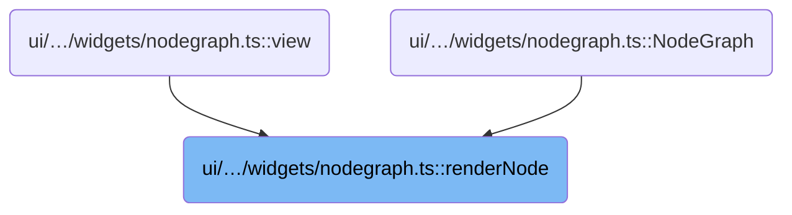

This document describes how the node graph interface renders nodes and ports, and enables users to interactively create or remove connections. User actions update the visual state, allowing for dynamic organization and manipulation of nodes.

```mermaid
flowchart TD
  node1["Rendering and Handling Node Interactions"]:::HeadingStyle
  click node1 goToHeading "Rendering and Handling Node Interactions"
  node1 --> node2["Port Rendering and Connection Handling"]:::HeadingStyle
  click node2 goToHeading "Port Rendering and Connection Handling"
  node2 --> node3["Removing Connections and Managing State"]:::HeadingStyle
  click node3 goToHeading "Removing Connections and Managing State"
  node3 --> node4["Reconnecting Ports After Removal"]:::HeadingStyle
  click node4 goToHeading "Reconnecting Ports After Removal"
  node4 --> node5["Setting Up Connection State"]:::HeadingStyle
  click node5 goToHeading "Setting Up Connection State"
  node5 --> node6["Handling Output Port Connections"]:::HeadingStyle
  click node6 goToHeading "Handling Output Port Connections"
  node6 --> node1

classDef HeadingStyle fill:#777777,stroke:#333,stroke-width:2px;

%% Swimm:
%% flowchart TD
%%   <SwmToken path="ui/src/widgets/nodegraph.ts" pos="30:8:8" line-data=" *   {id: &#39;node1&#39;, x: 50, y: 50, outputs: [{direction: &#39;right&#39;}]},">`node1`</SwmToken>["Rendering and Handling Node Interactions"]:::HeadingStyle
%%   click <SwmToken path="ui/src/widgets/nodegraph.ts" pos="30:8:8" line-data=" *   {id: &#39;node1&#39;, x: 50, y: 50, outputs: [{direction: &#39;right&#39;}]},">`node1`</SwmToken> goToHeading "Rendering and Handling Node Interactions"
%%   <SwmToken path="ui/src/widgets/nodegraph.ts" pos="30:8:8" line-data=" *   {id: &#39;node1&#39;, x: 50, y: 50, outputs: [{direction: &#39;right&#39;}]},">`node1`</SwmToken> --> <SwmToken path="ui/src/widgets/nodegraph.ts" pos="31:8:8" line-data=" *   {id: &#39;node2&#39;, x: 250, y: 50, inputs: [{direction: &#39;left&#39;}]},">`node2`</SwmToken>["Port Rendering and Connection Handling"]:::HeadingStyle
%%   click <SwmToken path="ui/src/widgets/nodegraph.ts" pos="31:8:8" line-data=" *   {id: &#39;node2&#39;, x: 250, y: 50, inputs: [{direction: &#39;left&#39;}]},">`node2`</SwmToken> goToHeading "Port Rendering and Connection Handling"
%%   <SwmToken path="ui/src/widgets/nodegraph.ts" pos="31:8:8" line-data=" *   {id: &#39;node2&#39;, x: 250, y: 50, inputs: [{direction: &#39;left&#39;}]},">`node2`</SwmToken> --> node3["Removing Connections and Managing State"]:::HeadingStyle
%%   click node3 goToHeading "Removing Connections and Managing State"
%%   node3 --> node4["Reconnecting Ports After Removal"]:::HeadingStyle
%%   click node4 goToHeading "Reconnecting Ports After Removal"
%%   node4 --> node5["Setting Up Connection State"]:::HeadingStyle
%%   click node5 goToHeading "Setting Up Connection State"
%%   node5 --> node6["Handling Output Port Connections"]:::HeadingStyle
%%   click node6 goToHeading "Handling Output Port Connections"
%%   node6 --> <SwmToken path="ui/src/widgets/nodegraph.ts" pos="30:8:8" line-data=" *   {id: &#39;node1&#39;, x: 50, y: 50, outputs: [{direction: &#39;right&#39;}]},">`node1`</SwmToken>
%% 
%% classDef HeadingStyle fill:#777777,stroke:#333,stroke-width:2px;
```



# Where is this flow used?

This flow is used multiple times in the codebase as represented in the following diagram:



# Rendering and Handling Node Interactions

```mermaid
%%{init: {"flowchart": {"defaultRenderer": "elk"}} }%%
flowchart TD
  node1["Render node and its ports"] --> node2{"User interacts with a port"}
  click node1 openCode "ui/src/widgets/nodegraph.ts:1318:1343"
  node2 -->|"Input port with existing connection"| node3["Removing Connections and Managing State"]
  click node2 openCode "ui/src/widgets/nodegraph.ts:1382:1394"
  
  node2 -->|"Input port without connection or output port"| node4["Determining Port Direction"]
  
  node4 --> node5{"Is node docked as child?"}
  click node5 openCode "ui/src/widgets/nodegraph.ts:1508:1535"
  node5 -->|"Yes"| node6["Prepare undock candidate"]
  click node6 openCode "ui/src/widgets/nodegraph.ts:1527:1534"
  node5 -->|"No"| node7["Select node"]
  click node7 openCode "ui/src/widgets/nodegraph.ts:1546:1549"

  subgraph loop1["Render each port for interaction"]
    node1
  end
classDef HeadingStyle fill:#777777,stroke:#333,stroke-width:2px;
click node3 goToHeading "Removing Connections and Managing State"
node3:::HeadingStyle
click node4 goToHeading "Calculating Port Position in Canvas Space"
node4:::HeadingStyle
click node4 goToHeading "Determining Port Direction"
node4:::HeadingStyle

%% Swimm:
%% %%{init: {"flowchart": {"defaultRenderer": "elk"}} }%%
%% flowchart TD
%%   <SwmToken path="ui/src/widgets/nodegraph.ts" pos="30:8:8" line-data=" *   {id: &#39;node1&#39;, x: 50, y: 50, outputs: [{direction: &#39;right&#39;}]},">`node1`</SwmToken>["Render node and its ports"] --> <SwmToken path="ui/src/widgets/nodegraph.ts" pos="31:8:8" line-data=" *   {id: &#39;node2&#39;, x: 250, y: 50, inputs: [{direction: &#39;left&#39;}]},">`node2`</SwmToken>{"User interacts with a port"}
%%   click <SwmToken path="ui/src/widgets/nodegraph.ts" pos="30:8:8" line-data=" *   {id: &#39;node1&#39;, x: 50, y: 50, outputs: [{direction: &#39;right&#39;}]},">`node1`</SwmToken> openCode "<SwmPath>[ui/…/widgets/nodegraph.ts](ui/src/widgets/nodegraph.ts)</SwmPath>:1318:1343"
%%   <SwmToken path="ui/src/widgets/nodegraph.ts" pos="31:8:8" line-data=" *   {id: &#39;node2&#39;, x: 250, y: 50, inputs: [{direction: &#39;left&#39;}]},">`node2`</SwmToken> -->|"Input port with existing connection"| node3["Removing Connections and Managing State"]
%%   click <SwmToken path="ui/src/widgets/nodegraph.ts" pos="31:8:8" line-data=" *   {id: &#39;node2&#39;, x: 250, y: 50, inputs: [{direction: &#39;left&#39;}]},">`node2`</SwmToken> openCode "<SwmPath>[ui/…/widgets/nodegraph.ts](ui/src/widgets/nodegraph.ts)</SwmPath>:1382:1394"
%%   
%%   <SwmToken path="ui/src/widgets/nodegraph.ts" pos="31:8:8" line-data=" *   {id: &#39;node2&#39;, x: 250, y: 50, inputs: [{direction: &#39;left&#39;}]},">`node2`</SwmToken> -->|"Input port without connection or output port"| node4["Determining Port Direction"]
%%   
%%   node4 --> node5{"Is node docked as child?"}
%%   click node5 openCode "<SwmPath>[ui/…/widgets/nodegraph.ts](ui/src/widgets/nodegraph.ts)</SwmPath>:1508:1535"
%%   node5 -->|"Yes"| node6["Prepare undock candidate"]
%%   click node6 openCode "<SwmPath>[ui/…/widgets/nodegraph.ts](ui/src/widgets/nodegraph.ts)</SwmPath>:1527:1534"
%%   node5 -->|"No"| node7["Select node"]
%%   click node7 openCode "<SwmPath>[ui/…/widgets/nodegraph.ts](ui/src/widgets/nodegraph.ts)</SwmPath>:1546:1549"
%% 
%%   subgraph loop1["Render each port for interaction"]
%%     <SwmToken path="ui/src/widgets/nodegraph.ts" pos="30:8:8" line-data=" *   {id: &#39;node1&#39;, x: 50, y: 50, outputs: [{direction: &#39;right&#39;}]},">`node1`</SwmToken>
%%   end
%% classDef HeadingStyle fill:#777777,stroke:#333,stroke-width:2px;
%% click node3 goToHeading "Removing Connections and Managing State"
%% node3:::HeadingStyle
%% click node4 goToHeading "Calculating Port Position in Canvas Space"
%% node4:::HeadingStyle
%% click node4 goToHeading "Determining Port Direction"
%% node4:::HeadingStyle
```



<SwmSnippet path="/ui/src/widgets/nodegraph.ts" line="1318">

---

In <SwmToken path="ui/src/widgets/nodegraph.ts" pos="1318:3:3" line-data="  function renderNode(">`renderNode`</SwmToken> we set up the node's properties, split its ports by direction, and prep the CSS classes for rendering. We also define the <SwmToken path="ui/src/widgets/nodegraph.ts" pos="1358:3:3" line-data="    const renderPort = (">`renderPort`</SwmToken> helper, which is key for handling port interactions. Next, we need to call into the demo logic (<SwmPath>[ui/…/demos/nodegraph_demo.ts](ui/src/plugins/dev.perfetto.WidgetsPage/demos/nodegraph_demo.ts)</SwmPath>) to handle connection removal, since that's where the state update and <SwmToken path="ui/src/plugins/dev.perfetto.WidgetsPage/demos/nodegraph_demo.ts" pos="88:19:21" line-data="// Store interface (only data that should be in undo/redo history)">`undo/redo`</SwmToken> logic lives.

```typescript
  function renderNode(
    node: Node | Omit<Node, 'x' | 'y'>,
    vnode: m.Vnode<NodeGraphAttrs>,
    options: {
      isDockedChild: boolean;
      hasDockedChild: boolean;
      isDockTarget: boolean;
      rootNode?: Node;
      multiselect: boolean;
    },
  ): m.Vnode {
    const {
      id,
      inputs = [],
      outputs = [],
      titleBar,
      content,
      hue,
      accentBar,
      contextMenuItems,
    } = node;
    const {isDockedChild, hasDockedChild, isDockTarget, rootNode, multiselect} =
      options;
    const {connections = [], onConnect, nodes = []} = vnode.attrs;

    // Separate ports by direction
    const topInputs = inputs.filter((p) => p.direction === 'top');
    const leftInputs = inputs.filter((p) => p.direction === 'left');
    const bottomOutputs = outputs.filter((p) => p.direction === 'bottom');
    const rightOutputs = outputs.filter((p) => p.direction === 'right');

    const classes = classNames(
      canvasState.selectedNodes.has(id) && 'pf-selected',
      isDockedChild && 'pf-docked-child',
      hasDockedChild && 'pf-has-docked-child',
      isDockTarget && 'pf-dock-target',
      accentBar && 'pf-node--has-accent-bar',
    );

    // Helper to render a port
    const renderPort = (
      port: NodePort,
      portIndex: number,
      portType: 'input' | 'output',
      forceConnected?: boolean,
    ) => {
      const portId = `${portType}-${portIndex}`;
      const cssClass = classNames(
        portType === 'input' ? 'pf-input' : 'pf-output',
        `pf-port-${port.direction}`,
        (forceConnected ||
          isPortConnected(id, portType, portIndex, connections)) &&
          'pf-connected',
        canvasState.connecting &&
          canvasState.connecting.nodeId === id &&
          canvasState.connecting.portIndex === portIndex &&
          canvasState.connecting.type === portType &&
          'pf-active',
        port.contextMenuItems !== undefined && 'pf-port--with-context-menu',
      );

      const portElement = m('.pf-port', {
        'data-port': portId,
        'className': cssClass,
        'onpointerdown': (e: PointerEvent) => {
          e.stopPropagation();
          if (portType === 'input') {
            // Input port - check for existing connection
            const existingConnIdx = connections.findIndex(
              (conn) => conn.toNode === id && conn.toPort === portIndex,
            );
            if (existingConnIdx !== -1) {
              const existingConn = connections[existingConnIdx];
              const {onConnectionRemove} = vnode.attrs;
              if (onConnectionRemove !== undefined) {
                onConnectionRemove(existingConnIdx);
              }
```

---

</SwmSnippet>

## Removing Connections and Managing State

<SwmSnippet path="/ui/src/plugins/dev.perfetto.WidgetsPage/demos/nodegraph_demo.ts" line="1140">

---

<SwmToken path="ui/src/plugins/dev.perfetto.WidgetsPage/demos/nodegraph_demo.ts" pos="1140:1:1" line-data="        onConnectionRemove: (index: number) =&gt; {">`onConnectionRemove`</SwmToken> removes a connection by index and triggers a state update. It assumes the index is valid.

```typescript
        onConnectionRemove: (index: number) => {
          console.log('onConnectionRemove:', index);
          updateStore((draft) => {
            draft.connections.splice(index, 1);
          });
        },
```

---

</SwmSnippet>

<SwmSnippet path="/ui/src/plugins/dev.perfetto.WidgetsPage/demos/nodegraph_demo.ts" line="476">

---

<SwmToken path="ui/src/plugins/dev.perfetto.WidgetsPage/demos/nodegraph_demo.ts" pos="476:3:3" line-data="  const updateStore = (updater: (draft: NodeGraphStore) =&gt; void) =&gt; {">`updateStore`</SwmToken> applies the state update immutably, manages <SwmToken path="ui/src/plugins/dev.perfetto.WidgetsPage/demos/nodegraph_demo.ts" pos="88:19:21" line-data="// Store interface (only data that should be in undo/redo history)">`undo/redo`</SwmToken> history (trimming future states and capping at 50), and triggers a UI redraw. This keeps the UI and state history in sync after any change.

```typescript
  const updateStore = (updater: (draft: NodeGraphStore) => void) => {
    // Apply the update
    const newStore = produce(store, updater);

    store = newStore;

    // Remove any future history if we're not at the end
    if (historyIndex < history.length - 1) {
      history.splice(historyIndex + 1);
    }

    // Add new state to history
    history.push(store);
    historyIndex = history.length - 1;

    // Limit history to prevent memory issues (keep last 50 states)
    if (history.length > 50) {
      history.shift();
      historyIndex--;
    }

    m.redraw();
  };
```

---

</SwmSnippet>

## Reconnecting Ports After Removal

<SwmSnippet path="/ui/src/widgets/nodegraph.ts" line="1395">

---

Back in <SwmToken path="ui/src/widgets/nodegraph.ts" pos="1318:3:3" line-data="  function renderNode(">`renderNode`</SwmToken>, after removing the connection, we fetch the position of the output port using <SwmToken path="ui/src/widgets/nodegraph.ts" pos="1395:7:7" line-data="              const outputPos = getPortPosition(">`getPortPosition`</SwmToken>. This lets us update the UI to show the connection starting from the right place.

```typescript
              const outputPos = getPortPosition(
                existingConn.fromNode,
                'output',
                existingConn.fromPort,
              );
```

---

</SwmSnippet>

## Calculating Port Position in Canvas Space

```mermaid
%%{init: {"flowchart": {"defaultRenderer": "elk"}} }%%
flowchart TD
  node1["Find port element for node, port type, and index"] --> node2{"Is port element found?"}
  click node1 openCode "ui/src/widgets/nodegraph.ts:891:896"
  node2 -->|"Yes"| node3{"Is node in a dock chain?"}
  click node2 openCode "ui/src/widgets/nodegraph.ts:898:900"
  node2 -->|"No"| node6["Return default position (0,0)"]
  click node6 openCode "ui/src/widgets/nodegraph.ts:945:946"
  node3 -->|"Yes"| node4["Calculate port position using dock chain container, port type/index, and zoom level"]
  click node4 openCode "ui/src/widgets/nodegraph.ts:910:920"
  node3 -->|"No"| node5["Calculate port position using node's own position, port type/index, and zoom level"]
  click node5 openCode "ui/src/widgets/nodegraph.ts:921:924"
  node4 --> node7["Return computed port position"]
  click node7 openCode "ui/src/widgets/nodegraph.ts:938:941"
  node5 --> node7
classDef HeadingStyle fill:#777777,stroke:#333,stroke-width:2px;

%% Swimm:
%% %%{init: {"flowchart": {"defaultRenderer": "elk"}} }%%
%% flowchart TD
%%   <SwmToken path="ui/src/widgets/nodegraph.ts" pos="30:8:8" line-data=" *   {id: &#39;node1&#39;, x: 50, y: 50, outputs: [{direction: &#39;right&#39;}]},">`node1`</SwmToken>["Find port element for node, port type, and index"] --> <SwmToken path="ui/src/widgets/nodegraph.ts" pos="31:8:8" line-data=" *   {id: &#39;node2&#39;, x: 250, y: 50, inputs: [{direction: &#39;left&#39;}]},">`node2`</SwmToken>{"Is port element found?"}
%%   click <SwmToken path="ui/src/widgets/nodegraph.ts" pos="30:8:8" line-data=" *   {id: &#39;node1&#39;, x: 50, y: 50, outputs: [{direction: &#39;right&#39;}]},">`node1`</SwmToken> openCode "<SwmPath>[ui/…/widgets/nodegraph.ts](ui/src/widgets/nodegraph.ts)</SwmPath>:891:896"
%%   <SwmToken path="ui/src/widgets/nodegraph.ts" pos="31:8:8" line-data=" *   {id: &#39;node2&#39;, x: 250, y: 50, inputs: [{direction: &#39;left&#39;}]},">`node2`</SwmToken> -->|"Yes"| node3{"Is node in a dock chain?"}
%%   click <SwmToken path="ui/src/widgets/nodegraph.ts" pos="31:8:8" line-data=" *   {id: &#39;node2&#39;, x: 250, y: 50, inputs: [{direction: &#39;left&#39;}]},">`node2`</SwmToken> openCode "<SwmPath>[ui/…/widgets/nodegraph.ts](ui/src/widgets/nodegraph.ts)</SwmPath>:898:900"
%%   <SwmToken path="ui/src/widgets/nodegraph.ts" pos="31:8:8" line-data=" *   {id: &#39;node2&#39;, x: 250, y: 50, inputs: [{direction: &#39;left&#39;}]},">`node2`</SwmToken> -->|"No"| node6["Return default position (0,0)"]
%%   click node6 openCode "<SwmPath>[ui/…/widgets/nodegraph.ts](ui/src/widgets/nodegraph.ts)</SwmPath>:945:946"
%%   node3 -->|"Yes"| node4["Calculate port position using dock chain container, port type/index, and zoom level"]
%%   click node4 openCode "<SwmPath>[ui/…/widgets/nodegraph.ts](ui/src/widgets/nodegraph.ts)</SwmPath>:910:920"
%%   node3 -->|"No"| node5["Calculate port position using node's own position, port type/index, and zoom level"]
%%   click node5 openCode "<SwmPath>[ui/…/widgets/nodegraph.ts](ui/src/widgets/nodegraph.ts)</SwmPath>:921:924"
%%   node4 --> node7["Return computed port position"]
%%   click node7 openCode "<SwmPath>[ui/…/widgets/nodegraph.ts](ui/src/widgets/nodegraph.ts)</SwmPath>:938:941"
%%   node5 --> node7
%% classDef HeadingStyle fill:#777777,stroke:#333,stroke-width:2px;
```



<SwmSnippet path="/ui/src/widgets/nodegraph.ts" line="884">

---

In <SwmToken path="ui/src/widgets/nodegraph.ts" pos="884:3:3" line-data="  function getPortPosition(">`getPortPosition`</SwmToken> we build a selector to find the port element, check if it's docked, and calculate its position in canvas space using bounding rects and zoom. We call into <SwmPath>[ui/…/widgets/popup.ts](ui/src/widgets/popup.ts)</SwmPath> next to get a custom bounding rect for offset calculations.

```typescript
  function getPortPosition(
    nodeId: string,
    portType: 'input' | 'output',
    portIndex: number,
  ): Position {
    // For port index 0 (top/bottom), data-port is on .pf-port itself
    // For port index 1+ (left/right), data-port is on .pf-port-row wrapper
    const selector =
      portIndex === 0
        ? `[data-node="${nodeId}"] .pf-port[data-port="${portType}-${portIndex}"]`
        : `[data-node="${nodeId}"] [data-port="${portType}-${portIndex}"] .pf-port`;

    const portElement = document.querySelector(selector);

    if (portElement) {
      const nodeElement = portElement.closest('.pf-node') as HTMLElement | null;
      if (nodeElement !== null) {
        // Check if node is in a dock chain (flexbox positioning)
        const chainContainer = nodeElement.closest(
          '.pf-node-wrapper',
        ) as HTMLElement | null;

        let nodeLeft: number;
        let nodeTop: number;

        if (chainContainer) {
          // Node is in a dock chain - use container's position
          nodeLeft = parseFloat(chainContainer.style.left) || 0;
          nodeTop = parseFloat(chainContainer.style.top) || 0;

          // Add offset of node within the chain
          const chainRect = chainContainer.getBoundingClientRect();
          const nodeRect = nodeElement.getBoundingClientRect();
          const offsetY = (nodeRect.top - chainRect.top) / canvasState.zoom;

          nodeTop += offsetY;
        } else {
          // Standalone node - use its position directly
          nodeLeft = parseFloat(nodeElement.style.left) || 0;
          nodeTop = parseFloat(nodeElement.style.top) || 0;
        }

        // Get port's position relative to the node
        const portRect = portElement.getBoundingClientRect();
        const nodeRect = nodeElement.getBoundingClientRect();

```

---

</SwmSnippet>

<SwmSnippet path="/ui/src/widgets/popup.ts" line="327">

---

<SwmToken path="ui/src/widgets/popup.ts" pos="327:1:1" line-data="      getBoundingClientRect: () =&gt; {">`getBoundingClientRect`</SwmToken> in <SwmPath>[ui/…/widgets/popup.ts](ui/src/widgets/popup.ts)</SwmPath> returns a custom rect at a specific offset from the trigger, with width and height set to 0. This is for precise popup positioning, not for measuring element size.

```typescript
      getBoundingClientRect: () => {
        const triggerRect = trigger.getBoundingClientRect();
        const absoluteX = triggerRect.left + relativeX;
        const absoluteY = triggerRect.top + relativeY;

        return {
          width: 0,
          height: 0,
          top: absoluteY,
          right: absoluteX,
          bottom: absoluteY,
          left: absoluteX,
          x: absoluteX,
          y: absoluteY,
          toJSON: () => {},
        };
      },
```

---

</SwmSnippet>

<SwmSnippet path="/ui/src/widgets/nodegraph.ts" line="930">

---

After getting the custom bounding rect from <SwmPath>[ui/…/widgets/popup.ts](ui/src/widgets/popup.ts)</SwmPath>, <SwmToken path="ui/src/widgets/nodegraph.ts" pos="884:3:3" line-data="  function getPortPosition(">`getPortPosition`</SwmToken> finishes by calculating the port's canvas coordinates, factoring in zoom and node/container offsets. If the port isn't found, it returns {x:0, y:0}.

```typescript
        // Calculate offset in screen space, then divide by zoom to get canvas content space
        const portX =
          (portRect.left - nodeRect.left + portRect.width / 2) /
          canvasState.zoom;
        const portY =
          (portRect.top - nodeRect.top + portRect.height / 2) /
          canvasState.zoom;

        return {
          x: nodeLeft + portX,
          y: nodeTop + portY,
        };
      }
    }

    return {x: 0, y: 0};
  }
```

---

</SwmSnippet>

## Setting Up Connection State

<SwmSnippet path="/ui/src/widgets/nodegraph.ts" line="1400">

---

Back in <SwmToken path="ui/src/widgets/nodegraph.ts" pos="1318:3:3" line-data="  function renderNode(">`renderNode`</SwmToken>, after getting the port position, we update the connecting state and call <SwmToken path="ui/src/widgets/nodegraph.ts" pos="1404:4:4" line-data="                portType: getPortType(">`getPortType`</SwmToken> to figure out the port's direction. This is needed for correct connection rendering.

```typescript
              canvasState.connecting = {
                nodeId: existingConn.fromNode,
                portIndex: existingConn.fromPort,
                type: 'output',
                portType: getPortType(
                  existingConn.fromNode,
                  'output',
                  existingConn.fromPort,
                  nodes,
                ),
                x: 0,
                y: 0,
                transformedX: outputPos.x,
                transformedY: outputPos.y,
              };
```

---

</SwmSnippet>

## Determining Port Direction

```mermaid
%%{init: {"flowchart": {"defaultRenderer": "elk"}} }%%
flowchart TD
  node1["Receive node info (nodeId, portType, portIndex)"] --> node2{"Is node in main node list?"}
  click node1 openCode "ui/src/widgets/nodegraph.ts:611:616"
  click node2 openCode "ui/src/widgets/nodegraph.ts:618:620"
  node2 -->|"Yes"| node3["Use found node"]
  click node3 openCode "ui/src/widgets/nodegraph.ts:618:620"
  node2 -->|"No"| loop1
  subgraph loop1["For each node, search its chained nodes"]
    node4["Iterate through each node's next chain"] --> node5{"Is node found in chain?"}
    click node4 openCode "ui/src/widgets/nodegraph.ts:624:634"
    click node5 openCode "ui/src/widgets/nodegraph.ts:627:634"
    node5 -->|"Yes"| node3
    node5 -->|"No"| node6["Return default direction for portType"]
    click node6 openCode "ui/src/widgets/nodegraph.ts:642:643"
  end
  node3 --> node7{"Does requested port exist at index?"}
  click node7 openCode "ui/src/widgets/nodegraph.ts:640:641"
  node7 -->|"Yes"| node8["Return port direction ('top', 'bottom', 'left', 'right') for UI placement"]
  click node8 openCode "ui/src/widgets/nodegraph.ts:645:646"
  node7 -->|"No"| node6["Return default direction: 'left' for input, 'right' for output"]

classDef HeadingStyle fill:#777777,stroke:#333,stroke-width:2px;

%% Swimm:
%% %%{init: {"flowchart": {"defaultRenderer": "elk"}} }%%
%% flowchart TD
%%   <SwmToken path="ui/src/widgets/nodegraph.ts" pos="30:8:8" line-data=" *   {id: &#39;node1&#39;, x: 50, y: 50, outputs: [{direction: &#39;right&#39;}]},">`node1`</SwmToken>["Receive node info (<SwmToken path="ui/src/widgets/nodegraph.ts" pos="612:1:1" line-data="    nodeId: string,">`nodeId`</SwmToken>, <SwmToken path="ui/src/widgets/nodegraph.ts" pos="613:1:1" line-data="    portType: &#39;input&#39; | &#39;output&#39;,">`portType`</SwmToken>, <SwmToken path="ui/src/widgets/nodegraph.ts" pos="614:1:1" line-data="    portIndex: number,">`portIndex`</SwmToken>)"] --> <SwmToken path="ui/src/widgets/nodegraph.ts" pos="31:8:8" line-data=" *   {id: &#39;node2&#39;, x: 250, y: 50, inputs: [{direction: &#39;left&#39;}]},">`node2`</SwmToken>{"Is node in main node list?"}
%%   click <SwmToken path="ui/src/widgets/nodegraph.ts" pos="30:8:8" line-data=" *   {id: &#39;node1&#39;, x: 50, y: 50, outputs: [{direction: &#39;right&#39;}]},">`node1`</SwmToken> openCode "<SwmPath>[ui/…/widgets/nodegraph.ts](ui/src/widgets/nodegraph.ts)</SwmPath>:611:616"
%%   click <SwmToken path="ui/src/widgets/nodegraph.ts" pos="31:8:8" line-data=" *   {id: &#39;node2&#39;, x: 250, y: 50, inputs: [{direction: &#39;left&#39;}]},">`node2`</SwmToken> openCode "<SwmPath>[ui/…/widgets/nodegraph.ts](ui/src/widgets/nodegraph.ts)</SwmPath>:618:620"
%%   <SwmToken path="ui/src/widgets/nodegraph.ts" pos="31:8:8" line-data=" *   {id: &#39;node2&#39;, x: 250, y: 50, inputs: [{direction: &#39;left&#39;}]},">`node2`</SwmToken> -->|"Yes"| node3["Use found node"]
%%   click node3 openCode "<SwmPath>[ui/…/widgets/nodegraph.ts](ui/src/widgets/nodegraph.ts)</SwmPath>:618:620"
%%   <SwmToken path="ui/src/widgets/nodegraph.ts" pos="31:8:8" line-data=" *   {id: &#39;node2&#39;, x: 250, y: 50, inputs: [{direction: &#39;left&#39;}]},">`node2`</SwmToken> -->|"No"| loop1
%%   subgraph loop1["For each node, search its chained nodes"]
%%     node4["Iterate through each node's next chain"] --> node5{"Is node found in chain?"}
%%     click node4 openCode "<SwmPath>[ui/…/widgets/nodegraph.ts](ui/src/widgets/nodegraph.ts)</SwmPath>:624:634"
%%     click node5 openCode "<SwmPath>[ui/…/widgets/nodegraph.ts](ui/src/widgets/nodegraph.ts)</SwmPath>:627:634"
%%     node5 -->|"Yes"| node3
%%     node5 -->|"No"| node6["Return default direction for <SwmToken path="ui/src/widgets/nodegraph.ts" pos="613:1:1" line-data="    portType: &#39;input&#39; | &#39;output&#39;,">`portType`</SwmToken>"]
%%     click node6 openCode "<SwmPath>[ui/…/widgets/nodegraph.ts](ui/src/widgets/nodegraph.ts)</SwmPath>:642:643"
%%   end
%%   node3 --> node7{"Does requested port exist at index?"}
%%   click node7 openCode "<SwmPath>[ui/…/widgets/nodegraph.ts](ui/src/widgets/nodegraph.ts)</SwmPath>:640:641"
%%   node7 -->|"Yes"| node8["Return port direction ('top', 'bottom', 'left', 'right') for UI placement"]
%%   click node8 openCode "<SwmPath>[ui/…/widgets/nodegraph.ts](ui/src/widgets/nodegraph.ts)</SwmPath>:645:646"
%%   node7 -->|"No"| node6["Return default direction: 'left' for input, 'right' for output"]
%% 
%% classDef HeadingStyle fill:#777777,stroke:#333,stroke-width:2px;
```



<SwmSnippet path="/ui/src/widgets/nodegraph.ts" line="611">

---

In <SwmToken path="ui/src/widgets/nodegraph.ts" pos="611:3:3" line-data="  function getPortType(">`getPortType`</SwmToken> we look up the node by id, first in the main array, then in any 'next' chains. This handles cases where nodes are docked or chained, so we always get the right port info.

```typescript
  function getPortType(
    nodeId: string,
    portType: 'input' | 'output',
    portIndex: number,
    nodes: ReadonlyArray<Node>,
  ): 'top' | 'bottom' | 'left' | 'right' {
    // Search in main nodes array
    let node: Node | Omit<Node, 'x' | 'y'> | undefined = nodes.find(
      (n) => n.id === nodeId,
    );

    // If not found, search in the next chains of all nodes
    if (!node) {
      for (const rootNode of nodes) {
        let current = rootNode.next;
        while (current) {
          if (current.id === nodeId) {
            node = current;
            break;
          }
          current = current.next;
        }
        if (node) break;
      }
```

---

</SwmSnippet>

<SwmSnippet path="/ui/src/widgets/nodegraph.ts" line="639">

---

If <SwmToken path="ui/src/widgets/nodegraph.ts" pos="611:3:3" line-data="  function getPortType(">`getPortType`</SwmToken> can't find the node or port, it returns 'left' for inputs and 'right' for outputs as a fallback. Otherwise, it returns the actual direction from the port data.

```typescript
    // Get the port from the node
    const ports = portType === 'input' ? node.inputs : node.outputs;
    if (!ports || portIndex >= ports.length) {
      return portType === 'input' ? 'left' : 'right';
    }

    return ports[portIndex].direction;
  }
```

---

</SwmSnippet>

## Handling Output Port Connections

```mermaid
%%{init: {"flowchart": {"defaultRenderer": "elk"}} }%%
flowchart TD
  node1["Render node container"] --> node2{"Does node have title bar?"}
  click node1 openCode "ui/src/widgets/nodegraph.ts:1477:1484"
  node2 -->|"Yes"| node3["Show title bar and context menu"]
  click node2 openCode "ui/src/widgets/nodegraph.ts:1560:1574"
  node2 -->|"No"| node4{"Does node have context menu items?"}
  click node3 openCode "ui/src/widgets/nodegraph.ts:1560:1574"
  node4 -->|"Yes"| node5["Show context menu button"]
  click node4 openCode "ui/src/widgets/nodegraph.ts:1577:1591"
  node4 -->|"No"| node6["Proceed without context menu"]
  click node5 openCode "ui/src/widgets/nodegraph.ts:1577:1591"
  node3 --> node7["Render node body"]
  node5 --> node7
  node6 --> node7
  click node7 openCode "ui/src/widgets/nodegraph.ts:1594:1641"
  subgraph loop1["For each port type (top, left, right, bottom)"]
    node7 --> node8["Render ports for user interaction"]
    click node8 openCode "ui/src/widgets/nodegraph.ts:1594:1641"
  end
  node8 --> node9{"Is user interacting with port?"}
  click node9 openCode "ui/src/widgets/nodegraph.ts:1415:1464"
  node9 -->|"Input port"| node10["Handle input port connection"]
  click node10 openCode "ui/src/widgets/nodegraph.ts:1434:1459"
  node9 -->|"Output port"| node11["Handle output port connection"]
  click node11 openCode "ui/src/widgets/nodegraph.ts:1418:1430"
  node10 --> node12{"Is node a docked child?"}
  node11 --> node12
  click node12 openCode "ui/src/widgets/nodegraph.ts:1508:1535"
  node12 -->|"Docked child"| node13["Prepare for undocking"]
  click node13 openCode "ui/src/widgets/nodegraph.ts:1512:1534"
  node12 -->|"Root node"| node14["Prepare for dragging"]
  click node14 openCode "ui/src/widgets/nodegraph.ts:1537:1544"
  node13 --> node15{"Is multi-selection enabled and modifier key pressed?"}
  node14 --> node15
  click node15 openCode "ui/src/widgets/nodegraph.ts:1491:1506"
  node15 -->|"Yes"| node16["Toggle node selection"]
  click node16 openCode "ui/src/widgets/nodegraph.ts:1494:1504"
  node15 -->|"No"| node17["Select node"]
  click node17 openCode "ui/src/widgets/nodegraph.ts:1546:1549"
  node16 --> node18["Finish rendering node"]
  node17 --> node18["Finish rendering node"]
  click node18 openCode "ui/src/widgets/nodegraph.ts:1642:1643"

classDef HeadingStyle fill:#777777,stroke:#333,stroke-width:2px;

%% Swimm:
%% %%{init: {"flowchart": {"defaultRenderer": "elk"}} }%%
%% flowchart TD
%%   <SwmToken path="ui/src/widgets/nodegraph.ts" pos="30:8:8" line-data=" *   {id: &#39;node1&#39;, x: 50, y: 50, outputs: [{direction: &#39;right&#39;}]},">`node1`</SwmToken>["Render node container"] --> <SwmToken path="ui/src/widgets/nodegraph.ts" pos="31:8:8" line-data=" *   {id: &#39;node2&#39;, x: 250, y: 50, inputs: [{direction: &#39;left&#39;}]},">`node2`</SwmToken>{"Does node have title bar?"}
%%   click <SwmToken path="ui/src/widgets/nodegraph.ts" pos="30:8:8" line-data=" *   {id: &#39;node1&#39;, x: 50, y: 50, outputs: [{direction: &#39;right&#39;}]},">`node1`</SwmToken> openCode "<SwmPath>[ui/…/widgets/nodegraph.ts](ui/src/widgets/nodegraph.ts)</SwmPath>:1477:1484"
%%   <SwmToken path="ui/src/widgets/nodegraph.ts" pos="31:8:8" line-data=" *   {id: &#39;node2&#39;, x: 250, y: 50, inputs: [{direction: &#39;left&#39;}]},">`node2`</SwmToken> -->|"Yes"| node3["Show title bar and context menu"]
%%   click <SwmToken path="ui/src/widgets/nodegraph.ts" pos="31:8:8" line-data=" *   {id: &#39;node2&#39;, x: 250, y: 50, inputs: [{direction: &#39;left&#39;}]},">`node2`</SwmToken> openCode "<SwmPath>[ui/…/widgets/nodegraph.ts](ui/src/widgets/nodegraph.ts)</SwmPath>:1560:1574"
%%   <SwmToken path="ui/src/widgets/nodegraph.ts" pos="31:8:8" line-data=" *   {id: &#39;node2&#39;, x: 250, y: 50, inputs: [{direction: &#39;left&#39;}]},">`node2`</SwmToken> -->|"No"| node4{"Does node have context menu items?"}
%%   click node3 openCode "<SwmPath>[ui/…/widgets/nodegraph.ts](ui/src/widgets/nodegraph.ts)</SwmPath>:1560:1574"
%%   node4 -->|"Yes"| node5["Show context menu button"]
%%   click node4 openCode "<SwmPath>[ui/…/widgets/nodegraph.ts](ui/src/widgets/nodegraph.ts)</SwmPath>:1577:1591"
%%   node4 -->|"No"| node6["Proceed without context menu"]
%%   click node5 openCode "<SwmPath>[ui/…/widgets/nodegraph.ts](ui/src/widgets/nodegraph.ts)</SwmPath>:1577:1591"
%%   node3 --> node7["Render node body"]
%%   node5 --> node7
%%   node6 --> node7
%%   click node7 openCode "<SwmPath>[ui/…/widgets/nodegraph.ts](ui/src/widgets/nodegraph.ts)</SwmPath>:1594:1641"
%%   subgraph loop1["For each port type (top, left, right, bottom)"]
%%     node7 --> node8["Render ports for user interaction"]
%%     click node8 openCode "<SwmPath>[ui/…/widgets/nodegraph.ts](ui/src/widgets/nodegraph.ts)</SwmPath>:1594:1641"
%%   end
%%   node8 --> node9{"Is user interacting with port?"}
%%   click node9 openCode "<SwmPath>[ui/…/widgets/nodegraph.ts](ui/src/widgets/nodegraph.ts)</SwmPath>:1415:1464"
%%   node9 -->|"Input port"| node10["Handle input port connection"]
%%   click node10 openCode "<SwmPath>[ui/…/widgets/nodegraph.ts](ui/src/widgets/nodegraph.ts)</SwmPath>:1434:1459"
%%   node9 -->|"Output port"| node11["Handle output port connection"]
%%   click node11 openCode "<SwmPath>[ui/…/widgets/nodegraph.ts](ui/src/widgets/nodegraph.ts)</SwmPath>:1418:1430"
%%   node10 --> node12{"Is node a docked child?"}
%%   node11 --> node12
%%   click node12 openCode "<SwmPath>[ui/…/widgets/nodegraph.ts](ui/src/widgets/nodegraph.ts)</SwmPath>:1508:1535"
%%   node12 -->|"Docked child"| node13["Prepare for undocking"]
%%   click node13 openCode "<SwmPath>[ui/…/widgets/nodegraph.ts](ui/src/widgets/nodegraph.ts)</SwmPath>:1512:1534"
%%   node12 -->|"Root node"| node14["Prepare for dragging"]
%%   click node14 openCode "<SwmPath>[ui/…/widgets/nodegraph.ts](ui/src/widgets/nodegraph.ts)</SwmPath>:1537:1544"
%%   node13 --> node15{"Is <SwmToken path="ui/src/widgets/nodegraph.ts" pos="1491:5:7" line-data="          // Handle multi-selection with Shift or Cmd/Ctrl (only if multiselect is enabled)">`multi-selection`</SwmToken> enabled and modifier key pressed?"}
%%   node14 --> node15
%%   click node15 openCode "<SwmPath>[ui/…/widgets/nodegraph.ts](ui/src/widgets/nodegraph.ts)</SwmPath>:1491:1506"
%%   node15 -->|"Yes"| node16["Toggle node selection"]
%%   click node16 openCode "<SwmPath>[ui/…/widgets/nodegraph.ts](ui/src/widgets/nodegraph.ts)</SwmPath>:1494:1504"
%%   node15 -->|"No"| node17["Select node"]
%%   click node17 openCode "<SwmPath>[ui/…/widgets/nodegraph.ts](ui/src/widgets/nodegraph.ts)</SwmPath>:1546:1549"
%%   node16 --> node18["Finish rendering node"]
%%   node17 --> node18["Finish rendering node"]
%%   click node18 openCode "<SwmPath>[ui/…/widgets/nodegraph.ts](ui/src/widgets/nodegraph.ts)</SwmPath>:1642:1643"
%% 
%% classDef HeadingStyle fill:#777777,stroke:#333,stroke-width:2px;
```



<SwmSnippet path="/ui/src/widgets/nodegraph.ts" line="1415">

---

Back in <SwmToken path="ui/src/widgets/nodegraph.ts" pos="1318:3:3" line-data="  function renderNode(">`renderNode`</SwmToken>, after getting the port type, we call <SwmToken path="ui/src/widgets/nodegraph.ts" pos="1419:7:7" line-data="            const portPos = getPortPosition(id, portType, portIndex);">`getPortPosition`</SwmToken> again for output ports to get their position for the new connection state.

```typescript
              m.redraw();
            }
          } else {
            // Output port - start connection
            const portPos = getPortPosition(id, portType, portIndex);
```

---

</SwmSnippet>

<SwmSnippet path="/ui/src/widgets/nodegraph.ts" line="1420">

---

After getting the port position in <SwmToken path="ui/src/widgets/nodegraph.ts" pos="1318:3:3" line-data="  function renderNode(">`renderNode`</SwmToken>, we update the connecting state with all the details for the new connection. The next step is to handle pointer up events, which may trigger connection creation or removal via the demo logic.

```typescript
            canvasState.connecting = {
              nodeId: id,
              portIndex,
              type: portType,
              portType: port.direction,
              x: 0,
              y: 0,
              transformedX: portPos.x,
              transformedY: portPos.y,
            };
          }
        },
        'onpointerup': (e: PointerEvent) => {
          e.stopPropagation();
          if (portType === 'input') {
            if (
              canvasState.connecting &&
              canvasState.connecting.type === 'output'
            ) {
              // Input port receiving connection
              const existingConnIdx = connections.findIndex(
                (conn) => conn.toNode === id && conn.toPort === portIndex,
              );
              if (existingConnIdx !== -1) {
                const {onConnectionRemove} = vnode.attrs;
                if (onConnectionRemove !== undefined) {
                  onConnectionRemove(existingConnIdx);
                }
              }
```

---

</SwmSnippet>

<SwmSnippet path="/ui/src/widgets/nodegraph.ts" line="1449">

---

Back in <SwmToken path="ui/src/widgets/nodegraph.ts" pos="1318:3:3" line-data="  function renderNode(">`renderNode`</SwmToken>, after possibly removing an existing connection, we create a new connection object and call <SwmToken path="ui/src/widgets/nodegraph.ts" pos="1455:4:4" line-data="              if (onConnect !== undefined) {">`onConnect`</SwmToken> if defined. Then we clear the connecting state.

```typescript
              const connection = {
                fromNode: canvasState.connecting.nodeId,
                fromPort: canvasState.connecting.portIndex,
                toNode: id,
                toPort: portIndex,
              };
              if (onConnect !== undefined) {
                onConnect(connection);
              }
              canvasState.connecting = null;
            }
          } else if (portType === 'output') {
            // Clear connecting state if releasing on output port without completing connection
            canvasState.connecting = null;
          }
        },
      });

      // Wrap with PopupMenu if contextMenuItems exist
      if (port.contextMenuItems !== undefined) {
        return m(PopupMenu, {trigger: portElement}, port.contextMenuItems);
      }
      return portElement;
    };

    const style = hue !== undefined ? {'--pf-node-hue': `${hue}`} : undefined;

    return m(
      '.pf-node',
      {
        'key': id,
        'data-node': id,
        'class': classes,
        'style': {
          ...style,
        },
        'onpointerdown': (e: PointerEvent) => {
          if ((e.target as HTMLElement).closest('.pf-port')) {
            return;
          }
          e.stopPropagation();

          // Handle multi-selection with Shift or Cmd/Ctrl (only if multiselect is enabled)
          if (multiselect && (e.shiftKey || e.metaKey || e.ctrlKey)) {
            // Toggle selection
            if (canvasState.selectedNodes.has(id)) {
              const {onNodeRemoveFromSelection} = vnode.attrs;
              if (onNodeRemoveFromSelection !== undefined) {
                onNodeRemoveFromSelection(id);
              }
            } else {
              const {onNodeAddToSelection} = vnode.attrs;
              if (onNodeAddToSelection !== undefined) {
                onNodeAddToSelection(id);
              }
            }
            return;
          }

          // Check if this is a chained node (not root)
          if (isDockedChild && rootNode) {
            // Don't undock immediately - wait for drag threshold
            // Calculate current render position
            let yOffset = rootNode.y;
            const chainArr = getChain(rootNode);
            for (const cn of chainArr) {
              if (cn.id === id) break;
              yOffset += getNodeDimensions(cn.id).height;
            }
```

---

</SwmSnippet>

<SwmSnippet path="/ui/src/widgets/nodegraph.ts" line="1519">

---

Here we walk the chain to find the parent node for undocking logic. This ties into the drag/undock flow that follows pointer down on a docked child.

```typescript
            // Find parent node in chain
            let parentId = rootNode.id;
            let curr = rootNode.next;
            while (curr && curr.id !== id) {
              parentId = curr.id;
              curr = curr.next;
            }
```

---

</SwmSnippet>

<SwmSnippet path="/ui/src/widgets/nodegraph.ts" line="1527">

---

We render each port with <SwmToken path="ui/src/widgets/nodegraph.ts" pos="1596:3:3" line-data="          return renderPort(port, portIndex, &#39;input&#39;);">`renderPort`</SwmToken> to handle its UI and events.

```typescript
            // Store undock candidate - will undock if dragged beyond threshold
            canvasState.undockCandidate = {
              nodeId: id,
              parentId: parentId,
              startX: e.clientX,
              startY: e.clientY,
              renderY: yOffset,
            };
          }

          canvasState.draggedNode = id;

          // Store initial drag position for batching
          // Check if node has x,y properties (root nodes) vs docked children (no x,y)
          if ('x' in node && 'y' in node) {
            dragStartPosition = {nodeId: id, x: node.x, y: node.y};
            currentDragPosition = {x: node.x, y: node.y};
          }

          const {onNodeSelect} = vnode.attrs;
          if (onNodeSelect !== undefined) {
            onNodeSelect(id);
          }

          const rect = (e.currentTarget as HTMLElement).getBoundingClientRect();
          canvasState.dragOffset = {
            x: e.clientX - rect.left,
            y: e.clientY - rect.top,
          };
        },
      },
      [
        // Render node title if it exists
        titleBar !== undefined &&
          m('.pf-node-header', [
            m('.pf-node-title', titleBar.title),
            contextMenuItems !== undefined &&
              m(
                PopupMenu,
                {
                  trigger: m(Button, {
                    rounded: true,
                    icon: Icons.ContextMenuAlt,
                  }),
                },
                contextMenuItems,
              ),
          ]),

        // Context menu button for nodes without titlebar
        titleBar === undefined &&
          contextMenuItems !== undefined &&
          m(
            '.pf-node-context-menu',
            m(
              PopupMenu,
              {
                trigger: m(Button, {
                  rounded: true,
                  icon: Icons.ContextMenuAlt,
                }),
              },
              contextMenuItems,
            ),
          ),

        // Top input ports (if not docked child)
        topInputs.map((port) => {
          const portIndex = inputs.indexOf(port);
          return renderPort(port, portIndex, 'input');
        }),

        m('.pf-node-body', [
          content !== undefined &&
            m(
              '.pf-node-content',
              {
                onkeydown: (e: KeyboardEvent) => {
                  e.stopPropagation();
                },
              },
              content,
            ),

          // Left input ports
          leftInputs.map((port) => {
            const portIndex = inputs.indexOf(port);
            return m(
              '.pf-port-row.pf-port-input',
              {
                'data-port': `input-${portIndex}`,
              },
              [renderPort(port, portIndex, 'input'), port.content],
            );
          }),

          // Right output ports
          rightOutputs.map((port) => {
            const portIndex = outputs.indexOf(port);
            return m(
              '.pf-port-row.pf-port-output',
              {
                'data-port': `output-${portIndex}`,
              },
              [port.content, renderPort(port, portIndex, 'output')],
            );
          }),
        ]),

        // Bottom output ports (if no docked child below)
        bottomOutputs.map((port) => {
          const portIndex = outputs.indexOf(port);
          return renderPort(port, portIndex, 'output');
        }),
      ],
    );
  }
```

---

</SwmSnippet>

# Port Rendering and Connection Handling

```mermaid
%%{init: {"flowchart": {"defaultRenderer": "elk"}} }%%
flowchart TD
  node1["Render port element"] --> node2{"Port type: input or output?"}
  click node1 openCode "ui/src/widgets/nodegraph.ts:1358:1379"
  node2 -->|"Input"| node3{"User action: Remove or create connection?"}
  click node2 openCode "ui/src/widgets/nodegraph.ts:1364:1377"
  node2 -->|"Output"| node6["User starts new connection"]
  click node6 openCode "ui/src/widgets/nodegraph.ts:1418:1430"
  node3 -->|"Remove"| node4["Remove existing connection and reset state"]
  click node4 openCode "ui/src/widgets/nodegraph.ts:1386:1394"
  node3 -->|"Create"| node5["Create new connection and reset state"]
  click node5 openCode "ui/src/widgets/nodegraph.ts:1449:1458"
  node4 --> node7{"Context menu?"}
  node5 --> node7
  node6 --> node7
  node7 -->|"Yes"| node8["Wrap with context menu"]
  click node8 openCode "ui/src/widgets/nodegraph.ts:1468:1470"
  node7 -->|"No"| node9["Return port element"]
  click node9 openCode "ui/src/widgets/nodegraph.ts:1471:1472"
classDef HeadingStyle fill:#777777,stroke:#333,stroke-width:2px;

%% Swimm:
%% %%{init: {"flowchart": {"defaultRenderer": "elk"}} }%%
%% flowchart TD
%%   <SwmToken path="ui/src/widgets/nodegraph.ts" pos="30:8:8" line-data=" *   {id: &#39;node1&#39;, x: 50, y: 50, outputs: [{direction: &#39;right&#39;}]},">`node1`</SwmToken>["Render port element"] --> <SwmToken path="ui/src/widgets/nodegraph.ts" pos="31:8:8" line-data=" *   {id: &#39;node2&#39;, x: 250, y: 50, inputs: [{direction: &#39;left&#39;}]},">`node2`</SwmToken>{"Port type: input or output?"}
%%   click <SwmToken path="ui/src/widgets/nodegraph.ts" pos="30:8:8" line-data=" *   {id: &#39;node1&#39;, x: 50, y: 50, outputs: [{direction: &#39;right&#39;}]},">`node1`</SwmToken> openCode "<SwmPath>[ui/…/widgets/nodegraph.ts](ui/src/widgets/nodegraph.ts)</SwmPath>:1358:1379"
%%   <SwmToken path="ui/src/widgets/nodegraph.ts" pos="31:8:8" line-data=" *   {id: &#39;node2&#39;, x: 250, y: 50, inputs: [{direction: &#39;left&#39;}]},">`node2`</SwmToken> -->|"Input"| node3{"User action: Remove or create connection?"}
%%   click <SwmToken path="ui/src/widgets/nodegraph.ts" pos="31:8:8" line-data=" *   {id: &#39;node2&#39;, x: 250, y: 50, inputs: [{direction: &#39;left&#39;}]},">`node2`</SwmToken> openCode "<SwmPath>[ui/…/widgets/nodegraph.ts](ui/src/widgets/nodegraph.ts)</SwmPath>:1364:1377"
%%   <SwmToken path="ui/src/widgets/nodegraph.ts" pos="31:8:8" line-data=" *   {id: &#39;node2&#39;, x: 250, y: 50, inputs: [{direction: &#39;left&#39;}]},">`node2`</SwmToken> -->|"Output"| node6["User starts new connection"]
%%   click node6 openCode "<SwmPath>[ui/…/widgets/nodegraph.ts](ui/src/widgets/nodegraph.ts)</SwmPath>:1418:1430"
%%   node3 -->|"Remove"| node4["Remove existing connection and reset state"]
%%   click node4 openCode "<SwmPath>[ui/…/widgets/nodegraph.ts](ui/src/widgets/nodegraph.ts)</SwmPath>:1386:1394"
%%   node3 -->|"Create"| node5["Create new connection and reset state"]
%%   click node5 openCode "<SwmPath>[ui/…/widgets/nodegraph.ts](ui/src/widgets/nodegraph.ts)</SwmPath>:1449:1458"
%%   node4 --> node7{"Context menu?"}
%%   node5 --> node7
%%   node6 --> node7
%%   node7 -->|"Yes"| node8["Wrap with context menu"]
%%   click node8 openCode "<SwmPath>[ui/…/widgets/nodegraph.ts](ui/src/widgets/nodegraph.ts)</SwmPath>:1468:1470"
%%   node7 -->|"No"| node9["Return port element"]
%%   click node9 openCode "<SwmPath>[ui/…/widgets/nodegraph.ts](ui/src/widgets/nodegraph.ts)</SwmPath>:1471:1472"
%% classDef HeadingStyle fill:#777777,stroke:#333,stroke-width:2px;
```



<SwmSnippet path="/ui/src/widgets/nodegraph.ts" line="1358">

---

In <SwmToken path="ui/src/widgets/nodegraph.ts" pos="1358:3:3" line-data="    const renderPort = (">`renderPort`</SwmToken> we render the port UI, set up dynamic classes, and attach pointer event handlers. On pointer down, we may remove an existing connection and call into the demo logic to update state/history.

```typescript
    const renderPort = (
      port: NodePort,
      portIndex: number,
      portType: 'input' | 'output',
      forceConnected?: boolean,
    ) => {
      const portId = `${portType}-${portIndex}`;
      const cssClass = classNames(
        portType === 'input' ? 'pf-input' : 'pf-output',
        `pf-port-${port.direction}`,
        (forceConnected ||
          isPortConnected(id, portType, portIndex, connections)) &&
          'pf-connected',
        canvasState.connecting &&
          canvasState.connecting.nodeId === id &&
          canvasState.connecting.portIndex === portIndex &&
          canvasState.connecting.type === portType &&
          'pf-active',
        port.contextMenuItems !== undefined && 'pf-port--with-context-menu',
      );

      const portElement = m('.pf-port', {
        'data-port': portId,
        'className': cssClass,
        'onpointerdown': (e: PointerEvent) => {
          e.stopPropagation();
          if (portType === 'input') {
            // Input port - check for existing connection
            const existingConnIdx = connections.findIndex(
              (conn) => conn.toNode === id && conn.toPort === portIndex,
            );
            if (existingConnIdx !== -1) {
              const existingConn = connections[existingConnIdx];
              const {onConnectionRemove} = vnode.attrs;
              if (onConnectionRemove !== undefined) {
                onConnectionRemove(existingConnIdx);
              }
```

---

</SwmSnippet>

<SwmSnippet path="/ui/src/widgets/nodegraph.ts" line="1395">

---

Back in <SwmToken path="ui/src/widgets/nodegraph.ts" pos="1358:3:3" line-data="    const renderPort = (">`renderPort`</SwmToken>, after removing a connection, we fetch the output port's position to update the connecting state for the drag interaction.

```typescript
              const outputPos = getPortPosition(
                existingConn.fromNode,
                'output',
                existingConn.fromPort,
              );
```

---

</SwmSnippet>

<SwmSnippet path="/ui/src/widgets/nodegraph.ts" line="1400">

---

After getting the port position in <SwmToken path="ui/src/widgets/nodegraph.ts" pos="1358:3:3" line-data="    const renderPort = (">`renderPort`</SwmToken>, we call <SwmToken path="ui/src/widgets/nodegraph.ts" pos="1404:4:4" line-data="                portType: getPortType(">`getPortType`</SwmToken> to get the port's direction for the connecting state.

```typescript
              canvasState.connecting = {
                nodeId: existingConn.fromNode,
                portIndex: existingConn.fromPort,
                type: 'output',
                portType: getPortType(
                  existingConn.fromNode,
                  'output',
                  existingConn.fromPort,
                  nodes,
                ),
                x: 0,
                y: 0,
                transformedX: outputPos.x,
                transformedY: outputPos.y,
              };
```

---

</SwmSnippet>

<SwmSnippet path="/ui/src/widgets/nodegraph.ts" line="1415">

---

After getting the port type in <SwmToken path="ui/src/widgets/nodegraph.ts" pos="1358:3:3" line-data="    const renderPort = (">`renderPort`</SwmToken>, we call <SwmToken path="ui/src/widgets/nodegraph.ts" pos="1419:7:7" line-data="            const portPos = getPortPosition(id, portType, portIndex);">`getPortPosition`</SwmToken> again for output ports to get their position for the new connection state.

```typescript
              m.redraw();
            }
          } else {
            // Output port - start connection
            const portPos = getPortPosition(id, portType, portIndex);
```

---

</SwmSnippet>

<SwmSnippet path="/ui/src/widgets/nodegraph.ts" line="1420">

---

After getting the port position in <SwmToken path="ui/src/widgets/nodegraph.ts" pos="1358:3:3" line-data="    const renderPort = (">`renderPort`</SwmToken>, we update the connecting state with all the details for the new connection. The next step is to handle pointer up events, which may trigger connection creation or removal via the demo logic.

```typescript
            canvasState.connecting = {
              nodeId: id,
              portIndex,
              type: portType,
              portType: port.direction,
              x: 0,
              y: 0,
              transformedX: portPos.x,
              transformedY: portPos.y,
            };
          }
        },
        'onpointerup': (e: PointerEvent) => {
          e.stopPropagation();
          if (portType === 'input') {
            if (
              canvasState.connecting &&
              canvasState.connecting.type === 'output'
            ) {
              // Input port receiving connection
              const existingConnIdx = connections.findIndex(
                (conn) => conn.toNode === id && conn.toPort === portIndex,
              );
              if (existingConnIdx !== -1) {
                const {onConnectionRemove} = vnode.attrs;
                if (onConnectionRemove !== undefined) {
                  onConnectionRemove(existingConnIdx);
                }
              }
```

---

</SwmSnippet>

<SwmSnippet path="/ui/src/widgets/nodegraph.ts" line="1449">

---

After handling pointer up in <SwmToken path="ui/src/widgets/nodegraph.ts" pos="1358:3:3" line-data="    const renderPort = (">`renderPort`</SwmToken>, we call <SwmToken path="ui/src/widgets/nodegraph.ts" pos="1455:4:4" line-data="              if (onConnect !== undefined) {">`onConnect`</SwmToken> to add the new connection and clear the connecting state. If the port has context menu items, we wrap it in a <SwmToken path="ui/src/widgets/nodegraph.ts" pos="1467:7:7" line-data="      // Wrap with PopupMenu if contextMenuItems exist">`PopupMenu`</SwmToken> for extra actions.

```typescript
              const connection = {
                fromNode: canvasState.connecting.nodeId,
                fromPort: canvasState.connecting.portIndex,
                toNode: id,
                toPort: portIndex,
              };
              if (onConnect !== undefined) {
                onConnect(connection);
              }
              canvasState.connecting = null;
            }
          } else if (portType === 'output') {
            // Clear connecting state if releasing on output port without completing connection
            canvasState.connecting = null;
          }
        },
      });

      // Wrap with PopupMenu if contextMenuItems exist
      if (port.contextMenuItems !== undefined) {
        return m(PopupMenu, {trigger: portElement}, port.contextMenuItems);
      }
      return portElement;
    };
```

---

</SwmSnippet>

<SwmSnippet path="/ui/src/plugins/dev.perfetto.WidgetsPage/demos/nodegraph_demo.ts" line="1134">

---

<SwmToken path="ui/src/plugins/dev.perfetto.WidgetsPage/demos/nodegraph_demo.ts" pos="1134:1:1" line-data="        onConnect: (conn: Connection) =&gt; {">`onConnect`</SwmToken> logs the new connection and calls <SwmToken path="ui/src/plugins/dev.perfetto.WidgetsPage/demos/nodegraph_demo.ts" pos="1136:1:1" line-data="          updateStore((draft) =&gt; {">`updateStore`</SwmToken> to add it to the state/history. This keeps the UI and state in sync after a connection is made.

```typescript
        onConnect: (conn: Connection) => {
          console.log('onConnect:', conn);
          updateStore((draft) => {
            draft.connections.push(conn);
          });
        },
```

---

</SwmSnippet>

&nbsp;

*This is an auto-generated document by Swimm 🌊 and has not yet been verified by a human*

<SwmMeta version="3.0.0" repo-id="Z2l0aHViJTNBJTNBY3BsdXNwbHVzLXBlcmZldHRvJTNBJTNBcmljYXJkb2xvcGV6Zw==" repo-name="cplusplus-perfetto"><sup>Powered by [Swimm](https://app.swimm.io/)</sup></SwmMeta>
