This document describes the flow for rendering and interacting with the node graph in the visual graph builder. Nodes are prepared and assigned smart layouts to ensure a clear arrangement. The graph is rendered, enabling users to organize and manipulate nodes through various interactions.

```mermaid
flowchart TD
  node1["Starting the node graph rendering"]:::HeadingStyle
  click node1 goToHeading "Starting the node graph rendering"
  node1 --> node2{"Are nodes available for rendering?"}
  node2 -->|"Yes"| node3["Preparing node layouts for rendering"]:::HeadingStyle
  click node3 goToHeading "Preparing node layouts for rendering"
  node3 --> node4["Rendering node chains with assigned layouts"]:::HeadingStyle
  click node4 goToHeading "Rendering node chains with assigned layouts"
  node4 --> node5["Finalizing graph rendering and handling interactions"]:::HeadingStyle
  click node5 goToHeading "Finalizing graph rendering and handling interactions"
  node5 -->|"User interacts (select, move, connect, dock, undock)"| node4
classDef HeadingStyle fill:#777777,stroke:#333,stroke-width:2px;

%% Swimm:
%% flowchart TD
%%   <SwmToken path="ui/src/widgets/nodegraph.ts" pos="30:8:8" line-data=" *   {id: &#39;node1&#39;, x: 50, y: 50, outputs: [{direction: &#39;right&#39;}]},">`node1`</SwmToken>["Starting the node graph rendering"]:::HeadingStyle
%%   click <SwmToken path="ui/src/widgets/nodegraph.ts" pos="30:8:8" line-data=" *   {id: &#39;node1&#39;, x: 50, y: 50, outputs: [{direction: &#39;right&#39;}]},">`node1`</SwmToken> goToHeading "Starting the node graph rendering"
%%   <SwmToken path="ui/src/widgets/nodegraph.ts" pos="30:8:8" line-data=" *   {id: &#39;node1&#39;, x: 50, y: 50, outputs: [{direction: &#39;right&#39;}]},">`node1`</SwmToken> --> <SwmToken path="ui/src/widgets/nodegraph.ts" pos="31:8:8" line-data=" *   {id: &#39;node2&#39;, x: 250, y: 50, inputs: [{direction: &#39;left&#39;}]},">`node2`</SwmToken>{"Are nodes available for rendering?"}
%%   <SwmToken path="ui/src/widgets/nodegraph.ts" pos="31:8:8" line-data=" *   {id: &#39;node2&#39;, x: 250, y: 50, inputs: [{direction: &#39;left&#39;}]},">`node2`</SwmToken> -->|"Yes"| node3["Preparing node layouts for rendering"]:::HeadingStyle
%%   click node3 goToHeading "Preparing node layouts for rendering"
%%   node3 --> node4["Rendering node chains with assigned layouts"]:::HeadingStyle
%%   click node4 goToHeading "Rendering node chains with assigned layouts"
%%   node4 --> node5["Finalizing graph rendering and handling interactions"]:::HeadingStyle
%%   click node5 goToHeading "Finalizing graph rendering and handling interactions"
%%   node5 -->|"User interacts (select, move, connect, dock, undock)"| node4
%% classDef HeadingStyle fill:#777777,stroke:#333,stroke-width:2px;
```



# Starting the node graph rendering

<SwmSnippet path="/ui/src/plugins/dev.perfetto.ExplorePage/query_builder/graph/graph.ts" line="678">

---

In <SwmToken path="ui/src/plugins/dev.perfetto.ExplorePage/query_builder/graph/graph.ts" pos="678:1:1" line-data="  view({attrs}: m.CVnode&lt;GraphAttrs&gt;) {">`view`</SwmToken>, we kick off the rendering by checking for nodes and then call <SwmToken path="ui/src/plugins/dev.perfetto.ExplorePage/query_builder/graph/graph.ts" pos="697:7:7" line-data="    const nodes = renderNodes(rootNodes, attrs, this.nodeGraphApi);">`renderNodes`</SwmToken> to get the node objects with layouts, which is needed before anything else in the graph.

```typescript
  view({attrs}: m.CVnode<GraphAttrs>) {
    const {rootNodes, selectedNode} = attrs;
    const allNodes = getAllNodes(rootNodes);

    if (allNodes.length === 0) {
      return m(
        '.pf-exp-node-graph',
        {
          tabindex: 0,
          onclick: (e: MouseEvent) => {
            if (e.target === e.currentTarget) {
              attrs.onDeselect();
            }
          },
        },
        this.renderEmptyNodeGraph(attrs),
      );
    }

    const nodes = renderNodes(rootNodes, attrs, this.nodeGraphApi);
```

---

</SwmSnippet>

## Preparing node layouts for rendering

```mermaid
%%{init: {"flowchart": {"defaultRenderer": "elk"}} }%%
flowchart TD
  node1["Prepare root nodes for rendering"]
  click node1 openCode "ui/src/plugins/dev.perfetto.ExplorePage/query_builder/graph/graph.ts:462:469"
  node1 --> node2["Assigning node positions using smart placement"]
  
  subgraph loop1["For each root node"]
    node2 --> node3{"Does node have layout information?"}
    click node3 openCode "ui/src/plugins/dev.perfetto.ExplorePage/query_builder/graph/graph.ts:474:478"
    node3 -->|"Yes"| node4["Render node"]
    click node4 openCode "ui/src/plugins/dev.perfetto.ExplorePage/query_builder/graph/graph.ts:479:480"
    node3 -->|"No"| node5["Skip rendering"]
    click node5 openCode "ui/src/plugins/dev.perfetto.ExplorePage/query_builder/graph/graph.ts:476:477"
  end
classDef HeadingStyle fill:#777777,stroke:#333,stroke-width:2px;
click node2 goToHeading "Assigning node positions using smart placement"
node2:::HeadingStyle

%% Swimm:
%% %%{init: {"flowchart": {"defaultRenderer": "elk"}} }%%
%% flowchart TD
%%   <SwmToken path="ui/src/widgets/nodegraph.ts" pos="30:8:8" line-data=" *   {id: &#39;node1&#39;, x: 50, y: 50, outputs: [{direction: &#39;right&#39;}]},">`node1`</SwmToken>["Prepare root nodes for rendering"]
%%   click <SwmToken path="ui/src/widgets/nodegraph.ts" pos="30:8:8" line-data=" *   {id: &#39;node1&#39;, x: 50, y: 50, outputs: [{direction: &#39;right&#39;}]},">`node1`</SwmToken> openCode "<SwmPath>[ui/…/graph/graph.ts](ui/src/plugins/dev.perfetto.ExplorePage/query_builder/graph/graph.ts)</SwmPath>:462:469"
%%   <SwmToken path="ui/src/widgets/nodegraph.ts" pos="30:8:8" line-data=" *   {id: &#39;node1&#39;, x: 50, y: 50, outputs: [{direction: &#39;right&#39;}]},">`node1`</SwmToken> --> <SwmToken path="ui/src/widgets/nodegraph.ts" pos="31:8:8" line-data=" *   {id: &#39;node2&#39;, x: 250, y: 50, inputs: [{direction: &#39;left&#39;}]},">`node2`</SwmToken>["Assigning node positions using smart placement"]
%%   
%%   subgraph loop1["For each root node"]
%%     <SwmToken path="ui/src/widgets/nodegraph.ts" pos="31:8:8" line-data=" *   {id: &#39;node2&#39;, x: 250, y: 50, inputs: [{direction: &#39;left&#39;}]},">`node2`</SwmToken> --> node3{"Does node have layout information?"}
%%     click node3 openCode "<SwmPath>[ui/…/graph/graph.ts](ui/src/plugins/dev.perfetto.ExplorePage/query_builder/graph/graph.ts)</SwmPath>:474:478"
%%     node3 -->|"Yes"| node4["Render node"]
%%     click node4 openCode "<SwmPath>[ui/…/graph/graph.ts](ui/src/plugins/dev.perfetto.ExplorePage/query_builder/graph/graph.ts)</SwmPath>:479:480"
%%     node3 -->|"No"| node5["Skip rendering"]
%%     click node5 openCode "<SwmPath>[ui/…/graph/graph.ts](ui/src/plugins/dev.perfetto.ExplorePage/query_builder/graph/graph.ts)</SwmPath>:476:477"
%%   end
%% classDef HeadingStyle fill:#777777,stroke:#333,stroke-width:2px;
%% click <SwmToken path="ui/src/widgets/nodegraph.ts" pos="31:8:8" line-data=" *   {id: &#39;node2&#39;, x: 250, y: 50, inputs: [{direction: &#39;left&#39;}]},">`node2`</SwmToken> goToHeading "Assigning node positions using smart placement"
%% <SwmToken path="ui/src/widgets/nodegraph.ts" pos="31:8:8" line-data=" *   {id: &#39;node2&#39;, x: 250, y: 50, inputs: [{direction: &#39;left&#39;}]},">`node2`</SwmToken>:::HeadingStyle
```



<SwmSnippet path="/ui/src/plugins/dev.perfetto.ExplorePage/query_builder/graph/graph.ts" line="462">

---

In <SwmToken path="ui/src/plugins/dev.perfetto.ExplorePage/query_builder/graph/graph.ts" pos="462:2:2" line-data="function renderNodes(">`renderNodes`</SwmToken>, we make sure root nodes have layouts by calling <SwmToken path="ui/src/plugins/dev.perfetto.ExplorePage/query_builder/graph/graph.ts" pos="470:1:1" line-data="  ensureNodeLayouts(roots, attrs, nodeGraphApi);">`ensureNodeLayouts`</SwmToken>, so they can be rendered with positions.

```typescript
function renderNodes(
  rootNodes: QueryNode[],
  attrs: GraphAttrs,
  nodeGraphApi: NodeGraphApi | null,
): Node[] {
  const allNodes = getAllNodes(rootNodes);
  const roots = getRootNodes(allNodes, attrs.nodeLayouts);

  ensureNodeLayouts(roots, attrs, nodeGraphApi);

```

---

</SwmSnippet>

### Assigning node positions using smart placement

```mermaid
%%{init: {"flowchart": {"defaultRenderer": "elk"}} }%%
flowchart TD
  subgraph loop1["For each node in the graph"]
    node2{"Does node already have a layout?"}
    click node2 openCode "ui/src/plugins/dev.perfetto.ExplorePage/query_builder/graph/graph.ts:316:317"
    node2 -->|"Yes"| node5["Skip assigning layout"]
    click node5 openCode "ui/src/plugins/dev.perfetto.ExplorePage/query_builder/graph/graph.ts:315:356"
    node2 -->|"No"| node3{"Is smart placement available?"}
    click node3 openCode "ui/src/plugins/dev.perfetto.ExplorePage/query_builder/graph/graph.ts:320:346"
    node3 -->|"Yes"| node4["Assign optimal layout to node"]
    click node4 openCode "ui/src/plugins/dev.perfetto.ExplorePage/query_builder/graph/graph.ts:345:346"
    node3 -->|"No"| node6["Assign default layout to node"]
    click node6 openCode "ui/src/plugins/dev.perfetto.ExplorePage/query_builder/graph/graph.ts:348:351"
  end

classDef HeadingStyle fill:#777777,stroke:#333,stroke-width:2px;

%% Swimm:
%% %%{init: {"flowchart": {"defaultRenderer": "elk"}} }%%
%% flowchart TD
%%   subgraph loop1["For each node in the graph"]
%%     <SwmToken path="ui/src/widgets/nodegraph.ts" pos="31:8:8" line-data=" *   {id: &#39;node2&#39;, x: 250, y: 50, inputs: [{direction: &#39;left&#39;}]},">`node2`</SwmToken>{"Does node already have a layout?"}
%%     click <SwmToken path="ui/src/widgets/nodegraph.ts" pos="31:8:8" line-data=" *   {id: &#39;node2&#39;, x: 250, y: 50, inputs: [{direction: &#39;left&#39;}]},">`node2`</SwmToken> openCode "<SwmPath>[ui/…/graph/graph.ts](ui/src/plugins/dev.perfetto.ExplorePage/query_builder/graph/graph.ts)</SwmPath>:316:317"
%%     <SwmToken path="ui/src/widgets/nodegraph.ts" pos="31:8:8" line-data=" *   {id: &#39;node2&#39;, x: 250, y: 50, inputs: [{direction: &#39;left&#39;}]},">`node2`</SwmToken> -->|"Yes"| node5["Skip assigning layout"]
%%     click node5 openCode "<SwmPath>[ui/…/graph/graph.ts](ui/src/plugins/dev.perfetto.ExplorePage/query_builder/graph/graph.ts)</SwmPath>:315:356"
%%     <SwmToken path="ui/src/widgets/nodegraph.ts" pos="31:8:8" line-data=" *   {id: &#39;node2&#39;, x: 250, y: 50, inputs: [{direction: &#39;left&#39;}]},">`node2`</SwmToken> -->|"No"| node3{"Is smart placement available?"}
%%     click node3 openCode "<SwmPath>[ui/…/graph/graph.ts](ui/src/plugins/dev.perfetto.ExplorePage/query_builder/graph/graph.ts)</SwmPath>:320:346"
%%     node3 -->|"Yes"| node4["Assign optimal layout to node"]
%%     click node4 openCode "<SwmPath>[ui/…/graph/graph.ts](ui/src/plugins/dev.perfetto.ExplorePage/query_builder/graph/graph.ts)</SwmPath>:345:346"
%%     node3 -->|"No"| node6["Assign default layout to node"]
%%     click node6 openCode "<SwmPath>[ui/…/graph/graph.ts](ui/src/plugins/dev.perfetto.ExplorePage/query_builder/graph/graph.ts)</SwmPath>:348:351"
%%   end
%% 
%% classDef HeadingStyle fill:#777777,stroke:#333,stroke-width:2px;
```



<SwmSnippet path="/ui/src/plugins/dev.perfetto.ExplorePage/query_builder/graph/graph.ts" line="309">

---

In <SwmToken path="ui/src/plugins/dev.perfetto.ExplorePage/query_builder/graph/graph.ts" pos="309:2:2" line-data="function ensureNodeLayouts(">`ensureNodeLayouts`</SwmToken>, we loop through root nodes and assign positions to those without layouts. If <SwmToken path="ui/src/plugins/dev.perfetto.ExplorePage/query_builder/graph/graph.ts" pos="312:4:4" line-data="  nodeGraphApi: NodeGraphApi | null,">`NodeGraphApi`</SwmToken> is available, we build a node template without 'next' and use <SwmToken path="ui/src/plugins/dev.perfetto.ExplorePage/query_builder/graph/graph.ts" pos="345:7:7" line-data="        placement = nodeGraphApi.findPlacementForNode(nodeTemplate);">`findPlacementForNode`</SwmToken> to get a <SwmToken path="ui/src/plugins/dev.perfetto.ExplorePage/query_builder/graph/graph.ts" pos="319:15:17" line-data="      // Use NodeGraph API to find optimal non-overlapping placement">`non-overlapping`</SwmToken> position. If not, we fall back to a default position. This step sets up the coordinates for each node before rendering.

```typescript
function ensureNodeLayouts(
  roots: QueryNode[],
  attrs: GraphAttrs,
  nodeGraphApi: NodeGraphApi | null,
): void {
  // Assign layouts to new nodes using smart placement
  for (const qnode of roots) {
    if (!attrs.nodeLayouts.has(qnode.nodeId)) {
      let placement: Position;

      // Use NodeGraph API to find optimal non-overlapping placement
      if (nodeGraphApi) {
        // Create a simple node config without 'next' to get accurate placement
        // The 'next' property would include docked children and affect size calculation
        const noTopPort = isSourceNode(qnode) || isMultiSourceNode(qnode);
        const nodeTemplate: Omit<Node, 'x' | 'y'> = {
          id: qnode.nodeId,
          inputs: getInputLabels(qnode),
          outputs: [
            {
              content: 'Output',
              direction: 'bottom',
            },
          ],
          canDockBottom: true,
          canDockTop: !noTopPort,
          hue: getNodeHue(qnode),
          accentBar: true,
          content: m(NodeBox, {
            node: qnode,
            onDuplicateNode: attrs.onDuplicateNode,
            onDeleteNode: attrs.onDeleteNode,
            onAddOperationNode: attrs.onAddOperationNode,
          }),
          // Don't include 'next' here - we want placement for just this node
        };
        placement = nodeGraphApi.findPlacementForNode(nodeTemplate);
      } else {
        // Fallback to default position if API not ready yet
        placement = {
          x: LAYOUT_CONSTANTS.INITIAL_X,
          y: LAYOUT_CONSTANTS.INITIAL_Y,
        };
      }

```

---

</SwmSnippet>

<SwmSnippet path="/ui/src/widgets/nodegraph.ts" line="1680">

---

<SwmToken path="ui/src/widgets/nodegraph.ts" pos="1680:3:3" line-data="      const findPlacementForNode = (">`findPlacementForNode`</SwmToken> measures the node's size off-screen, figures out the chain height, and finds a free spot near the center that doesn't overlap existing nodes.

```typescript
      const findPlacementForNode = (
        newNode: Omit<Node, 'x' | 'y'>,
      ): Position => {
        if (latestVnode === null || canvasElement === null) {
          return {x: 0, y: 0};
        }

        const {nodes = []} = latestVnode.attrs;
        const canvas = canvasElement;

        // Default starting position (center of viewport in canvas space)
        const canvasRect = canvas.getBoundingClientRect();
        const centerX =
          (canvasRect.width / 2 - canvasState.panOffset.x) / canvasState.zoom;
        const centerY =
          (canvasRect.height / 2 - canvasState.panOffset.y) / canvasState.zoom;

        // Create a temporary node with coordinates to render and measure
        const tempNode: Node = {
          ...newNode,
          x: centerX,
          y: centerY,
        };

        // Create temporary DOM element to measure size
        const tempContainer = document.createElement('div');
        tempContainer.style.position = 'absolute';
        tempContainer.style.left = '-9999px';
        tempContainer.style.visibility = 'hidden';
        canvas.appendChild(tempContainer);

        // Render the node into the temporary container
        m.render(
          tempContainer,
          m(
            '.pf-node',
            {
              'data-node': tempNode.id,
              'style': {
                ...(tempNode.hue !== undefined
                  ? {'--pf-node-hue': `${tempNode.hue}`}
                  : {}),
              },
            },
            [
              tempNode.titleBar &&
                m('.pf-node-header', [
                  m('.pf-node-title', tempNode.titleBar.title),
                ]),
              m('.pf-node-body', [
                tempNode.content !== undefined &&
                  m('.pf-node-content', tempNode.content),
                tempNode.inputs
                  ?.filter((p) => p.direction === 'left')
                  .map((port) =>
                    m('.pf-port-row.pf-port-input', [
                      m('.pf-port'),
                      port.content,
                    ]),
                  ),
                tempNode.outputs
                  ?.filter((p) => p.direction === 'right')
                  .map((port) =>
                    m('.pf-port-row.pf-port-output', [
                      port.content,
                      m('.pf-port'),
                    ]),
                  ),
              ]),
            ],
          ),
        );

        // Get dimensions from the rendered element
        const dims = getNodeDimensions(tempNode.id);

        // Calculate chain height
        const chain = getChain(tempNode);
        let chainHeight = 0;
        chain.forEach((chainNode) => {
          const chainDims = getNodeDimensions(chainNode.id);
          chainHeight += chainDims.height;
        });

        // Clean up temporary element
        canvas.removeChild(tempContainer);

        // Find non-overlapping position starting from center
        const finalPos = findNearestNonOverlappingPosition(
          centerX - dims.width / 2,
          centerY - dims.height / 2,
          tempNode.id,
          nodes,
          dims.width,
          chainHeight,
        );

        return finalPos;
      };
```

---

</SwmSnippet>

<SwmSnippet path="/ui/src/plugins/dev.perfetto.ExplorePage/query_builder/graph/graph.ts" line="354">

---

Back in <SwmToken path="ui/src/plugins/dev.perfetto.ExplorePage/query_builder/graph/graph.ts" pos="309:2:2" line-data="function ensureNodeLayouts(">`ensureNodeLayouts`</SwmToken>, we use the placement from <SwmToken path="ui/src/plugins/dev.perfetto.ExplorePage/query_builder/graph/graph.ts" pos="345:7:7" line-data="        placement = nodeGraphApi.findPlacementForNode(nodeTemplate);">`findPlacementForNode`</SwmToken> to update each node's position in the layout map.

```typescript
      attrs.onNodeLayoutChange(qnode.nodeId, placement);
    }
  }
}
```

---

</SwmSnippet>

### Rendering node chains with assigned layouts

<SwmSnippet path="/ui/src/plugins/dev.perfetto.ExplorePage/query_builder/graph/graph.ts" line="472">

---

Back in <SwmToken path="ui/src/plugins/dev.perfetto.ExplorePage/query_builder/graph/graph.ts" pos="462:2:2" line-data="function renderNodes(">`renderNodes`</SwmToken>, we use the updated layouts to render node chains, skipping any nodes that still don't have a layout.

```typescript
  return roots
    .map((qnode) => {
      const layout = attrs.nodeLayouts.get(qnode.nodeId);
      if (!layout) {
        console.warn(`Node ${qnode.nodeId} has no layout, skipping render.`);
        return null;
      }
      return renderNodeChain(qnode, layout, attrs);
    })
    .filter((n): n is Node => n !== null);
}
```

---

</SwmSnippet>

## Finalizing graph rendering and handling interactions

```mermaid
%%{init: {"flowchart": {"defaultRenderer": "elk"}} }%%
flowchart TD
  node1["Build connections between nodes"]
  click node1 openCode "ui/src/plugins/dev.perfetto.ExplorePage/query_builder/graph/graph.ts:698:699"
  node1 --> node2{"Should auto-layout be performed?
(Initial layout not done, API available, no layouts, nodes exist)"}
  click node2 openCode "ui/src/plugins/dev.perfetto.ExplorePage/query_builder/graph/graph.ts:701:716"
  node2 -->|"Yes"| node3["Trigger auto-layout for node arrangement"]
  click node3 openCode "ui/src/plugins/dev.perfetto.ExplorePage/query_builder/graph/graph.ts:709:715"
  node2 -->|"No"| node4["Render interactive node graph and controls"]
  click node4 openCode "ui/src/plugins/dev.perfetto.ExplorePage/query_builder/graph/graph.ts:718:791"
  node3 --> node4
  node4 --> node5["User interacts: select, move, connect, dock, undock, remove nodes"]
  click node5 openCode "ui/src/plugins/dev.perfetto.ExplorePage/query_builder/graph/graph.ts:735:787"
  node5 -->|"After each interaction"| node4
classDef HeadingStyle fill:#777777,stroke:#333,stroke-width:2px;

%% Swimm:
%% %%{init: {"flowchart": {"defaultRenderer": "elk"}} }%%
%% flowchart TD
%%   <SwmToken path="ui/src/widgets/nodegraph.ts" pos="30:8:8" line-data=" *   {id: &#39;node1&#39;, x: 50, y: 50, outputs: [{direction: &#39;right&#39;}]},">`node1`</SwmToken>["Build connections between nodes"]
%%   click <SwmToken path="ui/src/widgets/nodegraph.ts" pos="30:8:8" line-data=" *   {id: &#39;node1&#39;, x: 50, y: 50, outputs: [{direction: &#39;right&#39;}]},">`node1`</SwmToken> openCode "<SwmPath>[ui/…/graph/graph.ts](ui/src/plugins/dev.perfetto.ExplorePage/query_builder/graph/graph.ts)</SwmPath>:698:699"
%%   <SwmToken path="ui/src/widgets/nodegraph.ts" pos="30:8:8" line-data=" *   {id: &#39;node1&#39;, x: 50, y: 50, outputs: [{direction: &#39;right&#39;}]},">`node1`</SwmToken> --> <SwmToken path="ui/src/widgets/nodegraph.ts" pos="31:8:8" line-data=" *   {id: &#39;node2&#39;, x: 250, y: 50, inputs: [{direction: &#39;left&#39;}]},">`node2`</SwmToken>{"Should <SwmToken path="ui/src/plugins/dev.perfetto.ExplorePage/query_builder/graph/graph.ts" pos="700:5:7" line-data="    // Perform auto-layout if nodeLayouts is empty and API is available">`auto-layout`</SwmToken> be performed?
%% (Initial layout not done, API available, no layouts, nodes exist)"}
%%   click <SwmToken path="ui/src/widgets/nodegraph.ts" pos="31:8:8" line-data=" *   {id: &#39;node2&#39;, x: 250, y: 50, inputs: [{direction: &#39;left&#39;}]},">`node2`</SwmToken> openCode "<SwmPath>[ui/…/graph/graph.ts](ui/src/plugins/dev.perfetto.ExplorePage/query_builder/graph/graph.ts)</SwmPath>:701:716"
%%   <SwmToken path="ui/src/widgets/nodegraph.ts" pos="31:8:8" line-data=" *   {id: &#39;node2&#39;, x: 250, y: 50, inputs: [{direction: &#39;left&#39;}]},">`node2`</SwmToken> -->|"Yes"| node3["Trigger <SwmToken path="ui/src/plugins/dev.perfetto.ExplorePage/query_builder/graph/graph.ts" pos="700:5:7" line-data="    // Perform auto-layout if nodeLayouts is empty and API is available">`auto-layout`</SwmToken> for node arrangement"]
%%   click node3 openCode "<SwmPath>[ui/…/graph/graph.ts](ui/src/plugins/dev.perfetto.ExplorePage/query_builder/graph/graph.ts)</SwmPath>:709:715"
%%   <SwmToken path="ui/src/widgets/nodegraph.ts" pos="31:8:8" line-data=" *   {id: &#39;node2&#39;, x: 250, y: 50, inputs: [{direction: &#39;left&#39;}]},">`node2`</SwmToken> -->|"No"| node4["Render interactive node graph and controls"]
%%   click node4 openCode "<SwmPath>[ui/…/graph/graph.ts](ui/src/plugins/dev.perfetto.ExplorePage/query_builder/graph/graph.ts)</SwmPath>:718:791"
%%   node3 --> node4
%%   node4 --> node5["User interacts: select, move, connect, dock, undock, remove nodes"]
%%   click node5 openCode "<SwmPath>[ui/…/graph/graph.ts](ui/src/plugins/dev.perfetto.ExplorePage/query_builder/graph/graph.ts)</SwmPath>:735:787"
%%   node5 -->|"After each interaction"| node4
%% classDef HeadingStyle fill:#777777,stroke:#333,stroke-width:2px;
```



<SwmSnippet path="/ui/src/plugins/dev.perfetto.ExplorePage/query_builder/graph/graph.ts" line="698">

---

Back in `Graph.view`, after getting nodes from <SwmToken path="ui/src/plugins/dev.perfetto.ExplorePage/query_builder/graph/graph.ts" pos="462:2:2" line-data="function renderNodes(">`renderNodes`</SwmToken>, we build connections and set up the <SwmToken path="ui/src/plugins/dev.perfetto.ExplorePage/query_builder/graph/graph.ts" pos="724:3:3" line-data="        m(NodeGraph, {">`NodeGraph`</SwmToken> component with all the interaction handlers. If no layouts exist, we trigger <SwmToken path="ui/src/plugins/dev.perfetto.ExplorePage/query_builder/graph/graph.ts" pos="700:5:7" line-data="    // Perform auto-layout if nodeLayouts is empty and API is available">`auto-layout`</SwmToken> to arrange nodes. User actions like moving, docking, or selecting nodes update the layout and redraw the graph.

```typescript
    const connections = buildConnections(rootNodes, attrs.nodeLayouts);

    // Perform auto-layout if nodeLayouts is empty and API is available
    if (
      !this.hasPerformedInitialLayout &&
      this.nodeGraphApi &&
      attrs.nodeLayouts.size === 0 &&
      nodes.length > 0
    ) {
      this.hasPerformedInitialLayout = true;
      // Defer autoLayout to next tick to ensure DOM nodes are fully rendered
      setTimeout(() => {
        if (this.nodeGraphApi) {
          // Call autoLayout to arrange nodes hierarchically
          // autoLayout will call onNodeMove for each node it repositions
          this.nodeGraphApi.autoLayout();
        }
      }, 0);
    }

    return m(
      '.pf-exp-node-graph',
      {
        tabindex: 0,
      },
      [
        m(NodeGraph, {
          nodes,
          connections,
          selectedNodeIds: new Set(
            selectedNode?.nodeId ? [selectedNode.nodeId] : [],
          ),
          hideControls: true,
          onReady: (api: NodeGraphApi) => {
            this.nodeGraphApi = api;
          },
          multiselect: false,
          onNodeSelect: (nodeId: string) => {
            const qnode = findQueryNode(nodeId, rootNodes);
            if (qnode) {
              attrs.onNodeSelected(qnode);
            }
          },
          onSelectionClear: () => {
            attrs.onDeselect();
          },
          onNodeMove: (nodeId: string, x: number, y: number) => {
            attrs.onNodeLayoutChange(nodeId, {x, y});
          },
          onConnect: (conn: Connection) => {
            handleConnect(conn, rootNodes);
          },
          onConnectionRemove: (index: number) => {
            handleConnectionRemove(
              connections[index],
              rootNodes,
              attrs.onConnectionRemove,
            );
          },
          onNodeRemove: (nodeId: string) => {
            const qnode = findQueryNode(nodeId, rootNodes);
            if (qnode) {
              attrs.onDeleteNode(qnode);
            }
          },
          onUndock: (
            _parentId: string,
            nodeId: string,
            x: number,
            y: number,
          ) => {
            // Store the new position in the layout map so node becomes independent
            attrs.onNodeLayoutChange(nodeId, {x, y});
            m.redraw();
          },
          onDock: (targetId: string, childNode: Omit<Node, 'x' | 'y'>) => {
            // Remove coordinates so node becomes "docked" (renders via parent's 'next')
            attrs.nodeLayouts.delete(childNode.id);

            // Create the connection between parent and child
            const parentNode = findQueryNode(targetId, rootNodes);
            const childQueryNode = findQueryNode(childNode.id, rootNodes);

            if (parentNode && childQueryNode) {
              // Add connection (this will update both nextNodes and prevNode/prevNodes)
              addConnection(parentNode, childQueryNode);
            }

            m.redraw();
          },
        } satisfies NodeGraphAttrs),
        this.renderControls(attrs),
      ],
    );
  }
```

---

</SwmSnippet>

&nbsp;

*This is an auto-generated document by Swimm 🌊 and has not yet been verified by a human*

<SwmMeta version="3.0.0" repo-id="Z2l0aHViJTNBJTNBY3BsdXNwbHVzLXBlcmZldHRvJTNBJTNBcmljYXJkb2xvcGV6Zw==" repo-name="cplusplus-perfetto"><sup>Powered by [Swimm](https://app.swimm.io/)</sup></SwmMeta>
