This document describes how keyboard shortcuts enable users to efficiently perform actions such as undo, redo, node creation, and session <SwmPath>[src/…/stdlib/export/](src/trace_processor/perfetto_sql/stdlib/export/)</SwmPath> on the Explore page. The flow processes user keyboard events and updates the UI to reflect the resulting changes.

# Where is this flow used?

This flow is used multiple times in the codebase as represented in the following diagram:

```mermaid
graph TD;
      8f1719026d188d8a5a20eca06455d112a4d8ab6618a9b7b98abe7b6b7adaf1df(ui/…/dev.perfetto.ExplorePage/explore_page.ts::ExplorePage.view) --> 4c9502316f7ba0a7d82f72422e9ed09180f250cebb5d37520de6659fceff6a03(ui/…/dev.perfetto.ExplorePage/explore_page.ts::ExplorePage.handleKeyDown)

4f02bd88409ff777a9220a01068013e48e52e7c04a189271bce5143714988490(ui/…/dev.perfetto.ExplorePage/explore_page.ts::onkeydown) --> 4c9502316f7ba0a7d82f72422e9ed09180f250cebb5d37520de6659fceff6a03(ui/…/dev.perfetto.ExplorePage/explore_page.ts::ExplorePage.handleKeyDown)


classDef mainFlowStyle color:#000000,fill:#7CB9F4
classDef rootsStyle color:#000000,fill:#00FFF4
classDef Style1 color:#000000,fill:#00FFAA
classDef Style2 color:#000000,fill:#FFFF00
classDef Style3 color:#000000,fill:#AA7CB9

%% Swimm:
%% graph TD;
%%       8f1719026d188d8a5a20eca06455d112a4d8ab6618a9b7b98abe7b6b7adaf1df(<SwmPath>[ui/…/dev.perfetto.ExplorePage/explore_page.ts](ui/src/plugins/dev.perfetto.ExplorePage/explore_page.ts)</SwmPath>::ExplorePage.view) --> 4c9502316f7ba0a7d82f72422e9ed09180f250cebb5d37520de6659fceff6a03(<SwmPath>[ui/…/dev.perfetto.ExplorePage/explore_page.ts](ui/src/plugins/dev.perfetto.ExplorePage/explore_page.ts)</SwmPath>::ExplorePage.handleKeyDown)
%% 
%% 4f02bd88409ff777a9220a01068013e48e52e7c04a189271bce5143714988490(<SwmPath>[ui/…/dev.perfetto.ExplorePage/explore_page.ts](ui/src/plugins/dev.perfetto.ExplorePage/explore_page.ts)</SwmPath>::onkeydown) --> 4c9502316f7ba0a7d82f72422e9ed09180f250cebb5d37520de6659fceff6a03(<SwmPath>[ui/…/dev.perfetto.ExplorePage/explore_page.ts](ui/src/plugins/dev.perfetto.ExplorePage/explore_page.ts)</SwmPath>::ExplorePage.handleKeyDown)
%% 
%% 
%% classDef mainFlowStyle color:#000000,fill:#7CB9F4
%% classDef rootsStyle color:#000000,fill:#00FFF4
%% classDef Style1 color:#000000,fill:#00FFAA
%% classDef Style2 color:#000000,fill:#FFFF00
%% classDef Style3 color:#000000,fill:#AA7CB9
```



# Keyboard Shortcut Handling Entry

```mermaid
%%{init: {"flowchart": {"defaultRenderer": "elk"}} }%%
flowchart TD
  node1{"Is a node selected?"}
  click node1 openCode "ui/src/plugins/dev.perfetto.ExplorePage/explore_page.ts:616:617"
  node1 -->|"Yes"| end1["Ignore shortcuts"]
  click end1 openCode "ui/src/plugins/dev.perfetto.ExplorePage/explore_page.ts:617:617"
  node1 -->|"No"| node2{"Is input focused?"}
  click node2 openCode "ui/src/plugins/dev.perfetto.ExplorePage/explore_page.ts:620:625"
  node2 -->|"Yes"| end2["Ignore shortcuts"]
  click end2 openCode "ui/src/plugins/dev.perfetto.ExplorePage/explore_page.ts:624:625"
  node2 -->|"No"| node3{"Is undo/redo shortcut?"}
  click node3 openCode "ui/src/plugins/dev.perfetto.ExplorePage/explore_page.ts:628:640"
  node3 -->|"Yes"| node4{"Undo or Redo?"}
  click node4 openCode "ui/src/plugins/dev.perfetto.ExplorePage/explore_page.ts:629:638"
  node4 -->|"Redo"| redo["Redo Action Trigger"]
  
  node4 -->|"Undo"| undo["Undo Action Trigger"]
  
  node3 -->|"No"| node5["Handle other shortcuts"]
  click node5 openCode "ui/src/plugins/dev.perfetto.ExplorePage/explore_page.ts:642:671"
  subgraph loop1["For each source node type"]
    node5 --> loopCheck{"Is key a source node shortcut?"}
    click loopCheck openCode "ui/src/plugins/dev.perfetto.ExplorePage/explore_page.ts:650:659"
    loopCheck -->|"Yes"| addSource["Add source node"]
    click addSource openCode "ui/src/plugins/dev.perfetto.ExplorePage/explore_page.ts:656:658"
    loopCheck -->|"No"| importExport{"Is key src/…/stdlib/export shortcut?"}
    click importExport openCode "ui/src/plugins/dev.perfetto.ExplorePage/explore_page.ts:663:670"
    importExport -->|"Import"| import["Import data"]
    click import openCode "ui/src/plugins/dev.perfetto.ExplorePage/explore_page.ts:665:666"
    importExport -->|"Export"| export["Export data"]
    click export openCode "ui/src/plugins/dev.perfetto.ExplorePage/explore_page.ts:668:669"
  end
classDef HeadingStyle fill:#777777,stroke:#333,stroke-width:2px;
click redo goToHeading "Redo Action Trigger"
redo:::HeadingStyle
click undo goToHeading "Undo Action Trigger"
undo:::HeadingStyle

%% Swimm:
%% %%{init: {"flowchart": {"defaultRenderer": "elk"}} }%%
%% flowchart TD
%%   node1{"Is a node selected?"}
%%   click node1 openCode "<SwmPath>[ui/…/dev.perfetto.ExplorePage/explore_page.ts](ui/src/plugins/dev.perfetto.ExplorePage/explore_page.ts)</SwmPath>:616:617"
%%   node1 -->|"Yes"| end1["Ignore shortcuts"]
%%   click end1 openCode "<SwmPath>[ui/…/dev.perfetto.ExplorePage/explore_page.ts](ui/src/plugins/dev.perfetto.ExplorePage/explore_page.ts)</SwmPath>:617:617"
%%   node1 -->|"No"| node2{"Is input focused?"}
%%   click node2 openCode "<SwmPath>[ui/…/dev.perfetto.ExplorePage/explore_page.ts](ui/src/plugins/dev.perfetto.ExplorePage/explore_page.ts)</SwmPath>:620:625"
%%   node2 -->|"Yes"| end2["Ignore shortcuts"]
%%   click end2 openCode "<SwmPath>[ui/…/dev.perfetto.ExplorePage/explore_page.ts](ui/src/plugins/dev.perfetto.ExplorePage/explore_page.ts)</SwmPath>:624:625"
%%   node2 -->|"No"| node3{"Is <SwmToken path="ui/src/plugins/dev.perfetto.ExplorePage/explore_page.ts" pos="627:5:7" line-data="    // Handle undo/redo shortcuts">`undo/redo`</SwmToken> shortcut?"}
%%   click node3 openCode "<SwmPath>[ui/…/dev.perfetto.ExplorePage/explore_page.ts](ui/src/plugins/dev.perfetto.ExplorePage/explore_page.ts)</SwmPath>:628:640"
%%   node3 -->|"Yes"| node4{"Undo or Redo?"}
%%   click node4 openCode "<SwmPath>[ui/…/dev.perfetto.ExplorePage/explore_page.ts](ui/src/plugins/dev.perfetto.ExplorePage/explore_page.ts)</SwmPath>:629:638"
%%   node4 -->|"Redo"| redo["Redo Action Trigger"]
%%   
%%   node4 -->|"Undo"| undo["Undo Action Trigger"]
%%   
%%   node3 -->|"No"| node5["Handle other shortcuts"]
%%   click node5 openCode "<SwmPath>[ui/…/dev.perfetto.ExplorePage/explore_page.ts](ui/src/plugins/dev.perfetto.ExplorePage/explore_page.ts)</SwmPath>:642:671"
%%   subgraph loop1["For each source node type"]
%%     node5 --> loopCheck{"Is key a source node shortcut?"}
%%     click loopCheck openCode "<SwmPath>[ui/…/dev.perfetto.ExplorePage/explore_page.ts](ui/src/plugins/dev.perfetto.ExplorePage/explore_page.ts)</SwmPath>:650:659"
%%     loopCheck -->|"Yes"| addSource["Add source node"]
%%     click addSource openCode "<SwmPath>[ui/…/dev.perfetto.ExplorePage/explore_page.ts](ui/src/plugins/dev.perfetto.ExplorePage/explore_page.ts)</SwmPath>:656:658"
%%     loopCheck -->|"No"| importExport{"Is key <SwmPath>[src/…/stdlib/export/](src/trace_processor/perfetto_sql/stdlib/export/)</SwmPath> shortcut?"}
%%     click importExport openCode "<SwmPath>[ui/…/dev.perfetto.ExplorePage/explore_page.ts](ui/src/plugins/dev.perfetto.ExplorePage/explore_page.ts)</SwmPath>:663:670"
%%     importExport -->|"Import"| import["Import data"]
%%     click import openCode "<SwmPath>[ui/…/dev.perfetto.ExplorePage/explore_page.ts](ui/src/plugins/dev.perfetto.ExplorePage/explore_page.ts)</SwmPath>:665:666"
%%     importExport -->|"Export"| export["Export data"]
%%     click export openCode "<SwmPath>[ui/…/dev.perfetto.ExplorePage/explore_page.ts](ui/src/plugins/dev.perfetto.ExplorePage/explore_page.ts)</SwmPath>:668:669"
%%   end
%% classDef HeadingStyle fill:#777777,stroke:#333,stroke-width:2px;
%% click redo goToHeading "Redo Action Trigger"
%% redo:::HeadingStyle
%% click undo goToHeading "Undo Action Trigger"
%% undo:::HeadingStyle
```



<SwmSnippet path="/ui/src/plugins/dev.perfetto.ExplorePage/explore_page.ts" line="614">

---

In <SwmToken path="ui/src/plugins/dev.perfetto.ExplorePage/explore_page.ts" pos="614:3:3" line-data="  private handleKeyDown(event: KeyboardEvent, attrs: ExplorePageAttrs) {">`handleKeyDown`</SwmToken>, we first bail out if the user is editing a node or typing in an input/textarea, so we don't mess with their typing. Then, we check for <SwmToken path="ui/src/plugins/dev.perfetto.ExplorePage/explore_page.ts" pos="627:5:7" line-data="    // Handle undo/redo shortcuts">`undo/redo`</SwmToken> shortcuts: if Ctrl/Cmd+Z is pressed with Shift, we go straight to <SwmToken path="ui/src/plugins/dev.perfetto.ExplorePage/explore_page.ts" pos="631:3:3" line-data="        this.handleRedo(attrs);">`handleRedo`</SwmToken> to move forward in the history stack. This sets up the flow for handling redo before considering undo.

```typescript
  private handleKeyDown(event: KeyboardEvent, attrs: ExplorePageAttrs) {
    const {state} = attrs;
    if (state.selectedNode) {
      return;
    }
    // Do not interfere with text inputs
    if (
      event.target instanceof HTMLInputElement ||
      event.target instanceof HTMLTextAreaElement
    ) {
      return;
    }

    // Handle undo/redo shortcuts
    if ((event.ctrlKey || event.metaKey) && event.key === 'z') {
      if (event.shiftKey) {
        // Ctrl+Shift+Z or Cmd+Shift+Z for Redo
        this.handleRedo(attrs);
```

---

</SwmSnippet>

## Redo Action Trigger

<SwmSnippet path="/ui/src/plugins/dev.perfetto.ExplorePage/explore_page.ts" line="690">

---

In <SwmToken path="ui/src/plugins/dev.perfetto.ExplorePage/explore_page.ts" pos="690:3:3" line-data="  private handleRedo(attrs: ExplorePageAttrs) {">`handleRedo`</SwmToken>, we check if the history manager exists and then call its <SwmToken path="ui/src/plugins/dev.perfetto.ExplorePage/explore_page.ts" pos="693:11:11" line-data="    const nextState = this.historyManager.redo();">`redo`</SwmToken> method to get the next state. This hands off the actual redo logic to the history manager, keeping state transitions consistent.

```typescript
  private handleRedo(attrs: ExplorePageAttrs) {
    if (!this.historyManager) return;

    const nextState = this.historyManager.redo();
```

---

</SwmSnippet>

### Redo State Retrieval

See <SwmLink doc-title="Redoing a Previously Undone State">[Redoing a Previously Undone State](/.swm/redoing-a-previously-undone-state.5uzvzops.sw.md)</SwmLink>

### Applying Redo State

<SwmSnippet path="/ui/src/plugins/dev.perfetto.ExplorePage/explore_page.ts" line="694">

---

Back in <SwmToken path="ui/src/plugins/dev.perfetto.ExplorePage/explore_page.ts" pos="631:3:3" line-data="        this.handleRedo(attrs);">`handleRedo`</SwmToken>, after getting the next state from the history manager, we update the UI by calling <SwmToken path="ui/src/plugins/dev.perfetto.ExplorePage/explore_page.ts" pos="695:3:3" line-data="      attrs.onStateUpdate(nextState);">`onStateUpdate`</SwmToken> if a new state is available. This makes the redo action visible to the user.

```typescript
    if (nextState) {
      attrs.onStateUpdate(nextState);
    }
  }
```

---

</SwmSnippet>

## Undo Shortcut Handling

<SwmSnippet path="/ui/src/plugins/dev.perfetto.ExplorePage/explore_page.ts" line="632">

---

After handling redo in <SwmToken path="ui/src/plugins/dev.perfetto.ExplorePage/explore_page.ts" pos="614:3:3" line-data="  private handleKeyDown(event: KeyboardEvent, attrs: ExplorePageAttrs) {">`handleKeyDown`</SwmToken>, if Shift isn't pressed, we treat Ctrl/Cmd+Z as undo and call <SwmToken path="ui/src/plugins/dev.perfetto.ExplorePage/explore_page.ts" pos="636:3:3" line-data="        this.handleUndo(attrs);">`handleUndo`</SwmToken>. This keeps the shortcut behavior familiar for users.

```typescript
        event.preventDefault();
        return;
      } else {
        // Ctrl+Z or Cmd+Z for Undo
        this.handleUndo(attrs);
        event.preventDefault();
        return;
      }
    }

```

---

</SwmSnippet>

## Undo Action Trigger

<SwmSnippet path="/ui/src/plugins/dev.perfetto.ExplorePage/explore_page.ts" line="681">

---

In <SwmToken path="ui/src/plugins/dev.perfetto.ExplorePage/explore_page.ts" pos="681:3:3" line-data="  private handleUndo(attrs: ExplorePageAttrs) {">`handleUndo`</SwmToken>, we check for the history manager and call its <SwmToken path="ui/src/plugins/dev.perfetto.ExplorePage/explore_page.ts" pos="684:11:11" line-data="    const previousState = this.historyManager.undo();">`undo`</SwmToken> method to get the previous state. This keeps all undo logic in one place.

```typescript
  private handleUndo(attrs: ExplorePageAttrs) {
    if (!this.historyManager) return;

    const previousState = this.historyManager.undo();
```

---

</SwmSnippet>

### Undo State Retrieval

<SwmSnippet path="/ui/src/plugins/dev.perfetto.ExplorePage/history_manager.ts" line="81">

---

We rebuild the previous state from JSON using <SwmToken path="ui/src/plugins/dev.perfetto.ExplorePage/history_manager.ts" pos="88:7:7" line-data="    const state = deserializeState(">`deserializeState`</SwmToken>.

```typescript
  undo(): ExplorePageState | null {
    if (!this.canUndo()) {
      return null;
    }

    this.currentIndex--;
    this.isUndoRedoInProgress = true;
    const state = deserializeState(
      this.history[this.currentIndex],
      this.trace,
      this.sqlModules,
    );
```

---

</SwmSnippet>

<SwmSnippet path="/ui/src/plugins/dev.perfetto.ExplorePage/history_manager.ts" line="93">

---

Back in <SwmToken path="ui/src/plugins/dev.perfetto.ExplorePage/explore_page.ts" pos="627:5:5" line-data="    // Handle undo/redo shortcuts">`undo`</SwmToken>, after deserializing the state, we reset the <SwmToken path="ui/src/plugins/dev.perfetto.ExplorePage/explore_page.ts" pos="627:5:7" line-data="    // Handle undo/redo shortcuts">`undo/redo`</SwmToken> flag and return the restored state to the caller.

```typescript
    this.isUndoRedoInProgress = false;
    return state;
  }
```

---

</SwmSnippet>

### Applying Undo State

<SwmSnippet path="/ui/src/plugins/dev.perfetto.ExplorePage/explore_page.ts" line="685">

---

Back in <SwmToken path="ui/src/plugins/dev.perfetto.ExplorePage/explore_page.ts" pos="636:3:3" line-data="        this.handleUndo(attrs);">`handleUndo`</SwmToken>, after getting the previous state from the history manager, we update the UI by calling <SwmToken path="ui/src/plugins/dev.perfetto.ExplorePage/explore_page.ts" pos="686:3:3" line-data="      attrs.onStateUpdate(previousState);">`onStateUpdate`</SwmToken> if a state is available. This makes the undo action visible to the user.

```typescript
    if (previousState) {
      attrs.onStateUpdate(previousState);
    }
  }
```

---

</SwmSnippet>

## Redo Shortcut (Ctrl+Y) Handling


<SwmSnippet path="/ui/src/plugins/dev.perfetto.ExplorePage/explore_page.ts" line="642">

---

After handling undo in <SwmToken path="ui/src/plugins/dev.perfetto.ExplorePage/explore_page.ts" pos="614:3:3" line-data="  private handleKeyDown(event: KeyboardEvent, attrs: ExplorePageAttrs) {">`handleKeyDown`</SwmToken>, we check for Ctrl/Cmd+Y to support redo on <SwmToken path="ui/src/plugins/dev.perfetto.ExplorePage/explore_page.ts" pos="642:17:19" line-data="    // Also support Ctrl+Y for Redo on Windows/Linux">`Windows/Linux`</SwmToken>. If matched, we call <SwmToken path="ui/src/plugins/dev.perfetto.ExplorePage/explore_page.ts" pos="644:3:3" line-data="      this.handleRedo(attrs);">`handleRedo`</SwmToken> and prevent the default browser action.

```typescript
    // Also support Ctrl+Y for Redo on Windows/Linux
    if ((event.ctrlKey || event.metaKey) && event.key === 'y') {
      this.handleRedo(attrs);
      event.preventDefault();
      return;
    }

```

---

</SwmSnippet>

<SwmSnippet path="/ui/src/plugins/dev.perfetto.ExplorePage/explore_page.ts" line="649">

---

After handling redo in <SwmToken path="ui/src/plugins/dev.perfetto.ExplorePage/explore_page.ts" pos="614:3:3" line-data="  private handleKeyDown(event: KeyboardEvent, attrs: ExplorePageAttrs) {">`handleKeyDown`</SwmToken>, we loop through registered source nodes and check if any have a hotkey matching the pressed key. If so, we add that node and prevent the default action. This makes adding nodes via shortcuts flexible.

```typescript
    // Handle source node creation shortcuts
    for (const [id, descriptor] of nodeRegistry.list()) {
      if (
        descriptor.type === 'source' &&
        descriptor.hotkey &&
        event.key.toLowerCase() === descriptor.hotkey.toLowerCase()
      ) {
        this.handleAddSourceNode(attrs, id);
        event.preventDefault(); // Prevent default browser actions for this key
        return;
      }
    }
```

---

</SwmSnippet>

<SwmSnippet path="/ui/src/plugins/dev.perfetto.ExplorePage/explore_page.ts" line="662">

---

At the end of <SwmToken path="ui/src/plugins/dev.perfetto.ExplorePage/explore_page.ts" pos="614:3:3" line-data="  private handleKeyDown(event: KeyboardEvent, attrs: ExplorePageAttrs) {">`handleKeyDown`</SwmToken>, we use a switch to map 'i' to import and 'e' to export. If 'i' is pressed, we call <SwmToken path="ui/src/plugins/dev.perfetto.ExplorePage/explore_page.ts" pos="665:3:3" line-data="        this.handleImport(attrs);">`handleImport`</SwmToken> to let the user load a state from a file.

```typescript
    // Handle other shortcuts
    switch (event.key) {
      case 'i':
        this.handleImport(attrs);
        break;
      case 'e':
        this.handleExport(attrs.state, attrs.trace);
        break;
    }
  }
```

---

</SwmSnippet>

# Import State Trigger

<SwmSnippet path="/ui/src/plugins/dev.perfetto.ExplorePage/explore_page.ts" line="589">

---

In <SwmToken path="ui/src/plugins/dev.perfetto.ExplorePage/explore_page.ts" pos="589:1:1" line-data="  handleImport(attrs: ExplorePageAttrs) {">`handleImport`</SwmToken>, we create a file input and wait for the user to pick a JSON file. When a file is selected, we call <SwmToken path="ui/src/plugins/dev.perfetto.ExplorePage/explore_page.ts" pos="601:1:1" line-data="        importStateFromJson(">`importStateFromJson`</SwmToken> to load and parse the state from the file.

```typescript
  handleImport(attrs: ExplorePageAttrs) {
    const {trace, sqlModulesPlugin, onStateUpdate} = attrs;
    const sqlModules = sqlModulesPlugin.getSqlModules();
    if (!sqlModules) return;

    const input = document.createElement('input');
    input.type = 'file';
    input.accept = '.json';
    input.onchange = (event) => {
      const files = (event.target as HTMLInputElement).files;
      if (files && files.length > 0) {
        const file = files[0];
        importStateFromJson(
          file,
          trace,
          sqlModules,
          (newState: ExplorePageState) => {
            onStateUpdate(newState);
          },
        );
      }
    };
```

---

</SwmSnippet>

## State Import and Parsing


<SwmSnippet path="/ui/src/plugins/dev.perfetto.ExplorePage/json_handler.ts" line="440">

---

In <SwmToken path="ui/src/plugins/dev.perfetto.ExplorePage/json_handler.ts" pos="440:4:4" line-data="export function importStateFromJson(">`importStateFromJson`</SwmToken>, we read the file as text, check it's not empty, then call <SwmToken path="ui/src/plugins/dev.perfetto.ExplorePage/json_handler.ts" pos="452:7:7" line-data="    const newState = deserializeState(json, trace, sqlModules);">`deserializeState`</SwmToken> to turn the JSON into a state object. This prepares the imported data for use.

```typescript
export function importStateFromJson(
  file: File,
  trace: Trace,
  sqlModules: SqlModules,
  onStateLoaded: (state: ExplorePageState) => void,
): void {
  const reader = new FileReader();
  reader.onload = (event) => {
    const json = event.target?.result as string;
    if (!json) {
      throw new Error('The selected file is empty or could not be read.');
    }
    const newState = deserializeState(json, trace, sqlModules);
    onStateLoaded(newState);
  };
```

---

</SwmSnippet>

<SwmSnippet path="/ui/src/plugins/dev.perfetto.ExplorePage/json_handler.ts" line="455">

---

Back in <SwmToken path="ui/src/plugins/dev.perfetto.ExplorePage/explore_page.ts" pos="601:1:1" line-data="        importStateFromJson(">`importStateFromJson`</SwmToken>, we kick off the file read with <SwmToken path="ui/src/plugins/dev.perfetto.ExplorePage/json_handler.ts" pos="455:3:3" line-data="  reader.readAsText(file);">`readAsText`</SwmToken>, making the import process async and non-blocking.

```typescript
  reader.readAsText(file);
}
```

---

</SwmSnippet>

## Completing Import Interaction

<SwmSnippet path="/ui/src/plugins/dev.perfetto.ExplorePage/explore_page.ts" line="611">

---

Back in <SwmToken path="ui/src/plugins/dev.perfetto.ExplorePage/explore_page.ts" pos="589:1:1" line-data="  handleImport(attrs: ExplorePageAttrs) {">`handleImport`</SwmToken>, we programmatically click the file input to show the file picker, letting the user select a file for import.

```typescript
    input.click();
  }
```

---

</SwmSnippet>

&nbsp;

*This is an auto-generated document by Swimm 🌊 and has not yet been verified by a human*

<SwmMeta version="3.0.0" repo-id="Z2l0aHViJTNBJTNBY3BsdXNwbHVzLXBlcmZldHRvJTNBJTNBcmljYXJkb2xvcGV6Zw==" repo-name="cplusplus-perfetto"><sup>Powered by [Swimm](https://app.swimm.io/)</sup></SwmMeta>
