This document describes how legacy asynchronous tracks are registered and uniquely identified for trace analysis. The flow supports both process-scoped and global async tracks, handling different event types. Upon receiving a registration request, the system determines the track's scope, adapts the track name if needed, constructs a blueprint, and generates a unique identifier for trace analysis.


# Where is this flow used?

This flow is used multiple times in the codebase as represented in the following diagram:

```mermaid
graph TD;
      8e22a1ebd7c49013e82f59a480bf4f2340b475310ef2cfc4fe29c22e150347fd(src/…/fuchsia/fuchsia_trace_parser.cc::Parse) --> d0ee9a83d1815d621820739ff846a021c63f53871b9fe901e9d7da21ec370004(src/…/common/track_compressor.cc::InternLegacyAsyncTrack):::mainFlowStyle

5e78994235142c4444fdedd929ed00023c9ef4c7e9132e37d45546c09e77277b(src/…/json/json_trace_parser.cc::ParseJsonPacket) --> d0ee9a83d1815d621820739ff846a021c63f53871b9fe901e9d7da21ec370004(src/…/common/track_compressor.cc::InternLegacyAsyncTrack):::mainFlowStyle

c61ea289f838ed148142490cd7253014813015e78ccce14d7ccba546b9986818(src/…/proto/track_event_event_importer.h::ParseTrackAssociationInternal) --> d0ee9a83d1815d621820739ff846a021c63f53871b9fe901e9d7da21ec370004(src/…/common/track_compressor.cc::InternLegacyAsyncTrack):::mainFlowStyle


classDef mainFlowStyle color:#000000,fill:#7CB9F4
classDef rootsStyle color:#000000,fill:#00FFF4
classDef Style1 color:#000000,fill:#00FFAA
classDef Style2 color:#000000,fill:#FFFF00
classDef Style3 color:#000000,fill:#AA7CB9

%% Swimm:
%% graph TD;
%%       8e22a1ebd7c49013e82f59a480bf4f2340b475310ef2cfc4fe29c22e150347fd(<SwmPath>[src/…/fuchsia/fuchsia_trace_parser.cc](src/trace_processor/importers/fuchsia/fuchsia_trace_parser.cc)</SwmPath>::Parse) --> d0ee9a83d1815d621820739ff846a021c63f53871b9fe901e9d7da21ec370004(<SwmPath>[src/…/common/track_compressor.cc](src/trace_processor/importers/common/track_compressor.cc)</SwmPath>::<SwmToken path="src/trace_processor/importers/common/track_compressor.cc" pos="137:4:4" line-data="TrackId TrackCompressor::InternLegacyAsyncTrack(StringId raw_name,">`InternLegacyAsyncTrack`</SwmToken>):::mainFlowStyle
%% 
%% 5e78994235142c4444fdedd929ed00023c9ef4c7e9132e37d45546c09e77277b(<SwmPath>[src/…/json/json_trace_parser.cc](src/trace_processor/importers/json/json_trace_parser.cc)</SwmPath>::ParseJsonPacket) --> d0ee9a83d1815d621820739ff846a021c63f53871b9fe901e9d7da21ec370004(<SwmPath>[src/…/common/track_compressor.cc](src/trace_processor/importers/common/track_compressor.cc)</SwmPath>::<SwmToken path="src/trace_processor/importers/common/track_compressor.cc" pos="137:4:4" line-data="TrackId TrackCompressor::InternLegacyAsyncTrack(StringId raw_name,">`InternLegacyAsyncTrack`</SwmToken>):::mainFlowStyle
%% 
%% c61ea289f838ed148142490cd7253014813015e78ccce14d7ccba546b9986818(<SwmPath>[src/…/proto/track_event_event_importer.h](src/trace_processor/importers/proto/track_event_event_importer.h)</SwmPath>::ParseTrackAssociationInternal) --> d0ee9a83d1815d621820739ff846a021c63f53871b9fe901e9d7da21ec370004(<SwmPath>[src/…/common/track_compressor.cc](src/trace_processor/importers/common/track_compressor.cc)</SwmPath>::<SwmToken path="src/trace_processor/importers/common/track_compressor.cc" pos="137:4:4" line-data="TrackId TrackCompressor::InternLegacyAsyncTrack(StringId raw_name,">`InternLegacyAsyncTrack`</SwmToken>):::mainFlowStyle
%% 
%% 
%% classDef mainFlowStyle color:#000000,fill:#7CB9F4
%% classDef rootsStyle color:#000000,fill:#00FFF4
%% classDef Style1 color:#000000,fill:#00FFAA
%% classDef Style2 color:#000000,fill:#FFFF00
%% classDef Style3 color:#000000,fill:#AA7CB9
```



# Async Track Interning Entry Point


<SwmSnippet path="/src/trace_processor/importers/common/track_compressor.cc" line="137">

---

We start by prepping metadata for the track and, if we're dealing with process-scoped tracks, we translate the name to make sure it's unique per process before moving on.

```c++
TrackId TrackCompressor::InternLegacyAsyncTrack(StringId raw_name,
                                                uint32_t upid,
                                                int64_t trace_id,
                                                bool trace_id_is_process_scoped,
                                                StringId source_scope,
                                                AsyncSliceType slice_type) {
  auto args_fn = [&](ArgsTracker::BoundInserter& inserter) {
    inserter.AddArg(source_key_, Variadic::String(chrome_source_))
        .AddArg(trace_id_is_process_scoped_key_,
                Variadic::Boolean(trace_id_is_process_scoped))
        .AddArg(upid_, Variadic::UnsignedInteger(upid))
        .AddArg(source_scope_key_, Variadic::String(source_scope));
  };
  if (trace_id_is_process_scoped) {
    const StringId name =
        context_->process_track_translation_table->TranslateName(raw_name);
```

---

</SwmSnippet>

## Track Name Translation

<SwmSnippet path="/src/trace_processor/importers/common/process_track_translation_table.h" line="36">

---

<SwmToken path="src/trace_processor/importers/common/process_track_translation_table.h" pos="36:3:3" line-data="  StringId TranslateName(StringId raw_name) const {">`TranslateName`</SwmToken> checks if the <SwmToken path="src/trace_processor/importers/common/process_track_translation_table.h" pos="36:7:7" line-data="  StringId TranslateName(StringId raw_name) const {">`raw_name`</SwmToken> has a mapped (deobfuscated) version in the table. If it does, we use that; if not, we stick with the original. Next, we might need to look up address ranges to resolve further context for the track.

```c
  StringId TranslateName(StringId raw_name) const {
    const auto* mapped_name = raw_to_deobfuscated_name_.Find(raw_name);
    return mapped_name ? *mapped_name : raw_name;
  }
```

---

</SwmSnippet>

<SwmSnippet path="/src/trace_processor/importers/common/address_range.h" line="255">

---

<SwmToken path="src/trace_processor/importers/common/address_range.h" pos="255:3:3" line-data="  iterator Find(uint64_t address) {">`Find`</SwmToken> uses <SwmToken path="src/trace_processor/importers/common/address_range.h" pos="256:9:9" line-data="    auto it = ranges_.upper_bound(address);">`upper_bound`</SwmToken> to locate the first range with a start greater than the address, then checks if the address is inside that range. This is a fast way to see if an address matches any known range.

```c
  iterator Find(uint64_t address) {
    auto it = ranges_.upper_bound(address);
    if (it != ranges_.end() && address >= it->first.start()) {
      return it;
    }
    return end();
  }
```

---

</SwmSnippet>

## Process-Scoped Track Interning


<SwmSnippet path="/src/trace_processor/importers/common/track_compressor.cc" line="153">

---

Back in <SwmToken path="src/trace_processor/importers/common/track_compressor.cc" pos="137:4:4" line-data="TrackId TrackCompressor::InternLegacyAsyncTrack(StringId raw_name,">`InternLegacyAsyncTrack`</SwmToken> after translating the name, we set up the blueprint for process-scoped tracks, hash upid and <SwmToken path="src/trace_processor/importers/common/track_compressor.cc" pos="160:8:8" line-data="        base::MurmurHashCombine(upid, trace_id), name);">`trace_id`</SwmToken>, and insert into the map. Depending on <SwmToken path="src/trace_processor/importers/common/track_compressor.cc" pos="161:4:4" line-data="    switch (slice_type) {">`slice_type`</SwmToken>, we call <SwmToken path="src/trace_processor/importers/common/track_compressor.cc" pos="163:3:3" line-data="        return InternBegin(kBlueprint,">`InternBegin`</SwmToken>, <SwmToken path="src/trace_processor/importers/common/track_compressor.cc" pos="167:3:3" line-data="        return InternEnd(kBlueprint,">`InternEnd`</SwmToken>, or both for instant slices. Next, we need to build the blueprint using <SwmPath>[src/…/common/track_compressor.h](src/trace_processor/importers/common/track_compressor.h)</SwmPath> to define the track's structure.

```c++
    static constexpr auto kBlueprint = TrackCompressor::SliceBlueprint(
        "legacy_async_process_slice",
        tracks::DimensionBlueprints(tracks::kProcessDimensionBlueprint,
                                    tracks::StringIdDimensionBlueprint("scope"),
                                    tracks::StringIdDimensionBlueprint("name")),
        tracks::DynamicNameBlueprint());
    auto [it, inserted] = async_tracks_to_root_string_id_.Insert(
        base::MurmurHashCombine(upid, trace_id), name);
    switch (slice_type) {
      case AsyncSliceType::kBegin:
        return InternBegin(kBlueprint,
                           tracks::Dimensions(upid, source_scope, *it),
                           trace_id, tracks::DynamicName(name), args_fn);
      case AsyncSliceType::kEnd:
        return InternEnd(kBlueprint,
                         tracks::Dimensions(upid, source_scope, *it), trace_id,
                         tracks::DynamicName(name), args_fn);
      case AsyncSliceType::kInstant: {
        TrackId begin =
            InternBegin(kBlueprint, tracks::Dimensions(upid, source_scope, *it),
                        trace_id, tracks::DynamicName(name), args_fn);
        TrackId end =
            InternEnd(kBlueprint, tracks::Dimensions(upid, source_scope, *it),
                      trace_id, tracks::DynamicName(name), args_fn);
        PERFETTO_DCHECK(begin == end);
        return begin;
      }
    }
    PERFETTO_FATAL("For GCC");
  }
  static constexpr auto kBlueprint = TrackCompressor::SliceBlueprint(
      "legacy_async_global_slice",
      tracks::DimensionBlueprints(tracks::StringIdDimensionBlueprint("scope"),
                                  tracks::StringIdDimensionBlueprint("name")),
      tracks::DynamicNameBlueprint());
```

---

</SwmSnippet>

## Track Blueprint Construction


<SwmSnippet path="/src/trace_processor/importers/common/track_compressor.h" line="177">

---

<SwmToken path="src/trace_processor/importers/common/track_compressor.h" pos="177:7:7" line-data="  static constexpr auto SliceBlueprint(">`SliceBlueprint`</SwmToken> builds the blueprint for a track, adding a <SwmToken path="src/trace_processor/importers/common/track_compressor.h" pos="189:6:6" line-data="              tracks::UintDimensionBlueprint(&quot;track_compressor_idx&quot;);">`track_compressor_idx`</SwmToken> dimension for uniqueness. If the name blueprint is a function, it wraps it for compatibility. Next, <SwmToken path="src/trace_processor/importers/common/track_compressor.h" pos="195:1:1" line-data="                MakeNameFn&lt;F, decltype(x)...&gt;(blueprint.name_blueprint.fn);">`MakeNameFn`</SwmToken> adapts the name function for the blueprint.

```c
  static constexpr auto SliceBlueprint(
      const char type[],
      tracks::DimensionBlueprintsT<D...> dimensions = {},
      NB name = NB{}) {
    auto blueprint = tracks::SliceBlueprint(type, dimensions, name);
    using BT = decltype(blueprint);
    constexpr auto kCompressorIdxDimensionIndex =
        std::tuple_size_v<typename BT::dimension_blueprints_t>;
    return std::apply(
        [&](auto... x) {
          auto blueprints = blueprint.dimension_blueprints;
          blueprints[kCompressorIdxDimensionIndex] =
              tracks::UintDimensionBlueprint("track_compressor_idx");

          if constexpr (std::is_base_of_v<tracks::NameBlueprintT::FnBase,
                                          typename BT::name_blueprint_t>) {
            using F = decltype(blueprint.name_blueprint.fn);
            auto fn =
                MakeNameFn<F, decltype(x)...>(blueprint.name_blueprint.fn);
            return tracks::BlueprintT<
                decltype(fn), typename BT::unit_blueprint_t,
                typename BT::description_blueprint_t, decltype(x)...,
                tracks::DimensionBlueprintT<uint32_t>>{
                {
                    blueprint.event_type,
                    blueprint.type,
                    blueprint.hasher,
                    blueprints,
                },
                fn,
                blueprint.unit_blueprint,
                blueprint.description_blueprint,
            };
          } else {
            return tracks::BlueprintT<
                typename BT::name_blueprint_t, typename BT::unit_blueprint_t,
                typename BT::description_blueprint_t, decltype(x)...,
                tracks::DimensionBlueprintT<uint32_t>>{
                {
                    blueprint.event_type,
                    blueprint.type,
                    blueprint.hasher,
                    blueprints,
                },
                blueprint.name_blueprint,
                blueprint.unit_blueprint,
                blueprint.description_blueprint,
            };
          }
        },
        typename BT::dimension_blueprints_t());
  }
```

---

</SwmSnippet>

<SwmSnippet path="/src/trace_processor/importers/common/track_compressor.h" line="374">

---

<SwmToken path="src/trace_processor/importers/common/track_compressor.h" pos="374:7:7" line-data="  static constexpr auto MakeNameFn(F fn) {">`MakeNameFn`</SwmToken> wraps the name function in a lambda that matches the blueprint's expected signature by adding an unused <SwmToken path="src/trace_processor/importers/common/track_compressor.h" pos="375:21:21" line-data="    auto f = [fn](typename T::type... y, uint32_t) { return fn(y...); };">`uint32_t`</SwmToken> parameter. This keeps things compatible with the blueprint logic.

```c
  static constexpr auto MakeNameFn(F fn) {
    auto f = [fn](typename T::type... y, uint32_t) { return fn(y...); };
    return tracks::NameBlueprintT::Fn<decltype(f)>{{}, f};
  }
```

---

</SwmSnippet>

## Global Track Interning

<SwmSnippet path="/src/trace_processor/importers/common/track_compressor.cc" line="188">

---

After building the blueprint for global tracks in <SwmToken path="src/trace_processor/importers/common/track_compressor.cc" pos="137:4:4" line-data="TrackId TrackCompressor::InternLegacyAsyncTrack(StringId raw_name,">`InternLegacyAsyncTrack`</SwmToken>, we hash the <SwmToken path="src/trace_processor/importers/common/track_compressor.cc" pos="189:5:5" line-data="      base::MurmurHashValue(trace_id), raw_name);">`trace_id`</SwmToken> using <SwmToken path="include/perfetto/ext/base/murmur_hash.h" pos="207:22:22" line-data="// Helper to check if a type has a built-in MurmurHash implementation.">`MurmurHash`</SwmToken> and insert it with <SwmToken path="src/trace_processor/importers/common/track_compressor.cc" pos="189:9:9" line-data="      base::MurmurHashValue(trace_id), raw_name);">`raw_name`</SwmToken> into the map. Next, we call <SwmToken path="include/perfetto/ext/base/murmur_hash.h" pos="207:22:22" line-data="// Helper to check if a type has a built-in MurmurHash implementation.">`MurmurHash`</SwmToken> to get a unique track ID.

```c++
  auto [it, inserted] = async_tracks_to_root_string_id_.Insert(
      base::MurmurHashValue(trace_id), raw_name);
```

---

</SwmSnippet>

## Track ID Hashing


<SwmSnippet path="/include/perfetto/ext/base/murmur_hash.h" line="327">

---

<SwmToken path="include/perfetto/ext/base/murmur_hash.h" pos="327:2:2" line-data="uint64_t MurmurHashValue(const T&amp; value) {">`MurmurHashValue`</SwmToken> picks the hashing method based on the type—builtin if available, otherwise it combines the value. Next, we handle special cases like floats and enums in the hashing logic.

```c
uint64_t MurmurHashValue(const T& value) {
  if constexpr (murmur_internal::HasMurmurHashBuiltinValue<T>()) {
    return murmur_internal::MurmurHashBuiltinValue(value);
  } else {
    return MurmurHashCombine(value);
  }
}
```

---

</SwmSnippet>

## Type-Specific Hashing


<SwmSnippet path="/include/perfetto/ext/base/murmur_hash.h" line="179">

---

In <SwmToken path="include/perfetto/ext/base/murmur_hash.h" pos="179:2:2" line-data="auto MurmurHashBuiltinValue(const T&amp; value) {">`MurmurHashBuiltinValue`</SwmToken>, we hash enums, ints, and floats differently. For floats, we normalize special cases before hashing. Next, <SwmToken path="include/perfetto/ext/base/murmur_hash.h" pos="187:3:3" line-data="        murmur_internal::NormalizeFloatToInt&lt;double, uint64_t&gt;(value));">`NormalizeFloatToInt`</SwmToken> does the actual normalization and bitwise conversion.

```c
auto MurmurHashBuiltinValue(const T& value) {
  if constexpr (std::is_enum_v<T>) {
    return murmur_internal::MurmurHashMix(
        static_cast<uint64_t>(static_cast<std::underlying_type_t<T>>(value)));
  } else if constexpr (std::is_integral_v<T>) {
    return murmur_internal::MurmurHashMix(static_cast<uint64_t>(value));
  } else if constexpr (std::is_same_v<T, double>) {
    return murmur_internal::MurmurHashMix(
        murmur_internal::NormalizeFloatToInt<double, uint64_t>(value));
  } else if constexpr (std::is_same_v<T, float>) {
    return murmur_internal::MurmurHashMix(
        murmur_internal::NormalizeFloatToInt<float, uint32_t>(value));
```

---

</SwmSnippet>

<SwmSnippet path="/include/perfetto/ext/base/murmur_hash.h" line="153">

---

<SwmToken path="include/perfetto/ext/base/murmur_hash.h" pos="153:2:2" line-data="Int NormalizeFloatToInt(Float value) {">`NormalizeFloatToInt`</SwmToken> normalizes negative zero and <SwmToken path="include/perfetto/ext/base/murmur_hash.h" pos="162:7:7" line-data="    // Turn arbtirary NaN representations to a consistent NaN repr.">`NaN`</SwmToken>, then uses memcpy to copy the float's bits into an int for hashing. This keeps the hash consistent for all float values.

```c
Int NormalizeFloatToInt(Float value) {
  static_assert(std::is_floating_point_v<Float>);
  static_assert(std::is_integral_v<Int>);

  // Normalize floating point representations which can vary.
  if (PERFETTO_UNLIKELY(value == 0.0)) {
    // Turn negative zero into positive zero
    value = 0.0;
  } else if (PERFETTO_UNLIKELY(std::isnan(value))) {
    // Turn arbtirary NaN representations to a consistent NaN repr.
    value = std::numeric_limits<Float>::quiet_NaN();
  }
  Int res;
  static_assert(sizeof(Float) == sizeof(Int));
  memcpy(&res, &value, sizeof(Float));
  return res;
}
```

---

</SwmSnippet>

<SwmSnippet path="/include/perfetto/ext/base/murmur_hash.h" line="191">

---

After float and int handling in <SwmToken path="include/perfetto/ext/base/murmur_hash.h" pos="179:2:2" line-data="auto MurmurHashBuiltinValue(const T&amp; value) {">`MurmurHashBuiltinValue`</SwmToken>, we hash strings by their bytes and pointers by their address. If the type isn't supported, we return an invalid marker.

```c
  } else if constexpr (std::is_same_v<T, std::string> ||
                       std::is_same_v<T, std::string_view> ||
                       std::is_same_v<T, base::StringView>) {
    return murmur_internal::MurmurHashBytes(value.data(), value.size());
  } else if constexpr (std::is_same_v<T, const char*>) {
    std::string_view view(value);
    return murmur_internal::MurmurHashBytes(view.data(), view.size());
  } else if constexpr (std::is_pointer_v<T>) {
    return murmur_internal::MurmurHashMix(
        static_cast<uint64_t>(reinterpret_cast<uintptr_t>(value)));
  } else {
    struct InvalidBuiltin {};
    return InvalidBuiltin{};
  }
}
```

---

</SwmSnippet>

## Global Track Interning Finalization


<SwmSnippet path="/src/trace_processor/importers/common/track_compressor.cc" line="190">

---

After hashing with <SwmToken path="src/trace_processor/importers/common/track_compressor.cc" pos="189:3:3" line-data="      base::MurmurHashValue(trace_id), raw_name);">`MurmurHashValue`</SwmToken>, <SwmToken path="src/trace_processor/importers/common/track_compressor.cc" pos="137:4:4" line-data="TrackId TrackCompressor::InternLegacyAsyncTrack(StringId raw_name,">`InternLegacyAsyncTrack`</SwmToken> uses the hash to intern the global track, calling <SwmToken path="src/trace_processor/importers/common/track_compressor.cc" pos="192:3:3" line-data="      return InternBegin(kBlueprint, tracks::Dimensions(source_scope, *it),">`InternBegin`</SwmToken>, <SwmToken path="src/trace_processor/importers/common/track_compressor.cc" pos="195:3:3" line-data="      return InternEnd(kBlueprint, tracks::Dimensions(source_scope, *it),">`InternEnd`</SwmToken>, or both for instant slices. This wraps up the track interning for global async tracks.

```c++
  switch (slice_type) {
    case AsyncSliceType::kBegin:
      return InternBegin(kBlueprint, tracks::Dimensions(source_scope, *it),
                         trace_id, tracks::DynamicName(raw_name), args_fn);
    case AsyncSliceType::kEnd:
      return InternEnd(kBlueprint, tracks::Dimensions(source_scope, *it),
                       trace_id, tracks::DynamicName(raw_name), args_fn);
    case AsyncSliceType::kInstant:
      TrackId begin =
          InternBegin(kBlueprint, tracks::Dimensions(source_scope, *it),
                      trace_id, tracks::DynamicName(raw_name), args_fn);
      TrackId end = InternEnd(kBlueprint, tracks::Dimensions(source_scope, *it),
                              trace_id, tracks::DynamicName(raw_name), args_fn);
      PERFETTO_DCHECK(begin == end);
      return begin;
  }
  PERFETTO_FATAL("For GCC");
}
```

---

</SwmSnippet>

&nbsp;

*This is an auto-generated document by Swimm 🌊 and has not yet been verified by a human*

<SwmMeta version="3.0.0" repo-id="Z2l0aHViJTNBJTNBY3BsdXNwbHVzLXBlcmZldHRvJTNBJTNBcmljYXJkb2xvcGV6Zw==" repo-name="cplusplus-perfetto"><sup>Powered by [Swimm](https://app.swimm.io/)</sup></SwmMeta>
