This document describes how the system determines and executes the correct method for loading a trace, based on the user's route input. The flow checks for different trace sources in a specific order, ensuring only one method is used per request. Depending on the input, the system loads the trace from a permalink, direct URL, Android Bug Tool, legacy link, or local cache, restoring the application state when available.

# Deciding How to Load a Trace

<SwmSnippet path="/ui/src/frontend/trace_url_handler.ts" line="32">

---

In <SwmToken path="ui/src/frontend/trace_url_handler.ts" pos="32:4:4" line-data="export function maybeOpenTraceFromRoute(route: Route) {">`maybeOpenTraceFromRoute`</SwmToken>, we check for a permalink key and immediately delegate to the permalink loader, making sure only one trace loading path is taken per route.

```typescript
export function maybeOpenTraceFromRoute(route: Route) {
  if (route.args.s) {
    // /?s=xxxx for permalinks.
    loadPermalink(route.args.s);
    return;
  }

```

---

</SwmSnippet>

## Fetching and Validating Permalink Data

```mermaid
%%{init: {"flowchart": {"defaultRenderer": "elk"}} }%%
flowchart TD
  node1["Load permalink from cloud storage"]
  click node1 openCode "ui/src/frontend/permalink.ts:150:151"
  node1 --> node2{"Restore from legacy or current format?"}
  click node2 openCode "ui/src/frontend/permalink.ts:162:173"
  node2 -->|"Success"| node3{"Valid app state?"}
  node2 -->|"Failure"| node4["Show error modal"]
  click node4 openCode "ui/src/frontend/permalink.ts:191:217"
  node3 -->|"Yes"| node5{"Trace URL present?"}
  node3 -->|"No"| node4
  click node3 openCode "ui/src/frontend/permalink.ts:176:185"
  node5 -->|"Yes"| node6["Open trace file with restored app state"]
  click node5 openCode "ui/src/frontend/permalink.ts:186:187"
  click node6 openCode "ui/src/core/app_impl.ts:208:210"
  node5 -->|"No"| node4

classDef HeadingStyle fill:#777777,stroke:#333,stroke-width:2px;

%% Swimm:
%% %%{init: {"flowchart": {"defaultRenderer": "elk"}} }%%
%% flowchart TD
%%   node1["Load permalink from cloud storage"]
%%   click node1 openCode "<SwmPath>[ui/…/frontend/permalink.ts](ui/src/frontend/permalink.ts)</SwmPath>:150:151"
%%   node1 --> node2{"Restore from legacy or current format?"}
%%   click node2 openCode "<SwmPath>[ui/…/frontend/permalink.ts](ui/src/frontend/permalink.ts)</SwmPath>:162:173"
%%   node2 -->|"Success"| node3{"Valid app state?"}
%%   node2 -->|"Failure"| node4["Show error modal"]
%%   click node4 openCode "<SwmPath>[ui/…/frontend/permalink.ts](ui/src/frontend/permalink.ts)</SwmPath>:191:217"
%%   node3 -->|"Yes"| node5{"Trace URL present?"}
%%   node3 -->|"No"| node4
%%   click node3 openCode "<SwmPath>[ui/…/frontend/permalink.ts](ui/src/frontend/permalink.ts)</SwmPath>:176:185"
%%   node5 -->|"Yes"| node6["Open trace file with restored app state"]
%%   click node5 openCode "<SwmPath>[ui/…/frontend/permalink.ts](ui/src/frontend/permalink.ts)</SwmPath>:186:187"
%%   click node6 openCode "<SwmPath>[ui/…/core/app_impl.ts](ui/src/core/app_impl.ts)</SwmPath>:208:210"
%%   node5 -->|"No"| node4
%% 
%% classDef HeadingStyle fill:#777777,stroke:#333,stroke-width:2px;
```



<SwmSnippet path="/ui/src/frontend/permalink.ts" line="148">

---

<SwmToken path="ui/src/frontend/permalink.ts" pos="148:6:6" line-data="export async function loadPermalink(gcsFileName: string): Promise&lt;void&gt; {">`loadPermalink`</SwmToken> fetches the permalink JSON, tries to convert legacy formats, validates the data, and parses any embedded app state. If there's a trace URL, it calls <SwmToken path="ui/src/frontend/permalink.ts" pos="187:1:5" line-data="    AppImpl.instance.openTraceFromUrl(permalink.traceUrl, serializedAppState);">`AppImpl.instance.openTraceFromUrl`</SwmToken> to actually load the trace. If parsing fails, we show a modal but still proceed to open the trace. Next, we need to call <SwmPath>[ui/…/core/app_impl.ts](ui/src/core/app_impl.ts)</SwmPath> because that's where the trace loading happens.

```typescript
export async function loadPermalink(gcsFileName: string): Promise<void> {
  // Otherwise, this is a request to load the permalink.
  const url = `https://storage.googleapis.com/${BUCKET_NAME}/${gcsFileName}`;
  const response = await fetch(url);
  if (!response.ok) {
    throw new Error(`Could not fetch permalink.\n URL: ${url}`);
  }
  const text = await response.text();
  const permalinkJson = JSON.parse(text);
  let permalink: PermalinkState;
  let error = '';

  // Try to recover permalinks generated by older versions of the UI before
  // r.android.com/3119920 .
  const convertedLegacyPermalink = tryLoadLegacyPermalink(permalinkJson);
  if (convertedLegacyPermalink !== undefined) {
    permalink = convertedLegacyPermalink;
  } else {
    const res = PERMALINK_SCHEMA.safeParse(permalinkJson);
    if (res.success) {
      permalink = res.data;
    } else {
      error = res.error.toString();
      permalink = {};
    }
  }

  let serializedAppState: SerializedAppState | undefined = undefined;
  if (permalink.appState !== undefined) {
    // This is the most common case where the permalink contains the app state
    // (and optionally a traceUrl, below).
    const parseRes = parseAppState(permalink.appState);
    if (parseRes.ok) {
      serializedAppState = parseRes.value;
    } else {
      error = parseRes.error;
    }
  }
  if (permalink.traceUrl) {
    AppImpl.instance.openTraceFromUrl(permalink.traceUrl, serializedAppState);
  }

  if (error) {
    showModal({
      title: 'Failed to restore the serialized app state',
      content: m(
        'div',
        m(
          'p',
          'Something went wrong when restoring the app state.' +
            'This is due to some backwards-incompatible change ' +
            'when the permalink is generated and then opened using ' +
            'two different UI versions.',
        ),
        m(
          'p',
          "I'm going to try to open the trace file anyways, but " +
            'the zoom level, pinned tracks and other UI ' +
            "state wont't be recovered",
        ),
        m('p', 'Error details:'),
        m('.pf-modal-logs', error),
      ),
      buttons: [
        {
          text: 'Open only the trace file',
          primary: true,
        },
      ],
    });
  }
}
```

---

</SwmSnippet>

<SwmSnippet path="/ui/src/core/app_impl.ts" line="208">

---

<SwmToken path="ui/src/core/app_impl.ts" pos="208:1:1" line-data="  openTraceFromUrl(url: string, serializedAppState?: SerializedAppState) {">`openTraceFromUrl`</SwmToken> just wraps the trace loading call, passing the URL and any serialized app state to <SwmToken path="ui/src/core/app_impl.ts" pos="209:5:5" line-data="    return this.openTrace({type: &#39;URL&#39;, url, serializedAppState});">`openTrace`</SwmToken>. This is where the actual trace file gets loaded and the UI state is restored if available.

```typescript
  openTraceFromUrl(url: string, serializedAppState?: SerializedAppState) {
    return this.openTrace({type: 'URL', url, serializedAppState});
  }
```

---

</SwmSnippet>

## Handling Other Trace Loading Methods

```mermaid
%%{init: {"flowchart": {"defaultRenderer": "elk"}} }%%
flowchart TD
  node1{"Is a trace URL provided and different from current?"}
  click node1 openCode "ui/src/frontend/trace_url_handler.ts:40:46"
  node1 -->|"Yes"| node2["Load trace from URL"]
  click node2 openCode "ui/src/frontend/trace_url_handler.ts:44:45"
  node2 --> node10["Return"]
  click node10 openCode "ui/src/frontend/trace_url_handler.ts:45:46"
  node1 -->|"No"| node3{"Opened from Android Bug Tool?"}
  click node3 openCode "ui/src/frontend/trace_url_handler.ts:48:52"
  node3 -->|"Yes"| node4["Load trace from Android Bug Tool"]
  click node4 openCode "ui/src/frontend/trace_url_handler.ts:50:51"
  node4 --> node10
  node3 -->|"No"| node5{"Is legacy record page?"}
  click node5 openCode "ui/src/frontend/trace_url_handler.ts:54:60"
  node5 -->|"Yes"| node6["Navigate to legacy record page"]
  click node6 openCode "ui/src/frontend/trace_url_handler.ts:58:59"
  node6 --> node10
  node5 -->|"No"| node7{"Is local cache key provided?"}
  click node7 openCode "ui/src/frontend/trace_url_handler.ts:62:66"
  node7 -->|"Yes"| node8["Load trace from cache"]
  click node8 openCode "ui/src/frontend/trace_url_handler.ts:64:65"
  node8 --> node10

classDef HeadingStyle fill:#777777,stroke:#333,stroke-width:2px;

%% Swimm:
%% %%{init: {"flowchart": {"defaultRenderer": "elk"}} }%%
%% flowchart TD
%%   node1{"Is a trace URL provided and different from current?"}
%%   click node1 openCode "<SwmPath>[ui/…/frontend/trace_url_handler.ts](ui/src/frontend/trace_url_handler.ts)</SwmPath>:40:46"
%%   node1 -->|"Yes"| node2["Load trace from URL"]
%%   click node2 openCode "<SwmPath>[ui/…/frontend/trace_url_handler.ts](ui/src/frontend/trace_url_handler.ts)</SwmPath>:44:45"
%%   node2 --> node10["Return"]
%%   click node10 openCode "<SwmPath>[ui/…/frontend/trace_url_handler.ts](ui/src/frontend/trace_url_handler.ts)</SwmPath>:45:46"
%%   node1 -->|"No"| node3{"Opened from Android Bug Tool?"}
%%   click node3 openCode "<SwmPath>[ui/…/frontend/trace_url_handler.ts](ui/src/frontend/trace_url_handler.ts)</SwmPath>:48:52"
%%   node3 -->|"Yes"| node4["Load trace from Android Bug Tool"]
%%   click node4 openCode "<SwmPath>[ui/…/frontend/trace_url_handler.ts](ui/src/frontend/trace_url_handler.ts)</SwmPath>:50:51"
%%   node4 --> node10
%%   node3 -->|"No"| node5{"Is legacy record page?"}
%%   click node5 openCode "<SwmPath>[ui/…/frontend/trace_url_handler.ts](ui/src/frontend/trace_url_handler.ts)</SwmPath>:54:60"
%%   node5 -->|"Yes"| node6["Navigate to legacy record page"]
%%   click node6 openCode "<SwmPath>[ui/…/frontend/trace_url_handler.ts](ui/src/frontend/trace_url_handler.ts)</SwmPath>:58:59"
%%   node6 --> node10
%%   node5 -->|"No"| node7{"Is local cache key provided?"}
%%   click node7 openCode "<SwmPath>[ui/…/frontend/trace_url_handler.ts](ui/src/frontend/trace_url_handler.ts)</SwmPath>:62:66"
%%   node7 -->|"Yes"| node8["Load trace from cache"]
%%   click node8 openCode "<SwmPath>[ui/…/frontend/trace_url_handler.ts](ui/src/frontend/trace_url_handler.ts)</SwmPath>:64:65"
%%   node8 --> node10
%% 
%% classDef HeadingStyle fill:#777777,stroke:#333,stroke-width:2px;
```



<SwmSnippet path="/ui/src/frontend/trace_url_handler.ts" line="39">

---

After the permalink logic, <SwmToken path="ui/src/frontend/trace_url_handler.ts" pos="32:4:4" line-data="export function maybeOpenTraceFromRoute(route: Route) {">`maybeOpenTraceFromRoute`</SwmToken> checks for other trace loading options in a fixed order, handling each with an early return.

```typescript
  const url = route.args.url;
  if (url && url !== getCurrentTraceUrl()) {
    // /?url=https://commondatastorage.googleapis.com/bucket/trace
    // This really works only for GCS because the Content Security Policy
    // forbids any other url.
    loadTraceFromUrl(url);
    return;
  }

  if (route.args.openFromAndroidBugTool) {
    // Handles interaction with the Android Bug Tool extension. See b/163421158.
    openTraceFromAndroidBugTool();
    return;
  }

  if (route.args.p && route.page === '/record') {
    // Handles backwards compatibility for old URLs (linked from various docs),
    // generated before we switched URL scheme. e.g., 'record?p=power' vs
    // 'record/power'. See b/191255021#comment2.
    Router.navigate(`#!/record/${route.args.p}`);
    return;
  }

  if (route.args.local_cache_key) {
    // Handles the case of loading traces from the cache storage.
    maybeOpenCachedTrace(route.args.local_cache_key);
    return;
  }
}
```

---

</SwmSnippet>

&nbsp;

*This is an auto-generated document by Swimm 🌊 and has not yet been verified by a human*

<SwmMeta version="3.0.0" repo-id="Z2l0aHViJTNBJTNBY3BsdXNwbHVzLXBlcmZldHRvJTNBJTNBcmljYXJkb2xvcGV6Zw==" repo-name="cplusplus-perfetto"><sup>Powered by [Swimm](https://app.swimm.io/)</sup></SwmMeta>
