This document explains how the grid interface loads and displays log data for the rows currently visible to the user. When the user scrolls, the visible area is calculated and the relevant log entries are loaded and displayed.

# Calculating Visible Rows and Initiating Data Load

<SwmSnippet path="/ui/src/widgets/grid.ts" line="621">

---

In <SwmToken path="ui/src/widgets/grid.ts" pos="621:1:1" line-data="        callback: (rect) =&gt; {">`callback`</SwmToken>, we figure out which rows are visible by calculating <SwmToken path="ui/src/widgets/grid.ts" pos="622:3:3" line-data="          const rowStart = Math.floor(rect.top / rowHeight);">`rowStart`</SwmToken> and <SwmToken path="ui/src/widgets/grid.ts" pos="623:3:3" line-data="          const rowEnd = Math.ceil(rect.bottom / rowHeight);">`rowEnd`</SwmToken> from the rectangle's top and bottom positions. If <SwmToken path="ui/src/widgets/grid.ts" pos="624:4:4" line-data="          if (onLoadData !== undefined) {">`onLoadData`</SwmToken> exists, we call it with the range of rows to load. This sets up the next step, which is handled in <SwmPath>[ui/…/com.android.AndroidLog/logs_panel.ts](ui/src/plugins/com.android.AndroidLog/logs_panel.ts)</SwmPath>, to actually fetch the data for those rows.

```typescript
        callback: (rect) => {
          const rowStart = Math.floor(rect.top / rowHeight);
          const rowEnd = Math.ceil(rect.bottom / rowHeight);
          if (onLoadData !== undefined) {
            onLoadData(rowStart, rowEnd - rowStart);
          }
```

---

</SwmSnippet>

## Setting Pagination and Scheduling Data Reload

```mermaid
%%{init: {"flowchart": {"defaultRenderer": "elk"}} }%%
flowchart TD
  node1["User requests log data (offset, count)"] --> node2["Update pagination"]
  click node1 openCode "ui/src/plugins/com.android.AndroidLog/logs_panel.ts:160:163"
  click node2 openCode "ui/src/plugins/com.android.AndroidLog/logs_panel.ts:161:161"
  node2 --> node3["Schedule reload for visible time window (query limiter)"]
  click node3 openCode "ui/src/plugins/com.android.AndroidLog/logs_panel.ts:184:198"
  subgraph reloadLogic["Within scheduled reload"]
    node3 --> node4{"Did filter state change?"}
    click node4 openCode "ui/src/plugins/com.android.AndroidLog/logs_panel.ts:186:186"
    node4 -->|"Yes"| node5["Update log view for new filter"]
    click node5 openCode "ui/src/plugins/com.android.AndroidLog/logs_panel.ts:193:194"
    node5 --> node6["Load log entries for current view (offset, count, time window)"]
    click node6 openCode "ui/src/plugins/com.android.AndroidLog/logs_panel.ts:196:196"
    node4 -->|"No"| node6
  end

classDef HeadingStyle fill:#777777,stroke:#333,stroke-width:2px;

%% Swimm:
%% %%{init: {"flowchart": {"defaultRenderer": "elk"}} }%%
%% flowchart TD
%%   node1["User requests log data (offset, count)"] --> node2["Update pagination"]
%%   click node1 openCode "<SwmPath>[ui/…/com.android.AndroidLog/logs_panel.ts](ui/src/plugins/com.android.AndroidLog/logs_panel.ts)</SwmPath>:160:163"
%%   click node2 openCode "<SwmPath>[ui/…/com.android.AndroidLog/logs_panel.ts](ui/src/plugins/com.android.AndroidLog/logs_panel.ts)</SwmPath>:161:161"
%%   node2 --> node3["Schedule reload for visible time window (query limiter)"]
%%   click node3 openCode "<SwmPath>[ui/…/com.android.AndroidLog/logs_panel.ts](ui/src/plugins/com.android.AndroidLog/logs_panel.ts)</SwmPath>:184:198"
%%   subgraph reloadLogic["Within scheduled reload"]
%%     node3 --> node4{"Did filter state change?"}
%%     click node4 openCode "<SwmPath>[ui/…/com.android.AndroidLog/logs_panel.ts](ui/src/plugins/com.android.AndroidLog/logs_panel.ts)</SwmPath>:186:186"
%%     node4 -->|"Yes"| node5["Update log view for new filter"]
%%     click node5 openCode "<SwmPath>[ui/…/com.android.AndroidLog/logs_panel.ts](ui/src/plugins/com.android.AndroidLog/logs_panel.ts)</SwmPath>:193:194"
%%     node5 --> node6["Load log entries for current view (offset, count, time window)"]
%%     click node6 openCode "<SwmPath>[ui/…/com.android.AndroidLog/logs_panel.ts](ui/src/plugins/com.android.AndroidLog/logs_panel.ts)</SwmPath>:196:196"
%%     node4 -->|"No"| node6
%%   end
%% 
%% classDef HeadingStyle fill:#777777,stroke:#333,stroke-width:2px;
```



<SwmSnippet path="/ui/src/plugins/com.android.AndroidLog/logs_panel.ts" line="160">

---

<SwmToken path="ui/src/plugins/com.android.AndroidLog/logs_panel.ts" pos="160:1:1" line-data="          onLoadData: (offset, count) =&gt; {">`onLoadData`</SwmToken> sets up pagination with the given offset and count, then kicks off a data reload using <SwmToken path="ui/src/plugins/com.android.AndroidLog/logs_panel.ts" pos="162:3:3" line-data="            this.scheduleDataReload(attrs);">`scheduleDataReload`</SwmToken>. This hands off control to the reload logic, which will fetch the right chunk of data for the grid.

```typescript
          onLoadData: (offset, count) => {
            this.pagination = {offset, count};
            this.scheduleDataReload(attrs);
          },
```

---

</SwmSnippet>

<SwmSnippet path="/ui/src/plugins/com.android.AndroidLog/logs_panel.ts" line="184">

---

<SwmToken path="ui/src/plugins/com.android.AndroidLog/logs_panel.ts" pos="184:3:3" line-data="  private scheduleDataReload(attrs: LogPanelAttrs) {">`scheduleDataReload`</SwmToken> grabs the current view state and pagination, then uses <SwmToken path="ui/src/plugins/com.android.AndroidLog/logs_panel.ts" pos="191:3:3" line-data="    this.queryLimiter.schedule(async () =&gt; {">`queryLimiter`</SwmToken> to schedule an async update. If the filter changed, it refreshes the log view; then it fetches the log entries for the visible span and pagination.

```typescript
  private scheduleDataReload(attrs: LogPanelAttrs) {
    const visibleSpan = attrs.trace.timeline.visibleWindow.toTimeSpan();
    const filterStateChanged = this.filterMonitor.ifStateChanged();
    const filterStoreState = attrs.filterStore.state;
    const engine = attrs.trace.engine;
    const pagination = this.pagination;

    this.queryLimiter.schedule(async () => {
      if (filterStateChanged) {
        await updateLogView(engine, filterStoreState);
      }

      this.entries = await updateLogEntries(engine, visibleSpan, pagination);
    });
  }
```

---

</SwmSnippet>

## Triggering UI Redraw After Data Update

<SwmSnippet path="/ui/src/widgets/grid.ts" line="627">

---

Back in the callback, after coming back from <SwmPath>[ui/…/com.android.AndroidLog/logs_panel.ts](ui/src/plugins/com.android.AndroidLog/logs_panel.ts)</SwmPath> where data was loaded, we call <SwmToken path="ui/src/widgets/grid.ts" pos="627:1:3" line-data="          m.redraw();">`m.redraw`</SwmToken> to refresh the UI and show the updated rows.

```typescript
          m.redraw();
        },
```

---

</SwmSnippet>

&nbsp;

*This is an auto-generated document by Swimm 🌊 and has not yet been verified by a human*

<SwmMeta version="3.0.0" repo-id="Z2l0aHViJTNBJTNBY3BsdXNwbHVzLXBlcmZldHRvJTNBJTNBcmljYXJkb2xvcGV6Zw==" repo-name="cplusplus-perfetto"><sup>Powered by [Swimm](https://app.swimm.io/)</sup></SwmMeta>
