This document describes how frame timeline data from a loaded trace is organized and made available for analysis. Frame tracks are grouped by process and aggregation features are enabled in the UI, allowing users to explore and analyze frame performance.

# Loading and Registering Frame Tracks

```mermaid
%%{init: {"flowchart": {"defaultRenderer": "elk"}} }%%
flowchart TD
  node1["Trace is loaded"]
  click node1 openCode "ui/src/plugins/dev.perfetto.Frames/index.ts:53:59"
  node1 --> node2["Register expected frame timelines"]
  click node2 openCode "ui/src/plugins/dev.perfetto.Frames/index.ts:61:112"
  subgraph loop1["For each process with expected frames"]
    node2 --> node3["Register track for process (upid, trackIds, maxDepth)"]
    click node3 openCode "ui/src/plugins/dev.perfetto.Frames/index.ts:87:102"
    node3 --> node4["Add track to process group in UI"]
    click node4 openCode "ui/src/plugins/dev.perfetto.Frames/index.ts:103:111"
    node4 --> node2
  end
  node2 --> node5["Register actual frame timelines"]
  click node5 openCode "ui/src/plugins/dev.perfetto.Frames/index.ts:55:55"
  node5 --> node6["Show frame aggregation tab in UI"]
  click node6 openCode "ui/src/plugins/dev.perfetto.Frames/index.ts:56:58"

classDef HeadingStyle fill:#777777,stroke:#333,stroke-width:2px;

%% Swimm:
%% %%{init: {"flowchart": {"defaultRenderer": "elk"}} }%%
%% flowchart TD
%%   node1["Trace is loaded"]
%%   click node1 openCode "<SwmPath>[ui/…/dev.perfetto.Frames/index.ts](ui/src/plugins/dev.perfetto.Frames/index.ts)</SwmPath>:53:59"
%%   node1 --> node2["Register expected frame timelines"]
%%   click node2 openCode "<SwmPath>[ui/…/dev.perfetto.Frames/index.ts](ui/src/plugins/dev.perfetto.Frames/index.ts)</SwmPath>:61:112"
%%   subgraph loop1["For each process with expected frames"]
%%     node2 --> node3["Register track for process (upid, <SwmToken path="ui/src/plugins/dev.perfetto.Frames/index.ts" pos="76:7:7" line-data="        t.track_ids as trackIds,">`trackIds`</SwmToken>, <SwmToken path="ui/src/plugins/dev.perfetto.Frames/index.ts" pos="77:15:15" line-data="        __max_layout_depth(t.track_count, t.track_ids) as maxDepth">`maxDepth`</SwmToken>)"]
%%     click node3 openCode "<SwmPath>[ui/…/dev.perfetto.Frames/index.ts](ui/src/plugins/dev.perfetto.Frames/index.ts)</SwmPath>:87:102"
%%     node3 --> node4["Add track to process group in UI"]
%%     click node4 openCode "<SwmPath>[ui/…/dev.perfetto.Frames/index.ts](ui/src/plugins/dev.perfetto.Frames/index.ts)</SwmPath>:103:111"
%%     node4 --> node2
%%   end
%%   node2 --> node5["Register actual frame timelines"]
%%   click node5 openCode "<SwmPath>[ui/…/dev.perfetto.Frames/index.ts](ui/src/plugins/dev.perfetto.Frames/index.ts)</SwmPath>:55:55"
%%   node5 --> node6["Show frame aggregation tab in UI"]
%%   click node6 openCode "<SwmPath>[ui/…/dev.perfetto.Frames/index.ts](ui/src/plugins/dev.perfetto.Frames/index.ts)</SwmPath>:56:58"
%% 
%% classDef HeadingStyle fill:#777777,stroke:#333,stroke-width:2px;
```



<SwmSnippet path="/ui/src/plugins/dev.perfetto.Frames/index.ts" line="53">

---

In <SwmToken path="ui/src/plugins/dev.perfetto.Frames/index.ts" pos="53:3:3" line-data="  async onTraceLoad(ctx: Trace): Promise&lt;void&gt; {">`onTraceLoad`</SwmToken>, we kick things off by adding expected frame data to the trace context. This sets up the baseline frame tracks that everything else (like actual frames and UI aggregation) will reference. We call <SwmToken path="ui/src/plugins/dev.perfetto.Frames/index.ts" pos="54:3:3" line-data="    this.addExpectedFrames(ctx);">`addExpectedFrames`</SwmToken> first so that the context is ready for the next steps, which depend on these tracks being registered.

```typescript
  async onTraceLoad(ctx: Trace): Promise<void> {
    this.addExpectedFrames(ctx);
```

---

</SwmSnippet>

<SwmSnippet path="/ui/src/plugins/dev.perfetto.Frames/index.ts" line="61">

---

<SwmToken path="ui/src/plugins/dev.perfetto.Frames/index.ts" pos="61:3:3" line-data="  async addExpectedFrames(ctx: Trace): Promise&lt;void&gt; {">`addExpectedFrames`</SwmToken> runs a SQL query to collect all expected frame tracks per process, calculates their max layout depth, and registers each as a track in the context. It then groups these tracks under their respective process in the UI, so everything is organized for later steps.

```typescript
  async addExpectedFrames(ctx: Trace): Promise<void> {
    const {engine} = ctx;
    const result = await engine.query(`
      with summary as (
        select
          pt.upid,
          group_concat(id) AS track_ids,
          count() AS track_count
        from process_track pt
        join _slice_track_summary USING (id)
        where pt.type = 'android_expected_frame_timeline'
        group by pt.upid
      )
      select
        t.upid,
        t.track_ids as trackIds,
        __max_layout_depth(t.track_count, t.track_ids) as maxDepth
      from summary t
    `);

    const it = result.iter({
      upid: NUM,
      trackIds: STR,
      maxDepth: NUM,
    });

    for (; it.valid(); it.next()) {
      const upid = it.upid;
      const rawTrackIds = it.trackIds;
      const trackIds = rawTrackIds.split(',').map((v) => Number(v));
      const maxDepth = it.maxDepth;

      const uri = makeUri(upid, 'expected_frames');
      ctx.tracks.registerTrack({
        uri,
        renderer: createExpectedFramesTrack(ctx, uri, maxDepth, trackIds),
        tags: {
          kinds: [SLICE_TRACK_KIND],
          trackIds,
          upid,
        },
      });
      const group = ctx.plugins
        .getPlugin(ProcessThreadGroupsPlugin)
        .getGroupForProcess(upid);
      const track = new TrackNode({
        uri,
        name: 'Expected Timeline',
        sortOrder: -50,
      });
      group?.addChildInOrder(track);
    }
```

---

</SwmSnippet>

<SwmSnippet path="/ui/src/plugins/dev.perfetto.Frames/index.ts" line="55">

---

Back in <SwmToken path="ui/src/plugins/dev.perfetto.Frames/index.ts" pos="53:3:3" line-data="  async onTraceLoad(ctx: Trace): Promise&lt;void&gt; {">`onTraceLoad`</SwmToken>, we add actual frames and set up an aggregation tab, both relying on the expected frames we just registered.

```typescript
    this.addActualFrames(ctx);
    ctx.selection.registerAreaSelectionTab(
      createAggregationTab(ctx, new FrameSelectionAggregator(), 10),
    );
  }
```

---

</SwmSnippet>

&nbsp;

*This is an auto-generated document by Swimm 🌊 and has not yet been verified by a human*

<SwmMeta version="3.0.0" repo-id="Z2l0aHViJTNBJTNBY3BsdXNwbHVzLXBlcmZldHRvJTNBJTNBcmljYXJkb2xvcGV6Zw==" repo-name="cplusplus-perfetto"><sup>Powered by [Swimm](https://app.swimm.io/)</sup></SwmMeta>
