This document describes how thread state information is gathered and organized for display. Given a thread state identifier, the flow retrieves the main thread state and its related states, including previous, next, waker, and wakee relationships. This enables the UI to present a detailed view of thread transitions and interactions.

# Loading and Preparing Main Thread State

<SwmSnippet path="/ui/src/plugins/dev.perfetto.Sched/thread_state_details_panel.ts" line="62">

---

In `ThreadStateDetailsPanel.load`, we kick things off by fetching the main thread state using its id. This is the anchor for everything else—if we don't get it, we bail early. We need this object because its properties (like timestamp, duration, thread id, etc.) are used to look up related thread states and to drive the rest of the logic. That's why the next step is to call into the SQL utility to actually fetch this thread state from storage.

```typescript
  async load() {
    const id = this.id;
    this.threadState = await getThreadState(this.trace.engine, id);

    if (!this.threadState) {
      return;
    }

```

---

</SwmSnippet>

## Fetching a Specific Thread State by ID

```mermaid
%%{init: {"flowchart": {"defaultRenderer": "elk"}} }%%
flowchart TD
  node1["Query thread state for given Thread ID"] --> node2{"Are there multiple thread states for this ID?"}
  click node1 openCode "ui/src/components/sql_utils/thread_state.ts:196:198"
  node2 -->|"More than one"| node3["Throw error: Multiple thread states found"]
  click node2 openCode "ui/src/components/sql_utils/thread_state.ts:199:201"
  click node3 openCode "ui/src/components/sql_utils/thread_state.ts:200:201"
  node2 -->|"One or zero"| node4{"Is any thread state found?"}
  click node4 openCode "ui/src/components/sql_utils/thread_state.ts:202:204"
  node4 -->|"None found"| node5["Return undefined"]
  click node5 openCode "ui/src/components/sql_utils/thread_state.ts:203:204"
  node4 -->|"Found"| node6["Return the thread state"]
  click node6 openCode "ui/src/components/sql_utils/thread_state.ts:205:206"

classDef HeadingStyle fill:#777777,stroke:#333,stroke-width:2px;

%% Swimm:
%% %%{init: {"flowchart": {"defaultRenderer": "elk"}} }%%
%% flowchart TD
%%   node1["Query thread state for given Thread ID"] --> node2{"Are there multiple thread states for this ID?"}
%%   click node1 openCode "<SwmPath>[ui/…/sql_utils/thread_state.ts](ui/src/components/sql_utils/thread_state.ts)</SwmPath>:196:198"
%%   node2 -->|"More than one"| node3["Throw error: Multiple thread states found"]
%%   click node2 openCode "<SwmPath>[ui/…/sql_utils/thread_state.ts](ui/src/components/sql_utils/thread_state.ts)</SwmPath>:199:201"
%%   click node3 openCode "<SwmPath>[ui/…/sql_utils/thread_state.ts](ui/src/components/sql_utils/thread_state.ts)</SwmPath>:200:201"
%%   node2 -->|"One or zero"| node4{"Is any thread state found?"}
%%   click node4 openCode "<SwmPath>[ui/…/sql_utils/thread_state.ts](ui/src/components/sql_utils/thread_state.ts)</SwmPath>:202:204"
%%   node4 -->|"None found"| node5["Return undefined"]
%%   click node5 openCode "<SwmPath>[ui/…/sql_utils/thread_state.ts](ui/src/components/sql_utils/thread_state.ts)</SwmPath>:203:204"
%%   node4 -->|"Found"| node6["Return the thread state"]
%%   click node6 openCode "<SwmPath>[ui/…/sql_utils/thread_state.ts](ui/src/components/sql_utils/thread_state.ts)</SwmPath>:205:206"
%% 
%% classDef HeadingStyle fill:#777777,stroke:#333,stroke-width:2px;
```



<SwmSnippet path="/ui/src/components/sql_utils/thread_state.ts" line="192">

---

<SwmToken path="ui/src/components/sql_utils/thread_state.ts" pos="192:6:6" line-data="export async function getThreadState(">`getThreadState`</SwmToken> fetches a thread state by id and makes sure only one result comes back.

```typescript
export async function getThreadState(
  engine: Engine,
  id: number,
): Promise<ThreadState | undefined> {
  const result = await getThreadStateFromConstraints(engine, {
    filters: [`id=${id}`],
  });
  if (result.length > 1) {
    throw new Error(`thread_state table has more than one row with id ${id}`);
  }
  if (result.length === 0) {
    return undefined;
  }
  return result[0];
}
```

---

</SwmSnippet>

<SwmSnippet path="/ui/src/components/sql_utils/thread_state.ts" line="125">

---

<SwmToken path="ui/src/components/sql_utils/thread_state.ts" pos="125:6:6" line-data="export async function getThreadStateFromConstraints(">`getThreadStateFromConstraints`</SwmToken> builds a SQL query that joins <SwmToken path="ui/src/components/sql_utils/thread_state.ts" pos="145:3:3" line-data="    FROM thread_state ts">`thread_state`</SwmToken> with sched to pull in extra scheduling info, applies any constraints, and then iterates over the results. For each row, it transforms the raw data into a <SwmToken path="ui/src/components/sql_utils/thread_state.ts" pos="128:5:5" line-data="): Promise&lt;ThreadState[]&gt; {">`ThreadState`</SwmToken> object, handling nulls and fetching thread info as needed. The result is an array of fully populated <SwmToken path="ui/src/components/sql_utils/thread_state.ts" pos="128:5:5" line-data="): Promise&lt;ThreadState[]&gt; {">`ThreadState`</SwmToken> objects ready for use.

```typescript
export async function getThreadStateFromConstraints(
  engine: Engine,
  constraints: SQLConstraints,
): Promise<ThreadState[]> {
  const query = await engine.query(`
    WITH raw AS (
      SELECT
      ts.id,
      sched.id AS sched_id,
      ts.ts,
      ts.dur,
      ts.cpu,
      ts.state,
      ts.blocked_function,
      ts.io_wait,
      ts.utid,
      ts.waker_utid,
      ts.waker_id,
      ts.irq_context,
      sched.priority
    FROM thread_state ts
    LEFT JOIN sched USING (utid, ts)
    )
    SELECT * FROM raw

    ${constraintsToQuerySuffix(constraints)}`);
  const it = query.iter({
    id: NUM,
    sched_id: NUM_NULL,
    ts: LONG,
    dur: LONG,
    cpu: NUM_NULL,
    state: STR_NULL,
    blocked_function: STR_NULL,
    io_wait: NUM_NULL,
    utid: NUM,
    waker_utid: NUM_NULL,
    waker_id: NUM_NULL,
    irq_context: NUM_NULL,
    priority: NUM_NULL,
  });

  const result: ThreadState[] = [];

  for (; it.valid(); it.next()) {
    const ioWait = it.io_wait === null ? undefined : it.io_wait > 0;

    // TODO(altimin): Consider fetching thread / process info using a single
    // query instead of one per row.
    result.push({
      id: it.id as ThreadStateSqlId,
      schedSqlId: fromNumNull(it.sched_id) as SchedSqlId | undefined,
      ts: Time.fromRaw(it.ts),
      dur: it.dur,
      cpu: fromNumNull(it.cpu),
      state: translateState(it.state ?? undefined, ioWait),
      blockedFunction: it.blocked_function ?? undefined,
      thread: await getThreadInfo(engine, asUtid(it.utid)),
      wakerUtid: asUtid(it.waker_utid ?? undefined),
      wakerId: asThreadStateSqlId(it.waker_id ?? undefined),
      wakerInterruptCtx: fromNumNull(it.irq_context) as boolean | undefined,
      priority: fromNumNull(it.priority),
    });
  }
```

---

</SwmSnippet>

## Looking Up Adjacent Thread States

```mermaid
%%{init: {"flowchart": {"defaultRenderer": "elk"}} }%%
flowchart TD
  node1["Start: Gather related thread states"] --> node2{"Is there a previous state?"}
  click node1 openCode "ui/src/plugins/dev.perfetto.Sched/thread_state_details_panel.ts:70:71"
  node2 -->|"Yes"| node3["Link previous state"]
  click node2 openCode "ui/src/plugins/dev.perfetto.Sched/thread_state_details_panel.ts:83:85"
  node2 -->|"No"| node4["Continue"]
  node3 --> node5{"Is there a next state?"}
  node4 --> node5
  click node3 openCode "ui/src/plugins/dev.perfetto.Sched/thread_state_details_panel.ts:83:85"
  node5 -->|"Yes"| node6["Link next state"]
  click node5 openCode "ui/src/plugins/dev.perfetto.Sched/thread_state_details_panel.ts:98:100"
  node5 -->|"No"| node7["Continue"]
  node6 --> node8["Add waker interrupt context"]
  node7 --> node8
  click node6 openCode "ui/src/plugins/dev.perfetto.Sched/thread_state_details_panel.ts:98:100"
  node8 --> node9{"Is wakerId defined?"}
  click node8 openCode "ui/src/plugins/dev.perfetto.Sched/thread_state_details_panel.ts:105:106"
  node9 -->|"Yes"| node10["Link waker state"]
  click node9 openCode "ui/src/plugins/dev.perfetto.Sched/thread_state_details_panel.ts:107:112"
  node9 -->|"No"| node11{"Is state 'Running' and previous state has wakerId?"}
  click node11 openCode "ui/src/plugins/dev.perfetto.Sched/thread_state_details_panel.ts:113:122"
  node11 -->|"Yes"| node12["Link waker from previous state and set wakerInterruptCtx"]
  click node12 openCode "ui/src/plugins/dev.perfetto.Sched/thread_state_details_panel.ts:117:122"
  node11 -->|"No"| node13["No waker linked"]
  node10 --> node14["Gather wakee states"]
  node12 --> node14
  node13 --> node14
  click node14 openCode "ui/src/plugins/dev.perfetto.Sched/thread_state_details_panel.ts:124:132"
  node14 --> node15["Save related states"]
  click node15 openCode "ui/src/plugins/dev.perfetto.Sched/thread_state_details_panel.ts:133:134"
classDef HeadingStyle fill:#777777,stroke:#333,stroke-width:2px;

%% Swimm:
%% %%{init: {"flowchart": {"defaultRenderer": "elk"}} }%%
%% flowchart TD
%%   node1["Start: Gather related thread states"] --> node2{"Is there a previous state?"}
%%   click node1 openCode "<SwmPath>[ui/…/dev.perfetto.Sched/thread_state_details_panel.ts](ui/src/plugins/dev.perfetto.Sched/thread_state_details_panel.ts)</SwmPath>:70:71"
%%   node2 -->|"Yes"| node3["Link previous state"]
%%   click node2 openCode "<SwmPath>[ui/…/dev.perfetto.Sched/thread_state_details_panel.ts](ui/src/plugins/dev.perfetto.Sched/thread_state_details_panel.ts)</SwmPath>:83:85"
%%   node2 -->|"No"| node4["Continue"]
%%   node3 --> node5{"Is there a next state?"}
%%   node4 --> node5
%%   click node3 openCode "<SwmPath>[ui/…/dev.perfetto.Sched/thread_state_details_panel.ts](ui/src/plugins/dev.perfetto.Sched/thread_state_details_panel.ts)</SwmPath>:83:85"
%%   node5 -->|"Yes"| node6["Link next state"]
%%   click node5 openCode "<SwmPath>[ui/…/dev.perfetto.Sched/thread_state_details_panel.ts](ui/src/plugins/dev.perfetto.Sched/thread_state_details_panel.ts)</SwmPath>:98:100"
%%   node5 -->|"No"| node7["Continue"]
%%   node6 --> node8["Add waker interrupt context"]
%%   node7 --> node8
%%   click node6 openCode "<SwmPath>[ui/…/dev.perfetto.Sched/thread_state_details_panel.ts](ui/src/plugins/dev.perfetto.Sched/thread_state_details_panel.ts)</SwmPath>:98:100"
%%   node8 --> node9{"Is <SwmToken path="ui/src/plugins/dev.perfetto.Sched/thread_state_details_panel.ts" pos="107:8:8" line-data="    if (this.threadState.wakerId !== undefined) {">`wakerId`</SwmToken> defined?"}
%%   click node8 openCode "<SwmPath>[ui/…/dev.perfetto.Sched/thread_state_details_panel.ts](ui/src/plugins/dev.perfetto.Sched/thread_state_details_panel.ts)</SwmPath>:105:106"
%%   node9 -->|"Yes"| node10["Link waker state"]
%%   click node9 openCode "<SwmPath>[ui/…/dev.perfetto.Sched/thread_state_details_panel.ts](ui/src/plugins/dev.perfetto.Sched/thread_state_details_panel.ts)</SwmPath>:107:112"
%%   node9 -->|"No"| node11{"Is state 'Running' and previous state has <SwmToken path="ui/src/plugins/dev.perfetto.Sched/thread_state_details_panel.ts" pos="107:8:8" line-data="    if (this.threadState.wakerId !== undefined) {">`wakerId`</SwmToken>?"}
%%   click node11 openCode "<SwmPath>[ui/…/dev.perfetto.Sched/thread_state_details_panel.ts](ui/src/plugins/dev.perfetto.Sched/thread_state_details_panel.ts)</SwmPath>:113:122"
%%   node11 -->|"Yes"| node12["Link waker from previous state and set <SwmToken path="ui/src/plugins/dev.perfetto.Sched/thread_state_details_panel.ts" pos="105:3:3" line-data="    relatedStates.wakerInterruptCtx = this.threadState.wakerInterruptCtx;">`wakerInterruptCtx`</SwmToken>"]
%%   click node12 openCode "<SwmPath>[ui/…/dev.perfetto.Sched/thread_state_details_panel.ts](ui/src/plugins/dev.perfetto.Sched/thread_state_details_panel.ts)</SwmPath>:117:122"
%%   node11 -->|"No"| node13["No waker linked"]
%%   node10 --> node14["Gather wakee states"]
%%   node12 --> node14
%%   node13 --> node14
%%   click node14 openCode "<SwmPath>[ui/…/dev.perfetto.Sched/thread_state_details_panel.ts](ui/src/plugins/dev.perfetto.Sched/thread_state_details_panel.ts)</SwmPath>:124:132"
%%   node14 --> node15["Save related states"]
%%   click node15 openCode "<SwmPath>[ui/…/dev.perfetto.Sched/thread_state_details_panel.ts](ui/src/plugins/dev.perfetto.Sched/thread_state_details_panel.ts)</SwmPath>:133:134"
%% classDef HeadingStyle fill:#777777,stroke:#333,stroke-width:2px;
```



<SwmSnippet path="/ui/src/plugins/dev.perfetto.Sched/thread_state_details_panel.ts" line="70">

---

Back in `ThreadStateDetailsPanel.load`, after getting the main thread state, we look up the previous and next thread states for the same thread by filtering on timestamp and thread id. This gives us the immediate context for the current state, which is useful for understanding thread transitions. We call the SQL utility again to fetch these related states.

```typescript
    const relatedStates: RelatedThreadStates = {};

    const prevRelatedStates = await getThreadStateFromConstraints(
      this.trace.engine,
      {
        filters: [
          `ts + dur = ${this.threadState.ts}`,
          `utid = ${this.threadState.thread?.utid}`,
        ],
        limit: 1,
      },
    );

    if (prevRelatedStates.length > 0) {
      relatedStates.prev = prevRelatedStates[0];
    }

    const nextRelatedStates = await getThreadStateFromConstraints(
      this.trace.engine,
      {
        filters: [
          `ts = ${this.threadState.ts + this.threadState.dur}`,
          `utid = ${this.threadState.thread?.utid}`,
        ],
        limit: 1,
      },
    );

```

---

</SwmSnippet>

<SwmSnippet path="/ui/src/plugins/dev.perfetto.Sched/thread_state_details_panel.ts" line="98">

---

After fetching adjacent states, `ThreadStateDetailsPanel.load` sets up waker/wakee relationships. It pulls <SwmToken path="ui/src/plugins/dev.perfetto.Sched/thread_state_details_panel.ts" pos="105:3:3" line-data="    relatedStates.wakerInterruptCtx = this.threadState.wakerInterruptCtx;">`wakerInterruptCtx`</SwmToken> from the main state, then fetches the waker either by id or from the previous state if needed (especially for 'Running' states). This covers different wakeup scenarios. Next, it fetches wakee states by filtering on <SwmToken path="ui/src/plugins/dev.perfetto.Sched/thread_state_details_panel.ts" pos="128:2:2" line-data="          `waker_id = ${id}`,">`waker_id`</SwmToken> and <SwmToken path="ui/src/plugins/dev.perfetto.Sched/thread_state_details_panel.ts" pos="129:3:3" line-data="          `(irq_context is null or irq_context = 0)`,">`irq_context`</SwmToken>, again using the SQL utility.

```typescript
    if (nextRelatedStates.length > 0) {
      relatedStates.next = nextRelatedStates[0];
    }

    // note: this might be valid even if there is no |waker| slice, in the case
    // of an interrupt wakeup while in the idle process (which is omitted from
    // the thread_state table).
    relatedStates.wakerInterruptCtx = this.threadState.wakerInterruptCtx;

    if (this.threadState.wakerId !== undefined) {
      relatedStates.waker = await getThreadState(
        this.trace.engine,
        this.threadState.wakerId,
      );
    } else if (
      this.threadState.state == 'Running' &&
      relatedStates.prev?.wakerId !== undefined
    ) {
      // For running slices, extract waker info from the preceding runnable.
      relatedStates.waker = await getThreadState(
        this.trace.engine,
        relatedStates.prev.wakerId,
      );
      relatedStates.wakerInterruptCtx = relatedStates.prev.wakerInterruptCtx;
    }

```

---

</SwmSnippet>

<SwmSnippet path="/ui/src/plugins/dev.perfetto.Sched/thread_state_details_panel.ts" line="124">

---

After handling waker logic, `ThreadStateDetailsPanel.load` fetches wakee states by filtering for thread states where <SwmToken path="ui/src/plugins/dev.perfetto.Sched/thread_state_details_panel.ts" pos="128:2:2" line-data="          `waker_id = ${id}`,">`waker_id`</SwmToken> matches the current id and <SwmToken path="ui/src/plugins/dev.perfetto.Sched/thread_state_details_panel.ts" pos="129:3:3" line-data="          `(irq_context is null or irq_context = 0)`,">`irq_context`</SwmToken> is not set. This isolates wakees that were woken by this thread state, not by interrupts.

```typescript
    relatedStates.wakee = await getThreadStateFromConstraints(
      this.trace.engine,
      {
        filters: [
          `waker_id = ${id}`,
          `(irq_context is null or irq_context = 0)`,
        ],
      },
    );
```

---

</SwmSnippet>

<SwmSnippet path="/ui/src/plugins/dev.perfetto.Sched/thread_state_details_panel.ts" line="133">

---

Finally in `ThreadStateDetailsPanel.load`, we assign the fully populated <SwmToken path="ui/src/plugins/dev.perfetto.Sched/thread_state_details_panel.ts" pos="133:3:3" line-data="    this.relatedStates = relatedStates;">`relatedStates`</SwmToken> object, making all the fetched relationships available for the UI to use.

```typescript
    this.relatedStates = relatedStates;
  }
```

---

</SwmSnippet>

&nbsp;

*This is an auto-generated document by Swimm 🌊 and has not yet been verified by a human*

<SwmMeta version="3.0.0" repo-id="Z2l0aHViJTNBJTNBY3BsdXNwbHVzLXBlcmZldHRvJTNBJTNBcmljYXJkb2xvcGV6Zw==" repo-name="cplusplus-perfetto"><sup>Powered by [Swimm](https://app.swimm.io/)</sup></SwmMeta>
