This document outlines how trace data is loaded and transformed into organized tracks for device and system analysis. Supported features are detected, and relevant tracks for device state, battery stats, system activity, and advanced telemetry are added. The resulting tracks enable comprehensive analysis and visualization of device power and activity.

# Loading and grouping device state tracks

<SwmSnippet path="/ui/src/plugins/com.android.AndroidLongBatteryTracing/index.ts" line="1105">

---

In <SwmToken path="ui/src/plugins/com.android.AndroidLongBatteryTracing/index.ts" pos="1105:3:3" line-data="  async onTraceLoad(ctx: Trace): Promise&lt;void&gt; {">`onTraceLoad`</SwmToken> we're kicking off the trace loading by checking supported features, running some initial queries, and adding summary tracks for network, kernel wakelocks, and wakeups. Next, we call <SwmToken path="ui/src/plugins/com.android.AndroidLongBatteryTracing/index.ts" pos="1114:5:5" line-data="    await this.addDeviceState(ctx, support, features);">`addDeviceState`</SwmToken> to pull in device-level state tracks and battery stats events, which are needed to correlate with the lower-level kernel events and provide a full picture of device power behavior.

```typescript
  async onTraceLoad(ctx: Trace): Promise<void> {
    const support = this.support(ctx);
    const features = await support.features(ctx.engine);

    await ctx.engine.query(PACKAGE_LOOKUP);
    await this.addNetworkSummary(ctx, support, features);
    await this.addKernelWakelocks(ctx, support);
    await this.addKernelWakelocksStatsd(ctx, support, features);
    await this.addWakeups(ctx, support, features);
    await this.addDeviceState(ctx, support, features);
```

---

</SwmSnippet>

<SwmSnippet path="/ui/src/plugins/com.android.AndroidLongBatteryTracing/index.ts" line="437">

---

<SwmToken path="ui/src/plugins/com.android.AndroidLongBatteryTracing/index.ts" pos="437:3:3" line-data="  async addDeviceState(">`addDeviceState`</SwmToken> checks for feature flags to decide which device state tracks to add. It sets up the 'Device State' group, includes relevant Perfetto modules, and adds tracks for screen, charging, suspend/resume, doze states, and battery stats events. For long wakelocks, it clamps the start time by 60 seconds to avoid negative timestamps. It conditionally adds job and thermal throttling tracks based on feature flags, using SQL queries and module includes.

```typescript
  async addDeviceState(
    ctx: Trace,
    support: SupportPlugin,
    features: Set<string>,
  ): Promise<void> {
    if (!features.has('track.battery_stats.*')) {
      return;
    }

    const groupName = 'Device State';
    const deviceStateGroup = ctx.plugins
      .getPlugin(StandardGroupsPlugin)
      .getOrCreateStandardGroup(ctx.defaultWorkspace, 'DEVICE_STATE');
    support.groups.set(groupName, deviceStateGroup);

    const query = (name: string, track: string) =>
      this.addBatteryStatsEvent(ctx, support, name, track, groupName, features);

    const e = ctx.engine;
    await e.query(`INCLUDE PERFETTO MODULE android.battery_stats;`);
    await e.query(`INCLUDE PERFETTO MODULE android.suspend;`);
    await e.query(`INCLUDE PERFETTO MODULE android.battery.charging_states;`);
    await e.query(`INCLUDE PERFETTO MODULE android.battery.doze;`);
    await e.query(`INCLUDE PERFETTO MODULE android.screen_state;`);

    await support.addSliceTrack(
      ctx,
      'Screen state',
      new SourceDataset({
        src: `
          SELECT
            ts,
            dur,
            screen_state AS name
          FROM android_screen_state
        `,
        schema: {
          ts: LONG,
          dur: LONG_NULL,
          name: STR,
        },
      }),
      groupName,
    );

    await support.addSliceTrack(
      ctx,
      'Charging',
      new SourceDataset({
        src: `
          SELECT
            ts,
            dur,
            charging_state AS name
          FROM android_charging_states
        `,
        schema: {
          ts: LONG,
          dur: LONG_NULL,
          name: STR,
        },
      }),
      groupName,
    );

    await support.addSliceTrack(
      ctx,
      'Suspend / resume',
      SUSPEND_RESUME_DATASET,
      groupName,
    );

    await support.addSliceTrack(
      ctx,
      'Doze light state',
      new SourceDataset({
        src: `
          SELECT
            ts,
            dur,
            light_idle_state AS name
          FROM android_light_idle_state
        `,
        schema: {
          ts: LONG,
          dur: LONG_NULL,
          name: STR,
        },
      }),
      groupName,
    );

    await support.addSliceTrack(
      ctx,
      'Doze deep state',
      new SourceDataset({
        src: `
          SELECT
            ts,
            dur,
            deep_idle_state AS name
          FROM android_deep_idle_state
        `,
        schema: {
          ts: LONG,
          dur: LONG_NULL,
          name: STR,
        },
      }),
      groupName,
    );

    query('Top app', 'battery_stats.top');

    await support.addSliceTrack(
      ctx,
      'Long wakelocks',
      new SourceDataset({
        src: `
          SELECT
            -- Clamp start time to > 0 to avoid negative timestamps.
            MAX(0, ts - 60000000000) AS ts,
            -- The end time is (ts + safe_dur), so the duration is the original
            -- end time minus the clamped start time.
            (ts + safe_dur) - MAX(0, ts - 60000000000) AS dur,
            str_value AS name,
            package_name AS package
          FROM add_package_name!((
            SELECT
              *,
              int_value AS uid
            FROM android_battery_stats_event_slices
            WHERE track_name = "battery_stats.longwake"
          ))
        `,
        schema: {
          ts: LONG,
          dur: LONG_NULL,
          name: STR,
          package: STR,
        },
      }),
      groupName,
    );

    query('Foreground apps', 'battery_stats.fg');

    if (
      features.has('atom.scheduled_job_state_changed') &&
      features.has('google3')
    ) {
      await e.query(`INCLUDE PERFETTO MODULE
         google3.wireless.android.telemetry.trace_extractor.modules.power.jobs;`);
      await support.addSliceTrack(
        ctx,
        'Jobs',
        new SourceDataset({
          src: `
            SELECT
              ts,
              dur,
              tag AS name,
              uid
            FROM jobs
          `,
          schema: {
            ts: LONG,
            dur: LONG_NULL,
            name: STR,
            uid: UNKNOWN,
          },
        }),
        groupName,
      );
    } else {
      query('Jobs', 'battery_stats.job');
    }

    if (features.has('atom.thermal_throttling_severity_state_changed')) {
      await support.addSliceTrack(
        ctx,
        'Thermal throttling',
        THERMAL_THROTTLING_DATASET,
        groupName,
      );
    }
  }
```

---

</SwmSnippet>

<SwmSnippet path="/ui/src/plugins/com.android.AndroidLongBatteryTracing/index.ts" line="1115">

---

Back in <SwmToken path="ui/src/plugins/com.android.AndroidLongBatteryTracing/index.ts" pos="1105:3:3" line-data="  async onTraceLoad(ctx: Trace): Promise&lt;void&gt; {">`onTraceLoad`</SwmToken>, after adding device state and high CPU tracks, we check for the <SwmToken path="ui/src/plugins/com.android.AndroidLongBatteryTracing/index.ts" pos="1117:9:9" line-data="    if (features.has(&#39;google3&#39;)) {">`google3`</SwmToken> feature. If present, we add atom counters and then call <SwmToken path="ui/src/plugins/com.android.AndroidLongBatteryTracing/index.ts" pos="1119:5:5" line-data="      await this.addAtomSlices(ctx, support);">`addAtomSlices`</SwmToken> to pull in atom-based slice tracks, which give us more detailed telemetry events for analysis.

```typescript
    await this.addHighCpu(ctx, support, features);

    if (features.has('google3')) {
      await this.addAtomCounters(ctx, support);
      await this.addAtomSlices(ctx, support);
```

---

</SwmSnippet>

## Building atom-based telemetry tracks

```mermaid
%%{init: {"flowchart": {"defaultRenderer": "elk"}} }%%
flowchart TD
  node1["Extract and group atom slice data from trace (by atom, fields, ui_group, ui_name)"]
  click node1 openCode "ui/src/plugins/com.android.AndroidLongBatteryTracing/index.ts:665:706"
  
  subgraph loop1["For each atom and its fields"]
    node2["Prepare grouping and field info for atom (atom, fields, ui_group, ui_name)"]
    click node2 openCode "ui/src/plugins/com.android.AndroidLongBatteryTracing/index.ts:708:749"
    node2 --> node3["Transform field names for SQL compatibility"]
    click node3 openCode "ui/src/plugins/com.android.AndroidLongBatteryTracing/index.ts:709:718"
    node3 --> node4["Create and add a data track for atom"]
    click node4 openCode "ui/src/plugins/com.android.AndroidLongBatteryTracing/index.ts:726:748"
  end
  node1 --> loop1
  loop1 --> node5["All atom tracks are ready for visualization or analysis"]
  click node5 openCode "ui/src/plugins/com.android.AndroidLongBatteryTracing/index.ts:749:749"
classDef HeadingStyle fill:#777777,stroke:#333,stroke-width:2px;

%% Swimm:
%% %%{init: {"flowchart": {"defaultRenderer": "elk"}} }%%
%% flowchart TD
%%   node1["Extract and group atom slice data from trace (by atom, fields, <SwmToken path="ui/src/plugins/com.android.AndroidLongBatteryTracing/index.ts" pos="674:6:6" line-data="      `select distinct ui_group, ui_name, atom, field">`ui_group`</SwmToken>, <SwmToken path="ui/src/plugins/com.android.AndroidLongBatteryTracing/index.ts" pos="674:9:9" line-data="      `select distinct ui_group, ui_name, atom, field">`ui_name`</SwmToken>)"]
%%   click node1 openCode "<SwmPath>[ui/…/com.android.AndroidLongBatteryTracing/index.ts](ui/src/plugins/com.android.AndroidLongBatteryTracing/index.ts)</SwmPath>:665:706"
%%   
%%   subgraph loop1["For each atom and its fields"]
%%     node2["Prepare grouping and field info for atom (atom, fields, <SwmToken path="ui/src/plugins/com.android.AndroidLongBatteryTracing/index.ts" pos="674:6:6" line-data="      `select distinct ui_group, ui_name, atom, field">`ui_group`</SwmToken>, <SwmToken path="ui/src/plugins/com.android.AndroidLongBatteryTracing/index.ts" pos="674:9:9" line-data="      `select distinct ui_group, ui_name, atom, field">`ui_name`</SwmToken>)"]
%%     click node2 openCode "<SwmPath>[ui/…/com.android.AndroidLongBatteryTracing/index.ts](ui/src/plugins/com.android.AndroidLongBatteryTracing/index.ts)</SwmPath>:708:749"
%%     node2 --> node3["Transform field names for SQL compatibility"]
%%     click node3 openCode "<SwmPath>[ui/…/com.android.AndroidLongBatteryTracing/index.ts](ui/src/plugins/com.android.AndroidLongBatteryTracing/index.ts)</SwmPath>:709:718"
%%     node3 --> node4["Create and add a data track for atom"]
%%     click node4 openCode "<SwmPath>[ui/…/com.android.AndroidLongBatteryTracing/index.ts](ui/src/plugins/com.android.AndroidLongBatteryTracing/index.ts)</SwmPath>:726:748"
%%   end
%%   node1 --> loop1
%%   loop1 --> node5["All atom tracks are ready for visualization or analysis"]
%%   click node5 openCode "<SwmPath>[ui/…/com.android.AndroidLongBatteryTracing/index.ts](ui/src/plugins/com.android.AndroidLongBatteryTracing/index.ts)</SwmPath>:749:749"
%% classDef HeadingStyle fill:#777777,stroke:#333,stroke-width:2px;
```



<SwmSnippet path="/ui/src/plugins/com.android.AndroidLongBatteryTracing/index.ts" line="665">

---

In <SwmToken path="ui/src/plugins/com.android.AndroidLongBatteryTracing/index.ts" pos="665:3:3" line-data="  async addAtomSlices(ctx: Trace, support: SupportPlugin): Promise&lt;void&gt; {">`addAtomSlices`</SwmToken> we start by including the <SwmToken path="ui/src/plugins/com.android.AndroidLongBatteryTracing/index.ts" pos="670:13:13" line-data="          google3.wireless.android.telemetry.trace_extractor.modules.atom_counters_slices`,">`atom_counters_slices`</SwmToken> module, then query for distinct atoms and their fields. We use maps to group fields and track metadata, prepping for dynamic SQL query construction for each atom slice track.

```typescript
  async addAtomSlices(ctx: Trace, support: SupportPlugin): Promise<void> {
    const e = ctx.engine;

    await e.query(
      `INCLUDE PERFETTO MODULE
          google3.wireless.android.telemetry.trace_extractor.modules.atom_counters_slices`,
    );

    const sliceTracks = await e.query(
      `select distinct ui_group, ui_name, atom, field
       from atom_slices
       where ui_name is not null
       order by 1, 2, 3, 4`,
    );
    const slicesIt = sliceTracks.iter({
      atom: STR,
      ui_group: STR,
      ui_name: STR,
      field: STR,
    });

    const tracks = new Map<
      string,
      {
        ui_group: string;
        ui_name: string;
      }
    >();
    const fields = new Map<string, string[]>();
    for (; slicesIt.valid(); slicesIt.next()) {
      const atom = slicesIt.atom;
      let args = fields.get(atom);
      if (args === undefined) {
        args = [];
        fields.set(atom, args);
      }
      args.push(slicesIt.field);
      tracks.set(atom, {
        ui_group: slicesIt.ui_group,
        ui_name: slicesIt.ui_name,
      });
    }
```

---

</SwmSnippet>

<SwmSnippet path="/ui/src/plugins/com.android.AndroidLongBatteryTracing/index.ts" line="708">

---

Here we loop over each atom and its fields, sanitize field names for SQL, build a dynamic query with CASE statements for each field, and add the resulting slice track to the support plugin with a matching schema.

```typescript
    for (const [atom, args] of fields) {
      function safeArg(arg: string) {
        return arg.replaceAll(/[[\]]/g, '').replaceAll(/\./g, '_');
      }

      // We need to make arg names compatible with SQL here because they pass through several
      // layers of SQL without being quoted in "".
      function argSql(arg: string) {
        return `max(case when field = '${arg}' then ifnull(string_value, int_value) end)
                as ${safeArg(arg)}`;
      }

      // Add schema entries for dynamic columns
      const argsSchema: Record<string, SqlValue> = {};
      for (const arg of args) {
        argsSchema[safeArg(arg)] = UNKNOWN;
      }

      await support.addSliceTrack(
        ctx,
        tracks.get(atom)!.ui_name,
        new SourceDataset({
          src: `
            SELECT
              ts,
              dur,
              slice_name as name,
              ${args.map((a) => argSql(a)).join(',')}
            FROM atom_slices
            WHERE atom = '${atom}'
            GROUP BY ts, dur, name
          `,
          schema: {
            ts: LONG,
            dur: LONG_NULL,
            name: STR,
            ...argsSchema,
          },
        }),
        tracks.get(atom)!.ui_group,
      );
    }
```

---

</SwmSnippet>

## Adding modem metrics tracks

<SwmSnippet path="/ui/src/plugins/com.android.AndroidLongBatteryTracing/index.ts" line="1120">

---

Back in <SwmToken path="ui/src/plugins/com.android.AndroidLongBatteryTracing/index.ts" pos="1105:3:3" line-data="  async onTraceLoad(ctx: Trace): Promise&lt;void&gt; {">`onTraceLoad`</SwmToken>, after adding atom slices, we finish up by calling <SwmToken path="ui/src/plugins/com.android.AndroidLongBatteryTracing/index.ts" pos="1120:5:5" line-data="      await this.addModemMintData(ctx, support);">`addModemMintData`</SwmToken> to pull in modem-specific counters and slice tracks, giving us detailed metrics for modem activity.

```typescript
      await this.addModemMintData(ctx, support);
    }
  }
```

---

</SwmSnippet>

# Extracting modem counters and slices

```mermaid
%%{init: {"flowchart": {"defaultRenderer": "elk"}} }%%
flowchart TD
    node1["Start modem data enrichment"]
    click node1 openCode "ui/src/plugins/com.android.AndroidLongBatteryTracing/index.ts:889:935"
    
    subgraph loop1["For each modem counter name"]
      node1 --> node2["Add modem counter as track"]
      click node2 openCode "ui/src/plugins/com.android.AndroidLongBatteryTracing/index.ts:902:909"
      node2 --> node3["All counters processed"]
    end
    
    subgraph loop2["For each modem activity track name"]
      node3 --> node4["Add modem activity slice as track"]
      click node4 openCode "ui/src/plugins/com.android.AndroidLongBatteryTracing/index.ts:914:934"
      node4 --> node5["All activity slices processed"]
    end
    node5 --> node6["Enrichment complete"]
    click node6 openCode "ui/src/plugins/com.android.AndroidLongBatteryTracing/index.ts:935:935"
classDef HeadingStyle fill:#777777,stroke:#333,stroke-width:2px;

%% Swimm:
%% %%{init: {"flowchart": {"defaultRenderer": "elk"}} }%%
%% flowchart TD
%%     node1["Start modem data enrichment"]
%%     click node1 openCode "<SwmPath>[ui/…/com.android.AndroidLongBatteryTracing/index.ts](ui/src/plugins/com.android.AndroidLongBatteryTracing/index.ts)</SwmPath>:889:935"
%%     
%%     subgraph loop1["For each modem counter name"]
%%       node1 --> node2["Add modem counter as track"]
%%       click node2 openCode "<SwmPath>[ui/…/com.android.AndroidLongBatteryTracing/index.ts](ui/src/plugins/com.android.AndroidLongBatteryTracing/index.ts)</SwmPath>:902:909"
%%       node2 --> node3["All counters processed"]
%%     end
%%     
%%     subgraph loop2["For each modem activity track name"]
%%       node3 --> node4["Add modem activity slice as track"]
%%       click node4 openCode "<SwmPath>[ui/…/com.android.AndroidLongBatteryTracing/index.ts](ui/src/plugins/com.android.AndroidLongBatteryTracing/index.ts)</SwmPath>:914:934"
%%       node4 --> node5["All activity slices processed"]
%%     end
%%     node5 --> node6["Enrichment complete"]
%%     click node6 openCode "<SwmPath>[ui/…/com.android.AndroidLongBatteryTracing/index.ts](ui/src/plugins/com.android.AndroidLongBatteryTracing/index.ts)</SwmPath>:935:935"
%% classDef HeadingStyle fill:#777777,stroke:#333,stroke-width:2px;
```



<SwmSnippet path="/ui/src/plugins/com.android.AndroidLongBatteryTracing/index.ts" line="889">

---

In <SwmToken path="ui/src/plugins/com.android.AndroidLongBatteryTracing/index.ts" pos="889:3:3" line-data="  async addModemMintData(ctx: Trace, support: SupportPlugin): Promise&lt;void&gt; {">`addModemMintData`</SwmToken> we include the modem mint metrics module, then query for distinct modem counter names and add a counter track for each. This sets up the context for detailed modem metrics grouped under 'Modem Detail'.

```typescript
  async addModemMintData(ctx: Trace, support: SupportPlugin): Promise<void> {
    const e = ctx.engine;
    const groupName = 'Modem Detail';

    await e.query(
      `INCLUDE PERFETTO MODULE
          google3.wireless.android.telemetry.trace_extractor.modules.modem_mint_metrics`,
    );

    const counters = await e.query(
      `select distinct name from pixel_modem_counters`,
    );
    const countersIt = counters.iter({name: STR});
    for (; countersIt.valid(); countersIt.next()) {
      await support.addCounterTrack(
        ctx,
        countersIt.name,
        `select ts, value from pixel_modem_counters where name = '${countersIt.name}'`,
        groupName,
      );
    }
```

---

</SwmSnippet>

<SwmSnippet path="/ui/src/plugins/com.android.AndroidLongBatteryTracing/index.ts" line="910">

---

Here we loop over each modem slice track name, build a <SwmToken path="ui/src/plugins/com.android.AndroidLongBatteryTracing/index.ts" pos="918:3:3" line-data="        new SourceDataset({">`SourceDataset`</SwmToken> with timestamp, duration, and name, and add it as a slice track to the context for detailed modem activity.

```typescript
    const slices = await e.query(
      `select distinct track_name from pixel_modem_slices`,
    );
    const slicesIt = slices.iter({track_name: STR});
    for (; slicesIt.valid(); slicesIt.next()) {
      await support.addSliceTrack(
        ctx,
        slicesIt.track_name,
        new SourceDataset({
          src: `
            SELECT
              ts,
              dur,
              slice_name as name
            FROM pixel_modem_slices
            WHERE track_name = '${slicesIt.track_name}'
          `,
          schema: {
            ts: LONG,
            dur: LONG_NULL,
            name: STR,
          },
        }),
        groupName,
      );
    }
```

---

</SwmSnippet>

&nbsp;

*This is an auto-generated document by Swimm 🌊 and has not yet been verified by a human*

<SwmMeta version="3.0.0" repo-id="Z2l0aHViJTNBJTNBY3BsdXNwbHVzLXBlcmZldHRvJTNBJTNBcmljYXJkb2xvcGV6Zw==" repo-name="cplusplus-perfetto"><sup>Powered by [Swimm](https://app.swimm.io/)</sup></SwmMeta>
