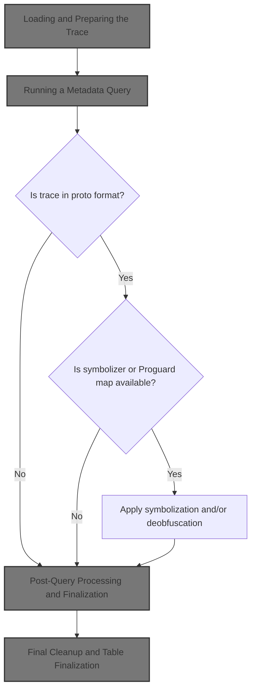
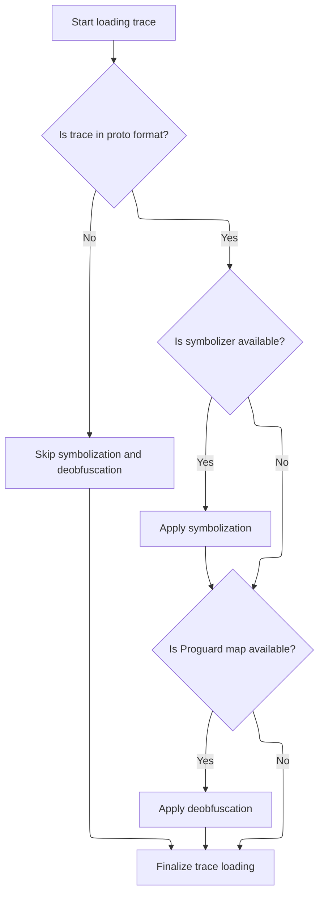
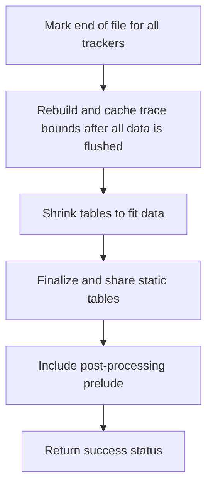

This document outlines the process of loading and preparing a trace file for analysis. The flow receives a trace file, determines its format, applies symbolization and deobfuscation if needed, and finalizes the trace data for further analysis or visualization.



# Loading and Preparing the Trace

<SwmSnippet path="/src/trace_processor/trace_processor_shell.cc" line="1271">

---

In <SwmToken path="src/trace_processor/trace_processor_shell.cc" pos="1271:4:4" line-data="base::Status LoadTrace(TraceProcessor* trace_processor,">`LoadTrace`</SwmToken>, we start by loading the trace file and updating the size. Right after, we run a SQL query to check if the trace is a proto trace by looking up the <SwmToken path="src/trace_processor/trace_processor_shell.cc" pos="1288:17:17" line-data="        &quot;SELECT str_value FROM metadata WHERE name = &#39;trace_type&#39;&quot;);">`trace_type`</SwmToken> in the metadata. This check is needed because later steps like symbolization and deobfuscation only apply to proto traces. To do this, we need to call into <SwmToken path="src/trace_processor/trace_processor_shell.cc" pos="1287:9:9" line-data="    auto it = trace_processor-&gt;ExecuteQuery(">`ExecuteQuery`</SwmToken> in <SwmPath>[src/trace_processor/trace_processor_impl.cc](src/trace_processor/trace_processor_impl.cc)</SwmPath>, since that's how we run SQL against the loaded trace data.

```c++
base::Status LoadTrace(TraceProcessor* trace_processor,
                       TraceProcessorShell::PlatformInterface* platform,
                       const std::string& trace_file_path,
                       double* size_mb) {
  base::Status load_status = platform->LoadTrace(
      trace_processor, trace_file_path, [&size_mb](size_t parsed_size) {
        *size_mb = static_cast<double>(parsed_size) / 1E6;
        fprintf(stderr, "\rLoading trace: %.2f MB\r", *size_mb);
      });
  if (!load_status.ok()) {
    return base::ErrStatus("Could not read trace file (path: %s): %s",
                           trace_file_path.c_str(), load_status.c_message());
  }

  bool is_proto_trace = false;
  {
    auto it = trace_processor->ExecuteQuery(
        "SELECT str_value FROM metadata WHERE name = 'trace_type'");
```

---

</SwmSnippet>

## Running a Metadata Query

<SwmSnippet path="/src/trace_processor/trace_processor_impl.cc" line="672">

---

In <SwmToken path="src/trace_processor/trace_processor_impl.cc" pos="672:4:4" line-data="Iterator TraceProcessorImpl::ExecuteQuery(const std::string&amp; sql) {">`ExecuteQuery`</SwmToken>, we trace the query execution for internal profiling, log the start in SQL stats, and sanitize the SQL string by replacing non-breaking spaces. Then, we hand off the actual execution to the SQL engine, which is why we need to call into <SwmPath>[src/…/engine/perfetto_sql_engine.cc](src/trace_processor/perfetto_sql/engine/perfetto_sql_engine.cc)</SwmPath> next.

```c++
Iterator TraceProcessorImpl::ExecuteQuery(const std::string& sql) {
  PERFETTO_TP_TRACE(metatrace::Category::API_TIMELINE, "EXECUTE_QUERY",
                    [&](metatrace::Record* r) { r->AddArg("query", sql); });

  uint32_t sql_stats_row =
      context()->storage->mutable_sql_stats()->RecordQueryBegin(
          sql, base::GetWallTimeNs().count());
  std::string non_breaking_sql = base::ReplaceAll(sql, "\u00A0", " ");
  base::StatusOr<PerfettoSqlEngine::ExecutionResult> result =
      engine_->ExecuteUntilLastStatement(
          SqlSource::FromExecuteQuery(std::move(non_breaking_sql)));
```

---

</SwmSnippet>

### Executing the SQL Statement

See <SwmLink doc-title="Processing Multiple SQL Statements">[Processing Multiple SQL Statements](/.swm/processing-multiple-sql-statements.sn2ovm8o.sw.md)</SwmLink>

### Wrapping Query Results

<SwmSnippet path="/src/trace_processor/trace_processor_impl.cc" line="683">

---

Back in <SwmToken path="src/trace_processor/trace_processor_shell.cc" pos="1287:9:9" line-data="    auto it = trace_processor-&gt;ExecuteQuery(">`ExecuteQuery`</SwmToken>, after getting the result from the SQL engine, we wrap it in an <SwmToken path="src/trace_processor/trace_processor_impl.cc" pos="683:5:5" line-data="  std::unique_ptr&lt;IteratorImpl&gt; impl(">`IteratorImpl`</SwmToken> so callers always get a consistent way to walk through results, no matter how the SQL was actually run.

```c++
  std::unique_ptr<IteratorImpl> impl(
      new IteratorImpl(this, std::move(result), sql_stats_row));
  return Iterator(std::move(impl));
}
```

---

</SwmSnippet>

## Post-Query Processing and Finalization



<SwmSnippet path="/src/trace_processor/trace_processor_shell.cc" line="1289">

---

After the proto check, we do symbolization/deobfuscation if needed, then call <SwmToken path="src/trace_processor/trace_processor_shell.cc" pos="1341:5:5" line-data="  return trace_processor-&gt;NotifyEndOfFile();">`NotifyEndOfFile`</SwmToken> to finish up.

```c++
    if (it.Next() && it.Get(0).type == SqlValue::kString) {
      if (std::string_view(it.Get(0).AsString()) == "proto") {
        is_proto_trace = true;
      }
    }
  }

  std::unique_ptr<profiling::Symbolizer> symbolizer =
      profiling::MaybeLocalSymbolizer(profiling::GetPerfettoBinaryPath(), {},
                                      getenv("PERFETTO_SYMBOLIZER_MODE"));
  if (symbolizer) {
    if (is_proto_trace) {
      trace_processor->Flush();
      profiling::SymbolizeDatabase(
          trace_processor, symbolizer.get(),
          [trace_processor](const std::string& trace_proto) {
            std::unique_ptr<uint8_t[]> buf(new uint8_t[trace_proto.size()]);
            memcpy(buf.get(), trace_proto.data(), trace_proto.size());
            auto status =
                trace_processor->Parse(std::move(buf), trace_proto.size());
            if (!status.ok()) {
              PERFETTO_DFATAL_OR_ELOG("Failed to parse: %s",
                                      status.message().c_str());
              return;
            }
          });
    } else {
      // TODO(lalitm): support symbolization for non-proto traces.
      PERFETTO_ELOG("Skipping symbolization for non-proto trace");
    }
  }
  auto maybe_map = profiling::GetPerfettoProguardMapPath();
  if (!maybe_map.empty()) {
    if (is_proto_trace) {
      trace_processor->Flush();
      profiling::ReadProguardMapsToDeobfuscationPackets(
          maybe_map, [trace_processor](const std::string& trace_proto) {
            std::unique_ptr<uint8_t[]> buf(new uint8_t[trace_proto.size()]);
            memcpy(buf.get(), trace_proto.data(), trace_proto.size());
            auto status =
                trace_processor->Parse(std::move(buf), trace_proto.size());
            if (!status.ok()) {
              PERFETTO_DFATAL_OR_ELOG("Failed to parse: %s",
                                      status.message().c_str());
              return;
            }
          });
    } else {
      // TODO(lalitm): support deobfuscation for non-proto traces.
      PERFETTO_ELOG("Skipping deobfuscation for non-proto trace");
    }
  }
  return trace_processor->NotifyEndOfFile();
}
```

---

</SwmSnippet>

# Finalizing Trace Processing

<SwmSnippet path="/src/trace_processor/trace_processor_impl.cc" line="627">

---

In <SwmToken path="src/trace_processor/trace_processor_impl.cc" pos="627:6:6" line-data="base::Status TraceProcessorImpl::NotifyEndOfFile() {">`NotifyEndOfFile`</SwmToken>, we check for double calls, set a default trace name if needed, flush pending data, finalize heap graphs, and then call into storage to finalize trace data there. This sets up the rest of the cleanup and finalization steps.

```c++
base::Status TraceProcessorImpl::NotifyEndOfFile() {
  if (notify_eof_called_) {
    const char kMessage[] =
        "NotifyEndOfFile should only be called once. Try calling Flush instead "
        "if trying to commit the contents of the trace to tables.";
    PERFETTO_ELOG(kMessage);
    return base::ErrStatus(kMessage);
  }
  notify_eof_called_ = true;

  if (current_trace_name_.empty())
    current_trace_name_ = "Unnamed trace";

  // Last opportunity to flush all pending data.
  FlushInternal(false);

  HeapGraphTracker::Get(context())->FinalizeAllProfiles();
  RETURN_IF_ERROR(TraceProcessorStorageImpl::NotifyEndOfFile());
```

---

</SwmSnippet>

## Finalizing Storage State

```mermaid
%%{init: {"flowchart": {"defaultRenderer": "elk"}} }%%
flowchart TD
  node1["Finalize trace processing"]
  node1 --> node2{"Is parser present?"}
  click node1 openCode "src/trace_processor/trace_processor_storage_impl.cc:114:115"
  node2 -->|"No"| node3["Return success"]
  click node2 openCode "src/trace_processor/trace_processor_storage_impl.cc:115:117"
  click node3 openCode "src/trace_processor/trace_processor_storage_impl.cc:116:117"
  node2 -->|"Yes"| node4{"Unrecoverable parsing error?"}
  click node4 openCode "src/trace_processor/trace_processor_storage_impl.cc:118:120"
  node4 -->|"Yes"| node5["Return error"]
  click node5 openCode "src/trace_processor/trace_processor_storage_impl.cc:119:120"
  node4 -->|"No"| node6["Flush all buffered data and notify parser"]
  click node6 openCode "src/trace_processor/trace_processor_storage_impl.cc:121:125"
  node6 --> loop1
  subgraph loop1["For each trace context"]
    node7{"Has content analyzer?"}
    click node7 openCode "src/trace_processor/trace_processor_storage_impl.cc:128:130"
    node7 -->|"Yes"| node8["Notify analyzer of end-of-file"]
    click node8 openCode "src/trace_processor/trace_processor_storage_impl.cc:130:131"
    node7 -->|"No"| node9["Skip"]
  end
  loop1 --> loop2
  subgraph loop2["For each machine context"]
    node10["Notify symbol tracker of end-of-file"]
    click node10 openCode "src/trace_processor/trace_processor_storage_impl.cc:134:135"
  end
  loop2 --> loop3
  subgraph loop3["For each combined context"]
    node11["Flush pending events"]
    click node11 openCode "src/trace_processor/trace_processor_storage_impl.cc:139:139"
    node11 --> node12["Flush pending slices"]
    click node12 openCode "src/trace_processor/trace_processor_storage_impl.cc:140:140"
    node12 --> node13["Notify process tracker of end-of-file"]
    click node13 openCode "src/trace_processor/trace_processor_storage_impl.cc:141:141"
  end
  loop3 --> node14["Return success"]
  click node14 openCode "src/trace_processor/trace_processor_storage_impl.cc:143:144"
classDef HeadingStyle fill:#777777,stroke:#333,stroke-width:2px;

%% Swimm:
%% %%{init: {"flowchart": {"defaultRenderer": "elk"}} }%%
%% flowchart TD
%%   node1["Finalize trace processing"]
%%   node1 --> node2{"Is parser present?"}
%%   click node1 openCode "<SwmPath>[src/trace_processor/trace_processor_storage_impl.cc](src/trace_processor/trace_processor_storage_impl.cc)</SwmPath>:114:115"
%%   node2 -->|"No"| node3["Return success"]
%%   click node2 openCode "<SwmPath>[src/trace_processor/trace_processor_storage_impl.cc](src/trace_processor/trace_processor_storage_impl.cc)</SwmPath>:115:117"
%%   click node3 openCode "<SwmPath>[src/trace_processor/trace_processor_storage_impl.cc](src/trace_processor/trace_processor_storage_impl.cc)</SwmPath>:116:117"
%%   node2 -->|"Yes"| node4{"Unrecoverable parsing error?"}
%%   click node4 openCode "<SwmPath>[src/trace_processor/trace_processor_storage_impl.cc](src/trace_processor/trace_processor_storage_impl.cc)</SwmPath>:118:120"
%%   node4 -->|"Yes"| node5["Return error"]
%%   click node5 openCode "<SwmPath>[src/trace_processor/trace_processor_storage_impl.cc](src/trace_processor/trace_processor_storage_impl.cc)</SwmPath>:119:120"
%%   node4 -->|"No"| node6["Flush all buffered data and notify parser"]
%%   click node6 openCode "<SwmPath>[src/trace_processor/trace_processor_storage_impl.cc](src/trace_processor/trace_processor_storage_impl.cc)</SwmPath>:121:125"
%%   node6 --> loop1
%%   subgraph loop1["For each trace context"]
%%     node7{"Has content analyzer?"}
%%     click node7 openCode "<SwmPath>[src/trace_processor/trace_processor_storage_impl.cc](src/trace_processor/trace_processor_storage_impl.cc)</SwmPath>:128:130"
%%     node7 -->|"Yes"| node8["Notify analyzer of end-of-file"]
%%     click node8 openCode "<SwmPath>[src/trace_processor/trace_processor_storage_impl.cc](src/trace_processor/trace_processor_storage_impl.cc)</SwmPath>:130:131"
%%     node7 -->|"No"| node9["Skip"]
%%   end
%%   loop1 --> loop2
%%   subgraph loop2["For each machine context"]
%%     node10["Notify symbol tracker of end-of-file"]
%%     click node10 openCode "<SwmPath>[src/trace_processor/trace_processor_storage_impl.cc](src/trace_processor/trace_processor_storage_impl.cc)</SwmPath>:134:135"
%%   end
%%   loop2 --> loop3
%%   subgraph loop3["For each combined context"]
%%     node11["Flush pending events"]
%%     click node11 openCode "<SwmPath>[src/trace_processor/trace_processor_storage_impl.cc](src/trace_processor/trace_processor_storage_impl.cc)</SwmPath>:139:139"
%%     node11 --> node12["Flush pending slices"]
%%     click node12 openCode "<SwmPath>[src/trace_processor/trace_processor_storage_impl.cc](src/trace_processor/trace_processor_storage_impl.cc)</SwmPath>:140:140"
%%     node12 --> node13["Notify process tracker of end-of-file"]
%%     click node13 openCode "<SwmPath>[src/trace_processor/trace_processor_storage_impl.cc](src/trace_processor/trace_processor_storage_impl.cc)</SwmPath>:141:141"
%%   end
%%   loop3 --> node14["Return success"]
%%   click node14 openCode "<SwmPath>[src/trace_processor/trace_processor_storage_impl.cc](src/trace_processor/trace_processor_storage_impl.cc)</SwmPath>:143:144"
%% classDef HeadingStyle fill:#777777,stroke:#333,stroke-width:2px;
```



<SwmSnippet path="/src/trace_processor/trace_processor_storage_impl.cc" line="114">

---

In <SwmToken path="src/trace_processor/trace_processor_storage_impl.cc" pos="114:6:6" line-data="base::Status TraceProcessorStorageImpl::NotifyEndOfFile() {">`NotifyEndOfFile`</SwmToken> (storage), we flush any buffered data, notify the parser that we're done, flush again in case new packets were added, and then walk through all context mappings to tell analyzers and trackers to finalize their state.

```c++
base::Status TraceProcessorStorageImpl::NotifyEndOfFile() {
  if (!parser_) {
    return base::OkStatus();
  }
  if (unrecoverable_parse_error_) {
    return base::ErrStatus("Unrecoverable parsing error already occurred");
  }
  eof_ = true;
  Flush();
  RETURN_IF_ERROR(parser_->NotifyEndOfFile());
  // NotifyEndOfFile might have pushed packets to the sorter.
  Flush();

  auto& traces = context()->forked_context_state->trace_to_context;
  for (auto it = traces.GetIterator(); it; ++it) {
    if (it.value()->content_analyzer) {
      PacketAnalyzer::Get(it.value())->NotifyEndOfFile();
    }
  }
```

---

</SwmSnippet>

<SwmSnippet path="/src/trace_processor/trace_processor_storage_impl.cc" line="133">

---

After notifying packet analyzers, we loop through machine contexts and tell each symbol tracker to finalize. This keeps symbol info up to date before moving on to event, slice, and process trackers.

```c++
  auto& machines = context()->forked_context_state->machine_to_context;
  for (auto it = machines.GetIterator(); it; ++it) {
    it.value()->symbol_tracker->NotifyEndOfFile();
  }
```

---

</SwmSnippet>

<SwmSnippet path="/src/trace_processor/trace_processor_storage_impl.cc" line="137">

---

After symbol trackers, we hit all combined trace/machine contexts and flush pending events, slices, and notify process trackers. This wraps up all per-context finalization, and we need to call into <SwmPath>[src/…/common/slice_tracker.cc](src/trace_processor/importers/common/slice_tracker.cc)</SwmPath> next to actually flush any incomplete slices.

```c++
  auto& all = context()->forked_context_state->trace_and_machine_to_context;
  for (auto it = all.GetIterator(); it; ++it) {
    it.value()->event_tracker->FlushPendingEvents();
    it.value()->slice_tracker->FlushPendingSlices();
    it.value()->process_tracker->NotifyEndOfFile();
  }
  return base::OkStatus();
}
```

---

</SwmSnippet>

## Flushing Incomplete Slices

<SwmSnippet path="/src/trace_processor/importers/common/slice_tracker.cc" line="316">

---

In <SwmToken path="src/trace_processor/importers/common/slice_tracker.cc" pos="316:4:4" line-data="void SliceTracker::FlushPendingSlices() {">`FlushPendingSlices`</SwmToken>, we walk through all stacks and make sure any pending slice arguments get processed, so nothing is left hanging before we translate and flush args.

```c++
void SliceTracker::FlushPendingSlices() {
  // Clear the remaining stack entries. This ensures that any pending args are
  // written to the storage. We don't close any slices with kPendingDuration so
  // that the UI can still distinguish such "incomplete" slices.
  //
  // TODO(eseckler): Reconsider whether we want to close pending slices by
  // setting their duration to |trace_end - event_start|. Might still want some
  // additional way of flagging these events as "incomplete" to the UI.

  // Make sure that args for all incomplete slice are translated.
  for (auto it = stacks_.GetIterator(); it; ++it) {
    auto& track_info = it.value();
    for (auto& slice_info : track_info.slice_stack) {
      MaybeAddTranslatableArgs(slice_info);
    }
  }
```

---

</SwmSnippet>

<SwmSnippet path="/src/trace_processor/importers/common/slice_tracker.cc" line="333">

---

Here we loop through all translatable args and use <SwmToken path="src/trace_processor/importers/common/slice_tracker.cc" pos="335:1:1" line-data="    ArgsTracker args_tracker(context_);">`ArgsTracker`</SwmToken> to bind them, then call into <SwmPath>[src/…/common/args_translation_table.cc](src/trace_processor/importers/common/args_translation_table.cc)</SwmPath> to actually translate and flush them. This is needed to turn compact arg sets into something usable downstream.

```c++
  // Translate and flush all pending args.
  for (const auto& translatable_arg : translatable_args_) {
    ArgsTracker args_tracker(context_);
    auto bound_inserter = args_tracker.AddArgsTo(translatable_arg.slice_id);
    context_->args_translation_table->TranslateArgs(
        translatable_arg.compact_arg_set, bound_inserter);
  }
```

---

</SwmSnippet>

### Translating Argument Keys

```mermaid
%%{init: {"flowchart": {"defaultRenderer": "elk"}} }%%
flowchart TD
  node1["Start translating arguments"]
  click node1 openCode "src/trace_processor/importers/common/args_translation_table.cc:91:96"
  subgraph loop1["For each argument in input"]
    node2{"Is argument a known type?"}
    click node2 openCode "src/trace_processor/importers/common/args_translation_table.cc:97:105"
    node2 -->|"No"| node3["Add argument as-is"]
    click node3 openCode "src/trace_processor/importers/common/args_translation_table.cc:101:102"
    node2 -->|"Yes"| node4{"Is translation available for this type?"}
    click node4 openCode "src/trace_processor/importers/common/args_translation_table.cc:106:172"
    node4 -->|"Yes"| node5["Add translated value and enrich metadata"]
    click node5 openCode "src/trace_processor/importers/common/args_translation_table.cc:107:171"
    node4 -->|"No"| node6["Add argument with original value"]
    click node6 openCode "src/trace_processor/importers/common/args_translation_table.cc:158:160"
    node2 -->|"Mojo method mapping/rel_pc"| node7["Store mapping_id or rel_pc"]
    click node7 openCode "src/trace_processor/importers/common/args_translation_table.cc:175:180"
  end
  loop1 --> node8["Emit Mojo method location with stored metadata"]
  click node8 openCode "src/trace_processor/importers/common/args_translation_table.cc:184:185"

classDef HeadingStyle fill:#777777,stroke:#333,stroke-width:2px;

%% Swimm:
%% %%{init: {"flowchart": {"defaultRenderer": "elk"}} }%%
%% flowchart TD
%%   node1["Start translating arguments"]
%%   click node1 openCode "<SwmPath>[src/…/common/args_translation_table.cc](src/trace_processor/importers/common/args_translation_table.cc)</SwmPath>:91:96"
%%   subgraph loop1["For each argument in input"]
%%     node2{"Is argument a known type?"}
%%     click node2 openCode "<SwmPath>[src/…/common/args_translation_table.cc](src/trace_processor/importers/common/args_translation_table.cc)</SwmPath>:97:105"
%%     node2 -->|"No"| node3["Add argument as-is"]
%%     click node3 openCode "<SwmPath>[src/…/common/args_translation_table.cc](src/trace_processor/importers/common/args_translation_table.cc)</SwmPath>:101:102"
%%     node2 -->|"Yes"| node4{"Is translation available for this type?"}
%%     click node4 openCode "<SwmPath>[src/…/common/args_translation_table.cc](src/trace_processor/importers/common/args_translation_table.cc)</SwmPath>:106:172"
%%     node4 -->|"Yes"| node5["Add translated value and enrich metadata"]
%%     click node5 openCode "<SwmPath>[src/…/common/args_translation_table.cc](src/trace_processor/importers/common/args_translation_table.cc)</SwmPath>:107:171"
%%     node4 -->|"No"| node6["Add argument with original value"]
%%     click node6 openCode "<SwmPath>[src/…/common/args_translation_table.cc](src/trace_processor/importers/common/args_translation_table.cc)</SwmPath>:158:160"
%%     node2 -->|"Mojo method mapping/rel_pc"| node7["Store <SwmToken path="src/trace_processor/importers/common/args_translation_table.cc" pos="94:8:8" line-data="  std::optional&lt;uint64_t&gt; mapping_id;">`mapping_id`</SwmToken> or <SwmToken path="src/trace_processor/importers/common/args_translation_table.cc" pos="95:8:8" line-data="  std::optional&lt;uint64_t&gt; rel_pc;">`rel_pc`</SwmToken>"]
%%     click node7 openCode "<SwmPath>[src/…/common/args_translation_table.cc](src/trace_processor/importers/common/args_translation_table.cc)</SwmPath>:175:180"
%%   end
%%   loop1 --> node8["Emit Mojo method location with stored metadata"]
%%   click node8 openCode "<SwmPath>[src/…/common/args_translation_table.cc](src/trace_processor/importers/common/args_translation_table.cc)</SwmPath>:184:185"
%% 
%% classDef HeadingStyle fill:#777777,stroke:#333,stroke-width:2px;
```



<SwmSnippet path="/src/trace_processor/importers/common/args_translation_table.cc" line="91">

---

In <SwmToken path="src/trace_processor/importers/common/args_translation_table.cc" pos="91:4:4" line-data="void ArgsTranslationTable::TranslateArgs(">`TranslateArgs`</SwmToken>, we loop through each arg, figure out its type, and if it's a known type, we translate hashes or names to readable strings and insert both original and translated forms. Special handling for Mojo methods too. This makes the trace data more useful for analysis.

```c++
void ArgsTranslationTable::TranslateArgs(
    const ArgsTracker::CompactArgSet& arg_set,
    ArgsTracker::BoundInserter& inserter) const {
  std::optional<uint64_t> mapping_id;
  std::optional<uint64_t> rel_pc;

  for (const auto& arg : arg_set) {
    const auto key_type =
        KeyIdAndTypeToEnum(arg.flat_key, arg.key, arg.value.type);
    if (!key_type.has_value()) {
      inserter.AddArg(arg.flat_key, arg.key, arg.value, arg.update_policy);
      continue;
    }

    switch (*key_type) {
      case KeyType::kChromeHistogramHash: {
        inserter.AddArg(interned_chrome_histogram_hash_key_, arg.value);
        const std::optional<base::StringView> translated_value =
            TranslateChromeHistogramHash(arg.value.uint_value);
        if (translated_value) {
          inserter.AddArg(
              interned_chrome_histogram_name_key_,
              Variadic::String(storage_->InternString(*translated_value)));
        }
        break;
      }
      case KeyType::kChromeUserEventHash: {
        inserter.AddArg(interned_chrome_user_event_hash_key_, arg.value);
        const std::optional<base::StringView> translated_value =
            TranslateChromeUserEventHash(arg.value.uint_value);
        if (translated_value) {
          inserter.AddArg(
              interned_chrome_user_event_action_key_,
              Variadic::String(storage_->InternString(*translated_value)));
        }
        break;
      }
      case KeyType::kChromePerformanceMarkMarkHash: {
        inserter.AddArg(interned_chrome_performance_mark_mark_hash_key_,
                        arg.value);
        const std::optional<base::StringView> translated_value =
            TranslateChromePerformanceMarkMarkHash(arg.value.uint_value);
        if (translated_value) {
          inserter.AddArg(
              interned_chrome_performance_mark_mark_key_,
              Variadic::String(storage_->InternString(*translated_value)));
        }
        break;
      }
      case KeyType::kChromePerformanceMarkSiteHash: {
        inserter.AddArg(interned_chrome_performance_mark_site_hash_key_,
                        arg.value);
        const std::optional<base::StringView> translated_value =
            TranslateChromePerformanceMarkSiteHash(arg.value.uint_value);
        if (translated_value) {
          inserter.AddArg(
              interned_chrome_performance_mark_site_key_,
              Variadic::String(storage_->InternString(*translated_value)));
        }
        break;
      }
      case KeyType::kClassName: {
        const std::optional<StringId> translated_class_name =
            TranslateClassName(arg.value.string_value);
        if (translated_class_name) {
          inserter.AddArg(arg.flat_key, arg.key,
                          Variadic::String(*translated_class_name));
        } else {
          inserter.AddArg(arg.flat_key, arg.key, arg.value);
        }
        break;
      }
      case KeyType::kChromeTriggerHash: {
        inserter.AddArg(interned_chrome_trigger_hash_key_, arg.value);
        const std::optional<base::StringView> translated_value =
            TranslateChromeStudyHash(arg.value.uint_value);
        if (translated_value) {
          inserter.AddArg(
              interned_chrome_trigger_name_key_,
              Variadic::String(storage_->InternString(*translated_value)));
        }
        break;
      }
      case KeyType::kMojoMethodMappingId: {
        mapping_id = arg.value.uint_value;
        break;
      }
      case KeyType::kMojoMethodRelPc: {
        rel_pc = arg.value.uint_value;
        break;
      }
    }
  }
```

---

</SwmSnippet>

<SwmSnippet path="/src/trace_processor/importers/common/args_translation_table.cc" line="184">

---

After translation, we emit Mojo locations and the inserter is filled with all the translated args.

```c++
  EmitMojoMethodLocation(mapping_id, rel_pc, inserter);
}
```

---

</SwmSnippet>

### Clearing Pending State

<SwmSnippet path="/src/trace_processor/importers/common/slice_tracker.cc" line="340">

---

After translating arguments, <SwmToken path="src/trace_processor/trace_processor_storage_impl.cc" pos="140:9:9" line-data="    it.value()-&gt;slice_tracker-&gt;FlushPendingSlices();">`FlushPendingSlices`</SwmToken> clears out the pending argument and stack state so nothing lingers between traces or causes memory bloat.

```c++
  translatable_args_.clear();

  stacks_.Clear();
}
```

---

</SwmSnippet>

## Final Cleanup and Table Finalization



<SwmSnippet path="/src/trace_processor/trace_processor_impl.cc" line="645">

---

After storage finalization, <SwmToken path="src/trace_processor/trace_processor_impl.cc" pos="645:10:10" line-data="  DeobfuscationTracker::Get(context())-&gt;NotifyEndOfFile();">`NotifyEndOfFile`</SwmToken> (impl) rebuilds and caches trace bounds, destroys the context, shrinks tables, finalizes static tables, and does a final prelude step. This makes sure everything is wrapped up and ready for the next trace or shutdown.

```c++
  DeobfuscationTracker::Get(context())->NotifyEndOfFile();

  // Rebuild the bounds table once everything has been completed: we do this
  // so that if any data was added to tables in
  // TraceProcessorStorageImpl::NotifyEndOfFile, this will be counted in
  // trace bounds: this is important for parsers like ninja which wait until
  // the end to flush all their data.
  //
  // Cache the bounds before finalization so we can reuse them in
  // RestoreInitialTables without iterating over finalized dataframes.
  cached_trace_bounds_ = GetTraceTimestampBoundsNs(*context()->storage);
  BuildBoundsTable(engine_->sqlite_engine()->db(), cached_trace_bounds_);

  TraceProcessorStorageImpl::DestroyContext();
  context()->storage->ShrinkToFitTables();

  engine_->FinalizeAndShareAllStaticTables();
  IncludeAfterEofPrelude(engine_.get());
  sqlite_objects_post_prelude_ = engine_->SqliteRegisteredObjectCount();

  return base::OkStatus();
}
```

---

</SwmSnippet>

&nbsp;

*This is an auto-generated document by Swimm 🌊 and has not yet been verified by a human*

<SwmMeta version="3.0.0" repo-id="Z2l0aHViJTNBJTNBY3BsdXNwbHVzLXBlcmZldHRvJTNBJTNBcmljYXJkb2xvcGV6Zw==" repo-name="cplusplus-perfetto"><sup>Powered by [Swimm](https://app.swimm.io/)</sup></SwmMeta>
