This document describes how the system loads and resolves all relevant information for a debug slice event. When a user inspects an event, the system retrieves its details, including arguments, contextual data, thread state, and slice information, enabling a comprehensive summary in the Perfetto UI.

# Loading and Resolving Slice and Thread State Details

```mermaid
%%{init: {"flowchart": {"defaultRenderer": "elk"}} }%%
flowchart TD
    node1["Load event data for debug slice (eventId, tableName)"] --> node2{"Does event have arguments (arg_set_id)?"}
    click node1 openCode "ui/src/components/tracks/debug_slice_track_details_panel.ts:159:165"
    node2 -->|"Yes"| node3["Load arguments for event"]
    click node2 openCode "ui/src/components/tracks/debug_slice_track_details_panel.ts:180:182"
    node2 -->|"No"| node4
    node3 --> node4
    subgraph loop1["For each key in event data"]
      node4 --> node5{"Is key a raw column (RAW_PREFIX)?"}
      click node5 openCode "ui/src/components/tracks/debug_slice_track_details_panel.ts:184:189"
      node5 -->|"Yes"| node6["Extract and store raw column"]
      click node6 openCode "ui/src/components/tracks/debug_slice_track_details_panel.ts:186:189"
      node5 -->|"No"| node4
      node6 --> node4
    end
    node4 --> node7{"Can load thread state?"}
    click node7 openCode "ui/src/components/tracks/debug_slice_track_details_panel.ts:192:198"
    node7 -->|"Yes"| node8["Load thread state details"]
    click node8 openCode "ui/src/components/tracks/debug_slice_track_details_panel.ts:91:113"
    node7 -->|"No"| node9
    node8 --> node9
    node9{"Can load slice details?"}
    click node9 openCode "ui/src/components/tracks/debug_slice_track_details_panel.ts:200:208"
    node9 -->|"Yes"| node10["Load slice details"]
    click node10 openCode "ui/src/components/tracks/debug_slice_track_details_panel.ts:125:145"
    node9 -->|"No"| node11["Finish loading details"]
    node10 --> node11["Finish loading details"]
    click node11 openCode "ui/src/components/tracks/debug_slice_track_details_panel.ts:208:208"

classDef HeadingStyle fill:#777777,stroke:#333,stroke-width:2px;

%% Swimm:
%% %%{init: {"flowchart": {"defaultRenderer": "elk"}} }%%
%% flowchart TD
%%     node1["Load event data for debug slice (<SwmToken path="ui/src/components/tracks/debug_slice_track_details_panel.ts" pos="163:11:11" line-data="      WHERE id = ${this.eventId}">`eventId`</SwmToken>, <SwmToken path="ui/src/components/tracks/debug_slice_track_details_panel.ts" pos="162:7:7" line-data="      FROM ${this.tableName}">`tableName`</SwmToken>)"] --> node2{"Does event have arguments (<SwmToken path="ui/src/components/tracks/debug_slice_track_details_panel.ts" pos="170:10:10" line-data="      ...(this.argSetIdCol &amp;&amp; {arg_set_id: NUM_NULL}),">`arg_set_id`</SwmToken>)?"}
%%     click node1 openCode "<SwmPath>[ui/…/tracks/debug_slice_track_details_panel.ts](ui/src/components/tracks/debug_slice_track_details_panel.ts)</SwmPath>:159:165"
%%     node2 -->|"Yes"| node3["Load arguments for event"]
%%     click node2 openCode "<SwmPath>[ui/…/tracks/debug_slice_track_details_panel.ts](ui/src/components/tracks/debug_slice_track_details_panel.ts)</SwmPath>:180:182"
%%     node2 -->|"No"| node4
%%     node3 --> node4
%%     subgraph loop1["For each key in event data"]
%%       node4 --> node5{"Is key a raw column (<SwmToken path="ui/src/components/tracks/debug_slice_track_details_panel.ts" pos="185:8:8" line-data="      if (key.startsWith(RAW_PREFIX)) {">`RAW_PREFIX`</SwmToken>)?"}
%%       click node5 openCode "<SwmPath>[ui/…/tracks/debug_slice_track_details_panel.ts](ui/src/components/tracks/debug_slice_track_details_panel.ts)</SwmPath>:184:189"
%%       node5 -->|"Yes"| node6["Extract and store raw column"]
%%       click node6 openCode "<SwmPath>[ui/…/tracks/debug_slice_track_details_panel.ts](ui/src/components/tracks/debug_slice_track_details_panel.ts)</SwmPath>:186:189"
%%       node5 -->|"No"| node4
%%       node6 --> node4
%%     end
%%     node4 --> node7{"Can load thread state?"}
%%     click node7 openCode "<SwmPath>[ui/…/tracks/debug_slice_track_details_panel.ts](ui/src/components/tracks/debug_slice_track_details_panel.ts)</SwmPath>:192:198"
%%     node7 -->|"Yes"| node8["Load thread state details"]
%%     click node8 openCode "<SwmPath>[ui/…/tracks/debug_slice_track_details_panel.ts](ui/src/components/tracks/debug_slice_track_details_panel.ts)</SwmPath>:91:113"
%%     node7 -->|"No"| node9
%%     node8 --> node9
%%     node9{"Can load slice details?"}
%%     click node9 openCode "<SwmPath>[ui/…/tracks/debug_slice_track_details_panel.ts](ui/src/components/tracks/debug_slice_track_details_panel.ts)</SwmPath>:200:208"
%%     node9 -->|"Yes"| node10["Load slice details"]
%%     click node10 openCode "<SwmPath>[ui/…/tracks/debug_slice_track_details_panel.ts](ui/src/components/tracks/debug_slice_track_details_panel.ts)</SwmPath>:125:145"
%%     node9 -->|"No"| node11["Finish loading details"]
%%     node10 --> node11["Finish loading details"]
%%     click node11 openCode "<SwmPath>[ui/…/tracks/debug_slice_track_details_panel.ts](ui/src/components/tracks/debug_slice_track_details_panel.ts)</SwmPath>:208:208"
%% 
%% classDef HeadingStyle fill:#777777,stroke:#333,stroke-width:2px;
```



<SwmSnippet path="/ui/src/components/tracks/debug_slice_track_details_panel.ts" line="159">

---

In <SwmToken path="ui/src/components/tracks/debug_slice_track_details_panel.ts" pos="159:3:3" line-data="  async load() {">`load`</SwmToken>, we kick off by querying the trace database for a row matching the event ID in the specified table. We expect certain columns to exist (like ts, dur, name, and optionally <SwmToken path="ui/src/components/tracks/debug_slice_track_details_panel.ts" pos="170:10:10" line-data="      ...(this.argSetIdCol &amp;&amp; {arg_set_id: NUM_NULL}),">`arg_set_id`</SwmToken>), and if <SwmToken path="ui/src/components/tracks/debug_slice_track_details_panel.ts" pos="170:10:10" line-data="      ...(this.argSetIdCol &amp;&amp; {arg_set_id: NUM_NULL}),">`arg_set_id`</SwmToken> is present, we fetch related arguments. We also extract any raw columns prefixed with <SwmToken path="ui/src/components/tracks/debug_slice_track_details_panel.ts" pos="185:8:8" line-data="      if (key.startsWith(RAW_PREFIX)) {">`RAW_PREFIX`</SwmToken> and store them for later use. This sets up the core data for the rest of the panel's logic.

```typescript
  async load() {
    const queryResult = await this.trace.engine.query(`
      SELECT *
      FROM ${this.tableName}
      WHERE id = ${this.eventId}
    `);

    const row = queryResult.firstRow({
      ts: LONG,
      dur: LONG,
      name: STR,
      ...(this.argSetIdCol && {arg_set_id: NUM_NULL}),
    });

    this.data = {
      name: row.name,
      ts: Time.fromRaw(row.ts),
      dur: row.dur,
      rawCols: {},
    };

    if (row.arg_set_id != null) {
      this.args = await getArgs(this.trace.engine, asArgSetId(row.arg_set_id));
    }

    for (const key of Object.keys(row)) {
      if (key.startsWith(RAW_PREFIX)) {
        this.data.rawCols[key.substr(RAW_PREFIX.length)] = (
          row as {[key: string]: SqlValue}
        )[key];
      }
    }
```

---

</SwmSnippet>

<SwmSnippet path="/ui/src/components/tracks/debug_slice_track_details_panel.ts" line="192">

---

We grab IDs and other info from the raw columns and try to load the thread state for more context.

```typescript
    this.threadState = await this.maybeLoadThreadState(
      sqlValueToNumber(this.data.rawCols['id']),
      this.data.ts,
      this.data.dur,
      sqlValueToReadableString(this.data.rawCols['table_name']),
      sqlValueToUtid(this.data.rawCols['utid']),
    );

```

---

</SwmSnippet>

<SwmSnippet path="/ui/src/components/tracks/debug_slice_track_details_panel.ts" line="91">

---

<SwmToken path="ui/src/components/tracks/debug_slice_track_details_panel.ts" pos="91:5:5" line-data="  private async maybeLoadThreadState(">`maybeLoadThreadState`</SwmToken> tries to fetch a <SwmToken path="ui/src/components/tracks/debug_slice_track_details_panel.ts" pos="97:6:6" line-data="  ): Promise&lt;ThreadState | undefined&gt; {">`ThreadState`</SwmToken> by id, but only returns it if the table is <SwmToken path="ui/src/components/tracks/debug_slice_track_details_panel.ts" pos="104:6:6" line-data="      table === &#39;thread_state&#39; ||">`thread_state`</SwmToken> or if all the timing and thread identifiers match. This keeps the returned data tightly scoped to the event we're looking at.

```typescript
  private async maybeLoadThreadState(
    id: number | undefined,
    ts: time,
    dur: duration,
    table: string | undefined,
    utid?: Utid,
  ): Promise<ThreadState | undefined> {
    if (id === undefined) return undefined;
    if (utid === undefined) return undefined;

    const threadState = await getThreadState(this.trace.engine, id);
    if (threadState === undefined) return undefined;
    if (
      table === 'thread_state' ||
      (threadState.ts === ts &&
        threadState.dur === dur &&
        threadState.thread?.utid === utid)
    ) {
      return threadState;
    } else {
      return undefined;
    }
  }
```

---

</SwmSnippet>

<SwmSnippet path="/ui/src/components/tracks/debug_slice_track_details_panel.ts" line="200">

---

After thread state, we try to load the slice using IDs and other info from the raw columns.

```typescript
    this.slice = await this.maybeLoadSlice(
      sqlValueToNumber(this.data.rawCols['id']) ??
        sqlValueToNumber(this.data.rawCols['slice_id']),
      this.data.ts,
      this.data.dur,
      sqlValueToReadableString(this.data.rawCols['table_name']),
      sqlValueToNumber(this.data.rawCols['track_id']),
    );
  }
```

---

</SwmSnippet>

<SwmSnippet path="/ui/src/components/tracks/debug_slice_track_details_panel.ts" line="125">

---

<SwmToken path="ui/src/components/tracks/debug_slice_track_details_panel.ts" pos="125:5:5" line-data="  private async maybeLoadSlice(">`maybeLoadSlice`</SwmToken> checks if we have a valid id and, for non-'slice' tables, a <SwmToken path="ui/src/components/tracks/debug_slice_track_details_panel.ts" pos="130:1:1" line-data="    trackId?: number,">`trackId`</SwmToken>. It fetches the slice and only returns it if the timing and track info match, or if we're in the 'slice' table context. This keeps the slice data relevant to the event.

```typescript
  private async maybeLoadSlice(
    id: number | undefined,
    ts: time,
    dur: duration,
    table: string | undefined,
    trackId?: number,
  ): Promise<SliceDetails | undefined> {
    if (id === undefined) return undefined;
    if (table !== 'slice' && trackId === undefined) return undefined;

    const slice = await getSlice(this.trace.engine, asSliceSqlId(id));
    if (slice === undefined) return undefined;
    if (
      table === 'slice' ||
      (slice.ts === ts && slice.dur === dur && slice.trackId === trackId)
    ) {
      return slice;
    } else {
      return undefined;
    }
  }
```

---

</SwmSnippet>

&nbsp;

*This is an auto-generated document by Swimm 🌊 and has not yet been verified by a human*

<SwmMeta version="3.0.0" repo-id="Z2l0aHViJTNBJTNBY3BsdXNwbHVzLXBlcmZldHRvJTNBJTNBcmljYXJkb2xvcGV6Zw==" repo-name="cplusplus-perfetto"><sup>Powered by [Swimm](https://app.swimm.io/)</sup></SwmMeta>
