This document describes how a trace is loaded and made ready for analysis, including restoring the user's previous workspace and preferences. The flow supports loading trace data from various sources and ensures that the user's timeline, pinned tracks, notes, and selection are restored, so analysis can begin immediately.

# Loading and Parsing Trace Data

<SwmSnippet path="/ui/src/core/load_trace.ts" line="177">

---

We figure out where the trace data is coming from, set up the right stream, and start reading and parsing it chunk by chunk, unless it's <SwmToken path="ui/src/core/load_trace.ts" pos="192:15:15" line-data="  } else if (traceSource.type === &#39;HTTP_RPC&#39;) {">`HTTP_RPC`</SwmToken>, which is already loaded.

```typescript
async function loadTraceIntoEngine(
  app: AppImpl,
  traceSource: TraceSource,
  engine: EngineBase,
): Promise<TraceImpl> {
  let traceStream: TraceStream | undefined;
  const serializedAppState = traceSource.serializedAppState;
  if (traceSource.type === 'FILE') {
    traceStream = new TraceFileStream(traceSource.file);
  } else if (traceSource.type === 'ARRAY_BUFFER') {
    traceStream = new TraceBufferStream(traceSource.buffer);
  } else if (traceSource.type === 'URL') {
    traceStream = new TraceHttpStream(traceSource.url);
  } else if (traceSource.type === 'STREAM') {
    traceStream = traceSource.stream;
  } else if (traceSource.type === 'HTTP_RPC') {
    traceStream = undefined;
  } else if (traceSource.type === 'MULTIPLE_FILES') {
    traceStream = new TraceMultipleFilesStream(traceSource.files);
  } else {
    throw new Error(`Unknown source: ${JSON.stringify(traceSource)}`);
  }

  // |traceStream| can be undefined in the case when we are using the external
  // HTTP+RPC endpoint and the trace processor instance has already loaded
  // a trace (because it was passed as a cmdline argument to
  // trace_processor_shell). In this case we don't want the UI to load any
  // file/stream and we just want to jump to the loading phase.
  if (traceStream !== undefined) {
    const tStart = performance.now();
    for (;;) {
      const res = await traceStream.readChunk();
      await engine.parse(res.data);
      const elapsed = (performance.now() - tStart) / 1000;
      let status = 'Loading trace ';
      if (res.bytesTotal > 0) {
        const progress = Math.round((res.bytesRead / res.bytesTotal) * 100);
        status += `${progress}%`;
      } else {
        status += `${Math.round(res.bytesRead / 1e6)} MB`;
      }
      status += ` - ${Math.ceil(res.bytesRead / elapsed / 1e6)} MB/s`;
      updateStatus(app, status);
      if (res.eof) break;
    }
```

---

</SwmSnippet>

<SwmSnippet path="/ui/src/core/load_trace.ts" line="222">

---

After parsing the trace data (or skipping for <SwmToken path="ui/src/core/load_trace.ts" pos="192:15:15" line-data="  } else if (traceSource.type === &#39;HTTP_RPC&#39;) {">`HTTP_RPC`</SwmToken>), we either notify the engine that we've hit EOF or, for <SwmToken path="ui/src/core/load_trace.ts" pos="192:15:15" line-data="  } else if (traceSource.type === &#39;HTTP_RPC&#39;) {">`HTTP_RPC`</SwmToken>, restore its initial tables. Then we register any extra SQL packages needed for further analysis.

```typescript
    await engine.notifyEof();
  } else {
    assertTrue(engine instanceof HttpRpcEngine);
    await engine.restoreInitialTables();
  }
  for (const p of app.extraSqlPackages) {
    await engine.registerSqlPackages(p);
  }
```

---

</SwmSnippet>

<SwmSnippet path="/ui/src/core/load_trace.ts" line="231">

---

After setting up the trace and updating the visible time, we handle navigation so the user lands on the right page and cache state is preserved. We restore app state in two steps—first before plugins, then after—so everything lines up with plugin initialization. This is why we call into <SwmToken path="ui/src/core/load_trace.ts" pos="43:6:6" line-data="} from &#39;./state_serialization&#39;;">`state_serialization`</SwmToken> next.

```typescript
  const traceDetails = await getTraceInfo(engine, app, traceSource);
  const trace = new TraceImpl(app, engine, traceDetails);
  app.setActiveTrace(trace);

  const visibleTimeSpan = await computeVisibleTime(
    traceDetails.start,
    traceDetails.end,
    trace.traceInfo.traceType === 'json',
    engine,
  );

  trace.timeline.updateVisibleTime(visibleTimeSpan);

  const cacheUuid = traceDetails.cached ? traceDetails.uuid : '';

  // Attempt to preserve the existing page, only add/change the local_cache_key.
  //
  // This is so that if the user opens a trace from a URL or has navigated to a
  // page before opening a trace, we stay on that page. This allows links to
  // e.g. #!/explore to work as expected.
  //
  // Only navigate to the timeline page if we are currently on the home page.
  const route = Router.parseUrl(window.location.href);

  let nextPage = route.page;
  if (route.page === '/' || route.page === '') {
    // Currently on the home page, navigate to the timeline page.
    nextPage = '/viewer';
  }

  Router.navigate(`#!${nextPage}${route.subpage}?local_cache_key=${cacheUuid}`);

  // Make sure the helper views are available before we start adding tracks.
  await includeSummaryTables(trace);

  await defineMaxLayoutDepthSqlFunction(engine);

  if (serializedAppState !== undefined) {
    deserializeAppStatePhase1(serializedAppState, trace);
  }

  await app.plugins.onTraceLoad(trace, (id) => {
    updateStatus(app, `Running plugin: ${id}`);
  });

  decideTabs(trace);

  updateStatus(app, `Loading minimap`);
  await trace.minimap.load(traceDetails.start, traceDetails.end);

  // Trace Processor doesn't support the reliable range feature for JSON
  // traces.
  if (
    trace.traceInfo.traceType !== 'json' &&
    ENABLE_CHROME_RELIABLE_RANGE_ANNOTATION_FLAG.get()
  ) {
    const reliableRangeStart = await computeTraceReliableRangeStart(engine);
    if (reliableRangeStart > 0) {
      trace.notes.addNote({
        timestamp: reliableRangeStart,
        color: '#ff0000',
        text: 'Reliable Range Start',
      });
    }
  }

  // notify() will await that all listeners' promises have resolved.
  await trace.onTraceReady.notify();

  if (serializedAppState !== undefined) {
    // Wait that plugins have completed their actions and then proceed with
    // the final phase of app state restore.
    // TODO(primiano): this can probably be removed once we refactor tracks
    // to be URI based and can deal with non-existing URIs.
    deserializeAppStatePhase2(serializedAppState, trace);
  }

```

---

</SwmSnippet>

## Restoring Timeline and Workspace State

```mermaid
%%{init: {"flowchart": {"defaultRenderer": "elk"}} }%%
flowchart TD
  node1{"Is visible time window saved?"}
  click node1 openCode "ui/src/core/state_serialization.ts:171:175"
  node1 -->|"Yes"| node2["Restore visible time window (viewport: start, end)"]
  click node2 openCode "ui/src/core/state_serialization.ts:172:174"
  node1 -->|"No"| node3["Skip time window restoration"]
  click node3 openCode "ui/src/core/state_serialization.ts:175:175"
  node2 --> node4["Restore pinned tracks"]
  node3 --> node4

  subgraph loop1["For each pinned track URI in pinnedTracks"]
    node4 --> node5{"Does track exist in workspace?"}
    click node5 openCode "ui/src/core/state_serialization.ts:179:180"
    node5 -->|"Yes"| node6["Pin track"]
    click node6 openCode "ui/src/core/state_serialization.ts:181:182"
    node5 -->|"No"| node4
  end
  node4 --> node7["Restore notes"]

  subgraph loop2["For each note in notes"]
    node7 --> node8{"Note type: DEFAULT or SPAN?"}
    click node8 openCode "ui/src/core/state_serialization.ts:193:201"
    node8 -->|"DEFAULT"| node9["Restore default note (id, timestamp, color, text)"]
    click node9 openCode "ui/src/core/state_serialization.ts:194:194"
    node8 -->|"SPAN"| node10["Restore span note (id, start, end, color, text)"]
    click node10 openCode "ui/src/core/state_serialization.ts:196:200"
  end
  node7 --> node11["Restore selection"]
  click node11 openCode "ui/src/core/state_serialization.ts:205:205"

classDef HeadingStyle fill:#777777,stroke:#333,stroke-width:2px;

%% Swimm:
%% %%{init: {"flowchart": {"defaultRenderer": "elk"}} }%%
%% flowchart TD
%%   node1{"Is visible time window saved?"}
%%   click node1 openCode "<SwmPath>[ui/…/core/state_serialization.ts](ui/src/core/state_serialization.ts)</SwmPath>:171:175"
%%   node1 -->|"Yes"| node2["Restore visible time window (viewport: start, end)"]
%%   click node2 openCode "<SwmPath>[ui/…/core/state_serialization.ts](ui/src/core/state_serialization.ts)</SwmPath>:172:174"
%%   node1 -->|"No"| node3["Skip time window restoration"]
%%   click node3 openCode "<SwmPath>[ui/…/core/state_serialization.ts](ui/src/core/state_serialization.ts)</SwmPath>:175:175"
%%   node2 --> node4["Restore pinned tracks"]
%%   node3 --> node4
%% 
%%   subgraph loop1["For each pinned track URI in <SwmToken path="ui/src/core/state_serialization.ts" pos="178:12:12" line-data="  for (const uri of appState.pinnedTracks) {">`pinnedTracks`</SwmToken>"]
%%     node4 --> node5{"Does track exist in workspace?"}
%%     click node5 openCode "<SwmPath>[ui/…/core/state_serialization.ts](ui/src/core/state_serialization.ts)</SwmPath>:179:180"
%%     node5 -->|"Yes"| node6["Pin track"]
%%     click node6 openCode "<SwmPath>[ui/…/core/state_serialization.ts](ui/src/core/state_serialization.ts)</SwmPath>:181:182"
%%     node5 -->|"No"| node4
%%   end
%%   node4 --> node7["Restore notes"]
%% 
%%   subgraph loop2["For each note in notes"]
%%     node7 --> node8{"Note type: DEFAULT or SPAN?"}
%%     click node8 openCode "<SwmPath>[ui/…/core/state_serialization.ts](ui/src/core/state_serialization.ts)</SwmPath>:193:201"
%%     node8 -->|"DEFAULT"| node9["Restore default note (id, timestamp, color, text)"]
%%     click node9 openCode "<SwmPath>[ui/…/core/state_serialization.ts](ui/src/core/state_serialization.ts)</SwmPath>:194:194"
%%     node8 -->|"SPAN"| node10["Restore span note (id, start, end, color, text)"]
%%     click node10 openCode "<SwmPath>[ui/…/core/state_serialization.ts](ui/src/core/state_serialization.ts)</SwmPath>:196:200"
%%   end
%%   node7 --> node11["Restore selection"]
%%   click node11 openCode "<SwmPath>[ui/…/core/state_serialization.ts](ui/src/core/state_serialization.ts)</SwmPath>:205:205"
%% 
%% classDef HeadingStyle fill:#777777,stroke:#333,stroke-width:2px;
```



<SwmSnippet path="/ui/src/core/state_serialization.ts" line="167">

---

In <SwmToken path="ui/src/core/state_serialization.ts" pos="167:4:4" line-data="export function deserializeAppStatePhase2(">`deserializeAppStatePhase2`</SwmToken>, we restore the timeline viewport and re-pin tracks in the workspace based on the saved app state. This brings the timeline and track layout back to what the user had before.

```typescript
export function deserializeAppStatePhase2(
  appState: SerializedAppState,
  trace: TraceImpl,
): void {
  if (appState.viewport !== undefined) {
    trace.timeline.updateVisibleTime(
      new TimeSpan(appState.viewport.start, appState.viewport.end),
    );
  }

  // Restore the pinned tracks for the default workspace, if they exist.
  for (const uri of appState.pinnedTracks) {
    const track = trace.defaultWorkspace.getTrackByUri(uri);
    if (track) {
      track.pin();
    }
  }
```

---

</SwmSnippet>

<SwmSnippet path="/ui/src/core/state_serialization.ts" line="185">

---

After restoring the viewport and pinned tracks, we bring back any notes the user added—either as point notes or span notes—so annotations are visible again.

```typescript
  // Restore notes.
  for (const note of appState.notes) {
    const commonArgs = {
      id: note.id,
      timestamp: note.start,
      color: note.color,
      text: note.text,
    };
    if (note.noteType === 'DEFAULT') {
      trace.notes.addNote({...commonArgs});
    } else if (note.noteType === 'SPAN') {
      trace.notes.addSpanNote({
        ...commonArgs,
        start: commonArgs.timestamp,
        end: note.end,
      });
    }
  }
```

---

</SwmSnippet>

<SwmSnippet path="/ui/src/core/state_serialization.ts" line="204">

---

Finally we restore the user's selection, which needs to happen after tracks and notes are set up. That's why we call into selection_manager next.

```typescript
  // Restore the selection
  trace.selection.deserialize(appState.selection[0]);
}
```

---

</SwmSnippet>

## Restoring User Selection

```mermaid
%%{init: {"flowchart": {"defaultRenderer": "elk"}} }%%
flowchart TD
  node1{"Is there saved selection data?"}
  click node1 openCode "ui/src/core/selection_manager.ts:123:125"
  node1 -->|"No"| node2["Do nothing"]
  click node2 openCode "ui/src/core/selection_manager.ts:124:124"
  node1 -->|"Yes"| node3{"What type of selection?"}
  click node3 openCode "ui/src/core/selection_manager.ts:131:146"
  node3 -->|"Track event"| node4["Restore track event selection using event ID and details panel"]
  click node4 openCode "ui/src/core/selection_manager.ts:133:139"
  node3 -->|"Area"| node5["Restore area selection using start/end and track URIs"]
  click node5 openCode "ui/src/core/selection_manager.ts:141:145"
  node4 --> node6{"Did restoration succeed?"}
  node5 --> node6
  click node6 openCode "ui/src/core/selection_manager.ts:147:171"
  node6 -->|"Yes"| node7["Selection restored"]
  click node7 openCode "ui/src/core/selection_manager.ts:126:127"
  node6 -->|"No"| node8["Show user notification about failure"]
  click node8 openCode "ui/src/core/selection_manager.ts:148:170"

classDef HeadingStyle fill:#777777,stroke:#333,stroke-width:2px;

%% Swimm:
%% %%{init: {"flowchart": {"defaultRenderer": "elk"}} }%%
%% flowchart TD
%%   node1{"Is there saved selection data?"}
%%   click node1 openCode "<SwmPath>[ui/…/core/selection_manager.ts](ui/src/core/selection_manager.ts)</SwmPath>:123:125"
%%   node1 -->|"No"| node2["Do nothing"]
%%   click node2 openCode "<SwmPath>[ui/…/core/selection_manager.ts](ui/src/core/selection_manager.ts)</SwmPath>:124:124"
%%   node1 -->|"Yes"| node3{"What type of selection?"}
%%   click node3 openCode "<SwmPath>[ui/…/core/selection_manager.ts](ui/src/core/selection_manager.ts)</SwmPath>:131:146"
%%   node3 -->|"Track event"| node4["Restore track event selection using event ID and details panel"]
%%   click node4 openCode "<SwmPath>[ui/…/core/selection_manager.ts](ui/src/core/selection_manager.ts)</SwmPath>:133:139"
%%   node3 -->|"Area"| node5["Restore area selection using start/end and track <SwmToken path="ui/src/core/load_trace.ts" pos="304:23:23" line-data="    // to be URI based and can deal with non-existing URIs.">`URIs`</SwmToken>"]
%%   click node5 openCode "<SwmPath>[ui/…/core/selection_manager.ts](ui/src/core/selection_manager.ts)</SwmPath>:141:145"
%%   node4 --> node6{"Did restoration succeed?"}
%%   node5 --> node6
%%   click node6 openCode "<SwmPath>[ui/…/core/selection_manager.ts](ui/src/core/selection_manager.ts)</SwmPath>:147:171"
%%   node6 -->|"Yes"| node7["Selection restored"]
%%   click node7 openCode "<SwmPath>[ui/…/core/selection_manager.ts](ui/src/core/selection_manager.ts)</SwmPath>:126:127"
%%   node6 -->|"No"| node8["Show user notification about failure"]
%%   click node8 openCode "<SwmPath>[ui/…/core/selection_manager.ts](ui/src/core/selection_manager.ts)</SwmPath>:148:170"
%% 
%% classDef HeadingStyle fill:#777777,stroke:#333,stroke-width:2px;
```



<SwmSnippet path="/ui/src/core/selection_manager.ts" line="122">

---

<SwmToken path="ui/src/core/selection_manager.ts" pos="122:1:1" line-data="  deserialize(serialized: SerializedSelection | undefined) {">`deserialize`</SwmToken> checks if there's a selection to restore and calls the internal logic if so. This makes sure we only try to restore when there's something to restore.

```typescript
  deserialize(serialized: SerializedSelection | undefined) {
    if (serialized === undefined) {
      return;
    }
    this.deserializeInternal(serialized);
  }
```

---

</SwmSnippet>

<SwmSnippet path="/ui/src/core/selection_manager.ts" line="129">

---

<SwmToken path="ui/src/core/selection_manager.ts" pos="129:5:5" line-data="  private async deserializeInternal(serialized: SerializedSelection) {">`deserializeInternal`</SwmToken> figures out what kind of selection to restore—track event or area—and calls the right internal method. If something goes wrong, like a version mismatch, we show a modal so the user knows what happened.

```typescript
  private async deserializeInternal(serialized: SerializedSelection) {
    try {
      switch (serialized.kind) {
        case 'TRACK_EVENT':
          await this.selectTrackEventInternal(
            serialized.trackKey,
            parseInt(serialized.eventId),
            undefined,
            serialized.detailsPanel,
          );
          break;
        case 'AREA':
          this.selectArea({
            start: serialized.start,
            end: serialized.end,
            trackUris: serialized.trackUris,
          });
      }
    } catch (ex) {
      showModal({
        title: 'Failed to restore the selected event',
        content: m(
          'div',
          m(
            'p',
            `Due to a version skew between the version of the UI the trace was
             shared with and the version of the UI you are using, we were
             unable to restore the selected event.`,
          ),
          m(
            'p',
            `These backwards incompatible changes are very rare but is in some
             cases unavoidable. We apologise for the inconvenience.`,
          ),
        ),
        buttons: [
          {
            text: 'Continue',
            primary: true,
          },
        ],
      });
    }
  }
```

---

</SwmSnippet>

## Running Startup Commands

```mermaid
%%{init: {"flowchart": {"defaultRenderer": "elk"}} }%%
flowchart TD
    node1["Trace loaded and ready"] --> node2{"Are there startup commands to run?"}
    click node1 openCode "ui/src/core/load_trace.ts:308:312"
    node2 -->|"Yes"| node3["Update status: Running startup commands"]
    click node2 openCode "ui/src/core/load_trace.ts:326:327"
    node3 --> node4{"Is allowlist enforcement enabled?"}
    click node3 openCode "ui/src/core/load_trace.ts:327:339"
    node4 -->|"Yes"| node5["Enable allowlist enforcement"]
    click node4 openCode "ui/src/core/load_trace.ts:339:341"
    node4 -->|"No"| node7
    node5 --> node7["Execute startup commands"]
    subgraph loop1["For each startup command"]
        node7 --> node8["Run command"]
        click node8 openCode "ui/src/core/load_trace.ts:344:355"
        node8 --> node7
    end
    node7 --> node9["Restore default command behavior"]
    click node9 openCode "ui/src/core/load_trace.ts:357:359"
    node9 --> node10["Trace and UI ready for user"]
    click node10 openCode "ui/src/core/load_trace.ts:363:364"
    node2 -->|"No"| node10
classDef HeadingStyle fill:#777777,stroke:#333,stroke-width:2px;

%% Swimm:
%% %%{init: {"flowchart": {"defaultRenderer": "elk"}} }%%
%% flowchart TD
%%     node1["Trace loaded and ready"] --> node2{"Are there startup commands to run?"}
%%     click node1 openCode "<SwmPath>[ui/…/core/load_trace.ts](ui/src/core/load_trace.ts)</SwmPath>:308:312"
%%     node2 -->|"Yes"| node3["Update status: Running startup commands"]
%%     click node2 openCode "<SwmPath>[ui/…/core/load_trace.ts](ui/src/core/load_trace.ts)</SwmPath>:326:327"
%%     node3 --> node4{"Is allowlist enforcement enabled?"}
%%     click node3 openCode "<SwmPath>[ui/…/core/load_trace.ts](ui/src/core/load_trace.ts)</SwmPath>:327:339"
%%     node4 -->|"Yes"| node5["Enable allowlist enforcement"]
%%     click node4 openCode "<SwmPath>[ui/…/core/load_trace.ts](ui/src/core/load_trace.ts)</SwmPath>:339:341"
%%     node4 -->|"No"| node7
%%     node5 --> node7["Execute startup commands"]
%%     subgraph loop1["For each startup command"]
%%         node7 --> node8["Run command"]
%%         click node8 openCode "<SwmPath>[ui/…/core/load_trace.ts](ui/src/core/load_trace.ts)</SwmPath>:344:355"
%%         node8 --> node7
%%     end
%%     node7 --> node9["Restore default command behavior"]
%%     click node9 openCode "<SwmPath>[ui/…/core/load_trace.ts](ui/src/core/load_trace.ts)</SwmPath>:357:359"
%%     node9 --> node10["Trace and UI ready for user"]
%%     click node10 openCode "<SwmPath>[ui/…/core/load_trace.ts](ui/src/core/load_trace.ts)</SwmPath>:363:364"
%%     node2 -->|"No"| node10
%% classDef HeadingStyle fill:#777777,stroke:#333,stroke-width:2px;
```



<SwmSnippet path="/ui/src/core/load_trace.ts" line="308">

---

Back in <SwmToken path="ui/src/core/load_trace.ts" pos="177:4:4" line-data="async function loadTraceIntoEngine(">`loadTraceIntoEngine`</SwmToken>, after restoring state from <SwmToken path="ui/src/core/load_trace.ts" pos="43:6:6" line-data="} from &#39;./state_serialization&#39;;">`state_serialization`</SwmToken>, we run startup commands from both the URL and user settings. We enforce an allowlist if needed, disable omnibox prompts, and run each command, catching errors so the UI doesn't break if something fails.

```typescript
  // Execute startup commands as the final step - simulates user actions
  // after the trace is fully loaded and any saved state has been restored.
  // This ensures startup commands see the complete, final state of the trace.

  // CRITICAL ORDER: URL commands MUST execute before settings commands!
  // This ordering has subtle but important implications:
  // - URL commands are trace-specific and should establish initial state
  // - Settings commands are user preferences that should override URL defaults
  // - Changing this order could break trace sharing and user customization
  // DO NOT REORDER without understanding the full impact!
  const urlCommands =
    parseUrlCommands(app.initialRouteArgs.startupCommands) ?? [];
  const settingsCommands = app.startupCommandsSetting.get();

  // Combine URL and settings commands - runtime allowlist checking will handle filtering
  const allStartupCommands = [...urlCommands, ...settingsCommands];
  const enforceAllowlist = app.enforceStartupCommandAllowlistSetting.get();

  if (allStartupCommands.length > 0) {
    updateStatus(app, 'Running startup commands');
    using _ = trace.omnibox.disablePrompts();

    // Execute startup commands in trace context after everything is ready.
    // This simulates user actions taken after trace load is complete,
    // including any saved app state restoration. At this point:
    // - All plugins have loaded and registered their commands
    // - Trace data is fully accessible
    // - UI state has been restored from any saved workspace
    // - Commands can safely query trace data and modify UI state

    // Set allowlist checking during startup if enforcement enabled
    if (enforceAllowlist) {
      app.commands.setAllowlistCheck(isStartupCommandAllowed);
    }

    try {
      for (const command of allStartupCommands) {
        try {
          // Execute through proxy to access both global and trace-specific
          // commands.
          await app.commands.runCommand(command.id, ...command.args);
        } catch (error) {
          // TODO(stevegolton): Add a mechanism to notify users of startup
          // command errors. This will involve creating a notification UX
          // similar to VSCode where there are popups on the bottom right
          // of the UI.
          console.warn(`Startup command ${command.id} failed:`, error);
        }
      }
```

---

</SwmSnippet>

<SwmSnippet path="/ui/src/core/load_trace.ts" line="357">

---

Finally, <SwmToken path="ui/src/core/load_trace.ts" pos="177:4:4" line-data="async function loadTraceIntoEngine(">`loadTraceIntoEngine`</SwmToken> returns the fully initialized trace object, ready for use in the UI and analysis.

```typescript
    } finally {
      // Always restore default (allow all) behavior when done
      app.commands.setAllowlistCheck(() => true);
    }
  }

  return trace;
}
```

---

</SwmSnippet>

&nbsp;

*This is an auto-generated document by Swimm 🌊 and has not yet been verified by a human*

<SwmMeta version="3.0.0" repo-id="Z2l0aHViJTNBJTNBY3BsdXNwbHVzLXBlcmZldHRvJTNBJTNBcmljYXJkb2xvcGV6Zw==" repo-name="cplusplus-perfetto"><sup>Powered by [Swimm](https://app.swimm.io/)</sup></SwmMeta>
