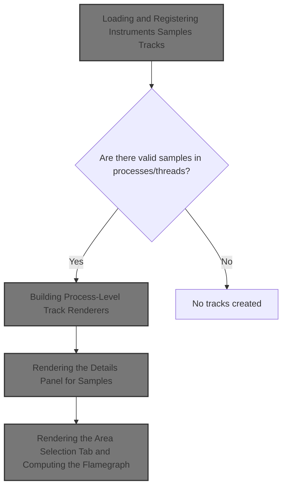

This document describes how profiling trace data is loaded and transformed into interactive visualizations. When a trace is loaded, processes and threads with profiling samples are identified, tracks are created for each, and detailed flamegraph visualizations are displayed. Users can interact with these tracks and select areas of the trace to update the analysis in real time.



# Loading and Registering Instruments Samples Tracks

```mermaid
%%{init: {"flowchart": {"defaultRenderer": "elk"}} }%%
flowchart TD
    node1["Load profiling data from trace"]
    click node1 openCode "ui/src/plugins/dev.perfetto.InstrumentsSamplesProfile/index.ts:75:78"
    node1 --> node2{"Are there processes/threads with valid samples?"}
    click node2 openCode "ui/src/plugins/dev.perfetto.InstrumentsSamplesProfile/index.ts:79:84"
    node2 -->|"Yes"| node3["Prepare to create tracks"]
    click node3 openCode "ui/src/plugins/dev.perfetto.InstrumentsSamplesProfile/index.ts:85:86"
    node2 -->|"No"| node5["Finish loading"]
    click node5 openCode "ui/src/plugins/dev.perfetto.InstrumentsSamplesProfile/index.ts:174:174"
    subgraph loop1["For each process/thread with valid samples"]
      node3 --> node4["Building Process-Level Track Renderers"]
      
      node4 --> node6["Rendering the Details Panel for Samples"]
      
    end
    node6 --> node5["Finish loading"]

classDef HeadingStyle fill:#777777,stroke:#333,stroke-width:2px;
click node4 goToHeading "Building Process-Level Track Renderers"
node4:::HeadingStyle
click node6 goToHeading "Rendering the Details Panel for Samples"
node6:::HeadingStyle

%% Swimm:
%% %%{init: {"flowchart": {"defaultRenderer": "elk"}} }%%
%% flowchart TD
%%     node1["Load profiling data from trace"]
%%     click node1 openCode "<SwmPath>[ui/…/dev.perfetto.InstrumentsSamplesProfile/index.ts](ui/src/plugins/dev.perfetto.InstrumentsSamplesProfile/index.ts)</SwmPath>:75:78"
%%     node1 --> node2{"Are there processes/threads with valid samples?"}
%%     click node2 openCode "<SwmPath>[ui/…/dev.perfetto.InstrumentsSamplesProfile/index.ts](ui/src/plugins/dev.perfetto.InstrumentsSamplesProfile/index.ts)</SwmPath>:79:84"
%%     node2 -->|"Yes"| node3["Prepare to create tracks"]
%%     click node3 openCode "<SwmPath>[ui/…/dev.perfetto.InstrumentsSamplesProfile/index.ts](ui/src/plugins/dev.perfetto.InstrumentsSamplesProfile/index.ts)</SwmPath>:85:86"
%%     node2 -->|"No"| node5["Finish loading"]
%%     click node5 openCode "<SwmPath>[ui/…/dev.perfetto.InstrumentsSamplesProfile/index.ts](ui/src/plugins/dev.perfetto.InstrumentsSamplesProfile/index.ts)</SwmPath>:174:174"
%%     subgraph loop1["For each process/thread with valid samples"]
%%       node3 --> node4["Building Process-Level Track Renderers"]
%%       
%%       node4 --> node6["Rendering the Details Panel for Samples"]
%%       
%%     end
%%     node6 --> node5["Finish loading"]
%% 
%% classDef HeadingStyle fill:#777777,stroke:#333,stroke-width:2px;
%% click node4 goToHeading "Building Process-Level Track Renderers"
%% node4:::HeadingStyle
%% click node6 goToHeading "Rendering the Details Panel for Samples"
%% node6:::HeadingStyle
```



<SwmSnippet path="/ui/src/plugins/dev.perfetto.InstrumentsSamplesProfile/index.ts" line="75">

---

We set up plugin state, query for processes with relevant samples, and register a track for each. We call into the track creation logic next to handle how these tracks are built and shown.

```typescript
  async onTraceLoad(ctx: Trace): Promise<void> {
    this.store = ctx.mountStore(InstrumentsSamplesProfilePlugin.id, (init) =>
      this.migrateInstrumentsSamplesProfilePluginState(init),
    );
    const pResult = await ctx.engine.query(`
      select distinct upid
      from instruments_sample
      join thread using (utid)
      where callsite_id is not null and upid is not null
    `);
    const store = assertExists(this.store);
    for (const it = pResult.iter({upid: NUM}); it.valid(); it.next()) {
      const upid = it.upid;
      const uri = makeUriForProc(upid);
      ctx.tracks.registerTrack({
        uri,
        tags: {
          kinds: [INSTRUMENTS_SAMPLES_PROFILE_TRACK_KIND],
          upid,
        },
        renderer: createProcessInstrumentsSamplesProfileTrack(
          ctx,
          uri,
          upid,
          store.state.detailsPanelFlamegraphState,
          (state) => {
            store.edit((draft) => {
              draft.detailsPanelFlamegraphState = state;
            });
          },
        ),
      });
```

---

</SwmSnippet>

## Building Process-Level Track Renderers

```mermaid
%%{init: {"flowchart": {"defaultRenderer": "elk"}} }%%
flowchart TD
  node1["Filter profiling samples for the selected process (only with callsite info)"]
  click node1 openCode "ui/src/plugins/dev.perfetto.InstrumentsSamplesProfile/instruments_samples_profile_track.ts:55:63"
  node1 --> node2["Create a visual track grouped and colored by callsite"]
  click node2 openCode "ui/src/plugins/dev.perfetto.InstrumentsSamplesProfile/instruments_samples_profile_track.ts:45:71"
  node2 --> node3{"For each sample, is there an existing details panel state?"}
  click node3 openCode "ui/src/plugins/dev.perfetto.InstrumentsSamplesProfile/instruments_samples_profile_track.ts:119:119"
  node3 -->|"Yes"| node4["Use existing state for flamegraph"]
  click node4 openCode "ui/src/plugins/dev.perfetto.InstrumentsSamplesProfile/instruments_samples_profile_track.ts:119:119"
  node3 -->|"No"| node5["Create default flamegraph state"]
  click node5 openCode "ui/src/plugins/dev.perfetto.InstrumentsSamplesProfile/instruments_samples_profile_track.ts:119:119"
  node4 --> node6{"Is there a saved serialization state?"}
  node5 --> node6
  click node6 openCode "ui/src/plugins/dev.perfetto.InstrumentsSamplesProfile/instruments_samples_profile_track.ts:126:130"
  node6 -->|"Yes"| node7["Update state and notify UI"]
  click node7 openCode "ui/src/plugins/dev.perfetto.InstrumentsSamplesProfile/instruments_samples_profile_track.ts:127:129"
  node6 -->|"No"| node8["Show interactive flamegraph and metrics for the sample"]
  click node8 openCode "ui/src/plugins/dev.perfetto.InstrumentsSamplesProfile/instruments_samples_profile_track.ts:132:143"
  node7 --> node8
classDef HeadingStyle fill:#777777,stroke:#333,stroke-width:2px;

%% Swimm:
%% %%{init: {"flowchart": {"defaultRenderer": "elk"}} }%%
%% flowchart TD
%%   node1["Filter profiling samples for the selected process (only with callsite info)"]
%%   click node1 openCode "<SwmPath>[ui/…/dev.perfetto.InstrumentsSamplesProfile/instruments_samples_profile_track.ts](ui/src/plugins/dev.perfetto.InstrumentsSamplesProfile/instruments_samples_profile_track.ts)</SwmPath>:55:63"
%%   node1 --> node2["Create a visual track grouped and colored by callsite"]
%%   click node2 openCode "<SwmPath>[ui/…/dev.perfetto.InstrumentsSamplesProfile/instruments_samples_profile_track.ts](ui/src/plugins/dev.perfetto.InstrumentsSamplesProfile/instruments_samples_profile_track.ts)</SwmPath>:45:71"
%%   node2 --> node3{"For each sample, is there an existing details panel state?"}
%%   click node3 openCode "<SwmPath>[ui/…/dev.perfetto.InstrumentsSamplesProfile/instruments_samples_profile_track.ts](ui/src/plugins/dev.perfetto.InstrumentsSamplesProfile/instruments_samples_profile_track.ts)</SwmPath>:119:119"
%%   node3 -->|"Yes"| node4["Use existing state for flamegraph"]
%%   click node4 openCode "<SwmPath>[ui/…/dev.perfetto.InstrumentsSamplesProfile/instruments_samples_profile_track.ts](ui/src/plugins/dev.perfetto.InstrumentsSamplesProfile/instruments_samples_profile_track.ts)</SwmPath>:119:119"
%%   node3 -->|"No"| node5["Create default flamegraph state"]
%%   click node5 openCode "<SwmPath>[ui/…/dev.perfetto.InstrumentsSamplesProfile/instruments_samples_profile_track.ts](ui/src/plugins/dev.perfetto.InstrumentsSamplesProfile/instruments_samples_profile_track.ts)</SwmPath>:119:119"
%%   node4 --> node6{"Is there a saved serialization state?"}
%%   node5 --> node6
%%   click node6 openCode "<SwmPath>[ui/…/dev.perfetto.InstrumentsSamplesProfile/instruments_samples_profile_track.ts](ui/src/plugins/dev.perfetto.InstrumentsSamplesProfile/instruments_samples_profile_track.ts)</SwmPath>:126:130"
%%   node6 -->|"Yes"| node7["Update state and notify UI"]
%%   click node7 openCode "<SwmPath>[ui/…/dev.perfetto.InstrumentsSamplesProfile/instruments_samples_profile_track.ts](ui/src/plugins/dev.perfetto.InstrumentsSamplesProfile/instruments_samples_profile_track.ts)</SwmPath>:127:129"
%%   node6 -->|"No"| node8["Show interactive flamegraph and metrics for the sample"]
%%   click node8 openCode "<SwmPath>[ui/…/dev.perfetto.InstrumentsSamplesProfile/instruments_samples_profile_track.ts](ui/src/plugins/dev.perfetto.InstrumentsSamplesProfile/instruments_samples_profile_track.ts)</SwmPath>:132:143"
%%   node7 --> node8
%% classDef HeadingStyle fill:#777777,stroke:#333,stroke-width:2px;
```



<SwmSnippet path="/ui/src/plugins/dev.perfetto.InstrumentsSamplesProfile/instruments_samples_profile_track.ts" line="38">

---

<SwmToken path="ui/src/plugins/dev.perfetto.InstrumentsSamplesProfile/instruments_samples_profile_track.ts" pos="38:4:4" line-data="export function createProcessInstrumentsSamplesProfileTrack(">`createProcessInstrumentsSamplesProfileTrack`</SwmToken> sets up the process-level track renderer. It defines how to fetch the sample data for a process, how to colorize and name slices, and how to render the details panel for each sample. We need to call this because it encapsulates all the logic for displaying and interacting with process samples in the UI, including flamegraph rendering and state updates.

```typescript
export function createProcessInstrumentsSamplesProfileTrack(
  trace: Trace,
  uri: string,
  upid: number,
  detailsPanelState: FlamegraphState | undefined,
  onDetailsPanelStateChange: (state: FlamegraphState) => void,
) {
  return SliceTrack.create({
    trace,
    uri,
    dataset: new SourceDataset({
      schema: {
        id: NUM,
        ts: LONG,
        callsiteId: NUM,
      },
      src: `
        SELECT
          p.id,
          ts,
          callsite_id as callsiteId,
          upid
        FROM instruments_sample p
        JOIN thread using (utid)
        WHERE callsite_id IS NOT NULL
        ORDER BY ts
      `,
      filter: {
        col: 'upid',
        eq: upid,
      },
    }),
    sliceName: () => 'Instruments Sample',
    colorizer: (row) => getColorForSample(row.callsiteId),
    detailsPanel: (row) => {
      // TODO(lalitm): we should be able remove this around the 26Q2 timeframe
      // We moved serialization from being attached to selections to instead being
      // attached to the plugin that loaded the panel.
      const serialization = {
        schema: FLAMEGRAPH_STATE_SCHEMA.optional(),
        state: undefined as FlamegraphState | undefined,
      };
      const flamegraph = new QueryFlamegraph(trace);
      const metrics: ReadonlyArray<QueryFlamegraphMetric> =
        metricsFromTableOrSubquery(
          `
            (
              select
                id,
                parent_id as parentId,
                name,
                mapping_name,
                source_file || ':' || line_number as source_location,
                self_count
              from _callstacks_for_callsites!((
                select p.callsite_id
                from instruments_sample p
                join thread t using (utid)
                where p.ts >= ${row.ts}
                  and p.ts <= ${row.ts}
                  and t.upid = ${upid}
              ))
            )
          `,
          [
            {
              name: 'Instruments Samples',
              unit: '',
              columnName: 'self_count',
            },
          ],
          'include perfetto module appleos.instruments.samples',
          [{name: 'mapping_name', displayName: 'Mapping'}],
          [
            {
              name: 'source_location',
              displayName: 'Source Location',
              mergeAggregation: 'ONE_OR_SUMMARY',
            },
          ],
        );
      let state = detailsPanelState ?? Flamegraph.createDefaultState(metrics);

      return {
        load: async () => {
          // If the state in the serialization is not undefined, we should read from
          // it.
          // TODO(lalitm): remove this in 26Q2 - see comment on `serialization`.
          if (serialization.state !== undefined) {
            state = Flamegraph.updateState(serialization.state, metrics);
            onDetailsPanelStateChange(state);
            serialization.state = undefined;
          }
        },
        render: () =>
          renderDetailsPanel(
            trace,
            flamegraph,
            metrics,
            Time.fromRaw(row.ts),
            state,
            (newState) => {
              state = newState;
              onDetailsPanelStateChange(newState);
            },
          ),
        serialization,
      };
    },
  });
}
```

---

</SwmSnippet>

## Rendering the Details Panel for Samples

```mermaid
%%{init: {"flowchart": {"defaultRenderer": "elk"}} }%%
flowchart TD
    node1["Render Instruments Samples details panel"]
    click node1 openCode "ui/src/plugins/dev.perfetto.InstrumentsSamplesProfile/instruments_samples_profile_track.ts:260:295"
    subgraph node2["Show timestamps"]
      node3["Show first timestamp"]
      click node3 openCode "ui/src/plugins/dev.perfetto.InstrumentsSamplesProfile/instruments_samples_profile_track.ts:277:281"
      node4["Show last timestamp"]
      click node4 openCode "ui/src/plugins/dev.perfetto.InstrumentsSamplesProfile/instruments_samples_profile_track.ts:284:288"
    end
    node1 --> node2
    node1 --> node5["Display flamegraph visualization"]
    click node5 openCode "ui/src/plugins/dev.perfetto.InstrumentsSamplesProfile/instruments_samples_profile_track.ts:292:292"

classDef HeadingStyle fill:#777777,stroke:#333,stroke-width:2px;

%% Swimm:
%% %%{init: {"flowchart": {"defaultRenderer": "elk"}} }%%
%% flowchart TD
%%     node1["Render Instruments Samples details panel"]
%%     click node1 openCode "<SwmPath>[ui/…/dev.perfetto.InstrumentsSamplesProfile/instruments_samples_profile_track.ts](ui/src/plugins/dev.perfetto.InstrumentsSamplesProfile/instruments_samples_profile_track.ts)</SwmPath>:260:295"
%%     subgraph node2["Show timestamps"]
%%       node3["Show first timestamp"]
%%       click node3 openCode "<SwmPath>[ui/…/dev.perfetto.InstrumentsSamplesProfile/instruments_samples_profile_track.ts](ui/src/plugins/dev.perfetto.InstrumentsSamplesProfile/instruments_samples_profile_track.ts)</SwmPath>:277:281"
%%       node4["Show last timestamp"]
%%       click node4 openCode "<SwmPath>[ui/…/dev.perfetto.InstrumentsSamplesProfile/instruments_samples_profile_track.ts](ui/src/plugins/dev.perfetto.InstrumentsSamplesProfile/instruments_samples_profile_track.ts)</SwmPath>:284:288"
%%     end
%%     node1 --> node2
%%     node1 --> node5["Display flamegraph visualization"]
%%     click node5 openCode "<SwmPath>[ui/…/dev.perfetto.InstrumentsSamplesProfile/instruments_samples_profile_track.ts](ui/src/plugins/dev.perfetto.InstrumentsSamplesProfile/instruments_samples_profile_track.ts)</SwmPath>:292:292"
%% 
%% classDef HeadingStyle fill:#777777,stroke:#333,stroke-width:2px;
```



<SwmSnippet path="/ui/src/plugins/dev.perfetto.InstrumentsSamplesProfile/instruments_samples_profile_track.ts" line="260">

---

<SwmToken path="ui/src/plugins/dev.perfetto.InstrumentsSamplesProfile/instruments_samples_profile_track.ts" pos="260:2:2" line-data="function renderDetailsPanel(">`renderDetailsPanel`</SwmToken> builds the UI for the sample's details panel, embedding the flamegraph and showing timestamps. We call render here to actually display the flamegraph and handle state changes from user interaction.

```typescript
function renderDetailsPanel(
  trace: Trace,
  flamegraph: QueryFlamegraph,
  metrics: ReadonlyArray<QueryFlamegraphMetric>,
  ts: time,
  state: FlamegraphState | undefined,
  onStateChange: (state: FlamegraphState) => void,
) {
  return m(
    '.pf-flamegraph-profile',
    m(
      DetailsShell,
      {
        fillHeight: true,
        title: 'Instruments Samples',
        buttons: m(Stack, {orientation: 'horizontal', spacing: 'large'}, [
          m('span', [
            `First timestamp: `,
            m(Timestamp, {
              trace,
              ts,
            }),
          ]),
          m('span', [
            `Last timestamp: `,
            m(Timestamp, {
              trace,
              ts,
            }),
          ]),
        ]),
      },
      flamegraph.render({metrics, state, onStateChange}),
    ),
  );
}
```

---

</SwmSnippet>

## Rendering the Area Selection Tab and Computing the Flamegraph

```mermaid
%%{init: {"flowchart": {"defaultRenderer": "elk"}} }%%
flowchart TD
  node1["User selects area to profile"] --> node2{"Has the selection changed?"}
  click node1 openCode "ui/src/plugins/dev.perfetto.InstrumentsSamplesProfile/index.ts:182:210"
  node2 -->|"Yes"| node3["Update flamegraph visualization"]
  click node2 openCode "ui/src/plugins/dev.perfetto.InstrumentsSamplesProfile/index.ts:183:192"
  node2 -->|"No"| node4["Use existing flamegraph visualization"]
  click node4 openCode "ui/src/plugins/dev.perfetto.InstrumentsSamplesProfile/index.ts:193:195"
  node3 --> node5{"Is flamegraph data available?"}
  node4 --> node5
  click node3 openCode "ui/src/plugins/dev.perfetto.InstrumentsSamplesProfile/index.ts:187:192"
  node5 -->|"Yes"| node6["Show flamegraph visualization to user"]
  click node5 openCode "ui/src/plugins/dev.perfetto.InstrumentsSamplesProfile/index.ts:196:209"
  click node6 openCode "ui/src/plugins/dev.perfetto.InstrumentsSamplesProfile/index.ts:196:209"
  node5 -->|"No"| node7["Show nothing"]
  click node7 openCode "ui/src/plugins/dev.perfetto.InstrumentsSamplesProfile/index.ts:194:195"

classDef HeadingStyle fill:#777777,stroke:#333,stroke-width:2px;

%% Swimm:
%% %%{init: {"flowchart": {"defaultRenderer": "elk"}} }%%
%% flowchart TD
%%   node1["User selects area to profile"] --> node2{"Has the selection changed?"}
%%   click node1 openCode "<SwmPath>[ui/…/dev.perfetto.InstrumentsSamplesProfile/index.ts](ui/src/plugins/dev.perfetto.InstrumentsSamplesProfile/index.ts)</SwmPath>:182:210"
%%   node2 -->|"Yes"| node3["Update flamegraph visualization"]
%%   click node2 openCode "<SwmPath>[ui/…/dev.perfetto.InstrumentsSamplesProfile/index.ts](ui/src/plugins/dev.perfetto.InstrumentsSamplesProfile/index.ts)</SwmPath>:183:192"
%%   node2 -->|"No"| node4["Use existing flamegraph visualization"]
%%   click node4 openCode "<SwmPath>[ui/…/dev.perfetto.InstrumentsSamplesProfile/index.ts](ui/src/plugins/dev.perfetto.InstrumentsSamplesProfile/index.ts)</SwmPath>:193:195"
%%   node3 --> node5{"Is flamegraph data available?"}
%%   node4 --> node5
%%   click node3 openCode "<SwmPath>[ui/…/dev.perfetto.InstrumentsSamplesProfile/index.ts](ui/src/plugins/dev.perfetto.InstrumentsSamplesProfile/index.ts)</SwmPath>:187:192"
%%   node5 -->|"Yes"| node6["Show flamegraph visualization to user"]
%%   click node5 openCode "<SwmPath>[ui/…/dev.perfetto.InstrumentsSamplesProfile/index.ts](ui/src/plugins/dev.perfetto.InstrumentsSamplesProfile/index.ts)</SwmPath>:196:209"
%%   click node6 openCode "<SwmPath>[ui/…/dev.perfetto.InstrumentsSamplesProfile/index.ts](ui/src/plugins/dev.perfetto.InstrumentsSamplesProfile/index.ts)</SwmPath>:196:209"
%%   node5 -->|"No"| node7["Show nothing"]
%%   click node7 openCode "<SwmPath>[ui/…/dev.perfetto.InstrumentsSamplesProfile/index.ts](ui/src/plugins/dev.perfetto.InstrumentsSamplesProfile/index.ts)</SwmPath>:194:195"
%% 
%% classDef HeadingStyle fill:#777777,stroke:#333,stroke-width:2px;
```



<SwmSnippet path="/ui/src/plugins/dev.perfetto.InstrumentsSamplesProfile/index.ts" line="182">

---

In <SwmToken path="ui/src/plugins/dev.perfetto.InstrumentsSamplesProfile/index.ts" pos="182:1:1" line-data="      render: (selection: AreaSelection) =&gt; {">`render`</SwmToken>, we check if the area selection has changed. If it has, we call <SwmToken path="ui/src/plugins/dev.perfetto.InstrumentsSamplesProfile/index.ts" pos="187:7:7" line-data="          flamegraphWithMetrics = this.computeInstrumentsSampleFlamegraph(">`computeInstrumentsSampleFlamegraph`</SwmToken> to get new flamegraph data for the current selection. This avoids redundant work and keeps the UI responsive.

```typescript
      render: (selection: AreaSelection) => {
        const changed =
          previousSelection === undefined ||
          !areaSelectionsEqual(previousSelection, selection);
        if (changed) {
          flamegraphWithMetrics = this.computeInstrumentsSampleFlamegraph(
            trace,
            selection,
          );
          previousSelection = selection;
        }
        if (flamegraphWithMetrics === undefined) {
          return undefined;
        }
```

---

</SwmSnippet>

<SwmSnippet path="/ui/src/plugins/dev.perfetto.InstrumentsSamplesProfile/index.ts" line="214">

---

<SwmToken path="ui/src/plugins/dev.perfetto.InstrumentsSamplesProfile/index.ts" pos="214:3:3" line-data="  private computeInstrumentsSampleFlamegraph(">`computeInstrumentsSampleFlamegraph`</SwmToken> pulls upids and utids from the selection, builds a SQL query to fetch callstack metrics for the selected time range, updates the store's flamegraph state with the results, and returns a new flamegraph object. This ties the backend data to the UI state.

```typescript
  private computeInstrumentsSampleFlamegraph(
    trace: Trace,
    currentSelection: AreaSelection,
  ): QueryFlamegraphWithMetrics | undefined {
    const upids = getUpidsFromInstrumentsSampleAreaSelection(currentSelection);
    const utids = getUtidsFromInstrumentsSampleAreaSelection(currentSelection);
    if (utids.length === 0 && upids.length === 0) {
      return undefined;
    }
    const metrics = metricsFromTableOrSubquery(
      `
      (
        select id, parent_id as parentId, name, self_count
        from _callstacks_for_callsites!((
          select p.callsite_id
          from instruments_sample p
          join thread t using (utid)
          where p.ts >= ${currentSelection.start}
            and p.ts <= ${currentSelection.end}
            and (
              p.utid in (${utids.join(',')})
              or t.upid in (${upids.join(',')})
            )
        ))
      )
    `,
      [
        {
          name: 'Instruments Samples',
          unit: '',
          columnName: 'self_count',
        },
      ],
      'include perfetto module appleos.instruments.samples',
    );
    const store = assertExists(this.store);
    store.edit((draft) => {
      draft.areaSelectionFlamegraphState = Flamegraph.updateState(
        draft.areaSelectionFlamegraphState,
        metrics,
      );
    });
    return {flamegraph: new QueryFlamegraph(trace), metrics};
  }
```

---

</SwmSnippet>

<SwmSnippet path="/ui/src/plugins/dev.perfetto.InstrumentsSamplesProfile/index.ts" line="196">

---

Now that we've got the flamegraph and metrics from <SwmToken path="ui/src/plugins/dev.perfetto.InstrumentsSamplesProfile/index.ts" pos="187:7:7" line-data="          flamegraphWithMetrics = this.computeInstrumentsSampleFlamegraph(">`computeInstrumentsSampleFlamegraph`</SwmToken>, the render function hands them off to the flamegraph's render method, along with the current store state and a callback for state changes. This keeps the UI in sync with the latest data and user interactions.

```typescript
        const {flamegraph, metrics} = flamegraphWithMetrics;
        const store = assertExists(this.store);
        return {
          isLoading: false,
          content: flamegraph.render({
            metrics,
            state: store.state.areaSelectionFlamegraphState,
            onStateChange: (state) => {
              store.edit((draft) => {
                draft.areaSelectionFlamegraphState = state;
              });
            },
          }),
        };
      },
```

---

</SwmSnippet>

## Registering Thread Tracks and Finalizing Trace Load

<SwmSnippet path="/ui/src/plugins/dev.perfetto.InstrumentsSamplesProfile/index.ts" line="107">

---

Back in <SwmToken path="ui/src/plugins/dev.perfetto.InstrumentsSamplesProfile/index.ts" pos="75:3:3" line-data="  async onTraceLoad(ctx: Trace): Promise&lt;void&gt; {">`onTraceLoad`</SwmToken>, after setting up process tracks, we query for threads with relevant samples and register a thread-level track for each. We call into <SwmToken path="ui/src/plugins/dev.perfetto.InstrumentsSamplesProfile/index.ts" pos="150:4:4" line-data="        renderer: createThreadInstrumentsSamplesProfileTrack(">`createThreadInstrumentsSamplesProfileTrack`</SwmToken> next to handle the specifics of thread track creation and rendering, which is needed for detailed thread-level callstack inspection in the UI.

```typescript
      const group = ctx.plugins
        .getPlugin(ProcessThreadGroupsPlugin)
        .getGroupForProcess(upid);
      const track = new TrackNode({
        uri,
        name: 'Process Callstacks',
        sortOrder: -40,
      });
      group?.addChildInOrder(track);
    }
    const tResult = await ctx.engine.query(`
      select distinct
        utid,
        tid,
        thread.name as threadName,
        upid
      from instruments_sample
      join thread using (utid)
      where callsite_id is not null
    `);
    for (
      const it = tResult.iter({
        utid: NUM,
        tid: LONG,
        threadName: STR_NULL,
        upid: NUM_NULL,
      });
      it.valid();
      it.next()
    ) {
      const {threadName, utid, tid, upid} = it;
      const name =
        threadName === null
          ? `Thread Callstacks ${tid}`
          : `${threadName} Callstacks ${tid}`;
      const uri = `${getThreadUriPrefix(upid, utid)}_instruments_samples_profile`;
      ctx.tracks.registerTrack({
        uri,
        tags: {
          kinds: [INSTRUMENTS_SAMPLES_PROFILE_TRACK_KIND],
          utid,
          upid: upid ?? undefined,
        },
        renderer: createThreadInstrumentsSamplesProfileTrack(
          ctx,
          uri,
          utid,
          store.state.detailsPanelFlamegraphState,
          (state) => {
            store.edit((draft) => {
              draft.detailsPanelFlamegraphState = state;
            });
          },
        ),
      });
```

---

</SwmSnippet>

<SwmSnippet path="/ui/src/plugins/dev.perfetto.InstrumentsSamplesProfile/instruments_samples_profile_track.ts" line="150">

---

<SwmToken path="ui/src/plugins/dev.perfetto.InstrumentsSamplesProfile/instruments_samples_profile_track.ts" pos="150:4:4" line-data="export function createThreadInstrumentsSamplesProfileTrack(">`createThreadInstrumentsSamplesProfileTrack`</SwmToken> sets up the thread-level track renderer, mirroring the process track logic but filtering data by thread ID (utid). This is needed to visualize and interact with samples at the thread level in the UI.

```typescript
export function createThreadInstrumentsSamplesProfileTrack(
  trace: Trace,
  uri: string,
  utid: number,
  detailsPanelState: FlamegraphState | undefined,
  onDetailsPanelStateChange: (state: FlamegraphState) => void,
) {
  return SliceTrack.create({
    trace,
    uri,
    dataset: new SourceDataset({
      schema: {
        id: NUM,
        ts: LONG,
        callsiteId: NUM,
      },
      src: `
        SELECT
          p.id,
          ts,
          callsite_id as callsiteId,
          utid
        FROM instruments_sample p
        WHERE callsite_id IS NOT NULL
        ORDER BY ts
      `,
      filter: {
        col: 'utid',
        eq: utid,
      },
    }),
    sliceName: () => 'Instruments Sample',
    colorizer: (row) => getColorForSample(row.callsiteId),
    detailsPanel: (row) => {
      // TODO(lalitm): we should be able remove this around the 26Q2 timeframe
      // We moved serialization from being attached to selections to instead being
      // attached to the plugin that loaded the panel.
      const serialization = {
        schema: FLAMEGRAPH_STATE_SCHEMA.optional(),
        state: undefined as FlamegraphState | undefined,
      };
      const flamegraph = new QueryFlamegraph(trace);
      const metrics: ReadonlyArray<QueryFlamegraphMetric> =
        metricsFromTableOrSubquery(
          `
            (
              select
                id,
                parent_id as parentId,
                name,
                mapping_name,
                source_file || ':' || line_number as source_location,
                self_count
              from _callstacks_for_callsites!((
                select p.callsite_id
                from instruments_sample p
                where p.ts >= ${row.ts}
                  and p.ts <= ${row.ts}
                  and p.utid = ${utid}
              ))
            )
          `,
          [
            {
              name: 'Instruments Samples',
              unit: '',
              columnName: 'self_count',
            },
          ],
          'include perfetto module appleos.instruments.samples',
          [{name: 'mapping_name', displayName: 'Mapping'}],
          [
            {
              name: 'source_location',
              displayName: 'Source Location',
              mergeAggregation: 'ONE_OR_SUMMARY',
            },
          ],
        );
      let state = detailsPanelState ?? Flamegraph.createDefaultState(metrics);

      return {
        load: async () => {
          // If the state in the serialization is not undefined, we should read from
          // it.
          // TODO(lalitm): remove this in 26Q2 - see comment on `serialization`.
          if (serialization.state !== undefined) {
            state = Flamegraph.updateState(serialization.state, metrics);
            onDetailsPanelStateChange(state);
            serialization.state = undefined;
          }
        },
        render: () =>
          renderDetailsPanel(
            trace,
            flamegraph,
            metrics,
            Time.fromRaw(row.ts),
            state,
            (newState) => {
              state = newState;
              onDetailsPanelStateChange(newState);
            },
          ),
        serialization,
      };
    },
  });
}
```

---

</SwmSnippet>

<SwmSnippet path="/ui/src/plugins/dev.perfetto.InstrumentsSamplesProfile/index.ts" line="162">

---

After setting up thread tracks in <SwmToken path="ui/src/plugins/dev.perfetto.InstrumentsSamplesProfile/index.ts" pos="75:3:3" line-data="  async onTraceLoad(ctx: Trace): Promise&lt;void&gt; {">`onTraceLoad`</SwmToken>, we hook up a listener to select samples when the trace is ready, and then register an area selection tab using <SwmToken path="ui/src/plugins/dev.perfetto.InstrumentsSamplesProfile/index.ts" pos="173:9:9" line-data="    ctx.selection.registerAreaSelectionTab(this.createAreaSelectionTab(ctx));">`createAreaSelectionTab`</SwmToken>. This brings the plugin's flamegraph UI into the trace viewer for interactive exploration.

```typescript
      const group = ctx.plugins
        .getPlugin(ProcessThreadGroupsPlugin)
        .getGroupForThread(utid);
      const track = new TrackNode({uri, name, sortOrder: -50});
      group?.addChildInOrder(track);
    }

    ctx.onTraceReady.addListener(async () => {
      await selectInstrumentsSample(ctx);
    });

    ctx.selection.registerAreaSelectionTab(this.createAreaSelectionTab(ctx));
  }
```

---

</SwmSnippet>

# Setting Up the Area Selection Tab

```mermaid
%%{init: {"flowchart": {"defaultRenderer": "elk"}} }%%
flowchart TD
  node1["User selects area in trace"] --> node2{"Has selection changed?"}
  click node1 openCode "ui/src/plugins/dev.perfetto.InstrumentsSamplesProfile/index.ts:182:185"
  node2 -->|"Yes"| node3["Update flamegraph and metrics for new selection"]
  click node2 openCode "ui/src/plugins/dev.perfetto.InstrumentsSamplesProfile/index.ts:183:192"
  node2 -->|"No"| node5
  node3 --> node5{"Is flamegraph data available?"}
  click node3 openCode "ui/src/plugins/dev.perfetto.InstrumentsSamplesProfile/index.ts:187:191"
  node5 -->|"Yes"| node6["Display flamegraph and metrics"]
  click node5 openCode "ui/src/plugins/dev.perfetto.InstrumentsSamplesProfile/index.ts:193:209"
  node5 -->|"No"| node7["Show empty view"]
  click node6 openCode "ui/src/plugins/dev.perfetto.InstrumentsSamplesProfile/index.ts:196:209"
  click node7 openCode "ui/src/plugins/dev.perfetto.InstrumentsSamplesProfile/index.ts:194:195"

classDef HeadingStyle fill:#777777,stroke:#333,stroke-width:2px;

%% Swimm:
%% %%{init: {"flowchart": {"defaultRenderer": "elk"}} }%%
%% flowchart TD
%%   node1["User selects area in trace"] --> node2{"Has selection changed?"}
%%   click node1 openCode "<SwmPath>[ui/…/dev.perfetto.InstrumentsSamplesProfile/index.ts](ui/src/plugins/dev.perfetto.InstrumentsSamplesProfile/index.ts)</SwmPath>:182:185"
%%   node2 -->|"Yes"| node3["Update flamegraph and metrics for new selection"]
%%   click node2 openCode "<SwmPath>[ui/…/dev.perfetto.InstrumentsSamplesProfile/index.ts](ui/src/plugins/dev.perfetto.InstrumentsSamplesProfile/index.ts)</SwmPath>:183:192"
%%   node2 -->|"No"| node5
%%   node3 --> node5{"Is flamegraph data available?"}
%%   click node3 openCode "<SwmPath>[ui/…/dev.perfetto.InstrumentsSamplesProfile/index.ts](ui/src/plugins/dev.perfetto.InstrumentsSamplesProfile/index.ts)</SwmPath>:187:191"
%%   node5 -->|"Yes"| node6["Display flamegraph and metrics"]
%%   click node5 openCode "<SwmPath>[ui/…/dev.perfetto.InstrumentsSamplesProfile/index.ts](ui/src/plugins/dev.perfetto.InstrumentsSamplesProfile/index.ts)</SwmPath>:193:209"
%%   node5 -->|"No"| node7["Show empty view"]
%%   click node6 openCode "<SwmPath>[ui/…/dev.perfetto.InstrumentsSamplesProfile/index.ts](ui/src/plugins/dev.perfetto.InstrumentsSamplesProfile/index.ts)</SwmPath>:196:209"
%%   click node7 openCode "<SwmPath>[ui/…/dev.perfetto.InstrumentsSamplesProfile/index.ts](ui/src/plugins/dev.perfetto.InstrumentsSamplesProfile/index.ts)</SwmPath>:194:195"
%% 
%% classDef HeadingStyle fill:#777777,stroke:#333,stroke-width:2px;
```



<SwmSnippet path="/ui/src/plugins/dev.perfetto.InstrumentsSamplesProfile/index.ts" line="176">

---

In <SwmToken path="ui/src/plugins/dev.perfetto.InstrumentsSamplesProfile/index.ts" pos="176:3:3" line-data="  private createAreaSelectionTab(trace: Trace) {">`createAreaSelectionTab`</SwmToken>, we set up a render function that only recomputes the flamegraph if the selection changes. If it does, we call <SwmToken path="ui/src/plugins/dev.perfetto.InstrumentsSamplesProfile/index.ts" pos="187:7:7" line-data="          flamegraphWithMetrics = this.computeInstrumentsSampleFlamegraph(">`computeInstrumentsSampleFlamegraph`</SwmToken> to get new data. This keeps things fast and avoids redundant work.

```typescript
  private createAreaSelectionTab(trace: Trace) {
    let previousSelection: undefined | AreaSelection;
    let flamegraphWithMetrics: QueryFlamegraphWithMetrics | undefined;
    return {
      id: 'instruments_sample_flamegraph',
      name: 'Instruments Sample Flamegraph',
      render: (selection: AreaSelection) => {
        const changed =
          previousSelection === undefined ||
          !areaSelectionsEqual(previousSelection, selection);
        if (changed) {
          flamegraphWithMetrics = this.computeInstrumentsSampleFlamegraph(
            trace,
            selection,
          );
          previousSelection = selection;
        }
        if (flamegraphWithMetrics === undefined) {
          return undefined;
        }
```

---

</SwmSnippet>

<SwmSnippet path="/ui/src/plugins/dev.perfetto.InstrumentsSamplesProfile/index.ts" line="196">

---

After getting the flamegraph and metrics from <SwmToken path="ui/src/plugins/dev.perfetto.InstrumentsSamplesProfile/index.ts" pos="187:7:7" line-data="          flamegraphWithMetrics = this.computeInstrumentsSampleFlamegraph(">`computeInstrumentsSampleFlamegraph`</SwmToken>, the render function in <SwmToken path="ui/src/plugins/dev.perfetto.InstrumentsSamplesProfile/index.ts" pos="173:9:9" line-data="    ctx.selection.registerAreaSelectionTab(this.createAreaSelectionTab(ctx));">`createAreaSelectionTab`</SwmToken> hands them to the flamegraph's render method, along with the current store state and a callback to update state on changes. This keeps the UI and store in sync.

```typescript
        const {flamegraph, metrics} = flamegraphWithMetrics;
        const store = assertExists(this.store);
        return {
          isLoading: false,
          content: flamegraph.render({
            metrics,
            state: store.state.areaSelectionFlamegraphState,
            onStateChange: (state) => {
              store.edit((draft) => {
                draft.areaSelectionFlamegraphState = state;
              });
            },
          }),
        };
      },
    };
  }
```

---

</SwmSnippet>

&nbsp;

*This is an auto-generated document by Swimm 🌊 and has not yet been verified by a human*

<SwmMeta version="3.0.0" repo-id="Z2l0aHViJTNBJTNBY3BsdXNwbHVzLXBlcmZldHRvJTNBJTNBcmljYXJkb2xvcGV6Zw==" repo-name="cplusplus-perfetto"><sup>Powered by [Swimm](https://app.swimm.io/)</sup></SwmMeta>
