This document outlines how event latency details are loaded and presented in the analysis panel. When a user selects a slice, the system retrieves its name, gathers detailed information, and enriches it with jank, thread, and event latency breakdown data. The resulting panel provides a comprehensive view for analyzing scroll event performance.

# Loading the initial slice name and starting data fetch

<SwmSnippet path="/ui/src/plugins/org.chromium.ChromeScrollJank/event_latency_details_panel.ts" line="135">

---

In <SwmToken path="ui/src/plugins/org.chromium.ChromeScrollJank/event_latency_details_panel.ts" pos="135:3:3" line-data="  async load() {">`load`</SwmToken>, we kick off the flow by querying the trace engine for the slice name using the current id. Once we have the name, we immediately call <SwmToken path="ui/src/plugins/org.chromium.ChromeScrollJank/event_latency_details_panel.ts" pos="149:5:5" line-data="    await this.loadSlice();">`loadSlice`</SwmToken> to fetch more detailed slice data. This sets up the rest of the loading sequence for the panel.

```typescript
  async load() {
    const queryResult = await this.trace.engine.query(`
      SELECT
        name
      FROM slice
      WHERE id = ${this.id}
      `);

    const iter = queryResult.firstRow({
      name: STR,
    });

    this.name = iter.name;

    await this.loadSlice();
```

---

</SwmSnippet>

## Fetching detailed slice data

<SwmSnippet path="/ui/src/plugins/org.chromium.ChromeScrollJank/event_latency_details_panel.ts" line="155">

---

<SwmToken path="ui/src/plugins/org.chromium.ChromeScrollJank/event_latency_details_panel.ts" pos="155:3:3" line-data="  async loadSlice() {">`loadSlice`</SwmToken> fetches the full details for the slice using <SwmToken path="ui/src/plugins/org.chromium.ChromeScrollJank/event_latency_details_panel.ts" pos="156:9:9" line-data="    this.sliceDetails = await getSlice(">`getSlice`</SwmToken>, which pulls in all the relevant fields for the UI. Next, we call into the slice utils to get this richer data.

```typescript
  async loadSlice() {
    this.sliceDetails = await getSlice(
      this.trace.engine,
      asSliceSqlId(this.id),
    );
  }
```

---

</SwmSnippet>

## Resolving slice details from constraints

```mermaid
%%{init: {"flowchart": {"defaultRenderer": "elk"}} }%%
flowchart TD
  node1["Request details for slice with given id"]
  click node1 openCode "ui/src/components/sql_utils/slice.ts:150:152"
  node1 --> node2{"Are multiple slices found?"}
  click node2 openCode "ui/src/components/sql_utils/slice.ts:153:154"
  node2 -->|"Yes"| node3["Error: More than one slice exists for this id"]
  click node3 openCode "ui/src/components/sql_utils/slice.ts:154:155"
  node2 -->|"No"| node4{"Is any slice found?"}
  click node4 openCode "ui/src/components/sql_utils/slice.ts:156:157"
  node4 -->|"No"| node5["Return undefined (no slice found)"]
  click node5 openCode "ui/src/components/sql_utils/slice.ts:157:158"
  node4 -->|"Yes"| node6["Return details for the unique slice"]
  click node6 openCode "ui/src/components/sql_utils/slice.ts:159:160"

classDef HeadingStyle fill:#777777,stroke:#333,stroke-width:2px;

%% Swimm:
%% %%{init: {"flowchart": {"defaultRenderer": "elk"}} }%%
%% flowchart TD
%%   node1["Request details for slice with given id"]
%%   click node1 openCode "<SwmPath>[ui/…/sql_utils/slice.ts](ui/src/components/sql_utils/slice.ts)</SwmPath>:150:152"
%%   node1 --> node2{"Are multiple slices found?"}
%%   click node2 openCode "<SwmPath>[ui/…/sql_utils/slice.ts](ui/src/components/sql_utils/slice.ts)</SwmPath>:153:154"
%%   node2 -->|"Yes"| node3["Error: More than one slice exists for this id"]
%%   click node3 openCode "<SwmPath>[ui/…/sql_utils/slice.ts](ui/src/components/sql_utils/slice.ts)</SwmPath>:154:155"
%%   node2 -->|"No"| node4{"Is any slice found?"}
%%   click node4 openCode "<SwmPath>[ui/…/sql_utils/slice.ts](ui/src/components/sql_utils/slice.ts)</SwmPath>:156:157"
%%   node4 -->|"No"| node5["Return undefined (no slice found)"]
%%   click node5 openCode "<SwmPath>[ui/…/sql_utils/slice.ts](ui/src/components/sql_utils/slice.ts)</SwmPath>:157:158"
%%   node4 -->|"Yes"| node6["Return details for the unique slice"]
%%   click node6 openCode "<SwmPath>[ui/…/sql_utils/slice.ts](ui/src/components/sql_utils/slice.ts)</SwmPath>:159:160"
%% 
%% classDef HeadingStyle fill:#777777,stroke:#333,stroke-width:2px;
```



<SwmSnippet path="/ui/src/components/sql_utils/slice.ts" line="146">

---

<SwmToken path="ui/src/components/sql_utils/slice.ts" pos="146:6:6" line-data="export async function getSlice(">`getSlice`</SwmToken> calls <SwmToken path="ui/src/components/sql_utils/slice.ts" pos="150:9:9" line-data="  const result = await getSliceFromConstraints(engine, {">`getSliceFromConstraints`</SwmToken> to fetch the slice by id, checks for uniqueness, and returns the enriched slice details. Next, we call into the constraints-based fetch to get the actual data.

```typescript
export async function getSlice(
  engine: Engine,
  id: SliceSqlId,
): Promise<SliceDetails | undefined> {
  const result = await getSliceFromConstraints(engine, {
    filters: [`id=${id}`],
  });
  if (result.length > 1) {
    throw new Error(`slice table has more than one row with id ${id}`);
  }
  if (result.length === 0) {
    return undefined;
  }
  return result[0];
}
```

---

</SwmSnippet>

<SwmSnippet path="/ui/src/components/sql_utils/slice.ts" line="76">

---

<SwmToken path="ui/src/components/sql_utils/slice.ts" pos="76:6:6" line-data="export async function getSliceFromConstraints(">`getSliceFromConstraints`</SwmToken> runs a query for slices matching the constraints, then enriches each slice with thread, process, and argument info using repo-specific helpers. This gives us all the context we need for each slice.

```typescript
export async function getSliceFromConstraints(
  engine: Engine,
  constraints: SQLConstraints,
): Promise<SliceDetails[]> {
  const query = await engine.query(`
    SELECT
      id,
      name,
      ts,
      dur,
      track_id as trackId,
      depth,
      parent_id as parentId,
      thread_dur as threadDur,
      thread_ts as threadTs,
      category,
      arg_set_id as argSetId,
      ABS_TIME_STR(ts) as absTime
    FROM slice
    ${constraintsToQuerySuffix(constraints)}`);
  const it = query.iter({
    id: NUM,
    name: STR_NULL,
    ts: LONG,
    dur: LONG,
    trackId: NUM,
    depth: NUM,
    parentId: NUM_NULL,
    threadDur: LONG_NULL,
    threadTs: LONG_NULL,
    category: STR_NULL,
    argSetId: NUM_NULL,
    absTime: STR_NULL,
  });

  const result: SliceDetails[] = [];
  for (; it.valid(); it.next()) {
    const {utid, upid} = await getUtidAndUpid(engine, it.trackId);

    const thread: ThreadInfo | undefined =
      utid === undefined ? undefined : await getThreadInfo(engine, utid);
    const process: ProcessInfo | undefined =
      thread !== undefined
        ? thread.process
        : upid === undefined
          ? undefined
          : await getProcessInfo(engine, upid);

    result.push({
      id: asSliceSqlId(it.id),
      name: it.name ?? undefined,
      ts: Time.fromRaw(it.ts),
      dur: it.dur,
      trackId: it.trackId,
      depth: it.depth,
      parentId: asSliceSqlId(it.parentId ?? undefined),
      thread,
      process,
      threadDur: it.threadDur ?? undefined,
      threadTs: exists(it.threadTs) ? Time.fromRaw(it.threadTs) : undefined,
      category: it.category ?? undefined,
      args: exists(it.argSetId)
        ? await getArgs(engine, asArgSetId(it.argSetId))
        : undefined,
      absTime: it.absTime ?? undefined,
    });
  }
```

---

</SwmSnippet>

## Loading jank, threads, and breakdown data

```mermaid
%%{init: {"flowchart": {"defaultRenderer": "elk"}} }%%
flowchart TD
    node1["Start loading event latency details"]
    click node1 openCode "ui/src/plugins/org.chromium.ChromeScrollJank/event_latency_details_panel.ts:150:153"
    node1 --> node2["Load jank slice data"]
    click node2 openCode "ui/src/plugins/org.chromium.ChromeScrollJank/event_latency_details_panel.ts:150:150"
    node2 --> node3["Load relevant thread data"]
    click node3 openCode "ui/src/plugins/org.chromium.ChromeScrollJank/event_latency_details_panel.ts:151:151"
    node3 --> node4["Load event latency breakdown data"]
    click node4 openCode "ui/src/plugins/org.chromium.ChromeScrollJank/event_latency_details_panel.ts:152:152"
    node4 --> node5["Panel ready for user analysis"]
    click node5 openCode "ui/src/plugins/org.chromium.ChromeScrollJank/event_latency_details_panel.ts:153:153"

classDef HeadingStyle fill:#777777,stroke:#333,stroke-width:2px;

%% Swimm:
%% %%{init: {"flowchart": {"defaultRenderer": "elk"}} }%%
%% flowchart TD
%%     node1["Start loading event latency details"]
%%     click node1 openCode "<SwmPath>[ui/…/org.chromium.ChromeScrollJank/event_latency_details_panel.ts](ui/src/plugins/org.chromium.ChromeScrollJank/event_latency_details_panel.ts)</SwmPath>:150:153"
%%     node1 --> node2["Load jank slice data"]
%%     click node2 openCode "<SwmPath>[ui/…/org.chromium.ChromeScrollJank/event_latency_details_panel.ts](ui/src/plugins/org.chromium.ChromeScrollJank/event_latency_details_panel.ts)</SwmPath>:150:150"
%%     node2 --> node3["Load relevant thread data"]
%%     click node3 openCode "<SwmPath>[ui/…/org.chromium.ChromeScrollJank/event_latency_details_panel.ts](ui/src/plugins/org.chromium.ChromeScrollJank/event_latency_details_panel.ts)</SwmPath>:151:151"
%%     node3 --> node4["Load event latency breakdown data"]
%%     click node4 openCode "<SwmPath>[ui/…/org.chromium.ChromeScrollJank/event_latency_details_panel.ts](ui/src/plugins/org.chromium.ChromeScrollJank/event_latency_details_panel.ts)</SwmPath>:152:152"
%%     node4 --> node5["Panel ready for user analysis"]
%%     click node5 openCode "<SwmPath>[ui/…/org.chromium.ChromeScrollJank/event_latency_details_panel.ts](ui/src/plugins/org.chromium.ChromeScrollJank/event_latency_details_panel.ts)</SwmPath>:153:153"
%% 
%% classDef HeadingStyle fill:#777777,stroke:#333,stroke-width:2px;
```



<SwmSnippet path="/ui/src/plugins/org.chromium.ChromeScrollJank/event_latency_details_panel.ts" line="150">

---

Back in <SwmToken path="ui/src/plugins/org.chromium.ChromeScrollJank/event_latency_details_panel.ts" pos="135:3:3" line-data="  async load() {">`load`</SwmToken>, after getting the slice details, we load jank info, relevant threads, and finally the event latency breakdown. Each step builds up the data needed for the panel.

```typescript
    await this.loadJankSlice();
    await this.loadRelevantThreads();
    await this.loadEventLatencyBreakdown();
  }
```

---

</SwmSnippet>

# Fetching event latency breakdowns

```mermaid
%%{init: {"flowchart": {"defaultRenderer": "elk"}} }%%
flowchart TD
  node1{"Is a scroll event selected?"}
  click node1 openCode "ui/src/plugins/org.chromium.ChromeScrollJank/event_latency_details_panel.ts:236:237"
  node1 -->|"No"| node2["Stop: No event selected"]
  click node2 openCode "ui/src/plugins/org.chromium.ChromeScrollJank/event_latency_details_panel.ts:237:237"
  node1 -->|"Yes"| node3["Load breakdown for selected scroll event"]
  click node3 openCode "ui/src/plugins/org.chromium.ChromeScrollJank/event_latency_details_panel.ts:239:243"
  node3 --> node4{"Is there a previous scroll event?"}
  click node4 openCode "ui/src/plugins/org.chromium.ChromeScrollJank/event_latency_details_panel.ts:245:262"
  node4 -->|"Yes"| node5["Load breakdown for previous scroll event"]
  click node5 openCode "ui/src/plugins/org.chromium.ChromeScrollJank/event_latency_details_panel.ts:263:267"
  node4 -->|"No"| node7{"Is there a next scroll event?"}
  node5 --> node7
  click node7 openCode "ui/src/plugins/org.chromium.ChromeScrollJank/event_latency_details_panel.ts:269:285"
  node7 -->|"Yes"| node8["Load breakdown for next scroll event"]
  click node8 openCode "ui/src/plugins/org.chromium.ChromeScrollJank/event_latency_details_panel.ts:286:290"
  node7 -->|"No"| node9["End"]
  click node9 openCode "ui/src/plugins/org.chromium.ChromeScrollJank/event_latency_details_panel.ts:291:291"
classDef HeadingStyle fill:#777777,stroke:#333,stroke-width:2px;

%% Swimm:
%% %%{init: {"flowchart": {"defaultRenderer": "elk"}} }%%
%% flowchart TD
%%   node1{"Is a scroll event selected?"}
%%   click node1 openCode "<SwmPath>[ui/…/org.chromium.ChromeScrollJank/event_latency_details_panel.ts](ui/src/plugins/org.chromium.ChromeScrollJank/event_latency_details_panel.ts)</SwmPath>:236:237"
%%   node1 -->|"No"| node2["Stop: No event selected"]
%%   click node2 openCode "<SwmPath>[ui/…/org.chromium.ChromeScrollJank/event_latency_details_panel.ts](ui/src/plugins/org.chromium.ChromeScrollJank/event_latency_details_panel.ts)</SwmPath>:237:237"
%%   node1 -->|"Yes"| node3["Load breakdown for selected scroll event"]
%%   click node3 openCode "<SwmPath>[ui/…/org.chromium.ChromeScrollJank/event_latency_details_panel.ts](ui/src/plugins/org.chromium.ChromeScrollJank/event_latency_details_panel.ts)</SwmPath>:239:243"
%%   node3 --> node4{"Is there a previous scroll event?"}
%%   click node4 openCode "<SwmPath>[ui/…/org.chromium.ChromeScrollJank/event_latency_details_panel.ts](ui/src/plugins/org.chromium.ChromeScrollJank/event_latency_details_panel.ts)</SwmPath>:245:262"
%%   node4 -->|"Yes"| node5["Load breakdown for previous scroll event"]
%%   click node5 openCode "<SwmPath>[ui/…/org.chromium.ChromeScrollJank/event_latency_details_panel.ts](ui/src/plugins/org.chromium.ChromeScrollJank/event_latency_details_panel.ts)</SwmPath>:263:267"
%%   node4 -->|"No"| node7{"Is there a next scroll event?"}
%%   node5 --> node7
%%   click node7 openCode "<SwmPath>[ui/…/org.chromium.ChromeScrollJank/event_latency_details_panel.ts](ui/src/plugins/org.chromium.ChromeScrollJank/event_latency_details_panel.ts)</SwmPath>:269:285"
%%   node7 -->|"Yes"| node8["Load breakdown for next scroll event"]
%%   click node8 openCode "<SwmPath>[ui/…/org.chromium.ChromeScrollJank/event_latency_details_panel.ts](ui/src/plugins/org.chromium.ChromeScrollJank/event_latency_details_panel.ts)</SwmPath>:286:290"
%%   node7 -->|"No"| node9["End"]
%%   click node9 openCode "<SwmPath>[ui/…/org.chromium.ChromeScrollJank/event_latency_details_panel.ts](ui/src/plugins/org.chromium.ChromeScrollJank/event_latency_details_panel.ts)</SwmPath>:291:291"
%% classDef HeadingStyle fill:#777777,stroke:#333,stroke-width:2px;
```



<SwmSnippet path="/ui/src/plugins/org.chromium.ChromeScrollJank/event_latency_details_panel.ts" line="235">

---

<SwmToken path="ui/src/plugins/org.chromium.ChromeScrollJank/event_latency_details_panel.ts" pos="235:3:3" line-data="  async loadEventLatencyBreakdown() {">`loadEventLatencyBreakdown`</SwmToken> grabs the breakdown for the current event latency, then looks up the previous and next event latencies by id and fetches their breakdowns too. This gives us context for the event sequence.

```typescript
  async loadEventLatencyBreakdown() {
    if (this.topEventLatencyId === undefined) {
      return;
    }
    this.eventLatencyBreakdown = await getDescendantSliceTree(
      this.trace.engine,
      this.topEventLatencyId,
    );

    // TODO(altimin): this should only consider EventLatencies within the same scroll.
    const prevEventLatency = (
      await this.trace.engine.query(`
      INCLUDE PERFETTO MODULE chrome.event_latency;
      SELECT
        id
      FROM chrome_event_latencies
      WHERE event_type IN (
        'FIRST_GESTURE_SCROLL_UPDATE',
        'GESTURE_SCROLL_UPDATE',
        'INERTIAL_GESTURE_SCROLL_UPDATE')
      AND is_presented
      AND id < ${this.topEventLatencyId}
      ORDER BY id DESC
      LIMIT 1
      ;
    `)
    ).maybeFirstRow({id: NUM});
    if (prevEventLatency !== undefined) {
      this.prevEventLatencyBreakdown = await getDescendantSliceTree(
        this.trace.engine,
        asSliceSqlId(prevEventLatency.id),
      );
    }

    const nextEventLatency = (
      await this.trace.engine.query(`
      INCLUDE PERFETTO MODULE chrome.event_latency;
      SELECT
        id
      FROM chrome_event_latencies
      WHERE event_type IN (
        'FIRST_GESTURE_SCROLL_UPDATE',
        'GESTURE_SCROLL_UPDATE',
        'INERTIAL_GESTURE_SCROLL_UPDATE')
      AND is_presented
      AND id > ${this.topEventLatencyId}
      ORDER BY id DESC
      LIMIT 1;
    `)
    ).maybeFirstRow({id: NUM});
    if (nextEventLatency !== undefined) {
      this.nextEventLatencyBreakdown = await getDescendantSliceTree(
        this.trace.engine,
        asSliceSqlId(nextEventLatency.id),
      );
    }
  }
```

---

</SwmSnippet>

# Building the slice tree for breakdown

```mermaid
%%{init: {"flowchart": {"defaultRenderer": "elk"}} }%%
flowchart TD
  node1["Find the starting slice"]
  click node1 openCode "ui/src/components/sql_utils/slice.ts:174:174"
  node1 --> node2{"Is the starting slice found?"}
  click node2 openCode "ui/src/components/sql_utils/slice.ts:175:177"
  node2 -->|"No"| node3["Return nothing"]
  click node3 openCode "ui/src/components/sql_utils/slice.ts:176:177"
  node2 -->|"Yes"| node4["Collect all descendant slices"]
  click node4 openCode "ui/src/components/sql_utils/slice.ts:178:187"
  node4 --> node5["Initialize slice tree structure"]
  click node5 openCode "ui/src/components/sql_utils/slice.ts:188:196"
  
  subgraph loop1["For each slice in descendants"]
    node5 --> node6{"Does the slice have a parent (parentId)?"}
    click node6 openCode "ui/src/components/sql_utils/slice.ts:198:202"
    node6 -->|"Yes"| node7["Attach slice as child to its parent"]
    click node7 openCode "ui/src/components/sql_utils/slice.ts:199:202"
    node7 --> node5
    node6 -->|"No"| node5
  end
  node5 --> node8["Return the slice tree"]
  click node8 openCode "ui/src/components/sql_utils/slice.ts:203:203"
classDef HeadingStyle fill:#777777,stroke:#333,stroke-width:2px;

%% Swimm:
%% %%{init: {"flowchart": {"defaultRenderer": "elk"}} }%%
%% flowchart TD
%%   node1["Find the starting slice"]
%%   click node1 openCode "<SwmPath>[ui/…/sql_utils/slice.ts](ui/src/components/sql_utils/slice.ts)</SwmPath>:174:174"
%%   node1 --> node2{"Is the starting slice found?"}
%%   click node2 openCode "<SwmPath>[ui/…/sql_utils/slice.ts](ui/src/components/sql_utils/slice.ts)</SwmPath>:175:177"
%%   node2 -->|"No"| node3["Return nothing"]
%%   click node3 openCode "<SwmPath>[ui/…/sql_utils/slice.ts](ui/src/components/sql_utils/slice.ts)</SwmPath>:176:177"
%%   node2 -->|"Yes"| node4["Collect all descendant slices"]
%%   click node4 openCode "<SwmPath>[ui/…/sql_utils/slice.ts](ui/src/components/sql_utils/slice.ts)</SwmPath>:178:187"
%%   node4 --> node5["Initialize slice tree structure"]
%%   click node5 openCode "<SwmPath>[ui/…/sql_utils/slice.ts](ui/src/components/sql_utils/slice.ts)</SwmPath>:188:196"
%%   
%%   subgraph loop1["For each slice in descendants"]
%%     node5 --> node6{"Does the slice have a parent (<SwmToken path="ui/src/components/sql_utils/slice.ts" pos="88:5:5" line-data="      parent_id as parentId,">`parentId`</SwmToken>)?"}
%%     click node6 openCode "<SwmPath>[ui/…/sql_utils/slice.ts](ui/src/components/sql_utils/slice.ts)</SwmPath>:198:202"
%%     node6 -->|"Yes"| node7["Attach slice as child to its parent"]
%%     click node7 openCode "<SwmPath>[ui/…/sql_utils/slice.ts](ui/src/components/sql_utils/slice.ts)</SwmPath>:199:202"
%%     node7 --> node5
%%     node6 -->|"No"| node5
%%   end
%%   node5 --> node8["Return the slice tree"]
%%   click node8 openCode "<SwmPath>[ui/…/sql_utils/slice.ts](ui/src/components/sql_utils/slice.ts)</SwmPath>:203:203"
%% classDef HeadingStyle fill:#777777,stroke:#333,stroke-width:2px;
```



<SwmSnippet path="/ui/src/components/sql_utils/slice.ts" line="170">

---

In <SwmToken path="ui/src/components/sql_utils/slice.ts" pos="170:6:6" line-data="export async function getDescendantSliceTree(">`getDescendantSliceTree`</SwmToken>, we first fetch the root slice by id. If it's missing, we bail out; otherwise, we move on to fetch its descendants.

```typescript
export async function getDescendantSliceTree(
  engine: Engine,
  id: SliceSqlId,
): Promise<SliceTreeNode | undefined> {
  const slice = await getSlice(engine, id);
  if (slice === undefined) {
    return undefined;
  }
```

---

</SwmSnippet>

<SwmSnippet path="/ui/src/components/sql_utils/slice.ts" line="178">

---

After getting the root slice, we query for descendants on the same track, with depth and timestamp constraints, so we only get slices that belong to the same tree. Next, we build the tree structure from these results.

```typescript
  const descendants = await getSliceFromConstraints(engine, {
    filters: [
      `track_id=${slice.trackId}`,
      `depth >= ${slice.depth}`,
      `ts >= ${slice.ts}`,
      // TODO(altimin): consider making `dur` undefined here instead of -1.
      slice.dur >= 0 ? `ts <= (${slice.ts} + ${slice.dur})` : undefined,
    ],
    orderBy: ['ts', 'depth'],
  });
```

---

</SwmSnippet>

<SwmSnippet path="/ui/src/components/sql_utils/slice.ts" line="188">

---

After fetching descendants, we build a map of slices keyed by id, then link up parents and children to form the tree. This structure is what the breakdown UI uses.

```typescript
  const slices: {[key: SliceSqlId]: SliceTreeNode} = Object.fromEntries(
    descendants.map((slice) => [
      slice.id,
      {
        children: [],
        ...slice,
      },
    ]),
  );
  for (const [_, slice] of Object.entries(slices)) {
    if (slice.parentId !== undefined) {
      const parent = slices[slice.parentId];
      slice.parent = parent;
      parent.children.push(slice);
    }
  }
```

---

</SwmSnippet>

&nbsp;

*This is an auto-generated document by Swimm 🌊 and has not yet been verified by a human*

<SwmMeta version="3.0.0" repo-id="Z2l0aHViJTNBJTNBY3BsdXNwbHVzLXBlcmZldHRvJTNBJTNBcmljYXJkb2xvcGV6Zw==" repo-name="cplusplus-perfetto"><sup>Powered by [Swimm](https://app.swimm.io/)</sup></SwmMeta>
