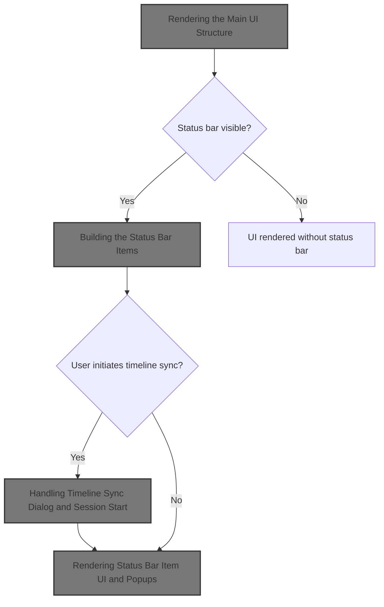

This document describes how the main user interface is constructed, presenting navigation, content, and interactive controls for trace analysis. The flow takes the current application state and trace data as input, and outputs a fully rendered UI, including optional status bar controls like timeline synchronization. Status bar items are dynamically built based on available plugins, allowing users to synchronize timelines across tabs and access advanced analysis features.



# Rendering the Main UI Structure

```mermaid
%%{init: {"flowchart": {"defaultRenderer": "elk"}} }%%
flowchart TD
  node1["Render main UI components: Sidebar, Topbar, Page, Cookie Consent, Modal, Perf Stats"]
  click node1 openCode "ui/src/frontend/ui_main.ts:60:72"
  node2{"Is something loading?"}
  click node2 openCode "ui/src/frontend/ui_main.ts:55:58"
  node2 -->|"Yes"| node3["Set loading indicator to indeterminate"]
  click node3 openCode "ui/src/frontend/ui_main.ts:63:65"
  node2 -->|"No"| node4["Set loading indicator to none"]
  click node4 openCode "ui/src/frontend/ui_main.ts:63:65"
  node5{"Show status bar?"}
  click node5 openCode "ui/src/frontend/ui_main.ts:70:70"
  node5 -->|"Yes"| node6["Render status bar"]
  click node6 openCode "ui/src/frontend/ui_main.ts:70:70"
  node5 -->|"No"| node7["Do not render status bar"]
  click node7 openCode "ui/src/frontend/ui_main.ts:70:70"

classDef HeadingStyle fill:#777777,stroke:#333,stroke-width:2px;

%% Swimm:
%% %%{init: {"flowchart": {"defaultRenderer": "elk"}} }%%
%% flowchart TD
%%   node1["Render main UI components: Sidebar, Topbar, Page, Cookie Consent, Modal, Perf Stats"]
%%   click node1 openCode "<SwmPath>[ui/…/frontend/ui_main.ts](ui/src/frontend/ui_main.ts)</SwmPath>:60:72"
%%   node2{"Is something loading?"}
%%   click node2 openCode "<SwmPath>[ui/…/frontend/ui_main.ts](ui/src/frontend/ui_main.ts)</SwmPath>:55:58"
%%   node2 -->|"Yes"| node3["Set loading indicator to indeterminate"]
%%   click node3 openCode "<SwmPath>[ui/…/frontend/ui_main.ts](ui/src/frontend/ui_main.ts)</SwmPath>:63:65"
%%   node2 -->|"No"| node4["Set loading indicator to none"]
%%   click node4 openCode "<SwmPath>[ui/…/frontend/ui_main.ts](ui/src/frontend/ui_main.ts)</SwmPath>:63:65"
%%   node5{"Show status bar?"}
%%   click node5 openCode "<SwmPath>[ui/…/frontend/ui_main.ts](ui/src/frontend/ui_main.ts)</SwmPath>:70:70"
%%   node5 -->|"Yes"| node6["Render status bar"]
%%   click node6 openCode "<SwmPath>[ui/…/frontend/ui_main.ts](ui/src/frontend/ui_main.ts)</SwmPath>:70:70"
%%   node5 -->|"No"| node7["Do not render status bar"]
%%   click node7 openCode "<SwmPath>[ui/…/frontend/ui_main.ts](ui/src/frontend/ui_main.ts)</SwmPath>:70:70"
%% 
%% classDef HeadingStyle fill:#777777,stroke:#333,stroke-width:2px;
```



<SwmSnippet path="/ui/src/frontend/ui_main.ts" line="50">

---

<SwmToken path="ui/src/frontend/ui_main.ts" pos="50:1:1" line-data="  view(): m.Children {">`view`</SwmToken> sets up the main UI layout, pulling in the sidebar, topbar, loading indicator, page content, and optionally the status bar. We call <SwmToken path="ui/src/frontend/ui_main.ts" pos="70:9:9" line-data="      showStatusBarFlag.get() &amp;&amp; renderStatusBar(trace),">`renderStatusBar`</SwmToken>(trace) next to inject status bar items (like sync controls) into the UI if the flag is set, letting us surface trace-related actions and info to the user.

```typescript
  view(): m.Children {
    // Update the trace reference on each render so that it's kept up to date.
    const app = AppImpl.instance;
    const trace = app.trace;

    const isSomethingLoading =
      app.isLoadingTrace ||
      (trace?.engine.numRequestsPending ?? 0) > 0 ||
      taskTracker.hasPendingTasks();

    return m('main.pf-ui-main', [
      m(Sidebar),
      m(Topbar, {trace}),
      m(LinearProgress, {
        className: 'pf-ui-main__loading',
        state: isSomethingLoading ? 'indeterminate' : 'none',
      }),
      m('.pf-ui-main__page-container', app.pages.renderPageForCurrentRoute()),
      m(CookieConsent),
      maybeRenderFullscreenModalDialog(),
      showStatusBarFlag.get() && renderStatusBar(trace),
      app.perfDebugging.renderPerfStats(),
    ]);
  }
```

---

</SwmSnippet>

# Building the Status Bar Items

<SwmSnippet path="/ui/src/frontend/statusbar.ts" line="23">

---

In <SwmToken path="ui/src/frontend/statusbar.ts" pos="23:4:4" line-data="export function renderStatusBar(trace: Trace | undefined): m.Children {">`renderStatusBar`</SwmToken>, we map over the trace's status bar items and call each item's <SwmToken path="ui/src/frontend/statusbar.ts" pos="27:20:20" line-data="      const {icon, label, intent, onclick} = item.renderItem();">`renderItem`</SwmToken> to get its display config. We need to call into the <SwmToken path="ui/src/plugins/dev.perfetto.TimelineSync/index.ts" pos="24:11:11" line-data="const PLUGIN_ID = &#39;dev.perfetto.TimelineSync&#39;;">`TimelineSync`</SwmToken> plugin next because one of these items is the timeline sync control, and its <SwmToken path="ui/src/frontend/statusbar.ts" pos="27:20:20" line-data="      const {icon, label, intent, onclick} = item.renderItem();">`renderItem`</SwmToken> provides the UI and logic for syncing timelines across tabs.

```typescript
export function renderStatusBar(trace: Trace | undefined): m.Children {
  return m(
    '.pf-statusbar',
    trace?.statusbar.statusBarItems.map((item) => {
      const {icon, label, intent, onclick} = item.renderItem();
```

---

</SwmSnippet>

## Defining Timeline Sync Button Behavior

<SwmSnippet path="/ui/src/plugins/dev.perfetto.TimelineSync/index.ts" line="88">

---

<SwmToken path="ui/src/plugins/dev.perfetto.TimelineSync/index.ts" pos="88:1:1" line-data="      renderItem: () =&gt; {">`renderItem`</SwmToken> returns the config for the timeline sync button, setting its label, icon, intent (active/inactive), and click handler. If sync isn't active, the button opens the sync dialog, so we need to call <SwmToken path="ui/src/plugins/dev.perfetto.TimelineSync/index.ts" pos="95:10:10" line-data="            : () =&gt; this.showTimelineSyncDialog(),">`showTimelineSyncDialog`</SwmToken> next to handle user interaction.

```typescript
      renderItem: () => {
        return {
          label: `Timeline Sync`,
          icon: 'sync',
          intent: this.active ? Intent.Success : Intent.None,
          onclick: this.active
            ? undefined
            : () => this.showTimelineSyncDialog(),
        };
      },
```

---

</SwmSnippet>

## Handling Timeline Sync Dialog and Session Start

```mermaid
%%{init: {"flowchart": {"defaultRenderer": "elk"}} }%%
flowchart TD
  node1["Show synchronization dialog"]
  click node1 openCode "ui/src/plugins/dev.perfetto.TimelineSync/index.ts:168:238"
  node1 --> node2["Build list of available tabs (including your own)"]
  click node2 openCode "ui/src/plugins/dev.perfetto.TimelineSync/index.ts:200:212"
  
  subgraph loop1["For each available tab"]
    node2 --> node3["Add tab to selection list"]
    click node3 openCode "ui/src/plugins/dev.perfetto.TimelineSync/index.ts:205:212"
  end
  loop1 --> node4["User selects tabs to synchronize"]
  click node4 openCode "ui/src/plugins/dev.perfetto.TimelineSync/index.ts:213:235"
  node4 --> node5{"User confirms synchronization?"}
  click node5 openCode "ui/src/plugins/dev.perfetto.TimelineSync/index.ts:241:245"
  node5 -->|"Yes"| node6["Start synchronization session with selected tabs (including your own)"]
  click node6 openCode "ui/src/plugins/dev.perfetto.TimelineSync/index.ts:172:193"

classDef HeadingStyle fill:#777777,stroke:#333,stroke-width:2px;

%% Swimm:
%% %%{init: {"flowchart": {"defaultRenderer": "elk"}} }%%
%% flowchart TD
%%   node1["Show synchronization dialog"]
%%   click node1 openCode "<SwmPath>[ui/…/dev.perfetto.TimelineSync/index.ts](ui/src/plugins/dev.perfetto.TimelineSync/index.ts)</SwmPath>:168:238"
%%   node1 --> node2["Build list of available tabs (including your own)"]
%%   click node2 openCode "<SwmPath>[ui/…/dev.perfetto.TimelineSync/index.ts](ui/src/plugins/dev.perfetto.TimelineSync/index.ts)</SwmPath>:200:212"
%%   
%%   subgraph loop1["For each available tab"]
%%     node2 --> node3["Add tab to selection list"]
%%     click node3 openCode "<SwmPath>[ui/…/dev.perfetto.TimelineSync/index.ts](ui/src/plugins/dev.perfetto.TimelineSync/index.ts)</SwmPath>:205:212"
%%   end
%%   loop1 --> node4["User selects tabs to synchronize"]
%%   click node4 openCode "<SwmPath>[ui/…/dev.perfetto.TimelineSync/index.ts](ui/src/plugins/dev.perfetto.TimelineSync/index.ts)</SwmPath>:213:235"
%%   node4 --> node5{"User confirms synchronization?"}
%%   click node5 openCode "<SwmPath>[ui/…/dev.perfetto.TimelineSync/index.ts](ui/src/plugins/dev.perfetto.TimelineSync/index.ts)</SwmPath>:241:245"
%%   node5 -->|"Yes"| node6["Start synchronization session with selected tabs (including your own)"]
%%   click node6 openCode "<SwmPath>[ui/…/dev.perfetto.TimelineSync/index.ts](ui/src/plugins/dev.perfetto.TimelineSync/index.ts)</SwmPath>:172:193"
%% 
%% classDef HeadingStyle fill:#777777,stroke:#333,stroke-width:2px;
```



<SwmSnippet path="/ui/src/plugins/dev.perfetto.TimelineSync/index.ts" line="168">

---

In <SwmToken path="ui/src/plugins/dev.perfetto.TimelineSync/index.ts" pos="168:3:3" line-data="  private showTimelineSyncDialog() {">`showTimelineSyncDialog`</SwmToken>, we set up the modal for picking which tabs to sync. When the user confirms, we disable any old session, gather selected clients (plus ourselves), generate a new session ID, and send a <SwmToken path="ui/src/plugins/dev.perfetto.TimelineSync/index.ts" pos="185:5:5" line-data="          cmd: &#39;MSG_SESSION_START&#39;,">`MSG_SESSION_START`</SwmToken> to all clients via \_chan. This resets sync state and triggers a viewport update across tabs.

```typescript
  private showTimelineSyncDialog() {
    let clientsSelect: HTMLSelectElement;

    // This nested function is invoked when the modal dialog buton is pressed.
    const doStartSession = () => {
      // Disable any prior session.
      this.disableTimelineSync(this._sessionId);
      const selectedClients = new Array<ClientId>();
      const sel = assertExists(clientsSelect).selectedOptions;
      for (let i = 0; i < sel.length; i++) {
        const clientId = parseInt(sel[i].value);
        if (!isNaN(clientId)) selectedClients.push(clientId);
      }
```

---

</SwmSnippet>

<SwmSnippet path="/ui/src/plugins/dev.perfetto.TimelineSync/index.ts" line="181">

---

After setting up the sync session, the modal content is rendered on every Mithril pass. We purge inactive clients, sort the rest by load time, and build the select options so the user always sees the latest available tabs for sync.

```typescript
      selectedClients.push(this._clientId); // Always add ourselves.
      this._sessionId = Math.floor(Math.random() * 1_000_000);
      this._chan?.postMessage({
        perfettoSync: {
          cmd: 'MSG_SESSION_START',
          sessionId: this._sessionId,
          clients: selectedClients,
        },
        clientId: this._clientId,
      } as SyncMessage);
      this._initialBoundsForSibling.clear();
      this.scheduleViewportUpdateMessage();
    };

    // The function below is called on every mithril render pass. It's important
    // that this function re-computes the list of other clients on every pass.
    // The user will go to other tabs (which causes an advertise due to the
    // visibilitychange listener) and come back on here while the modal dialog
    // is still being displayed.
    const renderModalContents = (): m.Children => {
      const children: m.Children = [];
      this.purgeInactiveClients();
      const clients = Array.from(this._advertisedClients.entries());
      clients.sort((a, b) => b[1].traceLoadTime - a[1].traceLoadTime);
      for (const [clientId, info] of clients) {
        const opened = new Date(info.traceLoadTime).toLocaleTimeString();
        const attrs: {value: number; selected?: boolean} = {value: clientId};
        if (this._advertisedClients.size === 1) {
          attrs.selected = true;
        }
        children.push(m('option', attrs, `${info.title} (${opened})`));
      }
```

---

</SwmSnippet>

<SwmSnippet path="/ui/src/plugins/dev.perfetto.TimelineSync/index.ts" line="213">

---

The modal returns a flex column with instructions, a dynamic select box for picking tabs, and a button to start syncing. The select options are always current, so users can reliably pick which tabs to sync with.

```typescript
      return m(
        'div',
        {style: 'display: flex;  flex-direction: column;'},
        m(
          'div',
          'Select the perfetto UI tab(s) you want to keep in sync ' +
            '(Ctrl+Click to select many).',
        ),
        m(
          'div',
          "If you don't see the trace listed here, temporarily focus the " +
            'corresponding browser tab and then come back here.',
        ),
        m(
          'select[multiple=multiple][size=8]',
          {
            oncreate: (vnode: m.VnodeDOM) => {
              clientsSelect = vnode.dom as HTMLSelectElement;
            },
          },
          children,
        ),
      );
    };

    showModal({
      title: 'Synchronize timeline across several tabs',
      content: renderModalContents,
      buttons: [
        {
          primary: true,
          text: `Synchronize timelines`,
          action: doStartSession,
        },
      ],
    });
  }
```

---

</SwmSnippet>

## Rendering Status Bar Item UI and Popups

<SwmSnippet path="/ui/src/frontend/statusbar.ts" line="28">

---

Back in <SwmToken path="ui/src/frontend/ui_main.ts" pos="70:9:9" line-data="      showStatusBarFlag.get() &amp;&amp; renderStatusBar(trace),">`renderStatusBar`</SwmToken>, after getting the config from <SwmToken path="ui/src/plugins/dev.perfetto.TimelineSync/index.ts" pos="24:11:11" line-data="const PLUGIN_ID = &#39;dev.perfetto.TimelineSync&#39;;">`TimelineSync`</SwmToken> (or any plugin), we build the button and, if there's popup content, wrap it in a popup. This way, the UI reflects the current sync state and lets users interact with extra controls if provided.

```typescript
      const popupContent = item.popupContent?.();
      const itemContent = m(Button, {
        label,
        icon,
        intent,
        onclick,
        variant: ButtonVariant.Filled,
      });
      if (Boolean(popupContent)) {
        return m(
          Popup,
          {
            position: PopupPosition.Top,
            trigger: itemContent,
          },
          popupContent,
        );
      } else {
        return itemContent;
      }
    }),
  );
}
```

---

</SwmSnippet>

&nbsp;

*This is an auto-generated document by Swimm 🌊 and has not yet been verified by a human*

<SwmMeta version="3.0.0" repo-id="Z2l0aHViJTNBJTNBY3BsdXNwbHVzLXBlcmZldHRvJTNBJTNBcmljYXJkb2xvcGV6Zw==" repo-name="cplusplus-perfetto"><sup>Powered by [Swimm](https://app.swimm.io/)</sup></SwmMeta>
