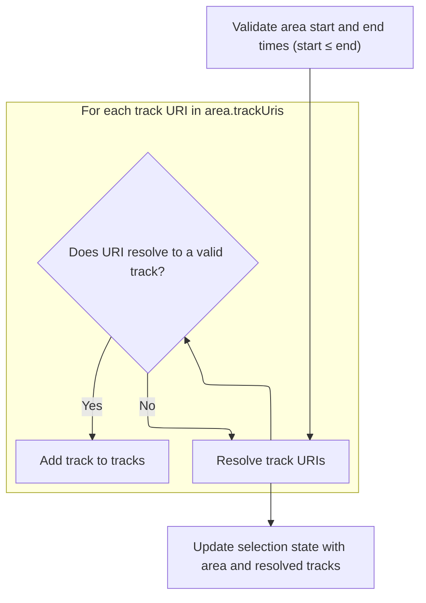

This document describes how users manage area selections in the timeline UI by interacting with checkboxes for tracks and groups. The flow determines the correct checkbox state and updates the selection, allowing users to easily control which tracks are included.

# Rendering Area Selection Checkbox for Tracks

```mermaid
%%{init: {"flowchart": {"defaultRenderer": "elk"}} }%%
flowchart TD
  node1{"Is selection an area?"}
  click node1 openCode "ui/src/frontend/timeline_page/track_view.ts:434:491"
  node1 -->|"Yes"| node2{"Is node a group of tracks?"}
  click node2 openCode "ui/src/frontend/timeline_page/track_view.ts:435:473"
  node2 -->|"Yes"| node3{"How many child tracks are selected?"}
  click node3 openCode "ui/src/frontend/timeline_page/track_view.ts:457:472"
  node3 -->|"All"| node4["Toggling Selection State for Track Groups"]
  
  node3 -->|"Some"| node5["Toggling Selection State for Track Groups"]
  
  node3 -->|"None"| node6["Toggling Selection State for Track Groups"]
  
  node2 -->|"No, node has URI"| node7["Resolving Track URIs to Track Descriptors"]
  
classDef HeadingStyle fill:#777777,stroke:#333,stroke-width:2px;
click node4 goToHeading "Toggling Selection State for Track Groups"
node4:::HeadingStyle
click node5 goToHeading "Toggling Selection State for Track Groups"
node5:::HeadingStyle
click node6 goToHeading "Toggling Selection State for Track Groups"
node6:::HeadingStyle
click node7 goToHeading "Resolving Track URIs to Track Descriptors"
node7:::HeadingStyle

%% Swimm:
%% %%{init: {"flowchart": {"defaultRenderer": "elk"}} }%%
%% flowchart TD
%%   node1{"Is selection an area?"}
%%   click node1 openCode "<SwmPath>[ui/…/timeline_page/track_view.ts](ui/src/frontend/timeline_page/track_view.ts)</SwmPath>:434:491"
%%   node1 -->|"Yes"| node2{"Is node a group of tracks?"}
%%   click node2 openCode "<SwmPath>[ui/…/timeline_page/track_view.ts](ui/src/frontend/timeline_page/track_view.ts)</SwmPath>:435:473"
%%   node2 -->|"Yes"| node3{"How many child tracks are selected?"}
%%   click node3 openCode "<SwmPath>[ui/…/timeline_page/track_view.ts](ui/src/frontend/timeline_page/track_view.ts)</SwmPath>:457:472"
%%   node3 -->|"All"| node4["Toggling Selection State for Track Groups"]
%%   
%%   node3 -->|"Some"| node5["Toggling Selection State for Track Groups"]
%%   
%%   node3 -->|"None"| node6["Toggling Selection State for Track Groups"]
%%   
%%   node2 -->|"No, node has URI"| node7["Resolving Track URIs to Track Descriptors"]
%%   
%% classDef HeadingStyle fill:#777777,stroke:#333,stroke-width:2px;
%% click node4 goToHeading "Toggling Selection State for Track Groups"
%% node4:::HeadingStyle
%% click node5 goToHeading "Toggling Selection State for Track Groups"
%% node5:::HeadingStyle
%% click node6 goToHeading "Toggling Selection State for Track Groups"
%% node6:::HeadingStyle
%% click node7 goToHeading "Resolving Track URIs to Track Descriptors"
%% node7:::HeadingStyle
```



<SwmSnippet path="/ui/src/frontend/timeline_page/track_view.ts" line="430">

---

In <SwmToken path="ui/src/frontend/timeline_page/track_view.ts" pos="430:3:3" line-data="  private renderAreaSelectionCheckbox(): m.Children {">`renderAreaSelectionCheckbox`</SwmToken>, we start by checking if the current selection is of kind 'area' and whether the node is a summary node. For summary nodes, we gather all child tracks with URIs and check which ones are selected. This lets us figure out if all, some, or none of the child tracks are selected, so we can render the right checkbox state (checked, indeterminate, or blank). To actually update the selection, we need to call into the selection manager next, since that's where the logic for toggling group selections lives.

```typescript
  private renderAreaSelectionCheckbox(): m.Children {
    const {trace, node} = this;
    const selectionManager = trace.selection;
    const selection = selectionManager.selection;
    if (selection.kind === 'area') {
      if (node.isSummary) {
        const tracksWithUris = node.flatTracks.filter(
          (t) => t.uri !== undefined,
        ) as ReadonlyArray<RequiredField<TrackNode, 'uri'>>;

        // Check if any nodes within are selected
        const childTracksInSelection = tracksWithUris.map((t) =>
          selection.trackUris.includes(t.uri),
        );

        function renderButton(icon: string, title: string) {
          return m(Button, {
            onclick: () => {
              const uris = tracksWithUris.map((t) => t.uri);
              selectionManager.toggleGroupAreaSelection(uris);
            },
            compact: true,
            icon,
            title,
          });
        }

```

---

</SwmSnippet>

## Toggling Selection State for Track Groups

```mermaid
%%{init: {"flowchart": {"defaultRenderer": "elk"}} }%%
flowchart TD
  node1{"Is selection type 'area'?"}
  click node1 openCode "ui/src/core/selection_manager.ts:192:192"
  node1 -->|"No"| node2["Return"]
  click node2 openCode "ui/src/core/selection_manager.ts:192:192"
  node1 -->|"Yes"| node3{"Are all group tracks selected?"}
  click node3 openCode "ui/src/core/selection_manager.ts:194:196"
  node3 -->|"Yes"| node4["Deselect all group tracks from selection"]
  click node4 openCode "ui/src/core/selection_manager.ts:201:203"
  node3 -->|"No"| node5["Prepare to add unselected tracks"]
  click node5 openCode "ui/src/core/selection_manager.ts:206:210"
  subgraph loop1["For each track in group"]
    node5 --> node6{"Is track already selected?"}
    click node6 openCode "ui/src/core/selection_manager.ts:207:208"
    node6 -->|"No"| node7["Add track to selection"]
    click node7 openCode "ui/src/core/selection_manager.ts:209:209"
    node6 -->|"Yes"| node5
  end
  node4 --> node8["Update selection"]
  node7 --> node8
  click node8 openCode "ui/src/core/selection_manager.ts:212:215"
classDef HeadingStyle fill:#777777,stroke:#333,stroke-width:2px;

%% Swimm:
%% %%{init: {"flowchart": {"defaultRenderer": "elk"}} }%%
%% flowchart TD
%%   node1{"Is selection type 'area'?"}
%%   click node1 openCode "<SwmPath>[ui/…/core/selection_manager.ts](ui/src/core/selection_manager.ts)</SwmPath>:192:192"
%%   node1 -->|"No"| node2["Return"]
%%   click node2 openCode "<SwmPath>[ui/…/core/selection_manager.ts](ui/src/core/selection_manager.ts)</SwmPath>:192:192"
%%   node1 -->|"Yes"| node3{"Are all group tracks selected?"}
%%   click node3 openCode "<SwmPath>[ui/…/core/selection_manager.ts](ui/src/core/selection_manager.ts)</SwmPath>:194:196"
%%   node3 -->|"Yes"| node4["Deselect all group tracks from selection"]
%%   click node4 openCode "<SwmPath>[ui/…/core/selection_manager.ts](ui/src/core/selection_manager.ts)</SwmPath>:201:203"
%%   node3 -->|"No"| node5["Prepare to add unselected tracks"]
%%   click node5 openCode "<SwmPath>[ui/…/core/selection_manager.ts](ui/src/core/selection_manager.ts)</SwmPath>:206:210"
%%   subgraph loop1["For each track in group"]
%%     node5 --> node6{"Is track already selected?"}
%%     click node6 openCode "<SwmPath>[ui/…/core/selection_manager.ts](ui/src/core/selection_manager.ts)</SwmPath>:207:208"
%%     node6 -->|"No"| node7["Add track to selection"]
%%     click node7 openCode "<SwmPath>[ui/…/core/selection_manager.ts](ui/src/core/selection_manager.ts)</SwmPath>:209:209"
%%     node6 -->|"Yes"| node5
%%   end
%%   node4 --> node8["Update selection"]
%%   node7 --> node8
%%   click node8 openCode "<SwmPath>[ui/…/core/selection_manager.ts](ui/src/core/selection_manager.ts)</SwmPath>:212:215"
%% classDef HeadingStyle fill:#777777,stroke:#333,stroke-width:2px;
```



<SwmSnippet path="/ui/src/core/selection_manager.ts" line="190">

---

<SwmToken path="ui/src/core/selection_manager.ts" pos="190:1:1" line-data="  toggleGroupAreaSelection(trackUris: string[]) {">`toggleGroupAreaSelection`</SwmToken> checks if all the given track URIs are already selected. If so, it removes them; otherwise, it adds any that aren't present. It then calls <SwmToken path="ui/src/core/selection_manager.ts" pos="212:3:3" line-data="    this.selectArea({">`selectArea`</SwmToken> to update the selection state, which is needed so the UI and other consumers get the updated selection info.

```typescript
  toggleGroupAreaSelection(trackUris: string[]) {
    const curSelection = this._selection;
    if (curSelection.kind !== 'area') return;

    const allTracksSelected = trackUris.every((t) =>
      curSelection.trackUris.includes(t),
    );

    let newTrackUris: string[];
    if (allTracksSelected) {
      // Deselect all tracks in the list
      newTrackUris = curSelection.trackUris.filter(
        (t) => !trackUris.includes(t),
      );
    } else {
      newTrackUris = curSelection.trackUris.slice();
      trackUris.forEach((t) => {
        if (!newTrackUris.includes(t)) {
          newTrackUris.push(t);
        }
      });
    }
    this.selectArea({
      ...curSelection,
      trackUris: newTrackUris,
    });
  }
```

---

</SwmSnippet>

## Resolving Track URIs to Track Descriptors



<SwmSnippet path="/ui/src/core/selection_manager.ts" line="97">

---

In <SwmToken path="ui/src/core/selection_manager.ts" pos="97:1:1" line-data="  selectArea(area: Area, opts?: SelectionOpts): void {">`selectArea`</SwmToken>, we take the list of track URIs from the area and resolve each one to a track descriptor using the track manager. Only valid tracks are collected. This way, the selection object will have the actual track objects ready for anyone who needs them.

```typescript
  selectArea(area: Area, opts?: SelectionOpts): void {
    const {start, end} = area;
    assertTrue(start <= end);

    // In the case of area selection, the caller provides a list of trackUris.
    // However, all the consumers want to access the resolved Tracks. Rather
    // than delegating this to the various consumers, we resolve them now once
    // and for all and place them in the selection object.
    const tracks = [];
    for (const uri of area.trackUris) {
      const trackDescr = this.trackManager.getTrack(uri);
      if (trackDescr === undefined) continue;
      tracks.push(trackDescr);
    }
```

---

</SwmSnippet>

<SwmSnippet path="/ui/src/core/selection_manager.ts" line="112">

---

Here we build the selection object by copying the area, setting kind to 'area', and attaching the resolved tracks array. This gets passed to <SwmToken path="ui/src/core/selection_manager.ts" pos="112:3:3" line-data="    this.setSelection(">`setSelection`</SwmToken> so downstream code knows exactly what kind of selection it is and has all the data it needs.

```typescript
    this.setSelection(
      {
        ...area,
        kind: 'area',
        tracks,
      },
      opts,
    );
  }
```

---

</SwmSnippet>

## Rendering Checkbox State Based on Group Selection

```mermaid
%%{init: {"flowchart": {"defaultRenderer": "elk"}} }%%
flowchart TD
  node1{"Are there child tracks?"}
  click node1 openCode "ui/src/frontend/timeline_page/track_view.ts:457:473"
  node1 -->|"Yes"| node2{"All child tracks selected?"}
  click node2 openCode "ui/src/frontend/timeline_page/track_view.ts:457:462"
  node2 -->|"Yes"| node3["Show checked checkbox: Remove child tracks from selection"]
  click node3 openCode "ui/src/frontend/timeline_page/track_view.ts:458:461"
  node2 -->|"No"| node4{"Some child tracks selected?"}
  click node4 openCode "ui/src/frontend/timeline_page/track_view.ts:462:467"
  node4 -->|"Yes"| node5["Show indeterminate checkbox: Add remaining child tracks to selection"]
  click node5 openCode "ui/src/frontend/timeline_page/track_view.ts:463:466"
  node4 -->|"No"| node6["Show blank checkbox: Add child tracks to selection"]
  click node6 openCode "ui/src/frontend/timeline_page/track_view.ts:468:471"
  node1 -->|"No"| node7{"Is this a single track with a valid URI?"}
  click node7 openCode "ui/src/frontend/timeline_page/track_view.ts:474:488"
  node7 -->|"Yes"| node8{"Is selection kind 'area'?"}
  click node8 openCode "ui/src/frontend/timeline_page/track_view.ts:477:486"
  node8 -->|"Yes"| node9{"Is track already selected?"}
  click node9 openCode "ui/src/frontend/timeline_page/track_view.ts:483:485"
  node9 -->|"Yes"| node10["Show checked checkbox: Remove track"]
  click node10 openCode "ui/src/frontend/timeline_page/track_view.ts:484:484"
  node9 -->|"No"| node11["Show blank checkbox: Add track to selection"]
  click node11 openCode "ui/src/frontend/timeline_page/track_view.ts:485:485"
  node8 -->|"No"| node12["No checkbox shown"]
  click node12 openCode "ui/src/frontend/timeline_page/track_view.ts:491:492"
  node7 -->|"No"| node12
classDef HeadingStyle fill:#777777,stroke:#333,stroke-width:2px;

%% Swimm:
%% %%{init: {"flowchart": {"defaultRenderer": "elk"}} }%%
%% flowchart TD
%%   node1{"Are there child tracks?"}
%%   click node1 openCode "<SwmPath>[ui/…/timeline_page/track_view.ts](ui/src/frontend/timeline_page/track_view.ts)</SwmPath>:457:473"
%%   node1 -->|"Yes"| node2{"All child tracks selected?"}
%%   click node2 openCode "<SwmPath>[ui/…/timeline_page/track_view.ts](ui/src/frontend/timeline_page/track_view.ts)</SwmPath>:457:462"
%%   node2 -->|"Yes"| node3["Show checked checkbox: Remove child tracks from selection"]
%%   click node3 openCode "<SwmPath>[ui/…/timeline_page/track_view.ts](ui/src/frontend/timeline_page/track_view.ts)</SwmPath>:458:461"
%%   node2 -->|"No"| node4{"Some child tracks selected?"}
%%   click node4 openCode "<SwmPath>[ui/…/timeline_page/track_view.ts](ui/src/frontend/timeline_page/track_view.ts)</SwmPath>:462:467"
%%   node4 -->|"Yes"| node5["Show indeterminate checkbox: Add remaining child tracks to selection"]
%%   click node5 openCode "<SwmPath>[ui/…/timeline_page/track_view.ts](ui/src/frontend/timeline_page/track_view.ts)</SwmPath>:463:466"
%%   node4 -->|"No"| node6["Show blank checkbox: Add child tracks to selection"]
%%   click node6 openCode "<SwmPath>[ui/…/timeline_page/track_view.ts](ui/src/frontend/timeline_page/track_view.ts)</SwmPath>:468:471"
%%   node1 -->|"No"| node7{"Is this a single track with a valid URI?"}
%%   click node7 openCode "<SwmPath>[ui/…/timeline_page/track_view.ts](ui/src/frontend/timeline_page/track_view.ts)</SwmPath>:474:488"
%%   node7 -->|"Yes"| node8{"Is selection kind 'area'?"}
%%   click node8 openCode "<SwmPath>[ui/…/timeline_page/track_view.ts](ui/src/frontend/timeline_page/track_view.ts)</SwmPath>:477:486"
%%   node8 -->|"Yes"| node9{"Is track already selected?"}
%%   click node9 openCode "<SwmPath>[ui/…/timeline_page/track_view.ts](ui/src/frontend/timeline_page/track_view.ts)</SwmPath>:483:485"
%%   node9 -->|"Yes"| node10["Show checked checkbox: Remove track"]
%%   click node10 openCode "<SwmPath>[ui/…/timeline_page/track_view.ts](ui/src/frontend/timeline_page/track_view.ts)</SwmPath>:484:484"
%%   node9 -->|"No"| node11["Show blank checkbox: Add track to selection"]
%%   click node11 openCode "<SwmPath>[ui/…/timeline_page/track_view.ts](ui/src/frontend/timeline_page/track_view.ts)</SwmPath>:485:485"
%%   node8 -->|"No"| node12["No checkbox shown"]
%%   click node12 openCode "<SwmPath>[ui/…/timeline_page/track_view.ts](ui/src/frontend/timeline_page/track_view.ts)</SwmPath>:491:492"
%%   node7 -->|"No"| node12
%% classDef HeadingStyle fill:#777777,stroke:#333,stroke-width:2px;
```



<SwmSnippet path="/ui/src/frontend/timeline_page/track_view.ts" line="457">

---

Back in <SwmToken path="ui/src/frontend/timeline_page/track_view.ts" pos="430:3:3" line-data="  private renderAreaSelectionCheckbox(): m.Children {">`renderAreaSelectionCheckbox`</SwmToken>, after updating the selection, we check the selection state of all child tracks and pick the right checkbox icon: checked if all are selected, indeterminate if some, blank if none. We call <SwmToken path="ui/src/frontend/timeline_page/track_view.ts" pos="458:3:3" line-data="          return renderButton(">`renderButton`</SwmToken> to actually render the button with the correct icon and title, so the user sees the current state and can toggle the group selection.

```typescript
        if (childTracksInSelection.every((b) => b)) {
          return renderButton(
            Icons.Checkbox,
            'Remove child tracks from selection',
          );
        } else if (childTracksInSelection.some((b) => b)) {
          return renderButton(
            Icons.IndeterminateCheckbox,
            'Add remaining child tracks to selection',
          );
        } else {
          return renderButton(
            Icons.BlankCheckbox,
            'Add child tracks to selection',
          );
        }
      } else {
```

---

</SwmSnippet>

<SwmSnippet path="/ui/src/frontend/timeline_page/track_view.ts" line="445">

---

We render a button that toggles selection for all child tracks when clicked.

```typescript
        function renderButton(icon: string, title: string) {
          return m(Button, {
            onclick: () => {
              const uris = tracksWithUris.map((t) => t.uri);
              selectionManager.toggleGroupAreaSelection(uris);
            },
            compact: true,
            icon,
            title,
          });
        }
```

---

</SwmSnippet>

<SwmSnippet path="/ui/src/frontend/timeline_page/track_view.ts" line="474">

---

After returning from <SwmToken path="ui/src/frontend/timeline_page/track_view.ts" pos="445:3:3" line-data="        function renderButton(icon: string, title: string) {">`renderButton`</SwmToken>, if we're dealing with a single track node (not a summary), we render a checkbox button that toggles selection for just that track. The icon and title reflect whether the track is currently selected. Clicking the button calls into the selection manager to update the selection for this specific track.

```typescript
        const nodeUri = node.uri;
        if (nodeUri) {
          return (
            selection.kind === 'area' &&
            m(Button, {
              onclick: () => {
                selectionManager.toggleTrackAreaSelection(nodeUri);
              },
              compact: true,
              ...(selection.trackUris.includes(nodeUri)
                ? {icon: Icons.Checkbox, title: 'Remove track'}
                : {icon: Icons.BlankCheckbox, title: 'Add track to selection'}),
            })
          );
        }
      }
    }
    return undefined;
  }
```

---

</SwmSnippet>

<SwmSnippet path="/ui/src/core/selection_manager.ts" line="174">

---

<SwmToken path="ui/src/core/selection_manager.ts" pos="174:1:1" line-data="  toggleTrackAreaSelection(trackUri: string) {">`toggleTrackAreaSelection`</SwmToken> checks if the given track URI is already in the selection. If it is, it removes it; if not, it adds it. Then it calls <SwmToken path="ui/src/core/selection_manager.ts" pos="184:3:3" line-data="    this.selectArea({">`selectArea`</SwmToken> to update the selection state, so everything downstream gets the new selection.

```typescript
  toggleTrackAreaSelection(trackUri: string) {
    const curSelection = this._selection;
    if (curSelection.kind !== 'area') return;

    let trackUris = curSelection.trackUris.slice();
    if (!trackUris.includes(trackUri)) {
      trackUris.push(trackUri);
    } else {
      trackUris = trackUris.filter((t) => t !== trackUri);
    }
    this.selectArea({
      ...curSelection,
      trackUris,
    });
  }
```

---

</SwmSnippet>

&nbsp;

*This is an auto-generated document by Swimm 🌊 and has not yet been verified by a human*

<SwmMeta version="3.0.0" repo-id="Z2l0aHViJTNBJTNBY3BsdXNwbHVzLXBlcmZldHRvJTNBJTNBcmljYXJkb2xvcGV6Zw==" repo-name="cplusplus-perfetto"><sup>Powered by [Swimm](https://app.swimm.io/)</sup></SwmMeta>
