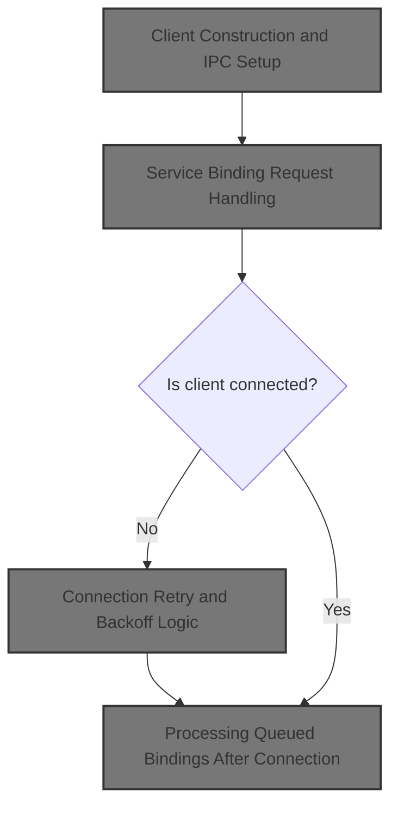
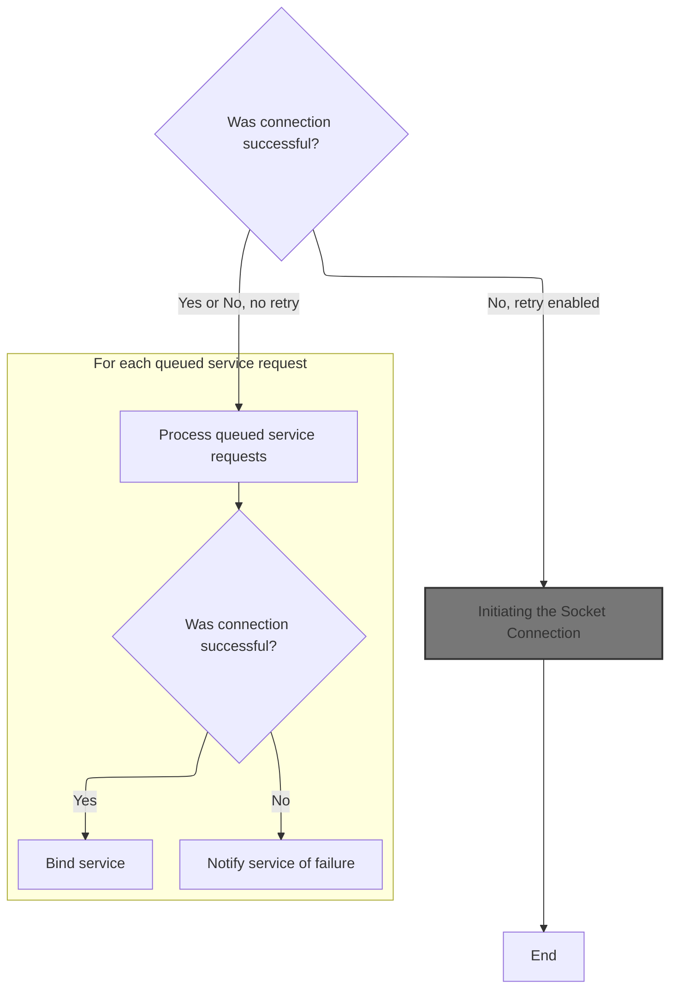
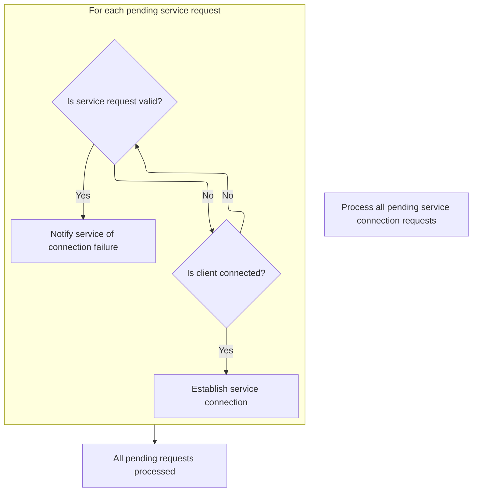

This document describes how a client establishes and manages a connection to a service, ensuring that service requests are processed reliably. If the connection is not immediately available, requests are queued and retried until they can be processed or notified of failure.



# Client Construction and IPC Setup

<SwmSnippet path="/src/tracing/ipc/consumer/consumer_ipc_client_impl.cc" line="46">

---

<SwmToken path="src/tracing/ipc/consumer/consumer_ipc_client_impl.cc" pos="46:0:2" line-data="ConsumerIPCClientImpl::ConsumerIPCClientImpl(const char* service_sock_name,">`ConsumerIPCClientImpl::ConsumerIPCClientImpl`</SwmToken> kicks off the flow by creating an IPC client instance with the given socket name and task runner, explicitly disabling socket retry. It then binds the <SwmToken path="src/tracing/ipc/consumer/consumer_ipc_client_impl.cc" pos="53:1:1" line-data="      consumer_port_(this /* event_listener */),">`consumer_port_`</SwmToken> (which acts as the event listener) to the IPC channel using a weak pointer, so callbacks are safe even if the <SwmToken path="src/tracing/ipc/consumer/consumer_ipc_client_impl.cc" pos="53:1:1" line-data="      consumer_port_(this /* event_listener */),">`consumer_port_`</SwmToken> is destroyed. Next, we need to look at <SwmPath>[src/ipc/client_impl.cc](src/ipc/client_impl.cc)</SwmPath> to see how the actual service binding is handled after this setup.

```c++
ConsumerIPCClientImpl::ConsumerIPCClientImpl(const char* service_sock_name,
                                             Consumer* consumer,
                                             base::TaskRunner* task_runner)
    : consumer_(consumer),
      ipc_channel_(
          ipc::Client::CreateInstance({service_sock_name, /*sock_retry=*/false},
                                      task_runner)),
      consumer_port_(this /* event_listener */),
      weak_ptr_factory_(this) {
  ipc_channel_->BindService(consumer_port_.GetWeakPtr());
}
```

---

</SwmSnippet>

# Service Binding Request Handling

<SwmSnippet path="/src/ipc/client_impl.cc" line="83">

---

In <SwmToken path="src/ipc/client_impl.cc" pos="83:2:4" line-data="void ClientImpl::BindService(base::WeakPtr&lt;ServiceProxy&gt; service_proxy) {">`ClientImpl::BindService`</SwmToken>, if the socket isn't connected, the service proxy is queued for later. If connected, it assigns a new request ID, builds a Frame with the service name, and sends it. If sending fails, it notifies the service proxy of the failure. Next, we need to see how connection events are handled, especially failures and retries.

```c++
void ClientImpl::BindService(base::WeakPtr<ServiceProxy> service_proxy) {
  if (!service_proxy)
    return;
  if (!sock_->is_connected()) {
    queued_bindings_.emplace_back(service_proxy);
    return;
  }
  RequestID request_id = ++last_request_id_;
  Frame frame;
  frame.set_request_id(request_id);
  Frame::BindService* req = frame.mutable_msg_bind_service();
  const char* const service_name = service_proxy->GetDescriptor().service_name;
  req->set_service_name(service_name);
  if (!SendFrame(frame)) {
    PERFETTO_DLOG("BindService(%s) failed", service_name);
    return service_proxy->OnConnect(false /* success */);
  }
```

---

</SwmSnippet>

## Connection Retry and Backoff Logic



<SwmSnippet path="/src/ipc/client_impl.cc" line="154">

---

In <SwmToken path="src/ipc/client_impl.cc" pos="154:2:4" line-data="void ClientImpl::OnConnect(base::UnixSocket*, bool connected) {">`ClientImpl::OnConnect`</SwmToken>, if the connection fails and retries are enabled, it schedules a reconnect with increasing backoff, using a weak pointer to avoid use-after-free if the object is destroyed. Next, we need to see how the actual connection attempt is made.

```c++
void ClientImpl::OnConnect(base::UnixSocket*, bool connected) {
  if (!connected && socket_retry_) {
    socket_backoff_ms_ =
        (socket_backoff_ms_ < 10000) ? socket_backoff_ms_ + 1000 : 30000;
    PERFETTO_DLOG(
        "Connection to traced's UNIX socket failed, retrying in %u seconds",
        socket_backoff_ms_ / 1000);
    auto weak_this = weak_ptr_factory_.GetWeakPtr();
    task_runner_->PostDelayedTask(
        [weak_this] {
          if (weak_this)
            static_cast<ClientImpl&>(*weak_this).TryConnect();
        },
        socket_backoff_ms_);
    return;
  }

```

---

</SwmSnippet>

### Initiating the Socket Connection

<SwmSnippet path="/src/ipc/client_impl.cc" line="76">

---

<SwmToken path="src/ipc/client_impl.cc" pos="76:2:4" line-data="void ClientImpl::TryConnect() {">`ClientImpl::TryConnect`</SwmToken> triggers the actual socket connection using <SwmToken path="src/ipc/client_impl.cc" pos="78:7:7" line-data="  sock_ = base::UnixSocket::Connect(">`UnixSocket`</SwmToken>::Connect, passing all the config needed for a Unix domain stream socket. Next, we need to see how the socket connection is handled in <SwmPath>[src/base/unix_socket.cc](src/base/unix_socket.cc)</SwmPath>.

```c++
void ClientImpl::TryConnect() {
  PERFETTO_DCHECK(socket_name_);
  sock_ = base::UnixSocket::Connect(
      socket_name_, this, task_runner_, base::GetSockFamily(socket_name_),
      base::SockType::kStream, base::SockPeerCredMode::kIgnore);
}
```

---

</SwmSnippet>

### Socket Object Creation and Connection Start

<SwmSnippet path="/src/base/unix_socket.cc" line="921">

---

<SwmToken path="src/base/unix_socket.cc" pos="921:7:9" line-data="std::unique_ptr&lt;UnixSocket&gt; UnixSocket::Connect(">`UnixSocket::Connect`</SwmToken> creates a <SwmToken path="src/base/unix_socket.cc" pos="921:4:4" line-data="std::unique_ptr&lt;UnixSocket&gt; UnixSocket::Connect(">`UnixSocket`</SwmToken> object with the provided config, calls <SwmToken path="src/base/unix_socket.cc" pos="930:3:3" line-data="  sock-&gt;DoConnect(socket_name);">`DoConnect`</SwmToken> to start the connection, and returns ownership via <SwmToken path="src/base/unix_socket.cc" pos="921:2:2" line-data="std::unique_ptr&lt;UnixSocket&gt; UnixSocket::Connect(">`unique_ptr`</SwmToken>. Next, we need to see how <SwmToken path="src/base/unix_socket.cc" pos="930:3:3" line-data="  sock-&gt;DoConnect(socket_name);">`DoConnect`</SwmToken> handles the actual connection process, especially async cases.

```c++
std::unique_ptr<UnixSocket> UnixSocket::Connect(
    const std::string& socket_name,
    EventListener* event_listener,
    TaskRunner* task_runner,
    SockFamily sock_family,
    SockType sock_type,
    SockPeerCredMode peer_cred_mode) {
  std::unique_ptr<UnixSocket> sock(new UnixSocket(
      event_listener, task_runner, sock_family, sock_type, peer_cred_mode));
  sock->DoConnect(socket_name);
  return sock;
}
```

---

</SwmSnippet>

<SwmSnippet path="/src/base/unix_socket.cc" line="1029">

---

<SwmToken path="src/base/unix_socket.cc" pos="1029:2:4" line-data="void UnixSocket::DoConnect(const std::string&amp; socket_name) {">`UnixSocket::DoConnect`</SwmToken> tries to connect the socket and, regardless of whether it's immediate or async (EINPROGRESS), always posts a task to handle completion via <SwmToken path="src/base/unix_socket.cc" pos="1048:7:7" line-data="  // Posting the OnEvent() below emulates a wakeup of the FD watch. OnEvent(),">`OnEvent`</SwmToken>. This keeps connection handling uniform and safe, using a weak pointer to avoid use-after-free. Next, we return to <SwmPath>[src/ipc/client_impl.cc](src/ipc/client_impl.cc)</SwmPath> to process queued bindings after connection.

```c++
void UnixSocket::DoConnect(const std::string& socket_name) {
  PERFETTO_DCHECK(state_ == State::kDisconnected);

  // This is the only thing that can gracefully fail in the ctor.
  if (!sock_raw_)
    return NotifyConnectionState(false);

  if (!sock_raw_.Connect(socket_name))
    return NotifyConnectionState(false);

  // At this point either connect() succeeded or started asynchronously
  // (errno = EINPROGRESS).
  state_ = State::kConnecting;

  // Even if the socket is non-blocking, connecting to a UNIX socket can be
  // acknowledged straight away rather than returning EINPROGRESS.
  // The decision here is to deal with the two cases uniformly, at the cost of
  // delaying the straight-away-connect() case by one task, to avoid depending
  // on implementation details of UNIX socket on the various OSes.
  // Posting the OnEvent() below emulates a wakeup of the FD watch. OnEvent(),
  // which knows how to deal with spurious wakeups, will poll the SO_ERROR and
  // evolve, if necessary, the state into either kConnected or kDisconnected.
  WeakPtr<UnixSocket> weak_ptr = weak_ptr_factory_.GetWeakPtr();
  task_runner_->PostTask([weak_ptr] {
    if (weak_ptr)
      weak_ptr->OnEvent();
  });
}
```

---

</SwmSnippet>

### Processing Queued Bindings After Connection



<SwmSnippet path="/src/ipc/client_impl.cc" line="171">

---

After handling queued bindings, the function returns and warns not to use the object anymore.

```c++
  // Drain the BindService() calls that were queued before establishing the
  // connection with the host. Note that if we got disconnected, the call to
  // OnConnect below might delete |this|, so move everything on the stack first.
  auto queued_bindings = std::move(queued_bindings_);
  queued_bindings_.clear();
  for (base::WeakPtr<ServiceProxy>& service_proxy : queued_bindings) {
    if (connected) {
      BindService(service_proxy);
    } else if (service_proxy) {
      service_proxy->OnConnect(false /* success */);
    }
  }
```

---

</SwmSnippet>

<SwmSnippet path="/src/ipc/client_impl.cc" line="183">

---

After handling queued bindings, the function returns and warns not to use the object anymore.

```c++
  // Don't access |this| below here.
}
```

---

</SwmSnippet>

## Tracking Outstanding Bind Requests

<SwmSnippet path="/src/ipc/client_impl.cc" line="100">

---

Back in <SwmToken path="src/ipc/client_impl.cc" pos="83:2:4" line-data="void ClientImpl::BindService(base::WeakPtr&lt;ServiceProxy&gt; service_proxy) {">`ClientImpl::BindService`</SwmToken>, after sending the bind request, it stores the request details in a map by request ID. This lets the client track which requests are still pending and handle their completion or failure.

```c++
  QueuedRequest qr;
  qr.type = Frame::kMsgBindServiceFieldNumber;
  qr.request_id = request_id;
  qr.service_proxy = service_proxy;
  queued_requests_.emplace(request_id, std::move(qr));
}
```

---

</SwmSnippet>

&nbsp;

*This is an auto-generated document by Swimm 🌊 and has not yet been verified by a human*

<SwmMeta version="3.0.0" repo-id="Z2l0aHViJTNBJTNBY3BsdXNwbHVzLXBlcmZldHRvJTNBJTNBcmljYXJkb2xvcGV6Zw==" repo-name="cplusplus-perfetto"><sup>Powered by [Swimm](https://app.swimm.io/)</sup></SwmMeta>
