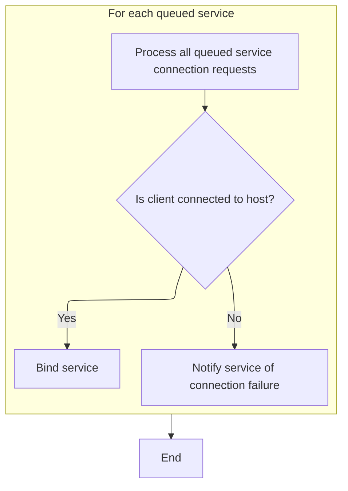

This document describes how connection attempts to a remote service are managed, including retrying failed attempts and handling queued service binding requests. The flow receives a connection attempt and any pending service bindings as input, and outputs either a successful connection with bound services or notifications of failure.

# Handling Connection Attempts and Retries

<SwmSnippet path="/src/ipc/client_impl.cc" line="154">

---

In <SwmToken path="src/ipc/client_impl.cc" pos="154:4:4" line-data="void ClientImpl::OnConnect(base::UnixSocket*, bool connected) {">`OnConnect`</SwmToken>, we check if the socket failed to connect and if retries are enabled. If so, we schedule another connection attempt using a delayed task with an increasing backoff. This sets up the retry logic and hands off to <SwmToken path="src/ipc/client_impl.cc" pos="165:10:10" line-data="            static_cast&lt;ClientImpl&amp;&gt;(*weak_this).TryConnect();">`TryConnect`</SwmToken> for the actual connection attempt.

```c++
void ClientImpl::OnConnect(base::UnixSocket*, bool connected) {
  if (!connected && socket_retry_) {
    socket_backoff_ms_ =
        (socket_backoff_ms_ < 10000) ? socket_backoff_ms_ + 1000 : 30000;
    PERFETTO_DLOG(
        "Connection to traced's UNIX socket failed, retrying in %u seconds",
        socket_backoff_ms_ / 1000);
    auto weak_this = weak_ptr_factory_.GetWeakPtr();
    task_runner_->PostDelayedTask(
        [weak_this] {
          if (weak_this)
            static_cast<ClientImpl&>(*weak_this).TryConnect();
        },
        socket_backoff_ms_);
    return;
  }

```

---

</SwmSnippet>

## Initiating a Socket Connection

<SwmSnippet path="/src/ipc/client_impl.cc" line="76">

---

<SwmToken path="src/ipc/client_impl.cc" pos="76:4:4" line-data="void ClientImpl::TryConnect() {">`TryConnect`</SwmToken> kicks off the actual socket connection by calling into <SwmToken path="src/ipc/client_impl.cc" pos="78:7:7" line-data="  sock_ = base::UnixSocket::Connect(">`UnixSocket`</SwmToken>::Connect with all the necessary parameters. This hands off the connection logic to the lower-level socket implementation.

```c++
void ClientImpl::TryConnect() {
  PERFETTO_DCHECK(socket_name_);
  sock_ = base::UnixSocket::Connect(
      socket_name_, this, task_runner_, base::GetSockFamily(socket_name_),
      base::SockType::kStream, base::SockPeerCredMode::kIgnore);
}
```

---

</SwmSnippet>

## Creating and Connecting the Unix Socket

<SwmSnippet path="/src/base/unix_socket.cc" line="921">

---

<SwmToken path="src/base/unix_socket.cc" pos="921:9:9" line-data="std::unique_ptr&lt;UnixSocket&gt; UnixSocket::Connect(">`Connect`</SwmToken> allocates a new <SwmToken path="src/base/unix_socket.cc" pos="921:4:4" line-data="std::unique_ptr&lt;UnixSocket&gt; UnixSocket::Connect(">`UnixSocket`</SwmToken> object and immediately calls <SwmToken path="src/base/unix_socket.cc" pos="930:3:3" line-data="  sock-&gt;DoConnect(socket_name);">`DoConnect`</SwmToken> to start the connection process. This sets up the socket and begins the connection handshake.

```c++
std::unique_ptr<UnixSocket> UnixSocket::Connect(
    const std::string& socket_name,
    EventListener* event_listener,
    TaskRunner* task_runner,
    SockFamily sock_family,
    SockType sock_type,
    SockPeerCredMode peer_cred_mode) {
  std::unique_ptr<UnixSocket> sock(new UnixSocket(
      event_listener, task_runner, sock_family, sock_type, peer_cred_mode));
  sock->DoConnect(socket_name);
  return sock;
}
```

---

</SwmSnippet>

<SwmSnippet path="/src/base/unix_socket.cc" line="1029">

---

<SwmToken path="src/base/unix_socket.cc" pos="1029:4:4" line-data="void UnixSocket::DoConnect(const std::string&amp; socket_name) {">`DoConnect`</SwmToken> manages the connection attempt and posts a task to handle completion, so both sync and async connects are treated the same way.

```c++
void UnixSocket::DoConnect(const std::string& socket_name) {
  PERFETTO_DCHECK(state_ == State::kDisconnected);

  // This is the only thing that can gracefully fail in the ctor.
  if (!sock_raw_)
    return NotifyConnectionState(false);

  if (!sock_raw_.Connect(socket_name))
    return NotifyConnectionState(false);

  // At this point either connect() succeeded or started asynchronously
  // (errno = EINPROGRESS).
  state_ = State::kConnecting;

  // Even if the socket is non-blocking, connecting to a UNIX socket can be
  // acknowledged straight away rather than returning EINPROGRESS.
  // The decision here is to deal with the two cases uniformly, at the cost of
  // delaying the straight-away-connect() case by one task, to avoid depending
  // on implementation details of UNIX socket on the various OSes.
  // Posting the OnEvent() below emulates a wakeup of the FD watch. OnEvent(),
  // which knows how to deal with spurious wakeups, will poll the SO_ERROR and
  // evolve, if necessary, the state into either kConnected or kDisconnected.
  WeakPtr<UnixSocket> weak_ptr = weak_ptr_factory_.GetWeakPtr();
  task_runner_->PostTask([weak_ptr] {
    if (weak_ptr)
      weak_ptr->OnEvent();
  });
}
```

---

</SwmSnippet>

## Processing Queued Service Bindings After Connection



<SwmSnippet path="/src/ipc/client_impl.cc" line="171">

---

Back in <SwmToken path="src/ipc/client_impl.cc" pos="173:3:3" line-data="  // OnConnect below might delete |this|, so move everything on the stack first.">`OnConnect`</SwmToken> after <SwmToken path="src/ipc/client_impl.cc" pos="76:4:4" line-data="void ClientImpl::TryConnect() {">`TryConnect`</SwmToken>, we process any queued service bindings. If the connection succeeded, we bind each service; if not, we notify them of the failure. Moving the queue to the stack avoids issues if <SwmToken path="src/ipc/client_impl.cc" pos="173:3:3" line-data="  // OnConnect below might delete |this|, so move everything on the stack first.">`OnConnect`</SwmToken> deletes the object.

```c++
  // Drain the BindService() calls that were queued before establishing the
  // connection with the host. Note that if we got disconnected, the call to
  // OnConnect below might delete |this|, so move everything on the stack first.
  auto queued_bindings = std::move(queued_bindings_);
  queued_bindings_.clear();
  for (base::WeakPtr<ServiceProxy>& service_proxy : queued_bindings) {
    if (connected) {
      BindService(service_proxy);
    } else if (service_proxy) {
      service_proxy->OnConnect(false /* success */);
    }
  }
```

---

</SwmSnippet>

<SwmSnippet path="/src/ipc/client_impl.cc" line="183">

---

<SwmToken path="src/ipc/client_impl.cc" pos="154:4:4" line-data="void ClientImpl::OnConnect(base::UnixSocket*, bool connected) {">`OnConnect`</SwmToken> finishes with a warning not to touch 'this' due to possible deletion.

```c++
  // Don't access |this| below here.
}
```

---

</SwmSnippet>

&nbsp;

*This is an auto-generated document by Swimm 🌊 and has not yet been verified by a human*

<SwmMeta version="3.0.0" repo-id="Z2l0aHViJTNBJTNBY3BsdXNwbHVzLXBlcmZldHRvJTNBJTNBcmljYXJkb2xvcGV6Zw==" repo-name="cplusplus-perfetto"><sup>Powered by [Swimm](https://app.swimm.io/)</sup></SwmMeta>
